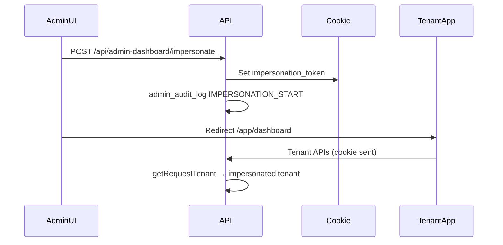

# Admin Impersonation Audit

Last updated: 2026-05-28

**Feature spec (user-facing):** [features/admin-impersonation.md](./features/admin-impersonation.md)

## 1. Architecture

Impersonation lets platform **ADMIN** users open the tenant app as a **Restaurant** or **Supplier** without knowing tenant passwords.

| Layer            | Mechanism                                                                                                                          |
| ---------------- | ---------------------------------------------------------------------------------------------------------------------------------- |
| Token            | Signed JWT in httpOnly cookie `impersonation_token` (`IMPERSONATION_SECRET`, default TTL `IMPERSONATION_MAX_DURATION_MINUTES`)     |
| Claims           | `adminUserId`, `tenantId`, `tenantType`, `tenantName`, `sessionId` (jti)                                                           |
| Middleware       | `impersonationContext` → `req.impersonationContext` on every request                                                               |
| Effective tenant | `getEffectiveTenant(req)` — only when cookie admin matches `req.userData.id`                                                       |
| API tenant scope | `getRequestTenant(req)` prefers impersonation, then active branch cookie, then normal tenant resolution                            |
| RBAC             | `requirePermission` allows ADMIN when impersonating; `requireRole` allows ADMIN when impersonated `tenantType` is in allowed roles |
| Audit            | `admin_audit_log`: `IMPERSONATION_START` / `IMPERSONATION_END`; `audit_logs`: `impersonation.blocked_action` for blocked mutations |

## 2. APIs

| Method | Path                                    | Purpose                                                                |
| ------ | --------------------------------------- | ---------------------------------------------------------------------- |
| POST   | `/api/admin-dashboard/impersonate`      | Start session; body: `{ tenantId, tenantType, acknowledgeSuspended? }` |
| GET    | `/api/admin-dashboard/impersonate`      | Status for banner                                                      |
| POST   | `/api/admin-dashboard/impersonate/stop` | End session                                                            |
| POST   | `/api/auth/logout`                      | Clears impersonation cookie                                            |

Admin routes require `ADMIN` + `ADMIN_ACCESS`. Impersonation cannot target a contact email that belongs to an `app_user` with role `ADMIN`.

Suspended/inactive tenants: returns `403 TENANT_SUSPENDED` with `requiresAcknowledgement: true` unless `acknowledgeSuspended: true`.

## 3. Frontend components

| Component / hook                   | Role                                                                                      |
| ---------------------------------- | ----------------------------------------------------------------------------------------- |
| `useImpersonation`                 | Central: `isImpersonating`, `effectiveRole`, `shouldLoadTenantEntitlements`               |
| `ImpersonationBanner`              | Sticky banner: “Impersonating …” + Exit                                                   |
| `Layout`                           | Redirect off `/app/admin` when impersonating; load entitlements/billing for impersonation |
| `Sidebar`                          | Tenant nav when impersonating (restaurant vs supplier)                                    |
| `BranchContext` / `BranchSwitcher` | Branches/org switch during impersonation                                                  |
| `AdminDashboardPage`               | Impersonate action → `/app/dashboard`                                                     |
| `usePermissions`                   | Full tenant permissions while impersonating (matches backend)                             |

## 4. Why it only worked on the dashboard

1. **UI used `user.role === 'ADMIN'`** — pages and hooks skipped tenant APIs (entitlements, orders UI mode, branch lists).
2. **`useEntitlements` skipped for ADMIN** — feature gates and sidebar items were wrong.
3. **`requireRole(['RESTAURANT'|'SUPPLIER'])` without ADMIN** — some routes returned 403 (warehouses, supplier-only endpoints).
4. **Org/branch context** — `requireRestaurantOrgContext` / `requireSupplierOrgContext` did not resolve org from impersonated tenant; branch lists were empty for admin.
5. **`getRequestTenant` ignored active branch cookie** during impersonation — branch switch had no effect.

Dashboard partially worked because `DashboardPage` already had impersonation-aware `effectiveRole` and stats query skip logic.

## 5. Fixes made

- **`requireRole`**: ADMIN allowed when impersonating matching `tenantType`.
- **`getRequestTenant`**: Active branch cookie honored under impersonation via `impersonationCanAccessBranch`.
- **Org routes**: Resolve org from impersonated tenant; list all branches for impersonating admin.
- **`canSwitchActiveTenant`**: Branch switch allowed within impersonated org/links.
- **Frontend `useImpersonation`**: Effective tenant role across Layout, Sidebar, BranchContext, key pages.
- **Billing mutations**: Blocked during impersonation (`IMPERSONATION_RESTRICTED`).
- **Session `sessionId`**: In JWT and audit metadata.
- **Start flow**: Redirect to `/app/dashboard` (not reload on admin URL).

## 6. Security model

| Control                   | Behavior                                                          |
| ------------------------- | ----------------------------------------------------------------- |
| Who can impersonate       | `ADMIN` + `ADMIN_ACCESS` on admin-dashboard router                |
| Cannot impersonate admins | 403 if tenant `contact_email` is an ADMIN user                    |
| Cookie binding            | Token valid only for `adminUserId` that created it                |
| Short-lived               | JWT `exp` + cookie `maxAge`                                       |
| Real actor                | Logs and audit always use authenticated admin `req.userData.id`   |
| Suspended tenants         | Blocked unless `acknowledgeSuspended: true`                       |
| Subscription suspended    | Tenant users blocked; admin impersonation still allowed (support) |

Passwords are never read or set. Impersonation does not change tier limits or pricing.

## 7. Allowed / blocked actions

| Category                                                            | While impersonating                         |
| ------------------------------------------------------------------- | ------------------------------------------- |
| View dashboard, orders, products, inventory, settings (read)        | Allowed                                     |
| Normal tenant mutations (orders, inventory adjustments, chat, etc.) | Allowed (audited as admin actor)            |
| Billing: add/remove payment method, checkout, pay-now, auto-renew   | **Blocked** (`IMPERSONATION_RESTRICTED`)    |
| Admin-dashboard plan/subscription changes                           | Use admin UI (not impersonation)            |
| Delete tenant / bulk destructive admin ops                          | Admin routes only; not exposed in tenant UI |

Blocked attempts write `audit_logs.action_type = impersonation.blocked_action`.

## 8. Audit / logging

| Event            | Store             | Fields                                                            |
| ---------------- | ----------------- | ----------------------------------------------------------------- |
| Start            | `admin_audit_log` | `IMPERSONATION_START`, tenant id/type, `impersonation_session_id` |
| End              | `admin_audit_log` | `IMPERSONATION_END`                                               |
| Blocked mutation | `audit_logs`      | `impersonation.blocked_action`, session id, path                  |
| Request logs     | AsyncLocalStorage | `[admin:adminUserId]` when impersonating                          |

## 9. Manual QA checklist

- [ ] Admin impersonates restaurant → lands on dashboard, restaurant sidebar
- [ ] Navigate: orders, reservations, inventory, settings, disputes
- [ ] Switch branch (multi-branch tenant)
- [ ] Exit impersonation → admin dashboard
- [ ] Admin impersonates supplier → supplier sidebar
- [ ] Navigate: products, orders, warehouses/fulfillment, settings
- [ ] Banner on all pages; refresh keeps session until expiry
- [ ] Logout clears impersonation
- [ ] Audit shows start/end
- [ ] Billing checkout blocked while impersonating
- [ ] Suspended tenant requires confirm before impersonate
- [ ] Non-admin cannot call impersonate API

## 10. Remaining risks

- **Broad write access**: Impersonation allows most tenant writes; rely on audit review for sensitive changes.
- **Email/notifications**: Order/chat flows may still send real notifications unless separately gated.
- **Pages not yet using `useImpersonation`**: Minor pages (e.g. some reports/chat edge cases) may still key off `user.role`.
- **Deals/promotions**: Not modified; if issues appear, check route `requireRole` + frontend role checks only.

## Tests

- `apps/api/src/lib/impersonation.test.js`
- `apps/api/src/lib/rbac.impersonation.test.js`
- `apps/api/src/lib/impersonation-guards.test.js`

Run: `npm test --workspace=apps/api -- impersonation`
