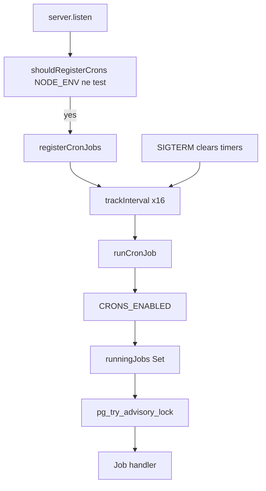

# Cron & Background Jobs Audit

**Date:** 2026-06-11  
**Scope:** All scheduled/background task logic in Supplify API (`apps/api`)

---

## 1. Summary

Supplify runs **16 in-process cron jobs** inside the API server (`setInterval` + PostgreSQL advisory locks). There is no separate worker process, Bull/BullMQ queue, or Railway cron service.

| Metric               | Value                                                                           |
| -------------------- | ------------------------------------------------------------------------------- |
| Registered jobs      | 16                                                                              |
| Master kill switch   | `CRONS_ENABLED` (default `true`; manual triggers bypass via `runManualCronJob`) |
| Multi-replica safety | PG `pg_try_advisory_lock` per job + in-process guard                            |
| Migrations           | `0152_billing_trial_reminder_log.sql`, `0153_cron_followup_infrastructure.sql`  |

**Hardening pass (initial):**

- Claim-before-notify idempotency for inventory expiry and reorder cadence reminders
- Observability: structured result logging + `recentCronFailures` ring buffer
- Manual dry-run CLI (`pnpm jobs:list`, `pnpm jobs:run`)

**Follow-up pass (implemented):**

- `email_retry` — retries failed sends with stored `retry_payload` (max 3 attempts)
- `email_digest` — daily digest for users with `notify_email_digest=true`
- `stale_gps_alerts` — proactive supplier alerts when active delivery GPS goes stale
- `log_retention` — purges old notification/email/audit/session rows
- Reorder cadence uses **restaurant IANA timezone** (`restaurant.timezone`, default `Asia/Beirut`)
- Manual HTTP triggers use `runManualCronJob` (advisory lock + bypass `CRONS_ENABLED`)

**Remaining risks:** Draft cart cleanup not implemented; supplier intelligence auto-outreach still manual-only; email retry only works when `retry_payload` was persisted (emails sent after this deploy).

---

## 2. Scheduler architecture



**Key files:**

- [`apps/api/src/lib/register-cron-jobs.js`](../../apps/api/src/lib/register-cron-jobs.js) — registration
- [`apps/api/src/lib/cron-runner.js`](../../apps/api/src/lib/cron-runner.js) — lock + logging
- [`apps/api/src/server.js`](../../apps/api/src/server.js) — calls `registerCronJobs` on listen

**Non-job periodic infra:**

- DB pool keepalive (`db.js`, 60s in production)
- OAuth session prune (`session-store.js`, 15 min via `connect-pg-simple`)
- Memory monitor (`memory-monitor.js`, when `MEMORY_DEBUG` or dev)

---

## 3. Job inventory

| Job key                     | Handler                             | Interval         | Env flags                                                 | Risk tags                                        |
| --------------------------- | ----------------------------------- | ---------------- | --------------------------------------------------------- | ------------------------------------------------ |
| `scheduled_orders`          | `scheduled-orders.service.js`       | 5m dev / 1h prod | `CRONS_ENABLED`, `CRON_SCHEDULED_ORDERS_INTERVAL_MS`      | Manual HTTP bypasses lock                        |
| `invoice_overdue`           | `invoice-overdue.job.js`            | 24h              | `CRONS_ENABLED`                                           | One-shot notify only                             |
| `subscription_billing`      | `subscription-billing.job.js`       | 1h               | `CRONS_ENABLED`                                           | Notify outside txn (low risk)                    |
| `waitlist_offers`           | `waitlistPromotion.js`              | 15m              | `CRONS_ENABLED`                                           | OK                                               |
| `promotions_expiry`         | `promotions-expiry.job.js`          | 30m              | `CRONS_ENABLED`                                           | OK                                               |
| `invitation_expiry`         | branch + restaurant invitation libs | 1h               | `CRONS_ENABLED`                                           | OK                                               |
| `free_sandbox_expiry`       | `free-sandbox-expiry.job.js`        | 1h               | `CRONS_ENABLED`                                           | OK                                               |
| `trial_ending_soon`         | `trial-ending-soon.job.js`          | 1h               | `CRONS_ENABLED`                                           | **NEW** — dedup via `billing_trial_reminder_log` |
| `fulfillment_exceptions`    | `fulfillment-exceptions.job.js`     | 30m              | `CRONS_ENABLED`                                           | Batched LIMIT 200; no notifications              |
| `delivery_rollover`         | `delivery-rollover.job.js`          | 1h               | `CRONS_ENABLED`, `DELIVERY_ROLLOVER_ENABLED`              | Disabled by default                              |
| `operational_reminders`     | `operational-reminders.job.js`      | 24h              | `CRONS_ENABLED`, `CRON_OPERATIONAL_REMINDERS_INTERVAL_MS` | Sub-jobs below                                   |
| `driver_location_retention` | `driver-location-retention.job.js`  | 24h              | `CRONS_ENABLED`, `GPS_LOCATION_RETENTION_DAYS`            | OK                                               |
| `email_retry`               | `email-retry.job.js`                | 1h               | `CRONS_ENABLED`, `EMAIL_RETRY_*`                          | Requires `retry_payload` on row                  |
| `email_digest`              | `email-digest.job.js`               | 24h              | `CRONS_ENABLED`, `notify_email_digest` pref               | Opt-in per user                                  |
| `stale_gps_alerts`          | `stale-gps-alerts.job.js`           | 15m              | `CRONS_ENABLED`, `GPS_TRACKING_ENABLED`                   | Dedup `gps_stale_alert_log`                      |
| `log_retention`             | `log-retention.job.js`              | 24h              | `CRONS_ENABLED`, `*_RETENTION_DAYS`                       | Skips when days=0                                |

**`operational_reminders` sub-tasks:**

1. `inventory-expiry.service.js` → grouped expiry notifications (claim-before-notify)
2. `reorder-cadence.service.js` → recompute patterns + missed-order reminders (claim-before-notify, `smart_reorder` gate)

---

## 4. Environment flags

| Variable                                 | Default                 | Purpose                              |
| ---------------------------------------- | ----------------------- | ------------------------------------ |
| `CRONS_ENABLED`                          | `true`                  | Master switch; `false` in test setup |
| `CRON_SCHEDULED_ORDERS_INTERVAL_MS`      | 300000 / 3600000 (prod) | Quick list poll                      |
| `CRON_OPERATIONAL_REMINDERS_INTERVAL_MS` | 86400000                | Expiry + cadence                     |
| `CRON_DELIVERY_ROLLOVER_INTERVAL_MS`     | 3600000                 | Delivery rollover                    |
| `DELIVERY_ROLLOVER_ENABLED`              | `false`                 | Rollover no-op unless true           |
| `GPS_LOCATION_RETENTION_DAYS`            | 90                      | GPS ping purge                       |
| `JOB_DRY_RUN`                            | unset                   | Set by `run-job.mjs --dry-run`       |

---

## 5. Jobs by feature area

### Trial / subscription

- `free_sandbox_expiry` — locks expired Free Trial (read-only)
- `trial_ending_soon` — **NEW** 2-day and 1-day reminders via `notifyBillingTrialEnding`
- `subscription_billing` — auto-renewal + grace-period lock

### Reorder assistance

- `operational_reminders` → cadence recompute + missed-order notifications
- `scheduled_orders` — scheduled quick list execution/reminders

### Inventory expiry

- `operational_reminders` → `runExpiryReminderCheck` (batched SQL, daily dedup)

### Notifications / email

- Inline send via `notification.service.js` / `email.service.js`
- **MISSING:** email digest cron, failed email retry worker

### Deals / promotions

- `promotions_expiry` — activate scheduled, expire by `ends_at` / `boost_end_at`

### GPS / delivery

- `driver_location_retention` — purge old pings
- `fulfillment_exceptions` — overdue delivery, missing POD, unassigned orders
- `delivery_rollover` — roll undelivered assignments (feature-flagged)
- **MISSING:** stale GPS proactive notification cron

### Invoices / payments

- `invoice_overdue` — mark OVERDUE + one-shot notify

### Cleanup

- `invitation_expiry`, `waitlist_offers`, `driver_location_retention`, OAuth session prune
- **MISSING:** `notification_log`, `email_delivery_log`, audit log, draft cart retention

---

## 6. Schedules / frequencies

| Job                                                     | Interval                 |
| ------------------------------------------------------- | ------------------------ |
| Scheduled orders                                        | 5 min (dev) / 1 h (prod) |
| Waitlist offers                                         | 15 min                   |
| Promotions expiry                                       | 30 min                   |
| Fulfillment exceptions                                  | 30 min                   |
| Subscription billing                                    | 1 h                      |
| Invitations / sandbox / trial / delivery rollover       | 1 h                      |
| Invoice overdue / operational reminders / GPS retention | 24 h                     |

All jobs also run **once immediately on API boot** (except when `NODE_ENV=test`).

---

## 7. Tables touched

| Job                       | Primary tables                                                                                                              |
| ------------------------- | --------------------------------------------------------------------------------------------------------------------------- |
| scheduled_orders          | `quick_list`, `quick_list_execution`, `customer_order`                                                                      |
| invoice_overdue           | `invoice`                                                                                                                   |
| subscription_billing      | `subscription`, `billing_payment_method`, `billing_invoice`                                                                 |
| waitlist_offers           | waitlist / reservation tables                                                                                               |
| promotions_expiry         | `promotions`                                                                                                                |
| invitation_expiry         | `branch_invitations`, `restaurant_invitations`                                                                              |
| free_sandbox_expiry       | `subscription`                                                                                                              |
| trial_ending_soon         | `subscription`, `billing_trial_reminder_log`                                                                                |
| fulfillment_exceptions    | `fulfillment_exceptions`, `driver_assignments`, `customer_order`                                                            |
| delivery_rollover         | `driver_assignments`, `delivery_route`, `route_stop`                                                                        |
| operational_reminders     | `restaurant_inventory_lot`, `inventory_expiry_notification_log`, `restaurant_order_cadence`, `reorder_cadence_reminder_log` |
| driver_location_retention | `driver_location_ping`                                                                                                      |

---

## 8. Side effects (notifications / email)

| Job                       | Notifications                                       |
| ------------------------- | --------------------------------------------------- |
| scheduled_orders          | Scheduled order reminders (may auto-place orders)   |
| invoice_overdue           | `notifyInvoiceOverdue` (restaurant + supplier)      |
| subscription_billing      | Renewed / payment failed / account locked           |
| free_sandbox_expiry       | Account locked (trial expired)                      |
| trial_ending_soon         | Trial ending soon                                   |
| promotions_expiry         | `notifyDealExpired` per newly expired deal          |
| delivery_rollover         | `notifyDeliveryRolloverBatch` (supplier)            |
| operational_reminders     | Inventory expiring/expired + reorder cadence missed |
| fulfillment_exceptions    | None (records only)                                 |
| driver_location_retention | None                                                |

---

## 9. Idempotency / deduplication

| Job                    | Protection                                                         | Notes                   |
| ---------------------- | ------------------------------------------------------------------ | ----------------------- |
| scheduled_orders       | `quick_list_execution` UNIQUE + `SKIP LOCKED`                      | OK                      |
| invoice_overdue        | `UPDATE … WHERE overdue_notified_at IS NULL`                       | One-shot                |
| subscription_billing   | `FOR UPDATE` + charge `idempotencyKey`                             | OK                      |
| promotions_expiry      | SQL status predicates; notify only new IDs                         | OK                      |
| free_sandbox_expiry    | SQL lock predicate                                                 | OK                      |
| trial_ending_soon      | `billing_trial_reminder_log` UNIQUE claim                          | **NEW**                 |
| inventory expiry       | `inventory_expiry_notification_log` INSERT claim **before** notify | **FIXED**               |
| reorder cadence        | `reorder_cadence_reminder_log` INSERT claim **before** notify      | **FIXED**               |
| fulfillment_exceptions | Skip if open exception exists                                      | **FIXED** logging count |
| waitlist               | `FOR UPDATE SKIP LOCKED`                                           | OK                      |

**Manual HTTP triggers bypass advisory lock:**

- `POST /api/quick-lists/execute-scheduled`
- `POST /api/restaurant-inventory/expiry/check-reminders`

---

## 10. Performance notes

| Job                       | Risk                     | Mitigation applied                                      |
| ------------------------- | ------------------------ | ------------------------------------------------------- |
| inventory expiry          | Was N+1 per restaurant   | **Batched** `GROUP BY restaurant_id` aggregate query    |
| reorder cadence reminders | Was N+1 `hasRecentOrder` | **Single SQL** anti-join in `getMissedCadencesForToday` |
| fulfillment_exceptions    | Unbounded scan           | **LIMIT 200** per check type per tick                   |
| reorder cadence recompute | Per-row INSERT loop      | Documented; batch INSERT follow-up                      |
| subscription_billing      | Unbounded renewal loop   | Per-row try/catch; document batch follow-up             |

**Indexes:** `restaurant_inventory_lot(restaurant_id, expiry_date)` exists (migration 0133). No new index migration required.

---

## 11. Manual run / dry-run instructions

```bash
cd apps/api

# List all jobs
pnpm jobs:list

# Dry-run (no mutations / no notifications where supported)
pnpm jobs:run -- operational-reminders --dry-run
pnpm jobs:run -- inventory-expiry --dry-run
pnpm jobs:run -- reorder-cadence --dry-run
pnpm jobs:run -- trial-ending-soon --dry-run
pnpm jobs:run -- invoice-overdue --dry-run
pnpm jobs:run -- free-sandbox-expiry --dry-run

# Per-tenant
pnpm jobs:run -- inventory-expiry --dry-run --tenant=<restaurant-uuid>

# Delivery rollover (existing + unified CLI)
node scripts/run-delivery-rollover.mjs --force
pnpm jobs:run -- delivery-rollover --force
```

**HTTP manual triggers (auth required):**

- `POST /api/quick-lists/execute-scheduled`
- `POST /api/restaurant-inventory/expiry/check-reminders`

**Admin health:** `GET /api/admin-dashboard/health` → `jobFailures` from recent cron failures ring buffer.

---

## 12. Tests added / run

| Test file                            | Coverage                                                  |
| ------------------------------------ | --------------------------------------------------------- |
| `cron-runner.test.js`                | Lock, CRONS_ENABLED=false, result logging, failure buffer |
| `register-cron-jobs.test.js`         | 12 jobs registered, test env skip                         |
| `trial-ending-soon.job.test.js`      | Dedup claim + notify                                      |
| `subscription-billing.job.test.js`   | Empty run, missing tables                                 |
| `promotions-expiry.job.test.js`      | Notify only on expired IDs                                |
| `fulfillment-exceptions.job.test.js` | Created count accuracy                                    |
| `operational-reminders.job.test.js`  | Orchestration                                             |
| `restaurant-invitations.test.js`     | Expiry SQL                                                |
| `inventory-expiry.service.test.js`   | Dedup claim skip                                          |
| `reorder-cadence.service.test.js`    | Missed detection                                          |
| `free-sandbox-expiry.job.test.js`    | Trial lock (existing)                                     |
| `invoice-overdue.job.test.js`        | Idempotent UPDATE (existing)                              |

```bash
cd apps/api && pnpm test:run src/lib/cron-runner.test.js src/lib/register-cron-jobs.test.js src/jobs/*.test.js src/services/inventory-expiry.service.test.js src/services/reorder-cadence.service.test.js src/lib/restaurant-invitations.test.js
```

**Result:** 33 tests passed (2026-06-11).

---

## 13. Known risks

| Tag                                                  | Item                                                             |
| ---------------------------------------------------- | ---------------------------------------------------------------- |
| **FEATURE EXPECTS SCHEDULED JOB BUT JOB IS MISSING** | Email digest                                                     |
| **FEATURE EXPECTS SCHEDULED JOB BUT JOB IS MISSING** | Failed email retry worker                                        |
| **FEATURE EXPECTS SCHEDULED JOB BUT JOB IS MISSING** | Stale GPS proactive alerts                                       |
| **FEATURE EXPECTS SCHEDULED JOB BUT JOB IS MISSING** | Log/data retention (notifications, audit, carts, staff sessions) |
| **By design**                                        | Supplier intelligence at-risk auto-outreach (manual drafts only) |
| **By design**                                        | Recurring invoice overdue reminders (one-shot only)              |
| **Product limitation**                               | Reorder cadence uses UTC weekdays                                |
| **Operational**                                      | Manual HTTP job triggers bypass advisory lock                    |
| **Operational**                                      | Advisory lock requires DB connectivity at tick time              |

---

## 14. Follow-up recommendations

1. Add email retry worker scanning `email_delivery_log` WHERE `status='failed'`
2. Add optional daily digest job (tenant preference gated)
3. Add stale GPS notification cron for active `out_for_delivery` assignments
4. Add retention cron for `notification_log`, `email_delivery_log` (90-day default)
5. Expose remaining hardcoded intervals as env vars if ops needs tuning
6. Per-restaurant timezone for cadence and quick-list scheduling

---

## 15. Manual QA checklist

- [ ] Start API locally; confirm log `cron.registration_complete` with `jobCount: 12`
- [ ] Set `CRONS_ENABLED=false`; confirm `cron.disabled` debug logs, no mutations
- [ ] `pnpm jobs:run -- inventory-expiry --dry-run` — prints counts, no notifications
- [ ] `pnpm jobs:run -- operational-reminders --dry-run` — prints expiry + cadence preview
- [ ] `pnpm jobs:run -- trial-ending-soon --dry-run` — lists would-notify tenants
- [ ] Run inventory expiry job twice same day — no duplicate notifications
- [ ] Run reorder cadence job twice same day — no duplicate reminders
- [ ] Expired Free Trial tenant: GET works, POST returns 402
- [ ] Trial ending-soon notification appears once per window (2-day, 1-day)
- [ ] Deal past `ends_at` no longer visible after promotions cron
- [ ] Admin `/health` shows `jobFailures` after forcing a cron error
- [ ] Logs show `cron.started` / `cron.completed` with `durationMs` and `result`
