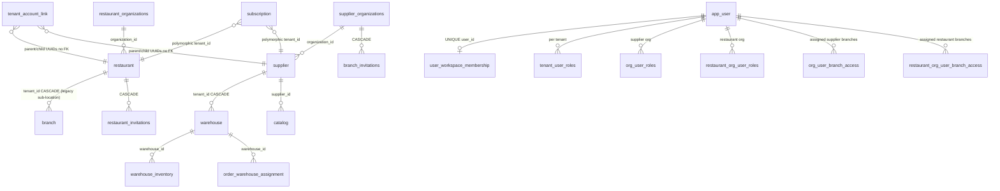

# Branches and Warehouses Architecture Audit

**Generated:** 2026-07-17  
**Scope:** Read-only audit of restaurant branches, supplier branches, organizations, locations, and warehouses.  
**Source of truth:** Live codebase and migrations under `apps/api` and `apps/web`.  
**Related prior audit:** `docs/archive/audits/branches-warehouses-audit.md` (2026-05-28) — superseded for product decisions by this document where they conflict.

**Restrictions observed:** No application code, migrations, tests, configuration, or runtime data were modified.

---

## 1. Executive summary

Supplify has **no unified `tenant` table**. A tenant is a row in **`restaurant`** or **`supplier`**, referenced polymorphically as `(tenant_id, tenant_type)` where `tenant_type ∈ {'RESTAURANT','SUPPLIER'}`.

There are **three concurrent “branch” concepts**:

| Concept                               | Storage                                               | Nature                                            | Product status                                       |
| ------------------------------------- | ----------------------------------------------------- | ------------------------------------------------- | ---------------------------------------------------- |
| **Org branch tenants (canonical)**    | `restaurant` / `supplier` rows with `organization_id` | **Separate full tenants** under an organization   | Preferred path when `organizationId` is set          |
| **Linked branch accounts (legacy)**   | `tenant_account_link` + `/api/branches`               | **Separate full tenants** linked to a parent UUID | Fallback when no `organization_id`                   |
| **Legacy operational `branch` table** | `branch.tenant_id → restaurant`                       | **Child records** inside one restaurant tenant    | Still used for inventory, reservations, B2C, recipes |

**Warehouses are not accounts and not branches.** They are child rows under one supplier tenant (`warehouse.tenant_id → supplier.id`), used for fulfillment, zones, routing, and pick/pack.

**Critical product gaps vs the investigated future concept:**

1. Creating a branch always **creates a new tenant** — there is **no product API/UI to connect an existing standalone account** as a branch (`link*ToOrganization` is migration-only).
2. Parent “dashboards” show **per-branch cards**, not genuine consolidated analytics.
3. Restaurant and supplier org models are **parallel, not shared**.
4. Checkout stock is **supplier-wide `inventory`**, not warehouse-scoped; `warehouse_inventory` is a second layer used when populated.
5. `userCanAccessTenant` resolves **supplier** org roles but **not** restaurant org roles — restaurant branch cookie switching depends on route-level checks that general API resolution may not honor the same way.

---

## 2. Current tenant architecture

### What is a tenant?

A **tenant** is an operational account boundary:

- Restaurant tenant = one row in `restaurant` (`apps/api/db/migrations/0001_init.sql`, extended by `0086_restaurant_branch_accounts.sql`).
- Supplier tenant = one row in `supplier` (`0001_init.sql`, extended by `0082_supplier_branch_accounts.sql`).

Polymorphic tables (`subscription`, `tenant_roles`, `tenant_user_roles`, `tenant_usage`, add-ons, etc.) store `tenant_id` + `tenant_type` with **no FK** to `restaurant`/`supplier`.

**Evidence:** `apps/api/src/lib/rbac.js` (`getRequestTenant`, `resolveTenantContext`), `apps/api/src/lib/workspace-tenant.js`, `docs/architecture/tenancy.md` (partially stale — still centers linked accounts).

### Tenant resolution at request time

1. Auth establishes user.
2. Optional `active_tenant_token` cookie / active-tenant context selects a non-home tenant (`apps/api/src/lib/tenant-switch.js`, middleware `activeTenantContext`).
3. `userCanAccessTenant()` must allow the switch before operational routes use that tenant id.
4. Feature/limit checks often call `resolveOrgBillingTenantId()` so **org child tenants inherit the main branch subscription** (`apps/api/src/lib/org-billing-tenant.js`).

### Workspace membership

`user_workspace_membership` (`0104_user_workspace_membership.sql`) enforces **one active restaurant OR supplier workspace per user** (`UNIQUE (user_id)`). Same `organization_id` allows joining another branch tenant; different org is blocked (`apps/api/src/lib/workspace-membership.js`).

---

## 3. Current organization architecture

### What is an organization?

An **organization** is a **billing and org-RBAC parent**, not an operational tenant:

| Table                      | Migration                             | Purpose                              |
| -------------------------- | ------------------------------------- | ------------------------------------ |
| `supplier_organizations`   | `0082_supplier_branch_accounts.sql`   | Parent for supplier branch tenants   |
| `restaurant_organizations` | `0086_restaurant_branch_accounts.sql` | Parent for restaurant branch tenants |

Organizations have:

- Org system roles: Org Owner, Org Manager, Org Viewer, Regional Manager (`supplier-org.js` / `restaurant-org.js`).
- Org permission tables: `org_roles`, `org_role_permissions`, `org_user_roles`, `org_user_branch_access` (supplier) and `restaurant_org_*` mirrors (restaurant).
- Branch access scoping: `branch_scope` `'all' | 'assigned'`.

Registration (`apps/api/src/lib/register-account.js`) creates org + main tenant with `is_main_branch = true`.

**Organizations do not hold orders, inventory, catalogs, or warehouses directly.** Those hang off each child tenant row.

---

## 4. Restaurant branch model

### Canonical answer

A **restaurant org branch is a separate `restaurant` tenant** under `restaurant_organizations`, identified by:

- `restaurant.organization_id`
- `restaurant.is_main_branch`
- `restaurant.is_branch_active`
- `restaurant.branch_code`

Created by `createRestaurantOrgBranch()` in `apps/api/src/lib/restaurant-org.js` via `POST /api/restaurant-org/branches`.

### Not the same as

- Legacy `branch` table rows (sub-locations inside one restaurant).
- Linked accounts via `tenant_account_link` (legacy multi-location without org).

### Are restaurant branches separate tenants?

**Yes** (org and linked models). They are **not** child records of a parent restaurant for the multi-location product feature.

### Parallel legacy `branch` table

Still referenced by `customer_order.branch_id`, `restaurant_inventory.branch_id`, `reservation.branch_id`, consumer ordering, recipes (`0186_recipe_costing.sql`). Org branch creation does **not** auto-create a `branch` row.

---

## 5. Supplier branch model

### Canonical answer

A **supplier org branch is a separate `supplier` tenant** under `supplier_organizations`, same column pattern as restaurants.

Created by `createOrgBranch()` in `apps/api/src/lib/supplier-org.js` via `POST /api/org/branches`.

On create it also:

- Inserts a **new catalog** for that supplier id.
- Creates a pending Free subscription on the branch tenant.
- Seeds tenant system roles; optionally assigns owner role.

### Sharing vs isolation (supplier)

| Domain                       | Shared across supplier org branches?                                                                     |
| ---------------------------- | -------------------------------------------------------------------------------------------------------- |
| Catalog / products / pricing | **No** — per `supplier_id`                                                                               |
| Customers / orders           | **No** — per supplier tenant                                                                             |
| Warehouses / inventory       | **No ownership sharing** — each warehouse belongs to one supplier id; org warehouse **limits** aggregate |
| Staff                        | Per-tenant roles + org overlay                                                                           |
| Plan features/limits         | **Yes** — resolve via main branch billing tenant                                                         |
| Restaurant-facing identity   | Each branch is a **separate** public supplier catalog identity when enabled                              |

Restaurants see supplier branches as **separate supplier profiles**, not one org storefront (`apps/api/src/services/public-supplier-catalog.service.js`).

---

## 6. Warehouse model

### What is a warehouse?

An operational **fulfillment / storage location** owned by **one supplier tenant**:

```text
supplier (tenant)
  └── warehouse (tenant_id → supplier.id ON DELETE CASCADE)
        └── warehouse_inventory
        └── delivery_zone (optional warehouse_id)
        └── warehouse_routing_rule
        └── order_warehouse_assignment
```

Migrations: `0002_inventory_enhancements.sql`, `0023_branches_warehouses.sql`, `0081_warehouse_fulfillment.sql`.

### Answers to warehouse questions

| #   | Question                                  | Answer                                                                                           |
| --- | ----------------------------------------- | ------------------------------------------------------------------------------------------------ |
| 1   | Always owned by a supplier tenant?        | **Yes**                                                                                          |
| 2   | Can a supplier branch own warehouses?     | **Yes** — each supplier branch tenant can have its own warehouses                                |
| 3   | Shared between supplier branches?         | **No FK sharing**; limit counting is org-wide                                                    |
| 4   | One order from multiple warehouses?       | **Yes in multi mode** — per line item via `warehouseRouting.js`                                  |
| 5   | One supplier branch, multiple warehouses? | **Yes** if plan `multi_warehouse` + supplier flags                                               |
| 6   | Separate warehouse inventory?             | **Yes** — `warehouse_inventory` table                                                            |
| 7   | Enforced at fulfillment?                  | **Partial** — checkout deducts global `inventory`; warehouse reserve skips missing rows          |
| 8   | Own users/permissions?                    | **No separate warehouse accounts**; permissions are tenant/org (`WAREHOUSES_MANAGE`)             |
| 9   | Behaves like an account?                  | **No**                                                                                           |
| 10  | Visible to restaurants?                   | **Not as accounts**; fulfillment origin may appear in ops, not as a restaurant-selectable branch |
| 11  | Limit enforcement?                        | `checkWarehouseLimit` / `countActiveWarehouses` in `plan-enforcement.js`                         |
| 12  | Add-ons?                                  | `supplier_extra_warehouse` on Scale/platinum (`subscription-addons.js`, migration `0190`)        |

Default warehouse is **lazy-created** for paid suppliers when listing warehouses (`ensureDefaultWarehouseForPaidSupplier` in `warehouse-helpers.js`). Org branch create does **not** auto-create a warehouse. Free registration does not create warehouses (`register-account.test.js`).

---

## 7. Database relationship diagram



**Do not invent FKs:** `subscription.tenant_id`, `tenant_account_link.parent/child`, and `user_workspace_membership.organization_id` have **no referential integrity** to tenant/org tables.

---

## 8. Restaurant branch lifecycle

| Step                        | Mechanism                                                                                            | Status                                                                                        |
| --------------------------- | ---------------------------------------------------------------------------------------------------- | --------------------------------------------------------------------------------------------- |
| 1. Creation                 | `POST /api/restaurant-org/branches` → `createRestaurantOrgBranch`                                    | **Fully functional** (Org Owner + `multi_branch` + limit)                                     |
| 2. Invitation               | `POST /api/restaurants/invitations/branches` → `createRestaurantBranchInvitation` (`branch_manager`) | **Fully functional** (invites **users**, not tenants)                                         |
| 3. Linking existing account | `linkRestaurantToOrganization`                                                                       | **Unused in product** — migration scripts only                                                |
| 4. Acceptance               | `POST /api/public/invitations/accept`                                                                | **Fully functional**                                                                          |
| 5. Activation               | `is_branch_active`; pending Free subscription on create                                              | **Fully functional** flags; no dedicated “activate branch” product step beyond invite accept  |
| 6. User assignment          | Invite accept + `POST .../users/:userId/branches`                                                    | **Fully functional**                                                                          |
| 7. Permissions              | Org roles + `restaurant_org_user_branch_access` + tenant roles                                       | **Mostly functional**; see §12 asymmetry                                                      |
| 8. Switching                | `POST /api/restaurant-org/context/switch` + cookie                                                   | **Fully functional** at switch route; general `userCanAccessTenant` lacks restaurant-org path |
| 9. Removal                  | Soft deactivate `is_branch_active = false`                                                           | **Fully functional** soft-delete                                                              |
| 10. Unlinking               | Legacy `DELETE /api/branches/:childTenantId`                                                         | **Fully functional** for linked model only (deletes link row)                                 |
| 11. Deletion                | Hard delete tenant                                                                                   | **Not implemented**                                                                           |
| 12. Plan limits             | `checkLinkedAccountLimit` / `countActiveBranchLocations`                                             | **Fully functional** for org + legacy                                                         |
| 13. Billing                 | Main branch via `resolveOrgBillingTenantId`                                                          | **Fully functional** for org model                                                            |

**Frontend:** `RestaurantOrgOverviewPage.tsx`, `RestaurantAddBranchModal.tsx`, `OnboardingBranchesTab.tsx`, `BranchSwitcher.tsx`, `BranchContext.tsx`, `/invite`.

**Missing:** Dedicated restaurant branch detail/invitation management page (supplier has `BranchDetailPage.tsx`).

---

## 9. Supplier branch lifecycle

| Step             | Mechanism                                                | Status                                                   |
| ---------------- | -------------------------------------------------------- | -------------------------------------------------------- |
| Creation         | `POST /api/org/branches` → `createOrgBranch` (+ catalog) | **Fully functional**                                     |
| Invitation       | `POST /api/org/invitations` → `createBranchInvitation`   | **Fully functional**                                     |
| Linking existing | `linkSupplierToOrganization`                             | **Migration-only**                                       |
| Acceptance       | Public invitations routes                                | **Fully functional**                                     |
| Switching        | `POST /api/org/context/switch`                           | **Fully functional** (org path in `userCanAccessTenant`) |
| Deactivate       | `deactivateOrgBranch`                                    | **Fully functional** soft; blocks main + pending orders  |
| Unlink legacy    | `removeLinkedBranchAccount`                              | **Fully functional** — orphan tenant retained            |
| Hard delete      | —                                                        | **Not implemented**                                      |
| Plan/billing     | Same as restaurant org                                   | **Fully functional**                                     |

**Frontend:** `OrgOverviewPage.tsx`, `AddBranchModal.tsx`, `BranchAccountsPanel.tsx`, `BranchDetailPage.tsx`, `BranchInvitationsPanel.tsx`.

---

## 10. Warehouse lifecycle

| Step                               | Mechanism                                                 | Status                                                                 |
| ---------------------------------- | --------------------------------------------------------- | ---------------------------------------------------------------------- |
| Creation                           | `POST /api/warehouses` + limit/feature gates              | **Fully functional**                                                   |
| Default warehouse                  | Lazy `ensureDefaultWarehouseForPaidSupplier`              | **Fully functional** for paid paths                                    |
| Inventory CRUD                     | `/api/warehouses/:id/inventory` + legacy `/api/inventory` | **Partial** dual system                                                |
| Order assignment                   | `assignWarehousesToOrder`                                 | **Fully functional** when multi/single configured                      |
| Pick/pack/dispatch                 | Fulfillment routes + `warehouseInventory` commit/release  | **Partially functional** (depends on `warehouse_inventory` population) |
| Stock transfer                     | —                                                         | **Not implemented**                                                    |
| Drivers/routes                     | Warehouse filter when multi-warehouse active              | **Partially functional**                                               |
| Branch↔warehouse assignment table | —                                                         | **Not implemented** (ownership is supplier tenant only)                |

---

## 11. Data isolation and sharing matrix

Legend: **I** = isolated per org-branch tenant · **S** = shared across org · **H** = inherited from parent/main · **C** = configurable · **U** = unclear · **N/A** = not applicable

| Data category        | Restaurant branches                         | Supplier branches                                | Warehouse relevance                      |
| -------------------- | ------------------------------------------- | ------------------------------------------------ | ---------------------------------------- |
| Users                | I + S (org roles)                           | I + S (org roles)                                | Tenant-scoped perms only                 |
| Roles                | I (tenant) + S (org)                        | I + S                                            | No warehouse roles                       |
| Products             | N/A (buyer)                                 | **I**                                            | Stocked per warehouse when rows exist    |
| Catalogs             | N/A                                         | **I** (new catalog on create)                    | N/A                                      |
| Prices               | Per connected supplier                      | **I**                                            | N/A                                      |
| Suppliers            | **I** (connections)                         | N/A                                              | N/A                                      |
| Restaurant customers | N/A                                         | **I**                                            | N/A                                      |
| Orders               | **I** (`restaurant_id`)                     | **I** (`order_item.supplier_id`)                 | Assignment to warehouse                  |
| Inventory            | **I** (+ optional legacy `branch_id`)       | Dual: global `inventory` + `warehouse_inventory` | Warehouse layer partial                  |
| Receiving            | **I**                                       | Supplier ops **I**                               | May reference warehouse                  |
| Invoices             | **I**                                       | **I**                                            | N/A                                      |
| Payments             | **I**                                       | **I**                                            | N/A                                      |
| Receivables          | N/A / **I**                                 | **I**                                            | N/A                                      |
| Deliveries           | **I**                                       | **I**                                            | Origin warehouse                         |
| Routes               | N/A                                         | **I** (+ warehouse filter)                       | Multi-warehouse filter                   |
| Drivers              | N/A                                         | **I** (`supplier_id`)                            | Context via assignments                  |
| Staff                | **I**                                       | **I**                                            | N/A                                      |
| Reservations         | **I** + legacy `branch`                     | N/A                                              | N/A                                      |
| Recipes              | **I** + `recipe_branches` → legacy `branch` | N/A                                              | N/A                                      |
| Waste                | **I**                                       | N/A / **I**                                      | N/A                                      |
| Reports              | **I** (active tenant only)                  | **I**                                            | Warehouse filters in fulfillment reports |
| AI recommendations   | **I**                                       | U                                                | N/A                                      |
| Notifications        | Per user; fan-out by tenant roles           | Same                                             | N/A                                      |
| Promotions           | **I**                                       | **I**                                            | N/A                                      |
| Branding             | **I**                                       | **I**                                            | N/A                                      |
| Settings             | **I**                                       | **I**                                            | Supplier fulfillment flags               |
| Plan / limits        | **H** (main billing)                        | **H**                                            | Warehouse count **S** (org aggregate)    |
| Branch count         | **S** (org active rows)                     | **S**                                            | N/A                                      |

Every operational category above is keyed by active tenant id in route handlers (`requireRestaurantId` / supplier id helpers), not by `organization_id`, except org RBAC and limit aggregation.

---

## 12. Permission and access matrix

| Action                     | Who (backend)                         | Enforced backend?           | Notes                                                                                             |
| -------------------------- | ------------------------------------- | --------------------------- | ------------------------------------------------------------------------------------------------- |
| Create branch              | Org Owner + `multi_branch` + limit    | **Yes** (`requireOrgOwner`) | UI may only check plan/`SETTINGS_MANAGE`                                                          |
| Invite branch staff        | STAFF\_\* / SETTINGS_MANAGE           | **Yes**                     | Invites people, not existing tenants                                                              |
| Link existing account      | —                                     | **No product path**         | Migration-only libs                                                                               |
| Switch branch              | Access via org/legacy checks          | **Yes** on switch routes    | Restaurant org gap in `userCanAccessTenant`                                                       |
| View all branches          | Org Owner/Manager/Viewer              | **Yes**                     | RM: assigned only                                                                                 |
| Manage one branch (PATCH)  | Owner or RM intended                  | **Partial**                 | `orgStructureGuard` requires `SETTINGS_MANAGE` — blocks Manager/RM without tenant SETTINGS_MANAGE |
| Deactivate branch          | Org Owner                             | **Yes**                     | Soft only                                                                                         |
| Unlink legacy              | SETTINGS_MANAGE on parent             | **Yes**                     | Does not delete child data                                                                        |
| Warehouse CRUD             | `WAREHOUSES_MANAGE` + features/limits | **Yes**                     |                                                                                                   |
| View consolidated org data | Overview cards only                   | N/A                         | Not real consolidated reports                                                                     |

### IDOR / isolation risks (documented, not fixed)

| ID           | Risk                                                                                                                                                                                                   | Severity                                                                  |
| ------------ | ------------------------------------------------------------------------------------------------------------------------------------------------------------------------------------------------------ | ------------------------------------------------------------------------- |
| P0-candidate | Restaurant org users may not be recognized by `userCanAccessTenant` for cookie-switched tenants without branch `tenant_user_roles` — fail-closed to home tenant (access denial), not cross-tenant leak | **P2** (authz asymmetry / UX) unless a path honors headers without checks |
| P1           | Internal `branchId` query params often not validated as belonging to restaurant (empty results vs 403)                                                                                                 | **P3**                                                                    |
| P1           | Dual models + polymorphic UUIDs without FKs increase orphan / wrong-scope risk                                                                                                                         | **P2**                                                                    |
| P0           | No verified open IDOR allowing arbitrary `tenantId` without membership on switch endpoints                                                                                                             | Switch routes check access                                                |

**Evidence:** `apps/api/src/lib/tenant-switch.js` lines 113–144 (supplier org only); restaurant switch uses `assertRestaurantBranchAccess` in `restaurant-org.routes.js`.

---

## 13. Branch switching

| Mechanism               | Path                                       | Behavior                                                                      |
| ----------------------- | ------------------------------------------ | ----------------------------------------------------------------------------- |
| Org switch (supplier)   | `POST /api/org/context/switch`             | Sets/clears `active_tenant_token`                                             |
| Org switch (restaurant) | `POST /api/restaurant-org/context/switch`  | Same; empty target = “All branches” clears cookie                             |
| Legacy switch           | `POST /api/branches/switch`                | Linked accounts                                                               |
| UI                      | `BranchSwitcher.tsx` + `BranchContext.tsx` | Prefers org APIs when `organizationId` present; full page reload after switch |
| Driver users            | Org branch query skipped                   | Drivers stay on home supplier scope                                           |

**“All branches”** clears active tenant — it does **not** enable consolidated reporting APIs.

Frontend-only risk: selected branch in UI without cookie would not change backend scope; current flow sets cookie server-side before reload.

---

## 14. Parent organization dashboards

| Surface                       | What it shows                         | Consolidated?               |
| ----------------------------- | ------------------------------------- | --------------------------- |
| `/app/org` `OrgOverviewPage`  | Per-branch cards (staff/order counts) | **No** — side-by-side cards |
| `RestaurantOrgOverviewPage`   | Same pattern                          | **No**                      |
| Reports (`reports.routes.js`) | Single active tenant                  | **No**                      |
| Branch filter in reports      | Legacy `customer_order.branch_id`     | **Not org-branch UUID**     |

There is **no** `organization_id`-scoped analytics endpoint in `reports.service.js`.

---

## 15. Billing and plan-limit behavior

### Four-plan catalog (`0190_four_plan_pricing_model.sql`)

| Plan                         | `branches` | `warehouses` | Multi-branch feature                                                                        |
| ---------------------------- | ---------- | ------------ | ------------------------------------------------------------------------------------------- |
| Restaurant Growth (`silver`) | 1          | n/a          | false                                                                                       |
| Restaurant Scale (`gold`)    | 3          | n/a          | `central_purchasing` (feature flag string; **central purchasing workflow not implemented**) |
| Supplier Growth (`gold`)     | 1          | 1            | false                                                                                       |
| Supplier Scale (`platinum`)  | 3          | 3            | true + `multi_warehouse`                                                                    |

### What `branches` counts

`countActiveBranchLocations(tenantId, tenantType)` in `plan-enforcement.js`:

1. If tenant has `organization_id`: count **all** `restaurant`/`supplier` rows in that org with `is_branch_active = TRUE` (includes main).
2. Else: `1 + COUNT(tenant_account_link)` for parent.

**Does not count:** pending invitations, deactivated branches (`is_branch_active = false`), legacy `branch` table rows.

### Add-ons

- `restaurant_extra_branch`, `supplier_extra_branch`, `supplier_extra_warehouse` (`0122`, `subscription-addons.js`).
- Enterprise contact threshold: `ENTERPRISE_BRANCH_THRESHOLD = 6`.

### Billing ownership

- Org children share **main branch** subscription for plan/features/limits (`resolveOrgBillingTenantId`).
- Each new branch still gets its **own** `subscription` row (often Free pending) — admin UIs reading child rows can **misrepresent** entitlements.
- Legacy linked children bill **themselves** (no `organization_id`).

### Conflicts with pricing messaging

1. Feature `multi_branch: "central_purchasing"` on Restaurant Scale does **not** implement central purchasing across branches.
2. Child Free subscription rows vs main-branch entitlements confuse operators.
3. Warehouse limits org-aggregate; warehouses remain per-supplier-tenant — a Scale org with 3 branches could place all 3 warehouses on one branch.
4. `tenant_usage` trigger counters (migration `0023`) are **not** the enforcement source of truth (live counts in `plan-enforcement.js`).

---

## 16. Existing tests

| Area                  | Key files                                                                             | Coverage quality                                          |
| --------------------- | ------------------------------------------------------------------------------------- | --------------------------------------------------------- |
| Linked branches       | `branches.routes.test.js`                                                             | Create/list/switch/unlink                                 |
| Supplier org          | `org.routes.test.js`                                                                  | Create/switch/deactivate (mocked roles)                   |
| Restaurant org routes | —                                                                                     | **Missing** dedicated `restaurant-org.routes.test.js`     |
| Invitations           | `branch-invitations*.test.js`, `restaurant-invitations*.test.js`                      | Strong                                                    |
| Workspace             | `workspace-membership.test.js`                                                        | Same-org vs cross-org                                     |
| Billing               | `org-billing-tenant.test.js`, `org-billing-entitlements.test.js`                      | Child inherits main plan                                  |
| Plan limits           | `plan-enforcement.test.js`, `planLimits.test.ts`                                      | Strong                                                    |
| Warehouses            | `warehouses.routes.test.js`, `warehouseRouting.test.js`, `warehouseInventory.test.js` | Routing/inventory unit; limits mocked on routes           |
| Frontend context      | `BranchContext.test.tsx`                                                              | Org vs linked selection                                   |
| E2E full org workflow | —                                                                                     | **Mostly missing** (audit recommended path not automated) |

Workflow validation for this audit used **tests and static call-chain tracing**, not production data creation.

---

## 17. P0 / P1 / P2 / P3 findings

### P0 — security / data exposure

| ID  | Finding                                                                     | Evidence                          |
| --- | --------------------------------------------------------------------------- | --------------------------------- |
| —   | No confirmed open cross-tenant IDOR on branch switch endpoints in this pass | Switch routes call access asserts |

_(No verified P0 leak found; keep monitoring restaurant cookie + `userCanAccessTenant` asymmetry.)_

### P1 — core workflow broken / missing

| ID   | Finding                                                                                    | Evidence                                                       |
| ---- | ------------------------------------------------------------------------------------------ | -------------------------------------------------------------- |
| P1-1 | **Cannot connect existing standalone account as a branch** (product gap vs future concept) | `link*ToOrganization` unused by routes; create always `INSERT` |
| P1-2 | **No genuine consolidated parent reporting**                                               | Reports use single `requireRestaurantId` / supplier id         |
| P1-3 | **Dual inventory** — checkout ignores warehouse stock when `warehouse_inventory` empty     | `supplier-inventory.service.js` vs `warehouseInventory.js`     |
| P1-4 | **Three branch concepts** cause operational split (org tenant vs legacy `branch` table)    | Org create does not seed `branch` rows                         |

### P2 — important incomplete

| ID   | Finding                                                                          | Evidence                                               |
| ---- | -------------------------------------------------------------------------------- | ------------------------------------------------------ |
| P2-1 | Restaurant org path missing from `userCanAccessTenant`                           | `tenant-switch.js` supplier-only org block             |
| P2-2 | Org Manager / Regional Manager “manage branch” overstated vs `orgStructureGuard` | `route-permissions.js` + PATCH checks                  |
| P2-3 | No reactivate API after soft deactivate                                          | Only `is_branch_active = false` updates found          |
| P2-4 | Deactivate/unlink leave subscriptions, roles, access rows                        | `deactivateOrgBranch`, `removeLinkedBranchAccount`     |
| P2-5 | Dead frontend `updateBranch` PUT with no API route                               | `branches.ts` vs `branches.routes.js`                  |
| P2-6 | Restaurant branch detail/invite management UI thinner than supplier              | No restaurant `BranchDetailPage`                       |
| P2-7 | `central_purchasing` feature string without implementation                       | Plan `0190` + strategy docs                            |
| P2-8 | Per-branch Free subscription rows conflict with org billing UX                   | `createPendingActivationSubscription` on branch create |

### P3 — usability / consistency / maintainability

| ID   | Finding                                                       | Evidence                                |
| ---- | ------------------------------------------------------------- | --------------------------------------- |
| P3-1 | `docs/architecture/tenancy.md` still centers linked accounts  | Doc vs org model                        |
| P3-2 | Naming collision: org branch UUID vs `branch.id` in reports   | `reports.service.js` `branchFilter`     |
| P3-3 | No stock transfer between warehouses                          | Codebase search empty                   |
| P3-4 | Missing restaurant-org route integration tests                | File absent                             |
| P3-5 | Frontend role gates weaker than backend for create/deactivate | `BranchAccountsPanel` / overview modals |

---

## 18. Missing workflows

Relative to the investigated future product concept:

1. Invite/connect **existing** restaurant or supplier tenant into a parent org.
2. Parent-driven **ownership transfer** / subscription merge when linking.
3. **Central purchasing** across restaurant branches.
4. Consolidated **cross-branch** orders, inventory, invoices, and finance reports.
5. Shared supplier **org catalog** visible as one restaurant-facing brand.
6. Explicit **branch ↔ warehouse** assignment matrix.
7. Inter-warehouse **stock transfer**.
8. Hard **delete** branch with controlled data migration.
9. **Reactivate** deactivated branch via API/UI.
10. Unified restaurant/supplier org schema (today duplicated).

---

## 19. Architecture conflicts

1. **Product language “branch”** vs three implementations (org tenant, linked tenant, legacy `branch` row).
2. **Warehouses vs supplier branches** — both are “locations” in pricing, different entities in code.
3. **Plan feature `central_purchasing`** vs isolated per-branch ordering.
4. **Billing**: entitlements on main tenant; usage meters / Free rows on children.
5. **Inventory authority**: global `inventory` vs `warehouse_inventory`.
6. **Docs drift**: `tenancy.md` vs `docs/features/restaurant-branches.md` / `supplier-branches.md`.
7. **Migration incompleteness**: unmigrated tenants still on `/api/branches` linked path while new signups get orgs.

---

## 20. Questions requiring product decisions

1. Should a **branch** remain a full separate tenant, or become a child record under one account?
2. Must customers be able to **link existing** standalone accounts into an org? If yes, what happens to their subscription, users, and historical data?
3. Should restaurant and supplier orgs share one **unified** organization model?
4. What should happen to the legacy **`branch` table** and B2C/reservations that depend on it?
5. Should supplier branches share a **catalog**, or remain separate marketplace identities?
6. Are warehouses **only** fulfillment nodes, or can they ever be customer-facing “locations”?
7. Should checkout enforce **warehouse** stock, global stock, or both?
8. What is the intended meaning of Restaurant Scale **`central_purchasing`**?
9. Who pays when a previously paid standalone account is linked under a parent?
10. On unlink/deactivate: orphan retain, soft-hide, or migrate/delete?
11. Should parent dashboards be **true consolidations** or remain switch-and-view?
12. Should Regional Managers manage branch metadata without `SETTINGS_MANAGE`?
13. One warehouse serving **multiple supplier branches** — allowed or forbidden by design?
14. How should plan **branch** counts treat invitations, drafts, and deactivated rows long-term?

---

## Appendix A — Key file map (short)

| Concern          | Paths                                                                                          |
| ---------------- | ---------------------------------------------------------------------------------------------- |
| Org supplier     | `apps/api/src/lib/supplier-org.js`, `routes/org.routes.js`                                     |
| Org restaurant   | `apps/api/src/lib/restaurant-org.js`, `routes/restaurant-org.routes.js`                        |
| Legacy links     | `apps/api/src/lib/linked-accounts.js`, `routes/branches.routes.js`                             |
| Invitations      | `branch-invitations.js`, `restaurant-invitations.js`, public routes                            |
| Switch / access  | `tenant-switch.js`, `workspace-membership.js`, `rbac.js`                                       |
| Limits / billing | `plan-enforcement.js`, `org-billing-tenant.js`, `subscription-addons.js`                       |
| Warehouses       | `warehouses.routes.js`, `warehouse-helpers.js`, `warehouseRouting.js`, `warehouseInventory.js` |
| Frontend         | `BranchContext.tsx`, `BranchSwitcher.tsx`, org overview pages, add-branch modals               |
| Migrations       | `0059`, `0080`–`0087`, `0104`, `0121`–`0122`, `0190`                                           |

Full index: `docs/branches-and-warehouses-file-index.md`.  
Machine-readable extract: `docs/branches-and-warehouses-data.json`.
