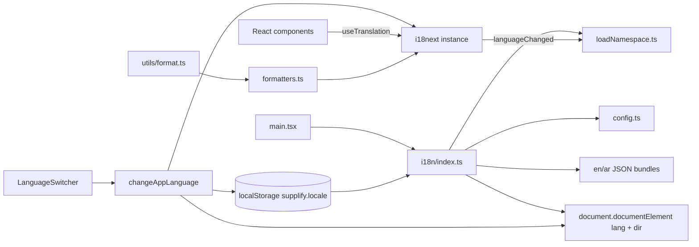

# Arabic localization (i18n)

Supplify web supports **English (en)** and **Arabic (ar)** via [i18next](https://www.i18next.com/) and [react-i18next](https://react.i18next.com/). Arabic uses RTL layout, locale-aware formatting, and lazy-loaded translation namespaces for auth and settings screens.

**Entry point:** [`apps/web/src/i18n/index.ts`](../../apps/web/src/i18n/index.ts) — imported once from [`main.tsx`](../../apps/web/src/main.tsx).

**UI control:** [`LanguageSwitcher`](../../apps/web/src/components/LanguageSwitcher.tsx) in the app header (compact mode).

## Summary

| Item             | Detail                                                                         |
| ---------------- | ------------------------------------------------------------------------------ |
| Libraries        | `i18next`, `react-i18next`                                                     |
| Locales          | `en` (default), `ar`                                                           |
| Direction        | `ltr` / `rtl` on `<html dir>`                                                  |
| Persistence      | `localStorage` key `supplify.locale`                                           |
| Eager namespaces | `common`, `navigation` (bundled at init)                                       |
| Lazy namespaces  | `auth`, `settings` (dynamic import on demand)                                  |
| Mobile           | Web-only for v1 — see [mobile parity note](../mobile/MOBILE_FEATURE_PARITY.md) |

## Architecture



1. **Bootstrap** — `readStoredLocale()` reads `supplify.locale`, initializes i18next with eager `common` + `navigation` resources for both languages, and sets `<html lang>` and `<html dir>`.
2. **Runtime switch** — `changeAppLanguage(locale)` updates i18next, HTML attributes, and localStorage.
3. **Lazy load** — On `languageChanged`, `auth` and `settings` namespaces are loaded via dynamic `import()`. If a page mounts before that event completes, call `ensureNamespace('auth')` (see Login page).
4. **Formatting** — `getFormatLocale()` in [`formatters.ts`](../../apps/web/src/i18n/formatters.ts) returns `'ar'` when active so [`utils/format.ts`](../../apps/web/src/utils/format.ts) uses Arabic digits and date/number shapes via `Intl`.

## Supported languages

Defined in [`config.ts`](../../apps/web/src/i18n/config.ts):

| Code | Label   | Direction |
| ---- | ------- | --------- |
| `en` | English | `ltr`     |
| `ar` | العربية | `rtl`     |

Unsupported codes passed to `changeAppLanguage` fall back to `en`.

## File structure

```
apps/web/src/i18n/
├── index.ts              # Singleton init, changeAppLanguage, ensureNamespace
├── config.ts             # Locales, namespaces, direction helpers
├── loadNamespace.ts      # Lazy JSON loader + test cache reset
├── formatters.ts         # Intl locale helper (dates, percent)
├── i18n.test.ts          # Unit tests
└── locales/
    ├── en/
    │   ├── common.json
    │   ├── navigation.json
    │   ├── auth.json
    │   └── settings.json
    └── ar/
        ├── common.json
        ├── navigation.json
        ├── auth.json
        └── settings.json
```

Test helpers live in [`apps/web/src/test/i18n.ts`](../../apps/web/src/test/i18n.ts) (isolated i18next instance for Vitest).

## How to add translation keys

1. **Pick a namespace**
   - `common` — shared actions, status labels, language UI, greetings.
   - `navigation` — sidebar, header page titles (via keys), nav sections.
   - `auth` — login / sign-up copy.
   - `settings` — settings language panel (partial).

2. **Add the key in both locale files** — e.g. `locales/en/common.json` and `locales/ar/common.json` with the same nested structure.

3. **Use in React**

   ```tsx
   import { useTranslation } from 'react-i18next'

   const { t } = useTranslation('navigation')
   return <span>{t('orders')}</span>
   ```

   For lazy namespaces on first paint:

   ```tsx
   import { ensureNamespace } from '../i18n'

   useEffect(() => {
     void ensureNamespace('auth')
   }, [])
   ```

4. **Sidebar nav** — Prefer `nameKey` / `labelKey` in [`sidebarNavConfig.ts`](../../apps/web/src/components/sidebar/sidebarNavConfig.ts) instead of hardcoded `name` strings. [`SidebarNavSection`](../../apps/web/src/components/sidebar/SidebarNavSection.tsx) resolves keys via `useTranslation('navigation')`.

5. **Run tests** — `pnpm --filter web test:run src/i18n/i18n.test.ts`

## RTL behavior

- `applyHtmlAttributes()` sets `document.documentElement.dir` to `rtl` for Arabic.
- Tailwind logical properties (`margin-inline-start`, etc.) are used where hover offsets need mirroring — see [`index.css`](../../apps/web/src/index.css) (`[dir='rtl'] .sidebar-nav-item:hover`).
- Prefer logical CSS (`inline-start`, `padding-inline`) for new layout work so RTL does not require duplicate rules.

## Persistence

- **Key:** `supplify.locale` (`LOCALE_STORAGE_KEY` in config).
- **Write:** Every successful `changeAppLanguage` call.
- **Read:** Once at module init; refresh restores the last choice.
- Storage failures are ignored (private mode / quota); app falls back to `en`.

## Translated now

| Area                         | Namespace    | Notes                                                |
| ---------------------------- | ------------ | ---------------------------------------------------- |
| Language switcher            | `common`     | Header control, aria labels                          |
| Sidebar labels & sections    | `navigation` | All `nameKey` / `labelKey` entries in sidebar config |
| Header page title            | `navigation` | Maps route → translation key                         |
| Login page                   | `auth`       | Welcome, errors, CTA strings (lazy-loaded)           |
| Shared actions / status      | `common`     | Save, cancel, loading, error shell copy              |
| Settings language panel copy | `settings`   | JSON present; UI wiring partial                      |
| Dates / numbers / currency   | formatters   | Arabic locale via `Intl` when `ar` active            |

## Remaining work

Most ERP pages still use hardcoded English strings. Prioritized follow-ups:

1. **Settings hub** — Wire `settings` namespace into Settings / Supplier settings tabs.
2. **Page bodies** — Orders, products, fulfillment, admin panels, forms, toasts, empty states.
3. **Command palette & search** — [`CommandPalette`](../../apps/web/src/components/search/CommandPalette.tsx) labels are English-only.
4. **Login marketing column** — Feature bullets on Login page remain English.
5. **Backend-generated text** — API error messages and notification payloads are not localized.
6. **Pluralization & interpolation** — Add i18next plural rules where counts appear (orders, notifications).
7. **Typography** — Optional Arabic-friendly font stack for body text.
8. **E2E** — Playwright flows for language switch + RTL smoke checks.

## QA checklist

Manual verification before release:

- [ ] Fresh visit defaults to English, `dir=ltr`.
- [ ] Switch to Arabic in header; UI flips to `dir=rtl`; reload keeps Arabic.
- [ ] Sidebar section labels and nav items show Arabic on main personas (restaurant, supplier, admin).
- [ ] Header breadcrumb/title updates per route in both languages.
- [ ] Login page strings load in Arabic (no key names visible).
- [ ] Currency and dates on a sample page use Arabic numerals when locale is `ar`.
- [ ] Language switcher `aria-pressed` reflects active language.
- [ ] No layout overlap or clipped text in RTL on sidebar, header, and login.
- [ ] `pnpm --filter web test:run src/i18n/i18n.test.ts src/components/LanguageSwitcher.test.tsx` passes.

Automated coverage:

- [`i18n.test.ts`](../../apps/web/src/i18n/i18n.test.ts) — locale default, RTL/LTR, persistence, fallback, lazy `auth`.
- [`LanguageSwitcher.test.tsx`](../../apps/web/src/components/LanguageSwitcher.test.tsx) — render and switch.
- [`Header.test.tsx`](../../apps/web/src/components/Header.test.tsx) — switcher present in header.

## Related docs

- [Mobile feature parity — web-only i18n](../mobile/MOBILE_FEATURE_PARITY.md)
- [Mobile parity checklist](../mobile/MOBILE_PARITY_CHECKLIST.md)
