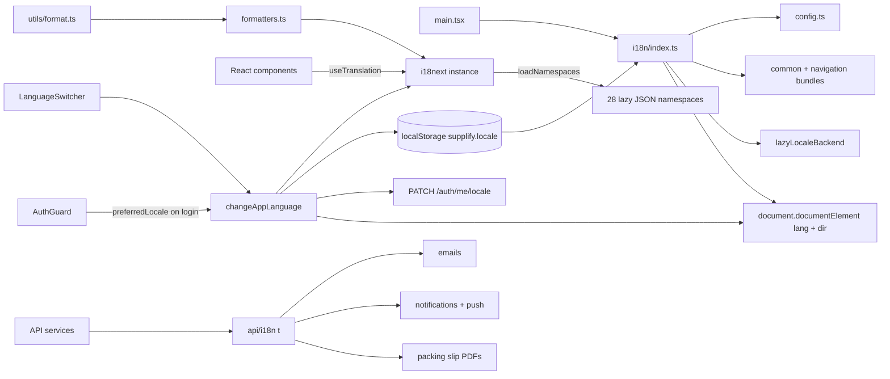

# Arabic localization (i18n)

Supplify supports **English (en)** and **Arabic (ar)** across the web app and API. The web client uses [i18next](https://www.i18next.com/) and [react-i18next](https://react.i18next.com/) with RTL layout, locale-aware formatting, and lazy-loaded translation namespaces. The API resolves user locale for emails, push/in-app notifications, PDFs, and localized error payloads.

**Web entry point:** [`apps/web/src/i18n/index.ts`](../../apps/web/src/i18n/index.ts) — imported once from [`main.tsx`](../../apps/web/src/main.tsx).

**API entry point:** [`apps/api/src/i18n/index.js`](../../apps/api/src/i18n/index.js).

**UI control:** [`LanguageSwitcher`](../../apps/web/src/components/LanguageSwitcher.tsx) in the app header (compact mode).

## Summary

| Item               | Detail                                                                                                 |
| ------------------ | ------------------------------------------------------------------------------------------------------ |
| Libraries          | `i18next`, `react-i18next` (web); custom `t()` helper (API)                                            |
| Locales            | `en` (default), `ar`                                                                                   |
| Direction          | `ltr` / `rtl` on `<html dir>`                                                                          |
| Web persistence    | `localStorage` key `supplify.locale`                                                                   |
| Server persistence | `app_user.preferred_locale` via `PATCH /auth/me/locale`                                                |
| Web namespaces     | **30** — 2 eager, 28 lazy (see below)                                                                  |
| Translation keys   | **~5,800** across all web namespaces (~2,900 per locale)                                               |
| Parity tests       | Automated en/ar key and interpolation parity in [`i18n.test.ts`](../../apps/web/src/i18n/i18n.test.ts) |
| API namespaces     | `billing`, `consumer`, `emails`, `notifications`, `orders`, `prices`, `receiving`                      |
| Mobile             | Web-only — see [mobile parity note](../mobile/MOBILE_FEATURE_PARITY.md)                                |

## Namespaces (30)

Defined in [`config.ts`](../../apps/web/src/i18n/config.ts):

| Kind  | Namespaces                                                                                                                                                                                                                                                                                                                        |
| ----- | --------------------------------------------------------------------------------------------------------------------------------------------------------------------------------------------------------------------------------------------------------------------------------------------------------------------------------- |
| Eager | `common`, `navigation`                                                                                                                                                                                                                                                                                                            |
| Lazy  | `auth`, `settings`, `inventory`, `consumer`, `loyalty`, `calendar`, `dashboard`, `orders`, `invoices`, `products`, `suppliers`, `fulfillment`, `admin`, `cart`, `reports`, `staff`, `reservations`, `chat`, `onboarding`, `quotes`, `legal`, `deals`, `restaurants`, `supplierOps`, `contracts`, `disputes`, `public`, `branches` |

All 30 namespaces have matching `locales/en/{ns}.json` and `locales/ar/{ns}.json` files.

## Architecture



1. **Bootstrap** — `readStoredLocale()` reads `supplify.locale`, initializes i18next with eager `common` + `navigation` resources for both languages, and sets `<html lang>` and `<html dir>`.
2. **Runtime switch** — `changeAppLanguage(locale)` updates i18next, HTML attributes, localStorage, and (when logged in) syncs to `PATCH /auth/me/locale`.
3. **Login sync** — `AuthGuard` applies `preferredLocale` from `GET /auth/me` when it differs from local storage (`skipServerSync: true` to avoid a round-trip loop).
4. **Lazy load** — Remaining namespaces load on demand via `lazyLocaleBackend` and `loadNamespace()`. Call `ensureNamespace('orders')` (etc.) when a page mounts before i18next has loaded that bundle.
5. **Formatting** — `getFormatLocale()` in [`formatters.ts`](../../apps/web/src/i18n/formatters.ts) returns `'ar'` when active so [`utils/format.ts`](../../apps/web/src/utils/format.ts) uses Arabic digits and date/number shapes via `Intl`.
6. **API locale** — `resolveRequestLocale(req)` checks query `locale`, `X-Locale` header, and `Accept-Language`. `resolveUserLocale(userId)` reads `preferred_locale` from `app_user` when the column exists (migration `0180_user_preferred_locale.sql`).

## Supported languages

| Code | Label   | Direction |
| ---- | ------- | --------- |
| `en` | English | `ltr`     |
| `ar` | العربية | `rtl`     |

Unsupported codes passed to `changeAppLanguage` or `resolveLocale` fall back to `en`.

## File structure

```
apps/web/src/i18n/
├── index.ts              # Singleton init, changeAppLanguage, ensureNamespace, server sync
├── config.ts             # Locales, 30 namespaces, direction helpers
├── loadNamespace.ts      # Lazy JSON loader + test cache reset
├── formatters.ts         # Intl locale helper (dates, percent)
├── i18n.test.ts          # Unit + parity tests
└── locales/
    ├── en/               # 30 JSON files (one per namespace)
    └── ar/               # 30 JSON files (mirrored keys)

apps/api/src/i18n/
├── index.js              # t(), resolveLocale, resolveUserLocale, localizedError
├── index.test.js
└── locales/
    ├── en/               # billing, consumer, emails, notifications, orders, prices, receiving
    └── ar/

apps/web/static/legal/
├── en/                   # English legal markdown (default)
└── ar/                   # Arabic legal markdown (6 documents)
```

Test helpers live in [`apps/web/src/test/i18n.ts`](../../apps/web/src/test/i18n.ts) (isolated i18next instance for Vitest).

## How to add translation keys

1. **Pick a namespace** — Use the domain that owns the UI (e.g. `orders` for order pages, `deals` for deal flows). Keep `common` for shared actions, status labels, and toasts used across features.

2. **Add the key in both locale files** — e.g. `locales/en/orders.json` and `locales/ar/orders.json` with the same nested structure and identical `{{interpolation}}` placeholders.

3. **Use in React**

   ```tsx
   import { useTranslation } from 'react-i18next'

   const { t } = useTranslation('orders')
   return <span>{t('page.tabs.all')}</span>
   ```

   For lazy namespaces on first paint:

   ```tsx
   import { ensureNamespace } from '../i18n'

   useEffect(() => {
     void ensureNamespace('orders')
   }, [])
   ```

4. **Sidebar nav** — Prefer `nameKey` / `labelKey` in [`sidebarNavConfig.ts`](../../apps/web/src/components/sidebar/sidebarNavConfig.ts). [`SidebarNavSection`](../../apps/web/src/components/sidebar/SidebarNavSection.tsx) resolves keys via `useTranslation('navigation')`.

5. **Toasts** — Use `t()` from the feature namespace (or `common`) with `sonner`; do not hardcode English strings.

6. **API strings** — Add keys under the appropriate API namespace in `apps/api/src/i18n/locales/{en,ar}/`. Use `t('notifications.order.placed.title', locale)` from server code.

7. **Run tests** — `pnpm --filter web test:run src/i18n/i18n.test.ts` and `pnpm --filter api test:run src/i18n/index.test.js`

## Automated parity tests

[`apps/web/src/i18n/i18n.test.ts`](../../apps/web/src/i18n/i18n.test.ts) enforces:

- A locale JSON file exists for every configured namespace (en + ar).
- Arabic key trees match English exactly (same dotted keys, sorted).
- `{{interpolation}}` placeholder names match between en and ar for every string value.
- Eager vs lazy namespace boot behavior, RTL/LTR switching, localStorage persistence, and lazy `loadNamespace` resolution.

CI failure on any new English key without an Arabic counterpart (or mismatched placeholders) is intentional.

## RTL behavior

- `applyHtmlAttributes()` sets `document.documentElement.dir` to `rtl` for Arabic.
- Tailwind logical properties (`margin-inline-start`, etc.) are used where hover offsets need mirroring — see [`index.css`](../../apps/web/src/index.css) (`[dir='rtl'] .sidebar-nav-item:hover`).
- Prefer logical CSS (`inline-start`, `padding-inline`) for new layout work so RTL does not require duplicate rules.
- Email HTML templates set `dir` from `getLanguageDirection()` in the API layout helper.

## Persistence

| Layer    | Mechanism                                                                       |
| -------- | ------------------------------------------------------------------------------- |
| Browser  | `supplify.locale` in `localStorage`; written on every `changeAppLanguage`       |
| Server   | `app_user.preferred_locale` (`en` \| `ar`); updated via `PATCH /auth/me/locale` |
| On login | `AuthGuard` applies server `preferredLocale` when it differs from local storage |

Storage failures in the browser are ignored (private mode / quota); app falls back to `en`.

## Current coverage

### Web — core ERP (done)

Primary ERP surfaces are wired to i18n namespaces: orders, products, suppliers, fulfillment, inventory, invoices, cart, dashboard, admin, staff, onboarding, settings, consumer ordering, chat, reports, quotes, contracts, disputes, branches, calendar, loyalty, supplier ops, and shared chrome (header, sidebar, command palette patterns).

### Web — deals & reservations (done)

- **Deals** — `deals` namespace; supplier deal rows, submit/promote dialogs, boost packages, analytics, and targeting pickers.
- **Reservations** — `reservations` namespace; board, create drawer, table builder, analytics, assignments, and public booking settings.

### Web — toasts & feedback (done)

Feature pages use translated `sonner` toasts (success/error) via `t()` instead of hardcoded English.

### Web — legal documents (done)

Arabic markdown copies live under [`apps/web/static/legal/ar/`](../../apps/web/static/legal/ar/) (privacy, terms, cookie policy, acceptable use, DPA, restaurant agreement). [`LegalDocumentPage`](../../apps/web/src/pages/LegalDocumentPage.tsx) loads locale-specific assets with English fallback.

### API — locale preference (done)

- Migration `0180_user_preferred_locale.sql` adds `preferred_locale` to `app_user`.
- `PATCH /auth/me/locale` persists user choice; `GET /auth/me` returns `preferredLocale`.
- Web `changeAppLanguage` syncs to the server when authenticated.

### API — emails, notifications, PDFs (done)

| Output                                 | Locale source                                          | Module                                                                                                                                                                                                          |
| -------------------------------------- | ------------------------------------------------------ | --------------------------------------------------------------------------------------------------------------------------------------------------------------------------------------------------------------- |
| Transactional email subjects/bodies    | `resolveLocale` on recipient / template data           | [`email.service.js`](../../apps/api/src/services/email/email.service.js), [`templates/registry.js`](../../apps/api/src/services/email/templates/registry.js)                                                    |
| In-app + push notification copy        | `fetchUserLocales` / `resolveUserLocale` per recipient | [`notification/templates.js`](../../apps/api/src/services/notification/templates.js), [`push.service.js`](../../apps/api/src/services/push.service.js)                                                          |
| Packing slip PDF labels                | `resolveRequestLocale(req)`                            | [`orders.helpers.js`](../../apps/api/src/routes/orders/orders.helpers.js) `buildPackingSlipPdf`                                                                                                                 |
| Billing / receiving / price API errors | `resolveRequestLocale` + `localizedError`              | [`billingAccess.js`](../../apps/api/src/middlewares/billingAccess.js), [`receiving.routes.js`](../../apps/api/src/routes/receiving.routes.js), [`prices.routes.js`](../../apps/api/src/routes/prices.routes.js) |
| Consumer ordering hours messages       | `resolveLocale`                                        | [`consumer-ordering-hours.js`](../../apps/api/src/lib/consumer-ordering-hours.js)                                                                                                                               |

## Remaining work

1. **Mobile app** — Arabic i18n is web-only. Port namespaces and RTL layout to `supplify-mobile`; document gaps in [MOBILE_FEATURE_PARITY.md](../mobile/MOBILE_FEATURE_PARITY.md).
2. **RTL QA pass** — Manual review of dense tables, maps, modals, and multi-column forms in Arabic; fix any remaining physical `left`/`right` offsets or icon mirroring issues.
3. **Typography (optional)** — Arabic-friendly font stack for body text (currently inherits system/Latin-first stack).
4. **E2E** — Playwright flows for language switch, server preference restore on login, and RTL smoke checks across key personas.

## QA checklist

Manual verification before release:

### Language switch & persistence

- [ ] Fresh visit defaults to English, `dir=ltr`.
- [ ] Switch to Arabic in header; UI flips to `dir=rtl`; reload keeps Arabic.
- [ ] Logged-in user: switch language, log out, log back in — `preferredLocale` from server matches last choice.
- [ ] Language switcher `aria-pressed` reflects active language.

### Navigation & chrome

- [ ] Sidebar section labels and nav items show Arabic on main personas (restaurant, supplier, admin, staff portal).
- [ ] Header page title updates per route in both languages.
- [ ] Login and registration strings load in Arabic (no raw key names visible).

### Core ERP samples (Arabic)

- [ ] Orders list + detail: tabs, status labels, actions, empty states.
- [ ] Products catalog: filters, import panel, substitute section.
- [ ] Fulfillment / driver views: status chips, ETA copy.
- [ ] Settings hub: language panel and at least one persona-specific settings tab.
- [ ] Toast messages on a save/error action show Arabic text.

### Deals & reservations (Arabic)

- [ ] Supplier deals list and submit/promote dialogs.
- [ ] Reservation board, create drawer, and table builder save toast.

### Formatting & legal

- [ ] Currency and dates on a sample page use Arabic numerals when locale is `ar`.
- [ ] Legal document page (`/legal/:slug`) loads Arabic markdown when locale is `ar`.
- [ ] Packing slip PDF download uses Arabic labels when requested with `?locale=ar` or `X-Locale: ar`.

### RTL layout

- [ ] No layout overlap or clipped text in RTL on sidebar, header, login, and a wide data table.
- [ ] Modals and drawers align correctly (close button, primary action placement).

### Automated

- [ ] `pnpm --filter web test:run src/i18n/i18n.test.ts` passes (parity + boot behavior).
- [ ] `pnpm --filter api test:run src/i18n/index.test.js` passes.
- [ ] `pnpm --filter web test:run src/components/LanguageSwitcher.test.tsx src/components/Header.test.tsx` passes.

## Related docs

- [Mobile feature parity — web-only i18n](../mobile/MOBILE_FEATURE_PARITY.md)
- [Mobile parity checklist](../mobile/MOBILE_PARITY_CHECKLIST.md)
