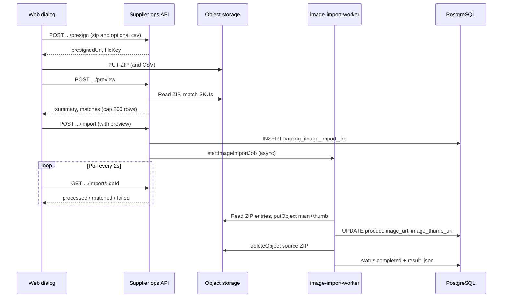

# Bulk product image import

Suppliers can attach catalog images in bulk via ZIP archives (filename or CSV mapping) or by including remote URLs in the product CSV import. Images are optimized server-side (main + thumbnail), stored in object storage, and linked on `product.image_url` / `product.image_thumb_url`.

**Plan gate:** None beyond existing `CATALOG_EDIT` and supplier **storage_mb** metering.

**Web entry:** `/app/products` → **Import Product Images** — `ProductImageImportDialog`

**API mount:** `/api/supplier/products/images/import/*` in [`supplier-ops.routes.js`](../../apps/api/src/routes/supplier-ops.routes.js)

**Services:** [`product-image-import.service.js`](../../apps/api/src/services/product-image-import.service.js), [`image-import-worker.js`](../../apps/api/src/services/image-import-worker.js), [`image-optimization.service.js`](../../apps/api/src/services/image-optimization.service.js)

**Migration:** `0168_catalog_image_import.sql` — `catalog_image_import_job` table + `product.image_thumb_url`

**Dependencies (API):** `sharp`, `yauzl`, `file-type` — see [`apps/api/package.json`](../../apps/api/package.json)

## Supported formats

| Format | Extensions      | Notes                                          |
| ------ | --------------- | ---------------------------------------------- |
| JPEG   | `.jpg`, `.jpeg` | Decoded and re-encoded; WebP used when smaller |
| PNG    | `.png`          | Same optimization path as JPEG                 |
| WebP   | `.webp`         | Stored as WebP                                 |

Other extensions inside a ZIP are ignored. ZIP entry paths must be relative (no `..`, no absolute paths). Each image is validated with Sharp before upload.

**Per-image size limit:** `IMPORT_IMAGE_MAX_BYTES` (default **10 MB**).

**Output:** Optimized main (max width 1200px) and thumbnail (max width 400px) written as `uploads/{supplierId}/products/{productId}/main.webp` and `thumb.webp` (or JPEG/PNG when WebP is larger for JPEG/PNG sources).

## Import methods

### 1. ZIP by SKU (`zip_sku`)

Upload a ZIP whose **image filenames** (stem, case-insensitive) match product **SKU** values in the supplier catalog.

Example: `SKU-001.jpg` → product with SKU `SKU-001`.

- One image per product; duplicate filenames or duplicate SKU matches are reported in preview.
- Nested folders inside the ZIP are allowed; matching uses the filename stem only.

### 2. ZIP + mapping CSV (`zip_mapping`)

Upload a ZIP plus a CSV that maps SKUs to filenames inside the archive.

**Mapping CSV columns** (header aliases accepted):

| Field      | Accepted headers                  |
| ---------- | --------------------------------- |
| SKU        | `sku`, `product_code`, `barcode`  |
| Image file | `imagefile`, `image_file`, `file` |

Matching resolves files by full path or basename within the ZIP. Each row must have both SKU and image file; invalid rows appear in preview.

### 3. `image_url` in product CSV (`url_csv`)

For remote images, use the existing **Bulk Upload Products** flow instead of the ZIP job API.

1. Add an `image_url` column to the product CSV.
2. Run **Bulk Upload Products** on `/app/products` (`POST /api/supplier/products/import`).

The image-import dialog’s **URL via CSV** tab documents this path. During import, the server fetches each URL via [`importImageFromUrl`](../../apps/api/src/services/product-image-import.service.js):

- Only `http:` / `https:` URLs; private/local hostnames blocked (SSRF protection).
- 15s fetch timeout; response must be `image/*`.
- Same optimization and storage metering as ZIP imports.
- Runs inline with product row processing (not a background ZIP job).

## Processing flow (ZIP methods)

1. **Presign** — Client requests upload URLs for ZIP (`purpose: zip`, up to `IMPORT_ZIP_MAX_BYTES`) and optional mapping CSV (`purpose: csv`). Keys: `imports/{supplierId}/{jobId}/{fileName}`.
2. **Upload** — Browser PUTs files to presigned URLs. Large ZIPs on local/private S3 use `PUT /api/files/upload-import/:token` (body limit `IMPORT_ZIP_MAX_BYTES`); standard uploads use `/api/files/upload/:token` (10 MB). See [storage-uploads.md](../operations/storage-uploads.md).
3. **Preview** — Server lists safe image entries in the ZIP, matches to supplier products, returns counts and sample rows (preview lists capped at **200** rows).
4. **Confirm** — Client starts import with preview payload; API creates a job and enqueues background processing.
5. **Process** — Worker acquires a Postgres advisory lock, processes matches in **batches of 50** inside transactions, updates progress after each batch.
6. **Complete** — Source ZIP deleted from storage; job status `completed`, `failed`, or `cancelled`. Failures downloadable as CSV.

**Concurrency:** Only one active job (`pending` or `processing`) per supplier at a time.

**Replace existing:** When `replaceExisting` is false (default), products that already have `image_url` are skipped in preview and counted in `skipped`.

## Error handling

| Scenario                                   | Behavior                                                             |
| ------------------------------------------ | -------------------------------------------------------------------- |
| No matching SKU                            | Listed as unmatched file (ZIP-by-SKU) or unmatched product (mapping) |
| Duplicate file or duplicate product match  | Reported in preview `duplicates`; excluded from import               |
| Invalid mapping row (missing SKU/file)     | `invalidRows` in preview                                             |
| Image too large                            | Row fails; reason in failure report                                  |
| Invalid/corrupt image                      | Row fails at optimization                                            |
| Storage quota exceeded                     | Row fails with limit message                                         |
| ZIP entry missing at process time          | Row fails: "File not found in ZIP"                                   |
| Job cancelled mid-run                      | Status `cancelled`; partial imports retained                         |
| Job-level failure                          | Status `failed`; `error_message` set                                 |
| Active job already running                 | `409 Conflict`: "An image import job is already in progress"         |
| File key not under `imports/{supplierId}/` | Validation error on preview/start                                    |

**Failure report:** `GET /api/supplier/products/images/import/:jobId/report` → CSV columns `sku,file,reason`.

**Audit:** `catalog.image_import.started`, `catalog.image_import.completed`, `catalog.image_import.cancelled`.

## Performance considerations

| Setting                  | Default             | Purpose                                       |
| ------------------------ | ------------------- | --------------------------------------------- |
| `IMPORT_ZIP_MAX_BYTES`   | `2147483648` (2 GB) | Max ZIP size at presign                       |
| `IMPORT_IMAGE_MAX_BYTES` | `10485760` (10 MB)  | Max uncompressed image per file               |
| Batch size               | `50`                | DB transaction batch during job processing    |
| Preview row cap          | `200`               | Max detail rows returned per preview category |
| URL fetch timeout        | `15s`               | Remote image download limit                   |

**Operational notes:**

- Large ZIPs on S3-compatible storage are downloaded to a temp file before streaming entries.
- Progress is persisted after each batch so the UI can poll job status without blocking the API request.
- Advisory locks prevent duplicate workers for the same job across processes.
- Source ZIP is deleted after successful processing to reclaim storage.
- Image optimization reduces egress and catalog load time; thumbnails power list views (`image_thumb_url`).

## Acceptance criteria checklist

- [ ] Supplier with `CATALOG_EDIT` can open **Import Product Images** from `/app/products`.
- [ ] **ZIP by SKU:** ZIP with `SKU.ext` files matches existing products; preview shows matched / unmatched / duplicate counts.
- [ ] **ZIP + mapping:** CSV with SKU + ImageFile columns maps correctly; invalid rows surfaced in preview.
- [ ] **Replace existing** off skips products that already have images; on overwrites them.
- [ ] Confirm starts a job; UI polls until terminal status (`completed`, `failed`, `cancelled`).
- [ ] Successful imports set `product.image_url` and `product.image_thumb_url` to optimized storage URLs.
- [ ] Failed rows appear in job summary; failure CSV downloads from report endpoint.
- [ ] Cancel stops a in-progress job; completed rows before cancel are kept.
- [ ] Second concurrent import for same supplier returns conflict while a job is active.
- [ ] ZIP over `IMPORT_ZIP_MAX_BYTES` rejected at presign.
- [ ] Individual images over `IMPORT_IMAGE_MAX_BYTES` fail that row only.
- [ ] Only `.jpg`, `.jpeg`, `.png`, `.webp` entries processed; unsafe ZIP paths ignored.
- [ ] **URL via CSV:** Product bulk upload with `image_url` column fetches public HTTP(S) images; private URLs rejected.
- [ ] Storage quota enforced during upload (non-admin suppliers).
- [ ] Audit log entries written on start, complete, and cancel.

## Tests

| File                                                                 | Covers                             |
| -------------------------------------------------------------------- | ---------------------------------- |
| `apps/api/src/services/product-image-import.service.test.js`         | SKU/mapping match logic, CSV parse |
| `apps/api/src/services/image-import-worker.test.js`                  | Background job dispatch            |
| `apps/api/src/services/image-optimization.service.test.js`           | Format validation, optimization    |
| `apps/web/src/components/products/ProductImageImportDialog.test.tsx` | Dialog preview and confirm UX      |

## See also

- [supplier-ops.md](./supplier-ops.md) — endpoint table and supplier ops hub
- [storage-uploads.md](../operations/storage-uploads.md) — presign pipeline and server-side `putObject`
- [../mobile/MOBILE_FEATURE_PARITY.md](../mobile/MOBILE_FEATURE_PARITY.md) — web-only v1 scope
