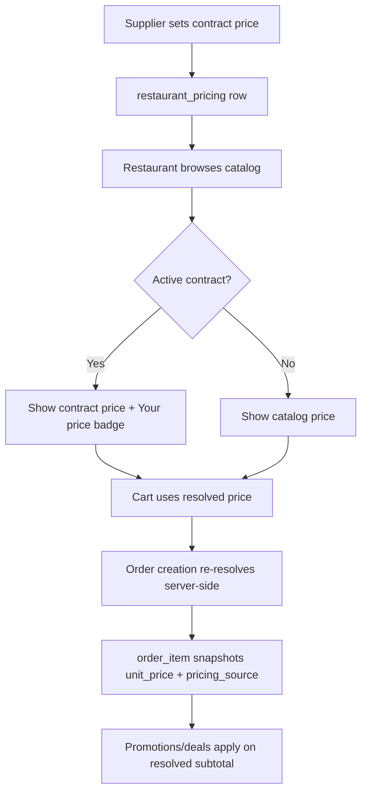

# Contract Pricing Feature

> Pricing model note: plan names, prices, limits, and upgrade examples in this document may reflect the legacy tier catalog. Current commercial guidance lives in [../product/four-plan-pricing-model.md](../product/four-plan-pricing-model.md) and [../product/plans-and-limits.md](../product/plans-and-limits.md). Use those documents for current public names, limits, trial behavior, add-ons, AI allowances, and billing status.

End-to-end customer-specific (restaurant) contract pricing for Supplify.

## Previous state

- DB table `restaurant_pricing` existed (migration `0019_restaurant_pricing.sql`)
- API at `/api/restaurant-pricing` existed but was **broken** (referenced non-existent `pricing_tier` columns)
- No supplier UI to manage contract prices
- Product catalog used default `price` table only
- Cart/checkout/order creation used catalog price only
- Restaurants had no dedicated “My Prices” view

## New end-to-end flow



1. **Supplier** opens **Contract Pricing** (`/app/contract-pricing`), selects restaurant + product, sets price and optional terms.
2. **Restaurant** sees **Your price** in catalog (`/app/products`) and **My Prices** (`/app/my-prices`).
3. **Cart** uses resolved price; quantity changes re-resolve via `POST /api/restaurant-pricing/resolve`.
4. **Order placement** calls `resolveProductPricesBatch` server-side and stores metadata on each `order_item`.

## Pricing precedence

| Step | Rule                                                                                                                         |
| ---- | ---------------------------------------------------------------------------------------------------------------------------- |
| 1    | **Contract price** if row is active, date-valid, and `quantity >= min_order_quantity`                                        |
| 2    | Else **default catalog price** from `price` table                                                                            |
| 3    | **Promotions/deals** unchanged — applied after line prices are resolved (existing `applyBestPromotionToOrder` / coupon flow) |

### Contract validity

A contract applies when **all** are true:

- `restaurant_id`, `supplier_id`, `product_id` match
- `is_active = true`
- `contract_start_date` is null or `<= today`
- `contract_end_date` is null or `>= today`
- `min_order_quantity` is null or `<= order/catalog quantity`

### Duplicate contracts

DB unique constraint: `(supplier_id, restaurant_id, product_id)`. Upsert on create. If multiple rows ever existed, resolver picks `ORDER BY updated_at DESC LIMIT 1`.

## Central price resolver

`apps/api/src/services/resolve-product-price.service.js`

```javascript
resolveProductPrice({ restaurantId, supplierId, productId, quantity, date })
// → { unitPrice, source, defaultPrice, contractPriceId, discountPercent, validFrom, validUntil, currency, minOrderQuantity }

resolveProductPricesBatch({ restaurantId, items, date })
enrichProductsWithResolvedPricing(products, restaurantId)
```

Used in:

- `GET /api/products` (restaurant tenant enrichment)
- `GET /api/products/:id`
- `POST /api/orders` (restaurant checkout)
- `POST /api/orders/manual` (supplier phone orders)
- `POST /api/restaurant-pricing/resolve` (cart preview)

## APIs

| Method | Path                                 | Role       | Permission                         | Description                                                                         |
| ------ | ------------------------------------ | ---------- | ---------------------------------- | ----------------------------------------------------------------------------------- |
| GET    | `/api/restaurant-pricing`            | Supplier   | `CATALOG_VIEW`                     | List supplier contract prices (filters: `restaurantId`, `productId`, `q`, `status`) |
| POST   | `/api/restaurant-pricing`            | Supplier   | `CATALOG_MANAGE` or `CATALOG_EDIT` | Create/upsert contract price                                                        |
| POST   | `/api/restaurant-pricing/bulk`       | Supplier   | `CATALOG_MANAGE` or `CATALOG_EDIT` | Bulk set prices for one restaurant                                                  |
| PATCH  | `/api/restaurant-pricing/:id`        | Supplier   | `CATALOG_MANAGE` or `CATALOG_EDIT` | Update contract price                                                               |
| DELETE | `/api/restaurant-pricing/:id`        | Supplier   | `CATALOG_MANAGE` or `CATALOG_EDIT` | Deactivate (`is_active = false`)                                                    |
| GET    | `/api/restaurant-pricing/my-pricing` | Restaurant | `CATALOG_VIEW`                     | Restaurant’s active contract prices                                                 |
| POST   | `/api/restaurant-pricing/resolve`    | Restaurant | `CATALOG_VIEW`                     | Batch resolve prices for cart                                                       |

Removed: legacy `/tiers` endpoints (no `pricing_tier` table in schema).

## Data model

### `restaurant_pricing` (existing)

Key columns: `supplier_id`, `restaurant_id`, `product_id`, `price`, `currency`, `contract_discount_percentage`, `contract_start_date`, `contract_end_date`, `agreement_type`, `min_order_quantity`, `is_active`, `notes`.

### `order_item` (migration `0130_contract_pricing_productization.sql`)

| Column                  | Type    | Description                                                     |
| ----------------------- | ------- | --------------------------------------------------------------- |
| `pricing_source`        | TEXT    | `DEFAULT_PRICE` \| `CONTRACT_PRICE` (promotion fields reserved) |
| `contract_price_id`     | UUID FK | Link to `restaurant_pricing` at order time                      |
| `default_catalog_price` | NUMERIC | Catalog price before override                                   |

## UI pages

| Page             | Route                                | Tenant     | Nav                                       |
| ---------------- | ------------------------------------ | ---------- | ----------------------------------------- |
| Contract Pricing | `/app/contract-pricing`              | Supplier   | Operations → Contract Pricing             |
| My Prices        | `/app/my-prices`                     | Restaurant | Operations → My Prices                    |
| Catalog badges   | `/app/products`, `/app/products/:id` | Restaurant | “Your price” + strikethrough catalog      |
| Cart             | `/app/cart`                          | Restaurant | Contract badge + re-resolve on qty change |

## RBAC

| Action                 | Supplier roles                                                  | Restaurant roles |
| ---------------------- | --------------------------------------------------------------- | ---------------- |
| Manage contract prices | `CATALOG_MANAGE` / `CATALOG_EDIT` (owner, admin, sales manager) | —                |
| View contract prices   | `CATALOG_VIEW`, `INVOICES_VIEW`, `ORDERS_VIEW`                  | `CATALOG_VIEW`   |
| Driver                 | No access                                                       | —                |

Tenant isolation enforced via `getSupplierIdForRequest` / `getRestaurantIdForRequest` — suppliers only see/edit own rows; restaurants only see own `restaurant_id`.

## Suggested tiering (not enforced)

| Tier       | Suggested capability                                                  |
| ---------- | --------------------------------------------------------------------- |
| Free Trial | Preview/demo only (read sample prices)                                |
| Silver     | Limited contract prices (e.g. N restaurants × M products)             |
| Gold       | Full customer-specific pricing                                        |
| Platinum   | Bulk CSV import/export, copy list between restaurants, advanced rules |

**Entitlement hook placeholder:** feature key `contract_pricing` documented for future gating. No new limits enforced in this release.

## Interaction with deals/promotions

**Order of operations (unchanged promotion logic):**

1. Resolve base unit price per line (contract → default)
2. Compute line subtotals
3. Apply promotion/coupon/best-deal on subtotal (existing services)

Contract price is the **base** for promotion eligibility and discount calculation. Promotion application may update order totals and set promotion metadata separately; line `unit_price` remains the resolved base snapshot.

## Bulk tools — next phase

Not in this release:

- CSV import/export of customer price lists
- Copy price list from Restaurant A → Restaurant B

Use `POST /api/restaurant-pricing/bulk` for multi-product entry in UI/API today.

## Manual QA checklist

- [ ] Supplier creates product with default catalog price
- [ ] Supplier sets special price for Restaurant A via Contract Pricing
- [ ] Restaurant A sees “Your price” in catalog and My Prices
- [ ] Restaurant B sees default catalog price only
- [ ] Restaurant A adds product to cart — cart shows contract price
- [ ] Checkout/order — `order_item.unit_price` = contract price, `pricing_source` = `CONTRACT_PRICE`
- [ ] Supplier edits/deactivates contract price
- [ ] Expired/inactive price no longer applies in catalog or orders
- [ ] Min quantity contract applies only when cart qty ≥ threshold
- [ ] Promotions/deals still apply after price resolution
- [ ] Supplier cannot create price for another supplier’s product
- [ ] Restaurant cannot see another restaurant’s prices

## Tests

- `apps/api/src/services/resolve-product-price.service.test.js`
- `apps/api/src/routes/restaurant-pricing.routes.test.js`

Run: `pnpm test:api`
