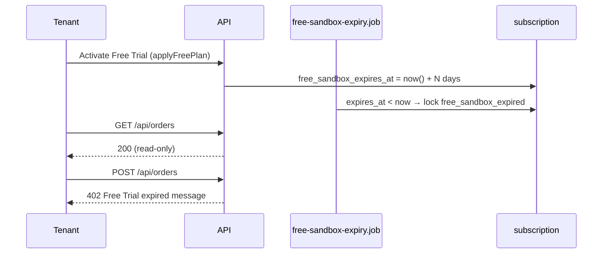

# Free Trial expiry & read-only lock

DB plan code **`free`** is marketed as **Free Trial** — a **time-limited evaluation sandbox**, not a forever-free production tier. During the trial, tenants keep **broad feature access** (`0112` Gold parity). After expiry, the workspace locks for **writes** but remains **readable**.

**Related:** [tenant-registration-activation.md](./tenant-registration-activation.md) · [monetization/SUBSCRIPTIONS.md](../monetization/SUBSCRIPTIONS.md) · [qa/FREE_TRIAL_BEHAVIOR_AUDIT.md](../qa/FREE_TRIAL_BEHAVIOR_AUDIT.md)

## Product rules

| Rule         | Behavior                                                                                               |
| ------------ | ------------------------------------------------------------------------------------------------------ |
| Trial length | **3–7 days** (platform default **7**); admin cannot set outside range for new activations / extensions |
| Expiry field | `subscription.free_sandbox_expires_at`                                                                 |
| Lock reason  | `lock_reason = 'free_sandbox_expired'`                                                                 |
| After expiry | Login OK; **GET** tenant APIs OK; **POST/PUT/PATCH/DELETE** → **402**                                  |
| Data         | No deletion on expiry                                                                                  |
| Upgrade      | Paid checkout or admin plan change                                                                     |
| Admin extend | `POST …/extend-free-trial`; unlock on expired trial also extends expiry                                |

**Not in scope (deferred):** `0116` narrow catalog, restaurant `promotions = 0`, supplier `warehouses = 1` on production Free.

## Flow

## API

### Runtime (tenant)

| Concern              | Implementation                                                                    |
| -------------------- | --------------------------------------------------------------------------------- |
| Access check         | `billingAccessMiddleware` — GET allowed when `freeSandboxExpired` / `lock_reason` |
| 402 body             | `buildAccountLockedError()` — trial-specific message                              |
| Entitlements         | `GET /api/subscriptions/entitlements` includes `freeSandbox.expiresAt`            |
| Billing while locked | `/api/billing/*` always allowed                                                   |

**402 message (trial):**

`Your Free Trial has expired. Upgrade your plan to continue using Supplify.`

### Admin

| Method  | Path                                                       | Body                          | Notes                                                                     |
| ------- | ---------------------------------------------------------- | ----------------------------- | ------------------------------------------------------------------------- |
| `GET`   | `/api/admin-dashboard/platform-settings`                   | —                             | `freeSandboxDays` (3–7)                                                   |
| `PATCH` | `/api/admin-dashboard/platform-settings`                   | `{ freeSandboxDays }`         | Validates 3–7                                                             |
| `POST`  | `/api/admin-dashboard/subscriptions/:id/extend-free-trial` | `{ days? }`                   | Extends + unlocks; `days` optional, 3–7                                   |
| `POST`  | `/api/admin-dashboard/subscriptions/:id/unlock`            | `{ freeTrialDays?, reason? }` | If `free` + `free_sandbox_expired`, extends trial (default platform days) |

### Background job

- `apps/api/src/jobs/free-sandbox-expiry.job.js` — hourly (+ on API startup)
- Sets `account_locked_at`, `lock_reason = 'free_sandbox_expired'`
- Skips rows where `free_sandbox_expires_at` is still in the future (including after admin extend)

## Web

| Surface                 | File                                                                                            |
| ----------------------- | ----------------------------------------------------------------------------------------------- |
| Plan label “Free Trial” | `lib/planComparison.ts` (`formatPlanDisplayName`)                                               |
| Expired banner          | `components/billing/BillingOverdueBanner.tsx`                                                   |
| Subscription tab copy   | `components/SubscriptionInfo.tsx`                                                               |
| Admin trial length      | `components/admin/AdminPlatformSettingsPanel.tsx`                                               |
| Admin extend action     | `pages/AdminDashboardPage.tsx` — **Extend trial** when `lock_reason === 'free_sandbox_expired'` |
| RTK mutation            | `services/api.ts` — `extendAdminFreeTrial`                                                      |

## Tests

| Layer         | File                                                            |
| ------------- | --------------------------------------------------------------- |
| Unit (API)    | `apps/api/src/middlewares/billingAccess.test.js`                |
| Unit (API)    | `apps/api/src/lib/billing/billing-service.test.js`              |
| Unit (API)    | `apps/api/src/lib/platform-settings.test.js`                    |
| Manual QA     | `docs/qa/MANUAL_TEST_CHECKLIST.md` — **§4.6 Free Trial expiry** |
| Audit / risks | `docs/qa/FREE_TRIAL_BEHAVIOR_AUDIT.md`                          |

## QA references

- **BIL-FT-01 … BIL-FT-12** in [MANUAL_TEST_CHECKLIST.md](../qa/MANUAL_TEST_CHECKLIST.md)
- SQL shortcut to simulate expiry in [FREE_TRIAL_BEHAVIOR_AUDIT.md](../qa/FREE_TRIAL_BEHAVIOR_AUDIT.md)
