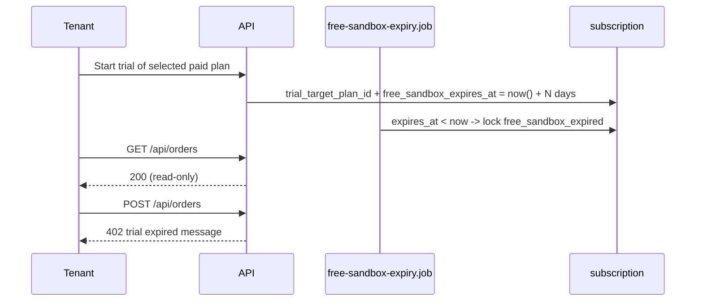

# Trial Expiry And Read-only Lock

The internal DB plan code `free` is retained for compatibility, but the public product experience is a **30-day free trial of a selected paid plan**. It is not a permanent no-cost plan. The selected target plan controls the trial positioning and most trial entitlements, while `subscription.free_sandbox_expires_at` remains the expiry mechanism.

**Related:** [tenant-registration.md](./tenant-registration.md), [four-plan-pricing-model.md](../product/four-plan-pricing-model.md), [plans-and-limits.md](../product/plans-and-limits.md), [qa/FREE_TRIAL_BEHAVIOR_AUDIT.md](../qa/FREE_TRIAL_BEHAVIOR_AUDIT.md)

## Product Rules

| Rule         | Behavior                                                                                      |
| ------------ | --------------------------------------------------------------------------------------------- |
| Trial length | 7-90 days through platform settings; default 30                                               |
| Trial target | Restaurant Growth, Restaurant Scale, Supplier Growth, or Supplier Scale                       |
| Expiry field | `subscription.free_sandbox_expires_at`                                                        |
| Lock reason  | `lock_reason = 'free_sandbox_expired'`                                                        |
| After expiry | Login OK; tenant GET APIs OK; POST/PUT/PATCH/DELETE return 402                                |
| Data         | No deletion on expiry                                                                         |
| Upgrade      | Paid checkout or admin plan change                                                            |
| Admin extend | `POST .../extend-free-trial`; unlock on expired trial also extends expiry                     |
| AI allowance | Restaurant trial: 50 total genuine model calls; supplier trial: 100 total genuine model calls |

The trial must not be marketed as a forever-free production tier. Writes remain blocked after expiry until paid activation or admin extension.

## Flow

## API

### Runtime (tenant)

| Concern              | Implementation                                                                                                                             |
| -------------------- | ------------------------------------------------------------------------------------------------------------------------------------------ |
| Access check         | `billingAccessMiddleware` allows GET when `freeSandboxExpired` / `lock_reason` is set                                                      |
| 402 body             | `buildAccountLockedError()` returns trial-specific copy and upgrade metadata                                                               |
| Entitlements         | `GET /api/subscriptions/entitlements` includes trial expiry, target plan, effective limits, AI usage, and recurring totals where available |
| Billing while locked | `/api/billing/*` remains allowed so tenants can activate                                                                                   |

**402 message (trial):**

`Your 30-day trial has expired. Upgrade your plan to continue using Supplify.`

### Admin

| Method  | Path                                                       | Body                          | Notes                                                                                                 |
| ------- | ---------------------------------------------------------- | ----------------------------- | ----------------------------------------------------------------------------------------------------- |
| `GET`   | `/api/admin-dashboard/platform-settings`                   | -                             | `freeSandboxDays` (7-90, default 30)                                                                  |
| `PATCH` | `/api/admin-dashboard/platform-settings`                   | `{ freeSandboxDays }`         | Validates 7-90                                                                                        |
| `POST`  | `/api/admin-dashboard/subscriptions/:id/extend-free-trial` | `{ days? }`                   | Extends + unlocks; `days` optional, 7-90                                                              |
| `POST`  | `/api/admin-dashboard/subscriptions/:id/unlock`            | `{ freeTrialDays?, reason? }` | If internal trial/free subscription is expired, extends trial using platform default when unspecified |

### Background Job

- `apps/api/src/jobs/free-sandbox-expiry.job.js` - hourly plus API startup
- Sets `account_locked_at`, `lock_reason = 'free_sandbox_expired'`
- Sends trial-expired and account-locked notifications
- Skips rows where `free_sandbox_expires_at` is still in the future, including after admin extension

## Web

| Surface               | File                                                                                            |
| --------------------- | ----------------------------------------------------------------------------------------------- |
| Trial target display  | `lib/planComparison.ts`, `components/SubscriptionInfo.tsx`, activation and upgrade surfaces     |
| Expired banner        | `components/billing/BillingOverdueBanner.tsx`                                                   |
| Subscription tab copy | `components/SubscriptionInfo.tsx`                                                               |
| Admin trial length    | `components/admin/AdminPlatformSettingsPanel.tsx`                                               |
| Admin extend action   | `pages/AdminDashboardPage.tsx` - **Extend trial** when `lock_reason === 'free_sandbox_expired'` |
| RTK mutation          | `services/api.ts` - `extendAdminFreeTrial`                                                      |

## Tests

| Layer         | File                                                    |
| ------------- | ------------------------------------------------------- |
| Unit (API)    | `apps/api/src/middlewares/billingAccess.test.js`        |
| Unit (API)    | `apps/api/src/lib/billing/billing-service.test.js`      |
| Unit (API)    | `apps/api/src/lib/platform-settings.test.js`            |
| Manual QA     | `docs/qa/regression-checklist.md` - trial expiry checks |
| Audit / risks | `docs/archive/audits/free-trial-behavior-audit.md`      |

## QA References

- BIL-FT-01 through BIL-FT-12 in [regression-checklist.md](../qa/regression-checklist.md)
- SQL shortcut to simulate expiry in [FREE_TRIAL_BEHAVIOR_AUDIT.md](../qa/FREE_TRIAL_BEHAVIOR_AUDIT.md)
