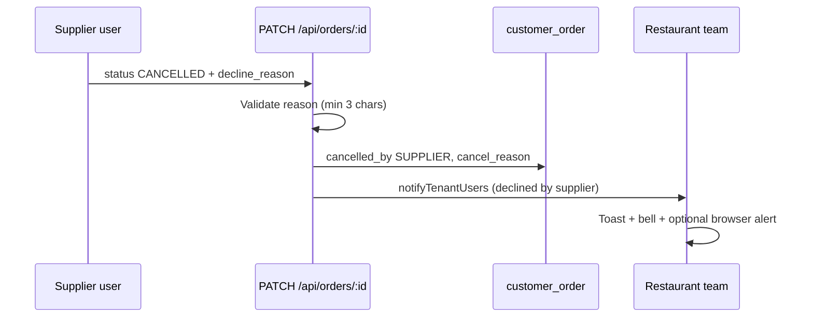

# Order decline (supplier) & cancellation reasons

When a **supplier** cannot fulfill an order, they **decline** it (API status `CANCELLED`) and must provide a **reason**. The **restaurant** sees **Declined by supplier** and the reason on the order list and detail page.

Restaurant-initiated cancels use the same `CANCELLED` status with `cancelled_by = 'RESTAURANT'` (optional reason).

## Flow

## API

| Method | Path              | Body (supplier decline)                                     | Notes                                 |
| ------ | ----------------- | ----------------------------------------------------------- | ------------------------------------- |
| PATCH  | `/api/orders/:id` | `{ "status": "CANCELLED", "decline_reason": "..." }`        | `decline_reason` or `cancel_reason`   |
| PATCH  | `/api/orders/:id` | `{ "status": "CANCELLED", "cancel_reason": "..." }` (resto) | Optional reason for restaurant cancel |

**Validation (supplier):** Missing or short reason → `400` `DECLINE_REASON_REQUIRED`.

**Permissions:** Supplier decline requires `ORDERS_MANAGE`. Restaurant cancel requires own order + `CANCELLED` only.

## Data model

Migration `0108_order_cancellation_details.sql`:

| Column          | Type | Description                |
| --------------- | ---- | -------------------------- |
| `cancel_reason` | TEXT | Human-readable reason      |
| `cancelled_by`  | TEXT | `RESTAURANT` or `SUPPLIER` |

Returned on `GET /api/orders` and `GET /api/orders/:id` (`RETURNING *`).

## UI

| Role       | Action              | UX                                                                |
| ---------- | ------------------- | ----------------------------------------------------------------- |
| Supplier   | Decline             | Modal — reason required (min 3 characters)                        |
| Restaurant | View declined order | Status **Declined by supplier**; red banner with reason on detail |
| Restaurant | Orders list         | Same label; reason snippet when present                           |

**Web:** `DeclineOrderDialog`, `orderStatusDisplay.ts`, `OrderDetailPage`, `OrdersPage`.

## Notifications

- Supplier decline → **restaurant** tenant (`notifyTenantUsers`), title _Order declined by supplier_, message includes reason.
- Restaurant cancel → **supplier** tenant (existing cancel notification).

Preference key: `notify_order_cancelled` (same as other order status events).

## Tests

| Layer | File                                                                                 |
| ----- | ------------------------------------------------------------------------------------ |
| Web   | `apps/web/src/lib/orderStatusDisplay.test.ts`                                        |
| API   | Extend `orders.routes.test.js` for `DECLINE_REASON_REQUIRED` when adding route tests |

**Manual QA:** [regression-checklist.md](../qa/regression-checklist.md) — `ORD-DECL-*`, `RST-10`, `SUP-06b`.
