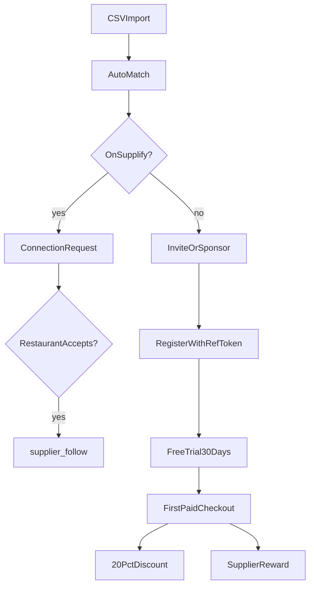

# Supplier customer import, referral & sponsored onboarding

Suppliers can import their existing restaurant customer base, match records to Supplify tenants, invite non-users, sponsor onboarding, and track conversion metrics. Referred restaurants receive platform benefits (30-day Free Trial + first-paid discount); suppliers earn rewards when referrals convert to paid subscriptions.

**Migration:** `0169_supplier_growth_program.sql`  
**Web:** `/app/customer-growth` — `SupplierCustomerGrowthPage`  
**Mobile:** Web-first; see [MOBILE_FEATURE_PARITY.md](../mobile/MOBILE_FEATURE_PARITY.md)

**Related:** [free-trial-expiry.md](./free-trial-expiry.md) · [tenant-registration.md](./tenant-registration.md) · [supplier-follow.md](./supplier-follow.md) · [supplier-ops.md](./supplier-ops.md)

## Product rules

| Rule                         | Behavior                                                                                                                             |
| ---------------------------- | ------------------------------------------------------------------------------------------------------------------------------------ |
| Import                       | CSV with columns: Restaurant Name, Contact Person, Phone, Email, Address, Area/Region, Credit Limit, Payment Terms, Sales Rep, Notes |
| Matching                     | Email exact → phone → name+area fuzzy; status `existing_supplify` or `import_only`                                                   |
| Existing Supplify restaurant | Supplier sends **connection request**; restaurant must accept before `supplier_follow` is created                                    |
| Not on Supplify              | Supplier **invites** (email / WhatsApp share link / copy link) or **sponsors** onboarding                                            |
| Referral signup              | Restaurant registers via `/register?ref={token}`; optional `referralToken` on `POST /api/register/complete`                          |
| Restaurant incentive         | **30-day Free Trial** (platform default) + **20% off first paid subscription** (admin-configurable)                                  |
| Supplier reward              | On referred restaurant’s first paid conversion: **1 free month** OR **platform billing credit** (admin-configurable)                 |
| Sponsorship                  | Supplier pays (plan limit enforced); restaurant gets 1 month Silver/Gold/Platinum access                                             |
| After sponsored month        | Restaurant downgrades per subscription rules; **20% first-paid discount** still applies                                              |

## Sponsorship limits (per supplier plan / year)

| Supplier plan |     Limit |
| ------------- | --------: |
| Silver        |         2 |
| Gold          |        10 |
| Platinum      |        25 |
| Enterprise    | Unlimited |

Configurable via Admin → Plans → **Growth program settings** (`referral_program_config.sponsorshipLimitsPerYear`).

## End-to-end flow

## API

### Supplier (`/api/supplier/growth/*`)

Requires `SUPPLIER` role + permissions:

| Permission         | Use                               |
| ------------------ | --------------------------------- |
| `CUSTOMERS_IMPORT` | Import preview / execute          |
| `CUSTOMERS_MANAGE` | Invite, sponsor, connect, rematch |
| `GROWTH_VIEW`      | Prospects list, metrics           |

| Method | Path                               | Description                                      |
| ------ | ---------------------------------- | ------------------------------------------------ |
| POST   | `/customers/import/preview`        | Validate CSV                                     |
| POST   | `/customers/import`                | Execute import + auto-match                      |
| POST   | `/customers/import/error-report`   | Download error CSV                               |
| GET    | `/customers/prospects`             | List imported prospects                          |
| POST   | `/customers/prospects/:id/rematch` | Re-run matching                                  |
| POST   | `/customers/prospects/:id/connect` | Connection request (existing tenant)             |
| POST   | `/customers/prospects/:id/invite`  | Body: `{ channel: email \| whatsapp \| link }`   |
| POST   | `/customers/prospects/:id/sponsor` | Body: `{ planCode: silver \| gold \| platinum }` |
| GET    | `/metrics`                         | Growth dashboard aggregates                      |

### Public

| Method | Path                          | Description                                               |
| ------ | ----------------------------- | --------------------------------------------------------- |
| GET    | `/api/growth/referral/:token` | Validate invite; return supplier name + incentive summary |

### Restaurant

| Method | Path                                                     | Description                       |
| ------ | -------------------------------------------------------- | --------------------------------- |
| GET    | `/api/restaurant/growth/connection-requests`             | Pending connection requests       |
| POST   | `/api/restaurant/growth/connection-requests/:id/accept`  | Accept → create `supplier_follow` |
| POST   | `/api/restaurant/growth/connection-requests/:id/decline` | Decline request                   |

### Admin

| Method | Path                                   | Permission     | Description                        |
| ------ | -------------------------------------- | -------------- | ---------------------------------- |
| GET    | `/api/admin-dashboard/growth-settings` | `ADMIN_GROWTH` | Read `referral_program_config`     |
| PATCH  | `/api/admin-dashboard/growth-settings` | `ADMIN_GROWTH` | Update referral/sponsorship config |

Platform Free Trial length remains on `GET/PATCH /api/admin-dashboard/platform-settings` (`freeSandboxDays` **7–90**, default **30**).

## Database tables

| Table                            | Purpose                                         |
| -------------------------------- | ----------------------------------------------- |
| `supplier_customer_import_batch` | Import job metadata                             |
| `supplier_customer_prospect`     | CRM row per imported customer                   |
| `supplier_connection_request`    | Pending supplier→restaurant link                |
| `supplier_growth_invitation`     | Referral invite tokens                          |
| `supplier_referral_attribution`  | Supplier↔restaurant referral binding + rewards |
| `supplier_sponsorship`           | Paid onboarding gifts                           |
| `platform_billing_credit`        | Supplier platform subscription credits          |

Platform settings:

- `free_sandbox_days` — default **30** (all signup paths)
- `referral_program_config` — JSON: discount %, reward type, validity, sponsorship limits, eligible plans

## Background job

| Job                          | Interval | Handler                                                                                   |
| ---------------------------- | -------- | ----------------------------------------------------------------------------------------- |
| `growth_program_maintenance` | 1 h      | `sponsorship-expiry.job.js` — expire sponsorships, stale invitations, connection requests |

Registered in `register-cron-jobs.js` as `CRON_JOBS.GROWTH_PROGRAM_MAINTENANCE`.

## Billing hooks

- **Restaurant checkout:** `checkoutSubscription` applies referral discount via `referral-conversion.service.js`; marks `first_paid_discount_used` on success.
- **Supplier conversion:** On restaurant first paid plan, grants free month extension or `platform_billing_credit`.
- **Supplier checkout:** Applies remaining platform billing credits before charging invoice.

## Web surfaces

| Surface                | Path / component                                        |
| ---------------------- | ------------------------------------------------------- |
| Customer Growth page   | `/app/customer-growth` — `SupplierCustomerGrowthPage`   |
| Dashboard widget       | `DashboardWidgetGrid` — Customer Growth card (supplier) |
| Command center preview | `customerGrowth` in command center API response         |
| Admin growth settings  | `AdminGrowthSettingsPanel` on Admin → Plans tab         |
| Registration referral  | `RegisterCompletePage` reads `?ref=` query param        |

## RBAC

Supplier system roles (migration seeds):

- **Owner** — `CUSTOMERS_IMPORT`, `CUSTOMERS_MANAGE`, `GROWTH_VIEW`
- **Supplier Manager** — `CUSTOMERS_IMPORT`, `GROWTH_VIEW`

## Notifications

| Type                          | When                                     |
| ----------------------------- | ---------------------------------------- |
| `supplier_connection_request` | Supplier requests connection             |
| `connection_request_accepted` | Restaurant accepts                       |
| `connection_request_declined` | Restaurant declines (supplier team)      |
| `referral_registered`         | Restaurant completes signup via referral |
| `referral_reward_earned`      | Supplier earns conversion reward         |
| `sponsorship_gift_received`   | Restaurant receives sponsored plan       |
| `sponsorship_expired`         | Sponsored period ends                    |

**Invite channels:** Email uses `auth.team_invite` / growth invite templates. WhatsApp prospect invites return a `wa.me` share link for the supplier to send manually (not server-side API send).

## Tests

| File                                       | Coverage                |
| ------------------------------------------ | ----------------------- |
| `supplier-customer-import.service.test.js` | CSV parse / preview     |
| `supplier-growth-program.test.js`          | Platform trial defaults |
| `platform-settings.test.js`                | 7–90 day clamp          |

## QA checklist

See [regression-checklist.md](../qa/regression-checklist.md) — **§4.9 Supplier customer growth**.
