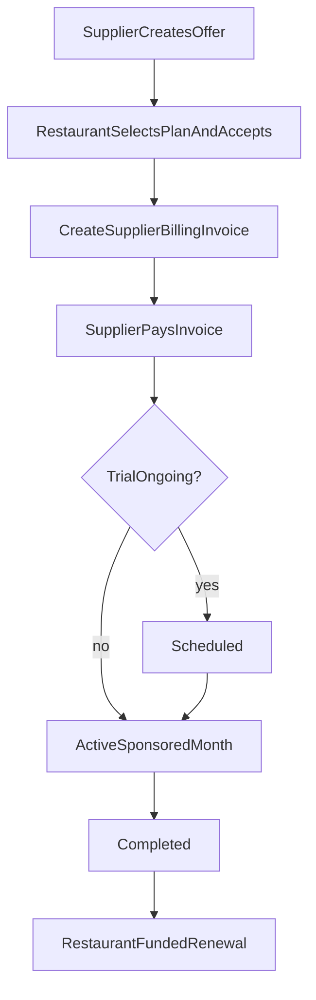
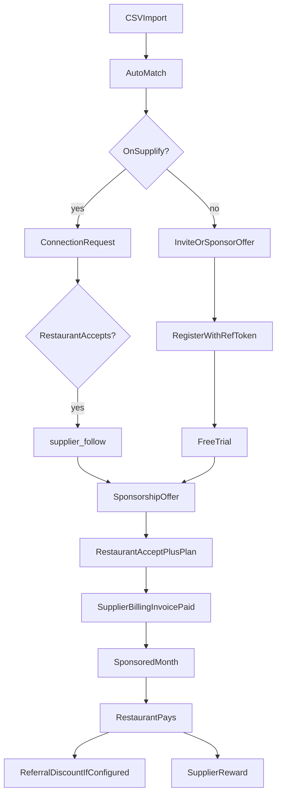

# Supplier customer import, referral & sponsored onboarding

> Pricing model note: plan names, prices, limits, and upgrade examples in this document may reflect the legacy tier catalog. Current commercial guidance lives in [../product/four-plan-pricing-model.md](../product/four-plan-pricing-model.md) and [../product/plans-and-limits.md](../product/plans-and-limits.md). Use those documents for current public names, limits, trial behavior, add-ons, AI allowances, and billing status.

Suppliers can import their existing restaurant customer base, match records to Supplify tenants, invite non-users, **offer supplier-paid sponsorship** of the restaurant’s first paid month, and track conversion metrics. Referred restaurants receive platform benefits (Free Trial + first-paid discount per config); suppliers earn rewards when referrals convert to paid subscriptions.

**Migrations:** `0169_supplier_growth_program.sql`, `0192_supplier_sponsorship_lifecycle.sql`  
**Web:** `/app/customer-growth` — `SupplierCustomerGrowthPage`  
**Mobile:** Web-first; see [MOBILE_FEATURE_PARITY.md](../mobile/MOBILE_FEATURE_PARITY.md)

**Related:** [free-trial-expiry.md](./free-trial-expiry.md) · [tenant-registration.md](./tenant-registration.md) · [supplier-follow.md](./supplier-follow.md) · [supplier-ops.md](./supplier-ops.md) · [four-plan-pricing-model.md](../product/four-plan-pricing-model.md)

## Product rules

| Rule                         | Behavior                                                                                                                             |
| ---------------------------- | ------------------------------------------------------------------------------------------------------------------------------------ |
| Import                       | CSV with columns: Restaurant Name, Contact Person, Phone, Email, Address, Area/Region, Credit Limit, Payment Terms, Sales Rep, Notes |
| Matching                     | Email exact → phone → name+area fuzzy; status `existing_supplify` or `import_only`                                                   |
| Existing Supplify restaurant | Supplier sends **connection request**; restaurant must accept before `supplier_follow` is created                                    |
| Not on Supplify              | Supplier **invites** (email / WhatsApp share link / copy link) or **offers sponsorship**                                             |
| Referral signup              | Restaurant registers via `/register?ref={token}`; optional `referralToken` on `POST /api/register/complete`                          |
| Restaurant incentive         | Free Trial (platform `free_sandbox_days`) + first-paid discount from `referral_program_config.firstPaidDiscountPercent`              |
| Supplier reward              | On referred restaurant’s first paid conversion: free month OR platform billing credit (admin-configurable)                           |
| Sponsorship                  | Supplier offers → restaurant selects **monthly** plan + accepts → supplier `billing_invoice` → pay → schedule after trial → activate |
| After sponsored month        | Restaurant becomes payer; referral discount applies per `referralDiscountAppliesTo` (default: first restaurant-funded cycle)         |

## Supplier-paid sponsorship lifecycle

### States

`offered` → `accepted` → `payment_pending` → (`payment_failed` ↔ retry) → `scheduled` | `active` → `completed`  
Also: `expired`, `cancelled`, `refunded`, `reversed`

### Billing (source of truth)

- Charge path: supplier-side **`billing_invoice`** linked via `supplier_billing_invoice_id`.
- Amount comes from an **immutable `pricing_snapshot`** (plan id/name, monthly base, tax, currency, final amount) captured at restaurant accept — **not** from the client.
- Payment uses `sponsorship-billing.js` + `getBillingGateway()` (stub/manual today). Does **not** call `applyPaidSubscription` or `markSubscriptionPastDue` on the supplier.
- Sponsorship stays `payment_pending` until the invoice is **PAID** (gateway charge or admin manual approval). Accept alone never marks paid.
- Generic `POST /api/billing/pay-now` **excludes** invoices with `metadata.type = supplier_sponsorship`.
- **Monthly only.** Yearly plans are rejected with `SPONSORSHIP_PLAN_NOT_ELIGIBLE`.
- **Not PSP production-ready** until a live gateway (e.g. Stripe) is registered and tested. Stub/manual is the supported production path today.

### Caps and config (`referral_program_config`)

| Key                                              | Meaning                                                                                              |
| ------------------------------------------------ | ---------------------------------------------------------------------------------------------------- |
| `sponsorshipEnabled`                             | Master switch                                                                                        |
| `sponsorshipLimitsPerYear`                       | Calendar-year caps keyed by **supplier plan code** (`gold`, `platinum`, …). Blank/`null` = unlimited |
| `eligibleSponsorPlans`                           | Restaurant plan codes that may be sponsored                                                          |
| `offerExpiryDays`                                | Unaccepted offer TTL (default 14)                                                                    |
| `referralDiscountAppliesTo`                      | `first_restaurant_funded` (default) or `sponsored_cycle`                                             |
| `requireRestaurantPaymentMethodBeforeActivation` | Gate activation on restaurant PM                                                                     |
| `supportedBillingIntervals`                      | `['MONTHLY']` only                                                                                   |
| `maxSponsoredAmount`                             | Optional monetary cap                                                                                |
| `paymentPendingStaleDays`                        | Stale unpaid offers expire (default 7)                                                               |

Usage API returns `{ used, remaining, limit, resetDate, unlimited }`.

### Who pays when

1. Restaurant referral registration → Free Trial (no sponsorship charge).
2. After accept + supplier payment confirmed → sponsored month (`payer_type=supplier`).
3. After `completed` → restaurant-funded renewal; supplier is **never** auto-charged again.
4. Referral discount: by default applies to the restaurant’s **first self-funded** checkout, not the sponsored month.

## Sponsorship limits (config, not hardcoded names)

Limits are read from `referral_program_config.sponsorshipLimitsPerYear[supplier.plan_code]`.  
Under the four-plan model, Supplier Growth is code `gold` and Supplier Scale is `platinum`. Legacy keys (`silver`, `enterprise`) remain for compatibility.

Admin → Plans → Growth settings edits these values.

## End-to-end growth funnel

## API

### Supplier (`/api/supplier/growth/*`)

Requires `SUPPLIER` + `supplier_growth` feature + permissions:

| Permission         | Use                                        |
| ------------------ | ------------------------------------------ |
| `CUSTOMERS_IMPORT` | Import preview / execute                   |
| `CUSTOMERS_MANAGE` | Invite, sponsor, connect, rematch, pay     |
| `GROWTH_VIEW`      | Prospects list, metrics, list sponsorships |

| Method | Path                               | Description                                           |
| ------ | ---------------------------------- | ----------------------------------------------------- |
| POST   | `/customers/import/preview`        | Validate CSV                                          |
| POST   | `/customers/import`                | Execute import + auto-match                           |
| GET    | `/customers/prospects`             | List prospects                                        |
| POST   | `/customers/prospects/:id/sponsor` | Compat: create sponsorship **offer**                  |
| GET    | `/sponsorships`                    | List sponsorships                                     |
| GET    | `/sponsorships/eligibility`        | Eligibility + usage                                   |
| POST   | `/sponsorships/quote`              | Server-side price quote                               |
| POST   | `/sponsorships`                    | Create offer                                          |
| GET    | `/sponsorships/:id`                | Detail                                                |
| POST   | `/sponsorships/:id/cancel`         | Cancel before paid activation                         |
| POST   | `/sponsorships/:id/payment`        | Charge sponsorship invoice (idempotency key required) |
| POST   | `/sponsorships/:id/retry-payment`  | Retry failed payment                                  |
| GET    | `/metrics`                         | Growth + sponsorship funnel metrics                   |

### Restaurant (`/api/restaurant/growth/*`)

| Method   | Path                                  | Description                                                         |
| -------- | ------------------------------------- | ------------------------------------------------------------------- |
| GET/POST | `/connection-requests…`               | Connection accept/decline                                           |
| GET      | `/sponsorship-offers`                 | Pending/active offers                                               |
| GET      | `/sponsorship-offers/:id`             | Offer detail                                                        |
| POST     | `/sponsorship-offers/:id/accept`      | Body `{ planId }` — accept + select plan → creates supplier invoice |
| POST     | `/sponsorship-offers/:id/decline`     | Decline offer                                                       |
| POST     | `/sponsorship-offers/:id/select-plan` | Alias of accept                                                     |

### Admin

| Method    | Path                                               | Permission                                 |
| --------- | -------------------------------------------------- | ------------------------------------------ |
| GET/PATCH | `/api/admin-dashboard/growth-settings`             | `ADMIN_GROWTH`                             |
| GET       | `/api/admin-dashboard/sponsorships/:id`            | Inspect                                    |
| POST      | `/api/admin-dashboard/sponsorships/:id/manual-pay` | Approve unpaid invoice                     |
| POST      | `/api/admin-dashboard/sponsorships/:id/refund`     | Ledger refund / reverse                    |
| POST      | `/api/admin-dashboard/sponsorships/:id/reconcile`  | Reconcile paid invoice → schedule/activate |

### Domain errors

`SPONSORSHIP_NOT_ELIGIBLE`, `SPONSORSHIP_LIMIT_REACHED`, `SPONSORSHIP_ALREADY_EXISTS`, `SPONSORSHIP_OFFER_EXPIRED`, `SPONSORSHIP_INVALID_STATE`, `SPONSORSHIP_PLAN_NOT_ELIGIBLE`, `SPONSORSHIP_PAYMENT_REQUIRED`, `SPONSORSHIP_PAYMENT_FAILED`, `SPONSORSHIP_RESTAURANT_PAYMENT_METHOD_REQUIRED`, `CUSTOMER_LOCATION_LIMIT_REACHED`

## Database

Core tables from `0169`; lifecycle columns/indexes/constraints from `0192` (`pricing_snapshot`, payment fields, offer expiry, idempotency, live-restaurant uniqueness, nullable period until activation).

## Background job

| Job                          | Interval | Handler                                                                                       |
| ---------------------------- | -------- | --------------------------------------------------------------------------------------------- |
| `growth_program_maintenance` | 1 h      | Expire offers, stale payments, activate scheduled, complete active, ending-soon notifications |

## Web surfaces

| Surface               | Path / component                           |
| --------------------- | ------------------------------------------ |
| Customer Growth       | `/app/customer-growth`                     |
| Restaurant offers     | `SponsorshipOffersPanel` on Suppliers page |
| Admin growth settings | `AdminGrowthSettingsPanel`                 |
| Registration referral | `RegisterCompletePage` `?ref=`             |

## Tests

- `supplier-sponsorship.service.test.js` — snapshot, domain errors
- `sponsorship-billing.test.js` — invoice create + payment failure isolation
- `supplier-growth-program.test.js` — trial clamp

## QA checklist

See [regression-checklist.md](../qa/regression-checklist.md) — **§4.9 Supplier customer growth**.
