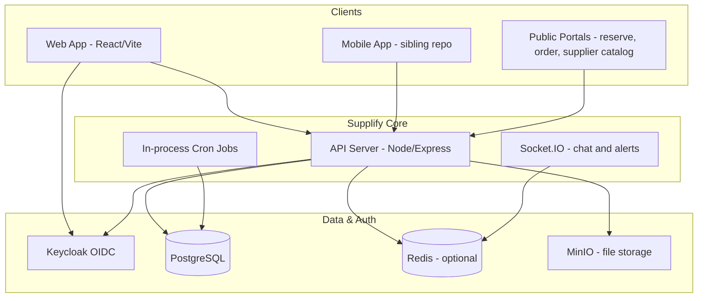
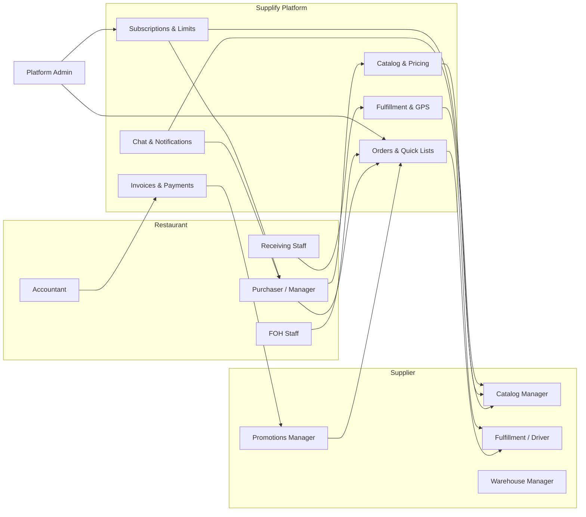

# Supplify — Executive Overview

**Audience:** Executives, product leaders, solution architects, and onboarding partners who need a concise but accurate picture of what Supplify is, who it serves, and how the platform is built.

**Source of truth:** Application code, database migrations, and route inventories in this repository (metrics verified 2026-06-17).

---

## What Supplify Is

Supplify is a **restaurant–supplier marketplace and operations platform**. It connects food-service buyers (restaurants) with distributors and producers (suppliers) in a single, role-based system where ordering, catalog management, fulfillment, receiving, finance, reservations, staff operations, and platform administration share one data model and one API.

The product is not a lightweight ordering widget. It is an end-to-end B2B supply chain workspace with:

- **Unified ordering** — Restaurants browse supplier catalogs, build carts, place orders, schedule re-orders via quick lists, and track status through delivery and invoicing.
- **Supplier operations** — Suppliers manage products, warehouses, fulfillment boards, driver dispatch, GPS tracking, promotions, and receivables.
- **Restaurant operations** — Restaurants receive goods, record quality, manage on-hand inventory, run front-of-house reservations, and reconcile invoices.
- **Monetization** — Tenant-specific Growth / Scale subscriptions plus a 30-day Free Trial gate features and usage meters (see [../product/four-plan-pricing-model.md](../product/four-plan-pricing-model.md)).
- **Growth and discovery** — Supplier customer import, referral programs, public mini-store catalogs, quote requests, and consumer B2C ordering extend reach beyond logged-in B2B users.
- **Platform control** — Admins manage tenants, plans, feature flags, limit overrides, deal approvals, impersonation, and observability.

The canonical product description in code aligns with `docs/product/overview.md`: _"Supplify is a restaurant–supplier marketplace: ordering, receiving, fulfillment, finance, reservations, and platform admin."_

---

## User Ecosystem

Supplify serves multiple personas across authenticated workspaces, public portals, and mobile-adjacent experiences.

### Core B2B tenants

| Persona                    | Keycloak / app role | Primary workspace                                    |
| -------------------------- | ------------------- | ---------------------------------------------------- |
| **Restaurant operator**    | `RESTAURANT`        | Orders, receiving, inventory, reservations, finance  |
| **Supplier operator**      | `SUPPLIER`          | Catalog, fulfillment, warehouses, promotions, growth |
| **Platform administrator** | `ADMIN`             | Tenant management, billing, feature toggles, audit   |

Each restaurant and supplier tenant is a **workspace** with its own subscription, branding, team members, and tenant-scoped RBAC roles (see `apps/api/src/lib/role-matrix.js`).

### Extended personas

| Persona                    | Access pattern                                                          | Purpose                                                |
| -------------------------- | ----------------------------------------------------------------------- | ------------------------------------------------------ |
| **Driver**                 | Supplier workspace role `Driver` with `DRIVER_DELIVERIES_*` permissions | Assigned deliveries, status updates, proof of delivery |
| **Restaurant staff (FOH)** | Role `FOH Staff` or `Receiving Staff`                                   | Reservations, receiving, limited order visibility      |
| **Accountant**             | Role `Accountant` on either side                                        | Invoices, payments, subscription view                  |
| **Staff portal user**      | Keycloak `staff_portal` → `STAFF_PORTAL` app role                     | PTO, shift swaps, self-service dashboard at `/staff`   |
| **Reservation guest**      | Public, unauthenticated                                                 | Book, confirm, cancel, waitlist at `/reserve`          |
| **Consumer (B2C)**         | Public storefront at `/order/:restaurantSlug`                           | Menu browse, checkout, order tracking, loyalty         |
| **Prospective tenant**     | `PENDING` until registration completes                                  | `/register/complete` → `/app/activate`               |

Team members inside a tenant are not separate Keycloak platform roles; they are **users assigned tenant roles** (`tenant_user_roles`) with granular permissions from `permission-keys.js`.

---

## Value Propositions by Persona

### Restaurants

Restaurants gain a **single pane of glass** for procurement and back-of-house coordination:

- **Less friction in ordering** — Browse linked supplier catalogs, save quick lists, schedule recurring orders, and chat in context next to products and orders.
- **Visibility through delivery** — Track in-flight orders, view supplier GPS when enabled, and record receiving with optional quality photos (plan-gated `receiving_quality`).
- **Financial clarity** — Invoices tied to orders; payment recording; supplier account statements (with known limitations documented in the product guide).
- **Operational breadth** — Inventory and waste tracking, disputes, deals redemptions, contract pricing, quote requests, and FOH reservations on one platform.
- **Scalable controls** — Multi-branch inventory, advanced roles, and smart reorder unlock as restaurants move from Growth to Scale (suppliers: Growth → Scale with active customer location metering).

### Suppliers

Suppliers reduce missed orders and manual coordination:

- **Centralized order intake** — All restaurant orders in one fulfillment workflow with decline reasons, amendments, and calendar views.
- **Catalog and pricing power** — Product CRUD, bulk CSV import, image ZIP import, contract pricing, and optional public mini-store at `/supplier/:slug`.
- **Logistics** — Warehouse management, multi-warehouse routing (Supplier Scale), delivery board, driver assignment, route planning, and GPS tracking.
- **Revenue tools** — Invoicing from delivered orders, promotions/deals with admin approval, growth program for customer acquisition, and command-center analytics.
- **Relationship management** — Chat, reviews, disputes resolution, and restaurant connection requests.

### Drivers

Drivers interact through a focused **delivery-only surface** (`/app/driver-deliveries`) with permissions limited to viewing and updating assigned deliveries. They do not access catalog, billing, or team administration — reducing training burden and security exposure.

### Platform administrators

Admins operate the **control plane**:

- Tenant lifecycle: plans, locks, Free Trial extension, sponsorship limits
- Feature flags: global and per-tenant overrides
- Limit overrides: temporary meter caps (orders/day, chats/day, etc.)
- Deal moderation: approve/reject supplier promotions
- Impersonation: enter a tenant workspace for support
- Health and audit: cron job failures, audit logs, growth settings

---

## Platform at a Glance

### Architecture

### Application layout

| Layer        | Location                                                            | Responsibility                                                 |
| ------------ | ------------------------------------------------------------------- | -------------------------------------------------------------- |
| **API**      | `apps/api`                                                          | 554 HTTP routes, RBAC, subscriptions, business logic, cron     |
| **Web**      | `apps/web`                                                          | 80 frontend routes (`apps/web/src/App.tsx`), React SPA         |
| **Database** | `apps/api/db/migrations`                                            | 215 SQL migrations, schema evolution since `0000`              |
| **Tests**    | `apps/api/**/*.test.js`, `apps/web/**/*.test.{ts,tsx}`, `tests/e2e` | 213 API test files, 309 web test files (per bootstrap metrics) |

### Technology stack

The monorepo uses **pnpm workspaces** with a Node.js/Express API and a Vite-powered React frontend. PostgreSQL is the system of record; Redis is optional but recommended for Socket.IO fan-out and order-calendar caching in multi-replica deployments (Railway). Keycloak provides OIDC identity; MinIO (or S3-compatible storage) handles uploads for chat attachments, product images, and bulk import archives. A sibling **supplify-mobile** repository consumes the same API with parity expectations documented in `docs/mobile/MOBILE_FEATURE_PARITY.md`. Local development is orchestrated via `pnpm dev` with Docker profiles for Keycloak, Postgres, and optional full-stack nginx.

### Subscription tiers

Public self-serve plans are **tenant-specific**. Canonical commercial doc: [../product/four-plan-pricing-model.md](../product/four-plan-pricing-model.md).

| Tenant     | Public name             | Internal code | Monthly (USD) | Positioning                                           |
| ---------- | ----------------------- | ------------- | ------------: | ----------------------------------------------------- |
| Restaurant | Restaurant Growth       | `silver`      |           $49 | Single-branch purchasing & ops                        |
| Restaurant | Restaurant Intelligence | `gold`        |          $149 | Deterministic operations intelligence                 |
| Restaurant | Restaurant Scale        | `platinum`    |          $349 | Multi-branch insight + read-only AI assistant         |
| Supplier   | Supplier Growth         | `gold`        |          $149 | 50 active customer locations / month                  |
| Supplier   | Supplier Scale          | `platinum`    |          $349 | 200 active customer locations + multi-warehouse depth |
| Both       | 30-day Free Trial       | `free`        |            $0 | Time-limited; trial target plan features              |

Custom / `enterprise` rows are **hidden from self-serve**. Legacy `bronze` input maps to `silver`.

Feature gates and meter limits are enforced server-side via `requireFeature()` middleware and `plan-enforcement.js`, keyed from `feature-keys.js`.

### Domain coverage (high level)

| Domain                 | Restaurant | Supplier |  Admin  |    Public    |
| ---------------------- | :--------: | :------: | :-----: | :----------: |
| Auth & registration    |    ✓     |   ✓    |   ✓   |     —      |
| Catalog & pricing      |   browse   |  manage  |   —   |  mini-store  |
| Ordering & quick lists |    ✓     | fulfill  |   —   |   B2C menu   |
| Fulfillment & GPS      |   track    |   ✓    |   —   |  B2C track   |
| Receiving & disputes   |    ✓     |   view   |   —   |     —      |
| Finance & invoices     |    ✓     |   ✓    |   —   |     —      |
| Deals & promotions     |   redeem   |  manage  | approve |     —      |
| Reservations           |    ✓     |   —    |   —   | guest portal |
| Staff & labour         |    ✓     |   team   |   —   | self-service |
| Chat & notifications   |    ✓     |   ✓    |   —   |     —      |
| Growth & referrals     |  benefit   |   ✓    | config  | register ref |
| Quote requests         |    ✓     | respond  |   —   |     —      |
| Reports                |    ✓     |   ✓    | metrics |     —      |
| Subscriptions          |    ✓     |   ✓    | manage  |     —      |

---

## Key Platform Metrics

These figures are generated from repository artifacts and should be re-verified after major releases.

| Metric                       | Value | How to verify                                      |
| ---------------------------- | ----: | -------------------------------------------------- |
| **API routes**               |   554 | `docs/audits/route-inventory.json` (`count` field) |
| **Frontend routes**          |    80 | `apps/web/src/App.tsx` route definitions           |
| **SQL migrations**           |   215 | `apps/api/db/migrations/*.sql`                     |
| **API test files**           |   213 | `apps/api/**/*.test.js`                            |
| **Web test files**           |   309 | `apps/web/**/*.test.{ts,tsx,jsx}`                  |
| **Plan tiers (active)**      |     4 | `free`, `silver`, `gold`, `platinum`               |
| **Workspace system roles**   |    16 | 7 restaurant + 9 supplier in `role-matrix.js`      |
| **Mermaid diagrams (valid)** |    50 | `scripts/check-mermaid-diagrams.mjs`               |

---

## Ecosystem Diagram

The following diagram shows how value flows between participants on the platform.

Public consumers and reservation guests connect at the edges: `/order/:slug` for B2C and `/reserve` for table booking, both backed by the same API and tenant data.

---

## Strategic Outcomes

### For the business

Supplify monetizes through **subscription tiers** aligned to operational maturity, with upgrade paths triggered by limit proximity (orders/day, chats/day, branches, products) and feature gates. Conversion events (`VIEW_PLANS`, `OPEN_UPGRADE`) are recorded for funnel analysis (`POST /api/subscriptions/conversion-event`).

The **supplier growth program** (migration `0169`) turns suppliers into acquisition channels: CSV import, connection requests, referral tokens, sponsorship, and rewards on first paid conversion.

### For operations

A **single PostgreSQL schema** with 215 migrations means auditability and consistent reporting across tenants. In-process cron jobs handle scheduled orders, billing, trial expiry, promotions expiry, reorder forecasts, and optional delivery rollover (disabled by default).

### For engineering

RBAC is **permission-first**: route guards resolve `tenant_user_roles` → permissions, with system roles seeded from `role-matrix.js` per tenant. Admin impersonation uses a separate token path without weakening tenant isolation for normal users.

---

## Known Limitations (Executive Summary)

The following items are **implemented partially** or **disabled by default**. Full detail appears in the Complete Product Guide.

| Area                                     | Status                                                                                   |
| ---------------------------------------- | ---------------------------------------------------------------------------------------- |
| Supplier Settings → Delivery Zones tab | UI exists; tab hidden (`DELIVERY_ZONES_ENABLED = false`); warehouse zone API is separate |
| Restaurant finance opening balance       | Hardcoded `0` in account statement summary (`TODO` in API)                               |
| Delivery rollover cron                   | Registered but no-op unless `DELIVERY_ROLLOVER_ENABLED=true`                             |

These are product honesty markers, not blockers for core B2B ordering flows.

---

## Implementation Evidence

| Topic                 | Primary paths                                                                                                            |
| --------------------- | ------------------------------------------------------------------------------------------------------------------------ |
| Product definition    | `docs/product/overview.md`, `docs/sales/02_solution.md`, `docs/sales/03_platform_overview.md`                            |
| Route inventory       | `docs/audits/route-inventory.json`                                                                                       |
| Bootstrap metrics     | `docs/onboarding/_artifacts/bootstrap-metrics.md`                                                                        |
| Frontend routing      | `apps/web/src/App.tsx`                                                                                                   |
| RBAC & roles          | `apps/api/src/lib/role-matrix.js`, `apps/api/src/lib/tenant-roles.js`, `docs/architecture/rbac-permission-matrix.md`     |
| Subscriptions & tiers | `docs/product/four-plan-pricing-model.md`, `docs/product/plans-and-limits.md` (historical: `tier-matrix.md`, `plans.md`) |
| Auth & registration   | `apps/api/src/lib/rbac.js`, `docs/features/tenant-registration.md`                                                       |
| Feature catalog       | `docs/product/features.md`, `docs/product/feature-catalog-technical.md`                                                  |
| Cron jobs             | `docs/operations/cron-jobs.md`, `apps/api/src/lib/register-cron-jobs.js`                                                 |
| Demo readiness audit  | `docs/audits/SUPPLIFY_DEMO_READINESS_AUDIT.md`                                                                           |

---

## Next Steps for Readers

- **Business stakeholders:** Continue to [02-complete-product-guide.md](./02-complete-product-guide.md) for domain-by-domain behavior, order lifecycle, and tenant model.
- **Technical onboarding:** Run `pnpm setup && pnpm dev`, then use `docs/product/features.md` verification tables and `docs/qa/regression-checklist.md`.
- **Sales narrative:** See `docs/sales/` (01_problem through enterprise_checklist).

---

_Document version: 2026-06-17. Metrics tied to git commit `ab5695e` per bootstrap artifacts._
