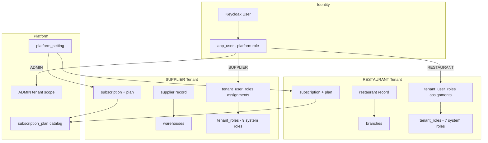
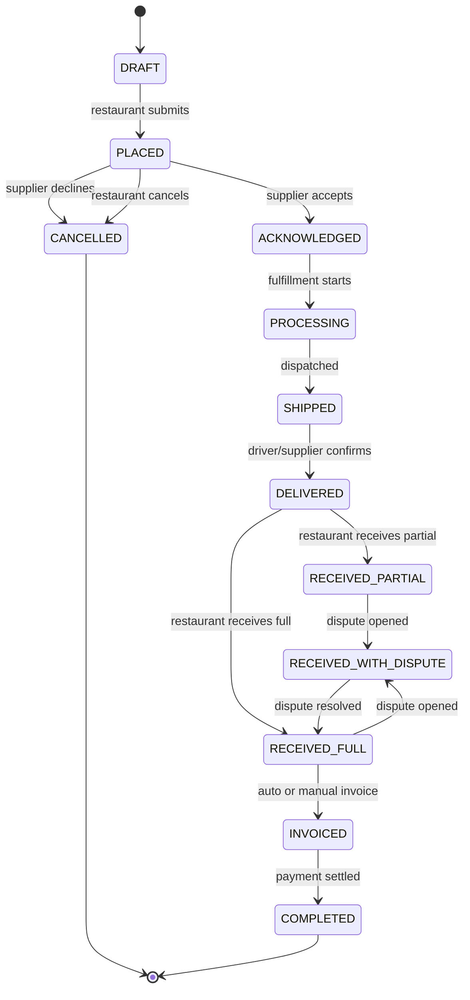

# Supplify — Complete Product Guide

**Audience:** Product managers, business analysts, implementation consultants, and engineers who need end-to-end knowledge of every Supplify domain.

**Source of truth:** Application code, migrations, route inventories, and existing product documentation in this repository.

---

## Introduction

This guide documents **all major product domains** in Supplify: what each does, who can access it, how it connects to adjacent domains, and where to find implementation evidence in the codebase. It is written for readers who will configure tenants, demo the product, or extend features — not as a marketing overview.

Supplify's data model centers on **tenants** (`RESTAURANT`, `SUPPLIER`, `ADMIN`) with per-tenant subscriptions, team members, and RBAC. B2B orders flow from restaurant cart through supplier fulfillment to receiving, invoicing, and optional disputes. Parallel tracks cover reservations (FOH), consumer B2C ordering, quote requests, growth programs, and platform administration.

---

## User Types and Roles

### Platform roles (Keycloak → `app_user.role`)

| Role           | Set by                                        | Workspace access                        |
| -------------- | --------------------------------------------- | --------------------------------------- |
| `PENDING`      | First login before org setup                  | `/register/complete` only               |
| `RESTAURANT`   | Registration or Keycloak `restaurant` role    | Restaurant sidebar and APIs             |
| `SUPPLIER`     | Registration or Keycloak `supplier` role      | Supplier sidebar and APIs               |
| `ADMIN`        | Keycloak `admin` role or seeded admin emails  | `/app/admin` control plane              |
| `STAFF_PORTAL` | Keycloak `staff_portal` / `staff_portal_user` | `/staff/login`, `/staff/dashboard` only |

Resolution logic lives in `apps/api/src/lib/rbac.js` (`upsertUser`). Platform roles take precedence over staff portal for dual-role Keycloak users.

### Restaurant workspace system roles (`role-matrix.js`)

| #   | Role                   | Purpose                                                                         |
| --- | ---------------------- | ------------------------------------------------------------------------------- |
| 1   | **Owner**              | Full access; immutable main admin                                               |
| 2   | **Restaurant Manager** | Daily ops: orders, receiving, catalog view, reservations; no billing/team admin |
| 3   | **Purchaser**          | Browse catalog, create and track orders, chat                                   |
| 4   | **Receiving Staff**    | Receive deliveries, open receiving disputes; cannot create orders               |
| 5   | **Accountant**         | Invoices, payments, subscriptions view                                          |
| 6   | **Viewer**             | Read-only across workspace views                                                |
| 7   | **FOH Staff**          | Reservations create/edit/view only                                              |

### Supplier workspace system roles (`role-matrix.js`)

| #   | Role                        | Purpose                                                                             |
| --- | --------------------------- | ----------------------------------------------------------------------------------- |
| 8   | **Owner**                   | Full supplier access                                                                |
| 9   | **Supplier Manager**        | Orders (accept/decline/fulfill), catalog, fulfillment, growth view, customer import |
| 10  | **Warehouse Manager**       | Warehouses, fulfillment board, delivery ops                                         |
| 11  | **Order Fulfillment Staff** | Fulfillment and delivery board; no billing or catalog import                        |
| 12  | **Driver**                  | Assigned deliveries only (`DRIVER_DELIVERIES_VIEW`, `DRIVER_DELIVERIES_MANAGE`)     |
| 13  | **Catalog Manager**         | Products, catalog, pricing, import                                                  |
| 14  | **Promotions Manager**      | Deals, promotions, reorder intelligence                                             |
| 15  | **Accountant**              | Finance and receivables only                                                        |
| 16  | **Viewer**                  | Read-only supplier workspace                                                        |

### Additional personas (17+)

| #   | Persona                      | Notes                                                     |
| --- | ---------------------------- | --------------------------------------------------------- |
| 17  | **Platform admin** (`ADMIN`) | Separate from tenant Owner; uses admin dashboard          |
| 18  | **Staff portal user**        | Labour self-service; provisioned from restaurant Team tab |
| 19  | **Reservation guest**        | Unauthenticated public booking                            |
| 20  | **Consumer (B2C)**           | Guest or light account on `/order/:restaurantSlug`        |

Custom tenant roles can be created with subsets of permissions; system role names are protected (`RESERVED_SYSTEM_ROLE_NAMES` in `tenant-roles.js`).

**Implementation evidence:** `apps/api/src/lib/role-matrix.js`, `apps/api/src/lib/permission-keys.js`, `docs/architecture/rbac-permission-matrix.md`, `apps/web/src/components/Sidebar.tsx`, `apps/web/src/components/RequirePermission.tsx`.

---

## Tenant Model

Each commercial organization is a **tenant** with type `RESTAURANT` or `SUPPLIER`. Users belong to tenants through `tenant_user` membership and hold one or more `tenant_user_roles`.

**Registration flow:** `POST /api/register/complete` creates tenant, org, default system roles, supplier catalog/warehouse (supplier path), and subscription with `lock_reason = pending_activation`. Activation clears lock via Free checkout or paid billing (`docs/features/tenant-registration.md`).

**Multi-branch:** Restaurants use `branch` records; suppliers use org branches (`/app/org`) and warehouses. Plan feature `multi_branch` gates expansion.

**Implementation evidence:** `apps/api/src/routes/register.routes.js`, `apps/api/src/lib/billing/`, `apps/api/db/migrations/0041_rbac_tenant_roles.sql`, `apps/web/src/pages/RegisterCompletePage.tsx`, `apps/web/src/pages/AccountActivationPage.tsx`.

---

## Authentication and Session Management

### Login

- **OIDC authorization code flow** via Keycloak (`/login`, `/auth/login`).
- Session cookies are HTTP-only; API validates JWT on each request.
- Expired sessions redirect to `/login?expired=true`.

### Guards

- `AuthGuard` (web) blocks unauthenticated access to `/app/*`.
- `requireAuth`, `requireRole`, `requirePermission` (API) enforce server-side access.
- `billingAccess` middleware blocks writes when subscription is locked (pending activation, Free Trial expired, suspended).

### Invitations

- Team invites: `/invite` → `POST` acceptance APIs.
- Branch invites: `/invite/branch`.
- Restaurant invitations from suppliers: migration `0087_restaurant_invitations.sql`.

### Legal compliance

- `legal_acceptances` (migration `0129`); `/legal/reaccept` for policy updates.

**Implementation evidence:** `apps/api/src/routes/auth.routes.js`, `apps/web/src/components/AuthGuard.tsx`, `apps/web/src/lib/authRedirect.ts`, `apps/api/src/middlewares/billingAccess.js`, `tests/e2e/suites/critical_e2e/auth.spec.ts`.

---

## Supplier and Restaurant Onboarding

### Supplier onboarding

After activation, suppliers configure:

- **Profile & business** — `SupplierSettingsPage` tabs: profile, business, notifications, plan, team, drivers, branches, warehouses, activity.
- **Catalog seed** — Created at registration; products added via Products page, CSV bulk upload, or ZIP image import.
- **Warehouse** — Default warehouse created at registration; additional warehouses plan-gated (`warehouses` feature).
- **Fulfillment** — Enable driver management, fulfillment board (`/app/fulfillment`), command center (`/app/command-center`) on eligible plans.

### Restaurant onboarding

- **Wizard** — `/app/onboarding` → `restaurant-onboarding` API for setup steps.
- **Supplier linking** — Browse `/app/suppliers`, follow/connect, block list support.
- **Branch setup** — Settings and branch invitations for multi-location (Gold+).
- **Push notifications** — Optional PWA opt-in during onboarding.

**Implementation evidence:** `apps/api/src/routes/restaurant-onboarding.routes.js`, `apps/web/src/pages/RestaurantOnboardingPage.tsx`, `apps/web/src/pages/SupplierSettingsPage.tsx`, `apps/api/scripts/seed-demo-users.js`.

---

## Catalog, Products, and Pricing

### Supplier catalog management

| Capability        | Web                                  | API                                    |
| ----------------- | ------------------------------------ | -------------------------------------- |
| Product CRUD      | `/app/products`, `/app/products/:id` | `/api/products`                        |
| Bulk CSV upload   | Products page                        | `/api/products/import`                 |
| Image ZIP import  | ProductImageImportDialog             | `/api/products/import-images`          |
| Contract pricing  | `/app/contract-pricing`              | `/api/prices`, contract pricing routes |
| Public mini-store | Settings catalog link card           | `GET /api/public/suppliers/:idOrSlug`  |

Restaurants see supplier catalogs through authenticated product APIs with **server-side price resolution** (`resolveProductPricesBatch`). Contract prices override list prices per restaurant relationship.

### Restaurant pricing views

- **My contract prices** — `/app/my-prices` for negotiated rates.
- **Restaurant internal pricing** — `/api/restaurant-pricing` for cost/menu pricing (separate from supplier catalog).

### Warehouses and inventory (supplier)

- **Warehouses tab** — Full CRUD wired to `/api/warehouses`.
- **Per-warehouse zones** — `GET/POST /api/warehouses/:id/zones` for warehouse-scoped delivery zones (distinct from Settings Delivery Zones tab).
- **Stock levels** — `/app/inventory` → `/api/inventory`.

> **Partial feature — Supplier Settings Delivery Zones:** The Delivery Zones and Contacts tabs in Supplier Settings are **UI-only**. `DELIVERY_ZONES_ENABLED` and `CONTACTS_TAB_ENABLED` are `false` in `supplierSettingsShared.tsx`. Warehouse zone APIs exist separately; the settings tab was never wired. See `docs/audits/SUPPLIFY_DEMO_READINESS_AUDIT.md`.

**Implementation evidence:** `apps/api/src/routes/products.routes.js`, `apps/api/src/routes/warehouses.routes.js`, `apps/api/src/services/public-supplier-catalog.service.js`, `apps/web/src/pages/PublicSupplierCatalogPage.tsx`, `apps/web/src/components/supplier/settings/supplierSettingsShared.tsx`.

---

## Ordering Lifecycle

### Cart and placement

1. Restaurant adds items to cart (`/app/cart`) from supplier catalogs.
2. Checkout validates plan limits (orders/day), supplier connection, and minimums.
3. Order created with status `PLACED` (or `DRAFT` if saved).
4. Notifications fan out to supplier team via `notifyTenantUsers`.

### Status workflow

PostgreSQL enum `order_status` (evolved across migrations `0021`, `0028`, `0069`, `0110`):

| Status                   | Meaning                                                                            |
| ------------------------ | ---------------------------------------------------------------------------------- |
| `DRAFT`                  | Saved, not submitted                                                               |
| `PLACED`                 | Submitted by restaurant                                                            |
| `PENDING_APPROVAL`       | Awaiting internal approval (legacy path; `approvals_budgets` feature removed)      |
| `ACKNOWLEDGED`           | Supplier accepted                                                                  |
| `PROCESSING`             | Being picked/packed                                                                |
| `SHIPPED` / `IN_TRANSIT` | Out for delivery                                                                   |
| `DELIVERED`              | Supplier marked delivered                                                          |
| `RECEIVED_PARTIAL`       | Restaurant received partial shipment                                               |
| `RECEIVED_FULL`          | Restaurant received complete shipment                                              |
| `RECEIVED_WITH_DISPUTE`  | Received but dispute open                                                          |
| `INVOICED`               | Invoice generated                                                                  |
| `COMPLETED`              | Terminal success                                                                   |
| `CANCELLED`              | Cancelled or **declined** (`cancelled_by = SUPPLIER` shows "Declined by supplier") |

### Adjacent ordering features

| Feature              | Description                                                                  |
| -------------------- | ---------------------------------------------------------------------------- |
| **Quick lists**      | Saved templates; scheduled re-order via cron (`scheduled-orders.service.js`) |
| **Order calendar**   | Redis-backed delivery calendar (`/api/orders/calendar`)                      |
| **Order amendments** | Post-place line changes; plan `order_amendments`                             |
| **Supplier decline** | Required `decline_reason`; migration `0108` cancellation metadata            |
| **Smart reorder**    | Forecast job `reorder-forecast.job.js`; plan `smart_reorder`                 |

**Implementation evidence:** `apps/api/db/migrations/0021_update_order_status_enum.sql`, `apps/api/src/routes/orders.routes.js`, `apps/web/src/lib/orderStatusDisplay.ts`, `apps/api/src/lib/order-statuses.js`, `docs/features/order-decline.md`, `tests/e2e/suites/critical_e2e/orders.spec.ts`.

---

## Fulfillment, Drivers, and GPS

### Supplier fulfillment board

- **Route:** `/app/fulfillment`
- **APIs:** `/api/fulfillment/*`, assignment rollover endpoint, route planning (migration `0127`)
- **Features:** Assign drivers, plan routes, update assignment status, proof of delivery

### Driver experience

- **Route:** `/app/driver-deliveries` (Driver role)
- **Permissions:** `DRIVER_DELIVERIES_VIEW`, `DRIVER_DELIVERIES_MANAGE` only
- **GPS:** Driver location pings; restaurant tracking panel on order detail (`RestaurantOrderTrackingPanel`)

### Delivery rollover

Incomplete deliveries can roll to the next calendar day based on supplier timezone cutoff. The cron job is **registered but disabled by default**:

- `DELIVERY_ROLLOVER_ENABLED` defaults to `false` (`apps/api/src/config/env.js`, `register-cron-jobs.test.js`)
- Manual run: `node apps/api/scripts/run-delivery-rollover.mjs --force`
- Per-assignment API: `POST /api/fulfillment/assignments/:id/rollover-to-tomorrow`

> **Partial feature — Delivery rollover cron:** Operational only when env `DELIVERY_ROLLOVER_ENABLED=true`. Otherwise the hourly tick is a no-op. See `docs/operations/cron-jobs.md`.

**Implementation evidence:** `apps/api/src/routes/fulfillment/routes.js`, `apps/api/src/services/delivery-rollover.service.js`, `apps/web/src/pages/FulfillmentPage.tsx`, `apps/web/src/pages/DriverDeliveriesPage.tsx`, `docs/features/drivers-and-gps-tracking.md`.

---

## Receiving and Quality

Restaurants record goods-in against orders at `/app/receiving`:

- Match delivered lines to ordered quantities
- Photo capture when plan includes `receiving_quality`
- Status transitions to `RECEIVED_PARTIAL` or `RECEIVED_FULL`
- Opens path to invoicing and inventory updates

Receiving staff role can manage receiving without order creation rights.

**Implementation evidence:** `apps/api/src/routes/receiving.routes.js`, `apps/web/src/pages/ReceivingPage.tsx`, `tests/api/receiving-delivered.spec.ts`.

---

## Disputes and Returns

Disputes bridge receiving and finance:

- Open from received orders; sets status `RECEIVED_WITH_DISPUTE` (migration `0110`)
- Tracks resolution types: replacement orders, credit notes
- Plan feature `disputes_returns` gates access
- Free tier includes limited supplier free disputes (migration `0109`)

**Web:** `/app/disputes`, `/app/disputes/:id`  
**API:** `/api/disputes`

**Implementation evidence:** `apps/api/src/services/disputes.service.js`, `apps/api/db/migrations/0072_disputes.sql`, `apps/web/src/pages/disputes/`.

---

## Inventory

### Restaurant inventory

- **Route:** `/app/restaurant-inventory`
- **Capabilities:** On-hand tracking, par levels, expiry reminders, waste analytics tab (`waste_tracking` plan feature)
- **API:** `/api/restaurant-inventory`

### Supplier inventory

- **Route:** `/app/inventory`
- **Capabilities:** Stock per warehouse, reservations against orders
- **API:** `/api/inventory`

Multi-branch restaurant inventory requires `multi_branch` + `inventory_management` on appropriate tiers.

**Implementation evidence:** `apps/api/db/migrations/0004_restaurant_inventory.sql`, `apps/api/db/migrations/0014_restaurant_inventory_enhancements.sql`, `docs/features/waste-tracking.md`.

---

## Finance, Invoices, and Payments

### Invoice lifecycle

`DRAFT → ISSUED → PARTIALLY_PAID → PAID → VOID` with auto-invoicing from delivered orders, tax handling, and credit notes for disputes/returns.

### Restaurant and supplier views

- **Shared UI:** `/app/invoices`
- **APIs:** `/api/invoices`, `/api/payments`, `/api/restaurant-finance`

### Account statements

Restaurant finance APIs provide per-supplier statement views with aging analysis.

> **Partial feature — Restaurant finance opening balance:** The account statement summary sets `openingBalance: 0` with an explicit `TODO: Calculate from previous period` in `restaurant-finance.routes.js`. Charges, payments, and closing balance within the selected period are calculated; opening balance is not rolled from prior periods.

**Implementation evidence:** `docs/product/finance-implementation.md`, `apps/api/src/routes/invoices.routes.js`, `apps/api/src/routes/restaurant-finance.routes.js` (line ~795), `apps/api/src/jobs/invoice-overdue.job.js`.

---

## Deals, Promotions, and Loyalty

### Supplier promotions

- **Route:** `/app/promotions`
- **Workflow:** Create deal → `pending_approval` → admin approves → active
- **Boosts:** Featured placement pricing (migration `0150`)
- **API:** `/api/promotions`

### Restaurant deals feed

- **Route:** `/app/deals`
- Discovery of supplier promotions; redemption limits per plan (`supplier_deals`, `supplier_deals_redeem`)

### Loyalty

- Restaurant loyalty programs: `/app/loyalty`
- Consumer rewards: `/order/:slug/rewards`, `/app/consumer-loyalty`
- Migration `0160_loyalty_programs.sql`

**Implementation evidence:** `apps/api/src/services/deal-promotions.service.js`, `apps/api/db/migrations/0095_deal_promotions_system.sql`, `tests/api/promotions-deals-gates.spec.ts`.

---

## Reservations (Front of House)

### Restaurant cockpit

- **Route:** `/app/reservations`
- Floor plan, booking board, table assignment, waitlist
- Role `FOH Staff` limited to reservation permissions

### Public guest portal

| Route                             | Purpose                   |
| --------------------------------- | ------------------------- |
| `/reserve`                        | Booking entry             |
| `/reserve/:restaurantIdOrSlug`    | Tenant-specific portal    |
| `/reserve/manage/:token`          | Guest cancel/reschedule   |
| `/reserve/waitlist/:token/accept` | Waitlist offer acceptance |

Waitlist auto-promotion is plan-gated (`waitlist_auto_promo`).

**Implementation evidence:** `apps/api/db/migrations/0033_reservations_system.sql`, `apps/api/src/routes/reservations.routes.js`, `docs/features/reservations-foh.md`.

---

## Staff and Labour

### Restaurant staff directory

- **Route:** `/app/staff`
- Roster, shifts, role assignment, staff portal account provisioning

### Staff self-service portal

- **Routes:** `/staff/login`, `/staff/dashboard`
- Keycloak `STAFF_PORTAL` role; PTO and shift swaps
- Migration `0108_staff_portal_accounts.sql`
- Staff users receive **403** on main `/app` APIs

**Implementation evidence:** `apps/api/src/routes/staff.routes.js`, `apps/api/src/lib/staff-portal-auth.js`, `apps/web/src/components/StaffPortalGuard.tsx`.

---

## Notifications and Realtime

### Channels

| Channel  | Scope                                            |
| -------- | ------------------------------------------------ |
| In-app   | Bell + toasts; `useNotificationAlerts` in Layout |
| Email    | SMTP (Resend/Mailpit); digest job                |
| WhatsApp | Guest notifications; settings toggle             |
| Web Push | PWA; `/api/push`, service worker                 |

### Realtime transport

- **Socket.IO** on API origin; Redis adapter when `REDIS_URL` set
- Chat and notification alerts use shared socket connection

### Chat

- **Route:** `/app/chat`
- **API:** `/api/chat`
- Daily message limits by plan (`chats_per_day` meter)
- Attachments via MinIO `/api/files`

**Implementation evidence:** `docs/product/notifications-summary.md`, `apps/api/src/services/notification.service.js`, `apps/api/src/routes/chat.routes.js`, `apps/web/src/hooks/useChatRealtime.ts`.

---

## Admin Platform

### Admin dashboard

- **Routes:** `/app/admin`, `/app/admin/:tab`, `/app/admin/restaurants`, `/app/admin/suppliers`
- **API:** `/api/admin-dashboard/*`

### Key admin capabilities

| Capability            | API / UI                                      |
| --------------------- | --------------------------------------------- |
| Tenant management     | Admin → Restaurants / Suppliers tabs          |
| Plan changes          | Subscription admin actions                    |
| Feature toggles       | `/api/admin-dashboard/feature-flags`          |
| Limit overrides       | `/api/admin-dashboard/limit-overrides`        |
| Free Trial length     | Platform settings (7–90 days, default 30)     |
| Growth program config | `/api/admin-dashboard/growth-settings`        |
| Deal approvals        | Admin → Deals tab                             |
| Impersonation         | `/api/admin-dashboard/impersonate`            |
| Audit logs            | `/api/admin-dashboard/audit-logs`             |
| Health                | `/api/admin-dashboard/health` (cron failures) |

Admin RBAC uses `ADMIN` tenant scope with `SUPER_ADMIN` role when `ALLOW_AUTO_SUPER_ADMIN` is enabled.

**Implementation evidence:** `docs/sales/06_admin_and_operations.md`, `apps/api/src/routes/admin-dashboard/`, `tests/api/admin-rbac.spec.ts`, `tests/api/admin-impersonation.spec.ts`.

---

## Subscriptions, Billing, and Entitlements

### Plans

Free Trial (`free`), Silver ($49), Gold ($149), Platinum ($349) — separate plan rows per `RESTAURANT` and `SUPPLIER` tenant type. Enterprise catalog entry exists but is admin-assignment only.

### Enforcement

- **Feature keys** — `apps/api/src/lib/feature-keys.js`; checked via `requireFeature()`
- **Meters** — orders/day, chats/day, branches, products, warehouses, etc.
- **Locks** — `pending_activation`, `free_sandbox_expired`, `SUSPENDED`

### Self-serve flows

- View entitlements: `GET /api/subscriptions/current`, `GET /api/subscriptions/usage/:meterType`
- Upgrade: billing checkout, `UpgradeModal`, conversion events
- Admin override: extend trial, unlock, change plan

**Implementation evidence:** `docs/product/subscriptions.md`, `docs/product/tier-matrix.md`, `apps/api/src/routes/subscriptions.routes.js`, `apps/api/src/lib/plan-enforcement.js`, `tests/e2e/suites/critical_e2e/subscription-limits.spec.ts`.

---

## Consumer B2C Ordering

Restaurants can operate a **public storefront** for end consumers (distinct from B2B supplier ordering):

| Route                         | Purpose                |
| ----------------------------- | ---------------------- |
| `/order/:restaurantSlug`      | Storefront landing     |
| `/order/:slug/menu`           | Menu browse            |
| `/order/:slug/checkout`       | Guest checkout         |
| `/order/:slug/track`          | Order tracking         |
| `/order/:slug/receipt/:token` | Receipt                |
| `/order/:slug/account`        | Light consumer account |
| `/order/:slug/rewards`        | Loyalty rewards        |

### Restaurant admin for B2C

- **Menu admin:** `/app/consumer-menu` → categories, items, modifiers
- **Consumer orders:** `/app/consumer-orders`
- **Fulfillment config:** Per-branch delivery/takeaway/dine-in; delivery zones on branches (API-backed, used at checkout via `deliveryZones.ts`)

Migrations `0161_consumer_ordering.sql`, `0163_consumer_b2c_complete.sql`, `0164_consumer_ordering_hours.sql`.

**Implementation evidence:** `apps/api/src/routes/consumer/`, `apps/api/src/services/consumer-order.service.js`, `apps/web/src/pages/consumer/`, `apps/web/src/lib/deliveryZones.ts`.

---

## Supplier Growth Program

Suppliers acquire restaurants through:

- **CSV import** — Match existing tenants or mark import-only prospects
- **Connection requests** — Existing Supplify restaurants must accept
- **Invites** — Email, WhatsApp link, copy link for non-users
- **Sponsorship** — Pay for prospect's first month (plan limits per year)
- **Referral tokens** — `/register?ref=` → 30-day trial + first-paid discount

**Route:** `/app/customer-growth` (requires `GROWTH_VIEW`; import needs `CUSTOMERS_IMPORT`)

**Implementation evidence:** `docs/features/supplier-customer-growth.md`, `apps/api/db/migrations/0169_supplier_growth_program.sql`, `apps/api/src/jobs/sponsorship-expiry.job.js`.

---

## Quote Requests and Supplier Mini-Store

### Quote requests (RFQ)

Restaurants send multi-supplier quote requests; suppliers respond per line item; restaurants compare and optionally add winning lines to cart (manual checkout — quoted prices are informational at order create).

| Route                              | Actor                  |
| ---------------------------------- | ---------------------- |
| `/app/quote-requests`              | Restaurant list        |
| `/app/quote-requests/new`          | Create RFQ             |
| `/app/quote-requests/:id`          | Compare responses      |
| `/app/quote-requests/supplier`     | Supplier inbox         |
| `/app/quote-requests/supplier/:id` | Supplier response form |

**API:** `/api/quote-requests/*`  
**Notifications:** `quote_request_received`, `quote_response_received`

### Public mini-store

- **Route:** `/supplier/:idOrSlug` (no prices for anonymous; priced endpoint for authenticated restaurants)
- **Toggle:** `supplier.public_catalog_enabled` in settings

**Implementation evidence:** `docs/product/QUOTE_REQUESTS_AND_SUPPLIER_MINISTORE.md`, `apps/api/db/migrations/0153_quote_requests_and_public_catalog.sql`, `apps/api/src/services/quote-requests.service.js`.

---

## Reports and Analytics

- **Route:** `/app/reports`
- **API:** `/api/reports`
- **Plan gate:** `reports` (basic KPIs on Silver; advanced on Gold/Platinum)
- Restaurant: spend charts, usage dashboards
- Supplier: revenue, order analytics, promotion performance

Indexes added in migration `0071_reports_analytics_indexes.sql`.

**Implementation evidence:** `apps/api/src/routes/reports.routes.js`, `apps/web/src/pages/reports/ReportsPage.tsx`.

---

## Partial and Disabled Features — Summary

| Feature                            | State                           | Evidence                                                                                                      |
| ---------------------------------- | ------------------------------- | ------------------------------------------------------------------------------------------------------------- |
| Supplier Settings → Delivery Zones | UI tab hidden; not wired to API | `DELIVERY_ZONES_ENABLED = false` in `supplierSettingsShared.tsx`; audit in `SUPPLIFY_DEMO_READINESS_AUDIT.md` |
| Supplier Settings → Contacts       | Same as above                   | `CONTACTS_TAB_ENABLED = false`                                                                                |
| Restaurant finance opening balance | Hardcoded `0`                   | `restaurant-finance.routes.js` ~line 795                                                                      |
| Delivery rollover cron             | Disabled unless env flag        | `DELIVERY_ROLLOVER_ENABLED` default `false`; `docs/operations/cron-jobs.md`                                   |
| Quote price at checkout            | Informational only              | `QUOTE_REQUESTS_AND_SUPPLIER_MINISTORE.md` §5                                                                 |
| Approvals & budgets                | Removed                         | Migration `0114`; feature key removed                                                                         |

Warehouse-level delivery zones (`/api/warehouses/:id/zones`) and consumer B2C branch delivery zones **are** API-backed — only the Supplier Settings aggregate tab remains unwired.

---

## Cron and Background Jobs

All jobs run in-process in the API server (`registerCronJobs`). Notable jobs:

| Job                       | Interval             | Notes                     |
| ------------------------- | -------------------- | ------------------------- |
| Scheduled quick lists     | 5 min dev / 1 h prod | Places scheduled orders   |
| Subscription billing      | 1 h                  | Charges and renewals      |
| Free sandbox expiry       | 1 h                  | Locks expired trials      |
| Reorder forecast          | 24 h                 | Smart reorder dirty queue |
| Delivery rollover         | 1 h                  | **No-op unless enabled**  |
| Growth sponsorship expiry | 1 h                  | Referral infrastructure   |

Disable all: `CRONS_ENABLED=false`.

**Implementation evidence:** `docs/operations/cron-jobs.md`, `apps/api/src/lib/register-cron-jobs.js`, `apps/api/scripts/jobs-registry.mjs`.

---

## Verification and Testing

| Layer             | Command / location                              |
| ----------------- | ----------------------------------------------- |
| API unit tests    | `pnpm --filter @supplify/api test:run`          |
| Web unit tests    | `pnpm --filter @supplify/web test:run`          |
| E2E Playwright    | `pnpm e2e:playwright`                           |
| Route inventory   | `docs/audits/route-inventory.json` (554 routes) |
| Manual QA         | `docs/qa/regression-checklist.md`               |
| RBAC matrix tests | `apps/api/src/lib/rbac-full-app.test.js`        |

---

## Master Implementation Evidence Index

| Domain          | Primary paths                                                                                            |
| --------------- | -------------------------------------------------------------------------------------------------------- |
| Auth            | `apps/api/src/lib/rbac.js`, `apps/api/src/routes/auth.routes.js`, `docs/features/tenant-registration.md` |
| Roles           | `apps/api/src/lib/role-matrix.js`, `docs/architecture/rbac-permission-matrix.md`                         |
| Catalog         | `apps/api/src/routes/products.routes.js`, `apps/web/src/pages/ProductsPage.tsx`                          |
| Ordering        | `apps/api/src/routes/orders.routes.js`, `apps/web/src/pages/OrdersPage.tsx`                              |
| Fulfillment     | `apps/api/src/routes/fulfillment/`, `apps/api/src/services/delivery-rollover.service.js`                 |
| Receiving       | `apps/api/src/routes/receiving.routes.js`                                                                |
| Disputes        | `apps/api/src/services/disputes.service.js`                                                              |
| Inventory       | `apps/api/src/routes/restaurant-inventory.routes.js`, `apps/api/src/routes/inventory.routes.js`          |
| Finance         | `apps/api/src/routes/invoices.routes.js`, `apps/api/src/routes/restaurant-finance.routes.js`             |
| Deals           | `apps/api/src/services/deal-promotions.service.js`                                                       |
| Reservations    | `apps/api/src/routes/reservations.routes.js`, `apps/api/src/routes/public.routes.js`                     |
| Staff           | `apps/api/src/routes/staff.routes.js`, `apps/api/src/lib/staff-portal-auth.js`                           |
| Notifications   | `apps/api/src/services/notification.service.js`                                                          |
| Admin           | `apps/api/src/routes/admin-dashboard/`                                                                   |
| Subscriptions   | `apps/api/src/routes/subscriptions.routes.js`, `docs/product/tier-matrix.md`                             |
| Consumer B2C    | `apps/api/src/routes/consumer/`, `apps/api/db/migrations/0161_consumer_ordering.sql`                     |
| Growth          | `apps/api/db/migrations/0169_supplier_growth_program.sql`                                                |
| Quote requests  | `apps/api/src/services/quote-requests.service.js`                                                        |
| Chat            | `apps/api/src/routes/chat.routes.js`                                                                     |
| Reports         | `apps/api/src/routes/reports.routes.js`                                                                  |
| Feature catalog | `docs/product/features.md`, `docs/product/feature-catalog-full.md`                                       |
| Frontend routes | `apps/web/src/App.tsx` (80 routes)                                                                       |
| Migrations      | `apps/api/db/migrations/` (175 files)                                                                    |

---

_Document version: 2026-06-17. For executive summary and metrics, see [01-executive-overview.md](./01-executive-overview.md)._
