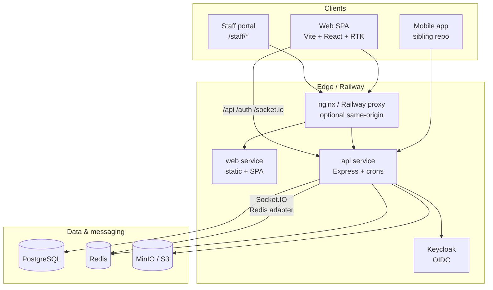
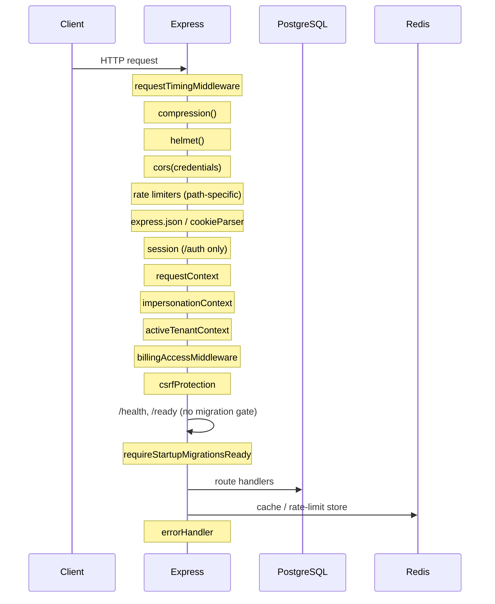

# 07 — Technical Architecture

Supplify is a **pnpm monorepo** with a React SPA (`apps/web`), an Express API (`apps/api`), and shared infrastructure (PostgreSQL, Redis, MinIO/S3, Keycloak). Production runs on **Railway** as separate Docker services; local development can use native hot-reload (`pnpm dev`) or the full **Docker Compose** stack.

---

## System overview



| Layer           | Technology                                   | Location                                               |
| --------------- | -------------------------------------------- | ------------------------------------------------------ |
| Frontend        | Vite 5, React 18, Redux Toolkit + RTK Query  | `apps/web/`                                            |
| API             | Node 22, Express 4, ESM                      | `apps/api/src/`                                        |
| Auth            | Keycloak OIDC (authorization code + refresh) | `apps/api/src/lib/auth.js`                             |
| Cache / pub-sub | Redis (`ioredis`)                            | `apps/api/src/lib/cache.js`, `socket-redis-adapter.js` |
| Object storage  | Local filesystem or S3-compatible (MinIO)    | `apps/api/src/services/storage/`                       |
| Real-time       | Socket.IO on shared HTTP server              | `apps/api/src/lib/socket.js`                           |
| DB              | PostgreSQL 16, 195 SQL migrations            | `apps/api/db/migrations/`                              |

---

## Frontend (Vite / React / RTK)

### Build & dev server

- **Bundler:** Vite with `@vitejs/plugin-react` (`apps/web/vite.config.ts`).
- **Dev port:** `5173`; proxies `/api`, `/auth`, and `/socket.io` to `http://localhost:4000`.
- **Production build:** manual chunk splitting (`react-vendor`, `redux-vendor`, `charts`, etc.) to keep route-level code lazy.

### State management

Redux store (`apps/web/src/store/index.ts`):

| Slice / API       | Purpose                              |
| ----------------- | ------------------------------------ |
| `auth`            | Current user from `/auth/me`         |
| `cart`            | Restaurant ordering cart             |
| `monetization`    | Plan limits / upsell state           |
| `billing`         | Billing UI state                     |
| `api` (RTK Query) | All HTTP — injected endpoint modules |

RTK Query base client (`apps/web/src/services/api/base.ts`):

- `credentials: 'include'` — sends HttpOnly auth cookies.
- Unwraps API envelope `{ ok, data, error }`.
- Redirects to `/login` on `401` / `JWT_EXPIRED`.

Endpoint modules are side-effect imports in `apps/web/src/services/api/index.ts` (orders, inventory, admin, staff portal, billing, etc.).

### Routing & auth shell

- `AuthGuard` (`apps/web/src/components/AuthGuard.tsx`) calls `useGetMeQuery`, hydrates `auth` slice, and gates `/app/*`.
- `STAFF_PORTAL` users are redirected away from `/app` to `/staff/dashboard`.
- Permission-gated UI uses `usePermissions()` (`apps/web/src/hooks/usePermissions.ts`) — mirrors backend `hasPermission` semantics including `_MANAGE` supersets.

---

## Backend — Express middleware chain

Entry point: `apps/api/src/server.js`. Middleware order is fixed and security-sensitive.



### Ordered stack (summary)

| #   | Middleware                      | Scope                      | Role                                                             |
| --- | ------------------------------- | -------------------------- | ---------------------------------------------------------------- |
| 1   | `requestTimingMiddleware`       | global                     | Slow-request structured logging                                  |
| 2   | `compression()`                 | global                     | Gzip JSON responses                                              |
| 3   | `helmet()`                      | global                     | CSP, HSTS (prod), CORP cross-origin for images                   |
| 4   | `cors()`                        | global                     | `WEB_ORIGINS`, credentials, `X-CSRF-Token`, `X-Branch-Id`        |
| 5   | Rate limiters                   | path-prefix                | `/auth`, `/api/public`, global, `/api/orders`, `/api/chat`, etc. |
| 6   | Body parsers                    | global                     | JSON/urlencoded, 10 MB                                           |
| 7   | `cookieParser()`                | global                     | Auth + impersonation + tenant cookies                            |
| 8   | `session()`                     | `/auth` only               | OAuth `state` in PostgreSQL session store                        |
| 9   | `requestContext`                | global                     | `requestId`                                                      |
| 10  | `requestLogger`                 | global                     | Optional (`ENABLE_REQUEST_LOGGING`)                              |
| 11  | `impersonationContext`          | global                     | Verify `impersonation_token` cookie                              |
| 12  | `activeTenantContext`           | global                     | Active tenant / branch cookie                                    |
| 13  | `billingAccessMiddleware`       | global                     | Block locked tenants except billing reads                        |
| 14  | `csrfProtection`                | global                     | Skip `/api/public/*`                                             |
| 15  | Static `/uploads`               | conditional                | `STORAGE_DRIVER=local`                                           |
| 16  | `requireStartupMigrationsReady` | `/api/*`, `/auth/*` routes | 503 while migrations run                                         |
| 17  | Route mounts                    | per-prefix                 | 50+ routers (see `server.js` imports)                            |
| 18  | 404 + `errorHandler`            | global                     | Structured `{ ok, error, requestId }`                            |

### Startup lifecycle

On `server.listen`:

1. Memory monitor + DB pool warmup / keepalive.
2. Keycloak OIDC config pre-warm.
3. `runStartupSchemaTasks()` — migrations + `ensureOrderCancellationColumns`, then MinIO bucket readiness.
4. `registerCronJobs({ trackInterval })` — 18 in-process timers.
5. Dev-only: enable Keycloak direct-access grants for invite login.

Graceful shutdown (`SIGTERM`/`SIGINT`): clear cron timers → close HTTP → `closePool()` → `disconnectCache()`.

---

## Redis

**Config:** `REDIS_URL` via `resolveRedisUrl()` (`apps/api/src/config/resolve-redis-url.js`). Railway warning logged if a public proxy URL is used instead of internal service reference.

**Uses:**

| Use case            | Module                                                                                                                 |
| ------------------- | ---------------------------------------------------------------------------------------------------------------------- |
| Cross-request cache | `apps/api/src/lib/cache.js` — permissions, user-by-sub, tenant context; falls back to in-memory (500 entries) if unset |
| Rate-limit store    | `apps/api/src/lib/rate-limit-store.js`                                                                                 |
| Socket.IO adapter   | `apps/api/src/lib/socket-redis-adapter.js` — multi-instance fan-out                                                    |
| Singleflight dedup  | `apps/api/src/lib/singleflight.js`                                                                                     |

`/health` exposes `redis.connected` when `MEMORY_HEALTH_EXPOSE` is enabled.

---

## MinIO / object storage

**Driver selection** (`apps/api/src/config/env.js`):

- `STORAGE_DRIVER=local` — default when no S3 endpoint.
- `STORAGE_DRIVER=s3` — when `STORAGE_ENDPOINT` / `S3_ENDPOINT` is set (MinIO locally, Railway Storage in prod).

**Service:** `apps/api/src/services/storage/storage.service.js` delegates to `localStorageProvider` or `s3CompatibleProvider`.

| Operation                    | Used for                                     |
| ---------------------------- | -------------------------------------------- |
| `ensureStorageReady()`       | Boot-time bucket creation                    |
| `createPresignedUpload()`    | Browser-direct uploads                       |
| `getObjectStream()`          | Private bucket reads via `/api/files/object` |
| `putObject` / `deleteObject` | Import workers, internal copies              |

Docker Compose maps MinIO to `http://minio:9000` with `S3_ACCESS_KEY` / `S3_SECRET_KEY` (see `docker-compose.yml` `x-api-environment`).

---

## Socket.IO

Initialized on the same `http.Server` as Express (`initializeSocket(server)`).

- **Auth:** `resolveSocketUserFromCookieHeader` — same `access_token` cookie as REST.
- **Rooms:** `user_{userId}`, `restaurant_{restaurantId}`.
- **Events:** `notification_new`, `consumer_order_new`, chat message persistence via `chatSocket.service.js`.
- **Scale-out:** Redis adapter when `REDIS_URL` is set.

Vite dev proxy and production nginx must forward WebSocket upgrades on `/socket.io`.

---

## Cron jobs (18)

All jobs register in `apps/api/src/lib/register-cron-jobs.js` and execute via `runCronJob` (`apps/api/src/lib/cron-runner.js`):

- Skipped when `NODE_ENV=test`.
- Gated by `CRONS_ENABLED` (per-tick).
- **Postgres advisory lock** per job name — one winner per cluster per tick.
- In-memory guard prevents concurrent duplicate runs in one process.

| #   | `CRON_JOBS` key              | Interval (default)                                     | Handler                               |
| --- | ---------------------------- | ------------------------------------------------------ | ------------------------------------- |
| 1   | `scheduled_orders`           | `CRON_SCHEDULED_ORDERS_INTERVAL_MS` (1h prod / 5m dev) | `executeScheduledOrders`              |
| 2   | `invoice_overdue`            | 24h                                                    | `checkOverdueInvoices`                |
| 3   | `subscription_billing`       | 1h                                                     | `runSubscriptionBillingJob`           |
| 4   | `waitlist_offers`            | 15m                                                    | `checkExpiredWaitlistOffers`          |
| 5   | `promotions_expiry`          | 30m                                                    | `runDeactivateExpiredPromotionsJob`   |
| 6   | `invitation_expiry`          | 1h                                                     | branch + restaurant invitation expiry |
| 7   | `free_sandbox_expiry`        | 1h                                                     | `runFreeSandboxExpiryJob`             |
| 8   | `trial_ending_soon`          | 1h                                                     | `runTrialEndingSoonJob`               |
| 9   | `fulfillment_exceptions`     | 30m                                                    | `runFulfillmentExceptionChecks`       |
| 10  | `delivery_rollover`          | `CRON_DELIVERY_ROLLOVER_INTERVAL_MS` (1h)              | `runDeliveryRolloverCron`             |
| 11  | `operational_reminders`      | `CRON_OPERATIONAL_REMINDERS_INTERVAL_MS` (24h)         | `runOperationalRemindersJob`          |
| 12  | `driver_location_retention`  | 24h                                                    | `runDriverLocationRetentionJob`       |
| 13  | `email_retry`                | `CRON_EMAIL_RETRY_INTERVAL_MS` (1h)                    | `runEmailRetryJob`                    |
| 14  | `email_digest`               | `CRON_EMAIL_DIGEST_INTERVAL_MS` (24h)                  | `runEmailDigestJob`                   |
| 15  | `stale_gps_alerts`           | `CRON_STALE_GPS_INTERVAL_MS` (15m)                     | `runStaleGpsAlertsJob`                |
| 16  | `log_retention`              | `CRON_LOG_RETENTION_INTERVAL_MS` (24h)                 | `runLogRetentionJob`                  |
| 17  | `reorder_forecast`           | 24h                                                    | `runReorderForecastJob`               |
| 18  | `growth_program_maintenance` | 1h                                                     | `runGrowthProgramMaintenanceJob`      |

**Not in this registry:** bulk product image import uses `image-import-worker.js` + Postgres advisory locks (see `docs/features/bulk-product-image-import.md`).

Set `CRONS_ENABLED=false` on a web-tier API replica if you split workers later.

---

## Deployment

### Railway

| Service  | Dockerfile                           | Config                  | Health                       |
| -------- | ------------------------------------ | ----------------------- | ---------------------------- |
| API      | `apps/api/Dockerfile`                | `apps/api/railway.json` | `GET /health` (120s timeout) |
| Web      | `apps/web/Dockerfile`                | `apps/web/railway.json` | static                       |
| Keycloak | `deploy/railway/keycloak/Dockerfile` | per-env `railway.json`  | Keycloak health              |

API start command: `node apps/api/src/server.js`. Build context is **repo root** (not `apps/api`).

Runtime env defaults ship in `deploy/railway/<env>/api.env` and `web.env`. `loadRailwayApiEnvDefaults()` merges these when `RAILWAY_ENVIRONMENT` is detected.

### Docker Compose (local full stack)

`docker-compose.yml` — services: `postgres`, `redis`, `minio`, `mailpit`, `keycloak`, `api`, `web`, `nginx`.

- API env block `x-api-environment` wires internal hostnames (`postgres`, `redis`, `minio`, `keycloak`).
- Nginx terminates same-origin `/api` + `/auth` for cookie compatibility.
- Commands: `pnpm dev:docker` or `scripts/run-local.cmd up`.

### Native dev

```bash
pnpm setup && pnpm dev   # infra via Docker or local; Vite :5173 + API :4000
pnpm local:infra         # postgres, redis, minio, keycloak only
```

---

## Environment variables (sanitized reference)

Secrets shown as `<set-in-vault>` — never commit real values.

### Core

| Variable                 | Required       | Default / notes                                          |
| ------------------------ | -------------- | -------------------------------------------------------- |
| `NODE_ENV`               | no             | `development`                                            |
| `APP_ENV`                | no             | derived: `dev` / `staging` / `prod`                      |
| `PORT`                   | no             | `4000` (Railway injects)                                 |
| `DATABASE_URL`           | **yes** (prod) | Postgres connection string                               |
| `DATABASE_MIGRATION_URL` | no             | Direct URL for DDL; falls back to `DATABASE_PRIVATE_URL` |
| `DATABASE_SSL`           | no             | `false`                                                  |
| `SESSION_SECRET`         | **yes** (prod) | OAuth session signing                                    |
| `TRUST_PROXY`            | no             | `true`                                                   |

### Auth (Keycloak)

| Variable                                     | Required       | Default                                |
| -------------------------------------------- | -------------- | -------------------------------------- |
| `KEYCLOAK_BASE_URL`                          | yes            | `http://localhost:8080` (internal)     |
| `KEYCLOAK_PUBLIC_URL`                        | yes            | browser-facing issuer base             |
| `KEYCLOAK_REALM`                             | no             | `Supplify`                             |
| `KEYCLOAK_CLIENT_ID`                         | no             | `supplify-api`                         |
| `KEYCLOAK_CLIENT_SECRET`                     | **yes** (prod) | `<set-in-vault>`                       |
| `KEYCLOAK_ADMIN` / `KEYCLOAK_ADMIN_PASSWORD` | dev            | admin bootstrap                        |
| `OAUTH_CALLBACK_BASE_URL`                    | prod           | Web origin for `/auth/callback`        |
| `COOKIE_SECURE`                              | no             | `true` in production                   |
| `COOKIE_SAME_SITE`                           | no             | `lax`                                  |
| `COOKIE_DOMAIN`                              | optional       | cross-subdomain cookies                |
| `IMPERSONATION_SECRET`                       | yes            | defaults to `SESSION_SECRET`           |
| `CONSUMER_AUTH_SECRET`                       | yes            | B2C diner JWT (separate from Keycloak) |

### Web / CORS

| Variable                | Required   | Default                              |
| ----------------------- | ---------- | ------------------------------------ |
| `WEB_ORIGIN`            | yes (prod) | primary SPA URL                      |
| `WEB_ORIGINS`           | no         | comma-separated allowlist            |
| `PUBLIC_API_URL`        | no         | derived from `RAILWAY_PUBLIC_DOMAIN` |
| `PUBLIC_FRONTEND_URL`   | no         | alias of `WEB_ORIGIN`                |
| `STAFF_PORTAL_BASE_URL` | no         | staff magic-link base                |
| `VITE_API_URL`          | web build  | baked at Docker build time           |

### Redis

| Variable    | Required           | Default                      |
| ----------- | ------------------ | ---------------------------- |
| `REDIS_URL` | recommended (prod) | unset → in-memory cache only |

### Storage (MinIO / S3)

| Variable                      | Required | Default                 |
| ----------------------------- | -------- | ----------------------- |
| `STORAGE_DRIVER`              | no       | `local` or `s3`         |
| `STORAGE_ENDPOINT`            | s3       | `http://localhost:9000` |
| `STORAGE_BUCKET`              | no       | `supplify`              |
| `STORAGE_ACCESS_KEY_ID`       | s3       | `minioadmin` (dev)      |
| `STORAGE_SECRET_ACCESS_KEY`   | s3       | `<set-in-vault>`        |
| `STORAGE_PUBLIC_READ`         | no       | `true`                  |
| `STORAGE_S3_FORCE_PATH_STYLE` | no       | `true` for MinIO        |

### Crons & ops

| Variable                            | Default                     |
| ----------------------------------- | --------------------------- |
| `CRONS_ENABLED`                     | `true`                      |
| `CRON_SCHEDULED_ORDERS_INTERVAL_MS` | 1h prod / 5m dev            |
| `DELIVERY_ROLLOVER_ENABLED`         | `false`                     |
| `RATE_LIMIT_ENABLED`                | `true` except `APP_ENV=dev` |
| `RUN_MIGRATIONS_ON_START`           | `false`                     |
| `MEMORY_HEALTH_EXPOSE`              | `true` in dev               |

### Email / payments (abbreviated)

| Variable                               | Purpose             |
| -------------------------------------- | ------------------- |
| `EMAIL_ENABLED`, `SMTP_HOST`, `SMTP_*` | Transactional email |
| `PAYMENTS_MODE`, `PAYMENTS_*`          | Billing gateway     |
| `VAPID_*`                              | Web push            |

Full list: `apps/api/src/config/env.js`.

---

## Implementation evidence

| Claim                      | Source                                                               |
| -------------------------- | -------------------------------------------------------------------- |
| 195 SQL migrations         | `apps/api/db/migrations/*.sql` (count verified 2026-08-06)           |
| 18 cron jobs registered    | `register-cron-jobs.js` `jobs.length` + `cron-runner.js` `CRON_JOBS` |
| Middleware order           | `apps/api/src/server.js` lines 149–442                               |
| RTK store shape            | `apps/web/src/store/index.ts`                                        |
| Redis fallback             | `apps/api/src/lib/cache.js`                                          |
| Socket Redis adapter       | `apps/api/src/lib/socket.js` → `attachSocketRedisAdapter`            |
| Railway API healthcheck    | `apps/api/railway.json` → `/health`                                  |
| Docker Compose service map | `docker-compose.yml`                                                 |
| 554 API routes (inventory) | `docs/audits/route-inventory.json`                                   |

### Key files

```
apps/api/src/server.js              # HTTP server + middleware + routes
apps/api/src/lib/register-cron-jobs.js
apps/api/src/config/env.js          # canonical env schema
apps/web/vite.config.ts
apps/web/src/services/api/base.ts   # RTK Query + cookies
docker-compose.yml
apps/api/Dockerfile
apps/web/Dockerfile
deploy/railway/
```

---

## Related docs

- [09-authentication-rbac.md](./09-authentication-rbac.md) — OIDC, cookies, permissions
- [08-database-guide.md](./08-database-guide.md) — schema and migrations
- [docs/operations/cron-jobs.md](../operations/cron-jobs.md) — cron operations runbook
