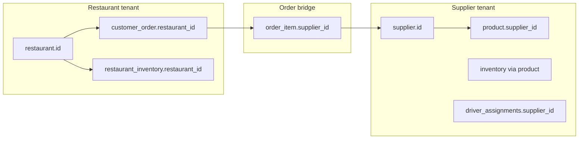
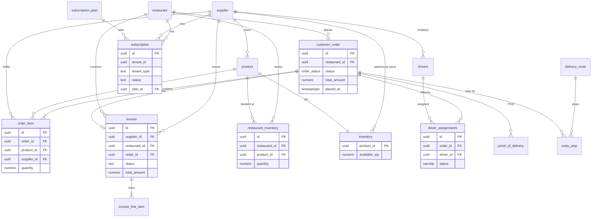

# 08 — Database Guide

Supplify uses **PostgreSQL 16** with a **numbered SQL migration** pipeline (`apps/api/db/migrations/`). Schema changes are forward-only; **175 migrations** exist as of migration `0175_free_trial_supplier_growth_parity.sql`. Application code uses the `pg` pool (`apps/api/src/lib/db.js`) with optional statement timeouts and Railway-oriented pool keepalive.

---

## Migration system

| Concept       | Detail                                                                                          |
| ------------- | ----------------------------------------------------------------------------------------------- |
| Tracker table | `schema_migrations(version, applied_at)` — created in `0000_schema_migrations.sql`              |
| Runner        | `apps/api/scripts/migrate.js` — `pnpm db:migrate`                                               |
| Startup       | `runFullStartupMigrations()` after HTTP listen; `/ready` returns `503 migrating` until complete |
| DDL URL       | `DATABASE_MIGRATION_URL` bypasses poolers that block `ALTER TABLE`                              |
| Naming        | `NNNN_snake_case_description.sql`                                                               |

**Do not** edit applied migrations. Add a new file and run migrate.

---

## Schemas & naming conventions

- **Single database**, `public` schema — no per-tenant Postgres schemas.
- **Tenant isolation** is logical: `restaurant_id`, `supplier_id`, `tenant_id` + `tenant_type` columns and query filters.
- **UUID primary keys** via `gen_random_uuid()` (`pgcrypto`).
- **Timestamps:** `created_at`, `updated_at` on most business tables.
- **JSONB** for flexible plan limits/features, addresses, metadata.
- **Enums** for stable lifecycles (`order_status`, staff PTO/swap statuses).

### Core identity & tenancy

| Table                       | Purpose                                                                                         |
| --------------------------- | ----------------------------------------------------------------------------------------------- |
| `app_user`                  | Platform user; `keycloak_sub`, `email`, `role` (`ADMIN`/`SUPPLIER`/`RESTAURANT`/`STAFF_PORTAL`) |
| `supplier`                  | Supplier tenant; optional `organization_id` for multi-branch                                    |
| `restaurant`                | Restaurant tenant; org linkage via `restaurant_organizations` (later migrations)                |
| `supplier_organizations`    | Parent org for supplier branches (`0082_supplier_branch_accounts.sql`)                          |
| `user_workspace_membership` | One active workspace per user boundary (`0104_user_workspace_membership.sql`)                   |

### RBAC (tenant-scoped)

| Table                                     | Purpose                                                                               |
| ----------------------------------------- | ------------------------------------------------------------------------------------- |
| `tenant_roles`                            | Named roles per `(tenant_id, tenant_type)`; `is_system` for defaults                  |
| `tenant_role_permissions`                 | `permission` text codes (see `permission-keys.js`)                                    |
| `tenant_user_roles`                       | User ↔ role assignment within a tenant                                               |
| `role` / `permission` / `role_permission` | Legacy global role catalog + **admin** roles (`0042_rbac_seed_roles_permissions.sql`) |
| `user_role`                               | Legacy user ↔ global role (merged at permission resolution)                          |

### Catalog & supplier inventory

| Table       | Purpose                                           |
| ----------- | ------------------------------------------------- |
| `catalog`   | Supplier catalog container                        |
| `product`   | SKU, names, category; scoped by `supplier_id`     |
| `price`     | Time-bounded product pricing                      |
| `inventory` | Supplier stock (`product_id` PK, `available_qty`) |

### Restaurant inventory

| Table                           | Purpose                                                                        |
| ------------------------------- | ------------------------------------------------------------------------------ |
| `restaurant_inventory`          | Par levels per `(restaurant_id, product_id)` — `0004_restaurant_inventory.sql` |
| `restaurant_inventory_lot`      | Batch/expiry tracking (`0133_restaurant_inventory_lots.sql`)                   |
| `restaurant_inventory_settings` | Tenant-level inventory prefs                                                   |

### Orders & commercial flow

| Table                           | Purpose                                          |
| ------------------------------- | ------------------------------------------------ |
| `customer_order`                | Restaurant purchase order; `status order_status` |
| `order_item`                    | Lines with `supplier_id`, qty, pricing           |
| `invoice` / `invoice_line_item` | AR/AP documents — `0009_finance_billing.sql`     |
| `credit_note`                   | Adjustments linked to invoices/orders            |
| `subscription_plan`             | Plan catalog (limits/features JSONB)             |
| `subscription`                  | Tenant subscription state                        |
| `tenant_subscription_addon`     | Add-on entitlements                              |

### Fulfillment & delivery

| Table                            | Purpose                                                |
| -------------------------------- | ------------------------------------------------------ |
| `delivery_wave` / `pick_list`    | Batch picking (`0006_fulfillment_logistics.sql`)       |
| `delivery_route` / `route_stop`  | Route planning                                         |
| `proof_of_delivery`              | POD capture                                            |
| `drivers` / `driver_assignments` | Driver lifecycle (`0088_drivers_fulfillment.sql`)      |
| `fulfillment_exceptions`         | Operational exception queue                            |
| `warehouse`                      | Supplier warehouses (`0081_warehouse_fulfillment.sql`) |

---

## Tenant isolation patterns



**API enforcement** (not RLS):

1. `resolveTenantContext` attaches `tenantId` + `tenantType` from cookies, membership, or impersonation.
2. Route handlers filter `WHERE restaurant_id = $tenant` or `supplier_id = $tenant`.
3. `requireOwnership` / branch-org guards for multi-location suppliers.
4. Admin routes use `resolveAdminContext`; impersonation uses `getEffectiveTenant()`.

**Subscription gating:** `billingAccessMiddleware` blocks locked tenants except billing/subscription read endpoints.

---

## Status fields

### `order_status` enum

Evolved across `0001_init.sql`, `0028_order_status_enhancements.sql`, `0069_approvals_budgets.sql`, `0110_order_status_received_with_dispute.sql`:

| Value                   | Typical meaning            |
| ----------------------- | -------------------------- |
| `DRAFT`                 | Cart / not placed          |
| `PENDING_APPROVAL`      | Internal approval workflow |
| `PLACED`                | Submitted to supplier      |
| `CONFIRMED`             | Supplier accepted          |
| `FULFILLING`            | Pick/pack/ship in progress |
| `DELIVERED`             | Delivered to restaurant    |
| `RECEIVED_PARTIAL`      | Partial receiving          |
| `RECEIVED_FULL`         | Fully received             |
| `RECEIVED_WITH_DISPUTE` | Receiving dispute open     |
| `INVOICED`              | Invoice generated          |
| `COMPLETED`             | Closed                     |
| `CANCELLED`             | Cancelled                  |

### Invoice `status` (TEXT CHECK)

`DRAFT` → `ISSUED` → `PARTIALLY_PAID` / `PAID` / `OVERDUE` / `VOID`

### Subscription `status`

`TRIALING`, `ACTIVE`, `SUSPENDED`, `CANCELLED`, `PAST_DUE`

### Driver assignment `status`

`assigned`, `picked_up`, `out_for_delivery`, `delivered`, `failed`, `reassigned`

### Fulfillment exception `status`

`open`, `resolved`, `ignored`

---

## Entity-relationship diagram (core commercial domain)



---

## Key relationships (query mental model)

1. **Order → suppliers:** One restaurant order may span multiple suppliers via `order_item.supplier_id`.
2. **Invoice → order:** Optional `invoice.order_id`; line items may reference `order_item_id`.
3. **Inventory types:** `inventory` = supplier sellable stock; `restaurant_inventory` = restaurant on-hand after receiving.
4. **Subscription:** Polymorphic `tenant_id` + `tenant_type IN ('SUPPLIER','RESTAURANT')` — not a FK to keep one table.
5. **Delivery:** `driver_assignments` is the operational delivery record; `delivery_route` / `route_stop` support planning; `proof_of_delivery` stores confirmation artifacts.

---

## Seeds & demo data

Seeds are **scripts**, not migrations. Entry points from root `package.json`:

| Command                                      | Purpose                                  |
| -------------------------------------------- | ---------------------------------------- |
| `pnpm db:seed`                               | Base API seed (`@supplify/api db:seed`)  |
| `pnpm seed:demo-users`                       | Keycloak + `app_user` demo accounts      |
| `pnpm seed:demo-tenants`                     | Restaurant/supplier tenants              |
| `pnpm seed:plan-tiers` / `seed:tier-catalog` | Subscription plan catalog                |
| `pnpm seed:billing`                          | Billing fixtures                         |
| `pnpm seed:full`                             | Full demo stack                          |
| `pnpm seed:prodlike`                         | Production-like minimal data             |
| `pnpm seed:features`                         | Feature-flag / plan feature alignment    |
| `pnpm db:migrate-users-to-roles`             | Backfill `tenant_user_roles` from legacy |

Supporting modules: `apps/api/scripts/seed/businessDemoData.js`, `tierDefinitions.js`, `wipe-commercial-data.js`.

**System role matrix sync:** `ensureTenantSystemRoles()` in `apps/api/src/lib/tenant-roles.js` applies `RESTAURANT_SYSTEM_ROLES` / `SUPPLIER_SYSTEM_ROLES` from `role-matrix.js` when tenants are created or on admin sync.

---

## Indexes & performance

Hot-path indexes added in later migrations, e.g.:

- `0139_railway_hot_path_indexes.sql` — restaurant inventory, orders
- `0142_order_create_hot_path_indexes.sql`
- `0091_performance_indexes.sql`

Use `EXPLAIN ANALYZE` on slow list endpoints; check `SLOW_REQUEST_MS` logs for stage breakdown.

---

## Implementation evidence

| Claim                     | Source                                                                        |
| ------------------------- | ----------------------------------------------------------------------------- |
| 175 migrations            | `apps/api/db/migrations/*.sql`                                                |
| Initial schema            | `0001_init.sql`                                                               |
| `order_status` extensions | `0028`, `0069`, `0110`                                                        |
| Invoice schema            | `0009_finance_billing.sql`                                                    |
| Subscription schema       | `0022_subscription_system.sql`                                                |
| Fulfillment/delivery      | `0006_fulfillment_logistics.sql`, `0088_drivers_fulfillment.sql`              |
| Restaurant inventory      | `0004_restaurant_inventory.sql`                                               |
| Tenant RBAC tables        | `0078_tenant_named_roles.sql`, `0041_rbac_tenant_roles.sql`                   |
| Tenant isolation in API   | `apps/api/src/lib/rbac.js` `resolveTenantContext`                             |
| Migration on boot         | `apps/api/src/lib/startup-migrations.js`, `server.js` `runStartupSchemaTasks` |

### Operational commands

```bash
pnpm db:migrate                    # apply pending migrations
pnpm db:seed                       # development seed
psql $DATABASE_URL -c "SELECT version FROM schema_migrations ORDER BY version DESC LIMIT 5;"
```

---

## Related docs

- [07-technical-architecture.md](./07-technical-architecture.md) — Postgres pool, Redis, deployment
- [09-authentication-rbac.md](./09-authentication-rbac.md) — `tenant_roles` permission model
- [docs/operations/cron-jobs.md](../operations/cron-jobs.md) — jobs that mutate subscription/invoice state
