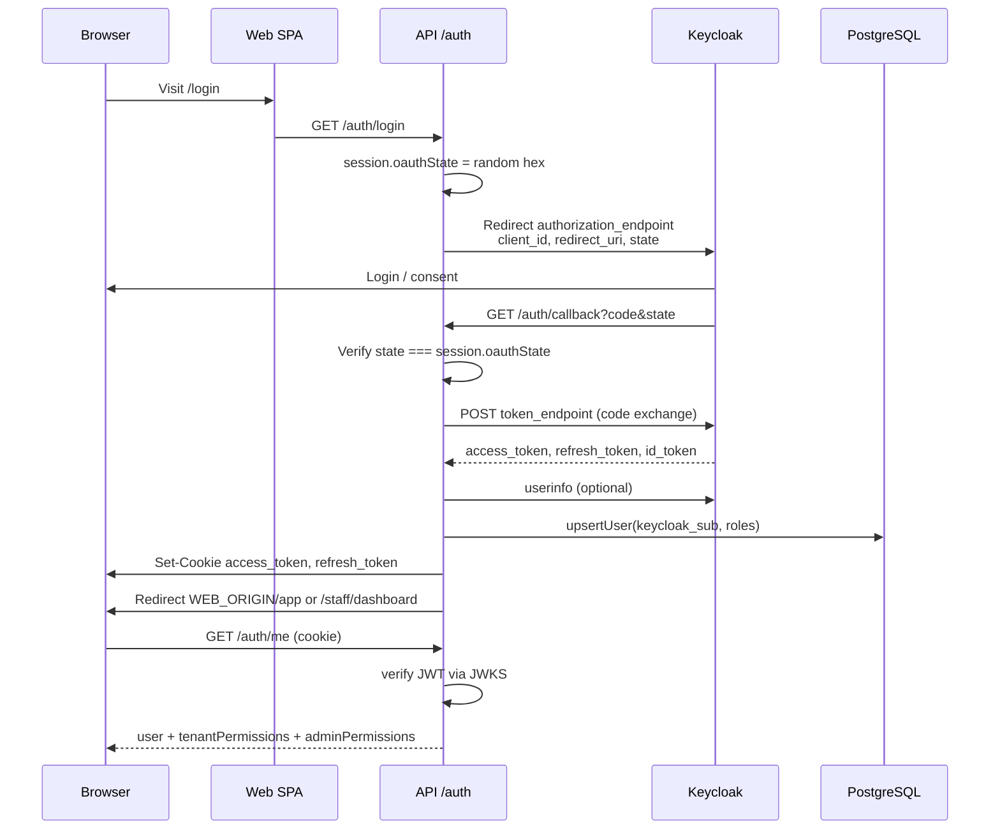
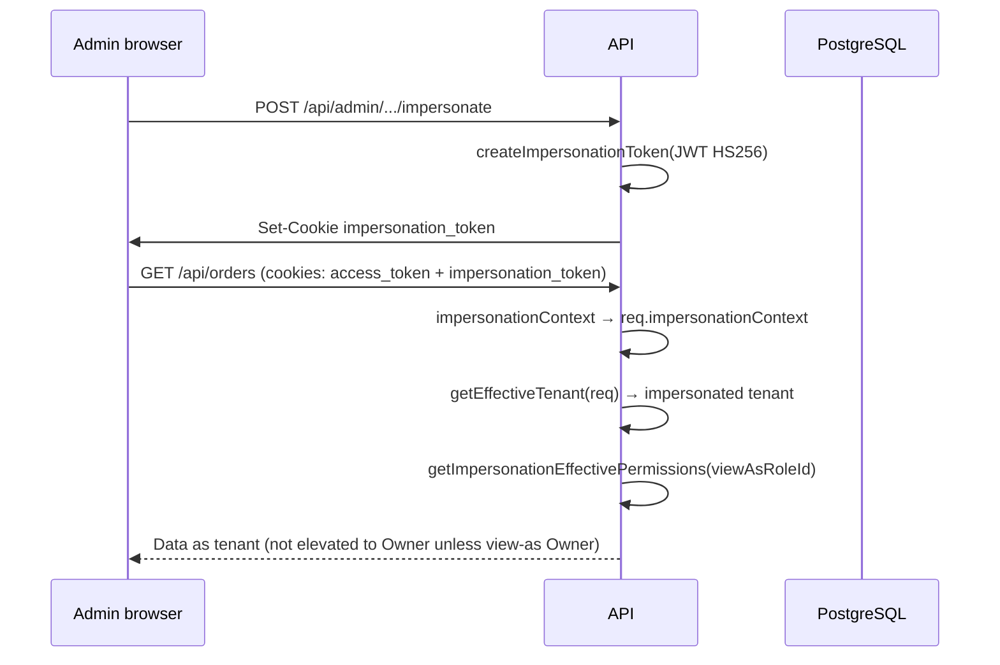

# 09 — Authentication & RBAC

Supplify authenticates users with **Keycloak OIDC** (authorization code flow). The API stores platform identity in `app_user` and enforces **tenant-scoped RBAC** via permission keys in `tenant_role_permissions`. Authorization is **mandatory on the backend** (`requirePermission`); the React app mirrors checks for UX only.

---

## Keycloak OIDC flow



### Endpoints (`apps/api/src/routes/auth.routes.js`)

| Route                | Auth     | Purpose                                                |
| -------------------- | -------- | ------------------------------------------------------ |
| `GET /auth/login`    | session  | Start OIDC; clears impersonation/active-tenant cookies |
| `GET /auth/register` | session  | Keycloak self-registration                             |
| `GET /auth/callback` | session  | Code exchange + cookie write                           |
| `GET /auth/logout`   | public   | Clear cookies + Keycloak end-session                   |
| `GET /auth/session`  | optional | Lightweight session probe                              |
| `GET /auth/me`       | required | Full user + RBAC payload                               |
| `POST /auth/refresh` | cookie   | Refresh access token                                   |

### Token verification

- `getKeycloakConfig()` loads `.well-known/openid-configuration` (`apps/api/src/lib/auth.js`).
- Access tokens verified with cached `createRemoteJWKSet` per realm JWKS URI.
- Issuer normalized for trailing-slash mismatches.
- Keep-alive HTTP agents reduce Railway ↔ Keycloak latency.

### OAuth callback origin

`callbackOrigin(req)` prefers `OAUTH_CALLBACK_BASE_URL`, then `X-Forwarded-Host`, then request host — so cookies are **first-party** on the web domain (critical for mobile Chrome).

---

## Token & cookie flow

### HttpOnly cookies (web)

Set in `setAuthCookies()` (`apps/api/src/lib/rbac.js`):

| Cookie          | TTL     | Content                |
| --------------- | ------- | ---------------------- |
| `access_token`  | 20 min  | Keycloak JWT           |
| `refresh_token` | 30 days | Keycloak refresh token |

Cookie TTLs align with Keycloak session policy (see `docs/features/auth-session-management.md`). Keycloak SSO idle/max remain authoritative.

Options: `httpOnly`, `secure` (`COOKIE_SECURE`), `sameSite` (`COOKIE_SAME_SITE`), optional `domain` (`COOKIE_DOMAIN`).

### Request authentication

`requireAuth` middleware:

1. Read `access_token` from cookie (or `Authorization: Bearer` for mobile).
2. Verify JWT; on expiry attempt `refreshAccessToken` and re-set cookies.
3. Load `app_user` by `keycloak_sub` (Redis-cached).
4. `assertStaffPortalRouteAccess` — block `STAFF_PORTAL` from non-allowlisted paths.

### Other security cookies

| Cookie                | Purpose                                                  |
| --------------------- | -------------------------------------------------------- |
| `impersonation_token` | Signed JWT for admin view-as (`impersonation.js`)        |
| `active_tenant`       | Multi-branch / workspace switch (`tenant-switch.js`)     |
| Session cookie        | `/auth` only — OAuth `state` in PostgreSQL session store |

### CSRF

`csrfProtection` on state-changing API calls; skipped for `/api/public/*`. Frontend sends `X-CSRF-Token` (header-based — safe with compression).

---

## Permission keys (56)

Canonical constants: `apps/api/src/lib/permission-keys.js` (`PERMISSION_KEYS`).

| Domain        | Keys                                                                                             |
| ------------- | ------------------------------------------------------------------------------------------------ |
| Orders        | `ORDERS_VIEW`, `ORDERS_CREATE`, `ORDERS_EDIT`, `ORDERS_MANAGE`                                   |
| Invoices      | `INVOICES_VIEW`, `INVOICES_CREATE`, `INVOICES_EDIT`, `INVOICES_MANAGE`                           |
| Inventory     | `INVENTORY_VIEW`, `INVENTORY_EDIT`, `INVENTORY_MANAGE`                                           |
| Reservations  | `RESERVATIONS_VIEW`, `RESERVATIONS_CREATE`, `RESERVATIONS_EDIT`, `RESERVATIONS_MANAGE`           |
| Staff / team  | `STAFF_VIEW`, `STAFF_INVITE`, `STAFF_EDIT`, `STAFF_MANAGE`                                       |
| Settings      | `SETTINGS_VIEW`, `SETTINGS_EDIT`, `SETTINGS_MANAGE`                                              |
| Chat          | `CHAT_VIEW`, `CHAT_SEND`, `CHAT_MANAGE`                                                          |
| Subscriptions | `SUBSCRIPTIONS_VIEW`, `SUBSCRIPTIONS_MANAGE`                                                     |
| Catalog       | `CATALOG_VIEW`, `CATALOG_EDIT`, `CATALOG_MANAGE`                                                 |
| Warehouses    | `WAREHOUSES_VIEW`, `WAREHOUSES_EDIT`, `WAREHOUSES_MANAGE`                                        |
| Receiving     | `RECEIVING_VIEW`, `RECEIVING_MANAGE`                                                             |
| Payments      | `PAYMENTS_VIEW`, `PAYMENTS_MANAGE`                                                               |
| Fulfillment   | `FULFILLMENT_VIEW`, `FULFILLMENT_MANAGE`                                                         |
| Promotions    | `PROMOTIONS_VIEW`, `PROMOTIONS_MANAGE`                                                           |
| Customers     | `CUSTOMERS_IMPORT`, `CUSTOMERS_MANAGE`                                                           |
| Growth        | `GROWTH_VIEW`                                                                                    |
| Driver        | `DRIVER_DELIVERIES_VIEW`, `DRIVER_DELIVERIES_MANAGE`                                             |
| Recipes       | `RECIPES_VIEW`, `RECIPES_VIEW_COSTS`, `RECIPES_EDIT`, `RECIPES_MANAGE`                           |
| Admin         | `ADMIN_ACCESS`, `ADMIN_TENANTS`, `ADMIN_PLANS`, `ADMIN_SUPPORT`, `ADMIN_FINANCE`, `ADMIN_GROWTH` |

**`hasPermission(permissions, required)`** (`permissions.js`): exact match, or holder has domain `_MANAGE` when checking `_VIEW` / `_EDIT` / etc.

**Caching:** Redis key `perm:{userId}:{tenantId}:{tenantType}` — TTL 180s; invalidated on role changes.

---

## Restaurant system roles (7)

Defined in `apps/api/src/lib/role-matrix.js` (`RESTAURANT_SYSTEM_ROLES`). Synced to DB per tenant via `ensureTenantSystemRoles()`.

| Role                   | Intent                                                       |
| ---------------------- | ------------------------------------------------------------ |
| **Owner**              | `permissions: 'ALL'` — full restaurant workspace             |
| **Restaurant Manager** | Orders, receiving, catalog read, chat; no billing/team admin |
| **Purchaser**          | Browse catalog, create/edit orders                           |
| **Receiving Staff**    | Receive goods, disputes; no order create                     |
| **Accountant**         | Invoices, payments, subscriptions view                       |
| **Viewer**             | All `*_VIEW` for restaurant workspace; zero writes           |
| **FOH Staff**          | Reservations only                                            |

### Restaurant permission matrix

Legend: ✓ = granted, — = denied. Owner has all keys (omitted for brevity).

| Permission                      |     Manager      | Purchaser | Receiving | Accountant |  Viewer   | FOH |
| ------------------------------- | :--------------: | :-------: | :-------: | :--------: | :-------: | :-: |
| `ORDERS_VIEW`                   |        ✓         |     ✓     |     ✓     |     ✓      |     ✓     |  —  |
| `ORDERS_CREATE`                 |        ✓         |     ✓     |     —     |     —      |     —     |  —  |
| `ORDERS_EDIT`                   |        ✓         |     ✓     |     —     |     —      |     —     |  —  |
| `ORDERS_MANAGE`                 |        ✓         |     —     |     —     |     —      |     —     |  —  |
| `RECEIVING_VIEW`                |        ✓         |     —     |     ✓     |     —      |     ✓     |  —  |
| `RECEIVING_MANAGE`              |        ✓         |     —     |     ✓     |     —      |     —     |  —  |
| `CATALOG_VIEW`                  |        ✓         |     ✓     |     —     |     —      |     ✓     |  —  |
| `INVENTORY_VIEW`                |        ✓         |     ✓     |     —     |     —      |     ✓     |  —  |
| `INVOICES_VIEW`                 |        ✓         |     —     |     —     |     ✓      |     ✓     |  —  |
| `INVOICES_*` (write)            |        —         |     —     |     —     |     ✓      |     —     |  —  |
| `PAYMENTS_*`                    |        —         |     —     |     —     |     ✓      |  ✓ view   |  —  |
| `SUBSCRIPTIONS_VIEW`            |        —         |     —     |     —     |     ✓      |     ✓     |  —  |
| `SUBSCRIPTIONS_MANAGE`          |        —         |     —     |     —     |     —      |     —     |  —  |
| `STAFF_VIEW`                    |        —         |     —     |     —     |     —      |     ✓     |  —  |
| `STAFF_INVITE` / `STAFF_MANAGE` |        —         |     —     |     —     |     —      |     —     |  —  |
| `SETTINGS_VIEW`                 |        ✓         |     —     |     —     |     —      |     ✓     |  —  |
| `SETTINGS_MANAGE`               |        —         |     —     |     —     |     —      |     —     |  —  |
| `CHAT_VIEW` / `CHAT_SEND`       |        ✓         |     ✓     |     —     |     —      | view only |  —  |
| `RESERVATIONS_*`                | view/create/edit |     —     |     —     |     —      |   view    |  ✓  |
| `RECIPES_VIEW`                  |        ✓         |     ✓     |     —     |     ✓      |     —     |  —  |
| `RECIPES_VIEW_COSTS`            |        ✓         |     —     |     —     |     ✓      |     —     |  —  |
| `RECIPES_EDIT`                  |        ✓         |     ✓     |     —     |     —      |     —     |  —  |
| `RECIPES_MANAGE`                |        ✓         |     —     |     —     |     —      |     —     |  —  |

Verified by `apps/api/src/lib/tenant-role-matrix.test.js`.

---

## Supplier system roles (9)

`SUPPLIER_SYSTEM_ROLES` in `role-matrix.js`:

| Role                        | Intent                                                           |
| --------------------------- | ---------------------------------------------------------------- |
| **Owner**                   | Full supplier workspace                                          |
| **Supplier Manager**        | Orders, catalog, fulfillment, growth view; no billing/team admin |
| **Warehouse Manager**       | Warehouses, fulfillment, inventory                               |
| **Order Fulfillment Staff** | Fulfillment board; no decline/billing                            |
| **Driver**                  | `DRIVER_DELIVERIES_*` only                                       |
| **Catalog Manager**         | Catalog + inventory edit                                         |
| **Promotions Manager**      | Promotions + order manage for deals                              |
| **Accountant**              | Finance keys only                                                |
| **Viewer**                  | All supplier `*_VIEW`; no mutations                              |

### Supplier permission matrix (selected)

| Permission                  | Sup. Manager | WH Manager | Fulfill. Staff | Driver | Catalog Mgr | Promo Mgr | Accountant | Viewer |
| --------------------------- | :----------: | :--------: | :------------: | :----: | :---------: | :-------: | :--------: | :----: |
| `ORDERS_VIEW`               |      ✓       |     ✓      |       ✓        |   —    |      ✓      |     ✓     |     ✓      |   ✓    |
| `ORDERS_EDIT`               |      ✓       |     —      |       ✓        |   —    |      —      |     —     |     —      |   —    |
| `ORDERS_MANAGE`             |      ✓       |     —      |       —        |   —    |      —      |     ✓     |     —      |   —    |
| `CATALOG_VIEW`              |      ✓       |     —      |       —        |   —    |      ✓      |     ✓     |     —      |   ✓    |
| `CATALOG_EDIT` / `MANAGE`   |      ✓       |     —      |       —        |   —    |      ✓      |     —     |     —      |   —    |
| `FULFILLMENT_*`             |      ✓       |     ✓      |       ✓        |   —    |      —      |     —     |     —      |  view  |
| `WAREHOUSES_*`              |     view     |   ✓ edit   |      view      |   —    |      —      |     —     |     —      |  view  |
| `DRIVER_DELIVERIES_*`       |      —       |     —      |       —        |   ✓    |      —      |     —     |     —      |   —    |
| `PROMOTIONS_*`              |     view     |     —      |       —        |   —    |      —      |     ✓     |     —      |   —    |
| `INVOICES_*` / `PAYMENTS_*` |     view     |     —      |       —        |   —    |      —      |     —     |     ✓      |  view  |
| `STAFF_*`                   |      —       |     —      |       —        |   —    |      —      |     —     |     —      |  view  |
| `SETTINGS_MANAGE`           |      —       |     —      |       —        |   —    |      —      |     —     |     —      |   —    |
| `GROWTH_VIEW`               |      ✓       |     —      |       —        |   —    |      —      |     —     |     —      |   —    |
| `CUSTOMERS_IMPORT`          |      ✓       |     —      |       —        |   —    |      —      |     —     |     —      |   —    |

---

## Admin permissions

Platform admins (`app_user.role = 'ADMIN'`) use the **legacy `role` / `permission` tables** (`0042_rbac_seed_roles_permissions.sql`).

| Admin role code | Permissions                                      |
| --------------- | ------------------------------------------------ |
| `SUPER_ADMIN`   | All `ADMIN_*` keys                               |
| `SUPPORT_ADMIN` | `ADMIN_ACCESS`, `ADMIN_TENANTS`, `ADMIN_SUPPORT` |
| `FINANCE_ADMIN` | `ADMIN_ACCESS`, `ADMIN_TENANTS`, `ADMIN_FINANCE` |
| `GROWTH_ADMIN`  | `ADMIN_ACCESS`, `ADMIN_GROWTH`                   |

### Admin dashboard route mapping

`resolveAdminDashboardPermission()` (`route-permissions.js`):

| Path prefix                                  | Required permission |
| -------------------------------------------- | ------------------- |
| `/financial-overview`                        | `ADMIN_FINANCE`     |
| `/plans`, `/subscriptions`, `/usage`, limits | `ADMIN_PLANS`       |
| `/tenants`                                   | `ADMIN_TENANTS`     |
| `/users`, `/impersonate`                     | `ADMIN_SUPPORT`     |
| `/feature-flags`, overrides                  | `ADMIN_GROWTH`      |
| default                                      | `ADMIN_ACCESS`      |

`ALLOW_AUTO_SUPER_ADMIN` (default `false`): first ADMIN without roles can receive `SUPER_ADMIN` in dev only.

---

## Staff portal (`STAFF_PORTAL`)

Operational restaurant staff (scheduling, check-in) are **separate from Team RBAC**.

| Constant                | Value                                            |
| ----------------------- | ------------------------------------------------ |
| `STAFF_PORTAL_APP_ROLE` | `STAFF_PORTAL` (`staff-portal-auth.js`)          |
| Keycloak realm role     | `staff_portal`                                   |
| Login redirect          | `/staff/dashboard` (`auth.routes.js` callback)   |
| Data link               | `staff_member.user_id` + `portal_access_enabled` |

### API path allowlist (staff-only users)

```
/auth/me, /auth/logout, /auth/refresh, /auth/session
/api/staff/self/*
```

Any other route returns `403 STAFF_PORTAL_FORBIDDEN`. Platform routes use `requirePlatformAppAccess`.

**Magic links:** `POST /api/public/staff/request-link` (rate-limited `rl:staff-link`). Base URL: `STAFF_PORTAL_BASE_URL`.

Staff portal does **not** receive restaurant/supplier Keycloak realm roles — dual-link users with a platform role can access both portals.

---

## Impersonation

Admins with `ADMIN_SUPPORT` (or `SUPER_ADMIN`) can "view as" a tenant.



| Property    | Detail                                                                                     |
| ----------- | ------------------------------------------------------------------------------------------ |
| Cookie      | `impersonation_token`                                                                      |
| Signing     | `IMPERSONATION_SECRET`, max age `IMPERSONATION_MAX_DURATION_MINUTES` (default 60)          |
| Payload     | `adminUserId`, `tenantId`, `tenantType`, `viewAsRoleId?`                                   |
| Trust       | `getEffectiveTenant` requires `req.userData.id === adminUserId`                            |
| Permissions | View-as role permissions, or Owner fallback — **no blanket bypass** in `requirePermission` |
| Cleared on  | logout, login, successful OAuth callback                                                   |

Frontend: `useImpersonation()` + `usePermissions()` — impersonating admin uses `tenantPermissions` from `/auth/me` when hydrated.

---

## Frontend enforcement

| Mechanism        | File                                                                                    |
| ---------------- | --------------------------------------------------------------------------------------- |
| Route guard      | `AuthGuard.tsx` — session, register completion, legal reaccept, `STAFF_PORTAL` redirect |
| Permission hooks | `usePermissions.ts` — `can()`, `canAny()`, `isWorkspaceViewer`                          |
| Nav / buttons    | `Sidebar.tsx`, feature pages (`OrdersPage`, `FulfillmentPage`, etc.)                    |
| Admin fallback   | `ADMIN_FALLBACK_PERMISSIONS` when `adminPermissions` empty (dev partial seed)           |
| Owner shortcut   | `isTenantOwner(user)` → all permissions in UI                                           |

**Important:** Hidden UI ≠ security. All mutations must pass API `requirePermission` / `requireAnyPermission`.

---

## Backend enforcement

| Layer                                                | Behavior                                                                                                          |
| ---------------------------------------------------- | ----------------------------------------------------------------------------------------------------------------- |
| `requireAuth`                                        | JWT + user load + staff portal gate                                                                               |
| `requireRole('RESTAURANT' \| 'SUPPLIER' \| 'ADMIN')` | Persona check                                                                                                     |
| `resolveTenantContext`                               | Attach `tenantContext.permissions`                                                                                |
| `resolveAdminContext`                                | Attach `adminContext.permissions`                                                                                 |
| `requirePermission(key)`                             | Owner role bypass; else tenant or admin perms                                                                     |
| `requireAnyPermission(...)`                          | OR of keys                                                                                                        |
| Domain guards                                        | `ordersRouterMutationGuard`, `staffMutationGuard`, `adminDashboardPermissionGuard`, etc. (`route-permissions.js`) |
| Plan / billing                                       | `billingAccessMiddleware`, subscription feature gates                                                             |

Example pattern (`orders.routes.js`):

```javascript
router.use(requireAuth, requireRole('RESTAURANT', 'SUPPLIER', 'ADMIN'))
router.use(resolveTenantContext)
router.use(requirePermission('ORDERS_VIEW'))
router.use(ordersRouterMutationGuard) // POST → ORDERS_CREATE | ORDERS_MANAGE
```

---

## Permission resolution algorithm

`getPermissionsForUser(userId, tenantId, tenantType)` (`permissions.js`):

1. Check Redis cache.
2. If user has `tenant_user_roles` row → use `tenant_role_permissions` for that role (**named assignment**).
3. Else merge legacy `user_role` → `role_permission` with optional org/branch expansion (supplier org roles).
4. **Never reduce access** when merging legacy + named unless named assignment exists (then legacy union is skipped for invited staff).
5. ADMIN impersonation: separate path via `getImpersonationEffectivePermissions`.

Custom roles: tenants may create non-system roles via `POST /api/roles` (`tenant-roles.routes.js`) with subset-of-assigner validation.

---

## Implementation evidence

| Claim                           | Source                                                        |
| ------------------------------- | ------------------------------------------------------------- |
| 52 permission keys              | `Object.keys(PERMISSION_KEYS).length` in `permission-keys.js` |
| 7 restaurant + 9 supplier roles | `role-matrix.js` array lengths                                |
| OIDC callback + cookies         | `auth.routes.js`, `auth.js`, `rbac.js` `setAuthCookies`       |
| Role matrix tests               | `tenant-role-matrix.test.js`                                  |
| Staff portal gate               | `staff-portal-auth.js`, `staff-portal-access.test.js`         |
| Impersonation                   | `impersonation.js`, `impersonationContext.js`                 |
| Admin role seed                 | `0042_rbac_seed_roles_permissions.sql`                        |
| `requirePermission`             | `rbac.js` lines 943–987                                       |
| Frontend parity                 | `usePermissions.ts`, `AuthGuard.tsx`                          |

### Key files

```
apps/api/src/routes/auth.routes.js
apps/api/src/lib/auth.js
apps/api/src/lib/rbac.js
apps/api/src/lib/permissions.js
apps/api/src/lib/permission-keys.js
apps/api/src/lib/role-matrix.js
apps/api/src/lib/route-permissions.js
apps/api/src/lib/staff-portal-auth.js
apps/api/src/lib/impersonation.js
apps/api/src/middlewares/impersonationContext.js
apps/web/src/hooks/usePermissions.ts
apps/web/src/components/AuthGuard.tsx
```

---

## Related docs

- [07-technical-architecture.md](./07-technical-architecture.md) — session store, Redis, middleware order
- [08-database-guide.md](./08-database-guide.md) — `tenant_roles` tables
- [docs/features/staff-portal-access.md](../features/staff-portal-access.md) — staff portal product notes
- [docs/architecture/security-baseline.md](../architecture/security-baseline.md) — CSRF, public routes
