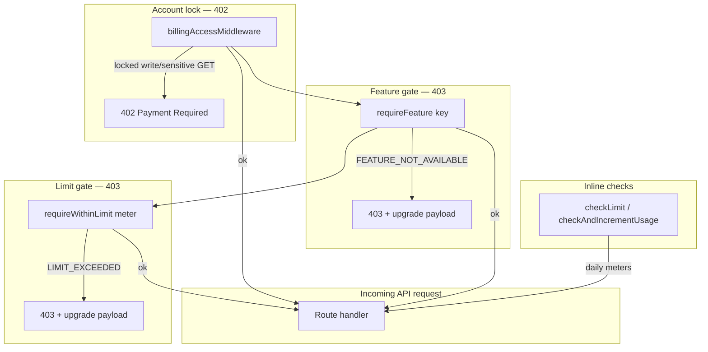

# 10 — Subscriptions and Plans

> **Commercial source of truth:** Public plan names, prices, primary scale metrics, add-ons, trial behavior, and AI allowances live in [../product/four-plan-pricing-model.md](../product/four-plan-pricing-model.md) and [../product/plans-and-limits.md](../product/plans-and-limits.md). This guide focuses on **enforcement architecture** (entitlements, middleware, Free Trial mechanics). Do not quote Silver/Gold/Platinum as customer-facing names.

Supplify monetization is **plan-driven**: every restaurant and supplier workspace has a `subscription` row joined to `subscription_plan` (limits + features JSON). Public self-serve plans are tenant-specific **Growth** and **Scale** tiers plus a **30-day Free Trial**. Internal DB codes remain `free`, `silver`, `gold`, `platinum` for compatibility (`apps/api/src/lib/plan-codes.js`). Hidden `enterprise` / custom rows stay admin-only.

---

## Plan catalog summary (public)

| Tenant type | Public plan       | Internal code | Monthly / yearly | Primary scale metric                                    |
| ----------- | ----------------- | ------------- | ---------------- | ------------------------------------------------------- |
| Restaurant  | Restaurant Growth | `silver`      | $49 / $490       | 1 active branch                                         |
| Restaurant  | Restaurant Scale  | `gold`        | $149 / $1,490    | 3 active branches                                       |
| Supplier    | Supplier Growth   | `gold`        | $149 / $1,490    | 50 active customer locations / month                    |
| Supplier    | Supplier Scale    | `platinum`    | $349 / $3,490    | 200 active customer locations / month                   |
| Both        | 30-day Free Trial | `free`        | $0               | Trial target plan features + Free/trial limit + AI pool |

Prices and JSON limits/features are stored on `subscription_plan`. Migration `0190_four_plan_pricing_model.sql` aligns the catalog; older `0117`/`0119`/`0120` rows are historical context only.

---

## Free Trial: target-plan features, trial limits

Free Trial is **not** a permanent free tier. Runtime feature resolution uses the subscription’s **`trial_target_plan_id`** (default Restaurant Growth / Supplier Growth). If no target is recorded, `resolveEffectivePlanFeatures()` falls back to the default paid Growth-target features (`free-trial-plan-features.js`).

```javascript
// free-trial-plan-features.js — Free Trial mirrors trial target plan features
const targetPlan = await getTrialTargetPlan(subscription)
if (targetPlan?.features) return targetPlan.features
return getDefaultPaidTrialPlanFeatures(tenantType)
```

**Sandbox expiry** — Free workspaces get `subscription.free_sandbox_expires_at` (default **30 days** from `platform_setting.free_sandbox_days`, admin range 7–90). After expiry, `billingAccessMiddleware` locks writes (402); most GETs remain read-only except sensitive exports/reports.

**AI during trial** — Genuine LLM calls use `ai_trial_requests_total` (restaurant 50 total / supplier 100 total), not the paid daily meter.

**Hidden limit** — `scheduled_order_grace_per_day` lets scheduled quick-lists overflow the daily order cap once per day on Free; it is enforced but hidden from the entitlements UI (`HIDDEN_ENTITLEMENT_LIMIT_KEYS`).

---

## Feature keys

Canonical keys live in `apps/api/src/lib/feature-keys.js`.

### Restaurant (27 keys)

`chat`, `order_calendar`, `reports`, `smart_reorder`, `recipe_costing`, `multi_branch`, `receiving_quality`, `disputes_returns`, `finance_invoices`, `quick_lists`, `inventory_management`, `waste_tracking`, `advanced_roles`, `notifications`, `api_integrations`, `support_sla`, `custom_branding`, `feature_flags_access`, `supplier_reviews`, `push_notifications`, `order_amendments`, `tenant_audit_log`, `waitlist_auto_promo`, `supplier_deals`, `supplier_deals_redeem`, `fulfillment_tools`, `ai_platform`

### Supplier (26 keys)

`chat`, `order_calendar`, `reports`, `smart_reorder`, `ai_platform`, `multi_branch`, `warehouses`, `multi_warehouse`, `fulfillment_tools`, `fulfillment`, `driver_management`, `disputes_returns`, `finance_invoices`, `quick_lists`, `inventory_management`, `advanced_roles`, `notifications`, `api_integrations`, `support_sla`, `custom_branding`, `feature_flags_access`, `promotions`, `push_notifications`, `order_amendments`, `tenant_audit_log`, `supplier_growth`

**Enabled semantics** — A feature is **on** when its plan value is `true` or a non-empty tier string (not `false`, `disabled`, or `""`). Same rule in API (`evaluatePlanFeatureValue`) and web (`planLimits.ts`).

---

## Limit keys

From `apps/api/src/lib/limit-resolution.js`.

### Restaurant limits (15 keys)

| Key                             | Meaning                                     |
| ------------------------------- | ------------------------------------------- |
| `branches`                      | Active branch locations                     |
| `users`                         | Primary contact + `restaurant_team` rows    |
| `orders_per_day`                | `PLACED` orders today                       |
| `suppliers_per_restaurant`      | `supplier_follow` count                     |
| `restaurant_inventory_skus`     | Distinct SKUs in `restaurant_inventory`     |
| `chats_per_day`                 | Daily chat meter                            |
| `open_conversations`            | Non-archived conversations                  |
| `storage_mb`                    | Cumulative file storage                     |
| `quick_lists`                   | Quick list count                            |
| `quick_list_items`              | Items across all quick lists                |
| `scheduled_quick_lists`         | Lists with `is_scheduled = true`            |
| `scheduled_order_grace_per_day` | Hidden overflow for scheduled orders (Free) |
| `deal_redemptions_per_day`      | Supplier deal redemptions                   |
| `ai_requests_per_day`           | LLM reorder assistant calls (`0167`)        |

### Supplier limits (keys)

Canonical commercial meters for suppliers are documented in [../product/four-plan-pricing-model.md](../product/four-plan-pricing-model.md). Primary scale key: **`active_customer_locations_monthly`**. Other keys include `warehouses`, `branches`, `users`, `drivers`, `promotions`, `open_conversations`, `chats_per_day`, `storage_mb`, `ai_requests_per_day`.

| Key                                 | Meaning                                                                  |
| ----------------------------------- | ------------------------------------------------------------------------ |
| `active_customer_locations_monthly` | Distinct ordering locations in billing period (primary commercial meter) |
| `branches`                          | Active branch locations                                                  |
| `warehouses`                        | Active warehouses (`0` = feature off)                                    |
| `users`                             | Login-enabled supplier seats                                             |
| `drivers`                           | Active driver rows                                                       |
| `supplier_products_skus`            | Products in catalog (fair-use / technical)                               |
| `chats_per_day`                     | Daily chat meter                                                         |
| `open_conversations`                | Non-archived conversations                                               |
| `storage_mb`                        | Cumulative file storage                                                  |
| `promotions`                        | Non-expired promotions                                                   |
| `ai_requests_per_day`               | Genuine LLM assists (paid plans)                                         |

**Unlimited** — Limit value `-1` or `null` in plan JSON means no cap (`formatPlanLimitDisplay` → `unlimited`).

**Resolution order** — `resolveEffectiveLimit()` / `resolveAllEffectiveLimits()`: plan default → plan override (`plan_limit_override`, increase-only) → tenant override (`tenant_limit_override`, increase-only) → branch/warehouse addons (`subscription-addons.js`).

**Free fallbacks** — If plan JSON omits keys on Free, `FREE_TIER_LIMIT_PATCHES` and `fillMissingFreeTierLimits()` apply canonical caps before enforcement.

---

## Plan limit tables

> **Historical matrices below** (Free/Silver/Gold/Platinum columns) are retained for migration archaeology. **Do not use them for current commercial quoting.** Live numbers: [../product/four-plan-pricing-model.md](../product/four-plan-pricing-model.md).

Values from migrations **0117**, **0119**, **0120**, **0145** (Free), and **0167** (`ai_requests_per_day`). `-1` = unlimited.

### Restaurant limits

| Limit                           | Free Trial | Silver |  Gold  | Platinum |
| ------------------------------- | :--------: | :----: | :----: | :------: |
| `branches`                      |     1      |   1    |   3    |    ∞     |
| `users`                         |     1      |   3    |   15   |    ∞     |
| `orders_per_day`                |     3      |   20   |  100   |    ∞     |
| `suppliers_per_restaurant`      |     1      |   5    |   30   |    ∞     |
| `restaurant_inventory_skus`     |     10     |  250   | 3,000  |    ∞     |
| `chats_per_day`                 |     3      |   30   |  500   |    ∞     |
| `open_conversations`            |     1      |   5    |   30   |    ∞     |
| `storage_mb`                    |     50     |  500   | 10,240 |  30,720  |
| `quick_lists`                   |     1      |   10   |   50   |    ∞     |
| `quick_list_items`              |     1      |  100   |  500   |    ∞     |
| `scheduled_quick_lists`         |     1      |   3    |   15   |    ∞     |
| `deal_redemptions_per_day`      |     1      |   10   |   50   |    ∞     |
| `scheduled_order_grace_per_day` |     1      |   0    |   0    |    0     |
| `ai_requests_per_day`           |     0      |   0    |   20   |   100    |

### Supplier limits

| Limit                    | Free Trial | Silver |  Gold  | Platinum |
| ------------------------ | :--------: | :----: | :----: | :------: |
| `branches`               |     1      |   1    |   3    |    ∞     |
| `warehouses`             |     0      |   1    |   3    |    ∞     |
| `users`                  |     1      |   3    |   15   |    ∞     |
| `supplier_products_skus` |     10     |  250   | 3,000  |    ∞     |
| `chats_per_day`          |     3      |   30   |  500   |    ∞     |
| `open_conversations`     |     1      |   5    |   30   |    ∞     |
| `storage_mb`             |     50     |  500   | 10,240 |  30,720  |
| `promotions`             |     1      |   3    |   25   |    ∞     |

---

## Restaurant feature × plan matrix

**Free Trial column** = effective gates (Gold features via parity). ✓ = enabled; — = disabled. Tier strings are summarized in the **Tier** column for paid plans.

| Feature                 | Free Trial |        Silver         |          Gold           |               Platinum                |
| ----------------------- | :--------: | :-------------------: | :---------------------: | :-----------------------------------: |
| `chat`                  |     ✓      |   ✓ multi_supplier    |   ✓ group_chat_files    |    ✓ real_time_media_read_receipts    |
| `order_calendar`        |     ✓      |           ✓           |            ✓            |                   ✓                   |
| `reports`               |     ✓      |     ✓ basic_kpis      | ✓ usage_cost_dashboards | ✓ advanced_forecasting_custom_reports |
| `smart_reorder`         |     ✓      |           —           |   ✓ full_90day_trends   |       ✓ ai_forecast_seasonality       |
| `recipe_costing`        |     ✓      |           —           |            ✓            |                   ✓                   |
| `multi_branch`          |     ✓      |           —           |            ✓            |         ✓ central_purchasing          |
| `receiving_quality`     |     ✓      |   ✓ photos_enabled    |    ✓ quality_scoring    |    ✓ supplier_performance_reports     |
| `disputes_returns`      |     ✓      |           ✓           |            ✓            |                   ✓                   |
| `finance_invoices`      |     ✓      |   ✓ record_payments   |   ✓ expense_analytics   |     ✓ advanced_finance_dashboard      |
| `quick_lists`           |     ✓      |  ✓ automated_weekly   |     ✓ full_schedule     |         ✓ ai_smart_automation         |
| `inventory_management`  |     ✓      |      ✓ real_time      | ✓ multi_branch_tracking |         ✓ lot_expiry_tracking         |
| `waste_tracking`        |     ✓      | ✓ analytics_dashboard |  ✓ analytics_dashboard  |      ✓ cost_percentage_vs_sales       |
| `advanced_roles`        |     ✓      |           —           |            ✓            |                   ✓                   |
| `notifications`         |     ✓      |  ✓ in_app_and_email   |  ✓ email_and_whatsapp   |       ✓ email_whatsapp_webhook        |
| `api_integrations`      |     ✓      |           —           |    ✓ api_key_access     |          ✓ full_api_webhooks          |
| `support_sla`           |     ✓      |    ✓ standard_72h     |     ✓ priority_24h      |         ✓ dedicated_same_day          |
| `custom_branding`       |     ✓      |           —           |      ✓ logo_colors      |         ✓ white_label_domain          |
| `feature_flags_access`  |     ✓      |           —           |     ✓ addon_toggles     |          ✓ all_experimental           |
| `supplier_reviews`      |     ✓      |           ✓           |            ✓            |                   ✓                   |
| `push_notifications`    |     ✓      |           ✓           |            ✓            |                   ✓                   |
| `order_amendments`      |     ✓      |           ✓           |            ✓            |                   ✓                   |
| `tenant_audit_log`      |     ✓      |           —           |            ✓            |                   ✓                   |
| `waitlist_auto_promo`   |     ✓      |           —           |            ✓            |                   ✓                   |
| `supplier_deals`        |     ✓      |           ✓           |            ✓            |                   ✓                   |
| `supplier_deals_redeem` |     ✓      |           ✓           |            ✓            |                   ✓                   |
| `fulfillment_tools`     |     —      |           —           |            —            |                   —                   |
| `ai_platform`           |     ✓      |           —           |            ✓            |                   ✓                   |

> `waste_tracking` on Silver is `analytics_dashboard` per `0145` (overrides `0117` `manual_entry`). `fulfillment_tools` is intentionally off for restaurants on all tiers (`0117`–`0120`).

---

## Supplier feature × plan matrix

| Feature                | Free Trial |          Silver          |          Gold           |               Platinum                |
| ---------------------- | :--------: | :----------------------: | :---------------------: | :-----------------------------------: |
| `chat`                 |     ✓      |     ✓ multi_supplier     |   ✓ group_chat_files    |    ✓ real_time_media_read_receipts    |
| `order_calendar`       |     ✓      |            ✓             |            ✓            |                   ✓                   |
| `reports`              |     ✓      |       ✓ basic_kpis       | ✓ usage_cost_dashboards | ✓ advanced_forecasting_custom_reports |
| `multi_branch`         |     ✓      |            —             |            ✓            |                   ✓                   |
| `warehouses`           |     ✓      |            ✓             |            ✓            |                   ✓                   |
| `multi_warehouse`      |     ✓      |            —             |            ✓            |                   ✓                   |
| `fulfillment_tools`    |     ✓      | ✓ manual_orders_invoices |  ✓ warehouse_pick_pack  |         ✓ routing_full_suite          |
| `fulfillment`          |     ✓      |            ✓             |            ✓            |                   ✓                   |
| `driver_management`    |     ✓      |            —             |            ✓            |                   ✓                   |
| `disputes_returns`     |     ✓      |            ✓             |            ✓            |                   ✓                   |
| `finance_invoices`     |     ✓      |    ✓ record_payments     |   ✓ expense_analytics   |     ✓ advanced_finance_dashboard      |
| `quick_lists`          |     —      |            —             |            —            |                   —                   |
| `inventory_management` |     ✓      |       ✓ real_time        | ✓ multi_branch_tracking |         ✓ lot_expiry_tracking         |
| `advanced_roles`       |     ✓      |            —             |            ✓            |                   ✓                   |
| `notifications`        |     ✓      |    ✓ in_app_and_email    |  ✓ email_and_whatsapp   |       ✓ email_whatsapp_webhook        |
| `api_integrations`     |     ✓      |            —             |    ✓ api_key_access     |          ✓ full_api_webhooks          |
| `support_sla`          |     ✓      |      ✓ standard_72h      |     ✓ priority_24h      |         ✓ dedicated_same_day          |
| `custom_branding`      |     ✓      |            —             |      ✓ logo_colors      |         ✓ white_label_domain          |
| `feature_flags_access` |     ✓      |            —             |     ✓ addon_toggles     |          ✓ all_experimental           |
| `promotions`           |     ✓      |            ✓             |            ✓            |                   ✓                   |
| `push_notifications`   |     ✓      |            ✓             |            ✓            |                   ✓                   |
| `order_amendments`     |     ✓      |            ✓             |            ✓            |                   ✓                   |
| `tenant_audit_log`     |     ✓      |            —             |            ✓            |                   ✓                   |
| `supplier_growth`      |     ✓      |            ✓             |            ✓            |                   ✓                   |

> Free Trial includes `supplier_growth` via Gold parity (`0175`). `quick_lists` is not seeded on supplier plan JSON (key exists in `feature-keys.js` but remains off). `finance_invoices` on Silver+ added by `0144_supplier_finance_invoices_plan_features.sql`.

---

## Enforcement architecture



### `billingAccessMiddleware` (402)

File: `apps/api/src/middlewares/billingAccess.js`. Mounted globally in `server.js` after auth context, before CSRF.

| Behavior               | Detail                                                             |
| ---------------------- | ------------------------------------------------------------------ |
| **Bypass paths**       | `/api/billing`, `/api/register`, `/auth`, `/health`, `/api/public` |
| **Always-allowed GET** | `/api/subscriptions/entitlements`, `/current`, `/plans`            |
| **Admin**              | Platform `ADMIN` bypasses locks unless **impersonating** a tenant  |
| **Locked account**     | Non-GET → **402** with `buildAccountLockedError`                   |
| **Free Trial expired** | GET allowed (read-only); writes → 402                              |
| **Sensitive GET**      | `/api/reports/*`, any `*/export`, invoice PDF → 402 when locked    |
| **Failure**            | DB error → **503** `BILLING_CHECK_UNAVAILABLE`                     |

### `requireFeature` (403)

File: `apps/api/src/lib/subscription/entitlements.js`.

- Resolves `resolveEffectivePlanFeatures()` (Free → Gold features).
- Applies tenant/global overrides via `resolveFeatureEnabled()` (`feature-flags.js`).
- Feature aliases (e.g. `fulfillment` ↔ `fulfillment_tools`) resolved when primary key is off.
- Response: `FEATURE_NOT_AVAILABLE` + `buildFeatureNotAvailablePayload()` (recommended plans, upgrade URL).
- Records `BLOCKED_FEATURE` conversion event.

**Example mounts** — `disputes.routes.js` → `disputes_returns`; `receiving.routes.js` → `receiving_quality`; `order-amendments.routes.js` → `order_amendments`; `reports.routes.js` → `reports`.

### `requireWithinLimit` (403)

Same file. Calls `checkLimit()` before handler; sets `req.planLimit` on success.

- Response: `LIMIT_EXCEEDED` + `buildLimitExceededPayload()`.
- Records `BLOCKED_LIMIT` conversion event.

**Example mounts** — `branches.routes.js` → `branches`; `warehouses.routes.js` → `warehouses`; `quick-lists.routes.js` → `quick_lists`; `promotions/supplier.js` → `promotions`.

**Atomic daily meters** — `orders_per_day`, `chats_per_day`, `ai_requests_per_day` use `checkAndIncrementUsage()` inside transactions to prevent race overshoot.

### Entitlements API

`GET /api/subscriptions/entitlements` → `getEntitlements()` returns the canonical payload:

- `plan`, `features`, `planFeatures`, `featureSources`, `limits`, `baseLimits`, `usage`, `overrides`, `addons`, `locationLimits`, `freeSandbox`, `smartReorder` (restaurant).

Cached 300s (`entitlements.js`); usage refreshed every 60s on cache hit.

---

## Frontend: `useEntitlements` and `planFeatureGates`

### `useEntitlements`

File: `apps/web/src/hooks/useEntitlements.ts`.

- RTK Query `useGetEntitlementsQuery` → `GET /api/subscriptions/entitlements`.
- Skipped when impersonation context says tenant entitlements should not load (`shouldLoadTenantEntitlements`).
- Returns `{ entitlements, isLoading, error, refetch, user }`.

### `planFeatureGates`

File: `apps/web/src/lib/planFeatureGates.ts`. Thin helpers over `isEntitlementFeatureEnabled()` from `planLimits.ts`:

| Helper                  | Feature key(s)                           |
| ----------------------- | ---------------------------------------- |
| `canUseGlobalReports`   | `reports`                                |
| `canUseFinanceInvoices` | `finance_invoices`                       |
| `canUseSupplierDeals`   | `supplier_deals`                         |
| `canUseFulfillment`     | `fulfillment` **or** `fulfillment_tools` |
| `canUseQuickLists`      | `quick_lists`                            |
| `canUseSupplierGrowth`  | `supplier_growth`                        |

**Resolution rule** (`planLimits.ts`) — checks `entitlements.features[key]` first, then `entitlements.planFeatures[key]` (important for Free Trial where `planFeatures` carries Gold tiers). Matches API `evaluatePlanFeatureValue`.

**UI consumers** — `Sidebar.tsx`, `DashboardWidgetGrid.tsx`, `FulfillmentPage.tsx`, `ReportsPage.tsx`, `InvoicesPage.tsx`, `ProductsPage.tsx`, `BranchDetailPage.tsx`, org overview pages, `BranchContext.tsx`.

When API returns 403/402, RTK base client surfaces monetization errors; `monetization` Redux slice drives upgrade modals.

---

## Subscription lifecycle (brief)

| Concern            | Implementation                                                                       |
| ------------------ | ------------------------------------------------------------------------------------ |
| Default plan       | `ensureTenantSubscription()` creates Free if none (`plans.js`)                       |
| Org billing        | Child branches bill to org root via `resolveOrgBillingTenantId`                      |
| Pending downgrade  | `pending_plan_id` + `pending_effective_at` applied on read                           |
| Cache invalidation | `invalidateTenantSubscriptionCache()` clears sub + entitlements + billing            |
| Recommendations    | `recommendPlan()` — deterministic upsell from blocked limits/features                |
| Bronze alias       | `bronze` → `silver` (`0116_rename_bronze_to_silver.sql`, `LEGACY_PLAN_CODE_ALIASES`) |

---

## Source files (quick index)

| Area                      | Path                                                        |
| ------------------------- | ----------------------------------------------------------- |
| Feature keys              | `apps/api/src/lib/feature-keys.js`                          |
| Limit keys & Free patches | `apps/api/src/lib/limit-resolution.js`                      |
| Plan codes                | `apps/api/src/lib/plan-codes.js`                            |
| Free → Gold features      | `apps/api/src/lib/subscription/free-trial-plan-features.js` |
| Entitlements + middleware | `apps/api/src/lib/subscription/entitlements.js`             |
| Plans & recommendations   | `apps/api/src/lib/subscription/plans.js`                    |
| Billing lock              | `apps/api/src/middlewares/billingAccess.js`                 |
| Feature flag resolution   | `apps/api/src/lib/feature-flags.js`                         |
| Web gates                 | `apps/web/src/lib/planFeatureGates.ts`, `planLimits.ts`     |
| Web hook                  | `apps/web/src/hooks/useEntitlements.ts`                     |
| Migrations                | `0117`, `0119`, `0120`, `0145`, `0167`, `0175`              |
