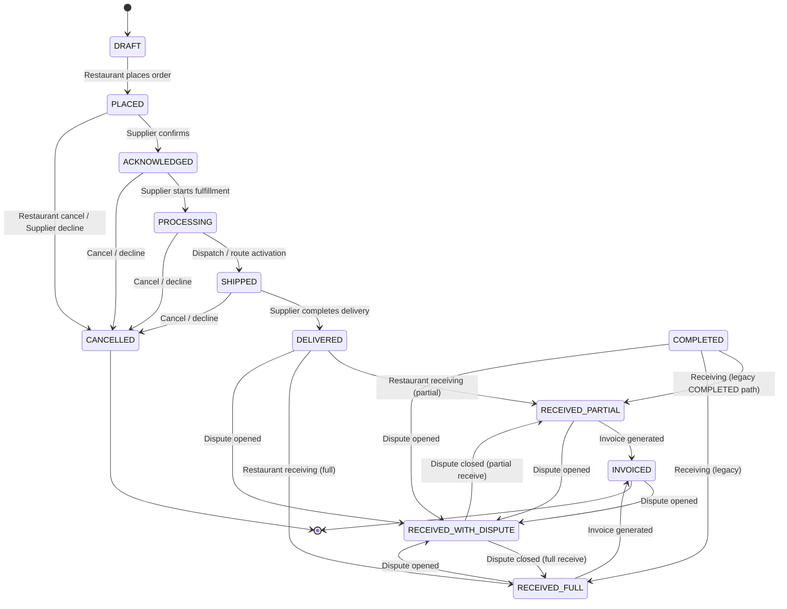
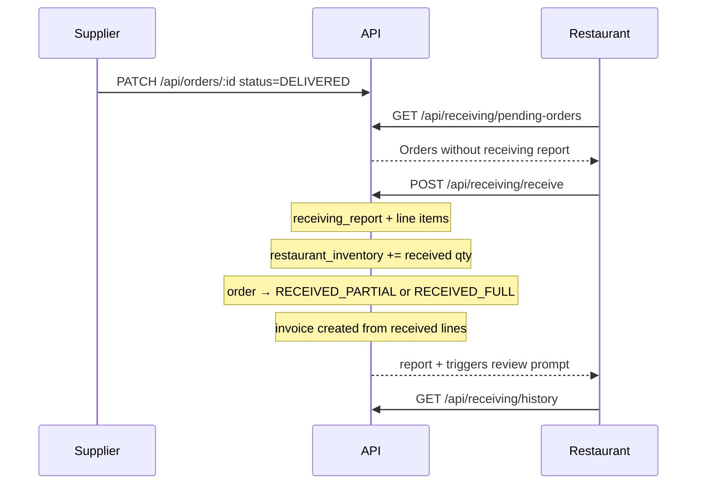
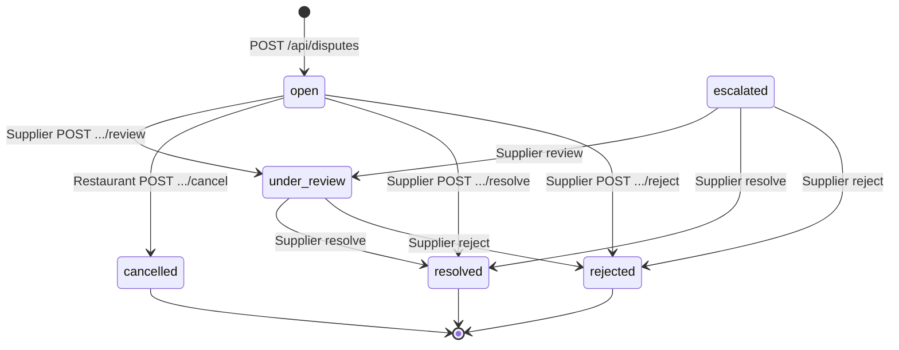
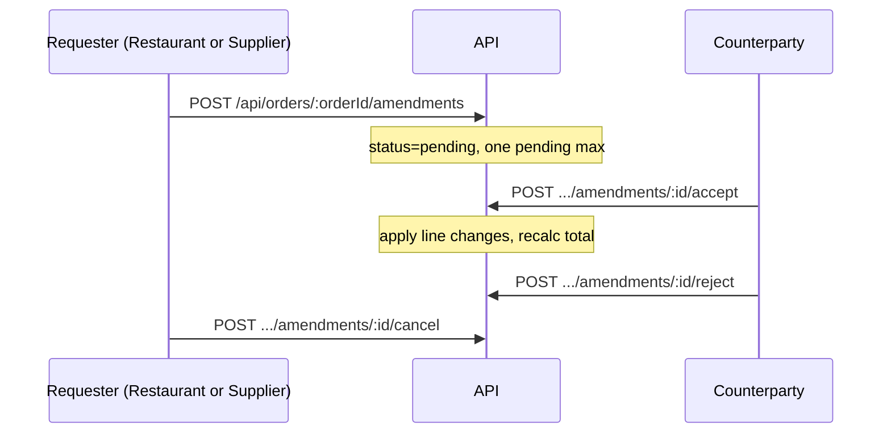

# 11 — API and Workflow Reference

The Supplify API is an **Express 4** application (`apps/api/src/server.js`) exposing **554 HTTP routes** as of the latest `discover-routes.mjs` inventory (`docs/audits/route-inventory.json`, generated 2026-06-17). Routes use a consistent envelope:

```json
{ "ok": true, "data": { ... }, "error": null, "requestId": "..." }
```

Errors use `ok: false` with `error.name`, `error.message`, and optional `error.details`.

---

## Global request pipeline

```mermaid
flowchart LR
  A[Client] --> B[CORS / Helmet / Compression]
  B --> C[Session / Auth cookie]
  C --> D[requestContext + requestLogger]
  D --> E[impersonationContext]
  E --> F[activeTenantContext]
  F --> G[billingAccessMiddleware]
  G --> H[csrfProtection]
  H --> I[Route: requireAuth]
  I --> J[resolveTenantContext]
  J --> K[requirePermission / requireFeature / requireWithinLimit]
  K --> L[Handler]
```



| Stage          | Purpose                                                   |
| -------------- | --------------------------------------------------------- |
| Auth           | Keycloak OIDC — cookie session (web) or Bearer (mobile)   |
| Impersonation  | Admin “view as tenant”; billing locks still apply         |
| Billing        | 402 when subscription account locked (`billingAccess.js`) |
| CSRF           | State-changing requests; `/api/public` bypassed           |
| Tenant context | `req.tenantContext` — roles, permissions, tenant id/type  |
| Plan gates     | 403 `FEATURE_NOT_AVAILABLE` / `LIMIT_EXCEEDED`            |

**Health** — `GET /health`, `GET /ready` (DB + migration readiness).

---

## Route inventory by mount prefix

Counts from `route-inventory.json` (554 total). Regenerate: `node apps/api/scripts/discover-routes.mjs`.

| Mount prefix                 | Routes | Primary domain                                               |
| ---------------------------- | -----: | ------------------------------------------------------------ |
| `/api/admin-dashboard`       |     50 | Platform admin: tenants, plans, impersonation, feature flags |
| `/api/staff`                 |     41 | Staff portal: shifts, payroll, PTO, announcements            |
| `/api/promotions`            |     32 | Deals, coupons, restaurant/supplier promotions               |
| `/api/consumer`              |     31 | Consumer loyalty app (B2C)                                   |
| `/api/supplier`              |     29 | Supplier ops namespace (products, orders, settings)          |
| `/api/public`                |     27 | Unauthenticated: registration, invitations, reservations     |
| `/api/orders`                |     25 | Order CRUD, amendments, driver tracking, calendar            |
| `/api/restaurant-inventory`  |     24 | Stock, expiry, smart reorder, waste                          |
| `/api/fulfillment`           |     20 | Board, exceptions, delivery routes                           |
| `/api/suppliers`             |     20 | Supplier discovery, profile, relationships, branding         |
| `/api/warehouses`            |     17 | Warehouse CRUD, routing, pick/pack                           |
| `/api/org`                   |     16 | Multi-branch org: branches, users, settings                  |
| `/api/restaurants`           |     16 | Restaurant profile, team, invitations                        |
| `/api/chat`                  |     14 | Conversations, support, admin                                |
| `/api/reports`               |     14 | Restaurant & supplier analytics                              |
| `/api/reservations`          |     11 | Table reservations (restaurant)                              |
| `/api/restaurant-org`        |     11 | Org-level restaurant administration                          |
| `/api/quick-lists`           |     10 | Quick lists & scheduled ordering                             |
| `/api/restaurant-finance`    |     10 | Invoices, payments, finance dashboard                        |
| `/api/disputes`              |      9 | Disputes & returns workflow                                  |
| `/api/products`              |      9 | Product catalog search & favorites                           |
| `/api/inventory`             |      8 | Supplier inventory                                           |
| `/api/quote-requests`        |      8 | RFQ / quote workflow                                         |
| `/api/billing`               |      7 | Stripe checkout, payment methods, invoices                   |
| `/api/notifications`         |      7 | In-app notifications                                         |
| `/api/restaurant-pricing`    |      7 | Contract pricing for restaurants                             |
| `/api/roles`                 |      7 | Tenant custom roles (`tenant-roles.routes.js`)               |
| `/api/subscriptions`         |      7 | Plans, entitlements, upgrades                                |
| `/api/drivers`               |      6 | Driver roster                                                |
| `/api/reviews`               |      6 | Supplier reviews                                             |
| `/api/files`                 |      5 | Presigned uploads                                            |
| `/api/invoices`              |      5 | Invoice PDF / payment                                        |
| `/api/restaurant-onboarding` |      5 | Onboarding wizard                                            |
| `/api/branches`              |      4 | Branch locations                                             |
| `/api/receiving`             |      4 | Receiving & quality                                          |
| `/api/audit`                 |      3 | Tenant activity log                                          |
| `/api/prices`                |      3 | Price lists                                                  |
| `/api/push`                  |      3 | Web push subscriptions                                       |
| `/api/admin`                 |      2 | Legacy admin                                                 |
| `/api/credit-notes`          |      2 | Credit notes                                                 |
| `/api/payments`              |      2 | Payment webhooks                                             |
| `/api/register`              |      2 | Tenant registration                                          |
| `/auth`                      |     12 | OIDC login, session, mobile refresh                          |
| `/health`, `/ready`          |      2 | Probes                                                       |
| `/api/e2e`                   |      1 | E2E helpers (non-prod)                                       |

Mount map source: `apps/api/scripts/discover-routes.mjs` → `FILE_PREFIX_OVERRIDES` and `server.js` `app.use()` calls.

---

## Authentication and tenant routes

| Group             | Key endpoints                                                                             | Auth                                    |
| ----------------- | ----------------------------------------------------------------------------------------- | --------------------------------------- |
| **Auth**          | `POST /auth/login`, `GET /auth/session`, `POST /auth/logout`, `POST /auth/mobile/refresh` | Public / session                        |
| **Register**      | `POST /api/register/restaurant`, `POST /api/register/supplier`                            | Public                                  |
| **Subscriptions** | `GET /api/subscriptions/plans`, `/current`, `/entitlements`                               | Tenant auth                             |
| **Billing**       | `GET /api/billing/status`, `POST /api/billing/checkout`, payment methods                  | Tenant auth; always allowed when locked |
| **Roles**         | `GET/POST/PATCH/DELETE /api/roles/*`                                                      | `advanced_roles` feature + permissions  |

---

## Order status state machine

### Enum values (PostgreSQL `order_status`)

| Status                  | Introduced                                    | Active use                                                                   |
| ----------------------- | --------------------------------------------- | ---------------------------------------------------------------------------- |
| `DRAFT`                 | `0001_init.sql`                               | Cart / unpublished orders                                                    |
| `PLACED`                | `0001`                                        | Restaurant submitted order                                                   |
| `ACKNOWLEDGED`          | `0021_update_order_status_enum.sql`           | Supplier confirmed (replaces `CONFIRMED`)                                    |
| `PROCESSING`            | `0021`                                        | Supplier preparing / picking                                                 |
| `SHIPPED`               | `0021`                                        | Out for delivery / dispatched                                                |
| `DELIVERED`             | `0028_order_status_enhancements.sql`          | Supplier marked delivered (awaiting receiving)                               |
| `COMPLETED`             | `0001`                                        | Legacy completion; supplier path may set inventory via `handleOrderDelivery` |
| `RECEIVED_PARTIAL`      | `0028`                                        | Restaurant received &lt; ordered qty                                         |
| `RECEIVED_FULL`         | `0028`                                        | Restaurant received all qty                                                  |
| `RECEIVED_WITH_DISPUTE` | `0110_order_status_received_with_dispute.sql` | Open dispute on received order                                               |
| `INVOICED`              | `0028`                                        | Invoice issued post-receiving                                                |
| `CANCELLED`             | `0001`                                        | Cancelled by restaurant or declined by supplier                              |
| `PENDING_APPROVAL`      | `0069_approvals_budgets.sql`                  | **Legacy** — stuck orders migrated to `PLACED` (`0118`)                      |

**Removed legacy values** — `CONFIRMED` → `ACKNOWLEDGED`, `FULFILLING` → `COMPLETED` (`0021`). Approvals product removed (`0114`); `PENDING_APPROVAL` no longer assigned.

**Delivered-set** (reviews, disputes eligibility): `COMPLETED`, `DELIVERED`, `RECEIVED_PARTIAL`, `RECEIVED_FULL`, `RECEIVED_WITH_DISPUTE`, `INVOICED` (`apps/api/src/lib/order-statuses.js`).

### Lifecycle diagram



### Who performs transitions

| Transition                                  | Actor             | Permission / role                                     | Endpoint                                                                    |
| ------------------------------------------- | ----------------- | ----------------------------------------------------- | --------------------------------------------------------------------------- |
| → `PLACED`                                  | Restaurant        | `ORDERS_CREATE`                                       | `POST /api/orders`, quick-list checkout                                     |
| → `ACKNOWLEDGED` / `PROCESSING` / `SHIPPED` | Supplier          | `ORDERS_EDIT`                                         | `PATCH /api/orders/:id` `{ status }`                                        |
| → `DELIVERED`                               | Supplier          | `ORDERS_EDIT` or `handleOrderDelivery` on `COMPLETED` | `PATCH /api/orders/:id`                                                     |
| → `COMPLETED`                               | Supplier          | `ORDERS_EDIT`                                         | `PATCH /api/orders/:id` → triggers `handleOrderDelivery` (sets `DELIVERED`) |
| → `CANCELLED`                               | Restaurant        | Own order only                                        | `PATCH /api/orders/:id` `{ status: "CANCELLED" }`                           |
| → `CANCELLED` (decline)                     | Supplier          | `ORDERS_MANAGE` + decline reason ≥3 chars             | `PATCH /api/orders/:id`                                                     |
| → `RECEIVED_*`                              | Restaurant        | `RECEIVING_MANAGE`                                    | `POST /api/receiving/receive`                                               |
| → `RECEIVED_WITH_DISPUTE`                   | System            | On dispute create                                     | `POST /api/disputes`                                                        |
| → `INVOICED`                                | System            | On receiving complete                                 | Inside `POST /api/receiving/receive`                                        |
| Driver sub-status                           | Supplier / driver | `FULFILLMENT_MANAGE`                                  | `PATCH /api/orders/:id` `{ delivery_status }`                               |

**Supplier status whitelist** (`orders/update.js`) — Suppliers may only set: `ACKNOWLEDGED`, `PROCESSING`, `SHIPPED`, `DELIVERED`, `COMPLETED`, `CANCELLED`. Restaurants may only set `CANCELLED`.

**Delivery route eligibility** — `PLACED`, `PENDING_APPROVAL` (legacy), `ACKNOWLEDGED`, `PROCESSING`, `SHIPPED` for planned routes; dispatch on `PROCESSING` / `SHIPPED` (`delivery-route-order-statuses.js`).

---

## Order workflow — key endpoints

| Step              | Method  | Path                                | Notes                              |
| ----------------- | ------- | ----------------------------------- | ---------------------------------- |
| List / filter     | `GET`   | `/api/orders`                       | `status`, `supplier`, date range   |
| Create            | `POST`  | `/api/orders`                       | Enforces `orders_per_day` meter    |
| Manual create     | `POST`  | `/api/orders/manual`                | Supplier-initiated                 |
| Detail            | `GET`   | `/api/orders/:id`                   | Includes amendments, dispute links |
| Update status     | `PATCH` | `/api/orders/:id`                   | Role-gated transitions above       |
| Remind supplier   | `POST`  | `/api/orders/:id/remind`            | Notification                       |
| Packing slip      | `GET`   | `/api/orders/:id/packing-slip/pdf`  | PDF export                         |
| Warehouse assign  | `POST`  | `/api/orders/:id/warehouses`        | Multi-warehouse routing            |
| Driver assign     | `POST`  | `/api/orders/:id/assign-driver`     | Driver management feature          |
| Delivery status   | `PATCH` | `/api/orders/:id/delivery-status`   | Driver lifecycle                   |
| Proof of delivery | `POST`  | `/api/orders/:id/proof-of-delivery` | Photo / signature                  |
| GPS tracking      | `GET`   | `/api/orders/:id/tracking`          | Live location                      |
| Calendar          | `GET`   | `/api/orders/calendar`              | `order_calendar` feature           |

---

## Receiving workflow

**Feature gate** — `receiving_quality` (`requireFeature` on router).

**Receivable order statuses** — `DELIVERED`, `COMPLETED` (`receiving.routes.js`).



| Endpoint                                 | Method | Permission         | Description                                   |
| ---------------------------------------- | ------ | ------------------ | --------------------------------------------- |
| `/api/receiving/pending-orders`          | `GET`  | `RECEIVING_VIEW`   | Restaurant: orders awaiting receive           |
| `/api/receiving/pending-orders/supplier` | `GET`  | `ORDERS_VIEW`      | Supplier: counterpart view                    |
| `/api/receiving/receive`                 | `POST` | `RECEIVING_MANAGE` | Submit line-level quantities, quality, expiry |
| `/api/receiving/history`                 | `GET`  | `RECEIVING_VIEW`   | Past receiving reports                        |

**Receiving report statuses** — `ACCEPTED` (full qty), `PARTIAL` (under-received). Line `quality_status` drives inventory updates (`ACCEPTED` only).

**Side effects on receive** — Inventory lots (`createLotFromReceivingLine`), loyalty earn, invoice generation, reorder forecast cache invalidation, optional review notification.

---

## Disputes workflow

**Feature gate** — `disputes_returns` on all routes.

**Dispute statuses** — `open` → `under_review` → `resolved` | `rejected` | `cancelled`; `escalated` also resolvable.



| Endpoint                        | Method | Actor      | Permission                            |
| ------------------------------- | ------ | ---------- | ------------------------------------- |
| `/api/disputes`                 | `POST` | Restaurant | `ORDERS_CREATE` or `RECEIVING_MANAGE` |
| `/api/disputes`                 | `GET`  | Restaurant | `ORDERS_VIEW`                         |
| `/api/disputes/incoming`        | `GET`  | Supplier   | `FULFILLMENT_VIEW`                    |
| `/api/disputes/:id`             | `GET`  | Both       | `ORDERS_VIEW` / `FULFILLMENT_VIEW`    |
| `/api/disputes/:id/attachments` | `POST` | Restaurant | `ORDERS_CREATE`                       |
| `/api/disputes/:id/cancel`      | `POST` | Restaurant | `open` only                           |
| `/api/disputes/:id/review`      | `POST` | Supplier   | Moves to `under_review`               |
| `/api/disputes/:id/reject`      | `POST` | Supplier   | `no_action` resolution                |
| `/api/disputes/:id/resolve`     | `POST` | Supplier   | See resolution types below            |

**Preconditions** — Order must be in `DELIVERED_ORDER_STATUSES`. One active dispute per order (`open`, `under_review`, `escalated`). On create, order → `RECEIVED_WITH_DISPUTE` when prior status is `RECEIVED_*`, `DELIVERED`, or `COMPLETED`.

**Resolution types** (`resolveDispute`) — `credit_note` (creates `credit_note` row), `replacement` (spawns replacement `customer_order`), `refund`, `no_action`. On close, order status restored to `RECEIVED_PARTIAL` or `RECEIVED_FULL` from receiving aggregates.

**Related** — `GET/POST /api/credit-notes/*`; replacement orders link `source_dispute_id`.

---

## Order amendments workflow

**Feature gate** — `order_amendments`. Mounted at `/api/orders/:orderId/amendments`.

**Mutable order statuses** — `PLACED`, `PENDING_APPROVAL`, `ACKNOWLEDGED`, `PROCESSING` (`order-amendments.service.js`).



| Endpoint              | Method | Permission      | Rules                                                                                       |
| --------------------- | ------ | --------------- | ------------------------------------------------------------------------------------------- |
| `GET .../amendments`  | `GET`  | `ORDERS_VIEW`   | List amendments + items                                                                     |
| `POST .../amendments` | `POST` | `ORDERS_MANAGE` | `changeType`: quantity_change, item_substitution, item_removal, delivery_date_change, other |
| `POST .../:id/accept` | `POST` | `ORDERS_MANAGE` | Counterparty only; applies items                                                            |
| `POST .../:id/reject` | `POST` | `ORDERS_MANAGE` | Cannot reject own request                                                                   |
| `POST .../:id/cancel` | `POST` | `ORDERS_MANAGE` | Requester only while `pending`                                                              |

---

## Fulfillment and logistics (related)

| Prefix                        | Purpose                              |
| ----------------------------- | ------------------------------------ |
| `/api/fulfillment/board`      | Kanban-style order board             |
| `/api/fulfillment/routes`     | Delivery route planning & activation |
| `/api/fulfillment/exceptions` | Fulfillment exception log            |
| `/api/warehouses/*`           | Warehouse CRUD, pick lists, dispatch |
| `/api/drivers/*`              | Driver roster                        |

Warehouse inventory syncs on order status change via `syncWarehouseFulfillmentOnOrderStatus()` (`warehouseInventory.js`) for `ACKNOWLEDGED` / `PROCESSING` (picking) and `SHIPPED` / `COMPLETED` (dispatch).

---

## Other high-traffic route groups

### Restaurant operations

| Prefix                         | Capabilities                                    |
| ------------------------------ | ----------------------------------------------- |
| `/api/restaurant-inventory`    | Stock levels, expiry, waste, smart reorder / AI |
| `/api/quick-lists`             | Lists, schedules, automated order placement     |
| `/api/restaurant-finance`      | Invoice list, payments, analytics               |
| `/api/restaurant-pricing`      | Contract / negotiated pricing                   |
| `/api/restaurant-org`          | Central purchasing, org users                   |
| `/api/promotions` (restaurant) | Browse / redeem supplier deals                  |

### Supplier operations

| Prefix                       | Capabilities                                                                |
| ---------------------------- | --------------------------------------------------------------------------- |
| `/api/supplier`              | Catalog, orders, settings, reorder reminder send (`supplier-ops.routes.js`) |
| `/api/suppliers`             | Public profile, follow, search                                              |
| `/api/inventory`             | Supplier stock                                                              |
| `/api/promotions` (supplier) | Create/manage deals                                                         |
| `/api/supplier-growth`       | Customer import, invites (via `supplier_growth` feature)                    |

### Platform admin

| Prefix                               | Capabilities                          |
| ------------------------------------ | ------------------------------------- |
| `/api/admin-dashboard/tenants`       | Tenant CRUD, limits, overrides        |
| `/api/admin-dashboard/plans`         | Plan catalog editing                  |
| `/api/admin-dashboard/subscriptions` | Subscription management               |
| `/api/admin-dashboard/feature-flags` | Global + per-tenant feature overrides |
| `/api/admin-dashboard/impersonate`   | Support impersonation                 |

### Communications

| Prefix                    | Capabilities                                                          |
| ------------------------- | --------------------------------------------------------------------- |
| `/api/chat/conversations` | Multi-party chat (`chats_per_day` / `open_conversations` limits)      |
| `/api/notifications`      | In-app feed, preferences, test send, Platinum outbound webhook config |
| `/api/push`               | Web Push subscribe/unsubscribe                                        |
| `/api/push`               | Web push subscription                                                 |

---

## Error codes reference (workflow-related)

| HTTP | `error.name`            | When                                                           |
| ---- | ----------------------- | -------------------------------------------------------------- |
| 402  | Account locked          | `billingAccessMiddleware` — overdue / Free Trial expired write |
| 403  | `FEATURE_NOT_AVAILABLE` | `requireFeature`                                               |
| 403  | `LIMIT_EXCEEDED`        | `requireWithinLimit`, `checkAndIncrementUsage`                 |
| 403  | `FORBIDDEN`             | RBAC permission missing                                        |
| 409  | `CONFLICT`              | Duplicate receiving report, active dispute exists              |
| 400  | `VALIDATION_ERROR`      | Invalid status transition, Zod validation                      |

---

## Regenerating route inventory

```bash
cd apps/api
node scripts/discover-routes.mjs
```

Outputs:

- `docs/audits/route-inventory.json` — machine-readable 554 routes
- `docs/audits/DEV_API_ROUTE_TEST_MATRIX.md` — QA matrix

---

## Source files (workflow index)

| Workflow            | Primary files                                                                            |
| ------------------- | ---------------------------------------------------------------------------------------- |
| Order CRUD & status | `apps/api/src/routes/orders/update.js`, `orders.helpers.js`, `create.js`                 |
| Receiving           | `apps/api/src/routes/receiving.routes.js`                                                |
| Disputes            | `apps/api/src/routes/disputes.routes.js`, `services/disputes.service.js`                 |
| Amendments          | `apps/api/src/routes/order-amendments.routes.js`, `services/order-amendments.service.js` |
| Driver delivery     | `apps/api/src/routes/orders-driver.routes.js`, `lib/driver-delivery.js`                  |
| Status constants    | `apps/api/src/lib/order-statuses.js`, `lib/delivery-route-order-statuses.js`             |
| Route discovery     | `apps/api/scripts/discover-routes.mjs`, `apps/api/src/server.js`                         |
