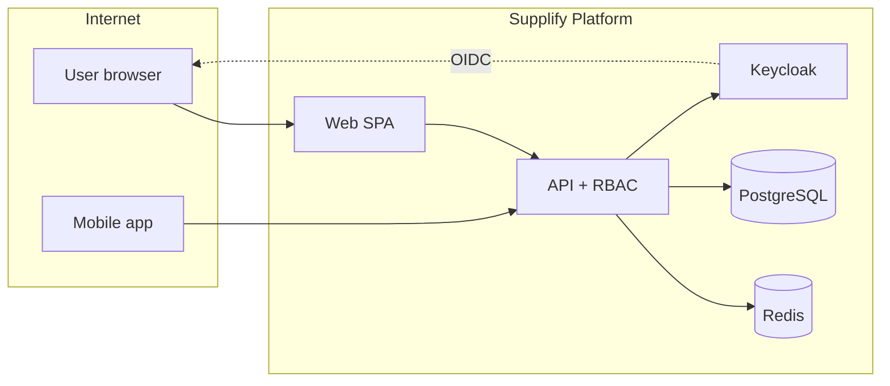

# 15 — Security Review (Documentation Assessment)

**Date:** 2026-06-17  
**Scope:** Security posture of Supplify as evidenced by repository code, configuration, and onboarding documentation.  
**Method:** Static analysis and documentation cross-check only — **no destructive testing, no penetration testing, no production probing.**

**Reviewer context:** This document assesses what the codebase _implements_ and where _gaps_ remain. It is not a SOC 2 or ISO certification.

---

## Executive summary

Supplify's security architecture is **appropriately layered for a B2B SaaS MVP targeting production**: OIDC via Keycloak, server-side JWT validation, mandatory API permission checks, CSRF on cookie-based web mutations, rate limiting, helmet headers, tenant-scoped data access, billing lock enforcement even under admin impersonation, and audited admin impersonation.

**Residual risk** clusters around: operational secrets handling, Redis/session hardening in multi-node deploys, incomplete features that previously misled users (now mitigated), GPS privacy configuration discipline, and documentation of public endpoints. No **Critical** code defect was identified in this static pass; highest practical risks are **High** configuration and process items.

---

## Findings summary

| Severity      | Count | Themes                                                    |
| ------------- | ----: | --------------------------------------------------------- |
| Critical      |     0 | —                                                         |
| High          |     4 | Secrets, Redis/session, admin surface, GPS privacy        |
| Medium        |     6 | Rate limits, CSRF scope, file uploads, audit completeness |
| Low           |     5 | Verbose errors, demo passwords, lint debt                 |
| Informational |     6 | Positive controls, doc hygiene                            |

---

## Critical

_None identified in static review._

---

## High

### H-1: Production secrets must be uniquely generated and rotated

| Field              | Detail                                                                                                                                             |
| ------------------ | -------------------------------------------------------------------------------------------------------------------------------------------------- |
| **Finding**        | Default demo credentials (`SupplifyAdmin1!`, Keycloak `admin/admin`) and example `.env` values are suitable for local dev only.                    |
| **Evidence**       | `apps/api/scripts/seed-demo-users.js` lines 21–45; `docker/.env` patterns; `docs/guides/setup.md`                                                  |
| **Risk**           | Credential stuffing if defaults reach production or staging URLs.                                                                                  |
| **Recommendation** | Enforce unique `SESSION_SECRET`, Keycloak client secrets, DB passwords; disable demo seed scripts in prod; use secret manager (Railway variables). |
| **Status**         | Process — not auto-enforced in code                                                                                                                |

### H-2: Session and token storage depend on correct cookie flags

| Field              | Detail                                                                                                                                                                         |
| ------------------ | ------------------------------------------------------------------------------------------------------------------------------------------------------------------------------ |
| **Finding**        | Auth relies on httpOnly cookies (`access_token`, `refresh_token`). Misconfigured `COOKIE_SECURE`, `COOKIE_SAME_SITE`, or `COOKIE_DOMAIN` enables session theft or breaks auth. |
| **Evidence**       | `apps/api/src/lib/rbac.js` `setAuthCookies()`; `tests/e2e/auth.setup.ts` Secure-cookie HTTP warning                                                                            |
| **Risk**           | Session hijack on HTTP deployments; cross-site request risk if `SameSite` too permissive                                                                                       |
| **Recommendation** | HTTPS everywhere in prod; `COOKIE_SECURE=true`; document `OAUTH_CALLBACK_BASE_URL` first-party pattern (`09-authentication-rbac.md`)                                           |
| **Status**         | Config-dependent                                                                                                                                                               |

### H-3: Admin impersonation is powerful — audit and permission gating required

| Field              | Detail                                                                                                                                                  |
| ------------------ | ------------------------------------------------------------------------------------------------------------------------------------------------------- |
| **Finding**        | Admins can impersonate tenants via signed `impersonation_token` cookie; billing writes remain blocked but read access is tenant-equivalent.             |
| **Evidence**       | `apps/api/src/lib/impersonation.js`; `tests/api/admin-impersonation.spec.ts`; route matrix marks impersonate `UNSAFE` in `DEV_API_ROUTE_TEST_MATRIX.md` |
| **Risk**           | Insider abuse; support account compromise                                                                                                               |
| **Recommendation** | Restrict `ADMIN_TENANTS`; log all impersonation to `audit-logs`; MFA on admin Keycloak realm; time-boxed impersonation tokens                           |
| **Status**         | Partially mitigated (audit exists; MFA is org process)                                                                                                  |

### H-4: GPS tracking exposes driver location to restaurants — privacy env discipline

| Field              | Detail                                                                                                                                |
| ------------------ | ------------------------------------------------------------------------------------------------------------------------------------- |
| **Finding**        | Live driver GPS is globally gated (`GPS_TRACKING_ENABLED`) with optional name/phone exposure to restaurants.                          |
| **Evidence**       | `apps/api/src/config/env.js` 244–252; `docs/features/drivers-and-gps-tracking.md`; `GPS_RESTAURANT_SHOW_DRIVER_PHONE` default `false` |
| **Risk**           | Workforce surveillance liability; phone leak if env mis-set                                                                           |
| **Recommendation** | Keep phone hidden default; document DPA/worker consent; per-tenant opt-out roadmap                                                    |
| **Status**         | Mitigated by defaults; ops vigilance required                                                                                         |

---

## Medium

### M-1: CSRF protection skipped for Bearer (mobile) — correct but increases API token sensitivity

| Field              | Detail                                                               |
| ------------------ | -------------------------------------------------------------------- |
| **Evidence**       | `apps/api/src/middlewares/csrf.test.js` — Bearer bypasses CSRF       |
| **Risk**           | Stolen mobile access token = full API access until expiry            |
| **Recommendation** | Short access TTL; refresh rotation; remote wipe; biometric on mobile |

### M-2: Rate limiting may be insufficient for authenticated abuse

| Field              | Detail                                                                                        |
| ------------------ | --------------------------------------------------------------------------------------------- |
| **Evidence**       | `server.js` global limiter; public 60/min prod; auth endpoints shared limit                   |
| **Risk**           | Authenticated credential abuse, enumeration                                                   |
| **Recommendation** | Per-user rate limits on sensitive routes (`supplier-ops.routes.js` has local limiter pattern) |

### M-3: File upload attack surface (size, type, storage quota)

| Field              | Detail                                                               |
| ------------------ | -------------------------------------------------------------------- |
| **Evidence**       | `files.routes.js`, MinIO/S3 driver, `storage_mb` plan meter          |
| **Risk**           | Malware hosting; DoS via large uploads                               |
| **Recommendation** | Content-type validation, virus scan hook, signed URLs with short TTL |

### M-4: Public and guest endpoints expand attack surface

| Field              | Detail                                                                                      |
| ------------------ | ------------------------------------------------------------------------------------------- |
| **Evidence**       | `/api/public/*`, `/reserve/*`, consumer `/order/*` — CSRF exempt on public API              |
| **Risk**           | Scraping, reservation spam, checkout abuse                                                  |
| **Recommendation** | CAPTCHA on high-abuse endpoints; tighten public rate limits; monitor `email-logs` admin tab |

### M-5: Redis optional in dev — production must require Redis for Socket.IO scale

| Field              | Detail                                                                            |
| ------------------ | --------------------------------------------------------------------------------- |
| **Evidence**       | `resolve-redis-url.js`; cache permission keys                                     |
| **Risk**           | Inconsistent security state across API instances; stale permissions up to 180s    |
| **Recommendation** | Mandate Redis in prod; invalidate perm cache on role change (already implemented) |

### M-6: Tenant audit log not universal

| Field              | Detail                                                                      |
| ------------------ | --------------------------------------------------------------------------- |
| **Evidence**       | `tenant_audit_log` Gold+; role change audit described as thin in demo audit |
| **Risk**           | Forensics gap for Silver tenants                                            |
| **Recommendation** | Platform audit for all subscription events; expand tenant audit coverage    |

---

## Low

### L-1: Error responses may leak implementation details in dev

| Field              | Detail                                                    |
| ------------------ | --------------------------------------------------------- |
| **Evidence**       | `logger.error` with stack in `auth.routes.js` login catch |
| **Risk**           | Verbose errors if `NODE_ENV` mis-set                      |
| **Recommendation** | Sanitize production error middleware                      |

### L-2: Demo seed scripts wipe commercial data

| Field              | Detail                                      |
| ------------------ | ------------------------------------------- |
| **Evidence**       | `seed-full.mjs` warning banner              |
| **Risk**           | Accidental run against shared staging       |
| **Recommendation** | `NODE_ENV=production` guard in seed scripts |

### L-3: Supplier Settings unwired tabs (mitigated)

| Field              | Detail                                                                                     |
| ------------------ | ------------------------------------------------------------------------------------------ |
| **Evidence**       | `DELIVERY_ZONES_ENABLED=false`; fake toasts removed per `SUPPLIFY_DEMO_READINESS_AUDIT.md` |
| **Risk**           | Was user-trust issue; now honest messaging                                                 |
| **Recommendation** | Hide tabs until wired                                                                      |

### L-4: ESLint `exhaustive-deps` warnings (46)

| Field              | Detail                                                               |
| ------------------ | -------------------------------------------------------------------- |
| **Evidence**       | Demo readiness audit §6                                              |
| **Risk**           | Stale closure bugs — indirect security (wrong tenant data displayed) |
| **Recommendation** | Triage per file                                                      |

### L-5: `sql-migrator.js` treats `42P07` as success

| Field              | Detail                                                           |
| ------------------ | ---------------------------------------------------------------- |
| **Evidence**       | `docs/audits/supplify-quick-performance-ui-db-security-audit.md` |
| **Risk**           | Partial migrations marked applied                                |
| **Recommendation** | Strict migration CI on fresh DB                                  |

---

## Informational (positive controls)

### I-1: Server-side RBAC is mandatory

`requirePermission` on routes; comprehensive tests in `rbac-full-app.test.js` and e2e `rbac.spec.ts`.

### I-2: JWT validation uses remote JWKS with issuer normalization

`apps/api/src/lib/auth.js` — industry standard.

### I-3: Staff portal isolation

`STAFF_PORTAL` users blocked from main `/app` APIs via `assertStaffPortalRouteAccess`.

### I-4: Driver role minimized

Only `DRIVER_DELIVERIES_VIEW` and `DRIVER_DELIVERIES_MANAGE`; `driver-rbac.js` status enum enforcement.

### I-5: Billing lock cannot be bypassed by impersonation

`billingAccessMiddleware` tests; documented in billing regression audit.

### I-6: Security headers via Helmet

`apps/api/src/server.js` helmet middleware configured.

### I-7: Permission cache invalidation on role changes

Redis `perm:*` keys; TTL 180s documented in `09-authentication-rbac.md`.

### I-8: Route inventory and test matrix for 554 API routes

`docs/audits/route-inventory.json`, `DEV_API_ROUTE_TEST_MATRIX.md` — visibility for untested unsafe routes.

---

## Documentation security assessment

| Doc area                      | Assessment                                                                                                |
| ----------------------------- | --------------------------------------------------------------------------------------------------------- |
| **09-authentication-rbac.md** | Accurate OIDC flow, cookie table, permission list — suitable for engineers; does not expose secrets       |
| **12-demo-script.md**         | Contains demo passwords intentionally — **mark as INTERNAL**; do not publish to public web                |
| **14-troubleshooting.md**     | Safe fixes only; no exploit instructions                                                                  |
| **Onboarding guides**         | No production credentials committed in tracked files (verify `.env` gitignored)                           |
| **Gap**                       | No dedicated `SECURITY.md` responsible disclosure policy in onboarding set — recommend root `SECURITY.md` |

---

## Threat model sketch (documentation level)

**Primary assets:** Tenant commercial data (orders, invoices, PII), credentials, payment methods.  
**Primary controls:** OIDC, RBAC, tenant_id scoping, TLS, CSRF (web), rate limits.

---

## Compliance-oriented notes (non-exhaustive)

| Topic                   | Status in codebase                                                         |
| ----------------------- | -------------------------------------------------------------------------- |
| GDPR data export/delete | Partial — admin tools; verify DPA requirements per deployment              |
| PCI                     | Card data via payment provider — confirm SAQ scope with Stripe/integration |
| Audit trail             | Platform admin audit + tenant audit (Gold)                                 |
| Data residency          | Not enforced in code — deployment choice                                   |

---

## Recommended next security work (priority order)

1. Add production guard to destructive seed scripts.
2. Publish `SECURITY.md` with disclosure contact.
3. MFA for admin Keycloak realm in production.
4. Per-user rate limiting on auth and file upload routes.
5. Hide or wire Supplier Settings Delivery Zones/Contacts tabs.
6. Automated dependency scanning in CI (if not already — verify `.github/workflows`).

---

## Assessment conclusion

Supplify's **documented and implemented security model is coherent for enterprise B2B demos and controlled production rollout**, provided operators follow environment hardening (HTTPS, secrets, Redis, Keycloak tuning). The largest gaps are **operational** (secret hygiene, admin power, GPS privacy config) rather than missing authentication entirely.

_This review did not include dynamic scanning, fuzzing, or social engineering._

---

_Document version: 2026-06-17. Related: [09-authentication-rbac.md](./09-authentication-rbac.md), [16-implementation-status.md](./16-implementation-status.md)._
