# Supplify Complete Handbook

|                     |                                            |
| ------------------- | ------------------------------------------ |
| **Title**           | Supplify Complete Handbook                 |
| **Version**         | 1.0                                        |
| **Generation date** | 2026-06-17                                 |
| **Source commit**   | `ab5695e195079adde17df8b8082f193551daf2d8` |
| **Repository**      | supplify_erp                               |

_Single-volume onboarding, product, operations, and technical reference assembled from `docs/onboarding/01`–`20`._

> **Stale commercial sections:** This assembled handbook may still embed legacy Silver/Gold/Platinum matrices from before the four-plan model. For current pricing and plan names, use [../product/four-plan-pricing-model.md](../product/four-plan-pricing-model.md). Regenerate after updating onboarding sources: `pnpm docs:onboarding:handbook`.

---

## Disclaimer

This handbook describes Supplify **as implemented in the repository at the commit above**, not as a marketing promise. Capabilities marked **Partial**, **UI-only**, or **disabled by default** in the feature inventory and acceptance criteria may be incomplete, environment-gated, or absent from demo seeds.

**Implementation status (honest summary):**

- **Core B2B order flow** (cart → supplier fulfill → receive → invoice) is production-intent and well tested.
- **Admin platform**, **monetization/tiers**, and **hospitality add-ons** (reservations, B2C, staff) are shipped with varying demo polish.
- **Known gaps** include: supplier Settings Delivery Zones/Contacts tabs (UI-only, hidden); restaurant finance opening balance hardcoded `0`; delivery rollover cron disabled unless `DELIVERY_ROLLOVER_ENABLED=true`; driver Keycloak users not in `seed:full`; quote prices informational at checkout.
- **554 API routes** and **127 feature inventory rows** are code-verified; always re-run route discovery and tests after major releases.

For claim-level traceability, see [Part XX — Source Evidence Index](#part-xx-source-evidence-index). For pass/fail definitions, see [Part XIII — Acceptance Criteria](#part-xiii-acceptance-criteria). [Part XVI — Implementation Status](#part-xvi-implementation-status) expands the honest assessment.

**Audience:** Parts VII–XI and XV are marked _(Internal Technical Reference)_ for engineers, DevOps, and implementation partners.

---

## Table of Contents

- [Disclaimer](#disclaimer)
- [Feature Inventory Summary](#feature-inventory-summary)
- [Part I — Executive Overview](#part-i-executive-overview)
  - [What Supplify Is](#what-supplify-is)
  - [User Ecosystem](#user-ecosystem)
  - [Value Propositions by Persona](#value-propositions-by-persona)
  - [Platform at a Glance](#platform-at-a-glance)
  - [Key Platform Metrics](#key-platform-metrics)
  - [Ecosystem Diagram](#ecosystem-diagram)
  - [Strategic Outcomes](#strategic-outcomes)
  - [Known Limitations (Executive Summary)](#known-limitations-executive-summary)
  - [Implementation Evidence](#implementation-evidence)
  - [Next Steps for Readers](#next-steps-for-readers)
- [Part II — Complete Product Guide](#part-ii-complete-product-guide)
  - [Introduction](#introduction)
  - [User Types and Roles](#user-types-and-roles)
  - [Tenant Model](#tenant-model)
  - [Authentication and Session Management](#authentication-and-session-management)
  - [Supplier and Restaurant Onboarding](#supplier-and-restaurant-onboarding)
  - [Catalog, Products, and Pricing](#catalog-products-and-pricing)
  - [Ordering Lifecycle](#ordering-lifecycle)
  - [Fulfillment, Drivers, and GPS](#fulfillment-drivers-and-gps)
  - [Receiving and Quality](#receiving-and-quality)
  - [Disputes and Returns](#disputes-and-returns)
  - [Inventory](#inventory)
  - [Finance, Invoices, and Payments](#finance-invoices-and-payments)
  - [Deals, Promotions, and Loyalty](#deals-promotions-and-loyalty)
  - [Reservations (Front of House)](#reservations-front-of-house)
  - [Staff and Labour](#staff-and-labour)
  - [Notifications and Realtime](#notifications-and-realtime)
  - [Admin Platform](#admin-platform)
  - [Subscriptions, Billing, and Entitlements](#subscriptions-billing-and-entitlements)
  - [Consumer B2C Ordering](#consumer-b2c-ordering)
  - [Supplier Growth Program](#supplier-growth-program)
  - [Quote Requests and Supplier Mini-Store](#quote-requests-and-supplier-mini-store)
  - [Reports and Analytics](#reports-and-analytics)
  - [Partial and Disabled Features — Summary](#partial-and-disabled-features-summary)
  - [Cron and Background Jobs](#cron-and-background-jobs)
  - [Verification and Testing](#verification-and-testing)
  - [Master Implementation Evidence Index](#master-implementation-evidence-index)
- [Part III — Supplier Onboarding Guide](#part-iii-supplier-onboarding-guide)
- [Part IV — Restaurant Onboarding Guide](#part-iv-restaurant-onboarding-guide)
- [Part V — Driver Onboarding Guide](#part-v-driver-onboarding-guide)
  - [API quick reference (driver)](#api-quick-reference-driver)
- [Part VI — Platform Admin Onboarding Guide](#part-vi-platform-admin-onboarding-guide)
  - [API mount reference](#api-mount-reference)
  - [Web route reference](#web-route-reference)
- [Part VII — Technical Architecture](#part-vii-technical-architecture-internal-technical-reference)
  - [System overview](#system-overview)
  - [Frontend (Vite / React / RTK)](#frontend-vite-react-rtk)
  - [Backend — Express middleware chain](#backend-express-middleware-chain)
  - [Redis](#redis)
  - [MinIO / object storage](#minio-object-storage)
  - [Socket.IO](#socketio)
  - [Cron jobs (18)](#cron-jobs-18)
  - [Deployment](#deployment)
  - [Environment variables (sanitized reference)](#environment-variables-sanitized-reference)
  - [Implementation evidence](#implementation-evidence)
  - [Related docs](#related-docs)
- [Part VIII — Database Guide](#part-viii-database-guide-internal-technical-reference)
  - [Migration system](#migration-system)
  - [Schemas & naming conventions](#schemas-naming-conventions)
  - [Tenant isolation patterns](#tenant-isolation-patterns)
  - [Status fields](#status-fields)
  - [Entity-relationship diagram (core commercial domain)](#entity-relationship-diagram-core-commercial-domain)
  - [Key relationships (query mental model)](#key-relationships-query-mental-model)
  - [Seeds & demo data](#seeds-demo-data)
  - [Indexes & performance](#indexes-performance)
  - [Implementation evidence](#implementation-evidence)
  - [Related docs](#related-docs)
- [Part IX — Authentication & RBAC](#part-ix-authentication-rbac-internal-technical-reference)
  - [Keycloak OIDC flow](#keycloak-oidc-flow)
  - [Token & cookie flow](#token-cookie-flow)
  - [Permission keys (52)](#permission-keys-52)
  - [Restaurant system roles (7)](#restaurant-system-roles-7)
  - [Supplier system roles (9)](#supplier-system-roles-9)
  - [Admin permissions](#admin-permissions)
  - [Staff portal (`STAFF_PORTAL`)](#staff-portal-staffportal)
  - [Impersonation](#impersonation)
  - [Frontend enforcement](#frontend-enforcement)
  - [Backend enforcement](#backend-enforcement)
  - [Permission resolution algorithm](#permission-resolution-algorithm)
  - [Implementation evidence](#implementation-evidence)
  - [Related docs](#related-docs)
- [Part X — Subscriptions and Plans](#part-x-subscriptions-and-plans-internal-technical-reference)
  - [Plan catalog summary](#plan-catalog-summary)
  - [Free Trial: Gold features, Free limits](#free-trial-gold-features-free-limits)
  - [Feature keys](#feature-keys)
  - [Limit keys](#limit-keys)
  - [Plan limit tables](#plan-limit-tables)
  - [Restaurant feature × plan matrix](#restaurant-feature-plan-matrix)
  - [Supplier feature × plan matrix](#supplier-feature-plan-matrix)
  - [Enforcement architecture](#enforcement-architecture)
  - [Frontend: `useEntitlements` and `planFeatureGates`](#frontend-useentitlements-and-planfeaturegates)
  - [Subscription lifecycle (brief)](#subscription-lifecycle-brief)
  - [Source files (quick index)](#source-files-quick-index)
- [Part XI — API and Workflow Reference](#part-xi-api-and-workflow-reference-internal-technical-reference)
  - [Global request pipeline](#global-request-pipeline)
  - [Route inventory by mount prefix](#route-inventory-by-mount-prefix)
  - [Authentication and tenant routes](#authentication-and-tenant-routes)
  - [Order status state machine](#order-status-state-machine)
  - [Order workflow — key endpoints](#order-workflow-key-endpoints)
  - [Receiving workflow](#receiving-workflow)
  - [Disputes workflow](#disputes-workflow)
  - [Order amendments workflow](#order-amendments-workflow)
  - [Fulfillment and logistics (related)](#fulfillment-and-logistics-related)
  - [Other high-traffic route groups](#other-high-traffic-route-groups)
  - [Error codes reference (workflow-related)](#error-codes-reference-workflow-related)
  - [Regenerating route inventory](#regenerating-route-inventory)
  - [Source files (workflow index)](#source-files-workflow-index)
- [Part XII — Demo Scripts](#part-xii-demo-scripts)
  - [Before you present](#before-you-present)
  - [5-minute executive demo](#5-minute-executive-demo)
  - [15-minute standard demo](#15-minute-standard-demo)
  - [30-minute full demo](#30-minute-full-demo)
  - [Restaurant-only demo (12 minutes)](#restaurant-only-demo-12-minutes)
  - [Supplier-only demo (12 minutes)](#supplier-only-demo-12-minutes)
  - [Operations / platform admin demo (15 minutes)](#operations-platform-admin-demo-15-minutes)
  - [Admin demo (finance + governance focus, 10 minutes)](#admin-demo-finance-governance-focus-10-minutes)
  - [Driver / logistics add-on (5 minutes)](#driver-logistics-add-on-5-minutes)
  - [Rehearsal checklist (day before)](#rehearsal-checklist-day-before)
  - [Related docs](#related-docs)
- [Part XIII — Acceptance Criteria](#part-xiii-acceptance-criteria)
  - [1. Authentication & session (OIDC)](#1-authentication-session-oidc)
  - [2. Tenant registration & activation](#2-tenant-registration-activation)
  - [3. RBAC — restaurant workspace roles](#3-rbac-restaurant-workspace-roles)
  - [4. RBAC — supplier workspace roles](#4-rbac-supplier-workspace-roles)
  - [5. Subscriptions & plan enforcement](#5-subscriptions-plan-enforcement)
  - [6. Supplier catalog & products](#6-supplier-catalog-products)
  - [7. Contract pricing](#7-contract-pricing)
  - [8. Restaurant cart & order placement](#8-restaurant-cart-order-placement)
  - [9. Supplier order inbox & decline](#9-supplier-order-inbox-decline)
  - [10. Fulfillment, dispatch & routes](#10-fulfillment-dispatch-routes)
  - [11. GPS tracking & delivery ETA](#11-gps-tracking-delivery-eta)
  - [12. Receiving & quality](#12-receiving-quality)
  - [13. Disputes & credit notes](#13-disputes-credit-notes)
  - [14. Invoices & payments (AP/AR)](#14-invoices-payments-apar)
  - [15. Restaurant finance & statements](#15-restaurant-finance-statements)
  - [16. Quick lists & scheduled orders](#16-quick-lists-scheduled-orders)
  - [17. Smart reorder & AI assistant](#17-smart-reorder-ai-assistant)
  - [18. Restaurant & supplier inventory](#18-restaurant-supplier-inventory)
  - [19. Deals & promotions](#19-deals-promotions)
  - [20. Chat & realtime messaging](#20-chat-realtime-messaging)
  - [21. Reservations (FOH)](#21-reservations-foh)
  - [22. Staff directory & staff portal](#22-staff-directory-staff-portal)
  - [23. Consumer B2C ordering](#23-consumer-b2c-ordering)
  - [24. Supplier customer growth program](#24-supplier-customer-growth-program)
  - [25. Quote requests (RFQ)](#25-quote-requests-rfq)
  - [26. Reports & analytics](#26-reports-analytics)
  - [27. Admin platform command center](#27-admin-platform-command-center)
  - [28. Warehouses & multi-branch](#28-warehouses-multi-branch)
  - [29. PWA & web push notifications](#29-pwa-web-push-notifications)
  - [30. Tenant audit log](#30-tenant-audit-log)
  - [Cross-feature release gate](#cross-feature-release-gate)
- [Part XIV — Troubleshooting Guide](#part-xiv-troubleshooting-guide)
  - [1. Cannot log in / stuck on login page](#1-cannot-log-in-stuck-on-login-page)
  - [2. Keycloak admin / seed account failures](#2-keycloak-admin-seed-account-failures)
  - [3. HTTP 401 Unauthorized on API calls](#3-http-401-unauthorized-on-api-calls)
  - [4. HTTP 403 Forbidden](#4-http-403-forbidden)
  - [5. HTTP 402 Payment Required / billing lock](#5-http-402-payment-required-billing-lock)
  - [6. HTTP 429 Too Many Requests](#6-http-429-too-many-requests)
  - [7. HTTP 500 / 502 / 503](#7-http-500-502-503)
  - [8. Redis connection / cache failures](#8-redis-connection-cache-failures)
  - [9. Database migration failures](#9-database-migration-failures)
  - [10. `seed:full` / demo data problems](#10-seedfull-demo-data-problems)
  - [11. GPS / delivery tracking not showing](#11-gps-delivery-tracking-not-showing)
  - [12. PWA / service worker / push notifications](#12-pwa-service-worker-push-notifications)
  - [13. Socket.IO / chat realtime](#13-socketio-chat-realtime)
  - [14. File upload / MinIO / S3 errors](#14-file-upload-minio-s3-errors)
  - [15. CSRF errors on POST/PATCH/DELETE](#15-csrf-errors-on-postpatchdelete)
  - [16. CORS / cookie / third-party login issues](#16-cors-cookie-third-party-login-issues)
  - [17. Impersonation issues (admin)](#17-impersonation-issues-admin)
  - [18. Mobile app auth / parity](#18-mobile-app-auth-parity)
  - [19. Cron / background jobs not running](#19-cron-background-jobs-not-running)
  - [20. Typecheck / build / test failures (local dev)](#20-typecheck-build-test-failures-local-dev)
  - [Log locations summary](#log-locations-summary)
  - [Escalation matrix](#escalation-matrix)
- [Part XV — Security Review](#part-xv-security-review-internal-technical-reference)
  - [Executive summary](#executive-summary)
  - [Findings summary](#findings-summary)
  - [Critical](#critical)
  - [High](#high)
  - [Medium](#medium)
  - [Low](#low)
  - [Informational (positive controls)](#informational-positive-controls)
  - [Documentation security assessment](#documentation-security-assessment)
  - [Threat model sketch (documentation level)](#threat-model-sketch-documentation-level)
  - [Compliance-oriented notes (non-exhaustive)](#compliance-oriented-notes-non-exhaustive)
  - [Recommended next security work (priority order)](#recommended-next-security-work-priority-order)
  - [Assessment conclusion](#assessment-conclusion)
- [Part XVI — Implementation Status](#part-xvi-implementation-status)
  - [TL;DR verdict](#tldr-verdict)
  - [Metrics (code-verified)](#metrics-code-verified)
  - [What is fully working](#what-is-fully-working)
  - [Partial — UI exists, backend incomplete, or behavior wrong](#partial-ui-exists-backend-incomplete-or-behavior-wrong)
  - [Missing or weak test coverage](#missing-or-weak-test-coverage)
  - [Permission / plan inconsistencies](#permission-plan-inconsistencies)
  - [Dead code, deprecated, and removed features](#dead-code-deprecated-and-removed-features)
  - [Seed data honesty (`seed:full`)](#seed-data-honesty-seedfull)
  - [Deployment risks](#deployment-risks)
  - [Mobile parity status](#mobile-parity-status)
  - [CI / quality gates (honest)](#ci-quality-gates-honest)
  - [Feature status by persona](#feature-status-by-persona)
  - [Recommended engineering priorities](#recommended-engineering-priorities)
  - [How this doc stays honest](#how-this-doc-stays-honest)
  - [Related artifacts](#related-artifacts)
- [Part XVII — Glossary](#part-xvii-glossary)
  - [Platform & identity](#platform-identity)
  - [Access control](#access-control)
  - [Commerce & orders](#commerce-orders)
  - [Logistics & receiving](#logistics-receiving)
  - [Inventory & quality](#inventory-quality)
  - [Finance](#finance)
  - [Growth & discovery](#growth-discovery)
  - [Reservations & FOH](#reservations-foh)
  - [Chat & notifications](#chat-notifications)
  - [Admin & platform](#admin-platform)
  - [Technical](#technical)
  - [Acronyms](#acronyms)
  - [Related docs](#related-docs)
- [Part XVIII — Frequently Asked Questions](#part-xviii-frequently-asked-questions)
  - [Sales & pricing](#sales-pricing)
  - [Onboarding & activation](#onboarding-activation)
  - [RBAC & team access](#rbac-team-access)
  - [Restaurants — operations](#restaurants-operations)
  - [Suppliers — operations](#suppliers-operations)
  - [Finance & billing](#finance-billing)
  - [Support & admin](#support-admin)
  - [Developers & technical](#developers-technical)
  - [Troubleshooting quick reference](#troubleshooting-quick-reference)
  - [Related docs](#related-docs)
- [Part XIX — Onboarding Checklists](#part-xix-onboarding-checklists)
  - [Checklist 1 — Supplier prep (before live session)](#checklist-1-supplier-prep-before-live-session)
  - [Checklist 2 — Supplier live onboarding session](#checklist-2-supplier-live-onboarding-session)
  - [Checklist 3 — Restaurant prep (before live session)](#checklist-3-restaurant-prep-before-live-session)
  - [Checklist 4 — Restaurant live onboarding session](#checklist-4-restaurant-live-onboarding-session)
  - [Checklist 5 — Driver onboarding](#checklist-5-driver-onboarding)
  - [Checklist 6 — Platform admin onboarding](#checklist-6-platform-admin-onboarding)
  - [Checklist 7 — Go-live (production cutover)](#checklist-7-go-live-production-cutover)
  - [Checklist 8 — First week hypercare](#checklist-8-first-week-hypercare)
  - [Checklist 9 — First month success review](#checklist-9-first-month-success-review)
  - [Checklist 10 — Technical deployment (new environment)](#checklist-10-technical-deployment-new-environment)
  - [Checklist 11 — Production validation (post-deploy)](#checklist-11-production-validation-post-deploy)
  - [Checklist 12 — Demo environment prep (sales / POC)](#checklist-12-demo-environment-prep-sales-poc)
  - [Related docs](#related-docs)
- [Part XX — Source Evidence Index](#part-xx-source-evidence-index)
  - [How to verify a row](#how-to-verify-a-row)
  - [Related docs](#related-docs)

---

## Feature Inventory Summary

> **Generated:** 2026-06-17 · **Commit:** `ab5695e195079adde17df8b8082f193551daf2d8`  
> **Full inventory:** [00-feature-inventory.md](./00-feature-inventory.md) (127 rows — not duplicated here)

| Metric                  |                  Count |
| ----------------------- | ---------------------: |
| Inventory rows          |                **127** |
| Domains covered         |                 **22** |
| API routes (discovered) |                **554** |
| Frontend route entries  |                 **80** |
| Permission keys         |                 **52** |
| Subscription tiers      | **4** × 2 tenant types |

### Status legend

| Status           | Meaning                                       |
| ---------------- | --------------------------------------------- |
| **Full**         | End-to-end implemented and tested in code     |
| **Partial**      | Works with known gaps or doc/code drift       |
| **UI-only**      | Frontend without backend persistence          |
| **Backend-only** | API without complete UI                       |
| **Deprecated**   | Legacy path still present                     |
| **Unverified**   | Could not confirm without running environment |

Domains in the full inventory include: Authentication & Tenancy; Ordering, Fulfillment & Delivery; Catalog, Inventory & Reorder; Finance, Deals & Onboarding; Staff, Reservations, Platform & Integrations. See the linked file for per-feature status, limitations, and evidence paths.

---

## Part I — Executive Overview

<a id="part-i-executive-overview"></a>

**Audience:** Executives, product leaders, solution architects, and onboarding partners who need a concise but accurate picture of what Supplify is, who it serves, and how the platform is built.

**Source of truth:** Application code, database migrations, and route inventories in this repository (metrics verified 2026-06-17).

---

<a id="what-supplify-is"></a>

### What Supplify Is

Supplify is a **restaurant–supplier marketplace and operations platform**. It connects food-service buyers (restaurants) with distributors and producers (suppliers) in a single, role-based system where ordering, catalog management, fulfillment, receiving, finance, reservations, staff operations, and platform administration share one data model and one API.

The product is not a lightweight ordering widget. It is an end-to-end B2B supply chain workspace with:

- **Unified ordering** — Restaurants browse supplier catalogs, build carts, place orders, schedule re-orders via quick lists, and track status through delivery and invoicing.
- **Supplier operations** — Suppliers manage products, warehouses, fulfillment boards, driver dispatch, GPS tracking, promotions, and receivables.
- **Restaurant operations** — Restaurants receive goods, record quality, manage on-hand inventory, run front-of-house reservations, and reconcile invoices.
- **Monetization** — Tiered subscriptions (Free Trial, Silver, Gold, Platinum) gate features and usage meters for both tenant types.
- **Growth and discovery** — Supplier customer import, referral programs, public mini-store catalogs, quote requests, and consumer B2C ordering extend reach beyond logged-in B2B users.
- **Platform control** — Admins manage tenants, plans, feature flags, limit overrides, deal approvals, impersonation, and observability.

The canonical product description in code aligns with `docs/product/overview.md`: _"Supplify is a restaurant–supplier marketplace: ordering, receiving, fulfillment, finance, reservations, and platform admin."_

---

<a id="user-ecosystem"></a>

### User Ecosystem

Supplify serves multiple personas across authenticated workspaces, public portals, and mobile-adjacent experiences.

<a id="core-b2b-tenants"></a>

#### Core B2B tenants

| Persona                    | Keycloak / app role | Primary workspace                                    |
| -------------------------- | ------------------- | ---------------------------------------------------- |
| **Restaurant operator**    | `RESTAURANT`        | Orders, receiving, inventory, reservations, finance  |
| **Supplier operator**      | `SUPPLIER`          | Catalog, fulfillment, warehouses, promotions, growth |
| **Platform administrator** | `ADMIN`             | Tenant management, billing, feature toggles, audit   |

Each restaurant and supplier tenant is a **workspace** with its own subscription, branding, team members, and tenant-scoped RBAC roles (see `apps/api/src/lib/role-matrix.js`).

<a id="extended-personas"></a>

#### Extended personas

| Persona                    | Access pattern                                                          | Purpose                                                |
| -------------------------- | ----------------------------------------------------------------------- | ------------------------------------------------------ |
| **Driver**                 | Supplier workspace role `Driver` with `DRIVER_DELIVERIES_*` permissions | Assigned deliveries, status updates, proof of delivery |
| **Restaurant staff (FOH)** | Role `FOH Staff` or `Receiving Staff`                                   | Reservations, receiving, limited order visibility      |
| **Accountant**             | Role `Accountant` on either side                                        | Invoices, payments, subscription view                  |
| **Staff portal user**      | Keycloak `staff_portal` → `STAFF_PORTAL` app role                       | PTO, shift swaps, self-service dashboard at `/staff`   |
| **Reservation guest**      | Public, unauthenticated                                                 | Book, confirm, cancel, waitlist at `/reserve`          |
| **Consumer (B2C)**         | Public storefront at `/order/:restaurantSlug`                           | Menu browse, checkout, order tracking, loyalty         |
| **Prospective tenant**     | `PENDING` until registration completes                                  | `/register/complete` → `/app/activate`                 |

Team members inside a tenant are not separate Keycloak platform roles; they are **users assigned tenant roles** (`tenant_user_roles`) with granular permissions from `permission-keys.js`.

---

<a id="value-propositions-by-persona"></a>

### Value Propositions by Persona

<a id="restaurants"></a>

#### Restaurants

Restaurants gain a **single pane of glass** for procurement and back-of-house coordination:

- **Less friction in ordering** — Browse linked supplier catalogs, save quick lists, schedule recurring orders, and chat in context next to products and orders.
- **Visibility through delivery** — Track in-flight orders, view supplier GPS when enabled, and record receiving with optional quality photos (plan-gated `receiving_quality`).
- **Financial clarity** — Invoices tied to orders; payment recording; supplier account statements (with known limitations documented in the product guide).
- **Operational breadth** — Inventory and waste tracking, disputes, deals redemptions, contract pricing, quote requests, and FOH reservations on one platform.
- **Scalable controls** — Multi-branch inventory, advanced roles, and smart reorder unlock as plans upgrade from Silver through Platinum.

<a id="suppliers"></a>

#### Suppliers

Suppliers reduce missed orders and manual coordination:

- **Centralized order intake** — All restaurant orders in one fulfillment workflow with decline reasons, amendments, and calendar views.
- **Catalog and pricing power** — Product CRUD, bulk CSV import, image ZIP import, contract pricing, and optional public mini-store at `/supplier/:slug`.
- **Logistics** — Warehouse management, multi-warehouse routing (Gold+), delivery board, driver assignment, route planning, and GPS tracking.
- **Revenue tools** — Invoicing from delivered orders, promotions/deals with admin approval, growth program for customer acquisition, and command-center analytics.
- **Relationship management** — Chat, reviews, disputes resolution, and restaurant connection requests.

<a id="drivers"></a>

#### Drivers

Drivers interact through a focused **delivery-only surface** (`/app/driver-deliveries`) with permissions limited to viewing and updating assigned deliveries. They do not access catalog, billing, or team administration — reducing training burden and security exposure.

<a id="platform-administrators"></a>

#### Platform administrators

Admins operate the **control plane**:

- Tenant lifecycle: plans, locks, Free Trial extension, sponsorship limits
- Feature flags: global and per-tenant overrides
- Limit overrides: temporary meter caps (orders/day, chats/day, etc.)
- Deal moderation: approve/reject supplier promotions
- Impersonation: enter a tenant workspace for support
- Health and audit: cron job failures, audit logs, growth settings

---

<a id="platform-at-a-glance"></a>

### Platform at a Glance

<a id="architecture"></a>

#### Architecture

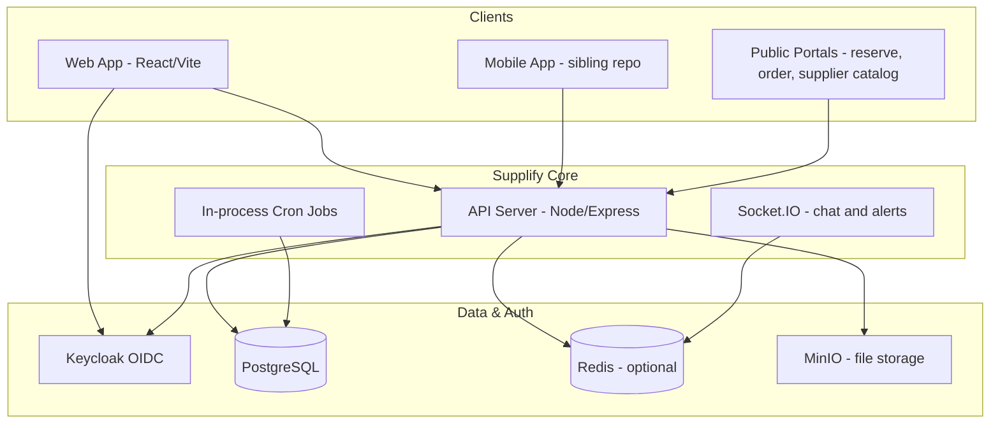

<a id="application-layout"></a>

#### Application layout

| Layer        | Location                                                            | Responsibility                                                 |
| ------------ | ------------------------------------------------------------------- | -------------------------------------------------------------- |
| **API**      | `apps/api`                                                          | 554 HTTP routes, RBAC, subscriptions, business logic, cron     |
| **Web**      | `apps/web`                                                          | 80 frontend routes (`apps/web/src/App.tsx`), React SPA         |
| **Database** | `apps/api/db/migrations`                                            | 175 SQL migrations, schema evolution since `0000`              |
| **Tests**    | `apps/api/**/*.test.js`, `apps/web/**/*.test.{ts,tsx}`, `tests/e2e` | 213 API test files, 309 web test files (per bootstrap metrics) |

<a id="technology-stack"></a>

#### Technology stack

The monorepo uses **pnpm workspaces** with a Node.js/Express API and a Vite-powered React frontend. PostgreSQL is the system of record; Redis is optional but recommended for Socket.IO fan-out and order-calendar caching in multi-replica deployments (Railway). Keycloak provides OIDC identity; MinIO (or S3-compatible storage) handles uploads for chat attachments, product images, and bulk import archives. A sibling **supplify-mobile** repository consumes the same API with parity expectations documented in `docs/mobile/MOBILE_FEATURE_PARITY.md`. Local development is orchestrated via `pnpm dev` with Docker profiles for Keycloak, Postgres, and optional full-stack nginx.

<a id="subscription-tiers"></a>

#### Subscription tiers

Four **active self-serve tiers** apply to both restaurants and suppliers (separate `subscription_plan` rows per tenant type):

| Code       | Name       | Monthly (USD) | Positioning                                                                   |
| ---------- | ---------- | ------------- | ----------------------------------------------------------------------------- |
| `free`     | Free Trial | $0            | Time-limited evaluation (default 30 days, admin 7–90); read-only after expiry |
| `silver`   | Silver     | $49           | First paid tier; single-location core                                         |
| `gold`     | Gold       | $149          | Daily operations; multi-branch, analytics, smart reorder                      |
| `platinum` | Platinum   | $349          | High limits; full feature catalog                                             |

An `enterprise` plan code exists in the database but is **inactive for self-serve** (`requires_admin_assignment`). Bronze was removed in migration `0116`; legacy `bronze` input maps to `silver`.

Feature gates and meter limits are enforced server-side via `requireFeature()` middleware and `plan-enforcement.js`, keyed from `feature-keys.js`.

<a id="domain-coverage-high-level"></a>

#### Domain coverage (high level)

| Domain                 | Restaurant | Supplier |  Admin  |    Public    |
| ---------------------- | :--------: | :------: | :-----: | :----------: |
| Auth & registration    |     ✓      |    ✓     |    ✓    |      —       |
| Catalog & pricing      |   browse   |  manage  |    —    |  mini-store  |
| Ordering & quick lists |     ✓      | fulfill  |    —    |   B2C menu   |
| Fulfillment & GPS      |   track    |    ✓     |    —    |  B2C track   |
| Receiving & disputes   |     ✓      |   view   |    —    |      —       |
| Finance & invoices     |     ✓      |    ✓     |    —    |      —       |
| Deals & promotions     |   redeem   |  manage  | approve |      —       |
| Reservations           |     ✓      |    —     |    —    | guest portal |
| Staff & labour         |     ✓      |   team   |    —    | self-service |
| Chat & notifications   |     ✓      |    ✓     |    —    |      —       |
| Growth & referrals     |  benefit   |    ✓     | config  | register ref |
| Quote requests         |     ✓      | respond  |    —    |      —       |
| Reports                |     ✓      |    ✓     | metrics |      —       |
| Subscriptions          |     ✓      |    ✓     | manage  |      —       |

---

<a id="key-platform-metrics"></a>

### Key Platform Metrics

These figures are generated from repository artifacts and should be re-verified after major releases.

| Metric                       | Value | How to verify                                      |
| ---------------------------- | ----: | -------------------------------------------------- |
| **API routes**               |   554 | `docs/audits/route-inventory.json` (`count` field) |
| **Frontend routes**          |    80 | `apps/web/src/App.tsx` route definitions           |
| **SQL migrations**           |   175 | `apps/api/db/migrations/*.sql`                     |
| **API test files**           |   213 | `apps/api/**/*.test.js`                            |
| **Web test files**           |   309 | `apps/web/**/*.test.{ts,tsx,jsx}`                  |
| **Plan tiers (active)**      |     4 | `free`, `silver`, `gold`, `platinum`               |
| **Workspace system roles**   |    16 | 7 restaurant + 9 supplier in `role-matrix.js`      |
| **Mermaid diagrams (valid)** |    50 | `scripts/check-mermaid-diagrams.mjs`               |

---

<a id="ecosystem-diagram"></a>

### Ecosystem Diagram

The following diagram shows how value flows between participants on the platform.

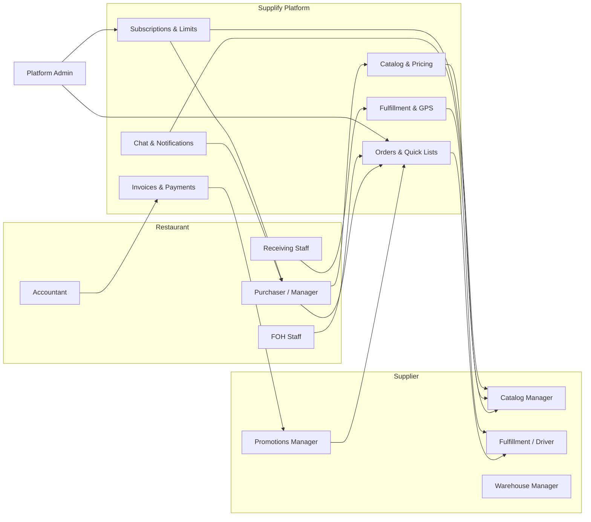

Public consumers and reservation guests connect at the edges: `/order/:slug` for B2C and `/reserve` for table booking, both backed by the same API and tenant data.

---

<a id="strategic-outcomes"></a>

### Strategic Outcomes

<a id="for-the-business"></a>

#### For the business

Supplify monetizes through **subscription tiers** aligned to operational maturity, with upgrade paths triggered by limit proximity (orders/day, chats/day, branches, products) and feature gates. Conversion events (`VIEW_PLANS`, `OPEN_UPGRADE`) are recorded for funnel analysis (`POST /api/subscriptions/conversion-event`).

The **supplier growth program** (migration `0169`) turns suppliers into acquisition channels: CSV import, connection requests, referral tokens, sponsorship, and rewards on first paid conversion.

<a id="for-operations"></a>

#### For operations

A **single PostgreSQL schema** with 175 migrations means auditability and consistent reporting across tenants. In-process cron jobs handle scheduled orders, billing, trial expiry, promotions expiry, reorder forecasts, and optional delivery rollover (disabled by default).

<a id="for-engineering"></a>

#### For engineering

RBAC is **permission-first**: route guards resolve `tenant_user_roles` → permissions, with system roles seeded from `role-matrix.js` per tenant. Admin impersonation uses a separate token path without weakening tenant isolation for normal users.

---

<a id="known-limitations-executive-summary"></a>

### Known Limitations (Executive Summary)

The following items are **implemented partially** or **disabled by default**. Full detail appears in the Complete Product Guide.

| Area                                   | Status                                                                                   |
| -------------------------------------- | ---------------------------------------------------------------------------------------- |
| Supplier Settings → Delivery Zones tab | UI exists; tab hidden (`DELIVERY_ZONES_ENABLED = false`); warehouse zone API is separate |
| Restaurant finance opening balance     | Hardcoded `0` in account statement summary (`TODO` in API)                               |
| Delivery rollover cron                 | Registered but no-op unless `DELIVERY_ROLLOVER_ENABLED=true`                             |

These are product honesty markers, not blockers for core B2B ordering flows.

---

<a id="implementation-evidence"></a>

### Implementation Evidence

| Topic                 | Primary paths                                                                                                        |
| --------------------- | -------------------------------------------------------------------------------------------------------------------- |
| Product definition    | `docs/product/overview.md`, `docs/sales/02_solution.md`, `docs/sales/03_platform_overview.md`                        |
| Route inventory       | `docs/audits/route-inventory.json`                                                                                   |
| Bootstrap metrics     | `docs/onboarding/_artifacts/bootstrap-metrics.md`                                                                    |
| Frontend routing      | `apps/web/src/App.tsx`                                                                                               |
| RBAC & roles          | `apps/api/src/lib/role-matrix.js`, `apps/api/src/lib/tenant-roles.js`, `docs/architecture/rbac-permission-matrix.md` |
| Subscriptions & tiers | `docs/product/tier-matrix.md`, `docs/product/plans.md`, `apps/api/db/migrations/0116`–`0120`                         |
| Auth & registration   | `apps/api/src/lib/rbac.js`, `docs/features/tenant-registration.md`                                                   |
| Feature catalog       | `docs/product/features.md`, `docs/product/feature-catalog-technical.md`                                              |
| Cron jobs             | `docs/operations/cron-jobs.md`, `apps/api/src/lib/register-cron-jobs.js`                                             |
| Demo readiness audit  | `docs/audits/SUPPLIFY_DEMO_READINESS_AUDIT.md`                                                                       |

---

<a id="next-steps-for-readers"></a>

### Next Steps for Readers

- **Business stakeholders:** Continue to [02-complete-product-guide.md](part-ii-complete-product-guide) for domain-by-domain behavior, order lifecycle, and tenant model.
- **Technical onboarding:** Run `pnpm setup && pnpm dev`, then use `docs/product/features.md` verification tables and `docs/qa/regression-checklist.md`.
- **Sales narrative:** See `docs/sales/` (01_problem through enterprise_checklist).

---

---

## Part II — Complete Product Guide

<a id="part-ii-complete-product-guide"></a>

**Audience:** Product managers, business analysts, implementation consultants, and engineers who need end-to-end knowledge of every Supplify domain.

**Source of truth:** Application code, migrations, route inventories, and existing product documentation in this repository.

---

<a id="introduction"></a>

### Introduction

This guide documents **all major product domains** in Supplify: what each does, who can access it, how it connects to adjacent domains, and where to find implementation evidence in the codebase. It is written for readers who will configure tenants, demo the product, or extend features — not as a marketing overview.

Supplify's data model centers on **tenants** (`RESTAURANT`, `SUPPLIER`, `ADMIN`) with per-tenant subscriptions, team members, and RBAC. B2B orders flow from restaurant cart through supplier fulfillment to receiving, invoicing, and optional disputes. Parallel tracks cover reservations (FOH), consumer B2C ordering, quote requests, growth programs, and platform administration.

---

<a id="user-types-and-roles"></a>

### User Types and Roles

<a id="platform-roles-keycloak-appuserrole"></a>

#### Platform roles (Keycloak → `app_user.role`)

| Role           | Set by                                        | Workspace access                        |
| -------------- | --------------------------------------------- | --------------------------------------- |
| `PENDING`      | First login before org setup                  | `/register/complete` only               |
| `RESTAURANT`   | Registration or Keycloak `restaurant` role    | Restaurant sidebar and APIs             |
| `SUPPLIER`     | Registration or Keycloak `supplier` role      | Supplier sidebar and APIs               |
| `ADMIN`        | Keycloak `admin` role or seeded admin emails  | `/app/admin` control plane              |
| `STAFF_PORTAL` | Keycloak `staff_portal` / `staff_portal_user` | `/staff/login`, `/staff/dashboard` only |

Resolution logic lives in `apps/api/src/lib/rbac.js` (`upsertUser`). Platform roles take precedence over staff portal for dual-role Keycloak users.

<a id="restaurant-workspace-system-roles-role-matrixjs"></a>

#### Restaurant workspace system roles (`role-matrix.js`)

| #   | Role                   | Purpose                                                                         |
| --- | ---------------------- | ------------------------------------------------------------------------------- |
| 1   | **Owner**              | Full access; immutable main admin                                               |
| 2   | **Restaurant Manager** | Daily ops: orders, receiving, catalog view, reservations; no billing/team admin |
| 3   | **Purchaser**          | Browse catalog, create and track orders, chat                                   |
| 4   | **Receiving Staff**    | Receive deliveries, open receiving disputes; cannot create orders               |
| 5   | **Accountant**         | Invoices, payments, subscriptions view                                          |
| 6   | **Viewer**             | Read-only across workspace views                                                |
| 7   | **FOH Staff**          | Reservations create/edit/view only                                              |

<a id="supplier-workspace-system-roles-role-matrixjs"></a>

#### Supplier workspace system roles (`role-matrix.js`)

| #   | Role                        | Purpose                                                                             |
| --- | --------------------------- | ----------------------------------------------------------------------------------- |
| 8   | **Owner**                   | Full supplier access                                                                |
| 9   | **Supplier Manager**        | Orders (accept/decline/fulfill), catalog, fulfillment, growth view, customer import |
| 10  | **Warehouse Manager**       | Warehouses, fulfillment board, delivery ops                                         |
| 11  | **Order Fulfillment Staff** | Fulfillment and delivery board; no billing or catalog import                        |
| 12  | **Driver**                  | Assigned deliveries only (`DRIVER_DELIVERIES_VIEW`, `DRIVER_DELIVERIES_MANAGE`)     |
| 13  | **Catalog Manager**         | Products, catalog, pricing, import                                                  |
| 14  | **Promotions Manager**      | Deals, promotions, reorder intelligence                                             |
| 15  | **Accountant**              | Finance and receivables only                                                        |
| 16  | **Viewer**                  | Read-only supplier workspace                                                        |

<a id="additional-personas-17"></a>

#### Additional personas (17+)

| #   | Persona                      | Notes                                                     |
| --- | ---------------------------- | --------------------------------------------------------- |
| 17  | **Platform admin** (`ADMIN`) | Separate from tenant Owner; uses admin dashboard          |
| 18  | **Staff portal user**        | Labour self-service; provisioned from restaurant Team tab |
| 19  | **Reservation guest**        | Unauthenticated public booking                            |
| 20  | **Consumer (B2C)**           | Guest or light account on `/order/:restaurantSlug`        |

Custom tenant roles can be created with subsets of permissions; system role names are protected (`RESERVED_SYSTEM_ROLE_NAMES` in `tenant-roles.js`).

**Implementation evidence:** `apps/api/src/lib/role-matrix.js`, `apps/api/src/lib/permission-keys.js`, `docs/architecture/rbac-permission-matrix.md`, `apps/web/src/components/Sidebar.tsx`, `apps/web/src/components/RequirePermission.tsx`.

---

<a id="tenant-model"></a>

### Tenant Model

Each commercial organization is a **tenant** with type `RESTAURANT` or `SUPPLIER`. Users belong to tenants through `tenant_user` membership and hold one or more `tenant_user_roles`.

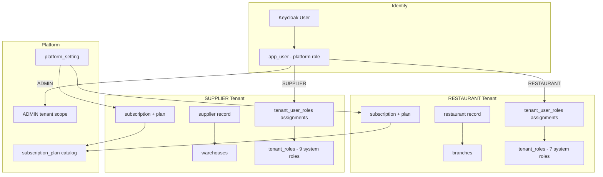

**Registration flow:** `POST /api/register/complete` creates tenant, org, default system roles, supplier catalog/warehouse (supplier path), and subscription with `lock_reason = pending_activation`. Activation clears lock via Free checkout or paid billing (`docs/features/tenant-registration.md`).

**Multi-branch:** Restaurants use `branch` records; suppliers use org branches (`/app/org`) and warehouses. Plan feature `multi_branch` gates expansion.

**Implementation evidence:** `apps/api/src/routes/register.routes.js`, `apps/api/src/lib/billing/`, `apps/api/db/migrations/0041_rbac_tenant_roles.sql`, `apps/web/src/pages/RegisterCompletePage.tsx`, `apps/web/src/pages/AccountActivationPage.tsx`.

---

<a id="authentication-and-session-management"></a>

### Authentication and Session Management

<a id="login"></a>

#### Login

- **OIDC authorization code flow** via Keycloak (`/login`, `/auth/login`).
- Session cookies are HTTP-only; API validates JWT on each request.
- Expired sessions redirect to `/login?expired=true`.

<a id="guards"></a>

#### Guards

- `AuthGuard` (web) blocks unauthenticated access to `/app/*`.
- `requireAuth`, `requireRole`, `requirePermission` (API) enforce server-side access.
- `billingAccess` middleware blocks writes when subscription is locked (pending activation, Free Trial expired, suspended).

<a id="invitations"></a>

#### Invitations

- Team invites: `/invite` → `POST` acceptance APIs.
- Branch invites: `/invite/branch`.
- Restaurant invitations from suppliers: migration `0087_restaurant_invitations.sql`.

<a id="legal-compliance"></a>

#### Legal compliance

- `legal_acceptances` (migration `0129`); `/legal/reaccept` for policy updates.

**Implementation evidence:** `apps/api/src/routes/auth.routes.js`, `apps/web/src/components/AuthGuard.tsx`, `apps/web/src/lib/authRedirect.ts`, `apps/api/src/middlewares/billingAccess.js`, `tests/e2e/suites/critical_e2e/auth.spec.ts`.

---

<a id="supplier-and-restaurant-onboarding"></a>

### Supplier and Restaurant Onboarding

<a id="supplier-onboarding"></a>

#### Supplier onboarding

After activation, suppliers configure:

- **Profile & business** — `SupplierSettingsPage` tabs: profile, business, notifications, plan, team, drivers, branches, warehouses, activity.
- **Catalog seed** — Created at registration; products added via Products page, CSV bulk upload, or ZIP image import.
- **Warehouse** — Default warehouse created at registration; additional warehouses plan-gated (`warehouses` feature).
- **Fulfillment** — Enable driver management, fulfillment board (`/app/fulfillment`), command center (`/app/command-center`) on eligible plans.

<a id="restaurant-onboarding"></a>

#### Restaurant onboarding

- **Wizard** — `/app/onboarding` → `restaurant-onboarding` API for setup steps.
- **Supplier linking** — Browse `/app/suppliers`, follow/connect, block list support.
- **Branch setup** — Settings and branch invitations for multi-location (Gold+).
- **Push notifications** — Optional PWA opt-in during onboarding.

**Implementation evidence:** `apps/api/src/routes/restaurant-onboarding.routes.js`, `apps/web/src/pages/RestaurantOnboardingPage.tsx`, `apps/web/src/pages/SupplierSettingsPage.tsx`, `apps/api/scripts/seed-demo-users.js`.

---

<a id="catalog-products-and-pricing"></a>

### Catalog, Products, and Pricing

<a id="supplier-catalog-management"></a>

#### Supplier catalog management

| Capability        | Web                                  | API                                    |
| ----------------- | ------------------------------------ | -------------------------------------- |
| Product CRUD      | `/app/products`, `/app/products/:id` | `/api/products`                        |
| Bulk CSV upload   | Products page                        | `/api/products/import`                 |
| Image ZIP import  | ProductImageImportDialog             | `/api/products/import-images`          |
| Contract pricing  | `/app/contract-pricing`              | `/api/prices`, contract pricing routes |
| Public mini-store | Settings catalog link card           | `GET /api/public/suppliers/:idOrSlug`  |

Restaurants see supplier catalogs through authenticated product APIs with **server-side price resolution** (`resolveProductPricesBatch`). Contract prices override list prices per restaurant relationship.

<a id="restaurant-pricing-views"></a>

#### Restaurant pricing views

- **My contract prices** — `/app/my-prices` for negotiated rates.
- **Restaurant internal pricing** — `/api/restaurant-pricing` for cost/menu pricing (separate from supplier catalog).

<a id="warehouses-and-inventory-supplier"></a>

#### Warehouses and inventory (supplier)

- **Warehouses tab** — Full CRUD wired to `/api/warehouses`.
- **Per-warehouse zones** — `GET/POST /api/warehouses/:id/zones` for warehouse-scoped delivery zones (distinct from Settings Delivery Zones tab).
- **Stock levels** — `/app/inventory` → `/api/inventory`.

> **Partial feature — Supplier Settings Delivery Zones:** The Delivery Zones and Contacts tabs in Supplier Settings are **UI-only**. `DELIVERY_ZONES_ENABLED` and `CONTACTS_TAB_ENABLED` are `false` in `supplierSettingsShared.tsx`. Warehouse zone APIs exist separately; the settings tab was never wired. See `docs/audits/SUPPLIFY_DEMO_READINESS_AUDIT.md`.

**Implementation evidence:** `apps/api/src/routes/products.routes.js`, `apps/api/src/routes/warehouses.routes.js`, `apps/api/src/services/public-supplier-catalog.service.js`, `apps/web/src/pages/PublicSupplierCatalogPage.tsx`, `apps/web/src/components/supplier/settings/supplierSettingsShared.tsx`.

---

<a id="ordering-lifecycle"></a>

### Ordering Lifecycle

<a id="cart-and-placement"></a>

#### Cart and placement

1. Restaurant adds items to cart (`/app/cart`) from supplier catalogs.
2. Checkout validates plan limits (orders/day), supplier connection, and minimums.
3. Order created with status `PLACED` (or `DRAFT` if saved).
4. Notifications fan out to supplier team via `notifyTenantUsers`.

<a id="status-workflow"></a>

#### Status workflow

PostgreSQL enum `order_status` (evolved across migrations `0021`, `0028`, `0069`, `0110`):

| Status                   | Meaning                                                                            |
| ------------------------ | ---------------------------------------------------------------------------------- |
| `DRAFT`                  | Saved, not submitted                                                               |
| `PLACED`                 | Submitted by restaurant                                                            |
| `PENDING_APPROVAL`       | Awaiting internal approval (legacy path; `approvals_budgets` feature removed)      |
| `ACKNOWLEDGED`           | Supplier accepted                                                                  |
| `PROCESSING`             | Being picked/packed                                                                |
| `SHIPPED` / `IN_TRANSIT` | Out for delivery                                                                   |
| `DELIVERED`              | Supplier marked delivered                                                          |
| `RECEIVED_PARTIAL`       | Restaurant received partial shipment                                               |
| `RECEIVED_FULL`          | Restaurant received complete shipment                                              |
| `RECEIVED_WITH_DISPUTE`  | Received but dispute open                                                          |
| `INVOICED`               | Invoice generated                                                                  |
| `COMPLETED`              | Terminal success                                                                   |
| `CANCELLED`              | Cancelled or **declined** (`cancelled_by = SUPPLIER` shows "Declined by supplier") |

<a id="adjacent-ordering-features"></a>

#### Adjacent ordering features

| Feature              | Description                                                                  |
| -------------------- | ---------------------------------------------------------------------------- |
| **Quick lists**      | Saved templates; scheduled re-order via cron (`scheduled-orders.service.js`) |
| **Order calendar**   | Redis-backed delivery calendar (`/api/orders/calendar`)                      |
| **Order amendments** | Post-place line changes; plan `order_amendments`                             |
| **Supplier decline** | Required `decline_reason`; migration `0108` cancellation metadata            |
| **Smart reorder**    | Forecast job `reorder-forecast.job.js`; plan `smart_reorder`                 |

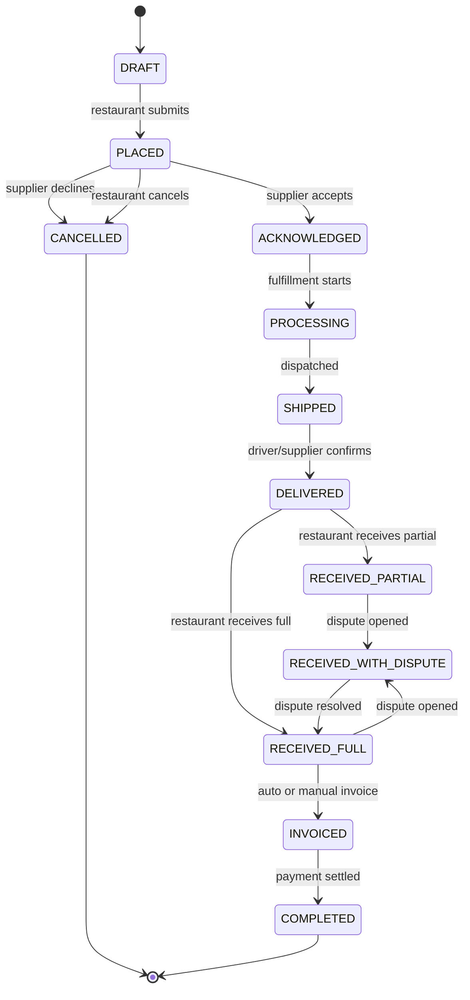

**Implementation evidence:** `apps/api/db/migrations/0021_update_order_status_enum.sql`, `apps/api/src/routes/orders.routes.js`, `apps/web/src/lib/orderStatusDisplay.ts`, `apps/api/src/lib/order-statuses.js`, `docs/features/order-decline.md`, `tests/e2e/suites/critical_e2e/orders.spec.ts`.

---

<a id="fulfillment-drivers-and-gps"></a>

### Fulfillment, Drivers, and GPS

<a id="supplier-fulfillment-board"></a>

#### Supplier fulfillment board

- **Route:** `/app/fulfillment`
- **APIs:** `/api/fulfillment/*`, assignment rollover endpoint, route planning (migration `0127`)
- **Features:** Assign drivers, plan routes, update assignment status, proof of delivery

<a id="driver-experience"></a>

#### Driver experience

- **Route:** `/app/driver-deliveries` (Driver role)
- **Permissions:** `DRIVER_DELIVERIES_VIEW`, `DRIVER_DELIVERIES_MANAGE` only
- **GPS:** Driver location pings; restaurant tracking panel on order detail (`RestaurantOrderTrackingPanel`)

<a id="delivery-rollover"></a>

#### Delivery rollover

Incomplete deliveries can roll to the next calendar day based on supplier timezone cutoff. The cron job is **registered but disabled by default**:

- `DELIVERY_ROLLOVER_ENABLED` defaults to `false` (`apps/api/src/config/env.js`, `register-cron-jobs.test.js`)
- Manual run: `node apps/api/scripts/run-delivery-rollover.mjs --force`
- Per-assignment API: `POST /api/fulfillment/assignments/:id/rollover-to-tomorrow`

> **Partial feature — Delivery rollover cron:** Operational only when env `DELIVERY_ROLLOVER_ENABLED=true`. Otherwise the hourly tick is a no-op. See `docs/operations/cron-jobs.md`.

**Implementation evidence:** `apps/api/src/routes/fulfillment/routes.js`, `apps/api/src/services/delivery-rollover.service.js`, `apps/web/src/pages/FulfillmentPage.tsx`, `apps/web/src/pages/DriverDeliveriesPage.tsx`, `docs/features/drivers-and-gps-tracking.md`.

---

<a id="receiving-and-quality"></a>

### Receiving and Quality

Restaurants record goods-in against orders at `/app/receiving`:

- Match delivered lines to ordered quantities
- Photo capture when plan includes `receiving_quality`
- Status transitions to `RECEIVED_PARTIAL` or `RECEIVED_FULL`
- Opens path to invoicing and inventory updates

Receiving staff role can manage receiving without order creation rights.

**Implementation evidence:** `apps/api/src/routes/receiving.routes.js`, `apps/web/src/pages/ReceivingPage.tsx`, `tests/api/receiving-delivered.spec.ts`.

---

<a id="disputes-and-returns"></a>

### Disputes and Returns

Disputes bridge receiving and finance:

- Open from received orders; sets status `RECEIVED_WITH_DISPUTE` (migration `0110`)
- Tracks resolution types: replacement orders, credit notes
- Plan feature `disputes_returns` gates access
- Free tier includes limited supplier free disputes (migration `0109`)

**Web:** `/app/disputes`, `/app/disputes/:id`  
**API:** `/api/disputes`

**Implementation evidence:** `apps/api/src/services/disputes.service.js`, `apps/api/db/migrations/0072_disputes.sql`, `apps/web/src/pages/disputes/`.

---

<a id="inventory"></a>

### Inventory

<a id="restaurant-inventory"></a>

#### Restaurant inventory

- **Route:** `/app/restaurant-inventory`
- **Capabilities:** On-hand tracking, par levels, expiry reminders, waste analytics tab (`waste_tracking` plan feature)
- **API:** `/api/restaurant-inventory`

<a id="supplier-inventory"></a>

#### Supplier inventory

- **Route:** `/app/inventory`
- **Capabilities:** Stock per warehouse, reservations against orders
- **API:** `/api/inventory`

Multi-branch restaurant inventory requires `multi_branch` + `inventory_management` on appropriate tiers.

**Implementation evidence:** `apps/api/db/migrations/0004_restaurant_inventory.sql`, `apps/api/db/migrations/0014_restaurant_inventory_enhancements.sql`, `docs/features/waste-tracking.md`.

---

<a id="finance-invoices-and-payments"></a>

### Finance, Invoices, and Payments

<a id="invoice-lifecycle"></a>

#### Invoice lifecycle

`DRAFT → ISSUED → PARTIALLY_PAID → PAID → VOID` with auto-invoicing from delivered orders, tax handling, and credit notes for disputes/returns.

<a id="restaurant-and-supplier-views"></a>

#### Restaurant and supplier views

- **Shared UI:** `/app/invoices`
- **APIs:** `/api/invoices`, `/api/payments`, `/api/restaurant-finance`

<a id="account-statements"></a>

#### Account statements

Restaurant finance APIs provide per-supplier statement views with aging analysis.

> **Partial feature — Restaurant finance opening balance:** The account statement summary sets `openingBalance: 0` with an explicit `TODO: Calculate from previous period` in `restaurant-finance.routes.js`. Charges, payments, and closing balance within the selected period are calculated; opening balance is not rolled from prior periods.

**Implementation evidence:** `docs/product/finance-implementation.md`, `apps/api/src/routes/invoices.routes.js`, `apps/api/src/routes/restaurant-finance.routes.js` (line ~795), `apps/api/src/jobs/invoice-overdue.job.js`.

---

<a id="deals-promotions-and-loyalty"></a>

### Deals, Promotions, and Loyalty

<a id="supplier-promotions"></a>

#### Supplier promotions

- **Route:** `/app/promotions`
- **Workflow:** Create deal → `pending_approval` → admin approves → active
- **Boosts:** Featured placement pricing (migration `0150`)
- **API:** `/api/promotions`

<a id="restaurant-deals-feed"></a>

#### Restaurant deals feed

- **Route:** `/app/deals`
- Discovery of supplier promotions; redemption limits per plan (`supplier_deals`, `supplier_deals_redeem`)

<a id="loyalty"></a>

#### Loyalty

- Restaurant loyalty programs: `/app/loyalty`
- Consumer rewards: `/order/:slug/rewards`, `/app/consumer-loyalty`
- Migration `0160_loyalty_programs.sql`

**Implementation evidence:** `apps/api/src/services/deal-promotions.service.js`, `apps/api/db/migrations/0095_deal_promotions_system.sql`, `tests/api/promotions-deals-gates.spec.ts`.

---

<a id="reservations-front-of-house"></a>

### Reservations (Front of House)

<a id="restaurant-cockpit"></a>

#### Restaurant cockpit

- **Route:** `/app/reservations`
- Floor plan, booking board, table assignment, waitlist
- Role `FOH Staff` limited to reservation permissions

<a id="public-guest-portal"></a>

#### Public guest portal

| Route                             | Purpose                   |
| --------------------------------- | ------------------------- |
| `/reserve`                        | Booking entry             |
| `/reserve/:restaurantIdOrSlug`    | Tenant-specific portal    |
| `/reserve/manage/:token`          | Guest cancel/reschedule   |
| `/reserve/waitlist/:token/accept` | Waitlist offer acceptance |

Waitlist auto-promotion is plan-gated (`waitlist_auto_promo`).

**Implementation evidence:** `apps/api/db/migrations/0033_reservations_system.sql`, `apps/api/src/routes/reservations.routes.js`, `docs/features/reservations-foh.md`.

---

<a id="staff-and-labour"></a>

### Staff and Labour

<a id="restaurant-staff-directory"></a>

#### Restaurant staff directory

- **Route:** `/app/staff`
- Roster, shifts, role assignment, staff portal account provisioning

<a id="staff-self-service-portal"></a>

#### Staff self-service portal

- **Routes:** `/staff/login`, `/staff/dashboard`
- Keycloak `STAFF_PORTAL` role; PTO and shift swaps
- Migration `0108_staff_portal_accounts.sql`
- Staff users receive **403** on main `/app` APIs

**Implementation evidence:** `apps/api/src/routes/staff.routes.js`, `apps/api/src/lib/staff-portal-auth.js`, `apps/web/src/components/StaffPortalGuard.tsx`.

---

<a id="notifications-and-realtime"></a>

### Notifications and Realtime

<a id="channels"></a>

#### Channels

| Channel  | Scope                                            |
| -------- | ------------------------------------------------ |
| In-app   | Bell + toasts; `useNotificationAlerts` in Layout |
| Email    | SMTP (Resend/Mailpit); digest job                |
| WhatsApp | Guest notifications; settings toggle             |
| Web Push | PWA; `/api/push`, service worker                 |

<a id="realtime-transport"></a>

#### Realtime transport

- **Socket.IO** on API origin; Redis adapter when `REDIS_URL` set
- Chat and notification alerts use shared socket connection

<a id="chat"></a>

#### Chat

- **Route:** `/app/chat`
- **API:** `/api/chat`
- Daily message limits by plan (`chats_per_day` meter)
- Attachments via MinIO `/api/files`

**Implementation evidence:** `docs/product/notifications-summary.md`, `apps/api/src/services/notification.service.js`, `apps/api/src/routes/chat.routes.js`, `apps/web/src/hooks/useChatRealtime.ts`.

---

<a id="admin-platform"></a>

### Admin Platform

<a id="admin-dashboard"></a>

#### Admin dashboard

- **Routes:** `/app/admin`, `/app/admin/:tab`, `/app/admin/restaurants`, `/app/admin/suppliers`
- **API:** `/api/admin-dashboard/*`

<a id="key-admin-capabilities"></a>

#### Key admin capabilities

| Capability            | API / UI                                      |
| --------------------- | --------------------------------------------- |
| Tenant management     | Admin → Restaurants / Suppliers tabs          |
| Plan changes          | Subscription admin actions                    |
| Feature toggles       | `/api/admin-dashboard/feature-flags`          |
| Limit overrides       | `/api/admin-dashboard/limit-overrides`        |
| Free Trial length     | Platform settings (7–90 days, default 30)     |
| Growth program config | `/api/admin-dashboard/growth-settings`        |
| Deal approvals        | Admin → Deals tab                             |
| Impersonation         | `/api/admin-dashboard/impersonate`            |
| Audit logs            | `/api/admin-dashboard/audit-logs`             |
| Health                | `/api/admin-dashboard/health` (cron failures) |

Admin RBAC uses `ADMIN` tenant scope with `SUPER_ADMIN` role when `ALLOW_AUTO_SUPER_ADMIN` is enabled.

**Implementation evidence:** `docs/sales/06_admin_and_operations.md`, `apps/api/src/routes/admin-dashboard/`, `tests/api/admin-rbac.spec.ts`, `tests/api/admin-impersonation.spec.ts`.

---

<a id="subscriptions-billing-and-entitlements"></a>

### Subscriptions, Billing, and Entitlements

<a id="plans"></a>

#### Plans

Free Trial (`free`), Silver ($49), Gold ($149), Platinum ($349) — separate plan rows per `RESTAURANT` and `SUPPLIER` tenant type. Enterprise catalog entry exists but is admin-assignment only.

<a id="enforcement"></a>

#### Enforcement

- **Feature keys** — `apps/api/src/lib/feature-keys.js`; checked via `requireFeature()`
- **Meters** — orders/day, chats/day, branches, products, warehouses, etc.
- **Locks** — `pending_activation`, `free_sandbox_expired`, `SUSPENDED`

<a id="self-serve-flows"></a>

#### Self-serve flows

- View entitlements: `GET /api/subscriptions/current`, `GET /api/subscriptions/usage/:meterType`
- Upgrade: billing checkout, `UpgradeModal`, conversion events
- Admin override: extend trial, unlock, change plan

**Implementation evidence:** `docs/product/subscriptions.md`, `docs/product/tier-matrix.md`, `apps/api/src/routes/subscriptions.routes.js`, `apps/api/src/lib/plan-enforcement.js`, `tests/e2e/suites/critical_e2e/subscription-limits.spec.ts`.

---

<a id="consumer-b2c-ordering"></a>

### Consumer B2C Ordering

Restaurants can operate a **public storefront** for end consumers (distinct from B2B supplier ordering):

| Route                         | Purpose                |
| ----------------------------- | ---------------------- |
| `/order/:restaurantSlug`      | Storefront landing     |
| `/order/:slug/menu`           | Menu browse            |
| `/order/:slug/checkout`       | Guest checkout         |
| `/order/:slug/track`          | Order tracking         |
| `/order/:slug/receipt/:token` | Receipt                |
| `/order/:slug/account`        | Light consumer account |
| `/order/:slug/rewards`        | Loyalty rewards        |

<a id="restaurant-admin-for-b2c"></a>

#### Restaurant admin for B2C

- **Menu admin:** `/app/consumer-menu` → categories, items, modifiers
- **Consumer orders:** `/app/consumer-orders`
- **Fulfillment config:** Per-branch delivery/takeaway/dine-in; delivery zones on branches (API-backed, used at checkout via `deliveryZones.ts`)

Migrations `0161_consumer_ordering.sql`, `0163_consumer_b2c_complete.sql`, `0164_consumer_ordering_hours.sql`.

**Implementation evidence:** `apps/api/src/routes/consumer/`, `apps/api/src/services/consumer-order.service.js`, `apps/web/src/pages/consumer/`, `apps/web/src/lib/deliveryZones.ts`.

---

<a id="supplier-growth-program"></a>

### Supplier Growth Program

Suppliers acquire restaurants through:

- **CSV import** — Match existing tenants or mark import-only prospects
- **Connection requests** — Existing Supplify restaurants must accept
- **Invites** — Email, WhatsApp link, copy link for non-users
- **Sponsorship** — Pay for prospect's first month (plan limits per year)
- **Referral tokens** — `/register?ref=` → 30-day trial + first-paid discount

**Route:** `/app/customer-growth` (requires `GROWTH_VIEW`; import needs `CUSTOMERS_IMPORT`)

**Implementation evidence:** `docs/features/supplier-customer-growth.md`, `apps/api/db/migrations/0169_supplier_growth_program.sql`, `apps/api/src/jobs/sponsorship-expiry.job.js`.

---

<a id="quote-requests-and-supplier-mini-store"></a>

### Quote Requests and Supplier Mini-Store

<a id="quote-requests-rfq"></a>

#### Quote requests (RFQ)

Restaurants send multi-supplier quote requests; suppliers respond per line item; restaurants compare and optionally add winning lines to cart (manual checkout — quoted prices are informational at order create).

| Route                              | Actor                  |
| ---------------------------------- | ---------------------- |
| `/app/quote-requests`              | Restaurant list        |
| `/app/quote-requests/new`          | Create RFQ             |
| `/app/quote-requests/:id`          | Compare responses      |
| `/app/quote-requests/supplier`     | Supplier inbox         |
| `/app/quote-requests/supplier/:id` | Supplier response form |

**API:** `/api/quote-requests/*`  
**Notifications:** `quote_request_received`, `quote_response_received`

<a id="public-mini-store"></a>

#### Public mini-store

- **Route:** `/supplier/:idOrSlug` (no prices for anonymous; priced endpoint for authenticated restaurants)
- **Toggle:** `supplier.public_catalog_enabled` in settings

**Implementation evidence:** `docs/product/QUOTE_REQUESTS_AND_SUPPLIER_MINISTORE.md`, `apps/api/db/migrations/0153_quote_requests_and_public_catalog.sql`, `apps/api/src/services/quote-requests.service.js`.

---

<a id="reports-and-analytics"></a>

### Reports and Analytics

- **Route:** `/app/reports`
- **API:** `/api/reports`
- **Plan gate:** `reports` (basic KPIs on Silver; advanced on Gold/Platinum)
- Restaurant: spend charts, usage dashboards
- Supplier: revenue, order analytics, promotion performance

Indexes added in migration `0071_reports_analytics_indexes.sql`.

**Implementation evidence:** `apps/api/src/routes/reports.routes.js`, `apps/web/src/pages/reports/ReportsPage.tsx`.

---

<a id="partial-and-disabled-features-summary"></a>

### Partial and Disabled Features — Summary

| Feature                            | State                           | Evidence                                                                                                      |
| ---------------------------------- | ------------------------------- | ------------------------------------------------------------------------------------------------------------- |
| Supplier Settings → Delivery Zones | UI tab hidden; not wired to API | `DELIVERY_ZONES_ENABLED = false` in `supplierSettingsShared.tsx`; audit in `SUPPLIFY_DEMO_READINESS_AUDIT.md` |
| Supplier Settings → Contacts       | Same as above                   | `CONTACTS_TAB_ENABLED = false`                                                                                |
| Restaurant finance opening balance | Hardcoded `0`                   | `restaurant-finance.routes.js` ~line 795                                                                      |
| Delivery rollover cron             | Disabled unless env flag        | `DELIVERY_ROLLOVER_ENABLED` default `false`; `docs/operations/cron-jobs.md`                                   |
| Quote price at checkout            | Informational only              | `QUOTE_REQUESTS_AND_SUPPLIER_MINISTORE.md` §5                                                                 |
| Approvals & budgets                | Removed                         | Migration `0114`; feature key removed                                                                         |

Warehouse-level delivery zones (`/api/warehouses/:id/zones`) and consumer B2C branch delivery zones **are** API-backed — only the Supplier Settings aggregate tab remains unwired.

---

<a id="cron-and-background-jobs"></a>

### Cron and Background Jobs

All jobs run in-process in the API server (`registerCronJobs`). Notable jobs:

| Job                       | Interval             | Notes                     |
| ------------------------- | -------------------- | ------------------------- |
| Scheduled quick lists     | 5 min dev / 1 h prod | Places scheduled orders   |
| Subscription billing      | 1 h                  | Charges and renewals      |
| Free sandbox expiry       | 1 h                  | Locks expired trials      |
| Reorder forecast          | 24 h                 | Smart reorder dirty queue |
| Delivery rollover         | 1 h                  | **No-op unless enabled**  |
| Growth sponsorship expiry | 1 h                  | Referral infrastructure   |

Disable all: `CRONS_ENABLED=false`.

**Implementation evidence:** `docs/operations/cron-jobs.md`, `apps/api/src/lib/register-cron-jobs.js`, `apps/api/scripts/jobs-registry.mjs`.

---

<a id="verification-and-testing"></a>

### Verification and Testing

| Layer             | Command / location                              |
| ----------------- | ----------------------------------------------- |
| API unit tests    | `pnpm --filter @supplify/api test:run`          |
| Web unit tests    | `pnpm --filter @supplify/web test:run`          |
| E2E Playwright    | `pnpm e2e:playwright`                           |
| Route inventory   | `docs/audits/route-inventory.json` (554 routes) |
| Manual QA         | `docs/qa/regression-checklist.md`               |
| RBAC matrix tests | `apps/api/src/lib/rbac-full-app.test.js`        |

---

<a id="master-implementation-evidence-index"></a>

### Master Implementation Evidence Index

| Domain          | Primary paths                                                                                            |
| --------------- | -------------------------------------------------------------------------------------------------------- |
| Auth            | `apps/api/src/lib/rbac.js`, `apps/api/src/routes/auth.routes.js`, `docs/features/tenant-registration.md` |
| Roles           | `apps/api/src/lib/role-matrix.js`, `docs/architecture/rbac-permission-matrix.md`                         |
| Catalog         | `apps/api/src/routes/products.routes.js`, `apps/web/src/pages/ProductsPage.tsx`                          |
| Ordering        | `apps/api/src/routes/orders.routes.js`, `apps/web/src/pages/OrdersPage.tsx`                              |
| Fulfillment     | `apps/api/src/routes/fulfillment/`, `apps/api/src/services/delivery-rollover.service.js`                 |
| Receiving       | `apps/api/src/routes/receiving.routes.js`                                                                |
| Disputes        | `apps/api/src/services/disputes.service.js`                                                              |
| Inventory       | `apps/api/src/routes/restaurant-inventory.routes.js`, `apps/api/src/routes/inventory.routes.js`          |
| Finance         | `apps/api/src/routes/invoices.routes.js`, `apps/api/src/routes/restaurant-finance.routes.js`             |
| Deals           | `apps/api/src/services/deal-promotions.service.js`                                                       |
| Reservations    | `apps/api/src/routes/reservations.routes.js`, `apps/api/src/routes/public.routes.js`                     |
| Staff           | `apps/api/src/routes/staff.routes.js`, `apps/api/src/lib/staff-portal-auth.js`                           |
| Notifications   | `apps/api/src/services/notification.service.js`                                                          |
| Admin           | `apps/api/src/routes/admin-dashboard/`                                                                   |
| Subscriptions   | `apps/api/src/routes/subscriptions.routes.js`, `docs/product/tier-matrix.md`                             |
| Consumer B2C    | `apps/api/src/routes/consumer/`, `apps/api/db/migrations/0161_consumer_ordering.sql`                     |
| Growth          | `apps/api/db/migrations/0169_supplier_growth_program.sql`                                                |
| Quote requests  | `apps/api/src/services/quote-requests.service.js`                                                        |
| Chat            | `apps/api/src/routes/chat.routes.js`                                                                     |
| Reports         | `apps/api/src/routes/reports.routes.js`                                                                  |
| Feature catalog | `docs/product/features.md`, `docs/product/feature-catalog-full.md`                                       |
| Frontend routes | `apps/web/src/App.tsx` (80 routes)                                                                       |
| Migrations      | `apps/api/db/migrations/` (175 files)                                                                    |

---

---

## Part III — Supplier Onboarding Guide

<a id="part-iii-supplier-onboarding-guide"></a>

End-to-end onboarding for a **supplier** tenant: from first login through catalog, fulfillment, billing, and day-two operations. Routes and APIs match `apps/web/src/App.tsx` and the live API surface as of the current codebase.

**Primary persona:** Supplier owner or ops manager with `Org Owner` / `SETTINGS_MANAGE` permissions unless noted.

---

<a id="step-1-create-your-supplify-login-keycloak"></a>

### Step 1 — Create your Supplify login (Keycloak)

| Field                    | Detail                                                                                                                          |
| ------------------------ | ------------------------------------------------------------------------------------------------------------------------------- |
| **Goal**                 | Obtain a Supplify identity before any tenant exists.                                                                            |
| **Who**                  | Future supplier owner (no tenant yet).                                                                                          |
| **Navigation path**      | `/login` → **Register** (redirects to `/auth/register` → Keycloak hosted registration).                                         |
| **Required data**        | Email, password, name (Keycloak fields).                                                                                        |
| **Expected result**      | Keycloak account exists; first app login creates `app_user` with `role: PENDING`.                                               |
| **Possible errors**      | Duplicate email in Keycloak; email verification required (realm policy); network/CORS to auth server.                           |
| **Validation checklist** | [ ] Can open `/login` without console errors. [ ] Register completes in Keycloak. [ ] First login redirects away from `/login`. |

**API:** OAuth/session via Keycloak; app session established through normal auth middleware. `GET /api/auth/me` returns `role: "PENDING"` until registration completes.

---

<a id="step-2-complete-supplier-organization-setup"></a>

### Step 2 — Complete supplier organization setup

| Field                    | Detail                                                                                                                                                                                                                                                             |
| ------------------------ | ------------------------------------------------------------------------------------------------------------------------------------------------------------------------------------------------------------------------------------------------------------------ |
| **Goal**                 | Create supplier tenant, organization, default catalog, warehouse scaffold, and subscription row.                                                                                                                                                                   |
| **Who**                  | Authenticated user with `PENDING` role.                                                                                                                                                                                                                            |
| **Navigation path**      | Auto-redirect to `/register/complete` (also enforced by `AuthGuard` when `needsSetup === true`).                                                                                                                                                                   |
| **Required data**        | Account type **Supplier**, business name (required), phone (optional), legal acceptance checkboxes. Optional `referralToken` from `/register?ref=…`.                                                                                                               |
| **Expected result**      | `POST /api/register/complete` with `accountType: "SUPPLIER"` creates `supplier`, `supplier_organizations`, default `catalog`, system roles, and `subscription` with `lock_reason = pending_activation`. User role becomes `SUPPLIER`. Redirect to `/app/activate`. |
| **Possible errors**      | `409` — email already linked to a tenant; `409` — user already has workspace membership; validation on empty business name.                                                                                                                                        |
| **Validation checklist** | [ ] `GET /api/register/status` → `{ needsSetup: false }` after complete. [ ] `GET /api/auth/me` → `role: "SUPPLIER"`, tenant id present. [ ] `/app/activate` loads (other `/app/*` routes blocked until unlocked).                                                 |

**API:** `GET /api/register/status`, `POST /api/register/complete` (`accountType`, `businessName`, `phone?`, `referralToken?`, legal payload).

---

<a id="step-3-activate-your-workspace-billing"></a>

### Step 3 — Activate your workspace (billing)

| Field                    | Detail                                                                                                                                                                  |
| ------------------------ | ----------------------------------------------------------------------------------------------------------------------------------------------------------------------- |
| **Goal**                 | Clear `pending_activation` so write APIs and full navigation unlock.                                                                                                    |
| **Who**                  | Supplier owner on new tenant.                                                                                                                                           |
| **Navigation path**      | `/app/activate`                                                                                                                                                         |
| **Required data**        | **Activate free plan** (no card) or paid plan via upgrade modal (`POST /api/billing/checkout` with `planId`; stub card `4242424242424242` when `BILLING_GATEWAY=stub`). |
| **Expected result**      | `account_locked_at` cleared; `GET /api/billing/status` → `access.pendingActivation: false`, `access.isLocked: false`. Redirect to `/app` (supplier home).               |
| **Possible errors**      | `402` on writes while still locked; checkout validation for paid tiers; plan catalog empty if migrations/seeds not run.                                                 |
| **Validation checklist** | [ ] Free activation succeeds without payment method. [ ] Sidebar appears with supplier sections. [ ] `POST` to catalog/orders no longer returns activation lock.        |

**API:** `GET /api/billing/status`, `POST /api/billing/checkout`, `GET /api/subscriptions/entitlements`.

---

<a id="step-4-configure-supplier-profile-branding"></a>

### Step 4 — Configure supplier profile & branding

| Field                    | Detail                                                                                                                                    |
| ------------------------ | ----------------------------------------------------------------------------------------------------------------------------------------- |
| **Goal**                 | Publish trustworthy business identity for restaurants and public mini-store.                                                              |
| **Who**                  | User with `SETTINGS_VIEW` / `SETTINGS_MANAGE`.                                                                                            |
| **Navigation path**      | Sidebar **Settings** → `/app/settings` (renders `SupplierSettingsPage`) or deep link `/app/supplier-settings?tab=profile`                 |
| **Required data**        | Legal name, logo, contact email/phone, address, VAT/tax IDs, public slug (used at `/supplier/:idOrSlug`).                                 |
| **Expected result**      | `GET /api/suppliers/me` reflects updates; `PATCH /api/suppliers/:id` persists profile fields; public catalog page shows branding.         |
| **Possible errors**      | Duplicate slug; permission denied without `SETTINGS_MANAGE`; image upload failures (storage config).                                      |
| **Validation checklist** | [ ] Profile tab saves without error. [ ] `/supplier/{slug}` loads publicly. [ ] Logo and name visible on supplier detail for restaurants. |

**API:** `GET /api/suppliers/me`, `PATCH /api/suppliers/:id`.

---

<a id="step-5-business-policies-hours-and-terms"></a>

### Step 5 — Business policies, hours, and terms

| Field                    | Detail                                                                                                             |
| ------------------------ | ------------------------------------------------------------------------------------------------------------------ |
| **Goal**                 | Set MOQ, payment terms, return policy, business hours, blackout dates restaurants see at order time.               |
| **Who**                  | Supplier settings manager.                                                                                         |
| **Navigation path**      | `/app/settings` → **Business** tab (`?tab=business`)                                                               |
| **Required data**        | Minimum order amount, payment terms text, business hours JSON, holiday/blackout dates (optional).                  |
| **Expected result**      | Business rules stored on `supplier` row; enforced or displayed in catalog/checkout flows per product docs.         |
| **Possible errors**      | Invalid JSON for hours; numeric validation on MOQ.                                                                 |
| **Validation checklist** | [ ] Business tab persists after refresh. [ ] MOQ visible on supplier profile or order validation where applicable. |

**API:** `PATCH /api/suppliers/:id` (business fields from onboarding migration `0005_supplier_onboarding.sql`).

---

<a id="step-6-warehouses-fulfillment-mode"></a>

### Step 6 — Warehouses & fulfillment mode

| Field                    | Detail                                                                                                                                          |
| ------------------------ | ----------------------------------------------------------------------------------------------------------------------------------------------- |
| **Goal**                 | Define ship-from locations and fulfillment behavior (required before inventory-backed dispatch on higher tiers).                                |
| **Who**                  | User with `WAREHOUSES_VIEW` / warehouse manage permissions.                                                                                     |
| **Navigation path**      | `/app/settings` → **Warehouses** tab (`?tab=warehouses`)                                                                                        |
| **Required data**        | Warehouse name, address, active flag; fulfillment toggles via `PATCH /api/suppliers/me/fulfillment`.                                            |
| **Expected result**      | At least one active warehouse; fulfillment settings align with plan entitlements (`fulfillment` feature).                                       |
| **Possible errors**      | Plan limit on warehouse count; feature gated on Free tier.                                                                                      |
| **Validation checklist** | [ ] Default warehouse exists post-registration. [ ] Can add/edit warehouse on entitled plan. [ ] Fulfillment page respects warehouse selection. |

**API:** Warehouse CRUD under `/api/suppliers/me/warehouses`; `PATCH /api/suppliers/me/fulfillment`.

---

<a id="step-7-team-members-roles-and-invitations"></a>

### Step 7 — Team members, roles, and invitations

| Field                    | Detail                                                                                                                                                      |
| ------------------------ | ----------------------------------------------------------------------------------------------------------------------------------------------------------- |
| **Goal**                 | Delegate catalog, orders, fulfillment, or driver access without sharing owner credentials.                                                                  |
| **Who**                  | Owner or user with staff/team permissions.                                                                                                                  |
| **Navigation path**      | `/app/settings` → **Team & roles** (`?tab=team`)                                                                                                            |
| **Required data**        | Invitee email, role (system or custom), optional name.                                                                                                      |
| **Expected result**      | Invite email sent; invitee accepts at `/invite?token=…&type=…` → `POST /api/invites/accept`; user bound to org workspace.                                   |
| **Possible errors**      | Seat/role limits on plan; email mismatch on invite accept; expired token.                                                                                   |
| **Validation checklist** | [ ] Invite link opens `/invite`. [ ] New member sees sidebar scoped to permissions. [ ] Driver role only sees **My Deliveries** (`/app/driver-deliveries`). |

**API:** Invite validate/accept routes; org role assignment via tenant RBAC.

---

<a id="step-8-register-drivers-gold-drivermanagement"></a>

### Step 8 — Register drivers (Gold+ / `driver_management`)

| Field                    | Detail                                                                                                                                                             |
| ------------------------ | ------------------------------------------------------------------------------------------------------------------------------------------------------------------ |
| **Goal**                 | Create driver records linked to users for last-mile delivery.                                                                                                      |
| **Who**                  | Supplier with `driver_management` entitlement and settings access.                                                                                                 |
| **Navigation path**      | `/app/settings` → **Drivers** tab (`?tab=drivers`)                                                                                                                 |
| **Required data**        | Driver name, phone, linked user account (invite or existing user).                                                                                                 |
| **Expected result**      | Driver appears in fulfillment dispatch board assignee list; linked user gets `DRIVER_DELIVERIES_VIEW`.                                                             |
| **Possible errors**      | Feature not on plan (Silver has fulfillment but not `driver_management`); user already linked to another driver; `403` from `requireFeature('driver_management')`. |
| **Validation checklist** | [ ] Driver list loads on Gold+. [ ] Assign driver action visible on `/app/fulfillment`. [ ] Driver can log in and open `/app/driver-deliveries`.                   |

**API:** Driver CRUD under supplier settings / fulfillment APIs.

---

<a id="step-9-build-and-publish-product-catalog"></a>

### Step 9 — Build and publish product catalog

| Field                    | Detail                                                                                                                   |
| ------------------------ | ------------------------------------------------------------------------------------------------------------------------ |
| **Goal**                 | List SKUs restaurants can browse, price, and order.                                                                      |
| **Who**                  | User with `CATALOG_VIEW` / `CATALOG_EDIT`.                                                                               |
| **Navigation path**      | Sidebar **Products** → `/app/products`; detail → `/app/products/:id`                                                     |
| **Required data**        | Product name, SKU, unit, price, category, status (`ACTIVE`), images, stock/availability as applicable.                   |
| **Expected result**      | `GET /api/products` lists tenant products; restaurants with relationship see items in `/app/products` (restaurant view). |
| **Possible errors**      | Plan SKU limits; validation on duplicate SKU; inactive catalog.                                                          |
| **Validation checklist** | [ ] Create product succeeds. [ ] Product visible to test restaurant account. [ ] Edit from detail page persists.         |

**API:** `GET /api/products`, `POST /api/products`, `PATCH /api/products/:id`, `GET /api/products/:id`.

---

<a id="step-10-contract-pricing-for-key-accounts"></a>

### Step 10 — Contract pricing for key accounts

| Field                    | Detail                                                                                                                    |
| ------------------------ | ------------------------------------------------------------------------------------------------------------------------- |
| **Goal**                 | Offer negotiated prices per restaurant without changing list price globally.                                              |
| **Who**                  | Catalog/pricing manager.                                                                                                  |
| **Navigation path**      | Sidebar **Contract Pricing** → `/app/contract-pricing`                                                                    |
| **Required data**        | Restaurant target, product or category, contract price, effective dates.                                                  |
| **Expected result**      | Restaurant sees overrides on **My Prices** (`/app/my-prices` on their side); order lines use contract price when matched. |
| **Possible errors**      | Restaurant not linked; overlapping contract windows.                                                                      |
| **Validation checklist** | [ ] Contract row saved. [ ] Restaurant **My Prices** shows entry. [ ] Test order reflects contract line price.            |

**API:** Contract pricing endpoints under `/api/contract-pricing` (see feature catalog).

---

<a id="step-11-promotions-and-supplier-deals"></a>

### Step 11 — Promotions and supplier deals

| Field                    | Detail                                                                                                      |
| ------------------------ | ----------------------------------------------------------------------------------------------------------- |
| **Goal**                 | Run time-boxed promotions visible in marketplace and restaurant **Deals** tab.                              |
| **Who**                  | User with `PROMOTIONS_VIEW` / `PROMOTIONS_MANAGE` on entitled plan.                                         |
| **Navigation path**      | Sidebar **Deals** → `/app/promotions`                                                                       |
| **Required data**        | Deal type, discount, eligibility, schedule, optional payment for featured placement.                        |
| **Expected result**      | Active promotion on `GET /api/suppliers` (`has_store_deal`); restaurants browse `/app/deals`.               |
| **Possible errors**      | Promotion limit per plan; admin approval required for some deal types.                                      |
| **Validation checklist** | [ ] Promotion activates within schedule. [ ] Badge on supplier list. [ ] Discount applies at cart/checkout. |

**API:** `/api/promotions/*` supplier routes.

---

<a id="step-12-customer-growth-restaurant-acquisition"></a>

### Step 12 — Customer growth & restaurant acquisition

| Field                    | Detail                                                                                                                                                    |
| ------------------------ | --------------------------------------------------------------------------------------------------------------------------------------------------------- |
| **Goal**                 | Invite restaurants via referral links and track conversion.                                                                                               |
| **Who**                  | User with `GROWTH_VIEW` (plan + permission).                                                                                                              |
| **Navigation path**      | Sidebar **Customer Growth** → `/app/customer-growth`                                                                                                      |
| **Required data**        | Referral link (`/register?ref=…`); optional growth campaign metadata.                                                                                     |
| **Expected result**      | Restaurant signup with `referralToken` records attribution, auto-follow, and trial/discount eligibility per `supplier-customer-growth` docs.              |
| **Possible errors**      | Growth feature disabled on plan; invalid referral token.                                                                                                  |
| **Validation checklist** | [ ] Referral URL copies from UI. [ ] Test restaurant registration attributes referral. [ ] Restaurant appears under **Restaurants** (`/app/restaurants`). |

**API:** `POST /api/register/complete` with `referralToken`; growth analytics on supplier growth page.

---

<a id="step-13-acknowledge-and-process-restaurant-orders"></a>

### Step 13 — Acknowledge and process restaurant orders

| Field                    | Detail                                                                                                                                                          |
| ------------------------ | --------------------------------------------------------------------------------------------------------------------------------------------------------------- |
| **Goal**                 | Move orders from placed → acknowledged → processing → shipped.                                                                                                  |
| **Who**                  | User with `ORDERS_VIEW` / `ORDERS_MANAGE`.                                                                                                                      |
| **Navigation path**      | Sidebar **Orders** → `/app/orders`; detail → `/app/orders/:id`                                                                                                  |
| **Required data**        | Order id; status transitions; line adjustments if supported.                                                                                                    |
| **Expected result**      | Order timeline updates; restaurant sees mirrored status; notifications fire per preferences.                                                                    |
| **Possible errors**      | Invalid status transition; billing lock (`402`) on expired trial.                                                                                               |
| **Validation checklist** | [ ] Pending badge on sidebar decrements when orders handled. [ ] Status change reflected on restaurant `/app/orders/:id`. [ ] Chat thread available if enabled. |

**API:** `GET /api/orders`, `GET /api/orders/:id`, `PATCH /api/orders/:id` (status updates).

---

<a id="step-14-fulfillment-dispatch-board"></a>

### Step 14 — Fulfillment dispatch board

| Field                    | Detail                                                                                                                                     |
| ------------------------ | ------------------------------------------------------------------------------------------------------------------------------------------ |
| **Goal**                 | Assign drivers, pick/pack/ship, and track delivery lifecycle (Silver+ `fulfillment`).                                                      |
| **Who**                  | User with `FULFILLMENT_VIEW` / `FULFILLMENT_MANAGE`.                                                                                       |
| **Navigation path**      | Sidebar **Fulfillment** → `/app/fulfillment` (tabs: Dispatch, Routes, Delivery Tracking, Exceptions)                                       |
| **Required data**        | Warehouse context, driver assignment, delivery status per order.                                                                           |
| **Expected result**      | Board shows Unassigned → Assigned → Picked up → Out for delivery → Delivered/Failed; `PATCH /api/orders/:id/delivery-status` is canonical. |
| **Possible errors**      | Feature off on Free; no driver on Silver (manual ship only); assignment to unlinked driver.                                                |
| **Validation checklist** | [ ] Dispatch tab loads on Silver+. [ ] Assign driver updates card. [ ] Delivery tracking drawer shows GPS when enabled.                    |

**API:** `GET /api/supplier/deliveries/board`, `PATCH /api/orders/:id/delivery-status`, `POST /api/fulfillment/routes`, fulfillment route stop APIs.

---

<a id="step-15-planned-routes-and-activation"></a>

### Step 15 — Planned routes and activation

| Field                    | Detail                                                                                                                                                             |
| ------------------------ | ------------------------------------------------------------------------------------------------------------------------------------------------------------------ |
| **Goal**                 | Batch orders into routes before dispatch-ready, then activate when orders hit `PROCESSING`/`SHIPPED`.                                                              |
| **Who**                  | Fulfillment manager.                                                                                                                                               |
| **Navigation path**      | `/app/fulfillment` → **Routes** tab; dispatch board **Assign to planned route**                                                                                    |
| **Required data**        | Driver, order selection, route date; activation on ready stops.                                                                                                    |
| **Expected result**      | `delivery_route.status` moves `PLANNED` → `IN_PROGRESS`; eligible stops sync to live dispatch; GPS begins when assignments reach `picked_up` / `out_for_delivery`. |
| **Possible errors**      | Order on two active routes; cancelled order auto-removed; activate with zero ready stops (route still may start per docs).                                         |
| **Validation checklist** | [ ] Planned route badge on dispatch cards. [ ] Activate ready orders promotes stops. [ ] Restaurant map hidden until dispatch starts (privacy).                    |

**API:** `POST /api/fulfillment/routes`, `POST /api/fulfillment/routes/:id/stops`, `PATCH /api/fulfillment/routes/:id` `{ status: "IN_PROGRESS" }`.

---

<a id="step-16-invoices-and-revenue-visibility"></a>

### Step 16 — Invoices and revenue visibility

| Field                    | Detail                                                                                                                 |
| ------------------------ | ---------------------------------------------------------------------------------------------------------------------- |
| **Goal**                 | Issue and track invoices where `finance_invoices` entitlement is enabled.                                              |
| **Who**                  | User with `INVOICES_VIEW`.                                                                                             |
| **Navigation path**      | Sidebar **Invoices** → `/app/invoices`                                                                                 |
| **Required data**        | Linked orders, invoice lines, tax fields per jurisdiction setup.                                                       |
| **Expected result**      | Invoice list and PDF/export per implementation; restaurant sees matching invoice.                                      |
| **Possible errors**      | Feature not on plan; order not in invoiceable state.                                                                   |
| **Validation checklist** | [ ] Invoice generates from delivered order. [ ] Restaurant `/app/invoices` shows record. [ ] Totals match order lines. |

**API:** `/api/invoices/*` (tenant-scoped).

---

<a id="step-17-command-center-dashboard-and-reports"></a>

### Step 17 — Command center, dashboard, and reports

| Field                    | Detail                                                                                                                                               |
| ------------------------ | ---------------------------------------------------------------------------------------------------------------------------------------------------- |
| **Goal**                 | Monitor ops KPIs, GPS summary, and analytics exports.                                                                                                |
| **Who**                  | Owner/analyst with analytics permissions.                                                                                                            |
| **Navigation path**      | **Command Center** → `/app/command-center`; **Dashboard** → `/app/dashboard`; **Reports** → `/app/reports` (plan-gated)                              |
| **Required data**        | Date filters, report type selection.                                                                                                                 |
| **Expected result**      | `GET /api/admin/dashboard` returns supplier-scoped stats when impersonating; command center shows GPS today summary; reports export when entitled.   |
| **Possible errors**      | `reports` feature off; empty data on new tenant.                                                                                                     |
| **Validation checklist** | [ ] Home `/` or `/app` loads supplier home. [ ] Command center shows fulfillment/GPS widgets on Gold+. [ ] Reports page accessible on entitled plan. |

**API:** `GET /api/admin/dashboard` (supplier tenant context), reports endpoints under `/api/reports`.

---

<a id="step-18-disputes-and-delivery-exceptions"></a>

### Step 18 — Disputes and delivery exceptions

| Field                    | Detail                                                                                                             |
| ------------------------ | ------------------------------------------------------------------------------------------------------------------ |
| **Goal**                 | Resolve quantity/quality issues and failed deliveries with audit trail.                                            |
| **Who**                  | User with fulfillment/dispute permissions.                                                                         |
| **Navigation path**      | Sidebar **Disputes** → `/app/disputes`; detail → `/app/disputes/:id`                                               |
| **Required data**        | Dispute reason, evidence, resolution notes.                                                                        |
| **Expected result**      | Dispute state machine progresses; linked order/receiving records updated per workflow.                             |
| **Possible errors**      | Feature `disputes_returns` disabled; permission denied.                                                            |
| **Validation checklist** | [ ] Create/respond to dispute from list. [ ] Detail page shows order link. [ ] Sidebar badge clears when resolved. |

**API:** `/api/disputes/*`.

---

<a id="step-19-public-mini-store-and-quote-inbox"></a>

### Step 19 — Public mini-store and quote inbox

| Field                    | Detail                                                                                                                                  |
| ------------------------ | --------------------------------------------------------------------------------------------------------------------------------------- |
| **Goal**                 | Let prospects browse catalog publicly; respond to restaurant RFQs.                                                                      |
| **Who**                  | Sales/catalog staff.                                                                                                                    |
| **Navigation path**      | Public `/supplier/:idOrSlug`; **Quote inbox** → `/app/quote-requests/supplier` → `/app/quote-requests/supplier/:quoteRequestSupplierId` |
| **Required data**        | Published products; quote line pricing, lead times, notes.                                                                              |
| **Expected result**      | Guest/restaurant browsing without login (optional auth); quote responses visible to restaurant on `/app/quote-requests/:id`.            |
| **Possible errors**      | Unpublished catalog; quote deadline passed.                                                                                             |
| **Validation checklist** | [ ] Public URL works logged out. [ ] Quote appears in inbox. [ ] Response visible to restaurant.                                        |

**API:** `GET /api/suppliers/:id`, quote request supplier endpoints.

---

<a id="step-20-reporting-health-checks-and-troubleshooting"></a>

### Step 20 — Reporting, health checks, and troubleshooting

| Field                    | Detail                                                                                                                                                                                                                                                                |
| ------------------------ | --------------------------------------------------------------------------------------------------------------------------------------------------------------------------------------------------------------------------------------------------------------------- |
| **Goal**                 | Diagnose common production issues without platform admin access.                                                                                                                                                                                                      |
| **Who**                  | Supplier owner or support lead.                                                                                                                                                                                                                                       |
| **Navigation path**      | `/app/settings` → **Plan & usage** (`?tab=plan`); **Activity** tab if `tenant_audit_log` enabled; `/app/chat` for support threads                                                                                                                                     |
| **Required data**        | Symptom description, order id, driver id, timestamp, browser/device for driver GPS issues.                                                                                                                                                                            |
| **Expected result**      | Entitlements explain missing nav items; billing status explains `402` writes; audit shows recent settings changes.                                                                                                                                                    |
| **Possible errors**      | Trial expired (read-only GET allowed, writes `402`); GPS env disabled (`VITE_GPS_TRACKING_ENABLED=false`); plan limit exceeded.                                                                                                                                       |
| **Validation checklist** | [ ] `GET /api/billing/status` matches UI lock state. [ ] `GET /api/subscriptions/entitlements` explains missing **Fulfillment** nav. [ ] Driver GPS: location permission + `POST /api/orders/:id/location` succeeds. [ ] Escalate to admin with tenant id + order id. |

<a id="quick-troubleshooting-reference"></a>

#### Quick troubleshooting reference

| Symptom                        | Likely cause            | Check                                                |
| ------------------------------ | ----------------------- | ---------------------------------------------------- |
| Stuck on `/register/complete`  | `needsSetup` true       | `GET /api/register/status`                           |
| All writes fail `402`          | Trial expired or locked | `GET /api/billing/status`                            |
| No Fulfillment nav             | Plan or feature flag    | Entitlements `fulfillment`                           |
| No driver assign               | `driver_management` off | Upgrade to Gold+                                     |
| GPS stale on map               | Driver permission / env | `GPS_STALE_AFTER_SECONDS`, driver browser            |
| Restaurant cannot see tracking | Dispatch not started    | Assignment must be `picked_up` or `out_for_delivery` |

**Support escalation payload:** tenant id (supplier uuid), `subscription_id`, affected `orderId`, screenshot of `/app/fulfillment` or driver portal, and `requestId` from failed API response.

---

## Part IV — Restaurant Onboarding Guide

<a id="part-iv-restaurant-onboarding-guide"></a>

End-to-end onboarding for a **restaurant** tenant: registration, profile, procurement, receiving, and ongoing operations. Routes and APIs are sourced from `apps/web/src/App.tsx` and live API handlers.

**Primary persona:** Restaurant owner or purchasing manager unless noted.

---

<a id="step-1-create-login-and-restaurant-tenant"></a>

### Step 1 — Create login and restaurant tenant

| Field                    | Detail                                                                                                                                             |
| ------------------------ | -------------------------------------------------------------------------------------------------------------------------------------------------- |
| **Goal**                 | Register identity and provision restaurant organization.                                                                                           |
| **Who**                  | New restaurant owner (`PENDING` → `RESTAURANT`).                                                                                                   |
| **Navigation path**      | `/login` → Register (`/auth/register`) → `/register/complete`                                                                                      |
| **Required data**        | Account type **Restaurant**, business name, phone (optional), legal acceptance. Optional `referralToken` from supplier invite (`/register?ref=…`). |
| **Expected result**      | `POST /api/register/complete` with `accountType: "RESTAURANT"` creates `restaurant`, org, roles, pending subscription; redirect `/app/activate`.   |
| **Possible errors**      | Duplicate tenant email; user already in workspace; validation errors on business name.                                                             |
| **Validation checklist** | [ ] `GET /api/auth/me` → `role: "RESTAURANT"`. [ ] `/register/complete` not shown again after success. [ ] Activation gate appears.                |

**API:** `GET /api/register/status`, `POST /api/register/complete`.

---

<a id="step-2-activate-subscription-free-or-paid"></a>

### Step 2 — Activate subscription (free or paid)

| Field                    | Detail                                                                                                   |
| ------------------------ | -------------------------------------------------------------------------------------------------------- |
| **Goal**                 | Unlock ordering, inventory, and settings writes.                                                         |
| **Who**                  | Restaurant owner.                                                                                        |
| **Navigation path**      | `/app/activate`                                                                                          |
| **Required data**        | Free activation (`POST /api/billing/checkout` without card) or paid checkout (stub: `4242424242424242`). |
| **Expected result**      | `pending_activation` cleared; full sidebar available per entitlements.                                   |
| **Possible errors**      | Billing middleware blocks routes until unlocked; checkout failure.                                       |
| **Validation checklist** | [ ] Navigate to `/app/orders` without redirect to activate. [ ] `GET /api/billing/status` → not locked.  |

**API:** `GET /api/billing/status`, `POST /api/billing/checkout`, `GET /api/subscriptions/entitlements`.

---

<a id="step-3-complete-restaurant-profile-settings-hub"></a>

### Step 3 — Complete restaurant profile (Settings hub)

| Field                    | Detail                                                                                                                  |
| ------------------------ | ----------------------------------------------------------------------------------------------------------------------- |
| **Goal**                 | Set legal identity, branding, and operational metadata suppliers see.                                                   |
| **Who**                  | Owner or `SETTINGS_MANAGE`.                                                                                             |
| **Navigation path**      | Sidebar **Settings** → `/app/settings` (restaurant renders `RestaurantOnboardingPage`) or `/app/onboarding?tab=profile` |
| **Required data**        | Restaurant name, logo, contact email/phone, business type, address.                                                     |
| **Expected result**      | `GET /api/restaurants/me` returns updated profile; suppliers see name on orders.                                        |
| **Possible errors**      | Permission denied; invalid phone/email format.                                                                          |
| **Validation checklist** | [ ] Profile tab saves. [ ] Summary KPIs on settings header populate after orders exist. [ ] Refresh retains values.     |

**API:** `GET /api/restaurants/me`, `PATCH /api/restaurants/me`.

---

<a id="step-4-delivery-location-coordinates-gps-eta"></a>

### Step 4 — Delivery location coordinates (GPS / ETA)

| Field                    | Detail                                                                                                                                                                                              |
| ------------------------ | --------------------------------------------------------------------------------------------------------------------------------------------------------------------------------------------------- |
| **Goal**                 | Enable accurate delivery ETA and map destination for supplier drivers (supplier sees pin; restaurant map is driver-only for privacy).                                                               |
| **Who**                  | Owner or branch manager.                                                                                                                                                                            |
| **Navigation path**      | `/app/onboarding?tab=profile` → **Delivery location** section (or branch settings)                                                                                                                  |
| **Required data**        | Latitude, longitude, label, notes; per-branch via branch detail.                                                                                                                                    |
| **Expected result**      | `PATCH /api/restaurants/me/delivery-location` or `PATCH /api/restaurants/branches/:branchId/delivery-location` stored; tracking shows `destinationCoordinatesAvailable` and ETA when driver active. |
| **Possible errors**      | Invalid coordinates; branch permission denied.                                                                                                                                                      |
| **Validation checklist** | [ ] Coordinates saved on main tenant. [ ] Active delivery shows ETA on order detail tracking panel. [ ] Text address alone does not substitute (coords required).                                   |

**API:** `GET/PATCH /api/restaurants/me/delivery-location`, branch variant on `branches/:branchId`.

---

<a id="step-5-invite-team-and-assign-roles"></a>

### Step 5 — Invite team and assign roles

| Field                    | Detail                                                                                                                               |
| ------------------------ | ------------------------------------------------------------------------------------------------------------------------------------ |
| **Goal**                 | Add purchasers, receivers, FOH staff with least-privilege roles.                                                                     |
| **Who**                  | Owner (`SETTINGS_MANAGE` / team permissions).                                                                                        |
| **Navigation path**      | `/app/onboarding?tab=team`                                                                                                           |
| **Required data**        | Email, role (e.g. receiver, ordering, admin), optional name.                                                                         |
| **Expected result**      | Invite link `/invite?token=…&type=rm` (restaurant member) or branch invite `/invite/branch`; accept binds workspace.                 |
| **Possible errors**      | Email mismatch on accept; `advanced_roles` plan gate; seat limits.                                                                   |
| **Validation checklist** | [ ] Invitee completes `/invite` flow. [ ] Sidebar matches role (e.g. receiver sees **Receiving**). [ ] Owner can revoke/adjust role. |

**API:** Invite validate `GET`, accept `POST /api/invites/accept`.

---

<a id="step-6-branches-and-operational-locations"></a>

### Step 6 — Branches and operational locations

| Field                    | Detail                                                                                                               |
| ------------------------ | -------------------------------------------------------------------------------------------------------------------- |
| **Goal**                 | Model multi-site restaurants with branch-scoped orders and inventory.                                                |
| **Who**                  | Owner or org admin.                                                                                                  |
| **Navigation path**      | `/app/onboarding?tab=branches`; branch detail → `/app/org/branches/:supplierId` (org overview `/app/org`)            |
| **Required data**        | Branch name, code, address, delivery location per branch.                                                            |
| **Expected result**      | Orders and quick lists can scope to branch; branch switcher in header when entitled.                                 |
| **Possible errors**      | Plan branch limit (e.g. Silver: 1 branch); slug conflicts.                                                           |
| **Validation checklist** | [ ] Branch appears in list. [ ] Branch invite flow works (`/invite/branch`). [ ] Orders attribute to correct branch. |

**API:** Restaurant branch CRUD under `/api/restaurants/branches/*`.

---

<a id="step-7-discover-and-follow-suppliers"></a>

### Step 7 — Discover and follow suppliers

| Field                    | Detail                                                                                                                             |
| ------------------------ | ---------------------------------------------------------------------------------------------------------------------------------- |
| **Goal**                 | Build a supplier portfolio for catalog browsing and ordering.                                                                      |
| **Who**                  | User with `CATALOG_VIEW`.                                                                                                          |
| **Navigation path**      | Sidebar **Suppliers** → `/app/suppliers`; detail → `/app/suppliers/:id`; public mini-store `/supplier/:idOrSlug`                   |
| **Required data**        | None to browse; follow action to add relationship.                                                                                 |
| **Expected result**      | `GET /api/suppliers` lists marketplace; follow creates `restaurant_supplier_follow`; `is_followed` true on detail.                 |
| **Possible errors**      | `suppliers_per_restaurant` plan limit on follow; catalog empty until supplier publishes.                                           |
| **Validation checklist** | [ ] Supplier list loads with ratings/deal badges. [ ] Follow toggles state. [ ] Followed supplier products appear in **Products**. |

**API:** `GET /api/suppliers`, `GET /api/suppliers/:id`, follow endpoints on supplier relationships router.

---

<a id="step-8-browse-catalog-contract-prices-and-deals"></a>

### Step 8 — Browse catalog, contract prices, and deals

| Field                    | Detail                                                                                                                                                            |
| ------------------------ | ----------------------------------------------------------------------------------------------------------------------------------------------------------------- |
| **Goal**                 | Find SKUs at list or negotiated prices before ordering.                                                                                                           |
| **Who**                  | Purchaser (`CATALOG_VIEW`, `ORDERS_CREATE`).                                                                                                                      |
| **Navigation path**      | **Products** → `/app/products`; **My Prices** → `/app/my-prices`; **Deals** → `/app/deals`                                                                        |
| **Required data**        | Product filters; supplier relationship for contracted SKUs.                                                                                                       |
| **Expected result**      | Contract prices override list where configured; active deals apply at cart.                                                                                       |
| **Possible errors**      | No supplier follow — empty catalog; SKU limit on plan.                                                                                                            |
| **Validation checklist** | [ ] Product detail `/app/products/:id` shows correct unit price. [ ] **My Prices** lists contract rows. [ ] Deal badge visible on supplier with `has_store_deal`. |

**API:** `GET /api/products`, contract pricing read APIs, `/api/promotions` restaurant-facing routes.

---

<a id="step-9-ordering-lists-quick-lists-and-scheduled-reorders"></a>

### Step 9 — Ordering lists (quick lists) and scheduled reorders

| Field                    | Detail                                                                                                                            |
| ------------------------ | --------------------------------------------------------------------------------------------------------------------------------- |
| **Goal**                 | Save par lists and recurring order templates (`quick_lists` entitlement).                                                         |
| **Who**                  | Purchaser.                                                                                                                        |
| **Navigation path**      | **Ordering Lists** → `/app/quick-lists`                                                                                           |
| **Required data**        | List name, lines (product, qty), optional schedule/branch scope.                                                                  |
| **Expected result**      | One-click add to cart from list; scheduled orders notify per preferences.                                                         |
| **Possible errors**      | Feature off on plan; product unavailable from supplier.                                                                           |
| **Validation checklist** | [ ] List creates and opens. [ ] Add all to cart populates `/app/cart`. [ ] Scheduled notification preference enabled in settings. |

**API:** Quick list endpoints under restaurant ordering module.

---

<a id="step-10-cart-checkout-and-place-orders"></a>

### Step 10 — Cart checkout and place orders

| Field                    | Detail                                                                                                                                                      |
| ------------------------ | ----------------------------------------------------------------------------------------------------------------------------------------------------------- |
| **Goal**                 | Submit purchase orders to suppliers.                                                                                                                        |
| **Who**                  | User with `ORDERS_CREATE`.                                                                                                                                  |
| **Navigation path**      | **Cart** → `/app/cart` → submit; confirmation in **Orders**                                                                                                 |
| **Required data**        | Cart lines, delivery branch, requested date, PO notes; supplier MOQ met.                                                                                    |
| **Expected result**      | `POST` order creation → `customer_order` `PLACED`; supplier sees `/app/orders`; notifications sent.                                                         |
| **Possible errors**      | Below supplier MOQ; `402` billing lock; daily order limit on plan; out-of-stock SKU.                                                                        |
| **Validation checklist** | [ ] Order appears in `/app/orders` with pending badge. [ ] Supplier acknowledges order. [ ] Order detail `/app/orders/:id` shows lines and status timeline. |

**API:** Cart and `POST /api/orders` (or checkout flow used by `CartPage`).

---

<a id="step-11-quote-requests-rfq"></a>

### Step 11 — Quote requests (RFQ)

| Field                    | Detail                                                                                                          |
| ------------------------ | --------------------------------------------------------------------------------------------------------------- |
| **Goal**                 | Request custom pricing when catalog price is insufficient.                                                      |
| **Who**                  | Purchaser.                                                                                                      |
| **Navigation path**      | **Quote requests** → `/app/quote-requests`; new → `/app/quote-requests/new`; detail → `/app/quote-requests/:id` |
| **Required data**        | Supplier(s), line items, quantities, needed-by date, notes.                                                     |
| **Expected result**      | Suppliers respond via quote inbox; restaurant compares offers on detail page.                                   |
| **Possible errors**      | Supplier not accepting quotes; validation on empty lines.                                                       |
| **Validation checklist** | [ ] RFQ creates with status visible. [ ] Supplier response appears. [ ] Convert to order if workflow supported. |

**API:** Quote request CRUD under `/api/quote-requests`.

---

<a id="step-12-track-orders-and-live-delivery"></a>

### Step 12 — Track orders and live delivery

| Field                    | Detail                                                                                                                                                                                        |
| ------------------------ | --------------------------------------------------------------------------------------------------------------------------------------------------------------------------------------------- |
| **Goal**                 | Monitor fulfillment and see driver location during active delivery (privacy-safe).                                                                                                            |
| **Who**                  | User with `ORDERS_VIEW`.                                                                                                                                                                      |
| **Navigation path**      | `/app/orders/:id` → `RestaurantOrderTrackingPanel`                                                                                                                                            |
| **Required data**        | Order in shipped/dispatch states; delivery location coordinates on file.                                                                                                                      |
| **Expected result**      | `GET /api/orders/:id/tracking` returns sanitized payload — driver pin only (no destination coords on restaurant map); ETA when `picked_up` or `out_for_delivery`; 30s poll in UI.             |
| **Possible errors**      | Tracking hidden until dispatch starts; `GPS_ALLOW_RESTAURANT_LIVE_TRACKING` false; no driver GPS.                                                                                             |
| **Validation checklist** | [ ] No map before dispatch. [ ] Driver marker appears after pickup/out for delivery. [ ] Driver phone hidden by default. [ ] **Receive order** links to receiving (no auto-receive from GPS). |

**API:** `GET /api/orders/:id/tracking` (restaurant-sanitized via `restaurant-tracking-payload.js`).

---

<a id="step-13-receiving-deliveries"></a>

### Step 13 — Receiving deliveries

| Field                    | Detail                                                                                                                       |
| ------------------------ | ---------------------------------------------------------------------------------------------------------------------------- |
| **Goal**                 | Confirm quantities received and close the procurement loop (status → `COMPLETED` post-receiving).                            |
| **Who**                  | User with `RECEIVING_VIEW` / receiving manage.                                                                               |
| **Navigation path**      | **Receiving** → `/app/receiving`                                                                                             |
| **Required data**        | Order id, received quantities, variances, optional photos.                                                                   |
| **Expected result**      | Accepts orders in `DELIVERED` or `COMPLETED`; inventory updated when inventory module linked.                                |
| **Possible errors**      | Order not in receivable state; permission denied.                                                                            |
| **Validation checklist** | [ ] Delivered order appears in receiving queue. [ ] Confirm updates order status. [ ] Inventory reflects receipt if enabled. |

**API:** Receiving endpoints under `/api/receiving` (see `receiving.md` feature doc).

---

<a id="step-14-restaurant-inventory-and-expiry"></a>

### Step 14 — Restaurant inventory and expiry

| Field                    | Detail                                                                                                      |
| ------------------------ | ----------------------------------------------------------------------------------------------------------- |
| **Goal**                 | Track on-hand stock, lots, and expiry by branch.                                                            |
| **Who**                  | User with `INVENTORY_VIEW`.                                                                                 |
| **Navigation path**      | **Inventory** → `/app/restaurant-inventory`                                                                 |
| **Required data**        | SKU quantities, lot dates, branch, reorder thresholds.                                                      |
| **Expected result**      | Stock levels adjust from receiving; low-stock notifications if enabled.                                     |
| **Possible errors**      | Inventory feature plan-gated; branch scope mismatch.                                                        |
| **Validation checklist** | [ ] On-hand matches post-receiving. [ ] Expiring lots flagged. [ ] Low stock notification preference works. |

**API:** Restaurant inventory routes under `/api/restaurant-inventory` or equivalent module.

---

<a id="step-15-subscription-plan-and-notifications"></a>

### Step 15 — Subscription, plan, and notifications

| Field                    | Detail                                                                                                                           |
| ------------------------ | -------------------------------------------------------------------------------------------------------------------------------- |
| **Goal**                 | Manage billing tier and alert channels.                                                                                          |
| **Who**                  | Owner.                                                                                                                           |
| **Navigation path**      | `/app/onboarding?tab=subscription` and `?tab=notifications`; user-level prefs in `/app/settings` (account section)               |
| **Required data**        | Plan selection for upgrade; notification toggles (email, in-app, WhatsApp).                                                      |
| **Expected result**      | Plan change via checkout; `PATCH` notification preferences persist.                                                              |
| **Possible errors**      | Downgrade blocked by usage over new limits; payment failure.                                                                     |
| **Validation checklist** | [ ] Current plan shown with usage meters. [ ] Upgrade modal opens from plan tab. [ ] Order notification test fires on new order. |

**API:** `GET /api/billing/status`, `POST /api/billing/checkout`, notification preference endpoints.

---

<a id="step-16-invoices-and-spend-tracking"></a>

### Step 16 — Invoices and spend tracking

| Field                    | Detail                                                                                         |
| ------------------------ | ---------------------------------------------------------------------------------------------- |
| **Goal**                 | Reconcile supplier invoices against orders (`finance_invoices` entitlement).                   |
| **Who**                  | User with `INVOICES_VIEW`.                                                                     |
| **Navigation path**      | **Invoices** → `/app/invoices`                                                                 |
| **Required data**        | Invoice id from supplier; payment status notes.                                                |
| **Expected result**      | Invoice list with totals; settings summary shows `totalSpent` KPI.                             |
| **Possible errors**      | Feature disabled on plan; no invoices until supplier issues.                                   |
| **Validation checklist** | [ ] Invoice list loads. [ ] Totals align with order history. [ ] Export/open PDF if available. |

**API:** `GET /api/invoices`.

---

<a id="step-17-disputes-and-returns"></a>

### Step 17 — Disputes and returns

| Field                    | Detail                                                                                     |
| ------------------------ | ------------------------------------------------------------------------------------------ |
| **Goal**                 | Open disputes for short ships, damage, or quality issues (`disputes_returns` feature).     |
| **Who**                  | User with dispute permissions (`RESTAURANT_DISPUTES_ANY_OF`).                              |
| **Navigation path**      | **Disputes** → `/app/disputes`; detail → `/app/disputes/:id`                               |
| **Required data**        | Order/line reference, reason, photos/notes.                                                |
| **Expected result**      | Dispute visible to supplier on `/app/disputes`; status updates both sides.                 |
| **Possible errors**      | Feature off; order not eligible window.                                                    |
| **Validation checklist** | [ ] Create dispute from order or list. [ ] Sidebar badge updates. [ ] Resolution recorded. |

**API:** `/api/disputes/*`.

---

<a id="step-18-chat-and-supplier-collaboration"></a>

### Step 18 — Chat and supplier collaboration

| Field                    | Detail                                                                                                                              |
| ------------------------ | ----------------------------------------------------------------------------------------------------------------------------------- |
| **Goal**                 | Coordinate substitutions, delivery instructions, and account issues in-app.                                                         |
| **Who**                  | User with `CHAT_VIEW`.                                                                                                              |
| **Navigation path**      | **Chat** → `/app/chat`                                                                                                              |
| **Required data**        | Supplier thread selection; message body.                                                                                            |
| **Expected result**      | `GET /api/chat/conversations` lists B2B threads (excludes admin support threads from list per audit); real-time or polled messages. |
| **Possible errors**      | `chats_per_day` limit on Free; supplier not linked.                                                                                 |
| **Validation checklist** | [ ] Open thread with followed supplier. [ ] Message delivers both directions. [ ] Unread badge in header.                           |

**API:** `/api/chat/conversations`, message POST endpoints.

---

<a id="step-19-reports-reviews-hospitality-add-ons-and-troubleshooting"></a>

### Step 19 — Reports, reviews, hospitality add-ons, and troubleshooting

| Field                    | Detail                                                                                                                                                                                                 |
| ------------------------ | ------------------------------------------------------------------------------------------------------------------------------------------------------------------------------------------------------ |
| **Goal**                 | Use analytics and optional modules; resolve common blockers without admin help.                                                                                                                        |
| **Who**                  | Owner, GM, or IT contact.                                                                                                                                                                              |
| **Navigation path**      | **Reports** → `/app/reports` (entitled); `/app/onboarding?tab=reviews`; hospitality: `/app/reservations`, `/app/staff`, `/app/consumer-menu`, `/app/consumer-orders`, `/app/consumer-loyalty`          |
| **Required data**        | Report date range; review responses; guest-facing slug for `/order/:restaurantSlug` consumer storefront.                                                                                               |
| **Expected result**      | Reports export on entitled plans; reviews tab shows supplier ratings you can respond to; reservations and guest ordering modules work when respective permissions enabled.                             |
| **Possible errors**      | Reports feature off; reservations/staff plan gates; consumer routes need published menu.                                                                                                               |
| **Validation checklist** | [ ] Reports page loads or shows upgrade CTA. [ ] Reviews tab lists recent supplier reviews. [ ] Guest menu admin saves (`/app/consumer-menu`). [ ] Public guest order path `/order/{slug}/menu` works. |

<a id="troubleshooting-reference"></a>

#### Troubleshooting reference

| Symptom                  | Likely cause            | Action                                              |
| ------------------------ | ----------------------- | --------------------------------------------------- |
| Cannot place order `402` | Trial expired / locked  | `/app/onboarding?tab=subscription` or contact admin |
| Empty **Products**       | No supplier follows     | Follow suppliers on `/app/suppliers`                |
| No live tracking map     | Dispatch not started    | Wait for `picked_up` / `out_for_delivery`           |
| ETA missing              | No delivery coordinates | Set delivery location (Step 4)                      |
| Missing nav item         | Plan entitlement        | `GET /api/subscriptions/entitlements`               |
| Stuck at activation      | `pending_activation`    | `/app/activate` or admin unlock                     |

**Escalation:** Provide restaurant tenant id, order uuid, browser console errors, and API `requestId` from failed responses. Platform admin can impersonate via `/app/admin` → Tenants → **Impersonate**.

---

## Part V — Driver Onboarding Guide

<a id="part-v-driver-onboarding-guide"></a>

Operational guide for **supplier-linked drivers** using the web driver portal (PWA-friendly). Covers login, deliveries, routes, GPS, status updates, proof of delivery (POD), failures, privacy, and troubleshooting.

**Primary persona:** User with supplier **Driver** role (`DRIVER_DELIVERIES_VIEW` / `DRIVER_DELIVERIES_MANAGE`), linked to a `drivers` row.

**Home route:** `/app/driver-deliveries` (sidebar **My Deliveries** under DELIVERIES section — only nav item for driver role).

---

<a id="step-1-receive-credentials-and-log-in"></a>

### Step 1 — Receive credentials and log in

| Field                    | Detail                                                                                                                                                    |
| ------------------------ | --------------------------------------------------------------------------------------------------------------------------------------------------------- |
| **Goal**                 | Access Supplify with a driver-linked account.                                                                                                             |
| **Who**                  | New driver (invited by supplier admin).                                                                                                                   |
| **Navigation path**      | `/login` (or invite flow `/invite?token=…` if email invite sent)                                                                                          |
| **Required data**        | Email and password (Keycloak); accept legal terms on invite if applicable.                                                                                |
| **Expected result**      | `GET /api/auth/me` returns supplier tenant context with driver permissions; sidebar shows only **My Deliveries**.                                         |
| **Possible errors**      | User not linked to `drivers` table — fulfillment APIs return `403`; wrong role shows full supplier nav (not driver).                                      |
| **Validation checklist** | [ ] Login succeeds. [ ] Redirect to `/app/driver-deliveries` or home with driver nav only. [ ] No access to `/app/fulfillment` without extra permissions. |

**API:** Standard auth session; driver linkage verified by `requireLinkedDriver` on order/fulfillment mutations.

---

<a id="step-2-open-the-driver-deliveries-board"></a>

### Step 2 — Open the driver deliveries board

| Field                    | Detail                                                                                                                                             |
| ------------------------ | -------------------------------------------------------------------------------------------------------------------------------------------------- |
| **Goal**                 | See all assignments for today and standalone deliveries.                                                                                           |
| **Who**                  | Active driver.                                                                                                                                     |
| **Navigation path**      | Sidebar **My Deliveries** → `/app/driver-deliveries`                                                                                               |
| **Required data**        | None — board loads assigned orders from supplier dispatch.                                                                                         |
| **Expected result**      | `GET /api/supplier/deliveries/board` returns orders with `deliveryStatus`, restaurant name, delivery area, schedule; active vs completed sections. |
| **Possible errors**      | `403` if not linked driver; empty board if no assignments; feature `driver_management` off at supplier (no assignments created).                   |
| **Validation checklist** | [ ] Page loads without error. [ ] Assigned orders visible. [ ] Refresh button refetches board and route.                                           |

---

<a id="step-3-understand-delivery-statuses-and-allowed-actions"></a>

### Step 3 — Understand delivery statuses and allowed actions

| Field                    | Detail                                                                                                                                                                                                                                                                                                  |
| ------------------------ | ------------------------------------------------------------------------------------------------------------------------------------------------------------------------------------------------------------------------------------------------------------------------------------------------------- |
| **Goal**                 | Know which buttons appear for each assignment state.                                                                                                                                                                                                                                                    |
| **Who**                  | Driver.                                                                                                                                                                                                                                                                                                 |
| **Navigation path**      | `/app/driver-deliveries` — each `DriverDeliveryCard`                                                                                                                                                                                                                                                    |
| **Required data**        | Current `deliveryStatus` on assignment.                                                                                                                                                                                                                                                                 |
| **Expected result**      | Status `assigned`/`pending` → actions: **I'm on the way** (`out_for_delivery`), **Problem** (`failed`), **Reschedule** (`rescheduled`). Status `picked_up`/`out_for_delivery` → **Delivered**, **Problem**, **Reschedule**. Terminal: `delivered`, `failed`, `rescheduled` — no further driver actions. |
| **Possible errors**      | Invalid transition rejected by API with message toast.                                                                                                                                                                                                                                                  |
| **Validation checklist** | [ ] Primary action label matches status. [ ] Completed orders move to completed section or route stop marked complete.                                                                                                                                                                                  |

**API:** `PATCH /api/orders/:id/delivery-status` with body `{ status, notes?, failure_reason? }` (canonical). Assignment statuses: `assigned` → `picked_up` → `out_for_delivery` → `delivered` | `failed` | `rescheduled`.

---

<a id="step-4-update-status-im-on-the-way-and-delivered"></a>

### Step 4 — Update status: “I'm on the way” and delivered

| Field                    | Detail                                                                                                                                                                |
| ------------------------ | --------------------------------------------------------------------------------------------------------------------------------------------------------------------- |
| **Goal**                 | Progress deliveries so restaurants get notifications and live tracking when entitled.                                                                                 |
| **Who**                  | Driver on assigned order.                                                                                                                                             |
| **Navigation path**      | `/app/driver-deliveries` → card action buttons or sticky action bar for next stop                                                                                     |
| **Required data**        | Order id; optional notes in textarea per card.                                                                                                                        |
| **Expected result**      | `out_for_delivery` starts restaurant-visible tracking window; `delivered` sets `customer_order.status = DELIVERED` and triggers `notifyOrderStatusChange(DELIVERED)`. |
| **Possible errors**      | Not assigned to order; supplier does not own order; concurrent update conflict.                                                                                       |
| **Validation checklist** | [ ] Toast “Delivery status updated”. [ ] Restaurant order shows updated status. [ ] GPS tracking becomes active on `out_for_delivery` (see Step 7).                   |

**API:** `PATCH /api/orders/:id/delivery-status` via `useUpdateOrderDeliveryStatusMutation`.

---

<a id="step-5-build-a-route-from-multiple-standalone-deliveries"></a>

### Step 5 — Build a route from multiple standalone deliveries

| Field                    | Detail                                                                                                                                                                        |
| ------------------------ | ----------------------------------------------------------------------------------------------------------------------------------------------------------------------------- |
| **Goal**                 | Group 2+ active assignments into one ordered route when supplier did not plan a route.                                                                                        |
| **Who**                  | Driver with 2+ eligible standalone deliveries and no active route today.                                                                                                      |
| **Navigation path**      | `/app/driver-deliveries` — **Build my route** card (shown when `standaloneEligibleCount >= 2` and no `activeRoute`)                                                           |
| **Required data**        | Optional `{ date: "YYYY-MM-DD" }` (defaults today).                                                                                                                           |
| **Expected result**      | `POST /api/fulfillment/routes/build-from-assignments` creates `IN_PROGRESS` route `{Driver name} — Today's route`; orders move into `DriverRoutePanel`; idempotent on repeat. |
| **Possible errors**      | Fewer than 2 eligible orders; orders already on another route; API error toast “Could not build route”.                                                                       |
| **Validation checklist** | [ ] Route panel appears with ordered stops. [ ] Standalone cards for routed orders hidden from active list. [ ] Supplier sees route on `/app/fulfillment` Routes tab.         |

---

<a id="step-6-navigate-the-route-panel-stops-next-stop-reorder"></a>

### Step 6 — Navigate the route panel (stops, next stop, reorder)

| Field                    | Detail                                                                                                                                                                                                       |
| ------------------------ | ------------------------------------------------------------------------------------------------------------------------------------------------------------------------------------------------------------ |
| **Goal**                 | Follow stop sequence and adjust order manually in the field.                                                                                                                                                 |
| **Who**                  | Driver on active route (`IN_PROGRESS` or today's planned route).                                                                                                                                             |
| **Navigation path**      | `/app/driver-deliveries` → **Today's route** (`DriverRoutePanel`)                                                                                                                                            |
| **Required data**        | Active route from `GET /api/fulfillment/routes/active` (alias `GET /api/fulfillment/routes/today`).                                                                                                          |
| **Expected result**      | Next incomplete stop highlighted; **Set as next** via `PATCH /api/fulfillment/routes/:id/next-stop` `{ orderId }`; move up/down via `POST /api/fulfillment/routes/:id/stops/reorder` `{ stop_ids: uuid[] }`. |
| **Possible errors**      | Cannot reorder completed/failed stops; route not owned by driver.                                                                                                                                            |
| **Validation checklist** | [ ] Next stop badge on correct card. [ ] Reorder persists after refresh. [ ] Route stop status updates sync with order delivery status.                                                                      |

**API:** `GET /api/fulfillment/routes/active`, `PATCH .../next-stop`, `POST .../stops/reorder`, `PATCH .../routes/:routeId/stops/:stopId` for stop-level status.

---

<a id="step-7-gps-permission-and-live-location-sharing"></a>

### Step 7 — GPS permission and live location sharing

| Field                    | Detail                                                                                                                                                                                                        |
| ------------------------ | ------------------------------------------------------------------------------------------------------------------------------------------------------------------------------------------------------------- |
| **Goal**                 | Share live position during active deliveries for supplier maps and restaurant ETA.                                                                                                                            |
| **Who**                  | Driver on trackable assignment (`assigned`, `picked_up`, `out_for_delivery` per `isTrackableDeliveryStatus`).                                                                                                 |
| **Navigation path**      | `/app/driver-deliveries` — header GPS banner (`DriverDeliveriesHeader` + `useDriverLocationTracking`)                                                                                                         |
| **Required data**        | Browser location permission; `VITE_GPS_TRACKING_ENABLED` not `false`; device GPS on.                                                                                                                          |
| **Expected result**      | `navigator.geolocation.watchPosition` sends pings every `VITE_GPS_UPDATE_INTERVAL_SECONDS` (default 15s) via `POST /api/orders/:id/location` with lat/lng/accuracy; banner shows **Location active**.         |
| **Possible errors**      | Permission denied → banner **Location permission needed**; unsupported browser; server `GPS_TRACKING_ENABLED=false`; send failure → **Location not updating**.                                                |
| **Validation checklist** | [ ] Browser prompts for location on first visit. [ ] Banner green/active during delivery. [ ] Supplier **View tracking** drawer shows live/stale marker. [ ] `driver_location_ping` rows created server-side. |

**API:** `POST /api/orders/:id/location` — body: `latitude`, `longitude`, `accuracyMeters`, optional `speedMps`, `headingDegrees`, `recordedAt`.

**Client env:** `VITE_GPS_TRACKING_ENABLED`, `VITE_GPS_UPDATE_INTERVAL_SECONDS`.

---

<a id="step-8-open-maps-for-turn-by-turn-navigation"></a>

### Step 8 — Open Maps for turn-by-turn navigation

| Field                    | Detail                                                                                                     |
| ------------------------ | ---------------------------------------------------------------------------------------------------------- |
| **Goal**                 | Navigate to restaurant delivery area using external maps (Supplify does not provide turn-by-turn in-app).  |
| **Who**                  | Driver.                                                                                                    |
| **Navigation path**      | Each delivery card → **Open Maps** link                                                                    |
| **Required data**        | `deliveryArea` text or restaurant name for query string.                                                   |
| **Expected result**      | Opens `https://maps.google.com/?q={encoded destination}` in new tab; min 48px touch target for mobile.     |
| **Possible errors**      | “Delivery area not set” if supplier/restaurant omitted address text (coords still help supplier-side ETA). |
| **Validation checklist** | [ ] Link opens maps app/site. [ ] Works on mobile Safari/Chrome.                                           |

---

<a id="step-9-proof-of-delivery-pod"></a>

### Step 9 — Proof of delivery (POD)

| Field                    | Detail                                                                                                                                                                         |
| ------------------------ | ------------------------------------------------------------------------------------------------------------------------------------------------------------------------------ |
| **Goal**                 | Attach delivery evidence (photo, recipient name, GPS at delivery).                                                                                                             |
| **Who**                  | Driver or supplier fulfillment manager on assigned order.                                                                                                                      |
| **Navigation path**      | Order actions on driver card after delivery; supplier may upload on `/app/fulfillment` dispatch board (“POD on file” / “No POD”)                                               |
| **Required data**        | `file_key` (uploaded asset), optional `recipient_name`, `notes`, `latitude`/`longitude`, `driver_assignment_id`.                                                               |
| **Expected result**      | `POST /api/orders/:id/proof-of-delivery` creates `proof_of_delivery` row; `delivery_gps_lat/lng` stored when coordinates sent; `hasPod` true on board.                         |
| **Possible errors**      | Upload/storage failure; order not in delivered state for auto-assignment lookup.                                                                                               |
| **Validation checklist** | [ ] POD submits after photo upload. [ ] Supplier dispatch shows “POD on file”. [ ] Restaurant can confirm POD where receiving workflow supports it (`confirmProofOfDelivery`). |

**API:** `POST /api/orders/:id/proof-of-delivery`, `GET /api/orders/:id/proof-of-delivery`.

---

<a id="step-10-failed-delivery-and-reschedule"></a>

### Step 10 — Failed delivery and reschedule

| Field                    | Detail                                                                                                                                                                                                                       |
| ------------------------ | ---------------------------------------------------------------------------------------------------------------------------------------------------------------------------------------------------------------------------- |
| **Goal**                 | Record exceptions when delivery cannot complete.                                                                                                                                                                             |
| **Who**                  | Driver.                                                                                                                                                                                                                      |
| **Navigation path**      | `/app/driver-deliveries` → **Problem** (failed) or **Reschedule**                                                                                                                                                            |
| **Required data**        | Notes strongly recommended — used as `failure_reason` when status is `failed` (defaults to “Delivery failed” if empty).                                                                                                      |
| **Expected result**      | `failed` notifies supplier via `notifyDriverDeliveryMilestone`; order remains visible in supplier exceptions; `rescheduled` sets warning state for replanning. Route stop updated when on route via `handleRouteStopStatus`. |
| **Possible errors**      | Missing permission; cannot fail already terminal stop.                                                                                                                                                                       |
| **Validation checklist** | [ ] Failed stop shows danger badge. [ ] Supplier fulfillment exceptions list includes issue. [ ] Notes visible on order timeline.                                                                                            |

**API:** `PATCH /api/orders/:id/delivery-status` with `status: "failed"` and `failure_reason`; route stop `PATCH` with `status: "FAILED"`.

---

<a id="step-11-privacy-rules-driver-restaurant-supplier"></a>

### Step 11 — Privacy rules (driver, restaurant, supplier)

| Field                    | Detail                                                                                                                                                                                                                                                                                                                                                                                                        |
| ------------------------ | ------------------------------------------------------------------------------------------------------------------------------------------------------------------------------------------------------------------------------------------------------------------------------------------------------------------------------------------------------------------------------------------------------------- |
| **Goal**                 | Understand what each party can see about location and identity.                                                                                                                                                                                                                                                                                                                                               |
| **Who**                  | Driver (read); compliance-aware ops.                                                                                                                                                                                                                                                                                                                                                                          |
| **Navigation path**      | N/A — behavior enforced server-side                                                                                                                                                                                                                                                                                                                                                                           |
| **Required data**        | N/A                                                                                                                                                                                                                                                                                                                                                                                                           |
| **Expected result**      | **Restaurant:** live map only after `picked_up` / `out_for_delivery`; driver pin only (no destination coordinates on restaurant map); driver phone hidden unless `GPS_RESTAURANT_SHOW_DRIVER_PHONE=true`; no route stop list or ping history. **Supplier:** full tracking drawer with destination pin and GPS stale/live states. **Driver:** shares pings only for assigned active orders; no email per ping. |
| **Possible errors**      | N/A                                                                                                                                                                                                                                                                                                                                                                                                           |
| **Validation checklist** | [ ] Restaurant cannot see map before dispatch. [ ] Driver name visibility follows `GPS_RESTAURANT_SHOW_DRIVER_NAME`. [ ] Pings stop when no trackable deliveries.                                                                                                                                                                                                                                             |

**Reference:** `docs/features/drivers-and-gps-tracking.md` — Privacy section; `restaurant-tracking-payload.js`.

---

<a id="step-12-sticky-action-bar-and-mobile-ux"></a>

### Step 12 — Sticky action bar and mobile UX

| Field                    | Detail                                                                                                                     |
| ------------------------ | -------------------------------------------------------------------------------------------------------------------------- |
| **Goal**                 | Complete deliveries one-handed on phone.                                                                                   |
| **Who**                  | Driver on mobile viewport.                                                                                                 |
| **Navigation path**      | `/app/driver-deliveries` — `DriverStickyActionBar` at bottom                                                               |
| **Required data**        | Next standalone order or next route stop computed client-side.                                                             |
| **Expected result**      | Primary action for next delivery always visible; large touch targets (48px min height on buttons).                         |
| **Possible errors**      | Bar hidden when no active deliveries.                                                                                      |
| **Validation checklist** | [ ] Sticky bar shows correct next stop. [ ] Action matches card primary button. [ ] Scroll does not hide critical actions. |

---

<a id="step-13-show-completed-deliveries"></a>

### Step 13 — Show completed deliveries

| Field                    | Detail                                                                                                         |
| ------------------------ | -------------------------------------------------------------------------------------------------------------- |
| **Goal**                 | Review finished work for the day.                                                                              |
| **Who**                  | Driver.                                                                                                        |
| **Navigation path**      | `/app/driver-deliveries` → toggle **Show completed**                                                           |
| **Required data**        | None.                                                                                                          |
| **Expected result**      | Terminal orders (`delivered`, `failed`, `rescheduled`) listed; counts in header (`activeCount` / `doneCount`). |
| **Possible errors**      | None.                                                                                                          |
| **Validation checklist** | [ ] Completed section expands. [ ] Done count matches deliveries finished.                                     |

---

<a id="step-14-pwa-installation-and-home-screen-use"></a>

### Step 14 — PWA installation and home-screen use

| Field                    | Detail                                                                                                                                     |
| ------------------------ | ------------------------------------------------------------------------------------------------------------------------------------------ |
| **Goal**                 | Install Supplify as home-screen app for faster daily access.                                                                               |
| **Who**                  | Driver on supported mobile browser.                                                                                                        |
| **Navigation path**      | Browser menu → **Add to Home Screen** / **Install app** (after visiting `https://{your-host}/login` and logging in)                        |
| **Required data**        | HTTPS origin; valid service worker if configured in web build.                                                                             |
| **Expected result**      | Standalone window opens to last session; driver lands on deliveries after auth.                                                            |
| **Possible errors**      | iOS requires Safari for add-to-homescreen; third-party cookies/session may expire — re-login needed.                                       |
| **Validation checklist** | [ ] Icon on home screen launches app shell. [ ] Login session persists reasonable duration. [ ] GPS permission survives per browser rules. |

---

<a id="step-15-pwa-and-field-troubleshooting"></a>

### Step 15 — PWA and field troubleshooting

| Field                    | Detail                                                                                                                 |
| ------------------------ | ---------------------------------------------------------------------------------------------------------------------- |
| **Goal**                 | Resolve common driver-side failures without supplier IT.                                                               |
| **Who**                  | Driver or dispatcher coaching driver.                                                                                  |
| **Navigation path**      | `/app/driver-deliveries` + device settings                                                                             |
| **Required data**        | Symptom, order id, browser, OS version.                                                                                |
| **Expected result**      | Issue classified and fixed per table below.                                                                            |
| **Possible errors**      | N/A                                                                                                                    |
| **Validation checklist** | [ ] Hard refresh retried. [ ] Location permission re-granted. [ ] Supplier notified if server-side assignment missing. |

<a id="troubleshooting-matrix"></a>

#### Troubleshooting matrix

| Symptom                        | Cause                                                    | Fix                                                                 |
| ------------------------------ | -------------------------------------------------------- | ------------------------------------------------------------------- |
| Blank deliveries page          | No assignments                                           | Confirm supplier assigned you on `/app/fulfillment`                 |
| `403` on status update         | Not linked driver                                        | Supplier **Settings → Drivers** link user                           |
| GPS banner “permission needed” | Browser blocked location                                 | Site settings → Allow location; iOS: Settings → Safari → Location   |
| GPS “not updating”             | Network/API error                                        | Check mobile data; retry; verify `POST .../location` in network tab |
| Tracking stale on supplier map | Ping older than `GPS_STALE_AFTER_SECONDS` (300s default) | Keep app foreground; check interval env                             |
| Build route missing            | &lt;2 standalone deliveries                              | Wait for more assignments or use supplier-planned route             |
| Actions disabled               | `updating` in flight                                     | Wait for prior request; refresh page                                |
| Logged out unexpectedly        | Session timeout                                          | `/login` again; use PWA add-to-homescreen after login               |
| Wrong nav (full supplier menu) | User has non-driver roles                                | Use driver-only account or supplier adjusts roles                   |
| Maps opens wrong place         | Missing delivery area text                               | Use restaurant name; ask supplier to fix address                    |

<a id="escalation-to-supplier-dispatch"></a>

#### Escalation to supplier dispatch

Provide: driver name, order uuid (`formatOrderRef` on card), current status shown in UI, screenshot of GPS banner, and time of failure. Supplier verifies on `/app/fulfillment` → **View tracking** and `GET /api/orders/:id/tracking`.

**Server env (supplier ops):** `GPS_TRACKING_ENABLED`, `GPS_STALE_AFTER_SECONDS`, `GPS_MIN_ACCURACY_METERS`, `GPS_ALLOW_RESTAURANT_LIVE_TRACKING`.

---

<a id="api-quick-reference-driver"></a>

### API quick reference (driver)

| Method | Path                                             | Purpose                         |
| ------ | ------------------------------------------------ | ------------------------------- |
| GET    | `/api/supplier/deliveries/board`                 | Driver delivery list            |
| GET    | `/api/fulfillment/routes/active`                 | Today's route + stops           |
| POST   | `/api/fulfillment/routes/build-from-assignments` | Build route from assignments    |
| PATCH  | `/api/orders/:id/delivery-status`                | Status updates                  |
| POST   | `/api/orders/:id/location`                       | GPS ping                        |
| GET    | `/api/orders/:id/tracking`                       | Tracking read (driver assigned) |
| POST   | `/api/orders/:id/proof-of-delivery`              | Submit POD                      |
| PATCH  | `/api/fulfillment/routes/:id/stops/reorder`      | Reorder stops                   |
| PATCH  | `/api/fulfillment/routes/:id/next-stop`          | Set next stop                   |

**Plan requirement:** Supplier must be on plan with `driver_management` (Gold+) for driver CRUD and assignments; driver portal itself requires linked driver user regardless of driver device.

---

## Part VI — Platform Admin Onboarding Guide

<a id="part-vi-platform-admin-onboarding-guide"></a>

Guide for **Supplify platform administrators** managing tenants, billing, support, diagnostics, and operational health. UI routes live under `/app/admin*`; APIs under `/api/admin-dashboard` and selected `/api/admin` endpoints.

**Primary persona:** User with `role: ADMIN` and granular `adminPermissions` (`ADMIN_ACCESS`, `ADMIN_TENANTS`, `ADMIN_PLANS`, `ADMIN_FINANCE`, `ADMIN_SUPPORT`, `ADMIN_GROWTH`).

---

<a id="step-1-admin-login-and-permission-model"></a>

### Step 1 — Admin login and permission model

| Field                    | Detail                                                                                                                                                                                    |
| ------------------------ | ----------------------------------------------------------------------------------------------------------------------------------------------------------------------------------------- |
| **Goal**                 | Access admin consoles with correct scoped permissions.                                                                                                                                    |
| **Who**                  | Platform admin (seeded e.g. `admin@supplify.com` via `pnpm run seed:demo-users`).                                                                                                         |
| **Navigation path**      | `/login` → `/app/admin` (default landing)                                                                                                                                                 |
| **Required data**        | Admin Keycloak credentials; ADMIN realm role.                                                                                                                                             |
| **Expected result**      | Sidebar shows **ADMIN** section (Admin Dashboard, Supplier Admin, Restaurant Admin, Settings); `GET /api/auth/me` → `role: "ADMIN"`; tabs gated by `canAdminTab` in `AdminDashboardPage`. |
| **Possible errors**      | Missing admin permissions hide tabs (fallback to first allowed tab); non-admin user cannot access `/app/admin`.                                                                           |
| **Validation checklist** | [ ] `/app/admin` loads overview. [ ] Tabs match permission set. [ ] `GET /api/admin-dashboard/overview` returns 200.                                                                      |

**Permission map (UI tabs):**

| Tab                                           | Permission      |
| --------------------------------------------- | --------------- |
| Overview, Activity, Health, Operations, Audit | `ADMIN_ACCESS`  |
| Tenants                                       | `ADMIN_TENANTS` |
| Users                                         | `ADMIN_SUPPORT` |
| Plans, Subscriptions, Usage, Limits           | `ADMIN_PLANS`   |
| Finance                                       | `ADMIN_FINANCE` |
| Features, Deals                               | `ADMIN_GROWTH`  |

---

<a id="step-2-navigate-admin-portals-platform-vs-tenant-type"></a>

### Step 2 — Navigate admin portals (platform vs tenant-type)

| Field                    | Detail                                                                                                                                                                                            |
| ------------------------ | ------------------------------------------------------------------------------------------------------------------------------------------------------------------------------------------------- |
| **Goal**                 | Use the correct portal for cross-tenant vs supplier-only vs restaurant-only work.                                                                                                                 |
| **Who**                  | Admin with `ADMIN_TENANTS` or `ADMIN_ACCESS`.                                                                                                                                                     |
| **Navigation path**      | `/app/admin` (platform) · `/app/admin/suppliers` · `/app/admin/restaurants` · tab deep links e.g. `/app/admin/subscriptions`, `/app/admin/suppliers/audit`                                        |
| **Required data**        | None.                                                                                                                                                                                             |
| **Expected result**      | Platform portal exposes full nav groups (Monitor, Accounts, Billing, Growth). Supplier/restaurant portals limit tabs to **Directory**, **Usage & quotas**, **Audit log** per `adminNavConfig.ts`. |
| **Possible errors**      | Invalid tab segment redirects to default tab for portal.                                                                                                                                          |
| **Validation checklist** | [ ] Portal switcher highlights correct portal. [ ] Supplier portal pins **Tenants** tab to supplier directory. [ ] URL bookmarking restores tab.                                                  |

---

<a id="step-3-platform-overview-and-activity-feed"></a>

### Step 3 — Platform overview and activity feed

| Field                    | Detail                                                                                                                                                           |
| ------------------------ | ---------------------------------------------------------------------------------------------------------------------------------------------------------------- |
| **Goal**                 | Monitor signups, conversions, and recent platform events.                                                                                                        |
| **Who**                  | `ADMIN_ACCESS`.                                                                                                                                                  |
| **Navigation path**      | `/app/admin` or `/app/admin/overview` → **Overview**; **Activity** → `/app/admin/activity`                                                                       |
| **Required data**        | Date filters on activity as exposed in UI.                                                                                                                       |
| **Expected result**      | `GET /api/admin-dashboard/overview` returns KPI metrics; `GET /api/admin-dashboard/activity` returns feed (tenant creation, subscriptions, impersonation, etc.). |
| **Possible errors**      | Empty feed on fresh environment (expected).                                                                                                                      |
| **Validation checklist** | [ ] Overview cards render counts. [ ] Activity shows events after test tenant signup. [ ] Conversion stats load via `GET /api/admin-dashboard/conversion-stats`. |

---

<a id="step-4-tenant-directory-suppliers-and-restaurants"></a>

### Step 4 — Tenant directory (suppliers and restaurants)

| Field                    | Detail                                                                                                                                                             |
| ------------------------ | ------------------------------------------------------------------------------------------------------------------------------------------------------------------ |
| **Goal**                 | Search, filter, and act on any tenant row.                                                                                                                         |
| **Who**                  | `ADMIN_TENANTS`.                                                                                                                                                   |
| **Navigation path**      | `/app/admin/tenants` or `/app/admin/suppliers` or `/app/admin/restaurants`                                                                                         |
| **Required data**        | Search string; status filter (ACTIVE, TRIALING, PAST_DUE, SUSPENDED, CANCELLED, NONE).                                                                             |
| **Expected result**      | `GET /api/admin-dashboard/tenants/suppliers` and `.../tenants/restaurants` paginate with plan, revenue/spend, subscription id; client-side filter on loaded pages. |
| **Possible errors**      | `403` without `ADMIN_TENANTS`; empty list if DB not seeded.                                                                                                        |
| **Validation checklist** | [ ] Search matches name/email. [ ] Status filter works. [ ] Row actions visible (impersonate, change plan, diagnostics, password reset).                           |

**API:** `GET /api/admin-dashboard/tenants/suppliers`, `GET /api/admin-dashboard/tenants/restaurants`, `GET /api/admin-dashboard/tenants/search?q=`.

---

<a id="step-5-create-supplier-tenant-admin-api"></a>

### Step 5 — Create supplier tenant (admin API)

| Field                    | Detail                                                                                                                                                                                           |
| ------------------------ | ------------------------------------------------------------------------------------------------------------------------------------------------------------------------------------------------ |
| **Goal**                 | Provision supplier without self-service registration (migrations, demos, enterprise onboarding).                                                                                                 |
| **Who**                  | `ADMIN` role (API-only today — `POST /api/suppliers` admin route).                                                                                                                               |
| **Navigation path**      | API: `POST /api/suppliers` (no first-class wizard in tenants UI; use API client or internal tooling)                                                                                             |
| **Required data**        | `name`, `slug`, `contactEmail`, optional `vatNo`, `phone`, `address`.                                                                                                                            |
| **Expected result**      | `201` with `supplier` row; `createPendingActivationSubscription` (free, `pending_activation`); `ensureTenantSystemRoles`. Owner must still be linked via separate user invite/workspace binding. |
| **Possible errors**      | Duplicate slug; validation `400`; missing admin auth `403`.                                                                                                                                      |
| **Validation checklist** | [ ] Supplier appears in admin tenants list. [ ] Subscription row exists with pending activation. [ ] Tenant searchable via `tenants/search`.                                                     |

**Note:** Restaurant admin create may follow self-service `/register/complete` or future admin API — supplier create is explicitly in `apps/api/src/routes/suppliers/admin.js`.

---

<a id="step-6-subscriptions-list-and-filters"></a>

### Step 6 — Subscriptions list and filters

| Field                    | Detail                                                                                                                                                     |
| ------------------------ | ---------------------------------------------------------------------------------------------------------------------------------------------------------- | ------------ |
| **Goal**                 | View all subscription rows across tenants for billing operations.                                                                                          |
| **Who**                  | `ADMIN_PLANS`.                                                                                                                                             |
| **Navigation path**      | `/app/admin/subscriptions`                                                                                                                                 |
| **Required data**        | Optional query filters `status`, `tenantType` (SUPPLIER                                                                                                    | RESTAURANT). |
| **Expected result**      | `GET /api/admin-dashboard/subscriptions` returns deduped active/trialing preference per tenant with plan metadata.                                         |
| **Possible errors**      | Large lists slow without filters.                                                                                                                          |
| **Validation checklist** | [ ] Suspended/past-due counts in summary strip. [ ] Tenant name/email columns populated. [ ] Row links to change-plan dialog when subscription id present. |

---

<a id="step-7-unlock-pending-activation-accounts"></a>

### Step 7 — Unlock pending activation accounts

| Field                    | Detail                                                                                                                                      |
| ------------------------ | ------------------------------------------------------------------------------------------------------------------------------------------- |
| **Goal**                 | Clear `pending_activation` when tenant cannot self-activate (support scenario).                                                             |
| **Who**                  | `ADMIN_PLANS`.                                                                                                                              |
| **Navigation path**      | `/app/admin/subscriptions` → row action **Unlock**                                                                                          |
| **Required data**        | `subscription_id`; optional reason in audit.                                                                                                |
| **Expected result**      | `POST /api/admin-dashboard/subscriptions/:id/unlock` calls `unlockSubscriptionAccount`; tenant can write immediately.                       |
| **Possible errors**      | Subscription not found; not in lockable state.                                                                                              |
| **Validation checklist** | [ ] Tenant user reaches `/app` without `/app/activate` redirect. [ ] `GET /api/billing/status` shows unlocked. [ ] Audit log entry created. |

**Classification:** **Safe** support action (reversible by re-lock only through billing rules; no data deletion).

---

<a id="step-8-extend-free-trial-sandbox"></a>

### Step 8 — Extend free trial / sandbox

| Field                    | Detail                                                                                                                            |
| ------------------------ | --------------------------------------------------------------------------------------------------------------------------------- |
| **Goal**                 | Extend expired or expiring free sandbox for a tenant.                                                                             |
| **Who**                  | `ADMIN_PLANS`.                                                                                                                    |
| **Navigation path**      | `/app/admin/subscriptions` → **Extend trial** (expired trial rows)                                                                |
| **Required data**        | `days` between 7–90 (`clampFreeTrialDays` platform settings).                                                                     |
| **Expected result**      | `POST /api/admin-dashboard/subscriptions/:id/extend-free-trial` calls `extendFreeSandboxTrial`; writes restored until new expiry. |
| **Possible errors**      | Not on free/trial plan; days out of range.                                                                                        |
| **Validation checklist** | [ ] Trial end date updated in UI. [ ] Tenant writes succeed after expiry had blocked them. [ ] Event in admin activity feed.      |

**Classification:** **Safe** — extends timeboxed access; audited.

---

<a id="step-9-change-plan-preview-and-apply"></a>

### Step 9 — Change plan (preview and apply)

| Field                    | Detail                                                                                                                                                                                    |
| ------------------------ | ----------------------------------------------------------------------------------------------------------------------------------------------------------------------------------------- |
| **Goal**                 | Move tenant between Free/Silver/Gold/Platinum/Enterprise with impact preview.                                                                                                             |
| **Who**                  | `ADMIN_PLANS`.                                                                                                                                                                            |
| **Navigation path**      | Tenants or Subscriptions tab → **Change plan** (`AdminChangePlanDialog`)                                                                                                                  |
| **Required data**        | Target `planId`; optional `force`, `reason`, `applyAtPeriodEnd`, `allowExceedance` for over-limit tenants.                                                                                |
| **Expected result**      | `POST /api/admin-dashboard/subscriptions/:id/preview-change` shows usage vs limits diff; `PATCH /api/admin-dashboard/subscriptions/:id` applies change and invalidates entitlement cache. |
| **Possible errors**      | Downgrade blocked by usage unless `force: true`; enterprise validation failures.                                                                                                          |
| **Validation checklist** | [ ] Preview lists feature/limit deltas. [ ] Tenant nav reflects new entitlements after cache refresh. [ ] `GET /api/admin-dashboard/tenants/:type/:id/entitlements` matches.              |

**Classification:** **Moderate** — `force: true` is **dangerous** (can leave tenant over limits or remove critical features mid-operation).

---

<a id="step-10-impersonate-tenant-support"></a>

### Step 10 — Impersonate tenant (support)

| Field                    | Detail                                                                                                                                                                                                                                                                                          |
| ------------------------ | ----------------------------------------------------------------------------------------------------------------------------------------------------------------------------------------------------------------------------------------------------------------------------------------------- | -------------------------------------------------------------- |
| **Goal**                 | Reproduce tenant issues in-app as their workspace.                                                                                                                                                                                                                                              |
| **Who**                  | `ADMIN_SUPPORT` / tenants actions.                                                                                                                                                                                                                                                              |
| **Navigation path**      | `/app/admin/suppliers` or `/app/admin/restaurants` → row **Impersonate**                                                                                                                                                                                                                        |
| **Required data**        | `tenantId`, `tenantType` (`RESTAURANT`                                                                                                                                                                                                                                                          | `SUPPLIER`); `acknowledgeSuspended: true` if tenant suspended. |
| **Expected result**      | `POST /api/admin-dashboard/impersonate` sets signed cookie; redirect to `/app/dashboard`; banner shows impersonation; `GET /api/admin-dashboard/impersonate` returns status. Effective tenant from `getEffectiveTenant(req)` — billing lock **still applies** when impersonating locked tenant. |
| **Possible errors**      | `TENANT_SUSPENDED` requires confirmation; cannot impersonate admin email; `403` forbidden.                                                                                                                                                                                                      |
| **Validation checklist** | [ ] Banner visible while impersonating. [ ] Sidebar matches tenant type. [ ] `POST /api/admin-dashboard/impersonate/stop` ends session. [ ] Actions audited in audit log.                                                                                                                       |

**Classification:** **Moderate** — read/write as tenant; stop impersonation when done. Not a blank check — permissions use effective tenant RBAC.

---

<a id="step-11-stop-impersonation"></a>

### Step 11 — Stop impersonation

| Field                    | Detail                                                                                                                                |
| ------------------------ | ------------------------------------------------------------------------------------------------------------------------------------- |
| **Goal**                 | Return to platform admin context.                                                                                                     |
| **Who**                  | Impersonating admin.                                                                                                                  |
| **Navigation path**      | Impersonation banner → **Stop** (or API)                                                                                              |
| **Required data**        | Active impersonation cookie.                                                                                                          |
| **Expected result**      | `POST /api/admin-dashboard/impersonate/stop` clears cookie; redirect admin shell; platform stats on `GET /api/admin/dashboard` again. |
| **Possible errors**      | Already stopped — idempotent.                                                                                                         |
| **Validation checklist** | [ ] Admin sidebar returns. [ ] `/app/admin` accessible. [ ] Audit entry for stop.                                                     |

---

<a id="step-12-user-support-and-password-reset"></a>

### Step 12 — User support and password reset

| Field                    | Detail                                                                                                                     |
| ------------------------ | -------------------------------------------------------------------------------------------------------------------------- |
| **Goal**                 | Help users who cannot log in (Keycloak password reset).                                                                    |
| **Who**                  | `ADMIN_SUPPORT`.                                                                                                           |
| **Navigation path**      | `/app/admin/users` → user row → reset dialog (`AdminResetPasswordDialog`)                                                  |
| **Required data**        | Target user id/email; new temporary password per policy.                                                                   |
| **Expected result**      | `POST /api/admin-dashboard/users/reset-password` via `adminResetUserPassword`; user can log in at `/login`.                |
| **Possible errors**      | User not found; Keycloak admin API failure.                                                                                |
| **Validation checklist** | [ ] User confirms login with new password. [ ] Audit log records reset. [ ] User changes password in Keycloak if required. |

**Classification:** **Moderate** — security-sensitive; verify identity out-of-band before reset.

---

<a id="step-13-tenant-diagnostics-drawer"></a>

### Step 13 — Tenant diagnostics drawer

| Field                    | Detail                                                                                                                                                                                                                                                                                                                                                                                     |
| ------------------------ | ------------------------------------------------------------------------------------------------------------------------------------------------------------------------------------------------------------------------------------------------------------------------------------------------------------------------------------------------------------------------------------------ |
| **Goal**                 | Read-only operational snapshot before deep support.                                                                                                                                                                                                                                                                                                                                        |
| **Who**                  | Admin on tenants tab.                                                                                                                                                                                                                                                                                                                                                                      |
| **Navigation path**      | Tenants row → **Diagnostics** (stethoscope) → `AdminTenantDiagnosticsDrawer`                                                                                                                                                                                                                                                                                                               |
| **Required data**        | `tenantId`, `tenantType`.                                                                                                                                                                                                                                                                                                                                                                  |
| **Expected result**      | `GET /api/admin-dashboard/tenants/:tenantType/:id/operational-snapshot` plus entitlements and usage endpoints show: subscription status, trial end, `writeBlocked`, effective feature flags, supplier GPS today counts / fulfillment issues / pending deals, restaurant expiry & quick list stats & tracking privacy flags, email provider health, recent email failures, usage vs limits. |
| **Possible errors**      | Drawer loading timeout on large tenant.                                                                                                                                                                                                                                                                                                                                                    |
| **Validation checklist** | [ ] Subscription section matches subscriptions tab. [ ] Write blocked flag matches tenant complaint. [ ] Links to Limits/Features tabs work.                                                                                                                                                                                                                                               |

**API:** `GET .../operational-snapshot`, `GET .../entitlements`, `GET .../tenants/suppliers/:id/usage`, `GET .../tenants/restaurants/:id/usage`.

---

<a id="step-14-operations-panel-email-inventory-fulfillment-gps"></a>

### Step 14 — Operations panel (email, inventory, fulfillment, GPS)

| Field                    | Detail                                                                                                                                                                                   |
| ------------------------ | ---------------------------------------------------------------------------------------------------------------------------------------------------------------------------------------- |
| **Goal**                 | Platform-wide operational triage.                                                                                                                                                        |
| **Who**                  | `ADMIN_ACCESS`.                                                                                                                                                                          |
| **Navigation path**      | `/app/admin/operations` with sub-tabs: summary, email, inventory, fulfillment, gps                                                                                                       |
| **Required data**        | None; optional filters per sub-panel.                                                                                                                                                    |
| **Expected result**      | `GET /api/admin-dashboard/operational-summary`; `.../operational/email-logs`; `.../operational/fulfillment-issues`; `.../operational/active-deliveries` populate `AdminOperationsPanel`. |
| **Possible errors**      | Email provider misconfiguration surfaces as danger alerts.                                                                                                                               |
| **Validation checklist** | [ ] Summary shows actionable counts. [ ] Email failures list recent rows. [ ] Active deliveries map data consistent with supplier fulfillment.                                           |

---

<a id="step-15-health-check-and-platform-settings"></a>

### Step 15 — Health check and platform settings

| Field                    | Detail                                                                                                                                                             |
| ------------------------ | ------------------------------------------------------------------------------------------------------------------------------------------------------------------ |
| **Goal**                 | Verify API dependencies and tune global trial defaults.                                                                                                            |
| **Who**                  | `ADMIN_ACCESS` (settings patch); health read for all admin access.                                                                                                 |
| **Navigation path**      | `/app/admin/health`; platform settings on overview or dedicated settings surfaces                                                                                  |
| **Required data**        | For patch: `freeTrialDays` (7–90), other keys in platform settings schema.                                                                                         |
| **Expected result**      | `GET /api/admin-dashboard/health` returns component status; `GET/PATCH /api/admin-dashboard/platform-settings` for defaults; growth settings under `ADMIN_GROWTH`. |
| **Possible errors**      | Validation on out-of-range trial days.                                                                                                                             |
| **Validation checklist** | [ ] Health page not degraded in prod. [ ] Trial default matches new registrations after patch.                                                                     |

**Classification:** **Moderate** — platform settings affect all new tenants.

---

<a id="step-16-plans-catalog-management"></a>

### Step 16 — Plans catalog management

| Field                    | Detail                                                                                                                                                                               |
| ------------------------ | ------------------------------------------------------------------------------------------------------------------------------------------------------------------------------------ |
| **Goal**                 | Maintain `subscription_plan` rows (limits, features, pricing).                                                                                                                       |
| **Who**                  | `ADMIN_PLANS`.                                                                                                                                                                       |
| **Navigation path**      | `/app/admin/plans`                                                                                                                                                                   |
| **Required data**        | Plan code, tenant type, limits JSON, features JSON, prices; enterprise activation rules.                                                                                             |
| **Expected result**      | `GET /api/admin-dashboard/plans`; `POST /api/admin-dashboard/plans`; `PATCH /api/admin-dashboard/plans/:id` with validation (`validatePlanLimitsAndFeatures`, tier ladder warnings). |
| **Possible errors**      | Invalid limit keys; enterprise plan validation failure.                                                                                                                              |
| **Validation checklist** | [ ] `pnpm run seed:tier-catalog` baseline present. [ ] Edit reflects in tenant entitlements after cache invalidation. [ ] Tier ladder warnings shown in UI when applicable.          |

**Classification:** **Dangerous** — misconfigured plan affects all subscribers on that plan.

---

<a id="step-17-limits-and-overrides"></a>

### Step 17 — Limits and overrides

| Field                    | Detail                                                                                                                                                                           |
| ------------------------ | -------------------------------------------------------------------------------------------------------------------------------------------------------------------------------- |
| **Goal**                 | Temporarily raise caps or set per-tenant limit exceptions.                                                                                                                       |
| **Who**                  | `ADMIN_PLANS`.                                                                                                                                                                   |
| **Navigation path**      | `/app/admin/limits` (`AdminLimitsTab`)                                                                                                                                           |
| **Required data**        | Tenant or plan id, `limitKey`, `override_value`, **reason** (required in UI).                                                                                                    |
| **Expected result**      | `POST /api/admin-dashboard/tenants/:tenantType/:id/override-limit`; plan-level `POST .../plans/:planId/override-limit`; effective value via `GET .../effective-limit/:limitKey`. |
| **Possible errors**      | Unknown limit key for tenant type; missing reason.                                                                                                                               |
| **Validation checklist** | [ ] Override appears in list. [ ] Tenant can perform action previously blocked. [ ] Delete override restores plan default.                                                       |

**Safe actions:** Read effective limits; add small temporary override with documented reason.

**Dangerous actions:** Large or permanent overrides without expiry; deleting overrides during active billing dispute.

---

<a id="step-18-feature-flags-global-and-per-tenant"></a>

### Step 18 — Feature flags (global and per-tenant)

| Field                    | Detail                                                                                                                                                                               |
| ------------------------ | ------------------------------------------------------------------------------------------------------------------------------------------------------------------------------------ |
| **Goal**                 | Toggle platform features without code deploy.                                                                                                                                        |
| **Who**                  | `ADMIN_GROWTH` (features tab); tenant overrides may need `ADMIN_PLANS` + features routes.                                                                                            |
| **Navigation path**      | `/app/admin/features`                                                                                                                                                                |
| **Required data**        | `featureKey`, enabled boolean; tenant override path includes tenant id.                                                                                                              |
| **Expected result**      | `GET /api/admin-dashboard/feature-flags`; `PATCH /api/admin-dashboard/feature-flags/:featureKey`; per-tenant `PUT/DELETE .../tenants/:tenantType/:id/feature-overrides/:featureKey`. |
| **Possible errors**      | Unknown feature key rejected by `getAllowedFeatureKeys`.                                                                                                                             |
| **Validation checklist** | [ ] Global flag toggles behavior in staging. [ ] Tenant override wins over global in diagnostics drawer. [ ] Clear override restores inheritance.                                    |

**Classification:** **Dangerous** — enabling experimental flags in production; always verify in impersonation session first.

---

<a id="step-19-finance-overview"></a>

### Step 19 — Finance overview

| Field                    | Detail                                                                                           |
| ------------------------ | ------------------------------------------------------------------------------------------------ |
| **Goal**                 | Monitor MRR, overdue amounts, and billing health.                                                |
| **Who**                  | `ADMIN_FINANCE`.                                                                                 |
| **Navigation path**      | `/app/admin/finance`                                                                             |
| **Required data**        | None.                                                                                            |
| **Expected result**      | `GET /api/admin-dashboard/financial-overview` returns aggregates for executive summary.          |
| **Possible errors**      | Stripe/gateway misconfig shows zeros or errors.                                                  |
| **Validation checklist** | [ ] KPIs load. [ ] Overdue count tone danger when &gt;0. [ ] Cross-check with subscriptions tab. |

---

<a id="step-20-deals-moderation-and-growth"></a>

### Step 20 — Deals moderation and growth

| Field                    | Detail                                                                                                                                      |
| ------------------------ | ------------------------------------------------------------------------------------------------------------------------------------------- |
| **Goal**                 | Approve/reject supplier deals requiring platform moderation.                                                                                |
| **Who**                  | `ADMIN_GROWTH`.                                                                                                                             |
| **Navigation path**      | `/app/admin/deals` (`AdminDealsPanel`)                                                                                                      |
| **Required data**        | Deal id; approve/reject/pause actions.                                                                                                      |
| **Expected result**      | Admin promotion routes e.g. `POST /api/promotions/admin/:id/approve`, `reject`, `pause`; pending queue `GET /api/promotions/admin/pending`. |
| **Possible errors**      | Deal already terminal state.                                                                                                                |
| **Validation checklist** | [ ] Pending queue matches supplier submissions. [ ] Approve makes deal visible on restaurant `/app/deals`. [ ] Reject notifies supplier.    |

**Classification:** **Safe** approve/reject with audit; **moderate** pause active paid deals.

---

<a id="step-21-audit-log-compliance"></a>

### Step 21 — Audit log (compliance)

| Field                    | Detail                                                                                                                     |
| ------------------------ | -------------------------------------------------------------------------------------------------------------------------- |
| **Goal**                 | Immutable trace of admin actions.                                                                                          |
| **Who**                  | `ADMIN_ACCESS`.                                                                                                            |
| **Navigation path**      | `/app/admin/audit`                                                                                                         |
| **Required data**        | Filters: actor, action, resource, date range.                                                                              |
| **Expected result**      | `GET /api/admin-dashboard/audit-logs` (paginated); legacy `GET /api/admin/audit` on `admin_audit_log` table.               |
| **Possible errors**      | Large date range slow — use filters.                                                                                       |
| **Validation checklist** | [ ] Impersonation events tagged. [ ] Plan changes include actor. [ ] Password resets logged without exposing new password. |

---

<a id="step-22-safe-vs-dangerous-actions-reference"></a>

### Step 22 — Safe vs dangerous actions (reference)

<a id="generally-safe-read-or-low-blast-radius"></a>

#### Generally safe (read or low blast radius)

| Action                              | API / UI                                              |
| ----------------------------------- | ----------------------------------------------------- |
| View overview, health, diagnostics  | GET overview, health, operational-snapshot            |
| Search tenants                      | `GET .../tenants/search`                              |
| Impersonate read-only investigation | Impersonate + navigate (avoid writes unless intended) |
| Unlock pending activation           | `POST .../subscriptions/:id/unlock`                   |
| Extend free trial (7–90 days)       | `POST .../extend-free-trial`                          |
| Audit log export/review             | `GET .../audit-logs`                                  |
| Approve/reject pending deals        | promotions admin routes                               |

<a id="moderate-requires-ticket-confirmation"></a>

#### Moderate (requires ticket + confirmation)

| Action                    | Risk                               |
| ------------------------- | ---------------------------------- |
| Password reset            | Account takeover if misdirected    |
| Impersonation with writes | Changes attributed to tenant users |
| Plan change without force | May fail — use preview first       |
| Per-tenant limit override | Billing/usage skew                 |
| Platform settings patch   | Affects new signups globally       |

<a id="dangerous-dual-control-change-window"></a>

#### Dangerous (dual control / change window)

| Action                                      | Risk                                                    |
| ------------------------------------------- | ------------------------------------------------------- |
| `PATCH` subscription with `force: true`     | Downgrade removing features mid-order; data over limits |
| Plan catalog edit on live plans             | All tenants inherit bad limits/features                 |
| Global feature flag enable                  | Unvetted behavior platform-wide                         |
| Tenant feature override delete              | Unexpected feature loss                                 |
| `POST /api/suppliers` without owner linkage | Orphan tenant rows                                      |
| Suspend/cancel subscription without comms   | Production outage for tenant                            |

**Billing impersonation note:** Admins **not** impersonating skip billing middleware; impersonating **does** enforce tenant lock (`billingAccess.test.js`) — unlock or extend trial before expecting writes on locked tenant.

---

<a id="step-23-support-workflow-end-to-end"></a>

### Step 23 — Support workflow (end-to-end)

| Field                    | Detail                                                                                                                                                                                                      |
| ------------------------ | ----------------------------------------------------------------------------------------------------------------------------------------------------------------------------------------------------------- |
| **Goal**                 | Standard triage path from ticket to resolution.                                                                                                                                                             |
| **Who**                  | Support admin (`ADMIN_SUPPORT` + `ADMIN_TENANTS`).                                                                                                                                                          |
| **Navigation path**      | Tenants search → Diagnostics → (optional) Impersonate → Subscriptions/limits → Stop impersonate → Audit                                                                                                     |
| **Required data**        | Tenant name/email, issue type, order id if logistics, screenshots, `requestId` from API errors.                                                                                                             |
| **Expected result**      | Issue classified: activation, plan limit, feature flag, logistics (escalate to supplier), auth (password reset). Document resolution in external ticket with audit reference id.                            |
| **Possible errors**      | Skipping diagnostics leads to wrong plan changes.                                                                                                                                                           |
| **Validation checklist** | [ ] Tenant identified in search. [ ] Diagnostics `writeBlocked` explains 402. [ ] Impersonation reproduces issue. [ ] Fix verified under tenant context. [ ] Impersonation stopped. [ ] Audit entry exists. |

---

<a id="api-mount-reference"></a>

### API mount reference

| Prefix                 | Router                                                                    |
| ---------------------- | ------------------------------------------------------------------------- |
| `/api/admin-dashboard` | `apps/api/src/routes/admin-dashboard/index.js`                            |
| `/api/admin`           | `apps/api/src/routes/admin.routes.js` (audit, role-aware dashboard stats) |

<a id="web-route-reference"></a>

### Web route reference

| Path                          | Purpose                                                |
| ----------------------------- | ------------------------------------------------------ |
| `/app/admin`                  | Platform dashboard                                     |
| `/app/admin/:tab`             | Tab deep link (overview, tenants, subscriptions, …)    |
| `/app/admin/suppliers`        | Supplier tenant portal                                 |
| `/app/admin/suppliers/:tab`   | Supplier portal tab                                    |
| `/app/admin/restaurants`      | Restaurant tenant portal                               |
| `/app/admin/restaurants/:tab` | Restaurant portal tab                                  |
| `/app/settings`               | Admin personal settings (notifications, Keycloak link) |

**QA cross-reference:** `docs/qa/regression-checklist.md` Part 0 (setup), admin sections; stub card `4242424242424242` for billing tests.

---

## Part VII — Technical Architecture _(Internal Technical Reference)_

<a id="part-vii-technical-architecture-internal-technical-reference"></a>

Supplify is a **pnpm monorepo** with a React SPA (`apps/web`), an Express API (`apps/api`), and shared infrastructure (PostgreSQL, Redis, MinIO/S3, Keycloak). Production runs on **Railway** as separate Docker services; local development can use native hot-reload (`pnpm dev`) or the full **Docker Compose** stack.

---

<a id="system-overview"></a>

### System overview

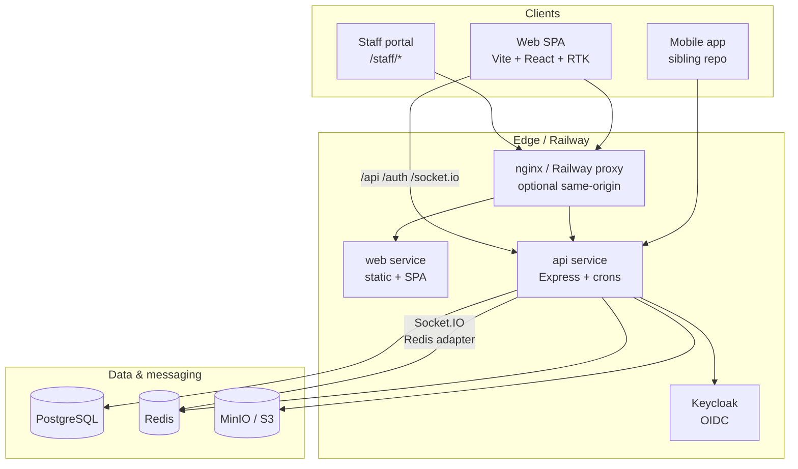

| Layer           | Technology                                   | Location                                               |
| --------------- | -------------------------------------------- | ------------------------------------------------------ |
| Frontend        | Vite 5, React 18, Redux Toolkit + RTK Query  | `apps/web/`                                            |
| API             | Node 22, Express 4, ESM                      | `apps/api/src/`                                        |
| Auth            | Keycloak OIDC (authorization code + refresh) | `apps/api/src/lib/auth.js`                             |
| Cache / pub-sub | Redis (`ioredis`)                            | `apps/api/src/lib/cache.js`, `socket-redis-adapter.js` |
| Object storage  | Local filesystem or S3-compatible (MinIO)    | `apps/api/src/services/storage/`                       |
| Real-time       | Socket.IO on shared HTTP server              | `apps/api/src/lib/socket.js`                           |
| DB              | PostgreSQL 16, 175 SQL migrations            | `apps/api/db/migrations/`                              |

---

<a id="frontend-vite-react-rtk"></a>

### Frontend (Vite / React / RTK)

<a id="build-dev-server"></a>

#### Build & dev server

- **Bundler:** Vite with `@vitejs/plugin-react` (`apps/web/vite.config.ts`).
- **Dev port:** `5173`; proxies `/api`, `/auth`, and `/socket.io` to `http://localhost:4000`.
- **Production build:** manual chunk splitting (`react-vendor`, `redux-vendor`, `charts`, etc.) to keep route-level code lazy.

<a id="state-management"></a>

#### State management

Redux store (`apps/web/src/store/index.ts`):

| Slice / API       | Purpose                              |
| ----------------- | ------------------------------------ |
| `auth`            | Current user from `/auth/me`         |
| `cart`            | Restaurant ordering cart             |
| `monetization`    | Plan limits / upsell state           |
| `billing`         | Billing UI state                     |
| `api` (RTK Query) | All HTTP — injected endpoint modules |

RTK Query base client (`apps/web/src/services/api/base.ts`):

- `credentials: 'include'` — sends HttpOnly auth cookies.
- Unwraps API envelope `{ ok, data, error }`.
- Redirects to `/login` on `401` / `JWT_EXPIRED`.

Endpoint modules are side-effect imports in `apps/web/src/services/api/index.ts` (orders, inventory, admin, staff portal, billing, etc.).

<a id="routing-auth-shell"></a>

#### Routing & auth shell

- `AuthGuard` (`apps/web/src/components/AuthGuard.tsx`) calls `useGetMeQuery`, hydrates `auth` slice, and gates `/app/*`.
- `STAFF_PORTAL` users are redirected away from `/app` to `/staff/dashboard`.
- Permission-gated UI uses `usePermissions()` (`apps/web/src/hooks/usePermissions.ts`) — mirrors backend `hasPermission` semantics including `_MANAGE` supersets.

---

<a id="backend-express-middleware-chain"></a>

### Backend — Express middleware chain

Entry point: `apps/api/src/server.js`. Middleware order is fixed and security-sensitive.

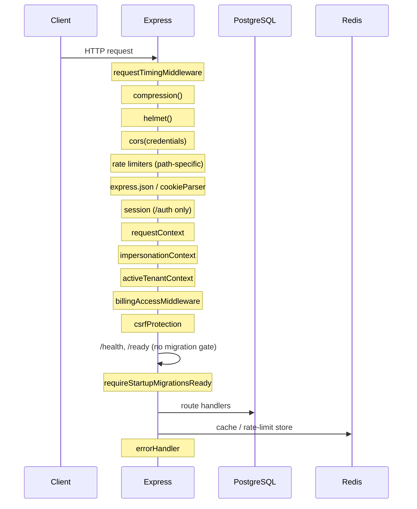

<a id="ordered-stack-summary"></a>

#### Ordered stack (summary)

| #   | Middleware                      | Scope                      | Role                                                             |
| --- | ------------------------------- | -------------------------- | ---------------------------------------------------------------- |
| 1   | `requestTimingMiddleware`       | global                     | Slow-request structured logging                                  |
| 2   | `compression()`                 | global                     | Gzip JSON responses                                              |
| 3   | `helmet()`                      | global                     | CSP, HSTS (prod), CORP cross-origin for images                   |
| 4   | `cors()`                        | global                     | `WEB_ORIGINS`, credentials, `X-CSRF-Token`, `X-Branch-Id`        |
| 5   | Rate limiters                   | path-prefix                | `/auth`, `/api/public`, global, `/api/orders`, `/api/chat`, etc. |
| 6   | Body parsers                    | global                     | JSON/urlencoded, 10 MB                                           |
| 7   | `cookieParser()`                | global                     | Auth + impersonation + tenant cookies                            |
| 8   | `session()`                     | `/auth` only               | OAuth `state` in PostgreSQL session store                        |
| 9   | `requestContext`                | global                     | `requestId`                                                      |
| 10  | `requestLogger`                 | global                     | Optional (`ENABLE_REQUEST_LOGGING`)                              |
| 11  | `impersonationContext`          | global                     | Verify `impersonation_token` cookie                              |
| 12  | `activeTenantContext`           | global                     | Active tenant / branch cookie                                    |
| 13  | `billingAccessMiddleware`       | global                     | Block locked tenants except billing reads                        |
| 14  | `csrfProtection`                | global                     | Skip `/api/public/*`                                             |
| 15  | Static `/uploads`               | conditional                | `STORAGE_DRIVER=local`                                           |
| 16  | `requireStartupMigrationsReady` | `/api/*`, `/auth/*` routes | 503 while migrations run                                         |
| 17  | Route mounts                    | per-prefix                 | 50+ routers (see `server.js` imports)                            |
| 18  | 404 + `errorHandler`            | global                     | Structured `{ ok, error, requestId }`                            |

<a id="startup-lifecycle"></a>

#### Startup lifecycle

On `server.listen`:

1. Memory monitor + DB pool warmup / keepalive.
2. Keycloak OIDC config pre-warm.
3. `runStartupSchemaTasks()` — migrations + `ensureOrderCancellationColumns`, then MinIO bucket readiness.
4. `registerCronJobs({ trackInterval })` — 18 in-process timers.
5. Dev-only: enable Keycloak direct-access grants for invite login.

Graceful shutdown (`SIGTERM`/`SIGINT`): clear cron timers → close HTTP → `closePool()` → `disconnectCache()`.

---

<a id="redis"></a>

### Redis

**Config:** `REDIS_URL` via `resolveRedisUrl()` (`apps/api/src/config/resolve-redis-url.js`). Railway warning logged if a public proxy URL is used instead of internal service reference.

**Uses:**

| Use case            | Module                                                                                                                 |
| ------------------- | ---------------------------------------------------------------------------------------------------------------------- |
| Cross-request cache | `apps/api/src/lib/cache.js` — permissions, user-by-sub, tenant context; falls back to in-memory (500 entries) if unset |
| Rate-limit store    | `apps/api/src/lib/rate-limit-store.js`                                                                                 |
| Socket.IO adapter   | `apps/api/src/lib/socket-redis-adapter.js` — multi-instance fan-out                                                    |
| Singleflight dedup  | `apps/api/src/lib/singleflight.js`                                                                                     |

`/health` exposes `redis.connected` when `MEMORY_HEALTH_EXPOSE` is enabled.

---

<a id="minio-object-storage"></a>

### MinIO / object storage

**Driver selection** (`apps/api/src/config/env.js`):

- `STORAGE_DRIVER=local` — default when no S3 endpoint.
- `STORAGE_DRIVER=s3` — when `STORAGE_ENDPOINT` / `S3_ENDPOINT` is set (MinIO locally, Railway Storage in prod).

**Service:** `apps/api/src/services/storage/storage.service.js` delegates to `localStorageProvider` or `s3CompatibleProvider`.

| Operation                    | Used for                                     |
| ---------------------------- | -------------------------------------------- |
| `ensureStorageReady()`       | Boot-time bucket creation                    |
| `createPresignedUpload()`    | Browser-direct uploads                       |
| `getObjectStream()`          | Private bucket reads via `/api/files/object` |
| `putObject` / `deleteObject` | Import workers, internal copies              |

Docker Compose maps MinIO to `http://minio:9000` with `S3_ACCESS_KEY` / `S3_SECRET_KEY` (see `docker-compose.yml` `x-api-environment`).

---

<a id="socketio"></a>

### Socket.IO

Initialized on the same `http.Server` as Express (`initializeSocket(server)`).

- **Auth:** `resolveSocketUserFromCookieHeader` — same `access_token` cookie as REST.
- **Rooms:** `user_{userId}`, `restaurant_{restaurantId}`.
- **Events:** `notification_new`, `consumer_order_new`, chat message persistence via `chatSocket.service.js`.
- **Scale-out:** Redis adapter when `REDIS_URL` is set.

Vite dev proxy and production nginx must forward WebSocket upgrades on `/socket.io`.

---

<a id="cron-jobs-18"></a>

### Cron jobs (18)

All jobs register in `apps/api/src/lib/register-cron-jobs.js` and execute via `runCronJob` (`apps/api/src/lib/cron-runner.js`):

- Skipped when `NODE_ENV=test`.
- Gated by `CRONS_ENABLED` (per-tick).
- **Postgres advisory lock** per job name — one winner per cluster per tick.
- In-memory guard prevents concurrent duplicate runs in one process.

| #   | `CRON_JOBS` key              | Interval (default)                                     | Handler                               |
| --- | ---------------------------- | ------------------------------------------------------ | ------------------------------------- |
| 1   | `scheduled_orders`           | `CRON_SCHEDULED_ORDERS_INTERVAL_MS` (1h prod / 5m dev) | `executeScheduledOrders`              |
| 2   | `invoice_overdue`            | 24h                                                    | `checkOverdueInvoices`                |
| 3   | `subscription_billing`       | 1h                                                     | `runSubscriptionBillingJob`           |
| 4   | `waitlist_offers`            | 15m                                                    | `checkExpiredWaitlistOffers`          |
| 5   | `promotions_expiry`          | 30m                                                    | `runDeactivateExpiredPromotionsJob`   |
| 6   | `invitation_expiry`          | 1h                                                     | branch + restaurant invitation expiry |
| 7   | `free_sandbox_expiry`        | 1h                                                     | `runFreeSandboxExpiryJob`             |
| 8   | `trial_ending_soon`          | 1h                                                     | `runTrialEndingSoonJob`               |
| 9   | `fulfillment_exceptions`     | 30m                                                    | `runFulfillmentExceptionChecks`       |
| 10  | `delivery_rollover`          | `CRON_DELIVERY_ROLLOVER_INTERVAL_MS` (1h)              | `runDeliveryRolloverCron`             |
| 11  | `operational_reminders`      | `CRON_OPERATIONAL_REMINDERS_INTERVAL_MS` (24h)         | `runOperationalRemindersJob`          |
| 12  | `driver_location_retention`  | 24h                                                    | `runDriverLocationRetentionJob`       |
| 13  | `email_retry`                | `CRON_EMAIL_RETRY_INTERVAL_MS` (1h)                    | `runEmailRetryJob`                    |
| 14  | `email_digest`               | `CRON_EMAIL_DIGEST_INTERVAL_MS` (24h)                  | `runEmailDigestJob`                   |
| 15  | `stale_gps_alerts`           | `CRON_STALE_GPS_INTERVAL_MS` (15m)                     | `runStaleGpsAlertsJob`                |
| 16  | `log_retention`              | `CRON_LOG_RETENTION_INTERVAL_MS` (24h)                 | `runLogRetentionJob`                  |
| 17  | `reorder_forecast`           | 24h                                                    | `runReorderForecastJob`               |
| 18  | `growth_program_maintenance` | 1h                                                     | `runGrowthProgramMaintenanceJob`      |

**Not in this registry:** bulk product image import uses `image-import-worker.js` + Postgres advisory locks (see `docs/features/bulk-product-image-import.md`).

Set `CRONS_ENABLED=false` on a web-tier API replica if you split workers later.

---

<a id="deployment"></a>

### Deployment

<a id="railway"></a>

#### Railway

| Service  | Dockerfile                           | Config                  | Health                       |
| -------- | ------------------------------------ | ----------------------- | ---------------------------- |
| API      | `apps/api/Dockerfile`                | `apps/api/railway.json` | `GET /health` (120s timeout) |
| Web      | `apps/web/Dockerfile`                | `apps/web/railway.json` | static                       |
| Keycloak | `deploy/railway/keycloak/Dockerfile` | per-env `railway.json`  | Keycloak health              |

API start command: `node apps/api/src/server.js`. Build context is **repo root** (not `apps/api`).

Runtime env defaults ship in `deploy/railway/<env>/api.env` and `web.env`. `loadRailwayApiEnvDefaults()` merges these when `RAILWAY_ENVIRONMENT` is detected.

<a id="docker-compose-local-full-stack"></a>

#### Docker Compose (local full stack)

`docker-compose.yml` — services: `postgres`, `redis`, `minio`, `mailpit`, `keycloak`, `api`, `web`, `nginx`.

- API env block `x-api-environment` wires internal hostnames (`postgres`, `redis`, `minio`, `keycloak`).
- Nginx terminates same-origin `/api` + `/auth` for cookie compatibility.
- Commands: `pnpm dev:docker` or `scripts/run-local.cmd up`.

<a id="native-dev"></a>

#### Native dev

```bash
pnpm setup && pnpm dev   # infra via Docker or local; Vite :5173 + API :4000
pnpm local:infra         # postgres, redis, minio, keycloak only
```

---

<a id="environment-variables-sanitized-reference"></a>

### Environment variables (sanitized reference)

Secrets shown as `<set-in-vault>` — never commit real values.

<a id="core"></a>

#### Core

| Variable                 | Required       | Default / notes                                          |
| ------------------------ | -------------- | -------------------------------------------------------- |
| `NODE_ENV`               | no             | `development`                                            |
| `APP_ENV`                | no             | derived: `dev` / `staging` / `prod`                      |
| `PORT`                   | no             | `4000` (Railway injects)                                 |
| `DATABASE_URL`           | **yes** (prod) | Postgres connection string                               |
| `DATABASE_MIGRATION_URL` | no             | Direct URL for DDL; falls back to `DATABASE_PRIVATE_URL` |
| `DATABASE_SSL`           | no             | `false`                                                  |
| `SESSION_SECRET`         | **yes** (prod) | OAuth session signing                                    |
| `TRUST_PROXY`            | no             | `true`                                                   |

<a id="auth-keycloak"></a>

#### Auth (Keycloak)

| Variable                                     | Required       | Default                                |
| -------------------------------------------- | -------------- | -------------------------------------- |
| `KEYCLOAK_BASE_URL`                          | yes            | `http://localhost:8080` (internal)     |
| `KEYCLOAK_PUBLIC_URL`                        | yes            | browser-facing issuer base             |
| `KEYCLOAK_REALM`                             | no             | `Supplify`                             |
| `KEYCLOAK_CLIENT_ID`                         | no             | `supplify-api`                         |
| `KEYCLOAK_CLIENT_SECRET`                     | **yes** (prod) | `<set-in-vault>`                       |
| `KEYCLOAK_ADMIN` / `KEYCLOAK_ADMIN_PASSWORD` | dev            | admin bootstrap                        |
| `OAUTH_CALLBACK_BASE_URL`                    | prod           | Web origin for `/auth/callback`        |
| `COOKIE_SECURE`                              | no             | `true` in production                   |
| `COOKIE_SAME_SITE`                           | no             | `lax`                                  |
| `COOKIE_DOMAIN`                              | optional       | cross-subdomain cookies                |
| `IMPERSONATION_SECRET`                       | yes            | defaults to `SESSION_SECRET`           |
| `CONSUMER_AUTH_SECRET`                       | yes            | B2C diner JWT (separate from Keycloak) |

<a id="web-cors"></a>

#### Web / CORS

| Variable                | Required   | Default                              |
| ----------------------- | ---------- | ------------------------------------ |
| `WEB_ORIGIN`            | yes (prod) | primary SPA URL                      |
| `WEB_ORIGINS`           | no         | comma-separated allowlist            |
| `PUBLIC_API_URL`        | no         | derived from `RAILWAY_PUBLIC_DOMAIN` |
| `PUBLIC_FRONTEND_URL`   | no         | alias of `WEB_ORIGIN`                |
| `STAFF_PORTAL_BASE_URL` | no         | staff magic-link base                |
| `VITE_API_URL`          | web build  | baked at Docker build time           |

<a id="redis"></a>

#### Redis

| Variable    | Required           | Default                      |
| ----------- | ------------------ | ---------------------------- |
| `REDIS_URL` | recommended (prod) | unset → in-memory cache only |

<a id="storage-minio-s3"></a>

#### Storage (MinIO / S3)

| Variable                      | Required | Default                 |
| ----------------------------- | -------- | ----------------------- |
| `STORAGE_DRIVER`              | no       | `local` or `s3`         |
| `STORAGE_ENDPOINT`            | s3       | `http://localhost:9000` |
| `STORAGE_BUCKET`              | no       | `supplify`              |
| `STORAGE_ACCESS_KEY_ID`       | s3       | `minioadmin` (dev)      |
| `STORAGE_SECRET_ACCESS_KEY`   | s3       | `<set-in-vault>`        |
| `STORAGE_PUBLIC_READ`         | no       | `true`                  |
| `STORAGE_S3_FORCE_PATH_STYLE` | no       | `true` for MinIO        |

<a id="crons-ops"></a>

#### Crons & ops

| Variable                            | Default                     |
| ----------------------------------- | --------------------------- |
| `CRONS_ENABLED`                     | `true`                      |
| `CRON_SCHEDULED_ORDERS_INTERVAL_MS` | 1h prod / 5m dev            |
| `DELIVERY_ROLLOVER_ENABLED`         | `false`                     |
| `RATE_LIMIT_ENABLED`                | `true` except `APP_ENV=dev` |
| `RUN_MIGRATIONS_ON_START`           | `false`                     |
| `MEMORY_HEALTH_EXPOSE`              | `true` in dev               |

<a id="email-payments-abbreviated"></a>

#### Email / payments (abbreviated)

| Variable                               | Purpose             |
| -------------------------------------- | ------------------- |
| `EMAIL_ENABLED`, `SMTP_HOST`, `SMTP_*` | Transactional email |
| `PAYMENTS_MODE`, `PAYMENTS_*`          | Billing gateway     |
| `VAPID_*`                              | Web push            |

Full list: `apps/api/src/config/env.js`.

---

<a id="implementation-evidence"></a>

### Implementation evidence

| Claim                      | Source                                                               |
| -------------------------- | -------------------------------------------------------------------- |
| 175 SQL migrations         | `apps/api/db/migrations/*.sql` (count verified 2026-06-17)           |
| 18 cron jobs registered    | `register-cron-jobs.js` `jobs.length` + `cron-runner.js` `CRON_JOBS` |
| Middleware order           | `apps/api/src/server.js` lines 149–442                               |
| RTK store shape            | `apps/web/src/store/index.ts`                                        |
| Redis fallback             | `apps/api/src/lib/cache.js`                                          |
| Socket Redis adapter       | `apps/api/src/lib/socket.js` → `attachSocketRedisAdapter`            |
| Railway API healthcheck    | `apps/api/railway.json` → `/health`                                  |
| Docker Compose service map | `docker-compose.yml`                                                 |
| 554 API routes (inventory) | `docs/audits/route-inventory.json`                                   |

<a id="key-files"></a>

#### Key files

```
apps/api/src/server.js              # HTTP server + middleware + routes
apps/api/src/lib/register-cron-jobs.js
apps/api/src/config/env.js          # canonical env schema
apps/web/vite.config.ts
apps/web/src/services/api/base.ts   # RTK Query + cookies
docker-compose.yml
apps/api/Dockerfile
apps/web/Dockerfile
deploy/railway/
```

---

<a id="related-docs"></a>

### Related docs

- [09-authentication-rbac.md](part-ix-authentication-rbac-internal-technical-reference) — OIDC, cookies, permissions
- [08-database-guide.md](part-viii-database-guide-internal-technical-reference) — schema and migrations
- [docs/operations/cron-jobs.md](../operations/cron-jobs.md) — cron operations runbook

---

## Part VIII — Database Guide _(Internal Technical Reference)_

<a id="part-viii-database-guide-internal-technical-reference"></a>

Supplify uses **PostgreSQL 16** with a **numbered SQL migration** pipeline (`apps/api/db/migrations/`). Schema changes are forward-only; **175 migrations** exist as of migration `0175_free_trial_supplier_growth_parity.sql`. Application code uses the `pg` pool (`apps/api/src/lib/db.js`) with optional statement timeouts and Railway-oriented pool keepalive.

---

<a id="migration-system"></a>

### Migration system

| Concept       | Detail                                                                                          |
| ------------- | ----------------------------------------------------------------------------------------------- |
| Tracker table | `schema_migrations(version, applied_at)` — created in `0000_schema_migrations.sql`              |
| Runner        | `apps/api/scripts/migrate.js` — `pnpm db:migrate`                                               |
| Startup       | `runFullStartupMigrations()` after HTTP listen; `/ready` returns `503 migrating` until complete |
| DDL URL       | `DATABASE_MIGRATION_URL` bypasses poolers that block `ALTER TABLE`                              |
| Naming        | `NNNN_snake_case_description.sql`                                                               |

**Do not** edit applied migrations. Add a new file and run migrate.

---

<a id="schemas-naming-conventions"></a>

### Schemas & naming conventions

- **Single database**, `public` schema — no per-tenant Postgres schemas.
- **Tenant isolation** is logical: `restaurant_id`, `supplier_id`, `tenant_id` + `tenant_type` columns and query filters.
- **UUID primary keys** via `gen_random_uuid()` (`pgcrypto`).
- **Timestamps:** `created_at`, `updated_at` on most business tables.
- **JSONB** for flexible plan limits/features, addresses, metadata.
- **Enums** for stable lifecycles (`order_status`, staff PTO/swap statuses).

<a id="core-identity-tenancy"></a>

#### Core identity & tenancy

| Table                       | Purpose                                                                                         |
| --------------------------- | ----------------------------------------------------------------------------------------------- |
| `app_user`                  | Platform user; `keycloak_sub`, `email`, `role` (`ADMIN`/`SUPPLIER`/`RESTAURANT`/`STAFF_PORTAL`) |
| `supplier`                  | Supplier tenant; optional `organization_id` for multi-branch                                    |
| `restaurant`                | Restaurant tenant; org linkage via `restaurant_organizations` (later migrations)                |
| `supplier_organizations`    | Parent org for supplier branches (`0082_supplier_branch_accounts.sql`)                          |
| `user_workspace_membership` | One active workspace per user boundary (`0104_user_workspace_membership.sql`)                   |

<a id="rbac-tenant-scoped"></a>

#### RBAC (tenant-scoped)

| Table                                     | Purpose                                                                               |
| ----------------------------------------- | ------------------------------------------------------------------------------------- |
| `tenant_roles`                            | Named roles per `(tenant_id, tenant_type)`; `is_system` for defaults                  |
| `tenant_role_permissions`                 | `permission` text codes (see `permission-keys.js`)                                    |
| `tenant_user_roles`                       | User ↔ role assignment within a tenant                                               |
| `role` / `permission` / `role_permission` | Legacy global role catalog + **admin** roles (`0042_rbac_seed_roles_permissions.sql`) |
| `user_role`                               | Legacy user ↔ global role (merged at permission resolution)                          |

<a id="catalog-supplier-inventory"></a>

#### Catalog & supplier inventory

| Table       | Purpose                                           |
| ----------- | ------------------------------------------------- |
| `catalog`   | Supplier catalog container                        |
| `product`   | SKU, names, category; scoped by `supplier_id`     |
| `price`     | Time-bounded product pricing                      |
| `inventory` | Supplier stock (`product_id` PK, `available_qty`) |

<a id="restaurant-inventory"></a>

#### Restaurant inventory

| Table                           | Purpose                                                                        |
| ------------------------------- | ------------------------------------------------------------------------------ |
| `restaurant_inventory`          | Par levels per `(restaurant_id, product_id)` — `0004_restaurant_inventory.sql` |
| `restaurant_inventory_lot`      | Batch/expiry tracking (`0133_restaurant_inventory_lots.sql`)                   |
| `restaurant_inventory_settings` | Tenant-level inventory prefs                                                   |

<a id="orders-commercial-flow"></a>

#### Orders & commercial flow

| Table                           | Purpose                                          |
| ------------------------------- | ------------------------------------------------ |
| `customer_order`                | Restaurant purchase order; `status order_status` |
| `order_item`                    | Lines with `supplier_id`, qty, pricing           |
| `invoice` / `invoice_line_item` | AR/AP documents — `0009_finance_billing.sql`     |
| `credit_note`                   | Adjustments linked to invoices/orders            |
| `subscription_plan`             | Plan catalog (limits/features JSONB)             |
| `subscription`                  | Tenant subscription state                        |
| `tenant_subscription_addon`     | Add-on entitlements                              |

<a id="fulfillment-delivery"></a>

#### Fulfillment & delivery

| Table                            | Purpose                                                |
| -------------------------------- | ------------------------------------------------------ |
| `delivery_wave` / `pick_list`    | Batch picking (`0006_fulfillment_logistics.sql`)       |
| `delivery_route` / `route_stop`  | Route planning                                         |
| `proof_of_delivery`              | POD capture                                            |
| `drivers` / `driver_assignments` | Driver lifecycle (`0088_drivers_fulfillment.sql`)      |
| `fulfillment_exceptions`         | Operational exception queue                            |
| `warehouse`                      | Supplier warehouses (`0081_warehouse_fulfillment.sql`) |

---

<a id="tenant-isolation-patterns"></a>

### Tenant isolation patterns

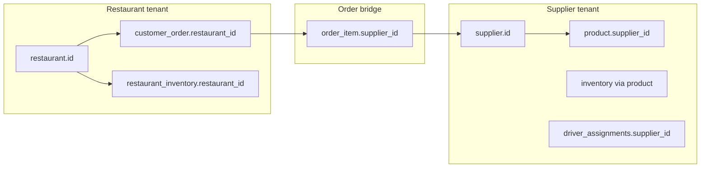

**API enforcement** (not RLS):

1. `resolveTenantContext` attaches `tenantId` + `tenantType` from cookies, membership, or impersonation.
2. Route handlers filter `WHERE restaurant_id = $tenant` or `supplier_id = $tenant`.
3. `requireOwnership` / branch-org guards for multi-location suppliers.
4. Admin routes use `resolveAdminContext`; impersonation uses `getEffectiveTenant()`.

**Subscription gating:** `billingAccessMiddleware` blocks locked tenants except billing/subscription read endpoints.

---

<a id="status-fields"></a>

### Status fields

<a id="orderstatus-enum"></a>

#### `order_status` enum

Evolved across `0001_init.sql`, `0028_order_status_enhancements.sql`, `0069_approvals_budgets.sql`, `0110_order_status_received_with_dispute.sql`:

| Value                   | Typical meaning            |
| ----------------------- | -------------------------- |
| `DRAFT`                 | Cart / not placed          |
| `PENDING_APPROVAL`      | Internal approval workflow |
| `PLACED`                | Submitted to supplier      |
| `CONFIRMED`             | Supplier accepted          |
| `FULFILLING`            | Pick/pack/ship in progress |
| `DELIVERED`             | Delivered to restaurant    |
| `RECEIVED_PARTIAL`      | Partial receiving          |
| `RECEIVED_FULL`         | Fully received             |
| `RECEIVED_WITH_DISPUTE` | Receiving dispute open     |
| `INVOICED`              | Invoice generated          |
| `COMPLETED`             | Closed                     |
| `CANCELLED`             | Cancelled                  |

<a id="invoice-status-text-check"></a>

#### Invoice `status` (TEXT CHECK)

`DRAFT` → `ISSUED` → `PARTIALLY_PAID` / `PAID` / `OVERDUE` / `VOID`

<a id="subscription-status"></a>

#### Subscription `status`

`TRIALING`, `ACTIVE`, `SUSPENDED`, `CANCELLED`, `PAST_DUE`

<a id="driver-assignment-status"></a>

#### Driver assignment `status`

`assigned`, `picked_up`, `out_for_delivery`, `delivered`, `failed`, `reassigned`

<a id="fulfillment-exception-status"></a>

#### Fulfillment exception `status`

`open`, `resolved`, `ignored`

---

<a id="entity-relationship-diagram-core-commercial-domain"></a>

### Entity-relationship diagram (core commercial domain)

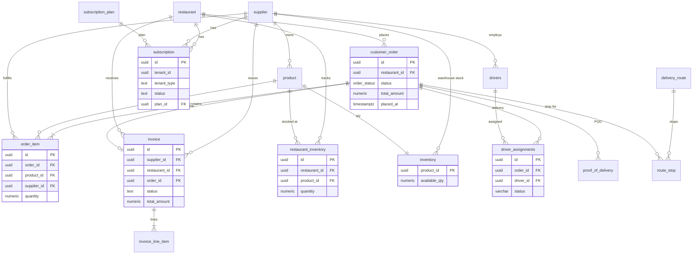

---

<a id="key-relationships-query-mental-model"></a>

### Key relationships (query mental model)

1. **Order → suppliers:** One restaurant order may span multiple suppliers via `order_item.supplier_id`.
2. **Invoice → order:** Optional `invoice.order_id`; line items may reference `order_item_id`.
3. **Inventory types:** `inventory` = supplier sellable stock; `restaurant_inventory` = restaurant on-hand after receiving.
4. **Subscription:** Polymorphic `tenant_id` + `tenant_type IN ('SUPPLIER','RESTAURANT')` — not a FK to keep one table.
5. **Delivery:** `driver_assignments` is the operational delivery record; `delivery_route` / `route_stop` support planning; `proof_of_delivery` stores confirmation artifacts.

---

<a id="seeds-demo-data"></a>

### Seeds & demo data

Seeds are **scripts**, not migrations. Entry points from root `package.json`:

| Command                                      | Purpose                                  |
| -------------------------------------------- | ---------------------------------------- |
| `pnpm db:seed`                               | Base API seed (`@supplify/api db:seed`)  |
| `pnpm seed:demo-users`                       | Keycloak + `app_user` demo accounts      |
| `pnpm seed:demo-tenants`                     | Restaurant/supplier tenants              |
| `pnpm seed:plan-tiers` / `seed:tier-catalog` | Subscription plan catalog                |
| `pnpm seed:billing`                          | Billing fixtures                         |
| `pnpm seed:full`                             | Full demo stack                          |
| `pnpm seed:prodlike`                         | Production-like minimal data             |
| `pnpm seed:features`                         | Feature-flag / plan feature alignment    |
| `pnpm db:migrate-users-to-roles`             | Backfill `tenant_user_roles` from legacy |

Supporting modules: `apps/api/scripts/seed/businessDemoData.js`, `tierDefinitions.js`, `wipe-commercial-data.js`.

**System role matrix sync:** `ensureTenantSystemRoles()` in `apps/api/src/lib/tenant-roles.js` applies `RESTAURANT_SYSTEM_ROLES` / `SUPPLIER_SYSTEM_ROLES` from `role-matrix.js` when tenants are created or on admin sync.

---

<a id="indexes-performance"></a>

### Indexes & performance

Hot-path indexes added in later migrations, e.g.:

- `0139_railway_hot_path_indexes.sql` — restaurant inventory, orders
- `0142_order_create_hot_path_indexes.sql`
- `0091_performance_indexes.sql`

Use `EXPLAIN ANALYZE` on slow list endpoints; check `SLOW_REQUEST_MS` logs for stage breakdown.

---

<a id="implementation-evidence"></a>

### Implementation evidence

| Claim                     | Source                                                                        |
| ------------------------- | ----------------------------------------------------------------------------- |
| 175 migrations            | `apps/api/db/migrations/*.sql`                                                |
| Initial schema            | `0001_init.sql`                                                               |
| `order_status` extensions | `0028`, `0069`, `0110`                                                        |
| Invoice schema            | `0009_finance_billing.sql`                                                    |
| Subscription schema       | `0022_subscription_system.sql`                                                |
| Fulfillment/delivery      | `0006_fulfillment_logistics.sql`, `0088_drivers_fulfillment.sql`              |
| Restaurant inventory      | `0004_restaurant_inventory.sql`                                               |
| Tenant RBAC tables        | `0078_tenant_named_roles.sql`, `0041_rbac_tenant_roles.sql`                   |
| Tenant isolation in API   | `apps/api/src/lib/rbac.js` `resolveTenantContext`                             |
| Migration on boot         | `apps/api/src/lib/startup-migrations.js`, `server.js` `runStartupSchemaTasks` |

<a id="operational-commands"></a>

#### Operational commands

```bash
pnpm db:migrate                    # apply pending migrations
pnpm db:seed                       # development seed
psql $DATABASE_URL -c "SELECT version FROM schema_migrations ORDER BY version DESC LIMIT 5;"
```

---

<a id="related-docs"></a>

### Related docs

- [07-technical-architecture.md](part-vii-technical-architecture-internal-technical-reference) — Postgres pool, Redis, deployment
- [09-authentication-rbac.md](part-ix-authentication-rbac-internal-technical-reference) — `tenant_roles` permission model
- [docs/operations/cron-jobs.md](../operations/cron-jobs.md) — jobs that mutate subscription/invoice state

---

## Part IX — Authentication & RBAC _(Internal Technical Reference)_

<a id="part-ix-authentication-rbac-internal-technical-reference"></a>

Supplify authenticates users with **Keycloak OIDC** (authorization code flow). The API stores platform identity in `app_user` and enforces **tenant-scoped RBAC** via permission keys in `tenant_role_permissions`. Authorization is **mandatory on the backend** (`requirePermission`); the React app mirrors checks for UX only.

---

<a id="keycloak-oidc-flow"></a>

### Keycloak OIDC flow

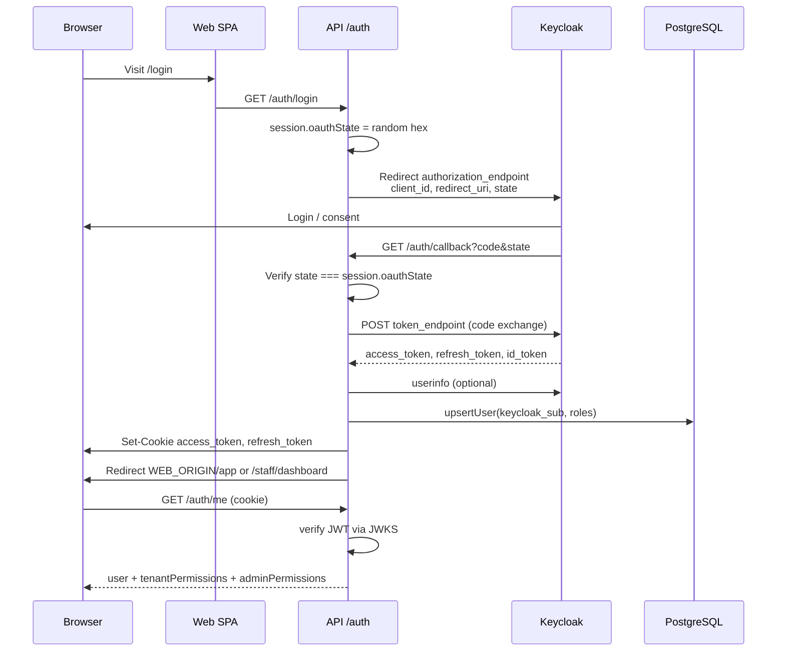

<a id="endpoints-appsapisrcroutesauthroutesjs"></a>

#### Endpoints (`apps/api/src/routes/auth.routes.js`)

| Route                | Auth     | Purpose                                                |
| -------------------- | -------- | ------------------------------------------------------ |
| `GET /auth/login`    | session  | Start OIDC; clears impersonation/active-tenant cookies |
| `GET /auth/register` | session  | Keycloak self-registration                             |
| `GET /auth/callback` | session  | Code exchange + cookie write                           |
| `GET /auth/logout`   | public   | Clear cookies + Keycloak end-session                   |
| `GET /auth/session`  | optional | Lightweight session probe                              |
| `GET /auth/me`       | required | Full user + RBAC payload                               |
| `POST /auth/refresh` | cookie   | Refresh access token                                   |

<a id="token-verification"></a>

#### Token verification

- `getKeycloakConfig()` loads `.well-known/openid-configuration` (`apps/api/src/lib/auth.js`).
- Access tokens verified with cached `createRemoteJWKSet` per realm JWKS URI.
- Issuer normalized for trailing-slash mismatches.
- Keep-alive HTTP agents reduce Railway ↔ Keycloak latency.

<a id="oauth-callback-origin"></a>

#### OAuth callback origin

`callbackOrigin(req)` prefers `OAUTH_CALLBACK_BASE_URL`, then `X-Forwarded-Host`, then request host — so cookies are **first-party** on the web domain (critical for mobile Chrome).

---

<a id="token-cookie-flow"></a>

### Token & cookie flow

<a id="httponly-cookies-web"></a>

#### HttpOnly cookies (web)

Set in `setAuthCookies()` (`apps/api/src/lib/rbac.js`):

| Cookie          | TTL    | Content                |
| --------------- | ------ | ---------------------- |
| `access_token`  | 1 hour | Keycloak JWT           |
| `refresh_token` | 7 days | Keycloak refresh token |

Options: `httpOnly`, `secure` (`COOKIE_SECURE`), `sameSite` (`COOKIE_SAME_SITE`), optional `domain` (`COOKIE_DOMAIN`).

<a id="request-authentication"></a>

#### Request authentication

`requireAuth` middleware:

1. Read `access_token` from cookie (or `Authorization: Bearer` for mobile).
2. Verify JWT; on expiry attempt `refreshAccessToken` and re-set cookies.
3. Load `app_user` by `keycloak_sub` (Redis-cached).
4. `assertStaffPortalRouteAccess` — block `STAFF_PORTAL` from non-allowlisted paths.

<a id="other-security-cookies"></a>

#### Other security cookies

| Cookie                | Purpose                                                  |
| --------------------- | -------------------------------------------------------- |
| `impersonation_token` | Signed JWT for admin view-as (`impersonation.js`)        |
| `active_tenant`       | Multi-branch / workspace switch (`tenant-switch.js`)     |
| Session cookie        | `/auth` only — OAuth `state` in PostgreSQL session store |

<a id="csrf"></a>

#### CSRF

`csrfProtection` on state-changing API calls; skipped for `/api/public/*`. Frontend sends `X-CSRF-Token` (header-based — safe with compression).

---

<a id="permission-keys-52"></a>

### Permission keys (52)

Canonical constants: `apps/api/src/lib/permission-keys.js` (`PERMISSION_KEYS`).

| Domain        | Keys                                                                                             |
| ------------- | ------------------------------------------------------------------------------------------------ |
| Orders        | `ORDERS_VIEW`, `ORDERS_CREATE`, `ORDERS_EDIT`, `ORDERS_MANAGE`                                   |
| Invoices      | `INVOICES_VIEW`, `INVOICES_CREATE`, `INVOICES_EDIT`, `INVOICES_MANAGE`                           |
| Inventory     | `INVENTORY_VIEW`, `INVENTORY_EDIT`, `INVENTORY_MANAGE`                                           |
| Reservations  | `RESERVATIONS_VIEW`, `RESERVATIONS_CREATE`, `RESERVATIONS_EDIT`, `RESERVATIONS_MANAGE`           |
| Staff / team  | `STAFF_VIEW`, `STAFF_INVITE`, `STAFF_EDIT`, `STAFF_MANAGE`                                       |
| Settings      | `SETTINGS_VIEW`, `SETTINGS_EDIT`, `SETTINGS_MANAGE`                                              |
| Chat          | `CHAT_VIEW`, `CHAT_SEND`, `CHAT_MANAGE`                                                          |
| Subscriptions | `SUBSCRIPTIONS_VIEW`, `SUBSCRIPTIONS_MANAGE`                                                     |
| Catalog       | `CATALOG_VIEW`, `CATALOG_EDIT`, `CATALOG_MANAGE`                                                 |
| Warehouses    | `WAREHOUSES_VIEW`, `WAREHOUSES_EDIT`, `WAREHOUSES_MANAGE`                                        |
| Receiving     | `RECEIVING_VIEW`, `RECEIVING_MANAGE`                                                             |
| Payments      | `PAYMENTS_VIEW`, `PAYMENTS_MANAGE`                                                               |
| Fulfillment   | `FULFILLMENT_VIEW`, `FULFILLMENT_MANAGE`                                                         |
| Promotions    | `PROMOTIONS_VIEW`, `PROMOTIONS_MANAGE`                                                           |
| Customers     | `CUSTOMERS_IMPORT`, `CUSTOMERS_MANAGE`                                                           |
| Growth        | `GROWTH_VIEW`                                                                                    |
| Driver        | `DRIVER_DELIVERIES_VIEW`, `DRIVER_DELIVERIES_MANAGE`                                             |
| Admin         | `ADMIN_ACCESS`, `ADMIN_TENANTS`, `ADMIN_PLANS`, `ADMIN_SUPPORT`, `ADMIN_FINANCE`, `ADMIN_GROWTH` |

**`hasPermission(permissions, required)`** (`permissions.js`): exact match, or holder has domain `_MANAGE` when checking `_VIEW` / `_EDIT` / etc.

**Caching:** Redis key `perm:{userId}:{tenantId}:{tenantType}` — TTL 180s; invalidated on role changes.

---

<a id="restaurant-system-roles-7"></a>

### Restaurant system roles (7)

Defined in `apps/api/src/lib/role-matrix.js` (`RESTAURANT_SYSTEM_ROLES`). Synced to DB per tenant via `ensureTenantSystemRoles()`.

| Role                   | Intent                                                       |
| ---------------------- | ------------------------------------------------------------ |
| **Owner**              | `permissions: 'ALL'` — full restaurant workspace             |
| **Restaurant Manager** | Orders, receiving, catalog read, chat; no billing/team admin |
| **Purchaser**          | Browse catalog, create/edit orders                           |
| **Receiving Staff**    | Receive goods, disputes; no order create                     |
| **Accountant**         | Invoices, payments, subscriptions view                       |
| **Viewer**             | All `*_VIEW` for restaurant workspace; zero writes           |
| **FOH Staff**          | Reservations only                                            |

<a id="restaurant-permission-matrix"></a>

#### Restaurant permission matrix

Legend: ✓ = granted, — = denied. Owner has all keys (omitted for brevity).

| Permission                      |     Manager      | Purchaser | Receiving | Accountant |  Viewer   | FOH |
| ------------------------------- | :--------------: | :-------: | :-------: | :--------: | :-------: | :-: |
| `ORDERS_VIEW`                   |        ✓         |     ✓     |     ✓     |     ✓      |     ✓     |  —  |
| `ORDERS_CREATE`                 |        ✓         |     ✓     |     —     |     —      |     —     |  —  |
| `ORDERS_EDIT`                   |        ✓         |     ✓     |     —     |     —      |     —     |  —  |
| `ORDERS_MANAGE`                 |        ✓         |     —     |     —     |     —      |     —     |  —  |
| `RECEIVING_VIEW`                |        ✓         |     —     |     ✓     |     —      |     ✓     |  —  |
| `RECEIVING_MANAGE`              |        ✓         |     —     |     ✓     |     —      |     —     |  —  |
| `CATALOG_VIEW`                  |        ✓         |     ✓     |     —     |     —      |     ✓     |  —  |
| `INVENTORY_VIEW`                |        ✓         |     ✓     |     —     |     —      |     ✓     |  —  |
| `INVOICES_VIEW`                 |        ✓         |     —     |     —     |     ✓      |     ✓     |  —  |
| `INVOICES_*` (write)            |        —         |     —     |     —     |     ✓      |     —     |  —  |
| `PAYMENTS_*`                    |        —         |     —     |     —     |     ✓      |  ✓ view   |  —  |
| `SUBSCRIPTIONS_VIEW`            |        —         |     —     |     —     |     ✓      |     ✓     |  —  |
| `SUBSCRIPTIONS_MANAGE`          |        —         |     —     |     —     |     —      |     —     |  —  |
| `STAFF_VIEW`                    |        —         |     —     |     —     |     —      |     ✓     |  —  |
| `STAFF_INVITE` / `STAFF_MANAGE` |        —         |     —     |     —     |     —      |     —     |  —  |
| `SETTINGS_VIEW`                 |        ✓         |     —     |     —     |     —      |     ✓     |  —  |
| `SETTINGS_MANAGE`               |        —         |     —     |     —     |     —      |     —     |  —  |
| `CHAT_VIEW` / `CHAT_SEND`       |        ✓         |     ✓     |     —     |     —      | view only |  —  |
| `RESERVATIONS_*`                | view/create/edit |     —     |     —     |     —      |   view    |  ✓  |

Verified by `apps/api/src/lib/tenant-role-matrix.test.js`.

---

<a id="supplier-system-roles-9"></a>

### Supplier system roles (9)

`SUPPLIER_SYSTEM_ROLES` in `role-matrix.js`:

| Role                        | Intent                                                           |
| --------------------------- | ---------------------------------------------------------------- |
| **Owner**                   | Full supplier workspace                                          |
| **Supplier Manager**        | Orders, catalog, fulfillment, growth view; no billing/team admin |
| **Warehouse Manager**       | Warehouses, fulfillment, inventory                               |
| **Order Fulfillment Staff** | Fulfillment board; no decline/billing                            |
| **Driver**                  | `DRIVER_DELIVERIES_*` only                                       |
| **Catalog Manager**         | Catalog + inventory edit                                         |
| **Promotions Manager**      | Promotions + order manage for deals                              |
| **Accountant**              | Finance keys only                                                |
| **Viewer**                  | All supplier `*_VIEW`; no mutations                              |

<a id="supplier-permission-matrix-selected"></a>

#### Supplier permission matrix (selected)

| Permission                  | Sup. Manager | WH Manager | Fulfill. Staff | Driver | Catalog Mgr | Promo Mgr | Accountant | Viewer |
| --------------------------- | :----------: | :--------: | :------------: | :----: | :---------: | :-------: | :--------: | :----: |
| `ORDERS_VIEW`               |      ✓       |     ✓      |       ✓        |   —    |      ✓      |     ✓     |     ✓      |   ✓    |
| `ORDERS_EDIT`               |      ✓       |     —      |       ✓        |   —    |      —      |     —     |     —      |   —    |
| `ORDERS_MANAGE`             |      ✓       |     —      |       —        |   —    |      —      |     ✓     |     —      |   —    |
| `CATALOG_VIEW`              |      ✓       |     —      |       —        |   —    |      ✓      |     ✓     |     —      |   ✓    |
| `CATALOG_EDIT` / `MANAGE`   |      ✓       |     —      |       —        |   —    |      ✓      |     —     |     —      |   —    |
| `FULFILLMENT_*`             |      ✓       |     ✓      |       ✓        |   —    |      —      |     —     |     —      |  view  |
| `WAREHOUSES_*`              |     view     |   ✓ edit   |      view      |   —    |      —      |     —     |     —      |  view  |
| `DRIVER_DELIVERIES_*`       |      —       |     —      |       —        |   ✓    |      —      |     —     |     —      |   —    |
| `PROMOTIONS_*`              |     view     |     —      |       —        |   —    |      —      |     ✓     |     —      |   —    |
| `INVOICES_*` / `PAYMENTS_*` |     view     |     —      |       —        |   —    |      —      |     —     |     ✓      |  view  |
| `STAFF_*`                   |      —       |     —      |       —        |   —    |      —      |     —     |     —      |  view  |
| `SETTINGS_MANAGE`           |      —       |     —      |       —        |   —    |      —      |     —     |     —      |   —    |
| `GROWTH_VIEW`               |      ✓       |     —      |       —        |   —    |      —      |     —     |     —      |   —    |
| `CUSTOMERS_IMPORT`          |      ✓       |     —      |       —        |   —    |      —      |     —     |     —      |   —    |

---

<a id="admin-permissions"></a>

### Admin permissions

Platform admins (`app_user.role = 'ADMIN'`) use the **legacy `role` / `permission` tables** (`0042_rbac_seed_roles_permissions.sql`).

| Admin role code | Permissions                                      |
| --------------- | ------------------------------------------------ |
| `SUPER_ADMIN`   | All `ADMIN_*` keys                               |
| `SUPPORT_ADMIN` | `ADMIN_ACCESS`, `ADMIN_TENANTS`, `ADMIN_SUPPORT` |
| `FINANCE_ADMIN` | `ADMIN_ACCESS`, `ADMIN_TENANTS`, `ADMIN_FINANCE` |
| `GROWTH_ADMIN`  | `ADMIN_ACCESS`, `ADMIN_GROWTH`                   |

<a id="admin-dashboard-route-mapping"></a>

#### Admin dashboard route mapping

`resolveAdminDashboardPermission()` (`route-permissions.js`):

| Path prefix                                  | Required permission |
| -------------------------------------------- | ------------------- |
| `/financial-overview`                        | `ADMIN_FINANCE`     |
| `/plans`, `/subscriptions`, `/usage`, limits | `ADMIN_PLANS`       |
| `/tenants`                                   | `ADMIN_TENANTS`     |
| `/users`, `/impersonate`                     | `ADMIN_SUPPORT`     |
| `/feature-flags`, overrides                  | `ADMIN_GROWTH`      |
| default                                      | `ADMIN_ACCESS`      |

`ALLOW_AUTO_SUPER_ADMIN` (default `false`): first ADMIN without roles can receive `SUPER_ADMIN` in dev only.

---

<a id="staff-portal-staffportal"></a>

### Staff portal (`STAFF_PORTAL`)

Operational restaurant staff (scheduling, check-in) are **separate from Team RBAC**.

| Constant                | Value                                            |
| ----------------------- | ------------------------------------------------ |
| `STAFF_PORTAL_APP_ROLE` | `STAFF_PORTAL` (`staff-portal-auth.js`)          |
| Keycloak realm role     | `staff_portal`                                   |
| Login redirect          | `/staff/dashboard` (`auth.routes.js` callback)   |
| Data link               | `staff_member.user_id` + `portal_access_enabled` |

<a id="api-path-allowlist-staff-only-users"></a>

#### API path allowlist (staff-only users)

```
/auth/me, /auth/logout, /auth/refresh, /auth/session
/api/staff/self/*
```

Any other route returns `403 STAFF_PORTAL_FORBIDDEN`. Platform routes use `requirePlatformAppAccess`.

**Magic links:** `POST /api/public/staff/request-link` (rate-limited `rl:staff-link`). Base URL: `STAFF_PORTAL_BASE_URL`.

Staff portal does **not** receive restaurant/supplier Keycloak realm roles — dual-link users with a platform role can access both portals.

---

<a id="impersonation"></a>

### Impersonation

Admins with `ADMIN_SUPPORT` (or `SUPER_ADMIN`) can "view as" a tenant.

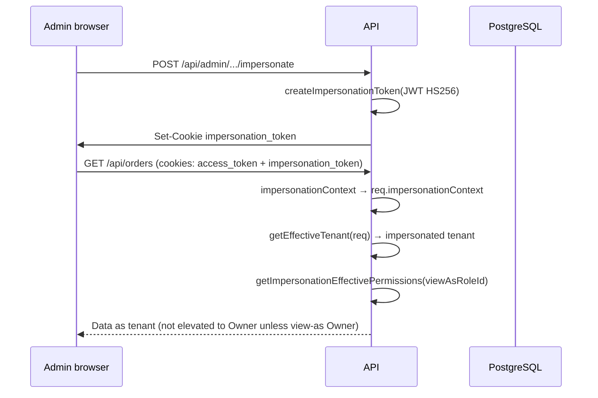

| Property    | Detail                                                                                     |
| ----------- | ------------------------------------------------------------------------------------------ |
| Cookie      | `impersonation_token`                                                                      |
| Signing     | `IMPERSONATION_SECRET`, max age `IMPERSONATION_MAX_DURATION_MINUTES` (default 60)          |
| Payload     | `adminUserId`, `tenantId`, `tenantType`, `viewAsRoleId?`                                   |
| Trust       | `getEffectiveTenant` requires `req.userData.id === adminUserId`                            |
| Permissions | View-as role permissions, or Owner fallback — **no blanket bypass** in `requirePermission` |
| Cleared on  | logout, login, successful OAuth callback                                                   |

Frontend: `useImpersonation()` + `usePermissions()` — impersonating admin uses `tenantPermissions` from `/auth/me` when hydrated.

---

<a id="frontend-enforcement"></a>

### Frontend enforcement

| Mechanism        | File                                                                                    |
| ---------------- | --------------------------------------------------------------------------------------- |
| Route guard      | `AuthGuard.tsx` — session, register completion, legal reaccept, `STAFF_PORTAL` redirect |
| Permission hooks | `usePermissions.ts` — `can()`, `canAny()`, `isWorkspaceViewer`                          |
| Nav / buttons    | `Sidebar.tsx`, feature pages (`OrdersPage`, `FulfillmentPage`, etc.)                    |
| Admin fallback   | `ADMIN_FALLBACK_PERMISSIONS` when `adminPermissions` empty (dev partial seed)           |
| Owner shortcut   | `isTenantOwner(user)` → all permissions in UI                                           |

**Important:** Hidden UI ≠ security. All mutations must pass API `requirePermission` / `requireAnyPermission`.

---

<a id="backend-enforcement"></a>

### Backend enforcement

| Layer                                                | Behavior                                                                                                          |
| ---------------------------------------------------- | ----------------------------------------------------------------------------------------------------------------- |
| `requireAuth`                                        | JWT + user load + staff portal gate                                                                               |
| `requireRole('RESTAURANT' \| 'SUPPLIER' \| 'ADMIN')` | Persona check                                                                                                     |
| `resolveTenantContext`                               | Attach `tenantContext.permissions`                                                                                |
| `resolveAdminContext`                                | Attach `adminContext.permissions`                                                                                 |
| `requirePermission(key)`                             | Owner role bypass; else tenant or admin perms                                                                     |
| `requireAnyPermission(...)`                          | OR of keys                                                                                                        |
| Domain guards                                        | `ordersRouterMutationGuard`, `staffMutationGuard`, `adminDashboardPermissionGuard`, etc. (`route-permissions.js`) |
| Plan / billing                                       | `billingAccessMiddleware`, subscription feature gates                                                             |

Example pattern (`orders.routes.js`):

```javascript
router.use(requireAuth, requireRole('RESTAURANT', 'SUPPLIER', 'ADMIN'))
router.use(resolveTenantContext)
router.use(requirePermission('ORDERS_VIEW'))
router.use(ordersRouterMutationGuard) // POST → ORDERS_CREATE | ORDERS_MANAGE
```

---

<a id="permission-resolution-algorithm"></a>

### Permission resolution algorithm

`getPermissionsForUser(userId, tenantId, tenantType)` (`permissions.js`):

1. Check Redis cache.
2. If user has `tenant_user_roles` row → use `tenant_role_permissions` for that role (**named assignment**).
3. Else merge legacy `user_role` → `role_permission` with optional org/branch expansion (supplier org roles).
4. **Never reduce access** when merging legacy + named unless named assignment exists (then legacy union is skipped for invited staff).
5. ADMIN impersonation: separate path via `getImpersonationEffectivePermissions`.

Custom roles: tenants may create non-system roles via `POST /api/roles` (`tenant-roles.routes.js`) with subset-of-assigner validation.

---

<a id="implementation-evidence"></a>

### Implementation evidence

| Claim                           | Source                                                        |
| ------------------------------- | ------------------------------------------------------------- |
| 52 permission keys              | `Object.keys(PERMISSION_KEYS).length` in `permission-keys.js` |
| 7 restaurant + 9 supplier roles | `role-matrix.js` array lengths                                |
| OIDC callback + cookies         | `auth.routes.js`, `auth.js`, `rbac.js` `setAuthCookies`       |
| Role matrix tests               | `tenant-role-matrix.test.js`                                  |
| Staff portal gate               | `staff-portal-auth.js`, `staff-portal-access.test.js`         |
| Impersonation                   | `impersonation.js`, `impersonationContext.js`                 |
| Admin role seed                 | `0042_rbac_seed_roles_permissions.sql`                        |
| `requirePermission`             | `rbac.js` lines 943–987                                       |
| Frontend parity                 | `usePermissions.ts`, `AuthGuard.tsx`                          |

<a id="key-files"></a>

#### Key files

```
apps/api/src/routes/auth.routes.js
apps/api/src/lib/auth.js
apps/api/src/lib/rbac.js
apps/api/src/lib/permissions.js
apps/api/src/lib/permission-keys.js
apps/api/src/lib/role-matrix.js
apps/api/src/lib/route-permissions.js
apps/api/src/lib/staff-portal-auth.js
apps/api/src/lib/impersonation.js
apps/api/src/middlewares/impersonationContext.js
apps/web/src/hooks/usePermissions.ts
apps/web/src/components/AuthGuard.tsx
```

---

<a id="related-docs"></a>

### Related docs

- [07-technical-architecture.md](part-vii-technical-architecture-internal-technical-reference) — session store, Redis, middleware order
- [08-database-guide.md](part-viii-database-guide-internal-technical-reference) — `tenant_roles` tables
- [docs/features/staff-portal-access.md](../features/staff-portal-access.md) — staff portal product notes
- [docs/architecture/security-baseline.md](../architecture/security-baseline.md) — CSRF, public routes

---

## Part X — Subscriptions and Plans _(Internal Technical Reference)_

<a id="part-x-subscriptions-and-plans-internal-technical-reference"></a>

Supplify monetization is **plan-driven**: every restaurant and supplier workspace has a `subscription` row joined to `subscription_plan` (limits + features JSON). Self-serve tiers are **Free Trial**, **Silver**, **Gold**, and **Platinum**. The legacy **Enterprise** tier was deactivated in migration `0066_remove_enterprise_tier.sql` and is not selectable; `normalizePlanCode()` maps `enterprise` → `platinum` for comparisons only.

Canonical plan codes: `free`, `silver`, `gold`, `platinum` (`apps/api/src/lib/plan-codes.js`).

---

<a id="plan-catalog-summary"></a>

### Plan catalog summary

| Plan       | Display name | Restaurant monthly / yearly | Supplier monthly / yearly | Notes                                                         |
| ---------- | ------------ | --------------------------- | ------------------------- | ------------------------------------------------------------- |
| `free`     | Free Trial   | $0 / $0                     | $0 / $0                   | Time-limited sandbox; Gold **feature** gates, Free **limits** |
| `silver`   | Silver       | $49 / $490                  | $49 / $490                | First paid tier (`0117_silver_tier_limits_features.sql`)      |
| `gold`     | Gold         | $149 / $1,490               | $149 / $1,490             | Core production tier (`0119_gold_tier_limits_features.sql`)   |
| `platinum` | Platinum     | $349 / $3,490               | $349 / $3,490             | High-capacity tier (`0120_platinum_tier_limits_features.sql`) |

Prices are stored on `subscription_plan.price_per_month` and `price_per_year`. Migrations **0117**, **0119**, and **0120** set limits, features, and confirm pricing for Silver/Gold/Platinum. Free-tier limits are maintained in `0145_plan_catalog_audit_sync.sql` (and runtime fallbacks in `limit-resolution.js`).

---

<a id="free-trial-gold-features-free-limits"></a>

### Free Trial: Gold features, Free limits

Free Trial is **not** a stripped-down feature tier. Runtime enforcement uses **Gold feature JSON** while **Free limit caps** apply:

1. **DB sync** — Migrations `0112_free_gold_feature_parity.sql`, `0145_plan_catalog_audit_sync.sql`, and `0175_free_trial_supplier_growth_parity.sql` copy Gold `features` onto Free rows.
2. **Runtime override** — `resolveEffectivePlanFeatures()` (`apps/api/src/lib/subscription/free-trial-plan-features.js`) loads cached Gold features whenever `plan_code === 'free'`, so API gates stay correct even if catalog rows drift.

```javascript
// free-trial-plan-features.js — Free Trial uses Gold feature gates
if (planCode !== 'free' || !tenantType) return raw
return getGoldPlanFeatures(tenantType)
```

**Sandbox expiry** — Free workspaces get `subscription.free_sandbox_expires_at` (`0113_free_sandbox_expiry.sql`, default 7 days from `platform_setting.free_sandbox_days`). After expiry, `billingAccessMiddleware` locks writes (402); most GETs remain read-only except sensitive exports/reports.

**Hidden limit** — `scheduled_order_grace_per_day` lets scheduled quick-lists overflow the daily order cap once per day on Free; it is enforced but hidden from the entitlements UI (`HIDDEN_ENTITLEMENT_LIMIT_KEYS`).

---

<a id="feature-keys"></a>

### Feature keys

Canonical keys live in `apps/api/src/lib/feature-keys.js`.

<a id="restaurant-26-keys"></a>

#### Restaurant (26 keys)

`chat`, `order_calendar`, `reports`, `smart_reorder`, `multi_branch`, `receiving_quality`, `disputes_returns`, `finance_invoices`, `quick_lists`, `inventory_management`, `waste_tracking`, `advanced_roles`, `notifications`, `api_integrations`, `support_sla`, `custom_branding`, `feature_flags_access`, `supplier_reviews`, `push_notifications`, `order_amendments`, `tenant_audit_log`, `waitlist_auto_promo`, `supplier_deals`, `supplier_deals_redeem`, `fulfillment_tools`, `ai_platform`

<a id="supplier-24-keys"></a>

#### Supplier (24 keys)

`chat`, `order_calendar`, `reports`, `multi_branch`, `warehouses`, `multi_warehouse`, `fulfillment_tools`, `fulfillment`, `driver_management`, `disputes_returns`, `finance_invoices`, `quick_lists`, `inventory_management`, `advanced_roles`, `notifications`, `api_integrations`, `support_sla`, `custom_branding`, `feature_flags_access`, `promotions`, `push_notifications`, `order_amendments`, `tenant_audit_log`, `supplier_growth`

**Enabled semantics** — A feature is **on** when its plan value is `true` or a non-empty tier string (not `false`, `disabled`, or `""`). Same rule in API (`evaluatePlanFeatureValue`) and web (`planLimits.ts`).

---

<a id="limit-keys"></a>

### Limit keys

From `apps/api/src/lib/limit-resolution.js`.

<a id="restaurant-limits-15-keys"></a>

#### Restaurant limits (15 keys)

| Key                             | Meaning                                     |
| ------------------------------- | ------------------------------------------- |
| `branches`                      | Active branch locations                     |
| `users`                         | Primary contact + `restaurant_team` rows    |
| `orders_per_day`                | `PLACED` orders today                       |
| `suppliers_per_restaurant`      | `supplier_follow` count                     |
| `restaurant_inventory_skus`     | Distinct SKUs in `restaurant_inventory`     |
| `chats_per_day`                 | Daily chat meter                            |
| `open_conversations`            | Non-archived conversations                  |
| `storage_mb`                    | Cumulative file storage                     |
| `quick_lists`                   | Quick list count                            |
| `quick_list_items`              | Items across all quick lists                |
| `scheduled_quick_lists`         | Lists with `is_scheduled = true`            |
| `scheduled_order_grace_per_day` | Hidden overflow for scheduled orders (Free) |
| `deal_redemptions_per_day`      | Supplier deal redemptions                   |
| `ai_requests_per_day`           | LLM reorder assistant calls (`0167`)        |

<a id="supplier-limits-9-keys"></a>

#### Supplier limits (9 keys)

| Key                      | Meaning                               |
| ------------------------ | ------------------------------------- |
| `branches`               | Active branch locations               |
| `warehouses`             | Active warehouses (`0` = feature off) |
| `users`                  | Supplier contact (always 1)           |
| `supplier_products_skus` | Products in catalog                   |
| `chats_per_day`          | Daily chat meter                      |
| `open_conversations`     | Non-archived conversations            |
| `storage_mb`             | Cumulative file storage               |
| `promotions`             | Non-expired promotions                |

**Unlimited** — Limit value `-1` or `null` in plan JSON means no cap (`formatPlanLimitDisplay` → `unlimited`).

**Resolution order** — `resolveEffectiveLimit()` / `resolveAllEffectiveLimits()`: plan default → plan override (`plan_limit_override`, increase-only) → tenant override (`tenant_limit_override`, increase-only) → branch/warehouse addons (`subscription-addons.js`).

**Free fallbacks** — If plan JSON omits keys on Free, `FREE_TIER_LIMIT_PATCHES` and `fillMissingFreeTierLimits()` apply canonical caps before enforcement.

---

<a id="plan-limit-tables"></a>

### Plan limit tables

Values from migrations **0117**, **0119**, **0120**, **0145** (Free), and **0167** (`ai_requests_per_day`). `-1` = unlimited.

<a id="restaurant-limits"></a>

#### Restaurant limits

| Limit                           | Free Trial | Silver |  Gold  | Platinum |
| ------------------------------- | :--------: | :----: | :----: | :------: |
| `branches`                      |     1      |   1    |   3    |    ∞     |
| `users`                         |     1      |   3    |   15   |    ∞     |
| `orders_per_day`                |     3      |   20   |  100   |    ∞     |
| `suppliers_per_restaurant`      |     1      |   5    |   30   |    ∞     |
| `restaurant_inventory_skus`     |     10     |  250   | 3,000  |    ∞     |
| `chats_per_day`                 |     3      |   30   |  500   |    ∞     |
| `open_conversations`            |     1      |   5    |   30   |    ∞     |
| `storage_mb`                    |     50     |  500   | 10,240 |  30,720  |
| `quick_lists`                   |     1      |   10   |   50   |    ∞     |
| `quick_list_items`              |     1      |  100   |  500   |    ∞     |
| `scheduled_quick_lists`         |     1      |   3    |   15   |    ∞     |
| `deal_redemptions_per_day`      |     1      |   10   |   50   |    ∞     |
| `scheduled_order_grace_per_day` |     1      |   0    |   0    |    0     |
| `ai_requests_per_day`           |     0      |   0    |   20   |   100    |

<a id="supplier-limits"></a>

#### Supplier limits

| Limit                    | Free Trial | Silver |  Gold  | Platinum |
| ------------------------ | :--------: | :----: | :----: | :------: |
| `branches`               |     1      |   1    |   3    |    ∞     |
| `warehouses`             |     0      |   1    |   3    |    ∞     |
| `users`                  |     1      |   3    |   15   |    ∞     |
| `supplier_products_skus` |     10     |  250   | 3,000  |    ∞     |
| `chats_per_day`          |     3      |   30   |  500   |    ∞     |
| `open_conversations`     |     1      |   5    |   30   |    ∞     |
| `storage_mb`             |     50     |  500   | 10,240 |  30,720  |
| `promotions`             |     1      |   3    |   25   |    ∞     |

---

<a id="restaurant-feature-plan-matrix"></a>

### Restaurant feature × plan matrix

**Free Trial column** = effective gates (Gold features via parity). ✓ = enabled; — = disabled. Tier strings are summarized in the **Tier** column for paid plans.

| Feature                 | Free Trial |        Silver         |          Gold           |               Platinum                |
| ----------------------- | :--------: | :-------------------: | :---------------------: | :-----------------------------------: |
| `chat`                  |     ✓      |   ✓ multi_supplier    |   ✓ group_chat_files    |    ✓ real_time_media_read_receipts    |
| `order_calendar`        |     ✓      |           ✓           |            ✓            |                   ✓                   |
| `reports`               |     ✓      |     ✓ basic_kpis      | ✓ usage_cost_dashboards | ✓ advanced_forecasting_custom_reports |
| `smart_reorder`         |     ✓      |           —           |   ✓ full_90day_trends   |       ✓ ai_forecast_seasonality       |
| `multi_branch`          |     ✓      |           —           |            ✓            |         ✓ central_purchasing          |
| `receiving_quality`     |     ✓      |   ✓ photos_enabled    |    ✓ quality_scoring    |    ✓ supplier_performance_reports     |
| `disputes_returns`      |     ✓      |           ✓           |            ✓            |                   ✓                   |
| `finance_invoices`      |     ✓      |   ✓ record_payments   |   ✓ expense_analytics   |     ✓ advanced_finance_dashboard      |
| `quick_lists`           |     ✓      |  ✓ automated_weekly   |     ✓ full_schedule     |         ✓ ai_smart_automation         |
| `inventory_management`  |     ✓      |      ✓ real_time      | ✓ multi_branch_tracking |         ✓ lot_expiry_tracking         |
| `waste_tracking`        |     ✓      | ✓ analytics_dashboard |  ✓ analytics_dashboard  |      ✓ cost_percentage_vs_sales       |
| `advanced_roles`        |     ✓      |           —           |            ✓            |                   ✓                   |
| `notifications`         |     ✓      |  ✓ in_app_and_email   |  ✓ email_and_whatsapp   |       ✓ email_whatsapp_webhook        |
| `api_integrations`      |     ✓      |           —           |    ✓ api_key_access     |          ✓ full_api_webhooks          |
| `support_sla`           |     ✓      |    ✓ standard_72h     |     ✓ priority_24h      |         ✓ dedicated_same_day          |
| `custom_branding`       |     ✓      |           —           |      ✓ logo_colors      |         ✓ white_label_domain          |
| `feature_flags_access`  |     ✓      |           —           |     ✓ addon_toggles     |          ✓ all_experimental           |
| `supplier_reviews`      |     ✓      |           ✓           |            ✓            |                   ✓                   |
| `push_notifications`    |     ✓      |           ✓           |            ✓            |                   ✓                   |
| `order_amendments`      |     ✓      |           ✓           |            ✓            |                   ✓                   |
| `tenant_audit_log`      |     ✓      |           —           |            ✓            |                   ✓                   |
| `waitlist_auto_promo`   |     ✓      |           —           |            ✓            |                   ✓                   |
| `supplier_deals`        |     ✓      |           ✓           |            ✓            |                   ✓                   |
| `supplier_deals_redeem` |     ✓      |           ✓           |            ✓            |                   ✓                   |
| `fulfillment_tools`     |     —      |           —           |            —            |                   —                   |
| `ai_platform`           |     ✓      |           —           |            ✓            |                   ✓                   |

> `waste_tracking` on Silver is `analytics_dashboard` per `0145` (overrides `0117` `manual_entry`). `fulfillment_tools` is intentionally off for restaurants on all tiers (`0117`–`0120`).

---

<a id="supplier-feature-plan-matrix"></a>

### Supplier feature × plan matrix

| Feature                | Free Trial |          Silver          |          Gold           |               Platinum                |
| ---------------------- | :--------: | :----------------------: | :---------------------: | :-----------------------------------: |
| `chat`                 |     ✓      |     ✓ multi_supplier     |   ✓ group_chat_files    |    ✓ real_time_media_read_receipts    |
| `order_calendar`       |     ✓      |            ✓             |            ✓            |                   ✓                   |
| `reports`              |     ✓      |       ✓ basic_kpis       | ✓ usage_cost_dashboards | ✓ advanced_forecasting_custom_reports |
| `multi_branch`         |     ✓      |            —             |            ✓            |                   ✓                   |
| `warehouses`           |     ✓      |            ✓             |            ✓            |                   ✓                   |
| `multi_warehouse`      |     ✓      |            —             |            ✓            |                   ✓                   |
| `fulfillment_tools`    |     ✓      | ✓ manual_orders_invoices |  ✓ warehouse_pick_pack  |         ✓ routing_full_suite          |
| `fulfillment`          |     ✓      |            ✓             |            ✓            |                   ✓                   |
| `driver_management`    |     ✓      |            —             |            ✓            |                   ✓                   |
| `disputes_returns`     |     ✓      |            ✓             |            ✓            |                   ✓                   |
| `finance_invoices`     |     ✓      |    ✓ record_payments     |   ✓ expense_analytics   |     ✓ advanced_finance_dashboard      |
| `quick_lists`          |     —      |            —             |            —            |                   —                   |
| `inventory_management` |     ✓      |       ✓ real_time        | ✓ multi_branch_tracking |         ✓ lot_expiry_tracking         |
| `advanced_roles`       |     ✓      |            —             |            ✓            |                   ✓                   |
| `notifications`        |     ✓      |    ✓ in_app_and_email    |  ✓ email_and_whatsapp   |       ✓ email_whatsapp_webhook        |
| `api_integrations`     |     ✓      |            —             |    ✓ api_key_access     |          ✓ full_api_webhooks          |
| `support_sla`          |     ✓      |      ✓ standard_72h      |     ✓ priority_24h      |         ✓ dedicated_same_day          |
| `custom_branding`      |     ✓      |            —             |      ✓ logo_colors      |         ✓ white_label_domain          |
| `feature_flags_access` |     ✓      |            —             |     ✓ addon_toggles     |          ✓ all_experimental           |
| `promotions`           |     ✓      |            ✓             |            ✓            |                   ✓                   |
| `push_notifications`   |     ✓      |            ✓             |            ✓            |                   ✓                   |
| `order_amendments`     |     ✓      |            ✓             |            ✓            |                   ✓                   |
| `tenant_audit_log`     |     ✓      |            —             |            ✓            |                   ✓                   |
| `supplier_growth`      |     ✓      |            ✓             |            ✓            |                   ✓                   |

> Free Trial includes `supplier_growth` via Gold parity (`0175`). `quick_lists` is not seeded on supplier plan JSON (key exists in `feature-keys.js` but remains off). `finance_invoices` on Silver+ added by `0144_supplier_finance_invoices_plan_features.sql`.

---

<a id="enforcement-architecture"></a>

### Enforcement architecture

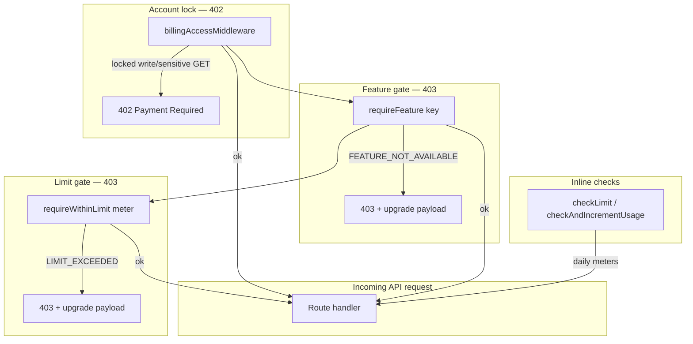

<a id="billingaccessmiddleware-402"></a>

#### `billingAccessMiddleware` (402)

File: `apps/api/src/middlewares/billingAccess.js`. Mounted globally in `server.js` after auth context, before CSRF.

| Behavior               | Detail                                                             |
| ---------------------- | ------------------------------------------------------------------ |
| **Bypass paths**       | `/api/billing`, `/api/register`, `/auth`, `/health`, `/api/public` |
| **Always-allowed GET** | `/api/subscriptions/entitlements`, `/current`, `/plans`            |
| **Admin**              | Platform `ADMIN` bypasses locks unless **impersonating** a tenant  |
| **Locked account**     | Non-GET → **402** with `buildAccountLockedError`                   |
| **Free Trial expired** | GET allowed (read-only); writes → 402                              |
| **Sensitive GET**      | `/api/reports/*`, any `*/export`, invoice PDF → 402 when locked    |
| **Failure**            | DB error → **503** `BILLING_CHECK_UNAVAILABLE`                     |

<a id="requirefeature-403"></a>

#### `requireFeature` (403)

File: `apps/api/src/lib/subscription/entitlements.js`.

- Resolves `resolveEffectivePlanFeatures()` (Free → Gold features).
- Applies tenant/global overrides via `resolveFeatureEnabled()` (`feature-flags.js`).
- Feature aliases (e.g. `fulfillment` ↔ `fulfillment_tools`) resolved when primary key is off.
- Response: `FEATURE_NOT_AVAILABLE` + `buildFeatureNotAvailablePayload()` (recommended plans, upgrade URL).
- Records `BLOCKED_FEATURE` conversion event.

**Example mounts** — `disputes.routes.js` → `disputes_returns`; `receiving.routes.js` → `receiving_quality`; `order-amendments.routes.js` → `order_amendments`; `reports.routes.js` → `reports`.

<a id="requirewithinlimit-403"></a>

#### `requireWithinLimit` (403)

Same file. Calls `checkLimit()` before handler; sets `req.planLimit` on success.

- Response: `LIMIT_EXCEEDED` + `buildLimitExceededPayload()`.
- Records `BLOCKED_LIMIT` conversion event.

**Example mounts** — `branches.routes.js` → `branches`; `warehouses.routes.js` → `warehouses`; `quick-lists.routes.js` → `quick_lists`; `promotions/supplier.js` → `promotions`.

**Atomic daily meters** — `orders_per_day`, `chats_per_day`, `ai_requests_per_day` use `checkAndIncrementUsage()` inside transactions to prevent race overshoot.

<a id="entitlements-api"></a>

#### Entitlements API

`GET /api/subscriptions/entitlements` → `getEntitlements()` returns the canonical payload:

- `plan`, `features`, `planFeatures`, `featureSources`, `limits`, `baseLimits`, `usage`, `overrides`, `addons`, `locationLimits`, `freeSandbox`, `smartReorder` (restaurant).

Cached 300s (`entitlements.js`); usage refreshed every 60s on cache hit.

---

<a id="frontend-useentitlements-and-planfeaturegates"></a>

### Frontend: `useEntitlements` and `planFeatureGates`

<a id="useentitlements"></a>

#### `useEntitlements`

File: `apps/web/src/hooks/useEntitlements.ts`.

- RTK Query `useGetEntitlementsQuery` → `GET /api/subscriptions/entitlements`.
- Skipped when impersonation context says tenant entitlements should not load (`shouldLoadTenantEntitlements`).
- Returns `{ entitlements, isLoading, error, refetch, user }`.

<a id="planfeaturegates"></a>

#### `planFeatureGates`

File: `apps/web/src/lib/planFeatureGates.ts`. Thin helpers over `isEntitlementFeatureEnabled()` from `planLimits.ts`:

| Helper                  | Feature key(s)                           |
| ----------------------- | ---------------------------------------- |
| `canUseGlobalReports`   | `reports`                                |
| `canUseFinanceInvoices` | `finance_invoices`                       |
| `canUseSupplierDeals`   | `supplier_deals`                         |
| `canUseFulfillment`     | `fulfillment` **or** `fulfillment_tools` |
| `canUseQuickLists`      | `quick_lists`                            |
| `canUseSupplierGrowth`  | `supplier_growth`                        |

**Resolution rule** (`planLimits.ts`) — checks `entitlements.features[key]` first, then `entitlements.planFeatures[key]` (important for Free Trial where `planFeatures` carries Gold tiers). Matches API `evaluatePlanFeatureValue`.

**UI consumers** — `Sidebar.tsx`, `DashboardWidgetGrid.tsx`, `FulfillmentPage.tsx`, `ReportsPage.tsx`, `InvoicesPage.tsx`, `ProductsPage.tsx`, `BranchDetailPage.tsx`, org overview pages, `BranchContext.tsx`.

When API returns 403/402, RTK base client surfaces monetization errors; `monetization` Redux slice drives upgrade modals.

---

<a id="subscription-lifecycle-brief"></a>

### Subscription lifecycle (brief)

| Concern            | Implementation                                                                       |
| ------------------ | ------------------------------------------------------------------------------------ |
| Default plan       | `ensureTenantSubscription()` creates Free if none (`plans.js`)                       |
| Org billing        | Child branches bill to org root via `resolveOrgBillingTenantId`                      |
| Pending downgrade  | `pending_plan_id` + `pending_effective_at` applied on read                           |
| Cache invalidation | `invalidateTenantSubscriptionCache()` clears sub + entitlements + billing            |
| Recommendations    | `recommendPlan()` — deterministic upsell from blocked limits/features                |
| Bronze alias       | `bronze` → `silver` (`0116_rename_bronze_to_silver.sql`, `LEGACY_PLAN_CODE_ALIASES`) |

---

<a id="source-files-quick-index"></a>

### Source files (quick index)

| Area                      | Path                                                        |
| ------------------------- | ----------------------------------------------------------- |
| Feature keys              | `apps/api/src/lib/feature-keys.js`                          |
| Limit keys & Free patches | `apps/api/src/lib/limit-resolution.js`                      |
| Plan codes                | `apps/api/src/lib/plan-codes.js`                            |
| Free → Gold features      | `apps/api/src/lib/subscription/free-trial-plan-features.js` |
| Entitlements + middleware | `apps/api/src/lib/subscription/entitlements.js`             |
| Plans & recommendations   | `apps/api/src/lib/subscription/plans.js`                    |
| Billing lock              | `apps/api/src/middlewares/billingAccess.js`                 |
| Feature flag resolution   | `apps/api/src/lib/feature-flags.js`                         |
| Web gates                 | `apps/web/src/lib/planFeatureGates.ts`, `planLimits.ts`     |
| Web hook                  | `apps/web/src/hooks/useEntitlements.ts`                     |
| Migrations                | `0117`, `0119`, `0120`, `0145`, `0167`, `0175`              |

---

## Part XI — API and Workflow Reference _(Internal Technical Reference)_

<a id="part-xi-api-and-workflow-reference-internal-technical-reference"></a>

The Supplify API is an **Express 4** application (`apps/api/src/server.js`) exposing **554 HTTP routes** as of the latest `discover-routes.mjs` inventory (`docs/audits/route-inventory.json`, generated 2026-06-17). Routes use a consistent envelope:

```json
{ "ok": true, "data": { ... }, "error": null, "requestId": "..." }
```

Errors use `ok: false` with `error.name`, `error.message`, and optional `error.details`.

---

<a id="global-request-pipeline"></a>

### Global request pipeline

```mermaid
flowchart LR
  A[Client] --> B[CORS / Helmet / Compression]
  B --> C[Session / Auth cookie]
  C --> D[requestContext + requestLogger]
  D --> E[impersonationContext]
  E --> F[activeTenantContext]
  F --> G[billingAccessMiddleware]
  G --> H[csrfProtection]
  H --> I[Route: requireAuth]
  I --> J[resolveTenantContext]
  J --> K[requirePermission / requireFeature / requireWithinLimit]
  K --> L[Handler]
```

| Stage          | Purpose                                                   |
| -------------- | --------------------------------------------------------- |
| Auth           | Keycloak OIDC — cookie session (web) or Bearer (mobile)   |
| Impersonation  | Admin “view as tenant”; billing locks still apply         |
| Billing        | 402 when subscription account locked (`billingAccess.js`) |
| CSRF           | State-changing requests; `/api/public` bypassed           |
| Tenant context | `req.tenantContext` — roles, permissions, tenant id/type  |
| Plan gates     | 403 `FEATURE_NOT_AVAILABLE` / `LIMIT_EXCEEDED`            |

**Health** — `GET /health`, `GET /ready` (DB + migration readiness).

---

<a id="route-inventory-by-mount-prefix"></a>

### Route inventory by mount prefix

Counts from `route-inventory.json` (554 total). Regenerate: `node apps/api/scripts/discover-routes.mjs`.

| Mount prefix                 | Routes | Primary domain                                               |
| ---------------------------- | -----: | ------------------------------------------------------------ |
| `/api/admin-dashboard`       |     50 | Platform admin: tenants, plans, impersonation, feature flags |
| `/api/staff`                 |     41 | Staff portal: shifts, payroll, PTO, announcements            |
| `/api/promotions`            |     32 | Deals, coupons, restaurant/supplier promotions               |
| `/api/consumer`              |     31 | Consumer loyalty app (B2C)                                   |
| `/api/supplier`              |     29 | Supplier ops namespace (products, orders, settings)          |
| `/api/public`                |     27 | Unauthenticated: registration, invitations, reservations     |
| `/api/orders`                |     25 | Order CRUD, amendments, driver tracking, calendar            |
| `/api/restaurant-inventory`  |     24 | Stock, expiry, smart reorder, waste                          |
| `/api/fulfillment`           |     20 | Board, exceptions, delivery routes                           |
| `/api/suppliers`             |     20 | Supplier discovery, profile, relationships, branding         |
| `/api/warehouses`            |     17 | Warehouse CRUD, routing, pick/pack                           |
| `/api/org`                   |     16 | Multi-branch org: branches, users, settings                  |
| `/api/restaurants`           |     16 | Restaurant profile, team, invitations                        |
| `/api/chat`                  |     14 | Conversations, support, admin                                |
| `/api/reports`               |     14 | Restaurant & supplier analytics                              |
| `/api/reservations`          |     11 | Table reservations (restaurant)                              |
| `/api/restaurant-org`        |     11 | Org-level restaurant administration                          |
| `/api/quick-lists`           |     10 | Quick lists & scheduled ordering                             |
| `/api/restaurant-finance`    |     10 | Invoices, payments, finance dashboard                        |
| `/api/disputes`              |      9 | Disputes & returns workflow                                  |
| `/api/products`              |      9 | Product catalog search & favorites                           |
| `/api/inventory`             |      8 | Supplier inventory                                           |
| `/api/quote-requests`        |      8 | RFQ / quote workflow                                         |
| `/api/billing`               |      7 | Stripe checkout, payment methods, invoices                   |
| `/api/notifications`         |      7 | In-app notifications                                         |
| `/api/restaurant-pricing`    |      7 | Contract pricing for restaurants                             |
| `/api/roles`                 |      7 | Tenant custom roles (`tenant-roles.routes.js`)               |
| `/api/subscriptions`         |      7 | Plans, entitlements, upgrades                                |
| `/api/drivers`               |      6 | Driver roster                                                |
| `/api/reviews`               |      6 | Supplier reviews                                             |
| `/api/files`                 |      5 | Presigned uploads                                            |
| `/api/invoices`              |      5 | Invoice PDF / payment                                        |
| `/api/restaurant-onboarding` |      5 | Onboarding wizard                                            |
| `/api/branches`              |      4 | Branch locations                                             |
| `/api/receiving`             |      4 | Receiving & quality                                          |
| `/api/audit`                 |      3 | Tenant activity log                                          |
| `/api/prices`                |      3 | Price lists                                                  |
| `/api/push`                  |      3 | Web push subscriptions                                       |
| `/api/admin`                 |      2 | Legacy admin                                                 |
| `/api/credit-notes`          |      2 | Credit notes                                                 |
| `/api/payments`              |      2 | Payment webhooks                                             |
| `/api/register`              |      2 | Tenant registration                                          |
| `/auth`                      |     12 | OIDC login, session, mobile refresh                          |
| `/health`, `/ready`          |      2 | Probes                                                       |
| `/api/e2e`                   |      1 | E2E helpers (non-prod)                                       |

Mount map source: `apps/api/scripts/discover-routes.mjs` → `FILE_PREFIX_OVERRIDES` and `server.js` `app.use()` calls.

---

<a id="authentication-and-tenant-routes"></a>

### Authentication and tenant routes

| Group             | Key endpoints                                                                             | Auth                                    |
| ----------------- | ----------------------------------------------------------------------------------------- | --------------------------------------- |
| **Auth**          | `POST /auth/login`, `GET /auth/session`, `POST /auth/logout`, `POST /auth/mobile/refresh` | Public / session                        |
| **Register**      | `POST /api/register/restaurant`, `POST /api/register/supplier`                            | Public                                  |
| **Subscriptions** | `GET /api/subscriptions/plans`, `/current`, `/entitlements`                               | Tenant auth                             |
| **Billing**       | `GET /api/billing/status`, `POST /api/billing/checkout`, payment methods                  | Tenant auth; always allowed when locked |
| **Roles**         | `GET/POST/PATCH/DELETE /api/roles/*`                                                      | `advanced_roles` feature + permissions  |

---

<a id="order-status-state-machine"></a>

### Order status state machine

<a id="enum-values-postgresql-orderstatus"></a>

#### Enum values (PostgreSQL `order_status`)

| Status                  | Introduced                                    | Active use                                                                   |
| ----------------------- | --------------------------------------------- | ---------------------------------------------------------------------------- |
| `DRAFT`                 | `0001_init.sql`                               | Cart / unpublished orders                                                    |
| `PLACED`                | `0001`                                        | Restaurant submitted order                                                   |
| `ACKNOWLEDGED`          | `0021_update_order_status_enum.sql`           | Supplier confirmed (replaces `CONFIRMED`)                                    |
| `PROCESSING`            | `0021`                                        | Supplier preparing / picking                                                 |
| `SHIPPED`               | `0021`                                        | Out for delivery / dispatched                                                |
| `DELIVERED`             | `0028_order_status_enhancements.sql`          | Supplier marked delivered (awaiting receiving)                               |
| `COMPLETED`             | `0001`                                        | Legacy completion; supplier path may set inventory via `handleOrderDelivery` |
| `RECEIVED_PARTIAL`      | `0028`                                        | Restaurant received &lt; ordered qty                                         |
| `RECEIVED_FULL`         | `0028`                                        | Restaurant received all qty                                                  |
| `RECEIVED_WITH_DISPUTE` | `0110_order_status_received_with_dispute.sql` | Open dispute on received order                                               |
| `INVOICED`              | `0028`                                        | Invoice issued post-receiving                                                |
| `CANCELLED`             | `0001`                                        | Cancelled by restaurant or declined by supplier                              |
| `PENDING_APPROVAL`      | `0069_approvals_budgets.sql`                  | **Legacy** — stuck orders migrated to `PLACED` (`0118`)                      |

**Removed legacy values** — `CONFIRMED` → `ACKNOWLEDGED`, `FULFILLING` → `COMPLETED` (`0021`). Approvals product removed (`0114`); `PENDING_APPROVAL` no longer assigned.

**Delivered-set** (reviews, disputes eligibility): `COMPLETED`, `DELIVERED`, `RECEIVED_PARTIAL`, `RECEIVED_FULL`, `RECEIVED_WITH_DISPUTE`, `INVOICED` (`apps/api/src/lib/order-statuses.js`).

<a id="lifecycle-diagram"></a>

#### Lifecycle diagram

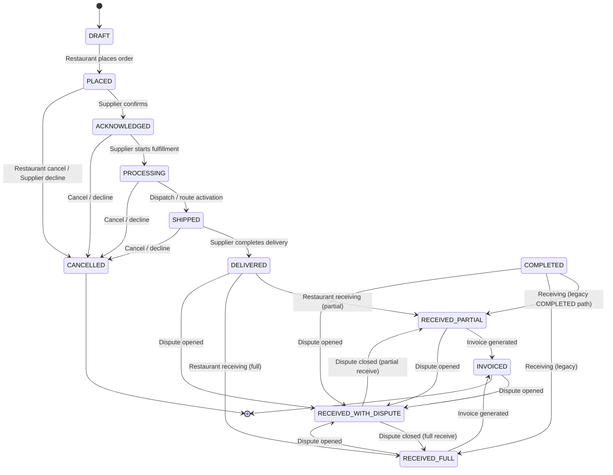

<a id="who-performs-transitions"></a>

#### Who performs transitions

| Transition                                  | Actor             | Permission / role                                     | Endpoint                                                                    |
| ------------------------------------------- | ----------------- | ----------------------------------------------------- | --------------------------------------------------------------------------- |
| → `PLACED`                                  | Restaurant        | `ORDERS_CREATE`                                       | `POST /api/orders`, quick-list checkout                                     |
| → `ACKNOWLEDGED` / `PROCESSING` / `SHIPPED` | Supplier          | `ORDERS_EDIT`                                         | `PATCH /api/orders/:id` `{ status }`                                        |
| → `DELIVERED`                               | Supplier          | `ORDERS_EDIT` or `handleOrderDelivery` on `COMPLETED` | `PATCH /api/orders/:id`                                                     |
| → `COMPLETED`                               | Supplier          | `ORDERS_EDIT`                                         | `PATCH /api/orders/:id` → triggers `handleOrderDelivery` (sets `DELIVERED`) |
| → `CANCELLED`                               | Restaurant        | Own order only                                        | `PATCH /api/orders/:id` `{ status: "CANCELLED" }`                           |
| → `CANCELLED` (decline)                     | Supplier          | `ORDERS_MANAGE` + decline reason ≥3 chars             | `PATCH /api/orders/:id`                                                     |
| → `RECEIVED_*`                              | Restaurant        | `RECEIVING_MANAGE`                                    | `POST /api/receiving/receive`                                               |
| → `RECEIVED_WITH_DISPUTE`                   | System            | On dispute create                                     | `POST /api/disputes`                                                        |
| → `INVOICED`                                | System            | On receiving complete                                 | Inside `POST /api/receiving/receive`                                        |
| Driver sub-status                           | Supplier / driver | `FULFILLMENT_MANAGE`                                  | `PATCH /api/orders/:id` `{ delivery_status }`                               |

**Supplier status whitelist** (`orders/update.js`) — Suppliers may only set: `ACKNOWLEDGED`, `PROCESSING`, `SHIPPED`, `DELIVERED`, `COMPLETED`, `CANCELLED`. Restaurants may only set `CANCELLED`.

**Delivery route eligibility** — `PLACED`, `PENDING_APPROVAL` (legacy), `ACKNOWLEDGED`, `PROCESSING`, `SHIPPED` for planned routes; dispatch on `PROCESSING` / `SHIPPED` (`delivery-route-order-statuses.js`).

---

<a id="order-workflow-key-endpoints"></a>

### Order workflow — key endpoints

| Step              | Method  | Path                                | Notes                              |
| ----------------- | ------- | ----------------------------------- | ---------------------------------- |
| List / filter     | `GET`   | `/api/orders`                       | `status`, `supplier`, date range   |
| Create            | `POST`  | `/api/orders`                       | Enforces `orders_per_day` meter    |
| Manual create     | `POST`  | `/api/orders/manual`                | Supplier-initiated                 |
| Detail            | `GET`   | `/api/orders/:id`                   | Includes amendments, dispute links |
| Update status     | `PATCH` | `/api/orders/:id`                   | Role-gated transitions above       |
| Remind supplier   | `POST`  | `/api/orders/:id/remind`            | Notification                       |
| Packing slip      | `GET`   | `/api/orders/:id/packing-slip/pdf`  | PDF export                         |
| Warehouse assign  | `POST`  | `/api/orders/:id/warehouses`        | Multi-warehouse routing            |
| Driver assign     | `POST`  | `/api/orders/:id/assign-driver`     | Driver management feature          |
| Delivery status   | `PATCH` | `/api/orders/:id/delivery-status`   | Driver lifecycle                   |
| Proof of delivery | `POST`  | `/api/orders/:id/proof-of-delivery` | Photo / signature                  |
| GPS tracking      | `GET`   | `/api/orders/:id/tracking`          | Live location                      |
| Calendar          | `GET`   | `/api/orders/calendar`              | `order_calendar` feature           |

---

<a id="receiving-workflow"></a>

### Receiving workflow

**Feature gate** — `receiving_quality` (`requireFeature` on router).

**Receivable order statuses** — `DELIVERED`, `COMPLETED` (`receiving.routes.js`).

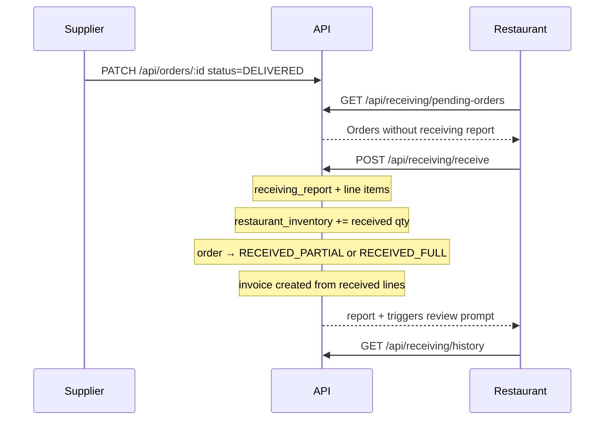

| Endpoint                                 | Method | Permission         | Description                                   |
| ---------------------------------------- | ------ | ------------------ | --------------------------------------------- |
| `/api/receiving/pending-orders`          | `GET`  | `RECEIVING_VIEW`   | Restaurant: orders awaiting receive           |
| `/api/receiving/pending-orders/supplier` | `GET`  | `ORDERS_VIEW`      | Supplier: counterpart view                    |
| `/api/receiving/receive`                 | `POST` | `RECEIVING_MANAGE` | Submit line-level quantities, quality, expiry |
| `/api/receiving/history`                 | `GET`  | `RECEIVING_VIEW`   | Past receiving reports                        |

**Receiving report statuses** — `ACCEPTED` (full qty), `PARTIAL` (under-received). Line `quality_status` drives inventory updates (`ACCEPTED` only).

**Side effects on receive** — Inventory lots (`createLotFromReceivingLine`), loyalty earn, invoice generation, reorder forecast cache invalidation, optional review notification.

---

<a id="disputes-workflow"></a>

### Disputes workflow

**Feature gate** — `disputes_returns` on all routes.

**Dispute statuses** — `open` → `under_review` → `resolved` | `rejected` | `cancelled`; `escalated` also resolvable.

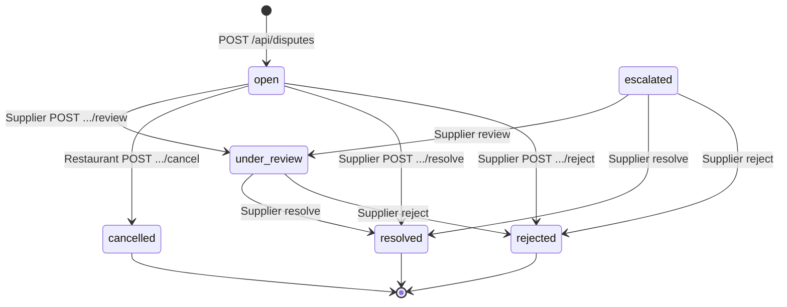

| Endpoint                        | Method | Actor      | Permission                            |
| ------------------------------- | ------ | ---------- | ------------------------------------- |
| `/api/disputes`                 | `POST` | Restaurant | `ORDERS_CREATE` or `RECEIVING_MANAGE` |
| `/api/disputes`                 | `GET`  | Restaurant | `ORDERS_VIEW`                         |
| `/api/disputes/incoming`        | `GET`  | Supplier   | `FULFILLMENT_VIEW`                    |
| `/api/disputes/:id`             | `GET`  | Both       | `ORDERS_VIEW` / `FULFILLMENT_VIEW`    |
| `/api/disputes/:id/attachments` | `POST` | Restaurant | `ORDERS_CREATE`                       |
| `/api/disputes/:id/cancel`      | `POST` | Restaurant | `open` only                           |
| `/api/disputes/:id/review`      | `POST` | Supplier   | Moves to `under_review`               |
| `/api/disputes/:id/reject`      | `POST` | Supplier   | `no_action` resolution                |
| `/api/disputes/:id/resolve`     | `POST` | Supplier   | See resolution types below            |

**Preconditions** — Order must be in `DELIVERED_ORDER_STATUSES`. One active dispute per order (`open`, `under_review`, `escalated`). On create, order → `RECEIVED_WITH_DISPUTE` when prior status is `RECEIVED_*`, `DELIVERED`, or `COMPLETED`.

**Resolution types** (`resolveDispute`) — `credit_note` (creates `credit_note` row), `replacement` (spawns replacement `customer_order`), `refund`, `no_action`. On close, order status restored to `RECEIVED_PARTIAL` or `RECEIVED_FULL` from receiving aggregates.

**Related** — `GET/POST /api/credit-notes/*`; replacement orders link `source_dispute_id`.

---

<a id="order-amendments-workflow"></a>

### Order amendments workflow

**Feature gate** — `order_amendments`. Mounted at `/api/orders/:orderId/amendments`.

**Mutable order statuses** — `PLACED`, `PENDING_APPROVAL`, `ACKNOWLEDGED`, `PROCESSING` (`order-amendments.service.js`).

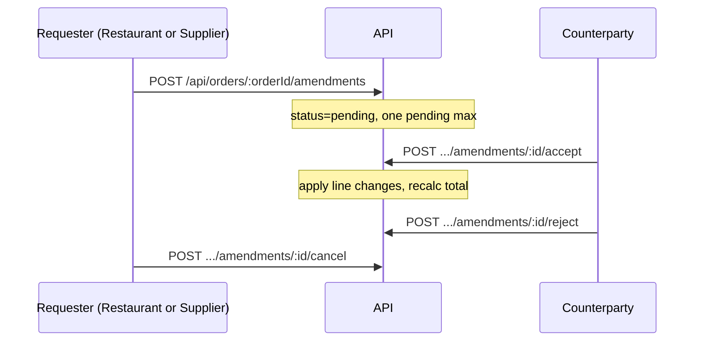

| Endpoint              | Method | Permission      | Rules                                                                                       |
| --------------------- | ------ | --------------- | ------------------------------------------------------------------------------------------- |
| `GET .../amendments`  | `GET`  | `ORDERS_VIEW`   | List amendments + items                                                                     |
| `POST .../amendments` | `POST` | `ORDERS_MANAGE` | `changeType`: quantity_change, item_substitution, item_removal, delivery_date_change, other |
| `POST .../:id/accept` | `POST` | `ORDERS_MANAGE` | Counterparty only; applies items                                                            |
| `POST .../:id/reject` | `POST` | `ORDERS_MANAGE` | Cannot reject own request                                                                   |
| `POST .../:id/cancel` | `POST` | `ORDERS_MANAGE` | Requester only while `pending`                                                              |

---

<a id="fulfillment-and-logistics-related"></a>

### Fulfillment and logistics (related)

| Prefix                        | Purpose                              |
| ----------------------------- | ------------------------------------ |
| `/api/fulfillment/board`      | Kanban-style order board             |
| `/api/fulfillment/routes`     | Delivery route planning & activation |
| `/api/fulfillment/exceptions` | Fulfillment exception log            |
| `/api/warehouses/*`           | Warehouse CRUD, pick lists, dispatch |
| `/api/drivers/*`              | Driver roster                        |

Warehouse inventory syncs on order status change via `syncWarehouseFulfillmentOnOrderStatus()` (`warehouseInventory.js`) for `ACKNOWLEDGED` / `PROCESSING` (picking) and `SHIPPED` / `COMPLETED` (dispatch).

---

<a id="other-high-traffic-route-groups"></a>

### Other high-traffic route groups

<a id="restaurant-operations"></a>

#### Restaurant operations

| Prefix                         | Capabilities                                    |
| ------------------------------ | ----------------------------------------------- |
| `/api/restaurant-inventory`    | Stock levels, expiry, waste, smart reorder / AI |
| `/api/quick-lists`             | Lists, schedules, automated order placement     |
| `/api/restaurant-finance`      | Invoice list, payments, analytics               |
| `/api/restaurant-pricing`      | Contract / negotiated pricing                   |
| `/api/restaurant-org`          | Central purchasing, org users                   |
| `/api/promotions` (restaurant) | Browse / redeem supplier deals                  |

<a id="supplier-operations"></a>

#### Supplier operations

| Prefix                       | Capabilities                                             |
| ---------------------------- | -------------------------------------------------------- |
| `/api/supplier`              | Catalog, orders, settings (`supplier-ops.routes.js`)     |
| `/api/suppliers`             | Public profile, follow, search                           |
| `/api/inventory`             | Supplier stock                                           |
| `/api/promotions` (supplier) | Create/manage deals                                      |
| `/api/supplier-growth`       | Customer import, invites (via `supplier_growth` feature) |

<a id="platform-admin"></a>

#### Platform admin

| Prefix                               | Capabilities                          |
| ------------------------------------ | ------------------------------------- |
| `/api/admin-dashboard/tenants`       | Tenant CRUD, limits, overrides        |
| `/api/admin-dashboard/plans`         | Plan catalog editing                  |
| `/api/admin-dashboard/subscriptions` | Subscription management               |
| `/api/admin-dashboard/feature-flags` | Global + per-tenant feature overrides |
| `/api/admin-dashboard/impersonate`   | Support impersonation                 |

<a id="communications"></a>

#### Communications

| Prefix                    | Capabilities                                                     |
| ------------------------- | ---------------------------------------------------------------- |
| `/api/chat/conversations` | Multi-party chat (`chats_per_day` / `open_conversations` limits) |
| `/api/notifications`      | In-app notification feed                                         |
| `/api/push`               | Web push subscription                                            |

---

<a id="error-codes-reference-workflow-related"></a>

### Error codes reference (workflow-related)

| HTTP | `error.name`            | When                                                           |
| ---- | ----------------------- | -------------------------------------------------------------- |
| 402  | Account locked          | `billingAccessMiddleware` — overdue / Free Trial expired write |
| 403  | `FEATURE_NOT_AVAILABLE` | `requireFeature`                                               |
| 403  | `LIMIT_EXCEEDED`        | `requireWithinLimit`, `checkAndIncrementUsage`                 |
| 403  | `FORBIDDEN`             | RBAC permission missing                                        |
| 409  | `CONFLICT`              | Duplicate receiving report, active dispute exists              |
| 400  | `VALIDATION_ERROR`      | Invalid status transition, Zod validation                      |

---

<a id="regenerating-route-inventory"></a>

### Regenerating route inventory

```bash
cd apps/api
node scripts/discover-routes.mjs
```

Outputs:

- `docs/audits/route-inventory.json` — machine-readable 554 routes
- `docs/audits/DEV_API_ROUTE_TEST_MATRIX.md` — QA matrix

---

<a id="source-files-workflow-index"></a>

### Source files (workflow index)

| Workflow            | Primary files                                                                            |
| ------------------- | ---------------------------------------------------------------------------------------- |
| Order CRUD & status | `apps/api/src/routes/orders/update.js`, `orders.helpers.js`, `create.js`                 |
| Receiving           | `apps/api/src/routes/receiving.routes.js`                                                |
| Disputes            | `apps/api/src/routes/disputes.routes.js`, `services/disputes.service.js`                 |
| Amendments          | `apps/api/src/routes/order-amendments.routes.js`, `services/order-amendments.service.js` |
| Driver delivery     | `apps/api/src/routes/orders-driver.routes.js`, `lib/driver-delivery.js`                  |
| Status constants    | `apps/api/src/lib/order-statuses.js`, `lib/delivery-route-order-statuses.js`             |
| Route discovery     | `apps/api/scripts/discover-routes.mjs`, `apps/api/src/server.js`                         |

---

## Part XII — Demo Scripts

<a id="part-xii-demo-scripts"></a>

**Audience:** Sales, customer success, product, and engineering presenters.  
**Environment:** Local or staging with `pnpm run seed:full` completed.  
**Evidence:** `apps/api/scripts/seed-full.mjs`, `seed-demo-users.js`, `seed-plan-tier-demos.js`, `seed-billing.js`, `seed-demo-readiness-extras.js`, `docs/audits/SUPPLIFY_DEMO_READINESS_AUDIT.md`.

---

<a id="before-you-present"></a>

### Before you present

<a id="one-command-prep"></a>

#### One-command prep

```bash
pnpm local:infra          # Postgres, Keycloak (8180), MinIO, Redis
pnpm db:migrate
pnpm run seed:full        # WARNING: wipes all restaurants/suppliers
pnpm dev                  # API + web
```

If Keycloak was down during seed:

```bash
pnpm run seed:accounts && pnpm run seed:demo-users
```

Optional deterministic data: `SEED=1337 pnpm run seed:full`.

<a id="primary-demo-accounts-gold-tier-active-billing"></a>

#### Primary demo accounts (Gold tier, active billing)

| Account                   | Password               | Tenant                 | Why use it                                                                 |
| ------------------------- | ---------------------- | ---------------------- | -------------------------------------------------------------------------- |
| `admin@supplify.com`      | `SupplifyAdmin1!`      | Platform admin         | Command center, deal approval, impersonation                               |
| `restaurant@supplify.com` | `SupplifyRestaurant1!` | Golden Fork Restaurant | **Gold**, active billing, coupon `DEMOFORK10`, expiring inventory tomorrow |
| `supplier@supplify.com`   | `SupplifySupplier1!`   | Fresh Foods Co.        | **Gold**, active billing, linked to Golden Fork, rich catalog              |

<a id="plan-tier-matrix-accounts-password-supplify1"></a>

#### Plan-tier matrix accounts (password `Supplify1!`)

| Account                                            | Plan       | Slug                        | Notes                                                                                      |
| -------------------------------------------------- | ---------- | --------------------------- | ------------------------------------------------------------------------------------------ |
| `restaurant-gold@supplify.com`                     | Gold       | `plan-demo-restaurant-gold` | **Past-due grace** after `seed:billing` — shows billing banner; use for billing story only |
| `supplier-gold@supplify.com`                       | Gold       | `plan-demo-supplier-gold`   | Clean Gold supplier for tier comparisons                                                   |
| `supplier-free@supplify.com`                       | Free Trial | `plan-demo-supplier-free`   | At **1/1 active deals** after seed (quota demo)                                            |
| `restaurant-1@test.com` … `restaurant-10@test.com` | Prod-like  | varies                      | Volume data; password `Supplify1!`                                                         |

> **Presenter tip:** For a polished Gold demo without billing noise, lead with `restaurant@supplify.com` / `supplier@supplify.com`. Use `restaurant-gold@` only when demonstrating grace-period UX.

<a id="data-seeded-by-seedfull-talking-points"></a>

#### Data seeded by `seed:full` (talking points)

- ~10 prod-like restaurants, ~50 suppliers, ~2k products, ~1.5k orders, invoices, chats, quick lists, reservations, staff, disputes, approved deals.
- Extras (`seed-demo-readiness-extras.js`): inventory expiring tomorrow, coupon `DEMOFORK10`, Free-tier supplier at promotion limit.
- **Not seeded:** driver Keycloak logins, live GPS routes, multi-warehouse stock edge cases. See backups per step.

<a id="avoid-on-live-demos"></a>

#### Avoid on live demos

| Area                                                  | Reason                                                                          |
| ----------------------------------------------------- | ------------------------------------------------------------------------------- |
| Supplier Settings → Delivery Zones / Contacts         | UI not wired (`DELIVERY_ZONES_ENABLED = false` in `supplierSettingsShared.tsx`) |
| Restaurant finance → period statement opening balance | Hardcoded `0` (`restaurant-finance.routes.js:795`)                              |
| Dashboard 7d/30d/90d selector                         | Visual only; spend trend is fixed 30-day                                        |
| Creating a **new** deal without pre-approving         | New deals start `pending_approval` until admin approves                         |

---

<a id="step-template-used-below"></a>

### Step template (used below)

Each step lists: **Screen**, **User**, **Clicks**, **Narration**, **Business value**, **Expected result**, **Backup**, **Prep data**.

---

<a id="5-minute-executive-demo"></a>

### 5-minute executive demo

**Goal:** Platform vision in one pass — marketplace, fulfillment, control plane.  
**Logins prepared:** admin, restaurant@, supplier@ (three browser profiles or incognito tabs).

| #   | Screen             | User       | Clicks                                                                              | Narration                                                                             | Business value                        | Expected result                                                                         | Backup                                                      | Prep                                               |
| --- | ------------------ | ---------- | ----------------------------------------------------------------------------------- | ------------------------------------------------------------------------------------- | ------------------------------------- | --------------------------------------------------------------------------------------- | ----------------------------------------------------------- | -------------------------------------------------- |
| 1   | `/login`           | Presenter  | Sign in with Keycloak → `restaurant@supplify.com`                                   | "Restaurants discover suppliers, build carts, and place B2B orders in one workspace." | Reduces phone/email ordering chaos    | Lands on Command Center or Dashboard; sidebar shows OPERATIONS (Orders, Products, Cart) | Use `restaurant-gold@` + narrate billing banner             | `seed:full`                                        |
| 2   | `/app/products`    | Restaurant | Open **Products** → filter/search → open one SKU                                    | "Contract pricing and catalog search replace spreadsheets."                           | Price transparency, faster purchasing | Product list loads; "Your price" badge if contract price exists                         | Show **Suppliers** → one supplier detail                    | Fresh Foods products linked                        |
| 3   | `/app/cart`        | Restaurant | **Cart** → review lines → **Place order** (do not need full checkout if time-tight) | "One click places the PO; supplier gets notified instantly."                          | Cuts order-to-ack time                | Order created `PLACED`; redirect/toast success                                          | Open existing order from **Orders**                         | Cart may already have items from prior seed orders |
| 4   | `/login` (new tab) | Supplier   | `supplier@supplify.com` → **Orders** → open newest `PLACED` order → **Accept**      | "Suppliers acknowledge, fulfill, and invoice without leaving the platform."           | Supplier ops on one screen            | Status → `ACKNOWLEDGED` or processing path visible                                      | Show **Fulfillment** board with existing `PROCESSING` order | Pending orders in seed data                        |
| 5   | `/login` (new tab) | Admin      | `admin@supplify.com` → `/app/admin` **Overview**                                    | "We govern tenants, plans, growth, and compliance from a single command center."      | SaaS operator control                 | KPI cards populate; Activity feed non-empty after seed                                  | **Tenants** tab only if Overview empty                      | Admin Keycloak role                                |

**Close:** "Supplify connects restaurant procurement to supplier fulfillment with plan-based monetization and platform oversight."

---

<a id="15-minute-standard-demo"></a>

### 15-minute standard demo

**Goal:** End-to-end B2B order + money + chat.  
**Primary path:** restaurant@ → supplier@ → admin@ (deals optional).

| #   | Screen                                    | User       | Clicks                                                                         | Narration                                                        | Business value                        | Expected result                               | Backup                                 | Prep                                     |
| --- | ----------------------------------------- | ---------- | ------------------------------------------------------------------------------ | ---------------------------------------------------------------- | ------------------------------------- | --------------------------------------------- | -------------------------------------- | ---------------------------------------- |
| 1   | `/app/command-center` or `/app/dashboard` | Restaurant | Sign in → overview                                                             | "Command center surfaces spend, low stock, and pending orders."  | Executive visibility for ops managers | Widgets load; pending order badge on sidebar  | Skip to **Orders** if dashboard slow   | Gold entitlements active                 |
| 2   | `/app/suppliers`                          | Restaurant | **Suppliers** → show Fresh Foods connected                                     | "Restaurants follow suppliers; limits scale by plan."            | Curated supplier network              | Follow relationship visible                   | Use **Products** with supplier filter  | `restaurant_supplier_follow` seeded      |
| 3   | `/app/deals`                              | Restaurant | **Deals** → open active promotion                                              | "Suppliers run campaigns; restaurants redeem with daily caps."   | Promotional pull-through              | Active deals list; redemption UI              | Mention admin approval workflow        | `seed-feature-demos` + approved deals    |
| 4   | `/app/cart`                               | Restaurant | Add 2–3 SKUs → apply coupon `DEMOFORK10` if shown → **Place order**            | "Deals and contract prices apply at checkout."                   | Margin protection + promos            | Order `PLACED`; deal redemption recorded      | Place without coupon                   | Coupon from `seed-demo-readiness-extras` |
| 5   | `/app/orders/:id`                         | Restaurant | Open new order → **Tracking** panel (if shipped)                               | "Restaurants see delivery ETA and driver location when enabled." | Delivery confidence                   | Tracking card or status timeline              | Narrate GPS env flag if no live route  | `GPS_TRACKING_ENABLED` default true      |
| 6   | `/app/orders`                             | Supplier   | Sign in supplier → filter **PLACED** → **Accept**                              | "Inbox replaces email POs."                                      | Faster response SLA                   | Status updates; notification to restaurant    | Show already-`ACKNOWLEDGED` order      | 60s polling on orders                    |
| 7   | `/app/fulfillment`                        | Supplier   | **Fulfillment** → dispatch board → assign driver (or show existing assignment) | "Warehouse teams batch routes and assign drivers."               | Last-mile efficiency                  | Board shows assignments; driver column        | Narrate driver mobile app parity       | Fulfillment feature on Gold              |
| 8   | `/app/receiving`                          | Restaurant | **Receiving** → select delivered order → confirm quantities                    | "Receiving closes the loop and triggers invoicing."              | Accurate goods-in                     | `RECEIVED_FULL` or partial path               | Show pre-received order in list        | Receiving orders in seed                 |
| 9   | `/app/invoices`                           | Restaurant | **Invoices** → open `ISSUED` invoice                                           | "Finance sees AP in one ledger."                                 | AP automation                         | Invoice lines match order                     | Supplier **Invoices** receivables view | ~500 invoices seeded                     |
| 10  | `/app/chat`                               | Both       | Restaurant **Chat** → open Fresh Foods thread → send message                   | "Contextual messaging beats WhatsApp chaos."                     | Fewer order errors                    | Message appears; typing/realtime if socket up | Refresh once if socket delayed         | `seed:chats`                             |
| 11  | `/app/admin`                              | Admin      | **Deals** tab → show approved vs pending                                       | "Platform approves supplier promotions before they go live."     | Brand/trust control                   | Filter pending/approved                       | **Plans** tab if no pending deals      | Admin `ADMIN_GROWTH`                     |

---

<a id="30-minute-full-demo"></a>

### 30-minute full demo

**Goal:** Standard demo plus inventory, reservations, growth, RBAC, and ops. Add **+15 min** after step 11 above.

| #   | Screen                      | User       | Clicks                                                  | Narration                                                    | Business value                 | Expected result                    | Backup                                                        | Prep                                     |
| --- | --------------------------- | ---------- | ------------------------------------------------------- | ------------------------------------------------------------ | ------------------------------ | ---------------------------------- | ------------------------------------------------------------- | ---------------------------------------- |
| 12  | `/app/restaurant-inventory` | Restaurant | **Inventory** → **Expiry** tab                          | "Expiry alerts prevent waste before service."                | Food cost control              | Item expiring tomorrow highlighted | Dashboard expiry summary widget                               | `seed-demo-readiness-extras`             |
| 13  | `/app/quick-lists`          | Restaurant | **Ordering Lists** → open list → **Order from list**    | "Templates turn weekly buying into one click."               | Purchaser productivity         | Quick list → cart prefill          | Scheduled list narrative only                                 | `seed:quick-lists`                       |
| 14  | `/app/reservations`         | Restaurant | **Reservations** → floor board                          | "FOH runs on the same platform as back-of-house buying."     | Unified hospitality stack      | Tables/slots visible               | Public `/reserve/:slug` in second window                      | Reservations in prodlike seed            |
| 15  | `/app/customer-growth`      | Supplier   | **Customer Growth** → metrics + import card             | "Suppliers acquire restaurants via CSV, invites, referrals." | Supplier-led growth            | KPI widgets; import history        | Narrate `/register?ref=` flow                                 | `supplier_growth` on Gold                |
| 16  | `/app/promotions`           | Supplier   | **Deals** → create draft (optional)                     | "New deals enter compliance review."                         | Controlled promos              | Status `pending_approval`          | Show existing active deal instead                             | Don't submit if no admin follow-up       |
| 17  | `/app/admin` → Usage        | Admin      | Search `plan-demo-supplier-free` → **Usage & quotas**   | "Free tier hits promotion caps — upgrade path is visible."   | Conversion funnel              | `1/1` active deals                 | **Limits** override demo                                      | `seed-demo-readiness-extras`             |
| 18  | `/app/admin` → Operations   | Admin      | **Operations** → active deliveries / fulfillment issues | "Ops sees live logistics health."                            | NOC-style visibility           | Panels load or empty state         | **Health** tab cron status                                    | `GET /api/admin-dashboard/operational/*` |
| 19  | `/app/settings` → Team      | Restaurant | **Settings** → **Team** → show roles                    | "Granular RBAC: purchaser vs receiving vs accountant."       | Least privilege                | Role matrix visible                | Mention `restaurant-gold-manager@` if `seed:tier-catalog` run | 7 restaurant system roles                |
| 20  | `/app/disputes`             | Restaurant | **Disputes** → open active dispute                      | "Quality issues become structured workflows, not arguments." | Dispute resolution audit trail | Dispute detail with status         | Supplier incoming disputes mirror                             | `seed-feature-demos`                     |

---

<a id="restaurant-only-demo-12-minutes"></a>

### Restaurant-only demo (12 minutes)

**Login:** `restaurant@supplify.com` / `SupplifyRestaurant1!`

| #   | Screen                      | User             | Clicks                             | Narration                                 | Business value    | Expected result         | Backup                                   | Prep               |
| --- | --------------------------- | ---------------- | ---------------------------------- | ----------------------------------------- | ----------------- | ----------------------- | ---------------------------------------- | ------------------ |
| 1   | `/app/dashboard`            | Restaurant Owner | Sign in                            | "Your purchasing cockpit."                | Visibility        | Dashboard KPIs          | Command center                           | Gold active        |
| 2   | `/app/products`             | Purchaser        | Search → add to cart               | "Browse all connected suppliers."         | Assortment        | Cart badge updates      | **My Prices** for contracts              | Catalog seeded     |
| 3   | `/app/deals`                | Purchaser        | Redeem/view deal                   | "Save on promoted SKUs."                  | COGS              | Deal applied at cart    | Skip if empty                            | Approved deals     |
| 4   | `/app/cart`                 | Purchaser        | Place order                        | "PO in seconds."                          | Speed             | `PLACED` order          | Use quick list                           | —                  |
| 5   | `/app/orders`               | Manager          | Track status                       | "No more calling suppliers."              | Accountability    | Timeline updates        | Open seeded `DELIVERED` order            | —                  |
| 6   | `/app/receiving`            | Receiving Staff  | Receive shipment                   | "Scan-verify quantities."                 | Accuracy          | Receiving complete      | Photo upload if `receiving_quality`      | —                  |
| 7   | `/app/invoices`             | Accountant       | Open invoice → record payment view | "AP ready for export."                    | Finance           | Invoice `ISSUED`/`PAID` | Avoid period statement                   | —                  |
| 8   | `/app/chat`                 | Purchaser        | Message supplier                   | "Clarify substitutions in-thread."        | Fewer errors      | Message sent            | —                                        | Chat thread exists |
| 9   | `/app/restaurant-inventory` | Manager          | Expiry + par levels                | "Stock ties to what you actually bought." | Waste reduction   | Expiry row tomorrow     | —                                        | Extras seed        |
| 10  | `/app/settings`             | Owner            | Plan & entitlements                | "Upgrade when you outgrow limits."        | Expansion revenue | Gold plan shown         | Compare `restaurant-free@` in second tab | —                  |

---

<a id="supplier-only-demo-12-minutes"></a>

### Supplier-only demo (12 minutes)

**Login:** `supplier@supplify.com` / `SupplifySupplier1!`

| #   | Screen                   | User               | Clicks                         | Narration                                    | Business value     | Expected result              | Backup                                  | Prep                   |
| --- | ------------------------ | ------------------ | ------------------------------ | -------------------------------------------- | ------------------ | ---------------------------- | --------------------------------------- | ---------------------- |
| 1   | `/app/command-center`    | Supplier Manager   | Sign in                        | "Revenue, at-risk orders, fulfillment load." | Supplier exec view | KPIs render                  | Dashboard                               | —                      |
| 2   | `/app/products`          | Catalog Manager    | Open SKU → edit price          | "Single catalog feeds all restaurants."      | Catalog truth      | Save succeeds                | CSV import narrative                    | Products seeded        |
| 3   | `/app/contract-pricing`  | Catalog Manager    | Show restaurant-specific price | "Negotiated rates per account."              | Account management | Contract row for Golden Fork | —                                       | —                      |
| 4   | `/app/orders`            | Order Fulfillment  | Accept/decline demo            | "Structured decline reasons."                | Quality feedback   | Status change                | Show declined order in seed             | —                      |
| 5   | `/app/fulfillment`       | Warehouse Manager  | Dispatch board                 | "Pick, pack, route."                         | Throughput         | Assignments visible          | Routes tab                              | —                      |
| 6   | `/app/invoices`          | Accountant         | Receivables → record payment   | "AR without QuickBooks export hell."         | Cash application   | Payment recorded             | Credit note via dispute                 | —                      |
| 7   | `/app/promotions`        | Promotions Manager | Active deal                    | "Growth through promotions."                 | Revenue lift       | Active promotion             | Locked card on Free tier account        | —                      |
| 8   | `/app/customer-growth`   | Manager            | Invite link / CSV              | "Acquire net-new restaurants."               | Pipeline           | Growth dashboard             | —                                       | Gold `supplier_growth` |
| 9   | `/app/restaurants`       | Manager            | Connected restaurants          | "CRM for your buyer base."                   | Relationship mgmt  | Golden Fork listed           | —                                       | Follow seeded          |
| 10  | `/app/supplier-settings` | Owner              | Profile, warehouses, team      | "Configure org without IT."                  | Self-serve         | Tabs load                    | **Do not** open Delivery Zones/Contacts | Warehouses API-backed  |

---

<a id="operations-platform-admin-demo-15-minutes"></a>

### Operations / platform admin demo (15 minutes)

**Login:** `admin@supplify.com` / `SupplifyAdmin1!`

| #   | Screen                       | User           | Clicks                                     | Narration                                | Business value       | Expected result                      | Backup                                     | Prep                                    |
| --- | ---------------------------- | -------------- | ------------------------------------------ | ---------------------------------------- | -------------------- | ------------------------------------ | ------------------------------------------ | --------------------------------------- |
| 1   | `/app/admin/overview`        | Platform admin | Sign in → Overview                         | "Health of the marketplace."             | Investor/ops metrics | KPI cards                            | Activity tab                               | `ADMIN_ACCESS`                          |
| 2   | `/app/admin/tenants`         | Admin          | Filter `ACTIVE` / `TRIALING`               | "Every tenant at a glance."              | Support efficiency   | Paginated directory                  | Supplier/restaurant portals                | Seeded tenants                          |
| 3   | `/app/admin/suppliers`       | Admin          | Open supplier row → impersonate (optional) | "Support sees exactly what they see."    | Faster tickets       | Impersonation banner on web          | Narrate only if policy forbids impersonate | `POST /api/admin-dashboard/impersonate` |
| 4   | `/app/admin/plans`           | Admin          | Edit Free Trial days (7–90) → save         | "Tune sandbox without deploy."           | Product ops          | PATCH succeeds                       | Revert after demo                          | Default 30 days                         |
| 5   | `/app/admin/subscriptions`   | Admin          | Find `restaurant-gold@` → show past due    | "Grace before lockout."                  | Revenue protection   | Past due + days left                 | Unlock action narrative                    | `seed-billing.js`                       |
| 6   | `/app/admin/limits`          | Admin          | Tenant override demo (narrate)             | "Enterprise deals without new plan SKU." | Flexibility          | Effective limit preview              | Read-only if no permission                 | `ADMIN_PLANS`                           |
| 7   | `/app/admin/deals`           | Admin          | Approve pending promotion                  | "Compliance gate for public deals."      | Trust & safety       | Deal → active                        | Show already-approved                      | —                                       |
| 8   | `/app/admin/operations`      | Admin          | Active deliveries, email logs              | "Run the airline."                       | Incident response    | Panels or empty states               | Health tab                                 | Operational APIs                        |
| 9   | `/app/admin/audit`           | Admin          | Audit log search                           | "Who changed what."                      | SOC narrative        | Rows after impersonation/plan change | Tenant audit log on Gold restaurant        | —                                       |
| 10  | `/app/admin/growth-settings` | Admin          | Referral discount fields                   | "Growth program knobs."                  | CAC/LTV tuning       | GET/PATCH growth settings            | —                                          | `0169` migration                        |

---

<a id="admin-demo-finance-governance-focus-10-minutes"></a>

### Admin demo (finance + governance focus, 10 minutes)

Subset for CFO/platform stakeholders — steps 1, 5, 6, 7, 9 from Operations demo, plus:

| #   | Screen                     | User          | Clicks                             | Narration                    | Business value        | Expected result                 | Backup                | Prep            |
| --- | -------------------------- | ------------- | ---------------------------------- | ---------------------------- | --------------------- | ------------------------------- | --------------------- | --------------- |
| A   | `/app/admin/finance`       | Admin Finance | Financial overview                 | "MRR, churn, overdue."       | Board reporting       | Charts load                     | Conversion stats      | `ADMIN_FINANCE` |
| B   | `/app/admin/subscriptions` | Admin         | Preview plan change                | "Safe plan migrations."      | Expansion/contraction | Preview modal                   | —                     | —               |
| C   | `/app/admin/feature-flags` | Admin Growth  | Toggle feature flag (narrate risk) | "Kill switches for rollout." | Risk reduction        | List loads; avoid mutating prod | Read-only walkthrough | —               |

---

<a id="driver-logistics-add-on-5-minutes"></a>

### Driver / logistics add-on (5 minutes)

**Note:** `seed:full` does **not** create driver Keycloak users. Prep manually or use fulfillment view as Warehouse Manager.

| #   | Screen                             | User           | Clicks                                                             | Narration                                      | Business value     | Expected result            | Backup                                   | Prep                        |
| --- | ---------------------------------- | -------------- | ------------------------------------------------------------------ | ---------------------------------------------- | ------------------ | -------------------------- | ---------------------------------------- | --------------------------- |
| 1   | `/app/supplier-settings` → Drivers | Supplier Owner | Invite driver email (or use existing team member with Driver role) | "Drivers get a minimal UI — only their route." | Security isolation | Driver role assigned       | **Fulfillment** board as Manager instead | `driver_management` feature |
| 2   | `/app/driver-deliveries`           | Driver         | Sign in as driver user → **My Deliveries**                         | "Mobile-first last mile."                      | Proof of delivery  | Stop list + status buttons | Narrate mobile app                       | `DRIVER_DELIVERIES_*` perms |
| 3   | `/app/orders/:id`                  | Restaurant     | Tracking map on in-transit order                                   | "Buyers see ETA, not phone calls."             | CX                 | Map or stale badge ≥5 min  | Mention `GPS_STALE_AFTER_SECONDS=300`    | Env `GPS_TRACKING_ENABLED`  |

---

<a id="rehearsal-checklist-day-before"></a>

### Rehearsal checklist (day before)

- [ ] `seed:full` completes; Keycloak users exist
- [ ] `restaurant@` / `supplier@` login without `/login?expired=true`
- [ ] Admin Overview KPIs non-empty
- [ ] At least one `PLACED` order to accept live
- [ ] Coupon `DEMOFORK10` works on Golden Fork cart
- [ ] Chat message round-trip
- [ ] DevTools: no red errors on scripted path
- [ ] Mobile width: sidebar collapses (`Sidebar.mobile.test.tsx` behavior)

---

<a id="related-docs"></a>

### Related docs

- [02-complete-product-guide.md](part-ii-complete-product-guide) — domain reference
- [06-admin-onboarding.md](part-vi-platform-admin-onboarding-guide) — admin tab detail
- [SUPPLIFY_DEMO_READINESS_AUDIT.md](../audits/SUPPLIFY_DEMO_READINESS_AUDIT.md) — known gaps
- [13-acceptance-criteria.md](part-xiii-acceptance-criteria) — pass/fail definitions

---

## Part XIII — Acceptance Criteria

<a id="part-xiii-acceptance-criteria"></a>

**Audience:** QA, product owners, implementation engineers, release managers.  
**Purpose:** Pass/fail definitions for every major Supplify capability.  
**Evidence base:** `apps/api/src/routes/`, `apps/web/src/pages/`, `apps/api/src/lib/permission-keys.js`, `apps/api/src/lib/feature-keys.js`, `tests/e2e/suites/`, `docs/audits/route-inventory.json` (554 routes).

**Status legend:** `Shipped` = production-intent in main branch; `Partial` = known gaps documented; `Planned` = not in codebase.

---

<a id="1-authentication-session-oidc"></a>

### 1. Authentication & session (OIDC)

| Field             | Criteria                                                                                                       |
| ----------------- | -------------------------------------------------------------------------------------------------------------- |
| **Feature**       | Keycloak OIDC login, session cookies, logout                                                                   |
| **Preconditions** | Keycloak reachable; `KEYCLOAK_*` env aligned; realm `Supplify`                                                 |
| **Role**          | Any platform role                                                                                              |
| **Plan**          | Any                                                                                                            |
| **Success path**  | `GET /auth/login` → Keycloak → `GET /auth/callback` → cookies set → `GET /auth/me` 200 with user + permissions |
| **Alternatives**  | Bearer token (mobile); `POST /auth/refresh` on expired access token                                            |
| **Validation**    | Browser lands `/app/*`; `access_token` httpOnly cookie; logout clears cookies + Keycloak end-session           |
| **Permissions**   | N/A (pre-auth)                                                                                                 |
| **API**           | `auth.routes.js`: login, callback, logout, me, refresh, session                                                |
| **UI**            | `/login`, `AuthGuard`, redirect `?expired=true`                                                                |
| **DB**            | `app_user` upsert on first `/auth/me` via `upsertUser()`                                                       |
| **Notifications** | N/A                                                                                                            |
| **Error cases**   | Invalid state → redirect `/login?error=callback_failed`; expired JWT → refresh or redirect expired             |
| **Security**      | OAuth state in session; CSRF on mutations; JWT verified via JWKS                                               |
| **Mobile**        | PKCE public client; Bearer auth skips CSRF (`csrf.test.js`)                                                    |
| **Test coverage** | `tests/e2e/suites/critical_e2e/auth.spec.ts`; `apps/api/src/lib/mobile-auth.integration.test.js`               |
| **Status**        | Shipped                                                                                                        |

---

<a id="2-tenant-registration-activation"></a>

### 2. Tenant registration & activation

| Field             | Criteria                                                                                                   |
| ----------------- | ---------------------------------------------------------------------------------------------------------- |
| **Feature**       | Self-serve org registration and account activation                                                         |
| **Preconditions** | Keycloak registration enabled; legal policies seeded                                                       |
| **Role**          | `PENDING` → `RESTAURANT` or `SUPPLIER`                                                                     |
| **Plan**          | Free Trial default; `lock_reason = pending_activation` until activation                                    |
| **Success path**  | `/register/complete` → tenant + subscription + system roles → Free checkout or paid billing → lock cleared |
| **Alternatives**  | Admin-created tenant; referral `?ref=` token                                                               |
| **Validation**    | `GET /api/subscriptions/current` shows active; writes allowed (not 402)                                    |
| **Permissions**   | Owner role auto-assigned                                                                                   |
| **API**           | `register.routes.js`, `billing.routes.js`                                                                  |
| **UI**            | `RegisterCompletePage`, `AccountActivationPage`                                                            |
| **DB**            | `restaurant`/`supplier`, `subscription`, `tenant_roles`, `tenant_user_roles`                               |
| **Notifications** | Welcome email (SMTP configured)                                                                            |
| **Error cases**   | Duplicate slug; billing failure leaves lock; 402 on writes when locked                                     |
| **Security**      | CSRF; rate limits on public routes                                                                         |
| **Mobile**        | Registration via web; mobile uses existing accounts                                                        |
| **Test coverage** | `register-account` tests; e2e partial                                                                      |
| **Status**        | Shipped                                                                                                    |

---

<a id="3-rbac-restaurant-workspace-roles"></a>

### 3. RBAC — restaurant workspace roles

| Field             | Criteria                                                                          |
| ----------------- | --------------------------------------------------------------------------------- |
| **Feature**       | Seven system roles with permission keys                                           |
| **Preconditions** | Tenant roles synced via `ensureTenantSystemRoles()`                               |
| **Role**          | Owner, Manager, Purchaser, Receiving, Accountant, Viewer, FOH                     |
| **Plan**          | `advanced_roles` for custom roles (Gold+)                                         |
| **Success path**  | User invited → role assigned → sidebar/API match matrix                           |
| **Alternatives**  | Custom tenant role with permission subset                                         |
| **Validation**    | Purchaser: `ORDERS_CREATE` yes, `INVOICES_MANAGE` no; API returns 403 when denied |
| **Permissions**   | 52 keys in `permission-keys.js`; `_MANAGE` implies `_VIEW`                        |
| **API**           | `requirePermission` on all mutating routes                                        |
| **UI**            | `RequirePermission`, `Sidebar` filtered by `navItemAllowed`                       |
| **DB**            | `tenant_role_permissions`, `tenant_user_roles`                                    |
| **Notifications** | Invite email on team add                                                          |
| **Error cases**   | Last owner demotion edge case (documented gap)                                    |
| **Security**      | Server-side enforcement mandatory; UI mirrors only                                |
| **Mobile**        | Same permission payload in `/auth/me`                                             |
| **Test coverage** | `rbac-full-app.test.js`; `tests/e2e/suites/critical_e2e/rbac.spec.ts`             |
| **Status**        | Shipped                                                                           |

---

<a id="4-rbac-supplier-workspace-roles"></a>

### 4. RBAC — supplier workspace roles

| Field             | Criteria                                                                  |
| ----------------- | ------------------------------------------------------------------------- |
| **Feature**       | Nine supplier system roles including Driver isolation                     |
| **Preconditions** | Driver user linked in team/drivers                                        |
| **Role**          | Driver sees only `DRIVER_DELIVERIES_*`                                    |
| **Plan**          | `driver_management`, `fulfillment`                                        |
| **Success path**  | Driver login → `/app/driver-deliveries` only; status updates allowed enum |
| **Alternatives**  | Warehouse Manager sees fulfillment board                                  |
| **Validation**    | Driver cannot access `/app/products` (403 or hidden nav)                  |
| **Permissions**   | `driver-rbac.js` `DRIVER_ALLOWED_STATUS_UPDATES`                          |
| **API**           | `fulfillment.routes.js`, `drivers.routes.js`                              |
| **UI**            | Driver sidebar single item (`sidebarNavConfig.ts`)                        |
| **DB**            | `tenant_user_roles`, driver assignment tables                             |
| **Notifications** | Assignment notifications to driver                                        |
| **Error cases**   | Invalid status transition rejected                                        |
| **Security**      | Driver scoped to assigned routes only                                     |
| **Mobile**        | Driver flows in `supplify-mobile`                                         |
| **Test coverage** | `driver-rbac` tests; `drivers.routes.test.js`                             |
| **Status**        | Shipped                                                                   |

---

<a id="5-subscriptions-plan-enforcement"></a>

### 5. Subscriptions & plan enforcement

| Field             | Criteria                                                                      |
| ----------------- | ----------------------------------------------------------------------------- |
| **Feature**       | Plan features and limits enforced at runtime                                  |
| **Preconditions** | `subscription` + `subscription_plan` rows                                     |
| **Role**          | Tenant member                                                                 |
| **Plan**          | free, silver, gold, platinum per `plan-codes.js`                              |
| **Success path**  | Action within limit → 200; feature on → UI visible                            |
| **Alternatives**  | Admin limit override (increase-only); branch addons                           |
| **Validation**    | `GET /api/subscriptions/usage/:meterType`; 402 when billing locked            |
| **Permissions**   | `SUBSCRIPTIONS_VIEW` / `SUBSCRIPTIONS_MANAGE` for billing UI                  |
| **API**           | `requireFeature()`, `checkPlanLimit()`, `billingAccessMiddleware`             |
| **UI**            | `FeatureLockedCard`, `UpgradeModal`, usage banners                            |
| **DB**            | `subscription`, `plan_limit_override`, `tenant_limit_override`                |
| **Notifications** | Trial ending emails (`trial-ending-soon.job`)                                 |
| **Error cases**   | Free sandbox expired → read-only; past due grace → banner                     |
| **Security**      | Impersonation does not bypass billing lock                                    |
| **Mobile**        | Plan gates in mobile guards                                                   |
| **Test coverage** | `subscription-limits.spec.ts`; `plan-enforcement` tests; `verify-tier-matrix` |
| **Status**        | Shipped                                                                       |

---

<a id="6-supplier-catalog-products"></a>

### 6. Supplier catalog & products

| Field             | Criteria                                                                       |
| ----------------- | ------------------------------------------------------------------------------ |
| **Feature**       | Product CRUD, CSV import, image ZIP import                                     |
| **Preconditions** | Supplier tenant; `supplier_products_skus` headroom                             |
| **Role**          | Catalog Manager or Owner                                                       |
| **Plan**          | Catalog always; storage `storage_mb` for images                                |
| **Success path**  | Create/edit product → visible in `GET /api/products` for connected restaurants |
| **Alternatives**  | CSV bulk; async ZIP import job (`0168`)                                        |
| **Validation**    | SKU unique per supplier; image thumb URL populated                             |
| **Permissions**   | `CATALOG_VIEW`, `CATALOG_EDIT`, `CATALOG_MANAGE`                               |
| **API**           | `products.routes.js`                                                           |
| **UI**            | `ProductsPage`, `ProductImageImportDialog`                                     |
| **DB**            | `product`, `catalog`, `catalog_image_import_job`                               |
| **Notifications** | Import job completion (in-app)                                                 |
| **Error cases**   | Limit exceeded → 402/403 with upgrade CTA; bad CSV row errors                  |
| **Security**      | Supplier-scoped queries only                                                   |
| **Mobile**        | Product browse parity                                                          |
| **Test coverage** | `products.routes.test.js`; e2e `catalog.spec.ts`                               |
| **Status**        | Shipped                                                                        |

---

<a id="7-contract-pricing"></a>

### 7. Contract pricing

| Field             | Criteria                                                                   |
| ----------------- | -------------------------------------------------------------------------- |
| **Feature**       | Per-restaurant negotiated prices                                           |
| **Preconditions** | Restaurant–supplier relationship                                           |
| **Role**          | Supplier sets; Restaurant views                                            |
| **Plan**          | Effectively Gold workflows (contract pricing routes)                       |
| **Success path**  | Supplier sets contract price → restaurant sees "Your price" on browse/cart |
| **Alternatives**  | CSV contract import                                                        |
| **Validation**    | `resolveProductPricesBatch` returns override                               |
| **Permissions**   | `CATALOG_VIEW` / `CATALOG_EDIT`                                            |
| **API**           | `prices.routes.js`, `restaurant-pricing.routes.js`                         |
| **UI**            | `/app/contract-pricing`, `/app/my-prices`                                  |
| **DB**            | `price`, `restaurant_pricing`                                              |
| **Notifications** | N/A                                                                        |
| **Error cases**   | Price for unfollowed restaurant rejected                                   |
| **Security**      | Tenant isolation on both sides                                             |
| **Mobile**        | Price resolution on mobile catalog                                         |
| **Test coverage** | `restaurant-pricing.routes.test.js`                                        |
| **Status**        | Shipped                                                                    |

---

<a id="8-restaurant-cart-order-placement"></a>

### 8. Restaurant cart & order placement

| Field             | Criteria                                        |
| ----------------- | ----------------------------------------------- |
| **Feature**       | Multi-supplier cart, checkout, order create     |
| **Preconditions** | Followed supplier; items in stock               |
| **Role**          | Purchaser+ with `ORDERS_CREATE`                 |
| **Plan**          | `orders_per_day` meter                          |
| **Success path**  | Cart → place → `customer_order` status `PLACED` |
| **Alternatives**  | Save draft `DRAFT`; quick list order            |
| **Validation**    | Supplier notification; order appears both sides |
| **Permissions**   | `ORDERS_CREATE`                                 |
| **API**           | `POST /api/orders`                              |
| **UI**            | `CartPage`                                      |
| **DB**            | `customer_order`, `order_item`                  |
| **Notifications** | `notifyTenantUsers` to supplier                 |
| **Error cases**   | Daily limit → upgrade CTA; billing lock 402     |
| **Security**      | Restaurant can only order connected suppliers   |
| **Mobile**        | Cart/checkout parity                            |
| **Test coverage** | e2e `orders.spec.ts`; `orders.routes.test.js`   |
| **Status**        | Shipped                                         |

---

<a id="9-supplier-order-inbox-decline"></a>

### 9. Supplier order inbox & decline

| Field             | Criteria                                             |
| ----------------- | ---------------------------------------------------- |
| **Feature**       | Accept, decline, process orders                      |
| **Preconditions** | Order `PLACED`                                       |
| **Role**          | Supplier Manager+                                    |
| **Plan**          | Core                                                 |
| **Success path**  | Accept → `ACKNOWLEDGED` → fulfillment path           |
| **Alternatives**  | Decline with required `decline_reason` → `CANCELLED` |
| **Validation**    | Restaurant sees status + reason                      |
| **Permissions**   | `ORDERS_MANAGE`                                      |
| **API**           | `PATCH /api/orders/:id/status`                       |
| **UI**            | `OrdersPage`, decline modal                          |
| **DB**            | `cancel_reason`, `cancelled_by` columns              |
| **Notifications** | Status change to restaurant                          |
| **Error cases**   | Invalid transition rejected by `order-statuses.js`   |
| **Security**      | Supplier owns order via `supplier_id`                |
| **Mobile**        | Supplier order actions                               |
| **Test coverage** | Order status tests; e2e orders                       |
| **Status**        | Shipped                                              |

---

<a id="10-fulfillment-dispatch-routes"></a>

### 10. Fulfillment, dispatch & routes

| Field             | Criteria                                                             |
| ----------------- | -------------------------------------------------------------------- |
| **Feature**       | Fulfillment board, driver assignment, route planning                 |
| **Preconditions** | Order in fulfillable status; warehouses optional                     |
| **Role**          | Warehouse Manager, Fulfillment Staff                                 |
| **Plan**          | `fulfillment`, `fulfillment_tools`, `warehouses`                     |
| **Success path**  | Assign driver → route built → statuses through `SHIPPED`/`DELIVERED` |
| **Alternatives**  | Manual status without driver                                         |
| **Validation**    | Board refreshes; assignment on order detail                          |
| **Permissions**   | `FULFILLMENT_VIEW`, `FULFILLMENT_MANAGE`                             |
| **API**           | `/api/fulfillment/*`, `routes/build-from-assignments`                |
| **UI**            | `FulfillmentPage`, `DriverDispatchBoard`                             |
| **DB**            | fulfillment assignments, routes (`0127`)                             |
| **Notifications** | Driver assignment alerts                                             |
| **Error cases**   | Feature off → locked UI                                              |
| **Security**      | Supplier-scoped                                                      |
| **Mobile**        | Driver delivery screen                                               |
| **Test coverage** | `DriverDispatchBoard.test.tsx`; fulfillment route tests              |
| **Status**        | Shipped                                                              |

---

<a id="11-gps-tracking-delivery-eta"></a>

### 11. GPS tracking & delivery ETA

| Field             | Criteria                                                                |
| ----------------- | ----------------------------------------------------------------------- |
| **Feature**       | Driver location pings, restaurant tracking map, stale detection         |
| **Preconditions** | `GPS_TRACKING_ENABLED=true`; assignment in transit                      |
| **Role**          | Driver posts; Restaurant views                                          |
| **Plan**          | Platform env gate (not plan-gated by design)                            |
| **Success path**  | Driver location POST → restaurant order tracking shows map/ETA          |
| **Alternatives**  | Stale badge after `GPS_STALE_AFTER_SECONDS` (300)                       |
| **Validation**    | `delivery-eta.service` payload; privacy flags for name/phone            |
| **Permissions**   | `DRIVER_DELIVERIES_MANAGE`; restaurant `ORDERS_VIEW`                    |
| **API**           | driver location endpoints; tracking on order                            |
| **UI**            | `RestaurantOrderTrackingPanel`, maps components                         |
| **DB**            | driver location history; retention job                                  |
| **Notifications** | Optional push on delivery milestones                                    |
| **Error cases**   | GPS disabled globally → tracking hidden                                 |
| **Security**      | `GPS_RESTAURANT_SHOW_DRIVER_PHONE` default false                        |
| **Mobile**        | Primary GPS capture surface                                             |
| **Test coverage** | `delivery-eta.service.test.js`; `RestaurantOrderTrackingPanel.test.tsx` |
| **Status**        | Shipped                                                                 |

---

<a id="12-receiving-quality"></a>

### 12. Receiving & quality

| Field             | Criteria                                              |
| ----------------- | ----------------------------------------------------- |
| **Feature**       | Goods-in against delivered orders                     |
| **Preconditions** | Order `DELIVERED`+                                    |
| **Role**          | Receiving Staff (`RECEIVING_MANAGE`)                  |
| **Plan**          | `receiving_quality` for photos/scoring                |
| **Success path**  | Receive lines → `RECEIVED_FULL` or `RECEIVED_PARTIAL` |
| **Alternatives**  | Partial receive                                       |
| **Validation**    | Inventory updated; invoice path unlocked              |
| **Permissions**   | `RECEIVING_VIEW`, `RECEIVING_MANAGE`                  |
| **API**           | `receiving.routes.js`                                 |
| **UI**            | `ReceivingPage`                                       |
| **DB**            | `receiving_report`, `receiving_line_item`             |
| **Notifications** | Supplier notified on receive                          |
| **Error cases**   | Feature locked → `FeatureLockedCard`                  |
| **Security**      | Restaurant-scoped                                     |
| **Mobile**        | Receiving partial parity                              |
| **Test coverage** | `receiving-delivered.spec.ts`                         |
| **Status**        | Shipped                                               |

---

<a id="13-disputes-credit-notes"></a>

### 13. Disputes & credit notes

| Field             | Criteria                                                                       |
| ----------------- | ------------------------------------------------------------------------------ |
| **Feature**       | Open dispute, review, resolve, credit/replacement                              |
| **Preconditions** | Received order; `disputes_returns` feature                                     |
| **Role**          | Restaurant opens; Supplier resolves                                            |
| **Plan**          | `disputes_returns`                                                             |
| **Success path**  | Dispute → `RECEIVED_WITH_DISPUTE` → resolve → credit note or replacement order |
| **Alternatives**  | Cancel dispute                                                                 |
| **Validation**    | Credit note applies to invoice                                                 |
| **Permissions**   | `ORDERS_*` / `RECEIVING_*` create; supplier `FULFILLMENT_VIEW` incoming        |
| **API**           | `disputes.routes.js`, `credit-notes.routes.js`                                 |
| **UI**            | `DisputesPage`, `DisputeDetailPage`                                            |
| **DB**            | `disputes`, `dispute_items`, `credit_note`                                     |
| **Notifications** | Dispute opened/resolved                                                        |
| **Error cases**   | Feature off hides nav                                                          |
| **Security**      | Cross-tenant only via order relationship                                       |
| **Mobile**        | Limited                                                                        |
| **Test coverage** | `disputes.routes.test.js`                                                      |
| **Status**        | Shipped                                                                        |

---

<a id="14-invoices-payments-apar"></a>

### 14. Invoices & payments (AP/AR)

| Field             | Criteria                                                 |
| ----------------- | -------------------------------------------------------- |
| **Feature**       | Invoice lifecycle, record payment, credit notes          |
| **Preconditions** | Order received or manual invoice                         |
| **Role**          | Accountant                                               |
| **Plan**          | `finance_invoices`                                       |
| **Success path**  | `DRAFT` → `ISSUED` → `PAID`                              |
| **Alternatives**  | Partial payment; void                                    |
| **Validation**    | Both tenant invoice lists consistent                     |
| **Permissions**   | `INVOICES_*`, `PAYMENTS_*`                               |
| **API**           | `invoices.routes.js`, `payments.routes.js`               |
| **UI**            | `InvoicesPage`                                           |
| **DB**            | `invoice`, `payment`, `invoice_line`                     |
| **Notifications** | Overdue job emails                                       |
| **Error cases**   | Feature off → locked                                     |
| **Security**      | Tenant-scoped                                            |
| **Mobile**        | Invoice list parity                                      |
| **Test coverage** | `invoices.routes.test.js`; `invoice-overdue.job.test.js` |
| **Status**        | Shipped                                                  |

---

<a id="15-restaurant-finance-statements"></a>

### 15. Restaurant finance & statements

| Field             | Criteria                                                            |
| ----------------- | ------------------------------------------------------------------- |
| **Feature**       | Per-supplier statements, aging, analytics                           |
| **Preconditions** | Invoices exist                                                      |
| **Role**          | Accountant                                                          |
| **Plan**          | `finance_invoices`, `reports` for analytics widgets                 |
| **Success path**  | Statement shows charges/payments in selected period                 |
| **Alternatives**  | Export                                                              |
| **Validation**    | Closing balance within period correct                               |
| **Permissions**   | `INVOICES_VIEW`                                                     |
| **API**           | `restaurant-finance.routes.js`                                      |
| **UI**            | Finance tabs on invoices/dashboard                                  |
| **DB**            | invoice/payment aggregates                                          |
| **Notifications** | N/A                                                                 |
| **Error cases**   | **Opening balance hardcoded 0** (`openingBalance: 0` TODO line 795) |
| **Security**      | Restaurant-only data                                                |
| **Mobile**        | Partial                                                             |
| **Test coverage** | Sparse on statement rollup                                          |
| **Status**        | Partial                                                             |

---

<a id="16-quick-lists-scheduled-orders"></a>

### 16. Quick lists & scheduled orders

| Field             | Criteria                                                           |
| ----------------- | ------------------------------------------------------------------ |
| **Feature**       | Saved order templates; scheduled placement                         |
| **Preconditions** | `quick_lists` feature                                              |
| **Role**          | Purchaser                                                          |
| **Plan**          | Limits: `quick_lists`, `quick_list_items`, `scheduled_quick_lists` |
| **Success path**  | Create list → order from list → cron places scheduled              |
| **Alternatives**  | Free grace overflow once/day (`scheduled_order_grace_per_day`)     |
| **Validation**    | Order created from template; cron job registered                   |
| **Permissions**   | `ORDERS_VIEW`                                                      |
| **API**           | `quick-lists.routes.js`; `scheduled-orders.service.js`             |
| **UI**            | `QuickListsPage`                                                   |
| **DB**            | `quick_list`, `quick_list_item`                                    |
| **Notifications** | Scheduled order confirmation                                       |
| **Error cases**   | Limit banner at cap                                                |
| **Security**      | Restaurant-scoped                                                  |
| **Mobile**        | Quick lists parity                                                 |
| **Test coverage** | `planLimits.test.ts`; e2e nightly                                  |
| **Status**        | Shipped                                                            |

---

<a id="17-smart-reorder-ai-assistant"></a>

### 17. Smart reorder & AI assistant

| Field             | Criteria                                                            |
| ----------------- | ------------------------------------------------------------------- |
| **Feature**       | Reorder suggestions; AI reorder assistant                           |
| **Preconditions** | Inventory history; `smart_reorder` / `ai_platform`                  |
| **Role**          | Manager                                                             |
| **Plan**          | `smart_reorder`; `ai_requests_per_day` on Gold+                     |
| **Success path**  | Dashboard widget shows suggestions; AI chat returns recommendations |
| **Alternatives**  | Manual quick list                                                   |
| **Validation**    | `GET /api/restaurant-inventory/reorder-suggestions`                 |
| **Permissions**   | `INVENTORY_VIEW`                                                    |
| **API**           | reorder forecast job; AI routes                                     |
| **UI**            | Dashboard widget (no dedicated nav)                                 |
| **DB**            | `restaurant_inventory`, forecast queue                              |
| **Notifications** | N/A                                                                 |
| **Error cases**   | AI limit exceeded                                                   |
| **Security**      | Tenant-scoped; no PII in prompts audit                              |
| **Mobile**        | Partial                                                             |
| **Test coverage** | `ai-platform.test.js`; sparse E2E                                   |
| **Status**        | Partial (UI surfacing limited)                                      |

---

<a id="18-restaurant-supplier-inventory"></a>

### 18. Restaurant & supplier inventory

| Field             | Criteria                                                      |
| ----------------- | ------------------------------------------------------------- |
| **Feature**       | On-hand stock, expiry, waste, supplier warehouse stock        |
| **Preconditions** | `inventory_management`                                        |
| **Role**          | Manager / Warehouse Manager                                   |
| **Plan**          | SKU limits differ by tenant type                              |
| **Success path**  | CRUD inventory → movements logged → expiry alerts             |
| **Alternatives**  | Waste tab (`waste_tracking`)                                  |
| **Validation**    | Par/low stock badges                                          |
| **Permissions**   | `INVENTORY_VIEW`, `INVENTORY_EDIT`, `INVENTORY_MANAGE`        |
| **API**           | `restaurant-inventory.routes.js`, `inventory.routes.js`       |
| **UI**            | `RestaurantInventoryPage`, supplier `InventoryPage`           |
| **DB**            | `restaurant_inventory`, `inventory`, `inventory_movement_log` |
| **Notifications** | Low stock alerts                                              |
| **Error cases**   | SKU cap on Free                                               |
| **Security**      | Branch-scoped where applicable                                |
| **Mobile**        | Inventory views                                               |
| **Test coverage** | `inventory-expiry.service.test.js`                            |
| **Status**        | Shipped                                                       |

---

<a id="19-deals-promotions"></a>

### 19. Deals & promotions

| Field             | Criteria                                                                 |
| ----------------- | ------------------------------------------------------------------------ |
| **Feature**       | Supplier promotions; admin approval; restaurant redemption               |
| **Preconditions** | `promotions` (supplier); `supplier_deals` (restaurant)                   |
| **Role**          | Promotions Manager; Admin approver                                       |
| **Plan**          | `promotions` limit; `deal_redemptions_per_day`                           |
| **Success path**  | Create deal → admin approve → active → restaurant redeems at cart        |
| **Alternatives**  | Boost placement; coupon codes                                            |
| **Validation**    | Deal status transitions; redemption counter                              |
| **Permissions**   | `PROMOTIONS_*`; admin `ADMIN_GROWTH`                                     |
| **API**           | `promotions.routes.js`, `deal-promotions.service.js`                     |
| **UI**            | `PromotionsPage`, `DealsPage`, admin Deals tab                           |
| **DB**            | `deal_promotion`, redemption tables                                      |
| **Notifications** | Approval/rejection                                                       |
| **Error cases**   | Pending deals invisible to restaurants; locked shows `FeatureLockedCard` |
| **Security**      | Supplier cannot approve own deals                                        |
| **Mobile**        | Deals browse                                                             |
| **Test coverage** | `promotions-deals-gates.spec.ts`; `PromotionsPage.locked.test.tsx`       |
| **Status**        | Shipped                                                                  |

---

<a id="20-chat-realtime-messaging"></a>

### 20. Chat & realtime messaging

| Field             | Criteria                                                 |
| ----------------- | -------------------------------------------------------- |
| **Feature**       | Restaurant–supplier chat with files, typing, order links |
| **Preconditions** | `chat` feature; Socket.IO + Redis adapter in prod        |
| **Role**          | Users with `CHAT_VIEW`/`CHAT_SEND`                       |
| **Plan**          | `chats_per_day`, `open_conversations`                    |
| **Success path**  | Open conversation → send message → realtime delivery     |
| **Alternatives**  | Admin support chat                                       |
| **Validation**    | Message persisted; read receipts per plan tier           |
| **Permissions**   | `CHAT_*`                                                 |
| **API**           | `chat.routes.js`                                         |
| **UI**            | `ChatPage`, `useChatRealtime`                            |
| **DB**            | `conversation`, `message`                                |
| **Notifications** | In-app + optional push                                   |
| **Error cases**   | Daily chat limit; socket disconnect retry                |
| **Security**      | Conversation membership enforced                         |
| **Mobile**        | Chat parity                                              |
| **Test coverage** | `useChatRealtime.test.ts`; chat route tests              |
| **Status**        | Shipped                                                  |

---

<a id="21-reservations-foh"></a>

### 21. Reservations (FOH)

| Field             | Criteria                                                   |
| ----------------- | ---------------------------------------------------------- |
| **Feature**       | Floor plan, bookings, waitlist, public guest portal        |
| **Preconditions** | Branch hours configured                                    |
| **Role**          | FOH Staff or Manager                                       |
| **Plan**          | No dedicated feature key (core module)                     |
| **Success path**  | Create reservation → guest manages via token URL           |
| **Alternatives**  | Waitlist auto-promo (`waitlist_auto_promo`)                |
| **Validation**    | Table assignment; availability rules                       |
| **Permissions**   | `RESERVATIONS_*`                                           |
| **API**           | `reservations.routes.js`, `public.routes.js`               |
| **UI**            | `ReservationsPage`, `/reserve/*`                           |
| **DB**            | `reservation`, `reservation_table`, waitlist               |
| **Notifications** | Guest SMS/email/WhatsApp                                   |
| **Error cases**   | Double-booking prevented                                   |
| **Security**      | Public tokens unguessable                                  |
| **Mobile**        | Public booking responsive                                  |
| **Test coverage** | `reservations.routes.test.js`; `ReservationsPage.test.tsx` |
| **Status**        | Shipped                                                    |

---

<a id="22-staff-directory-staff-portal"></a>

### 22. Staff directory & staff portal

| Field             | Criteria                                                          |
| ----------------- | ----------------------------------------------------------------- |
| **Feature**       | Roster, shifts, staff portal self-service                         |
| **Preconditions** | Staff records; portal account provisioned                         |
| **Role**          | `STAFF_PORTAL` isolated from `/app`                               |
| **Plan**          | Team limits `users`                                               |
| **Success path**  | Manager provisions portal → staff logs `/staff/login` → dashboard |
| **Alternatives**  | PTO / shift swap                                                  |
| **Validation**    | Staff gets 403 on main app APIs                                   |
| **Permissions**   | `STAFF_*`                                                         |
| **API**           | `staff.routes.js`, `staff-portal-auth.js`                         |
| **UI**            | `StaffPage`, `/staff/dashboard`                                   |
| **DB**            | staff tables; `staff_portal` link                                 |
| **Notifications** | Shift reminders                                                   |
| **Error cases**   | Disabled Keycloak user cannot login                               |
| **Security**      | `assertStaffPortalRouteAccess`                                    |
| **Mobile**        | Staff portal web responsive                                       |
| **Test coverage** | `staff.routes.test.js`                                            |
| **Status**        | Shipped                                                           |

---

<a id="23-consumer-b2c-ordering"></a>

### 23. Consumer B2C ordering

| Field             | Criteria                                            |
| ----------------- | --------------------------------------------------- |
| **Feature**       | Public storefront, guest checkout, consumer loyalty |
| **Preconditions** | Menu configured; branch hours                       |
| **Role**          | Guest / light consumer account                      |
| **Plan**          | Restaurant enables consumer modules                 |
| **Success path**  | `/order/:slug` → menu → checkout → track            |
| **Alternatives**  | Takeaway vs delivery zones on branch                |
| **Validation**    | Order in `consumer_orders`; receipt token works     |
| **Permissions**   | Restaurant admin `consumer-menu`, `consumer-orders` |
| **API**           | `apps/api/src/routes/consumer/*`                    |
| **UI**            | `apps/web/src/pages/consumer/*`                     |
| **DB**            | migrations `0161`–`0164`                            |
| **Notifications** | Guest order status                                  |
| **Error cases**   | Outside hours; zone not serviceable                 |
| **Security**      | Public routes rate-limited                          |
| **Mobile**        | Responsive PWA                                      |
| **Test coverage** | `consumer-ordering.spec.ts` smoke                   |
| **Status**        | Shipped                                             |

---

<a id="24-supplier-customer-growth-program"></a>

### 24. Supplier customer growth program

| Field             | Criteria                                               |
| ----------------- | ------------------------------------------------------ |
| **Feature**       | CSV import, invites, referrals, sponsorship            |
| **Preconditions** | `supplier_growth` on Gold+                             |
| **Role**          | Manager with `GROWTH_VIEW`, `CUSTOMERS_IMPORT`         |
| **Plan**          | Sponsorship limits per year                            |
| **Success path**  | Import prospects → invite → connection or registration |
| **Alternatives**  | Referral link `/register?ref=`                         |
| **Validation**    | Growth metrics API                                     |
| **Permissions**   | `GROWTH_VIEW`, `CUSTOMERS_IMPORT`                      |
| **API**           | growth program routes; `0169` tables                   |
| **UI**            | `CustomerGrowthPage`                                   |
| **DB**            | import batches, referrals, sponsorship                 |
| **Notifications** | Invite emails                                          |
| **Error cases**   | Feature off hides nav                                  |
| **Security**      | Import data tenant-scoped                              |
| **Mobile**        | N/A                                                    |
| **Test coverage** | `supplier-growth-program.test.js`                      |
| **Status**        | Shipped                                                |

---

<a id="25-quote-requests-rfq"></a>

### 25. Quote requests (RFQ)

| Field             | Criteria                                               |
| ----------------- | ------------------------------------------------------ |
| **Feature**       | Multi-supplier RFQ, compare responses, add to cart     |
| **Preconditions** | Connected suppliers                                    |
| **Role**          | Restaurant creates; Supplier responds                  |
| **Plan**          | Core ordering                                          |
| **Success path**  | RFQ sent → supplier quotes lines → restaurant compares |
| **Alternatives**  | Add winning lines to cart (manual checkout)            |
| **Validation**    | Notifications `quote_request_received`                 |
| **Permissions**   | `ORDERS_CREATE`                                        |
| **API**           | `quote-requests.service.js`                            |
| **UI**            | `/app/quote-requests/*`                                |
| **DB**            | `0153` schema                                          |
| **Notifications** | Email/in-app on quote events                           |
| **Error cases**   | Quoted price informational only at order create        |
| **Security**      | Suppliers see only their RFQ lines                     |
| **Mobile**        | Limited                                                |
| **Test coverage** | Service tests                                          |
| **Status**        | Shipped (quote price not auto-applied at checkout)     |

---

<a id="26-reports-analytics"></a>

### 26. Reports & analytics

| Field             | Criteria                                          |
| ----------------- | ------------------------------------------------- |
| **Feature**       | KPI dashboards, usage, waste, supplier revenue    |
| **Preconditions** | `reports` feature                                 |
| **Role**          | Manager+ with report permissions                  |
| **Plan**          | Tier strings: basic → advanced forecasting        |
| **Success path**  | `/app/reports` loads charts for date range        |
| **Alternatives**  | Dashboard widgets subset                          |
| **Validation**    | `GET /api/reports/*` returns data                 |
| **Permissions**   | `ORDERS_VIEW` / `INVOICES_VIEW` / analytics anyOf |
| **API**           | `reports.routes.js`                               |
| **UI**            | `ReportsPage`                                     |
| **DB**            | analytics indexes `0071`                          |
| **Notifications** | N/A                                               |
| **Error cases**   | Feature off hides nav                             |
| **Security**      | Tenant-scoped aggregates only                     |
| **Mobile**        | Reports limited                                   |
| **Test coverage** | Report route tests                                |
| **Status**        | Shipped                                           |

---

<a id="27-admin-platform-command-center"></a>

### 27. Admin platform command center

| Field             | Criteria                                                        |
| ----------------- | --------------------------------------------------------------- |
| **Feature**       | Tenant admin, plans, limits, impersonation, ops health          |
| **Preconditions** | `role: ADMIN` + granular `adminPermissions`                     |
| **Role**          | Platform admin                                                  |
| **Plan**          | N/A                                                             |
| **Success path**  | `/app/admin` tabs load with lazy queries + `skip` when inactive |
| **Alternatives**  | Supplier/restaurant scoped admin portals                        |
| **Validation**    | Overview KPIs; audit on impersonation                           |
| **Permissions**   | `ADMIN_*` keys                                                  |
| **API**           | `/api/admin-dashboard/*` (47+ routes)                           |
| **UI**            | `AdminDashboardPage` + tab components                           |
| **DB**            | all tenants                                                     |
| **Notifications** | N/A                                                             |
| **Error cases**   | Tab hidden without permission                                   |
| **Security**      | Impersonation signed cookie; audit logged                       |
| **Mobile**        | Admin usable but desktop-first                                  |
| **Test coverage** | `admin-rbac.spec.ts`; `admin-impersonation.spec.ts`             |
| **Status**        | Shipped                                                         |

---

<a id="28-warehouses-multi-branch"></a>

### 28. Warehouses & multi-branch

| Field             | Criteria                                                          |
| ----------------- | ----------------------------------------------------------------- |
| **Feature**       | Supplier warehouses; restaurant branches; org billing inheritance |
| **Preconditions** | `multi_branch`, `warehouses` features                             |
| **Role**          | Owner / Warehouse Manager                                         |
| **Plan**          | Branch/warehouse limits per tier                                  |
| **Success path**  | Create warehouse → stock → fulfill from location                  |
| **Alternatives**  | Branch switcher cookie `active_tenant`                            |
| **Validation**    | Entitlements resolve at org parent                                |
| **Permissions**   | `WAREHOUSES_*`, branch APIs                                       |
| **API**           | `warehouses.routes.js`, `branches.routes.js`                      |
| **UI**            | `BranchSwitcher`, warehouse tabs                                  |
| **DB**            | `warehouse`, `branch`                                             |
| **Notifications** | N/A                                                               |
| **Error cases**   | Limit exceeded on create                                          |
| **Security**      | Supplier-only warehouse mutations                                 |
| **Mobile**        | Branch context                                                    |
| **Test coverage** | `warehouses.routes.test.js`; branches audit                       |
| **Status**        | Shipped                                                           |

---

<a id="29-pwa-web-push-notifications"></a>

### 29. PWA & web push notifications

| Field             | Criteria                                               |
| ----------------- | ------------------------------------------------------ |
| **Feature**       | Installable PWA, service worker, push subscriptions    |
| **Preconditions** | HTTPS; VAPID keys; `push_notifications` feature        |
| **Role**          | Any tenant user                                        |
| **Plan**          | `push_notifications`                                   |
| **Success path**  | Register SW → opt in → `POST /api/push/subscribe`      |
| **Alternatives**  | In-app notifications only                              |
| **Validation**    | `manifest.webmanifest` valid; push received on event   |
| **Permissions**   | Settings notification toggles                          |
| **API**           | `push.routes.js`                                       |
| **UI**            | `usePushNotifications`, onboarding opt-in              |
| **DB**            | push subscription rows                                 |
| **Notifications** | Web Push + bell                                        |
| **Error cases**   | Browser denies permission; SW unsupported              |
| **Security**      | VAPID; subscription bound to user                      |
| **Mobile**        | Native push in mobile app separate                     |
| **Test coverage** | `pwaManifest.test.ts`; `registerServiceWorker.test.ts` |
| **Status**        | Shipped                                                |

---

<a id="30-tenant-audit-log"></a>

### 30. Tenant audit log

| Field             | Criteria                                      |
| ----------------- | --------------------------------------------- |
| **Feature**       | Immutable activity log per tenant             |
| **Preconditions** | `tenant_audit_log` on Gold+                   |
| **Role**          | Owner / settings viewers                      |
| **Plan**          | Gold+                                         |
| **Success path**  | Settings → Activity shows entries; export CSV |
| **Alternatives**  | Admin platform audit separate                 |
| **Validation**    | `GET /api/audit/logs` paginated               |
| **Permissions**   | `SETTINGS_VIEW`                               |
| **API**           | `tenant-audit.routes.js`                      |
| **UI**            | Activity tab in settings                      |
| **DB**            | `tenant_audit_log`                            |
| **Notifications** | N/A                                           |
| **Error cases**   | Feature off hides tab                         |
| **Security**      | Tenant-scoped; no cross-tenant leak           |
| **Mobile**        | N/A                                           |
| **Test coverage** | Audit route tests                             |
| **Status**        | Shipped                                       |

---

<a id="cross-feature-release-gate"></a>

### Cross-feature release gate

Before marking a release **accepted**:

1. `pnpm typecheck` — pass
2. `pnpm --filter @supplify/api test:run` — pass (~1008 tests)
3. `pnpm --filter @supplify/web test:run` — pass
4. `pnpm e2e:playwright` critical suite — pass on staging
5. `pnpm verify:tier-matrix` — pass against staging DB
6. Manual smoke: auth, place order, accept, invoice, admin overview

---

---

## Part XIV — Troubleshooting Guide

<a id="part-xiv-troubleshooting-guide"></a>

**Audience:** Developers, DevOps, support engineers, demo presenters.  
**Scope:** Common failures across auth, infrastructure, API errors, data, GPS, PWA, and mobile.  
**Method:** Code-traced symptoms → diagnosis → safe fix. No destructive production actions without explicit approval.

**Quick health URLs (local defaults):**

| Service  | URL                                | Check             |
| -------- | ---------------------------------- | ----------------- |
| Web      | `http://localhost:5173`            | SPA loads         |
| API      | `http://localhost:3000/api/health` | 200 JSON          |
| Keycloak | `http://localhost:8180`            | Admin console     |
| Postgres | `localhost:5433` (docker)          | `pnpm db:migrate` |
| Redis    | `localhost:6379`                   | Socket.IO + cache |
| MinIO    | `localhost:9000`                   | File uploads      |

---

<a id="1-cannot-log-in-stuck-on-login-page"></a>

### 1. Cannot log in / stuck on login page

<a id="symptoms"></a>

#### Symptoms

- Redirect loop to `/login`
- `/login?expired=true` after idle
- `/login?error=callback_failed`
- Keycloak form shows then returns to login with no app session

<a id="likely-causes"></a>

#### Likely causes

| Cause                                          | Evidence                                               |
| ---------------------------------------------- | ------------------------------------------------------ |
| Keycloak down or wrong URL                     | `auth.routes.js` login catch → `error=callback_failed` |
| `KEYCLOAK_BASE_URL` mismatch                   | API `.env` vs Docker port (8180 vs 8080)               |
| OAuth `state` mismatch                         | Session store not persisting (`oauthState`)            |
| Cookie not set (Secure on HTTP)                | E2E hint in `tests/e2e/auth.setup.ts`                  |
| `WEB_ORIGIN` / `OAUTH_CALLBACK_BASE_URL` wrong | Cookies set on wrong domain                            |
| User missing realm role                        | No `restaurant`/`supplier`/`admin` role in Keycloak    |
| Demo user missing                              | Keycloak realm imported without users                  |

<a id="diagnose"></a>

#### Diagnose

```bash
## Keycloak up?
curl -s -o /dev/null -w "%{http_code}" http://localhost:8180/realms/Supplify

## API auth probe
curl -i http://localhost:3000/auth/session

## Recreate demo users
pnpm run seed:demo-users
```

**Browser:** DevTools → Application → Cookies on API origin — expect `access_token`, `refresh_token` after login.

**Logs:**

- API: `Login error`, `Error saving session` — `apps/api/src/routes/auth.routes.js`
- Keycloak container: `docker compose logs keycloak`

<a id="files"></a>

#### Files

- `apps/api/src/routes/auth.routes.js`
- `apps/api/src/lib/auth.js` (JWKS, token exchange)
- `apps/api/src/lib/rbac.js` (`setAuthCookies`)
- `apps/api/scripts/seed-demo-users.js`
- `apps/web/src/components/AuthGuard.tsx`
- `apps/web/src/services/api/base.ts` (`redirectToLoginForAuthError`)

<a id="safe-fix"></a>

#### Safe fix

1. Align env: `KEYCLOAK_BASE_URL=http://localhost:8180`, `WEB_ORIGIN=http://localhost:5173`, `OAUTH_CALLBACK_BASE_URL` = API public URL.
2. `pnpm run seed:demo-users` (passwords: `SupplifyAdmin1!`, etc.).
3. Clear site cookies; retry incognito.
4. Local HTTP: ensure `COOKIE_SECURE=false` in dev.
5. If session store fails: verify Postgres session table / `SESSION_SECRET` set.

<a id="escalation"></a>

#### Escalation

- Production: verify Keycloak realm client redirect URIs include exact API callback URL.
- Railway: check `KEYCLOAK_USE_OPTIMIZED` and memory (`docs/infra/KEYCLOAK_RAILWAY_MEMORY_FIX.md`).

---

<a id="2-keycloak-admin-seed-account-failures"></a>

### 2. Keycloak admin / seed account failures

<a id="symptoms"></a>

#### Symptoms

- `Keycloak admin token failed: 401`
- `seed:full` warns "Keycloak accounts failed"
- Users exist in DB but cannot sign in

<a id="likely-causes"></a>

#### Likely causes

- Keycloak not started before seed
- Wrong `KEYCLOAK_ADMIN_USERNAME` / `KEYCLOAK_ADMIN_PASSWORD` (default `admin`/`admin`)
- Realm name mismatch (`KEYCLOAK_REALM=Supplify`)
- `SKIP_KEYCLOAK=true` left set

<a id="diagnose"></a>

#### Diagnose

```bash
pnpm run seed:accounts      # prod-like emails
pnpm run seed:demo-users    # admin@, restaurant@, supplier@
```

<a id="files"></a>

#### Files

- `apps/api/scripts/seed-full.mjs` (lines 77–97)
- `apps/api/scripts/seed-accounts-for-prodlike.js`
- `docker-compose.yml` Keycloak service

<a id="safe-fix"></a>

#### Safe fix

1. `docker compose up -d keycloak` — wait for healthy.
2. Re-run account scripts (idempotent).
3. First login creates `app_user` — email must match `restaurant.contact_email` or `supplier.contact_email`.

<a id="escalation"></a>

#### Escalation

- Import realm JSON from `deploy/keycloak/` if realm corrupted.

---

<a id="3-http-401-unauthorized-on-api-calls"></a>

### 3. HTTP 401 Unauthorized on API calls

<a id="symptoms"></a>

#### Symptoms

- API returns `{ error: "Unauthorized" }` or 401
- RTK Query errors; empty dashboards
- Mobile: token rejected

<a id="likely-causes"></a>

#### Likely causes

| Code path                     | Cause                          |
| ----------------------------- | ------------------------------ |
| Missing/expired JWT           | `requireAuth` in `rbac.js`     |
| Invalid issuer/JWKS           | Keycloak realm URL changed     |
| Staff portal on wrong route   | `assertStaffPortalRouteAccess` |
| Bearer token expired (mobile) | No refresh cookie              |

<a id="diagnose"></a>

#### Diagnose

```bash
curl -b cookies.txt http://localhost:3000/api/auth/me
curl -H "Authorization: Bearer $TOKEN" http://localhost:3000/api/auth/me
```

**Logs:** `JWT verify failed`, `User not found for sub`.

<a id="files"></a>

#### Files

- `apps/api/src/lib/rbac.js` (`requireAuth`, `verifyAccessToken`)
- `apps/api/src/lib/auth.js`
- `apps/web/src/services/api/base.ts`

<a id="safe-fix"></a>

#### Safe fix

1. Log out and log in (`GET /auth/logout`).
2. `POST /auth/refresh` if refresh cookie valid.
3. Verify `app_user.keycloak_sub` matches token `sub` (re-login upserts).
4. Staff users: use `/staff/login` only.

<a id="escalation"></a>

#### Escalation

- Clock skew between API and Keycloak (rare) — sync NTP.

---

<a id="4-http-403-forbidden"></a>

### 4. HTTP 403 Forbidden

<a id="symptoms"></a>

#### Symptoms

- Action visible but API returns 403
- "You don't have permission" toasts

<a id="likely-causes"></a>

#### Likely causes

- Missing `requirePermission` key for role
- Plan feature off (`requireFeature`)
- Billing lock (`billingAccessMiddleware`) — sometimes 402, not 403
- Driver accessing non-delivery routes
- Admin tab without `adminPermissions`
- CSRF header missing on web mutations

<a id="diagnose"></a>

#### Diagnose

- Compare role in **Settings → Team** with `docs/architecture/rbac-permission-matrix.md`.
- `GET /api/auth/me` → `tenantPermissions` array.
- `GET /api/subscriptions/current` → features/limits.

<a id="files"></a>

#### Files

- `apps/api/src/middlewares/billingAccess.js`
- `apps/api/src/lib/plan-enforcement.js`
- `apps/api/src/middlewares/csrf.js`
- `apps/web/src/components/RequirePermission.tsx`

<a id="safe-fix"></a>

#### Safe fix

1. Assign correct tenant role (Owner for full access).
2. Upgrade plan or admin unlock subscription.
3. Web: ensure `X-CSRF-Token` header sent (`api/base.ts`).
4. Impersonation: permissions follow impersonated tenant, not admin superpowers on billing writes.

<a id="escalation"></a>

#### Escalation

- Permission cache stale: Redis key `perm:{userId}:{tenantId}:{tenantType}` TTL 180s — wait or restart API.

---

<a id="5-http-402-payment-required-billing-lock"></a>

### 5. HTTP 402 Payment Required / billing lock

<a id="symptoms"></a>

#### Symptoms

- Writes fail; read-only mode banners
- "Activate your account" / "Trial expired"

<a id="likely-causes"></a>

#### Likely causes

- `lock_reason`: `pending_activation`, `free_sandbox_expired`, `SUSPENDED`, past due beyond grace
- `seed-billing` demo: `supplier-silver@` locked, `restaurant-gold@` past due

<a id="diagnose"></a>

#### Diagnose

```bash
## As tenant owner
GET /api/billing/status
GET /api/subscriptions/current
```

<a id="files"></a>

#### Files

- `apps/api/src/middlewares/billingAccess.js`
- `apps/api/scripts/seed-billing.js`

<a id="safe-fix"></a>

#### Safe fix

1. **Demo:** use `restaurant@supplify.com` / `supplier@supplify.com` (active Gold).
2. Complete activation checkout (`/app/settings` → billing).
3. Admin: `POST /api/admin-dashboard/subscriptions/:id/unlock` or extend trial.

<a id="escalation"></a>

#### Escalation

- Stripe/payment provider misconfig — check `billing.routes.js` logs.

---

<a id="6-http-429-too-many-requests"></a>

### 6. HTTP 429 Too Many Requests

<a id="symptoms"></a>

#### Symptoms

- `Too many requests from this IP`
- Public endpoints fail under load test

<a id="likely-causes"></a>

#### Likely causes

- `express-rate-limit` on API (`server.js`)
- Public routes: 60/min prod, 200/min dev
- Driver location rate limit (`driver-location.service.js`)

<a id="diagnose"></a>

#### Diagnose

- Response headers `RateLimit-*`
- Redis keys `rl:*` if Redis store enabled

<a id="files"></a>

#### Files

- `apps/api/src/server.js` (rate limit config)
- `apps/api/src/config/env.js` `RATE_LIMIT_MAX`

<a id="safe-fix"></a>

#### Safe fix

1. Dev: increase `RATE_LIMIT_MAX` temporarily.
2. Back off retries in client.
3. Do not disable rate limits in production without review.

<a id="escalation"></a>

#### Escalation

- DDoS / bot traffic — WAF/nginx layer.

---

<a id="7-http-500-502-503"></a>

### 7. HTTP 500 / 502 / 503

<a id="symptoms"></a>

#### Symptoms

- Generic error toasts
- nginx 502 Bad Gateway
- API process crash loop

<a id="likely-causes"></a>

#### Likely causes

| Status | Cause                                   |
| ------ | --------------------------------------- |
| 500    | Unhandled exception; DB query error     |
| 502    | API down behind proxy; upstream timeout |
| 503    | Health check failing; DB pool exhausted |

<a id="diagnose"></a>

#### Diagnose

```bash
docker compose logs api --tail 100
curl http://localhost:3000/api/health
```

**Logs:** `request-timing` middleware; uncaught stack in API stdout.

<a id="files"></a>

#### Files

- `apps/api/src/server.js`
- `apps/api/src/lib/db.js` (pool)
- `deploy/nginx/*`

<a id="safe-fix"></a>

#### Safe fix

1. Restart API container.
2. Verify `DATABASE_URL` connectivity.
3. Run pending migrations (`pnpm db:migrate`).
4. Check disk/memory (Keycloak OOM — `KEYCLOAK_RAILWAY_MEMORY_FIX.md`).

<a id="escalation"></a>

#### Escalation

- Postgres connection limit — reduce pool size or scale DB.

---

<a id="8-redis-connection-cache-failures"></a>

### 8. Redis connection / cache failures

<a id="symptoms"></a>

#### Symptoms

- Socket.IO chat not realtime (falls back or disconnects)
- Permission cache misses causing slow auth
- Rate limiter errors on startup
- Logs: `ECONNREFUSED` Redis, `MaxRetriesPerRequestError`

<a id="likely-causes"></a>

#### Likely causes

- `REDIS_URL` unset (dev may run without Redis — degraded mode)
- Railway: using `REDIS_PUBLIC_URL` for internal traffic (egress/fees) — wrong URL
- Redis down

<a id="diagnose"></a>

#### Diagnose

```bash
redis-cli -u $REDIS_URL ping
```

<a id="files"></a>

#### Files

- `apps/api/src/config/resolve-redis-url.js`
- `apps/api/src/lib/cache.js`
- Socket.IO Redis adapter setup in server

<a id="safe-fix"></a>

#### Safe fix

1. Local: `docker compose up -d redis`; set `REDIS_URL=redis://localhost:6379`.
2. Railway: use private `REDIS_URL`, not public proxy (`isLikelyPublicRedisUrl`).
3. Temporary: API may boot without Redis — expect no cross-instance sockets.

<a id="escalation"></a>

#### Escalation

- Redis memory eviction clearing sessions — increase plan or TTL review.

---

<a id="9-database-migration-failures"></a>

### 9. Database migration failures

<a id="symptoms"></a>

#### Symptoms

- API crash on startup: missing table/column
- `migrate` container: `WARN: partial SQL migrations`
- `role "api_user" does not exist`
- `cannot drop type order_status`

<a id="likely-causes"></a>

#### Likely causes

- Partial failed migration
- Skipped migration file
- Wrong Postgres port (`5432` vs `5433` docker)
- 175 migrations not all applied

<a id="diagnose"></a>

#### Diagnose

```sql
SELECT version FROM schema_migrations ORDER BY version DESC LIMIT 10;
```

```bash
pnpm db:migrate
docker compose logs migrate
```

<a id="files"></a>

#### Files

- `apps/api/db/migrations/*.sql`
- `apps/api/scripts/run-migration.js`
- `apps/api/src/lib/migrator.js` (runtime backfill)
- `docs/guides/database-migrations.md`

<a id="safe-fix"></a>

#### Safe fix

1. **Dev only:** `pnpm db:reset` or new Docker volume.
2. Fix failing SQL; re-run `run-migration.js`.
3. `api_user` grants: already commented in `0019`/`0020`/`0039` — use `postgres` user locally.
4. `0021` enum issue: reset DB per migration guide.

<a id="escalation"></a>

#### Escalation

- Production: never `db:reset` — forward-fix migration with idempotent `IF NOT EXISTS`.

---

<a id="10-seedfull-demo-data-problems"></a>

### 10. `seed:full` / demo data problems

<a id="symptoms"></a>

#### Symptoms

- Empty admin tenant lists
- Login works but no orders/products
- Keycloak users missing
- Wrong plan tier data

<a id="likely-causes"></a>

#### Likely causes

- Seed aborted mid-way
- `ALLOW_PRODLIKE_SEED` not set (handled by `seed:full`)
- Keycloak step failed but DB seeded

<a id="diagnose"></a>

#### Diagnose

Re-run full seed ( **wipes commercial data** ):

```bash
pnpm run seed:full
```

<a id="files"></a>

#### Files

- `apps/api/scripts/seed-full.mjs`
- Individual scripts listed in seed-full output

<a id="safe-fix"></a>

#### Safe fix

1. Full re-seed on local only.
2. Partial: `pnpm run seed:demo-tenants`, `seed:plan-tiers`, `seed:demo-readiness`.
3. Keycloak only: `pnpm run seed:accounts && pnpm run seed:demo-users`.

<a id="escalation"></a>

#### Escalation

- Staging with real data: never run `seed:full` — use targeted scripts.

---

<a id="11-gps-delivery-tracking-not-showing"></a>

### 11. GPS / delivery tracking not showing

<a id="symptoms"></a>

#### Symptoms

- Restaurant order tracking empty
- Map never loads
- "Last seen" stale immediately
- Driver location POST fails

<a id="likely-causes"></a>

#### Likely causes

- `GPS_TRACKING_ENABLED=false`
- No driver assignment / order not in transit
- `MAP_PROVIDER` missing API key (`GOOGLE_MAPS_API_KEY`, `MAPBOX_ACCESS_TOKEN`)
- Stale threshold: `GPS_STALE_AFTER_SECONDS=300`
- Privacy: `GPS_ALLOW_RESTAURANT_LIVE_TRACKING=false`

<a id="diagnose"></a>

#### Diagnose

- Env in `apps/api/src/config/env.js` lines 244–252
- Order status must be in transit family
- Network tab: driver location POST responses

<a id="files"></a>

#### Files

- `docs/features/drivers-and-gps-tracking.md`
- `apps/api/src/services/driver-location.service.js`
- `apps/api/src/services/delivery-eta.service.js`
- `apps/web/src/components/orders/RestaurantOrderTrackingPanel.tsx`

<a id="safe-fix"></a>

#### Safe fix

1. Enable `GPS_TRACKING_ENABLED=true`.
2. Complete fulfillment path: assign driver → mark shipped/in transit.
3. Add map API key to `apps/web/.env`.
4. Demo without live GPS: narrate ETA text-only; show fulfillment board.

<a id="escalation"></a>

#### Escalation

- Mobile app not sending background location — check mobile permissions docs.

---

<a id="12-pwa-service-worker-push-notifications"></a>

### 12. PWA / service worker / push notifications

<a id="symptoms"></a>

#### Symptoms

- Install prompt never appears
- Push opt-in fails
- `serviceWorker registration failed`
- Notifications never arrive

<a id="likely-causes"></a>

#### Likely causes

- Not HTTPS (required except localhost)
- Browser blocked notifications
- Missing VAPID keys on API
- `push_notifications` plan feature off
- User denied permission

<a id="diagnose"></a>

#### Diagnose

- `apps/web/static/manifest.webmanifest` — tested by `pwaManifest.test.ts`
- `GET /api/push/vapid-public-key`
- Browser Application → Service Workers

<a id="files"></a>

#### Files

- `apps/web/src/lib/registerServiceWorker.ts`
- `apps/web/src/hooks/usePushNotifications.ts`
- `apps/api/src/routes/push.routes.js`

<a id="safe-fix"></a>

#### Safe fix

1. Use HTTPS or localhost.
2. Reset notification permission in browser settings.
3. Configure VAPID env vars on API.
4. Gold plan tenant for push feature gate.

<a id="escalation"></a>

#### Escalation

- iOS Safari PWA limitations — document platform constraints.

---

<a id="13-socketio-chat-realtime"></a>

### 13. Socket.IO / chat realtime

<a id="symptoms"></a>

#### Symptoms

- Messages appear only after refresh
- Typing indicator stuck
- Console WebSocket errors

<a id="likely-causes"></a>

#### Likely causes

- Redis adapter unavailable (single instance still works locally)
- Wrong socket base URL (`socketBaseUrl.ts`)
- CORS origin mismatch
- Auth cookie not sent cross-origin

<a id="diagnose"></a>

#### Diagnose

- `apps/web/src/lib/socketBaseUrl.test.ts`
- Network WS connection to API origin

<a id="files"></a>

#### Files

- `apps/web/src/hooks/useChatRealtime.ts`
- API Socket.IO setup in `server.js`

<a id="safe-fix"></a>

#### Safe fix

1. Ensure web proxies API in dev Vite config.
2. Start Redis for multi-instance.
3. Same-site cookies: align API and web domains.

<a id="escalation"></a>

#### Escalation

- Production: sticky sessions or Redis adapter mandatory.

---

<a id="14-file-upload-minio-s3-errors"></a>

### 14. File upload / MinIO / S3 errors

<a id="symptoms"></a>

#### Symptoms

- Product images fail
- Chat attachments 500
- `STORAGE_DRIVER` misconfiguration

<a id="likely-causes"></a>

#### Likely causes

- MinIO not running
- `S3_ENDPOINT`, keys wrong
- `storage_mb` plan limit exceeded

<a id="diagnose"></a>

#### Diagnose

```bash
docker compose ps minio
curl http://localhost:9000/minio/health/live
```

<a id="files"></a>

#### Files

- `apps/api/src/config/env.js` `STORAGE_DRIVER`
- `apps/api/src/routes/files.routes.js`

<a id="safe-fix"></a>

#### Safe fix

1. `docker compose up -d minio`
2. `STORAGE_DRIVER=s3` with local MinIO credentials from `docker/.env`.

<a id="escalation"></a>

#### Escalation

- Production S3 bucket policy / IAM.

---

<a id="15-csrf-errors-on-postpatchdelete"></a>

### 15. CSRF errors on POST/PATCH/DELETE

<a id="symptoms"></a>

#### Symptoms

- 403 with CSRF message
- Mutations work in Postman but not browser

<a id="likely-causes"></a>

#### Likely causes

- Missing `X-CSRF-Token: 1` header
- Cookie session without CSRF setup
- Mobile Bearer incorrectly blocked (should skip — see `csrf.test.js`)

<a id="files"></a>

#### Files

- `apps/api/src/middlewares/csrf.js`
- `apps/web/src/services/api/base.ts`

<a id="safe-fix"></a>

#### Safe fix

1. Use generated API client (sets header).
2. Mobile: use `Authorization: Bearer` only.
3. Public routes `/api/public/*` exempt.

<a id="escalation"></a>

#### Escalation

- Custom integrators must document CSRF header requirement.

---

<a id="16-cors-cookie-third-party-login-issues"></a>

### 16. CORS / cookie / third-party login issues

<a id="symptoms"></a>

#### Symptoms

- API calls blocked by CORS
- Cookies not sent on cross-subdomain setup

<a id="likely-causes"></a>

#### Likely causes

- `WEB_ORIGIN` not in CORS allowlist
- `COOKIE_DOMAIN` wrong for subdomain split
- `SameSite=None` without `Secure`

<a id="files"></a>

#### Files

- `apps/api/src/server.js` CORS config
- `apps/api/src/lib/rbac.js` cookie options

<a id="safe-fix"></a>

#### Safe fix

1. Set `WEB_ORIGIN` exactly (no trailing slash mismatch).
2. Production: first-party API+web domain pattern per `callbackOrigin()` docs.

<a id="escalation"></a>

#### Escalation

- Split domains require `COOKIE_DOMAIN=.example.com` + HTTPS.

---

<a id="17-impersonation-issues-admin"></a>

### 17. Impersonation issues (admin)

<a id="symptoms"></a>

#### Symptoms

- Impersonation banner but wrong tenant
- 403 while impersonating
- Cannot exit impersonation

<a id="likely-causes"></a>

#### Likely causes

- `impersonation_token` cookie invalid/expired
- Admin missing `ADMIN_TENANTS`
- Billing lock still enforced (by design)

<a id="files"></a>

#### Files

- `apps/api/src/lib/impersonation.js`
- `apps/web/src/hooks/useImpersonation.ts`

<a id="safe-fix"></a>

#### Safe fix

1. `POST /api/admin-dashboard/impersonate/stop`
2. Clear cookies; re-login admin.

<a id="escalation"></a>

#### Escalation

- Audit log review for impersonation events.

---

<a id="18-mobile-app-auth-parity"></a>

### 18. Mobile app auth / parity

<a id="symptoms"></a>

#### Symptoms

- Mobile login fails; web works
- Plan gates differ mobile vs web

<a id="likely-causes"></a>

#### Likely causes

- Keycloak mobile client not configured (`docs/mobile/KEYCLOAK_MOBILE_CLIENT.md`)
- `EXPO_PUBLIC_API_URL` points to localhost on physical device
- Types out of sync with `apps/web/src/types/index.ts`

<a id="safe-fix"></a>

#### Safe fix

1. Configure Keycloak public client with PKCE + redirect `supplify://auth/callback`.
2. Use LAN IP or public API URL on device.
3. Run `cd supplify-mobile && npm run typecheck`.

<a id="escalation"></a>

#### Escalation

- See `docs/mobile/MOBILE_FEATURE_PARITY.md`.

---

<a id="19-cron-background-jobs-not-running"></a>

### 19. Cron / background jobs not running

<a id="symptoms"></a>

#### Symptoms

- Scheduled quick lists never place
- Trial expiry not locking
- Invoices not marking overdue

<a id="likely-causes"></a>

#### Likely causes

- `CRONS_ENABLED=false`
- `DELIVERY_ROLLOVER_ENABLED=false` (rollover no-op by design)
- API single instance crashed

<a id="files"></a>

#### Files

- `apps/api/src/lib/register-cron-jobs.js`
- `docs/operations/cron-jobs.md`

<a id="safe-fix"></a>

#### Safe fix

1. Enable crons in env for non-dev.
2. Manual: `node apps/api/scripts/run-delivery-rollover.mjs --force`

<a id="escalation"></a>

#### Escalation

- Move jobs to dedicated worker if API scales horizontally.

---

<a id="20-typecheck-build-test-failures-local-dev"></a>

### 20. Typecheck / build / test failures (local dev)

<a id="symptoms"></a>

#### Symptoms

- `pnpm typecheck` fails
- Vitest failures after pull

<a id="safe-fix"></a>

#### Safe fix

1. `pnpm install`
2. `pnpm db:migrate`
3. `pnpm --filter @supplify/api test:run`
4. `pnpm --filter @supplify/web test:run`

<a id="escalation"></a>

#### Escalation

- Compare with CI logs; check Node 18+.

---

<a id="log-locations-summary"></a>

### Log locations summary

| Component    | Where                                             |
| ------------ | ------------------------------------------------- |
| API          | stdout / Railway logs / `docker compose logs api` |
| Web          | Vite dev console; nginx access in prod            |
| Keycloak     | `docker compose logs keycloak`                    |
| Postgres     | `docker compose logs postgres`                    |
| Migrations   | `docker compose logs migrate`                     |
| E2E failures | `tests/e2e/test-results/`                         |

---

<a id="escalation-matrix"></a>

### Escalation matrix

| Severity | Condition               | Action                                                    |
| -------- | ----------------------- | --------------------------------------------------------- |
| P0       | Production auth down    | Status page; rollback API; verify Keycloak                |
| P1       | Orders cannot be placed | Check billing lock, DB, API 500s                          |
| P2       | Chat/realtime degraded  | Redis + Socket.IO                                         |
| P3       | Reports slow            | Analytics indexes; read replicas                          |
| P4       | Demo script gap         | Use backups in [12-demo-script.md](part-xii-demo-scripts) |

---

---

## Part XV — Security Review _(Internal Technical Reference)_

<a id="part-xv-security-review-internal-technical-reference"></a>

**Date:** 2026-06-17  
**Scope:** Security posture of Supplify as evidenced by repository code, configuration, and onboarding documentation.  
**Method:** Static analysis and documentation cross-check only — **no destructive testing, no penetration testing, no production probing.**

**Reviewer context:** This document assesses what the codebase _implements_ and where _gaps_ remain. It is not a SOC 2 or ISO certification.

---

<a id="executive-summary"></a>

### Executive summary

Supplify's security architecture is **appropriately layered for a B2B SaaS MVP targeting production**: OIDC via Keycloak, server-side JWT validation, mandatory API permission checks, CSRF on cookie-based web mutations, rate limiting, helmet headers, tenant-scoped data access, billing lock enforcement even under admin impersonation, and audited admin impersonation.

**Residual risk** clusters around: operational secrets handling, Redis/session hardening in multi-node deploys, incomplete features that previously misled users (now mitigated), GPS privacy configuration discipline, and documentation of public endpoints. No **Critical** code defect was identified in this static pass; highest practical risks are **High** configuration and process items.

---

<a id="findings-summary"></a>

### Findings summary

| Severity      | Count | Themes                                                    |
| ------------- | ----: | --------------------------------------------------------- |
| Critical      |     0 | —                                                         |
| High          |     4 | Secrets, Redis/session, admin surface, GPS privacy        |
| Medium        |     6 | Rate limits, CSRF scope, file uploads, audit completeness |
| Low           |     5 | Verbose errors, demo passwords, lint debt                 |
| Informational |     6 | Positive controls, doc hygiene                            |

---

<a id="critical"></a>

### Critical

_None identified in static review._

---

<a id="high"></a>

### High

<a id="h-1-production-secrets-must-be-uniquely-generated-and-rotated"></a>

#### H-1: Production secrets must be uniquely generated and rotated

| Field              | Detail                                                                                                                                             |
| ------------------ | -------------------------------------------------------------------------------------------------------------------------------------------------- |
| **Finding**        | Default demo credentials (`SupplifyAdmin1!`, Keycloak `admin/admin`) and example `.env` values are suitable for local dev only.                    |
| **Evidence**       | `apps/api/scripts/seed-demo-users.js` lines 21–45; `docker/.env` patterns; `docs/guides/setup.md`                                                  |
| **Risk**           | Credential stuffing if defaults reach production or staging URLs.                                                                                  |
| **Recommendation** | Enforce unique `SESSION_SECRET`, Keycloak client secrets, DB passwords; disable demo seed scripts in prod; use secret manager (Railway variables). |
| **Status**         | Process — not auto-enforced in code                                                                                                                |

<a id="h-2-session-and-token-storage-depend-on-correct-cookie-flags"></a>

#### H-2: Session and token storage depend on correct cookie flags

| Field              | Detail                                                                                                                                                                         |
| ------------------ | ------------------------------------------------------------------------------------------------------------------------------------------------------------------------------ |
| **Finding**        | Auth relies on httpOnly cookies (`access_token`, `refresh_token`). Misconfigured `COOKIE_SECURE`, `COOKIE_SAME_SITE`, or `COOKIE_DOMAIN` enables session theft or breaks auth. |
| **Evidence**       | `apps/api/src/lib/rbac.js` `setAuthCookies()`; `tests/e2e/auth.setup.ts` Secure-cookie HTTP warning                                                                            |
| **Risk**           | Session hijack on HTTP deployments; cross-site request risk if `SameSite` too permissive                                                                                       |
| **Recommendation** | HTTPS everywhere in prod; `COOKIE_SECURE=true`; document `OAUTH_CALLBACK_BASE_URL` first-party pattern (`09-authentication-rbac.md`)                                           |
| **Status**         | Config-dependent                                                                                                                                                               |

<a id="h-3-admin-impersonation-is-powerful-audit-and-permission-gating-required"></a>

#### H-3: Admin impersonation is powerful — audit and permission gating required

| Field              | Detail                                                                                                                                                  |
| ------------------ | ------------------------------------------------------------------------------------------------------------------------------------------------------- |
| **Finding**        | Admins can impersonate tenants via signed `impersonation_token` cookie; billing writes remain blocked but read access is tenant-equivalent.             |
| **Evidence**       | `apps/api/src/lib/impersonation.js`; `tests/api/admin-impersonation.spec.ts`; route matrix marks impersonate `UNSAFE` in `DEV_API_ROUTE_TEST_MATRIX.md` |
| **Risk**           | Insider abuse; support account compromise                                                                                                               |
| **Recommendation** | Restrict `ADMIN_TENANTS`; log all impersonation to `audit-logs`; MFA on admin Keycloak realm; time-boxed impersonation tokens                           |
| **Status**         | Partially mitigated (audit exists; MFA is org process)                                                                                                  |

<a id="h-4-gps-tracking-exposes-driver-location-to-restaurants-privacy-env-discipline"></a>

#### H-4: GPS tracking exposes driver location to restaurants — privacy env discipline

| Field              | Detail                                                                                                                                |
| ------------------ | ------------------------------------------------------------------------------------------------------------------------------------- |
| **Finding**        | Live driver GPS is globally gated (`GPS_TRACKING_ENABLED`) with optional name/phone exposure to restaurants.                          |
| **Evidence**       | `apps/api/src/config/env.js` 244–252; `docs/features/drivers-and-gps-tracking.md`; `GPS_RESTAURANT_SHOW_DRIVER_PHONE` default `false` |
| **Risk**           | Workforce surveillance liability; phone leak if env mis-set                                                                           |
| **Recommendation** | Keep phone hidden default; document DPA/worker consent; per-tenant opt-out roadmap                                                    |
| **Status**         | Mitigated by defaults; ops vigilance required                                                                                         |

---

<a id="medium"></a>

### Medium

<a id="m-1-csrf-protection-skipped-for-bearer-mobile-correct-but-increases-api-token-sensitivity"></a>

#### M-1: CSRF protection skipped for Bearer (mobile) — correct but increases API token sensitivity

| Field              | Detail                                                               |
| ------------------ | -------------------------------------------------------------------- |
| **Evidence**       | `apps/api/src/middlewares/csrf.test.js` — Bearer bypasses CSRF       |
| **Risk**           | Stolen mobile access token = full API access until expiry            |
| **Recommendation** | Short access TTL; refresh rotation; remote wipe; biometric on mobile |

<a id="m-2-rate-limiting-may-be-insufficient-for-authenticated-abuse"></a>

#### M-2: Rate limiting may be insufficient for authenticated abuse

| Field              | Detail                                                                                        |
| ------------------ | --------------------------------------------------------------------------------------------- |
| **Evidence**       | `server.js` global limiter; public 60/min prod; auth endpoints shared limit                   |
| **Risk**           | Authenticated credential abuse, enumeration                                                   |
| **Recommendation** | Per-user rate limits on sensitive routes (`supplier-ops.routes.js` has local limiter pattern) |

<a id="m-3-file-upload-attack-surface-size-type-storage-quota"></a>

#### M-3: File upload attack surface (size, type, storage quota)

| Field              | Detail                                                               |
| ------------------ | -------------------------------------------------------------------- |
| **Evidence**       | `files.routes.js`, MinIO/S3 driver, `storage_mb` plan meter          |
| **Risk**           | Malware hosting; DoS via large uploads                               |
| **Recommendation** | Content-type validation, virus scan hook, signed URLs with short TTL |

<a id="m-4-public-and-guest-endpoints-expand-attack-surface"></a>

#### M-4: Public and guest endpoints expand attack surface

| Field              | Detail                                                                                      |
| ------------------ | ------------------------------------------------------------------------------------------- |
| **Evidence**       | `/api/public/*`, `/reserve/*`, consumer `/order/*` — CSRF exempt on public API              |
| **Risk**           | Scraping, reservation spam, checkout abuse                                                  |
| **Recommendation** | CAPTCHA on high-abuse endpoints; tighten public rate limits; monitor `email-logs` admin tab |

<a id="m-5-redis-optional-in-dev-production-must-require-redis-for-socketio-scale"></a>

#### M-5: Redis optional in dev — production must require Redis for Socket.IO scale

| Field              | Detail                                                                            |
| ------------------ | --------------------------------------------------------------------------------- |
| **Evidence**       | `resolve-redis-url.js`; cache permission keys                                     |
| **Risk**           | Inconsistent security state across API instances; stale permissions up to 180s    |
| **Recommendation** | Mandate Redis in prod; invalidate perm cache on role change (already implemented) |

<a id="m-6-tenant-audit-log-not-universal"></a>

#### M-6: Tenant audit log not universal

| Field              | Detail                                                                      |
| ------------------ | --------------------------------------------------------------------------- |
| **Evidence**       | `tenant_audit_log` Gold+; role change audit described as thin in demo audit |
| **Risk**           | Forensics gap for Silver tenants                                            |
| **Recommendation** | Platform audit for all subscription events; expand tenant audit coverage    |

---

<a id="low"></a>

### Low

<a id="l-1-error-responses-may-leak-implementation-details-in-dev"></a>

#### L-1: Error responses may leak implementation details in dev

| Field              | Detail                                                    |
| ------------------ | --------------------------------------------------------- |
| **Evidence**       | `logger.error` with stack in `auth.routes.js` login catch |
| **Risk**           | Verbose errors if `NODE_ENV` mis-set                      |
| **Recommendation** | Sanitize production error middleware                      |

<a id="l-2-demo-seed-scripts-wipe-commercial-data"></a>

#### L-2: Demo seed scripts wipe commercial data

| Field              | Detail                                      |
| ------------------ | ------------------------------------------- |
| **Evidence**       | `seed-full.mjs` warning banner              |
| **Risk**           | Accidental run against shared staging       |
| **Recommendation** | `NODE_ENV=production` guard in seed scripts |

<a id="l-3-supplier-settings-unwired-tabs-mitigated"></a>

#### L-3: Supplier Settings unwired tabs (mitigated)

| Field              | Detail                                                                                     |
| ------------------ | ------------------------------------------------------------------------------------------ |
| **Evidence**       | `DELIVERY_ZONES_ENABLED=false`; fake toasts removed per `SUPPLIFY_DEMO_READINESS_AUDIT.md` |
| **Risk**           | Was user-trust issue; now honest messaging                                                 |
| **Recommendation** | Hide tabs until wired                                                                      |

<a id="l-4-eslint-exhaustive-deps-warnings-46"></a>

#### L-4: ESLint `exhaustive-deps` warnings (46)

| Field              | Detail                                                               |
| ------------------ | -------------------------------------------------------------------- |
| **Evidence**       | Demo readiness audit §6                                              |
| **Risk**           | Stale closure bugs — indirect security (wrong tenant data displayed) |
| **Recommendation** | Triage per file                                                      |

<a id="l-5-sql-migratorjs-treats-42p07-as-success"></a>

#### L-5: `sql-migrator.js` treats `42P07` as success

| Field              | Detail                                                           |
| ------------------ | ---------------------------------------------------------------- |
| **Evidence**       | `docs/audits/supplify-quick-performance-ui-db-security-audit.md` |
| **Risk**           | Partial migrations marked applied                                |
| **Recommendation** | Strict migration CI on fresh DB                                  |

---

<a id="informational-positive-controls"></a>

### Informational (positive controls)

<a id="i-1-server-side-rbac-is-mandatory"></a>

#### I-1: Server-side RBAC is mandatory

`requirePermission` on routes; comprehensive tests in `rbac-full-app.test.js` and e2e `rbac.spec.ts`.

<a id="i-2-jwt-validation-uses-remote-jwks-with-issuer-normalization"></a>

#### I-2: JWT validation uses remote JWKS with issuer normalization

`apps/api/src/lib/auth.js` — industry standard.

<a id="i-3-staff-portal-isolation"></a>

#### I-3: Staff portal isolation

`STAFF_PORTAL` users blocked from main `/app` APIs via `assertStaffPortalRouteAccess`.

<a id="i-4-driver-role-minimized"></a>

#### I-4: Driver role minimized

Only `DRIVER_DELIVERIES_VIEW` and `DRIVER_DELIVERIES_MANAGE`; `driver-rbac.js` status enum enforcement.

<a id="i-5-billing-lock-cannot-be-bypassed-by-impersonation"></a>

#### I-5: Billing lock cannot be bypassed by impersonation

`billingAccessMiddleware` tests; documented in billing regression audit.

<a id="i-6-security-headers-via-helmet"></a>

#### I-6: Security headers via Helmet

`apps/api/src/server.js` helmet middleware configured.

<a id="i-7-permission-cache-invalidation-on-role-changes"></a>

#### I-7: Permission cache invalidation on role changes

Redis `perm:*` keys; TTL 180s documented in `09-authentication-rbac.md`.

<a id="i-8-route-inventory-and-test-matrix-for-554-api-routes"></a>

#### I-8: Route inventory and test matrix for 554 API routes

`docs/audits/route-inventory.json`, `DEV_API_ROUTE_TEST_MATRIX.md` — visibility for untested unsafe routes.

---

<a id="documentation-security-assessment"></a>

### Documentation security assessment

| Doc area                      | Assessment                                                                                                |
| ----------------------------- | --------------------------------------------------------------------------------------------------------- |
| **09-authentication-rbac.md** | Accurate OIDC flow, cookie table, permission list — suitable for engineers; does not expose secrets       |
| **12-demo-script.md**         | Contains demo passwords intentionally — **mark as INTERNAL**; do not publish to public web                |
| **14-troubleshooting.md**     | Safe fixes only; no exploit instructions                                                                  |
| **Onboarding guides**         | No production credentials committed in tracked files (verify `.env` gitignored)                           |
| **Gap**                       | No dedicated `SECURITY.md` responsible disclosure policy in onboarding set — recommend root `SECURITY.md` |

---

<a id="threat-model-sketch-documentation-level"></a>

### Threat model sketch (documentation level)

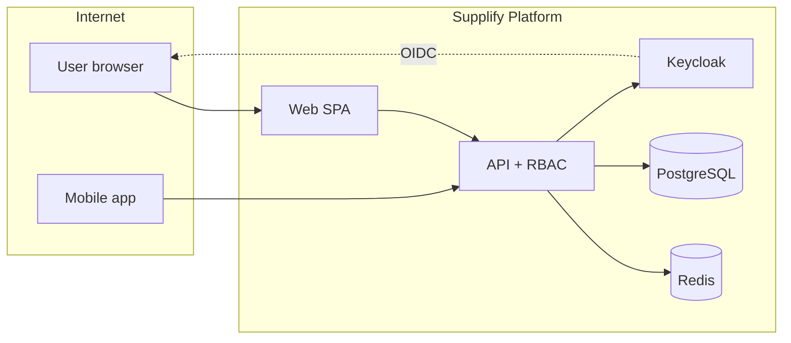

**Primary assets:** Tenant commercial data (orders, invoices, PII), credentials, payment methods.  
**Primary controls:** OIDC, RBAC, tenant_id scoping, TLS, CSRF (web), rate limits.

---

<a id="compliance-oriented-notes-non-exhaustive"></a>

### Compliance-oriented notes (non-exhaustive)

| Topic                   | Status in codebase                                                         |
| ----------------------- | -------------------------------------------------------------------------- |
| GDPR data export/delete | Partial — admin tools; verify DPA requirements per deployment              |
| PCI                     | Card data via payment provider — confirm SAQ scope with Stripe/integration |
| Audit trail             | Platform admin audit + tenant audit (Gold)                                 |
| Data residency          | Not enforced in code — deployment choice                                   |

---

<a id="recommended-next-security-work-priority-order"></a>

### Recommended next security work (priority order)

1. Add production guard to destructive seed scripts.
2. Publish `SECURITY.md` with disclosure contact.
3. MFA for admin Keycloak realm in production.
4. Per-user rate limiting on auth and file upload routes.
5. Hide or wire Supplier Settings Delivery Zones/Contacts tabs.
6. Automated dependency scanning in CI (if not already — verify `.github/workflows`).

---

<a id="assessment-conclusion"></a>

### Assessment conclusion

Supplify's **documented and implemented security model is coherent for enterprise B2B demos and controlled production rollout**, provided operators follow environment hardening (HTTPS, secrets, Redis, Keycloak tuning). The largest gaps are **operational** (secret hygiene, admin power, GPS privacy config) rather than missing authentication entirely.

_This review did not include dynamic scanning, fuzzing, or social engineering._

---

---

## Part XVI — Implementation Status

<a id="part-xvi-implementation-status"></a>

**Date:** 2026-06-17  
**Branch baseline:** `ab5695e` (per `docs/onboarding/_artifacts/bootstrap-metrics.md`)  
**Purpose:** What actually works, what is partial, what is missing tests, inconsistencies, dead code, and deployment risks.  
**Not marketing.** If a feature is UI-only, it says so.

---

<a id="tldr-verdict"></a>

### TL;DR verdict

| Dimension            | Grade  | One-line truth                                                                          |
| -------------------- | ------ | --------------------------------------------------------------------------------------- |
| Core B2B order flow  | **A**  | Restaurant cart → supplier accept → fulfill → receive → invoice works end-to-end        |
| Admin platform       | **A-** | 14 lazy-loaded tabs; impersonation + plans + deals production-usable                    |
| Monetization / tiers | **A-** | FE/BE keys aligned; Free Trial = Gold features + Free limits is confusing by design     |
| Hospitality add-ons  | **B+** | Reservations, staff, consumer B2C shipped; less demo polish than core B2B               |
| Logistics / GPS      | **B**  | Fulfillment board strong; driver accounts not in `seed:full`; GPS env-dependent         |
| Test coverage        | **B+** | ~1008 API + web unit tests; E2E only 16 Playwright files; 554 routes mostly API-unit    |
| Production readiness | **B**  | Railway docs exist; Keycloak memory/OOM history; cron in-process; lint gate still noisy |

**Demo readiness:** **Yes**, with scripted path (`12-demo-script.md`). **Free roam:** **No** — known UI-only settings tabs and finance gaps.

---

<a id="metrics-code-verified"></a>

### Metrics (code-verified)

| Metric                  | Value | Source                             |
| ----------------------- | ----: | ---------------------------------- |
| API routes              |   554 | `docs/audits/route-inventory.json` |
| SQL migrations          |   179 | `apps/api/db/migrations/`          |
| API test files          |   213 | bootstrap-metrics                  |
| Web test files          |   309 | bootstrap-metrics                  |
| Playwright e2e specs    |    16 | `tests/e2e/suites/`                |
| Frontend routes         |   ~80 | `apps/web/src/App.tsx`             |
| Permission keys         |    52 | `permission-keys.js`               |
| Restaurant feature keys |    26 | `feature-keys.js`                  |
| Supplier feature keys   |    24 | `feature-keys.js`                  |

---

<a id="what-is-fully-working"></a>

### What is fully working

These domains have **UI + API + RBAC + plan gates + meaningful tests**:

| Domain                                  | Evidence                                                               | Confidence                    |
| --------------------------------------- | ---------------------------------------------------------------------- | ----------------------------- |
| OIDC auth & session refresh             | `auth.routes.js`, e2e auth                                             | High                          |
| Tenant RBAC (16 system roles)           | `role-matrix.js`, `rbac-full-app.test.js`                              | High                          |
| Plan features & limits                  | `plan-enforcement.js`, `verify-tier-matrix`                            | High                          |
| Supplier catalog CRUD + CSV + image ZIP | `products.routes.js`, migration `0168`                                 | High                          |
| Restaurant browse, cart, place order    | e2e `orders.spec.ts`                                                   | High                          |
| Supplier accept/decline orders          | `order-decline.md`, order status enum                                  | High                          |
| Fulfillment board & dispatch            | `FulfillmentPage`, fulfillment routes                                  | High                          |
| Receiving                               | `receiving.routes.js`, API spec                                        | High                          |
| Disputes & credit notes                 | `disputes.service.js`                                                  | High                          |
| Invoices & payments (core)              | `invoices.routes.js`                                                   | High                          |
| Chat + Socket.IO                        | `chat.routes.js`, `useChatRealtime`                                    | Medium-High (Redis-dependent) |
| Deals/promotions + admin approval       | `deal-promotions.service.js`                                           | High                          |
| Admin command center                    | `admin-dashboard/*`, lazy tabs                                         | High                          |
| Reservations FOH + public booking       | `reservations.routes.js`                                               | High                          |
| Consumer B2C storefront                 | migrations `0161`–`0164`, smoke e2e                                    | Medium-High                   |
| Supplier growth program                 | migration `0169`, tests                                                | High                          |
| Supplier ops wave 2                     | run sheet, pick lists, collections, POD, quote lock, accounting export | High                          |
| Quote requests RFQ                      | migration `0153`                                                       | Medium-High                   |
| Warehouses & branches                   | `warehouses.routes.js`, branches audit                                 | High                          |
| Tenant audit log (Gold)                 | `tenant-audit.routes.js`                                               | High                          |

---

<a id="partial-ui-exists-backend-incomplete-or-behavior-wrong"></a>

### Partial — UI exists, backend incomplete, or behavior wrong

| Feature                                | What works                         | What does not                                                 | Evidence                           |
| -------------------------------------- | ---------------------------------- | ------------------------------------------------------------- | ---------------------------------- |
| **Supplier Settings → Contacts**       | Same                               | UI-only; honest toast after audit fix                         | `SupplierSettingsPage.tsx`         |
| **Restaurant finance statements**      | Period charges/payments/closing    | **`openingBalance` hardcoded `0`**                            | `restaurant-finance.routes.js:795` |
| **Dashboard period selector**          | UI toggles 7d/30d/90d              | **Does not refilter** spend trend (fixed 30d)                 | `DashboardPage.tsx`; demo audit    |
| **Smart reorder**                      | API + forecast job                 | No dedicated nav; dashboard widget only                       | `reorder-forecast.job.js`          |
| **Delivery rollover cron**             | Manual script + per-assignment API | **Hourly cron no-op** unless `DELIVERY_ROLLOVER_ENABLED=true` | `env.js`, `cron-jobs.md`           |
| **Credit notes nav**                   | Via disputes/invoices              | No top-level restaurant nav                                   | feature audit                      |
| **Restaurant `restaurant-gold@` demo** | Gold entitlements                  | **Past-due billing** seeded intentionally                     | `seed-billing.js`                  |
| **Supplier `supplier-silver@` demo**   | Silver entitlements                | **Locked account** seeded                                     | `seed-billing.js`                  |
| **Deal redemption metering**           | Limit check at redemption          | Increment path flagged for manual QA                          | demo audit §4.8                    |
| **Role change audit**                  | Tenant audit on some events        | Thin coverage for all RBAC mutations                          | demo audit §8                      |
| **Last-owner guard**                   | Prevents demotion in org context   | Org-less owner can self-demote edge case                      | demo audit §8                      |

---

<a id="missing-or-weak-test-coverage"></a>

### Missing or weak test coverage

| Area                          | Unit/API tests                | E2E                                       | Gap severity         |
| ----------------------------- | ----------------------------- | ----------------------------------------- | -------------------- |
| Auth login flow               | Partial                       | `auth.spec.ts`                            | Low                  |
| Fulfillment + GPS live        | Component tests               | None full path                            | **Medium**           |
| Driver deliveries E2E         | `driver-rbac` unit            | None                                      | **Medium**           |
| Restaurant finance statements | Sparse                        | None                                      | **Medium**           |
| Consumer B2C checkout         | Some API                      | Smoke only                                | Medium               |
| Admin mutations (plan change) | API tests                     | Skipped in route matrix (`SKIP_MUTATION`) | Medium               |
| 554 API routes                | ~213 test files               | Live route matrix skips unsafe            | **High breadth gap** |
| Mobile app                    | Sibling repo                  | Not in this metrics                       | External             |
| PWA push end-to-end           | Manifest unit                 | None                                      | Low                  |
| Impersonation                 | `admin-impersonation.spec.ts` | Manual                                    | Low                  |

**Honest statement:** Unit test count is **impressive** (~1300+ tests combined), but **E2E breadth is narrow** (16 files). Most routes are validated only by inventory/matrix classification, not automated HTTP tests.

---

<a id="permission-plan-inconsistencies"></a>

### Permission / plan inconsistencies

| Issue                           | Detail                                                                                                 | Severity                                |
| ------------------------------- | ------------------------------------------------------------------------------------------------------ | --------------------------------------- |
| Free Trial feature parity       | Free plan uses **Gold feature JSON** with **Free limits** — looks like Gold in UI, hits limits quickly | Intentional; document in sales          |
| GPS tracking                    | **Not plan-gated** — env flag only                                                                     | Product decision; surprises tier buyers |
| Reservations                    | **No `feature-keys` entry** — always on                                                                | May not match packaging docs            |
| `promotions` limit              | Supplier-only; restaurant uses `supplier_deals` + `deal_redemptions_per_day`                           | Correct in code; easy doc confusion     |
| Enterprise tier                 | **Removed** from catalog (`0066`); maps to platinum in code only                                       | Legacy data may exist                   |
| Bronze display name             | Mapped to Silver in UI (`formatPlanDisplayName`)                                                       | Cosmetic                                |
| Contract pricing feature key    | Placeholder gating                                                                                     | Low                                     |
| Frontend-only permission checks | UX hiding; **API is source of truth**                                                                  | OK if API always called                 |

**Verification tools that pass:** `pnpm verify:tier-matrix`, `plan-catalog-audit` tests, `adminLimitLabels.test.ts`.

---

<a id="dead-code-deprecated-and-removed-features"></a>

### Dead code, deprecated, and removed features

| Item                                    | Status                                         | Evidence                                                   |
| --------------------------------------- | ---------------------------------------------- | ---------------------------------------------------------- |
| Approvals & budgets                     | **Removed**                                    | migration `0114`; `REMOVED_FEATURE_KEYS`                   |
| Enterprise plan selectable              | **Deactivated**                                | `0066_remove_enterprise_tier.sql`                          |
| Supplier command-center broken link     | **Fixed**                                      | was `/app/supplier/command-center` → `/app/command-center` |
| Fake success toasts (supplier settings) | **Fixed**                                      | honest messaging                                           |
| `api_user` DB role grants               | **Commented out**                              | migrations `0019`, `0020`, `0039`                          |
| Uncommitted admin refactor              | Was in audit — verify committed on your branch | demo audit §10                                             |

**Possible dead UI:** Supplier Settings tabs behind `false` flags — not dead, deliberately disabled.

---

<a id="seed-data-honesty-seedfull"></a>

### Seed data honesty (`seed:full`)

| Seeded well                                                | Not seeded / weak                                                          |
| ---------------------------------------------------------- | -------------------------------------------------------------------------- |
| 10 prod-like restaurants, 50 suppliers                     | Driver Keycloak logins                                                     |
| ~2k products, ~1.5k orders                                 | Live GPS route history                                                     |
| Invoices, chats, quick lists                               | Multi-warehouse stock edge cases                                           |
| Tier demos Free–Platinum                                   | Smart-reorder demand history depth                                         |
| Disputes, approved deals                                   | Receiving line items for every order                                       |
| Coupon `DEMOFORK10`, expiry item, near-limit Free supplier | Near-limit restaurant examples                                             |
| ~70 Keycloak accounts                                      | `seed:tier-catalog` team roles (`*-manager@`) **not** in default full seed |

**Best demo logins:** `restaurant@supplify.com` + `supplier@supplify.com` (Gold, **active billing**, richest extras).  
**Avoid for smooth demo:** `restaurant-gold@` (past due), `supplier-silver@` (locked).

---

<a id="deployment-risks"></a>

### Deployment risks

| Risk                            | Why it hurts                                   | Mitigation                                             |
| ------------------------------- | ---------------------------------------------- | ------------------------------------------------------ |
| **Keycloak OOM on Railway**     | Historical 7–10 GB spikes                      | `KEYCLOAK_RAILWAY_MEMORY_FIX.md`, JVM caps             |
| **In-process crons**            | Duplicate runs if API scaled horizontally      | `CRONS_ENABLED` + single replica or external scheduler |
| **Redis optional**              | Socket.IO / perm cache inconsistent multi-node | Mandate Redis prod                                     |
| **Migration partial failure**   | Compose migrate continues on error (`WARN`)    | CI fresh-DB migration gate                             |
| **Public Redis URL on Railway** | Egress fees / wrong host                       | `resolve-redis-url.js`                                 |
| **Session store in Postgres**   | Load on auth                                   | Acceptable at current scale; watch pool                |
| **Lint max 0 warnings**         | 46 warnings remain — CI may fail               | demo audit §6                                          |
| **Destructive seed on staging** | `seed:full` wipes tenants                      | Process guard                                          |
| **GPS / Maps API keys**         | Tracking UI blank in prod                      | Env checklist                                          |
| **SMTP not configured**         | Silent email failures                          | Mailpit dev; Resend prod                               |

---

<a id="mobile-parity-status"></a>

### Mobile parity status

| Area         | Web      | Mobile (`supplify-mobile`) |
| ------------ | -------- | -------------------------- |
| Auth PKCE    | Cookie   | Bearer                     |
| Orders       | Full     | Parity expected            |
| Driver GPS   | Web view | Primary capture            |
| Admin        | Full     | Limited/none               |
| Consumer B2C | Full     | Partial                    |

Rule: `.cursor/rules/mobile-parity.mdc` — changes must be evaluated. Drift documented in `docs/mobile/MOBILE_FEATURE_PARITY.md`.

---

<a id="ci-quality-gates-honest"></a>

### CI / quality gates (honest)

| Gate                 | Typical status     | Notes                                            |
| -------------------- | ------------------ | ------------------------------------------------ |
| `pnpm typecheck`     | Pass               | per demo audit                                   |
| API `vitest run`     | Pass (~1008 tests) | fixed stale mocks Jun 2026                       |
| Web `vitest run`     | Pass               | + locked deals regression                        |
| `pnpm lint`          | **May fail**       | 46 warnings (22 exhaustive-deps)                 |
| Playwright e2e       | Requires infra     | auth, orders, rbac, catalog, subscription-limits |
| `verify:tier-matrix` | Needs live DB      | not always in CI                                 |

---

<a id="feature-status-by-persona"></a>

### Feature status by persona

<a id="restaurant-85-complete"></a>

#### Restaurant — **85% complete**

Working: orders, cart, suppliers, receiving, invoices, inventory, deals, chat, quick lists, disputes, reservations, consumer modules, reports (tiered).  
Weak: finance statement opening balance, smart reorder surfacing, dashboard period filter.

<a id="supplier-82-complete"></a>

#### Supplier — **82% complete**

Working: catalog, orders, fulfillment, invoices, promotions, growth, contract pricing, warehouses, **run sheet, pick lists, collections reminders, accounting export, warehouse zones UI, quote price lock, POD media**.  
Weak: settings contacts tab, driver seed login, deal approval dependency for new promos.

<a id="admin-88-complete"></a>

#### Admin — **88% complete**

Working: overview, tenants, plans, subscriptions, limits, deals, finance, ops health, audit, impersonation.  
Weak: some mutation paths manual QA only; password reset marked unsafe in route matrix.

<a id="driver-75-complete"></a>

#### Driver — **75% complete**

Working: role isolation, delivery board, status enum, proof of delivery APIs.  
Weak: no default demo account; GPS depends on ops env; E2E gap.

<a id="public-guest-80-complete"></a>

#### Public / guest — **80% complete**

Working: reservations, consumer order flow, public supplier catalog (no anon prices), quote flows.  
Weak: abuse protection (rate limits only).

---

<a id="recommended-engineering-priorities"></a>

### Recommended engineering priorities

1. **Wire or hide** Supplier Settings Contacts (product decision).
2. **Fix** restaurant finance `openingBalance` calculation.
3. **Add** driver demo to `seed:full` (Keycloak + one assignment).
4. **E2E:** fulfillment → driver status → restaurant tracking path.
5. **Dashboard:** wire period selector or remove control.
6. **Production:** migration CI on empty DB; Redis required flag.
7. **Lint:** burn down 46 warnings or adjust gate policy explicitly.

---

<a id="how-this-doc-stays-honest"></a>

### How this doc stays honest

- Claims cite files, migrations, or audit docs — not roadmap slides.
- "Working" means code path exists and was verified in audits/tests — not that every customer edge case is handled.
- Partial features are **not** labeled Shipped in [13-acceptance-criteria.md](part-xiii-acceptance-criteria).

---

<a id="related-artifacts"></a>

### Related artifacts

| Document                                                                       | Use                       |
| ------------------------------------------------------------------------------ | ------------------------- |
| [SUPPLIFY_DEMO_READINESS_AUDIT.md](../audits/SUPPLIFY_DEMO_READINESS_AUDIT.md) | Jun 2026 demo pass        |
| [full-app-feature-audit.md](../archive/audits/full-app-feature-audit.md)       | Feature matrix            |
| [DEV_API_ROUTE_TEST_MATRIX.md](../audits/DEV_API_ROUTE_TEST_MATRIX.md)         | Route test classification |
| [12-demo-script.md](part-xii-demo-scripts)                                     | What to show anyway       |

---

---

## Part XVII — Glossary

<a id="part-xvii-glossary"></a>

**Audience:** Sales, support, onboarding specialists, developers, and customers who need a shared vocabulary for Supplify.

**Source of truth:** Application code (`apps/api`, `apps/web`), migrations, and companion docs in `docs/onboarding/`.

Terms are grouped by theme. Where a concept has both a **plan entitlement** (subscription feature) and an **RBAC permission**, both are noted — they are independent gates (see [09-authentication-rbac.md](part-ix-authentication-rbac-internal-technical-reference) and [10-subscriptions-and-plans.md](part-x-subscriptions-and-plans-internal-technical-reference)).

---

<a id="platform-identity"></a>

### Platform & identity

<a id="tenant"></a>

#### Tenant

A **tenant** is a billable organization row in the database: either a `restaurant` or a `supplier`. Every tenant has its own subscription, team, branding, and data isolation. API handlers resolve the active tenant via `tenant-resolve.js` (`getRestaurantIdForRequest`, `getSupplierIdForRequest`). Platform admins (`ADMIN` role) are not tenants.

<a id="workspace"></a>

#### Workspace

A **workspace** is the authenticated product experience for one tenant. Users see one restaurant **or** one supplier workspace at a time. Table `user_workspace_membership` enforces **at most one** active restaurant or supplier account per user (migration `0104_user_workspace_membership.sql`). The account creator is **main admin** (`is_main_admin`) with the **Owner** system role.

<a id="organization-org"></a>

#### Organization (org)

Restaurant and supplier tenants can have an **organization** parent (`restaurant_organizations`, `supplier_organizations`) with child **branches**. Org-level billing rolls up to the root tenant via `resolveOrgBillingTenantId`. Multi-branch features require plan key `multi_branch` (Gold+ on paid tiers; enabled on Free Trial via Gold feature parity).

<a id="branch"></a>

#### Branch

A **branch** is a physical or logical site under an org: `restaurant_branch` or `supplier_branch`. Branches scope orders, inventory, quick lists, and delivery coordinates. Plan limit `branches` caps active locations (Free/Silver: 1; Gold: 3; Platinum: unlimited). Branch invites use `/invite/branch`.

<a id="platform-role-appuserrole"></a>

#### Platform role (`app_user.role`)

Keycloak-linked persona stored on `app_user`: `PENDING` (registration incomplete), `RESTAURANT`, `SUPPLIER`, `ADMIN`, or `STAFF_PORTAL`. This is **not** the same as tenant RBAC roles (Owner, Manager, etc.).

<a id="main-admin"></a>

#### Main admin

The user who created the tenant (`is_main_admin = true`). Cannot be removed without transfer. Always mapped to **Owner** unless explicitly reassigned within guard rules in `rbac-guards.js`.

<a id="pending-activation"></a>

#### Pending activation

Subscription state `lock_reason = pending_activation` after registration. `billingAccessMiddleware` blocks writes until the user completes `/app/activate` (free or paid checkout). Distinct from Free Trial **sandbox expiry**.

<a id="free-trial-sandbox-expiry"></a>

#### Free Trial / sandbox expiry

Free plan workspaces get `subscription.free_sandbox_expires_at` (default 7 days from `platform_setting.free_sandbox_days`). After expiry, account is locked: reads mostly allowed, writes return **402 Payment Required**.

---

<a id="access-control"></a>

### Access control

<a id="rbac-role-based-access-control"></a>

#### RBAC (role-based access control)

**Tenant-scoped RBAC** maps users to roles (`tenant_user_roles`) and roles to permission keys (`tenant_role_permissions`). Canonical permission constants live in `apps/api/src/lib/permission-keys.js` (52 keys). Backend enforcement is mandatory via `requirePermission`; the React app mirrors checks for UX only.

<a id="permission"></a>

#### Permission

A granular capability key such as `ORDERS_CREATE`, `RECEIVING_MANAGE`, or `INVOICES_VIEW`. **`hasPermission`** treats domain `_MANAGE` as satisfying `_VIEW` / `_EDIT` checks. Permissions are cached in Redis (`perm:{userId}:{tenantId}:{tenantType}`, TTL ~180s).

<a id="system-role"></a>

#### System role

Predefined role template synced per tenant from `role-matrix.js`: e.g. Restaurant **Owner**, **Purchaser**, **Receiving Staff**; Supplier **Warehouse Manager**, **Driver**. Owner has `permissions: 'ALL'`.

<a id="custom-role"></a>

#### Custom role

Tenant-defined role created under **Settings → Team → Roles** when plan feature `advanced_roles` is enabled (Gold+). Names cannot collide with reserved system role names. Assigner cannot grant permissions they do not hold.

<a id="admin-permission"></a>

#### Admin permission

Platform-scoped keys for `ADMIN` users: `ADMIN_ACCESS`, `ADMIN_TENANTS`, `ADMIN_PLANS`, `ADMIN_SUPPORT`, `ADMIN_FINANCE`, `ADMIN_GROWTH`. Stored in legacy `role` / `role_permission` tables. Tab visibility in `/app/admin` follows `resolveAdminDashboardPermission()`.

<a id="entitlement"></a>

#### Entitlement

Runtime subscription payload from `GET /api/subscriptions/entitlements`: effective **plan**, **features**, **limits**, **usage**, overrides, and addons. Frontend hook: `useEntitlements()`. Entitlements answer: _did this tenant pay for the module?_

<a id="feature-plan-feature-key"></a>

#### Feature (plan feature key)

Boolean or tier string in `subscription_plan.features` JSON, e.g. `finance_invoices`, `smart_reorder`, `driver_management`. Enforced by `requireFeature()` → **403 FEATURE_NOT_AVAILABLE**. Canonical keys: `feature-keys.js`.

<a id="limit-plan-limit-key"></a>

#### Limit (plan limit key)

Numeric cap in plan JSON, e.g. `orders_per_day`, `warehouses`, `branches`. Value `-1` or `null` means unlimited. Enforced by `requireWithinLimit()` or inline `checkLimit()`. Resolution order: plan → plan override → tenant override → location addons.

<a id="feature-gate-vs-permission-gate"></a>

#### Feature gate vs permission gate

Both must pass for many actions:

| Layer        | Question              | Example                              |
| ------------ | --------------------- | ------------------------------------ |
| Entitlement  | Tenant on right plan? | `disputes_returns` for dispute API   |
| RBAC         | User allowed?         | `RECEIVING_MANAGE` to post receiving |
| Billing lock | Account writable?     | Not locked / not expired Free Trial  |

<a id="impersonation"></a>

#### Impersonation

Admin **view-as** tenant workflow. Cookie `impersonation_token` (JWT signed with `IMPERSONATION_SECRET`). Requires `ADMIN_SUPPORT` or `SUPER_ADMIN`. Effective permissions come from **view-as role**, not blanket Owner bypass. Cleared on login/logout. Documented in `impersonation.js`.

<a id="staff-portal"></a>

#### Staff portal

Separate operational surface for restaurant **scheduling staff** (`STAFF_PORTAL` app role, Keycloak `staff_portal`). Not tenant Team RBAC. Allowlisted API paths only; home `/staff/dashboard`.

---

<a id="commerce-orders"></a>

### Commerce & orders

<a id="customer-order"></a>

#### Customer order

B2B order from restaurant to supplier (`customer_order` + line items). Status lifecycle includes placement, supplier acceptance/decline, fulfillment, delivery, invoicing. Restaurants need `ORDERS_CREATE`; suppliers need `ORDERS_VIEW` / `ORDERS_MANAGE` to decline or manage.

<a id="quick-list-ordering-list"></a>

#### Quick list / ordering list

Saved reorder template (`quick_list`, `quick_list_item`). UI label **Ordering Lists**; route `/app/quick-lists`. Plan feature `quick_lists`; limits `quick_lists`, `quick_list_items`, `scheduled_quick_lists`. Can scope to `branch_id`.

<a id="scheduled-quick-list"></a>

#### Scheduled quick list

Quick list with `is_scheduled = true` for automated or calendar-driven reorder. Free Trial has hidden limit `scheduled_order_grace_per_day` (one daily order overflow).

<a id="smart-reorder"></a>

#### Smart reorder

Restaurant feature `smart_reorder` (Gold+): cadence detection, at-risk SKUs, dashboard widgets. Uses `reorder-cadence` service and optional `ai_platform` LLM assistant (`ai_requests_per_day` limit on Gold/Platinum).

<a id="reorder-cadence"></a>

#### Reorder cadence

Computed ordering rhythm per restaurant SKU/branch from historical order and inventory signals. API: `POST /api/restaurant-inventory/reorder-cadence/recompute`; supplier at-risk view: `GET /api/supplier/reorder-cadence/at-risk`. Requires inventory + smart reorder entitlements.

<a id="order-amendment"></a>

#### Order amendment

Post-placement change request (`order_amendments` tables). Plan feature `order_amendments` (all tiers including Free Trial). Restaurant accepts/rejects; does not silently mutate lines without workflow.

<a id="substitution"></a>

#### Substitution

Supplier-proposed replacement product when original is unavailable. Creates `order_fulfillment_issue` with status `substitution_suggested` and may spawn pending **amendment** for mapped products. Order lines are **not** auto-changed. API under `/api/supplier/orders/:orderId/fulfillment-issues/substitution`.

<a id="shortage"></a>

#### Shortage

Supplier-reported inability to fulfill ordered quantity. Creates fulfillment issue `shortage_reported`; may open contextual chat (`ORDER_REFERENCE` message type).

<a id="fulfillment"></a>

#### Fulfillment

Supplier-side pick/pack/dispatch workflow. Plan features `fulfillment` and/or `fulfillment_tools` (supplier only; off for restaurants). Permissions `FULFILLMENT_VIEW`, `FULFILLMENT_MANAGE`. UI: `/app/fulfillment` board, routes, warehouse assignment.

<a id="fulfillment-issue"></a>

#### Fulfillment issue

Structured shortage/substitution record (`order_fulfillment_issue`, migration `0134_order_fulfillment_issues.sql`). Statuses: `shortage_reported`, `substitution_suggested`, `waiting_restaurant_approval`, `accepted`, `rejected`.

<a id="decline-reason"></a>

#### Decline reason

Supplier rejection of an order with coded/text reason before fulfillment starts. Requires `ORDERS_MANAGE`.

<a id="contract-pricing"></a>

#### Contract pricing

Negotiated price list between supplier and restaurant; overrides catalog default on eligible lines.

<a id="supplier-follow"></a>

#### Supplier follow

Restaurant relationship `restaurant_supplier_follow` / `supplier_follow`. Limit `suppliers_per_restaurant` by plan.

<a id="deal-promotion"></a>

#### Deal / promotion

Supplier commercial offer. Restaurant redemption: `supplier_deals`, `supplier_deals_redeem`; supplier promos: `promotions` with limit `promotions`. Admin may approve certain deal types.

<a id="quote-request"></a>

#### Quote request

Restaurant-initiated RFQ-style flow to supplier outside standard catalog checkout (see product guide).

<a id="b2c-consumer-order"></a>

#### B2C consumer order

Public storefront order at `/order/:restaurantSlug` — separate from B2B `customer_order` procurement.

---

<a id="logistics-receiving"></a>

### Logistics & receiving

<a id="warehouse"></a>

#### Warehouse

Supplier ship-from location (`warehouse` table). Plan feature `warehouses`; limit `warehouses` (0 on Free = feature effectively off; Silver: 1; Gold: 3; Platinum: ∞). Permissions `WAREHOUSES_VIEW`, `WAREHOUSES_EDIT`, `WAREHOUSES_MANAGE`. Multi-warehouse routing: `multi_warehouse` (Gold+).

<a id="receiving"></a>

#### Receiving

Restaurant confirmation of goods delivered against an order. Plan feature `receiving_quality` (photos, quality scoring tiers). Permissions `RECEIVING_VIEW`, `RECEIVING_MANAGE`. API: `receiving.routes.js`. Distinct from supplier warehouse **receiving** in inventory context.

<a id="receiving-session"></a>

#### Receiving session

Structured receive flow tying order lines to quantities received, optional quality photos/scores, and optional lot creation.

<a id="proof-of-delivery-pod"></a>

#### Proof of delivery (POD)

Driver-captured evidence (notes, optional photo) on `delivered` transition. Driver permissions `DRIVER_DELIVERIES_MANAGE`.

<a id="delivery-status"></a>

#### Delivery status

Driver assignment lifecycle: `assigned` → `picked_up` → `out_for_delivery` → `delivered` | `failed` | `rescheduled`. API: `PATCH /api/orders/:id/delivery-status`.

<a id="driver-route"></a>

#### Driver route

Ordered sequence of delivery stops (`fulfillment` routes API). Driver can build route from assignments: `POST /api/fulfillment/routes/build-from-assignments`.

<a id="gps-tracking-eta"></a>

#### GPS tracking / ETA

Live driver location shared during `out_for_delivery` when supplier plan and restaurant **delivery coordinates** are set. Restaurant map privacy: driver-focused surfaces per product rules.

<a id="delivery-coordinates"></a>

#### Delivery coordinates

Latitude/longitude on restaurant or branch (`PATCH /api/restaurants/me/delivery-location`). Required for accurate ETA — street address alone is insufficient.

---

<a id="inventory-quality"></a>

### Inventory & quality

<a id="restaurant-inventory"></a>

#### Restaurant inventory

On-hand stock per restaurant SKU (`restaurant_inventory`). Plan feature `inventory_management`; limit `restaurant_inventory_skus`.

<a id="inventory-lot"></a>

#### Inventory lot

Batch-level record (`restaurant_inventory_lot`) with `quantity`, `expiry_date`. Status at read time: `safe`, `expiring_soon`, `expired` (default threshold 7 days). Platinum tier string includes `lot_expiry_tracking`. Migration `0133_restaurant_inventory_lots.sql`.

<a id="supplier-inventory"></a>

#### Supplier inventory

Warehouse-scoped available quantity (`inventory` / `available_qty` on supplier side). Drives fulfillment shortage detection.

<a id="waste-tracking"></a>

#### Waste tracking

Restaurant feature `waste_tracking` for recording spoilage/shrink with analytics tiers on paid plans.

<a id="stock-status"></a>

#### Stock status

Computed label (in stock, low, out) from thresholds — aggregate quantity; expiry handled at lot level.

<a id="dispute"></a>

#### Dispute

Post-receiving disagreement (quality, quantity). Plan `disputes_returns`. May escalate to returns workflow.

<a id="quality-score"></a>

#### Quality score

Optional numeric/structured score on receiving when plan tier enables `receiving_quality` quality scoring (Gold+).

---

<a id="finance"></a>

### Finance

<a id="invoice"></a>

#### Invoice

Bill document tied to fulfilled/delivered orders. Plan feature `finance_invoices`. Permissions `INVOICES_VIEW`, `INVOICES_CREATE`, `INVOICES_EDIT`, `INVOICES_MANAGE`.

<a id="receivable"></a>

#### Receivable

Supplier-side outstanding amount owed by restaurants (`GET /api/supplier/invoices/receivables*`). Requires `INVOICES_VIEW` + `finance_invoices` feature.

<a id="payable-restaurant"></a>

#### Payable (restaurant)

Restaurant-side obligation to pay supplier invoices; recorded payments reduce open balance.

<a id="aging"></a>

#### Aging

Buckets of open receivables/payables by days outstanding (e.g. current, 30, 60, 90+). Shown in finance dashboards when `finance_invoices` tier includes analytics.

<a id="payment-recording"></a>

#### Payment recording

Manual or stub-gateway payment applied to invoice (`PAYMENTS_VIEW`, `PAYMENTS_MANAGE`). Accountant role typical owner.

<a id="account-statement"></a>

#### Account statement

Period summary of orders, invoices, and payments between restaurant and supplier pair.

<a id="billing-checkout"></a>

#### Billing checkout

`POST /api/billing/checkout` — activates plan, clears `pending_activation`, or upgrades tier. Stub card `4242424242424242` when `BILLING_GATEWAY=stub`.

<a id="plan-code"></a>

#### Plan code

Canonical subscription tier: `free`, `silver`, `gold`, `platinum` (`plan-codes.js`). Legacy `enterprise` deactivated; `bronze` aliases to `silver`.

<a id="pending-downgrade"></a>

#### Pending downgrade

`subscription.pending_plan_id` + `pending_effective_at` — lower tier applies on next billing cycle read.

<a id="limit-override-feature-override"></a>

#### Limit override / feature override

Admin or growth tools to raise caps (`tenant_limit_override`, `plan_limit_override`) or toggle features (`feature-flags.js`) without changing base plan row.

---

<a id="growth-discovery"></a>

### Growth & discovery

<a id="supplier-growth"></a>

#### Supplier growth

Supplier feature `supplier_growth` — referrals, customer import, command-center analytics. Free Trial includes via migration `0175`.

<a id="mini-store-public-catalog"></a>

#### Mini-store / public catalog

Unauthenticated supplier catalog at `/supplier/:idOrSlug` for discovery and quote flows.

<a id="supplier-review"></a>

#### Supplier review

Restaurant rating of supplier; feature `supplier_reviews`.

<a id="referral-token"></a>

#### Referral token

`referralToken` on `POST /api/register/complete` from `/register?ref=…` linking new tenant to growth program.

<a id="customer-import"></a>

#### Customer import

Supplier bulk import of restaurant contacts (`CUSTOMERS_IMPORT` permission).

---

<a id="reservations-foh"></a>

### Reservations & FOH

<a id="reservation"></a>

#### Reservation

Table booking for restaurant FOH. Permissions `RESERVATIONS_*`. Public guest flow at `/reserve`.

<a id="waitlist"></a>

#### Waitlist

Queue when no tables available; feature `waitlist_auto_promo` for auto-promotion rules (Gold+).

<a id="foh-staff"></a>

#### FOH Staff

Restaurant system role with reservations permissions only — no order create.

---

<a id="chat-notifications"></a>

### Chat & notifications

<a id="b2b-chat"></a>

#### B2B chat

Tenant messaging with plan feature `chat` (tiered: multi_supplier, group_chat_files, real_time_media). Limits `chats_per_day`, `open_conversations`.

<a id="orderreference-message"></a>

#### ORDER_REFERENCE message

Chat message type linking thread to specific order — used in substitution/shortage flows.

<a id="push-notification"></a>

#### Push notification

Mobile/web push when `push_notifications` enabled; requires device registration.

<a id="notification-preference"></a>

#### Notification preference

Per-user/category opt-in stored in notification settings (e.g. `notify_inventory_expiring`).

---

<a id="admin-platform"></a>

### Admin & platform

<a id="super-admin"></a>

#### Super Admin

Platform role with all `ADMIN_*` permissions.

<a id="support-admin"></a>

#### Support Admin

`ADMIN_ACCESS`, `ADMIN_TENANTS`, `ADMIN_SUPPORT` — tenant directory, impersonation, password reset.

<a id="finance-admin"></a>

#### Finance Admin

Billing overview, revenue metrics — `ADMIN_FINANCE`.

<a id="growth-admin"></a>

#### Growth Admin

Feature flags, deal approvals, experiments — `ADMIN_GROWTH`.

<a id="audit-log"></a>

#### Audit log

Platform and tenant activity records. Tenant feature `tenant_audit_log` (Gold+). Admin audit at `/app/admin` → Audit.

<a id="feature-flag"></a>

#### Feature flag

Runtime toggle layered on plan JSON via `resolveFeatureEnabled()` — may enable beta features without plan migration.

<a id="conversion-event"></a>

#### Conversion event

Monetization telemetry when user hits `BLOCKED_FEATURE` or `BLOCKED_LIMIT` — feeds admin conversion stats.

---

<a id="technical"></a>

### Technical

<a id="pwa-progressive-web-app"></a>

#### PWA (Progressive Web App)

Web app installable on mobile/desktop with service worker caching (`apps/web` Vite PWA plugin). Driver and field workflows are **PWA-friendly** (offline-limited; mutations require network). Not a separate native app — see `supplify-mobile` for React Native parity.

<a id="oidc-keycloak"></a>

#### OIDC / Keycloak

Identity provider for login. Authorization code flow via `/auth/login` → Keycloak → `/auth/callback`. Tokens in HttpOnly cookies (`access_token`, `refresh_token`).

<a id="csrf-token"></a>

#### CSRF token

`X-CSRF-Token` header on state-changing API calls when using cookie auth.

<a id="rtk-query"></a>

#### RTK Query

Redux Toolkit data layer in `apps/web` for API hooks (`useGetEntitlementsQuery`, etc.).

<a id="tenant-context"></a>

#### Tenant context

Request attachment from `resolveTenantContext`: `tenantId`, `tenantType`, `permissions`, active branch.

<a id="active-tenant-cookie"></a>

#### Active tenant cookie

`active_tenant` — branch/workspace switcher state for multi-branch users.

<a id="redis-cache"></a>

#### Redis cache

Shared cache for permissions, entitlements, subscription (recommended production: `REDIS_URL`).

<a id="migration"></a>

#### Migration

Sequential SQL file in `apps/api/migrations/` — schema source of truth alongside runtime code.

<a id="route-inventory"></a>

#### Route inventory

Machine-readable API catalog `docs/audits/route-inventory.json` (554 routes as of 2026-06-17).

---

<a id="acronyms"></a>

### Acronyms

| Acronym | Meaning                                        |
| ------- | ---------------------------------------------- |
| B2B     | Business-to-business (restaurant ↔ supplier)  |
| B2C     | Business-to-consumer (public menu orders)      |
| ETA     | Estimated time of arrival (delivery)           |
| FOH     | Front of house (reservations, guest-facing)    |
| GPS     | Global positioning system (driver location)    |
| KPI     | Key performance indicator (dashboards/reports) |
| LLM     | Large language model (AI reorder assistant)    |
| MOQ     | Minimum order quantity (supplier policy)       |
| OIDC    | OpenID Connect (auth protocol)                 |
| POD     | Proof of delivery                              |
| PTO     | Paid time off (staff portal)                   |
| PWA     | Progressive Web App                            |
| RBAC    | Role-based access control                      |
| RFQ     | Request for quote                              |
| SKU     | Stock keeping unit (product identifier)        |
| SLA     | Service level agreement (support tier)         |
| VAT     | Value-added tax identifier                     |

---

<a id="related-docs"></a>

### Related docs

- [09-authentication-rbac.md](part-ix-authentication-rbac-internal-technical-reference) — permissions and roles in depth
- [10-subscriptions-and-plans.md](part-x-subscriptions-and-plans-internal-technical-reference) — feature and limit matrices
- [02-complete-product-guide.md](part-ii-complete-product-guide) — feature-to-route mapping
- [11-api-and-workflow-reference.md](part-xi-api-and-workflow-reference-internal-technical-reference) — API workflows

---

## Part XVIII — Frequently Asked Questions

<a id="part-xviii-frequently-asked-questions"></a>

**Audience:** Sales, customer support, onboarding specialists, and developers answering real customer questions.

**Grounding:** Answers reflect current plan matrices (`10-subscriptions-and-plans.md`), RBAC (`09-authentication-rbac.md`, `role-matrix.js`), and registration/billing flows verified against the repository.

---

<a id="sales-pricing"></a>

### Sales & pricing

<a id="what-plans-does-supplify-offer"></a>

#### What plans does Supplify offer?

Four self-serve tiers for **both** restaurant and supplier workspaces: **Free Trial** (`free`), **Silver** ($49/mo), **Gold** ($149/mo), and **Platinum** ($349/mo). Yearly pricing is available at roughly 10× monthly. Legacy **Enterprise** was removed; `enterprise` codes normalize to `platinum` for comparisons only.

<a id="what-is-included-in-free-trial"></a>

#### What is included in Free Trial?

Free Trial uses **Gold feature gates** with **Free limit caps** — prospects can explore nearly the full product surface for ~7 days (configurable `free_sandbox_days`), not a crippled demo. After sandbox expiry, the account becomes read-only for most GETs; writes return **402** until upgrade.

<a id="which-plan-should-a-single-location-restaurant-start-on"></a>

#### Which plan should a single-location restaurant start on?

**Silver** if they need paid support and modest volume (20 orders/day, 5 suppliers, 1 branch). **Gold** if they need multi-branch (3 branches), smart reorder, advanced roles, API keys, or higher daily order volume (100/day). **Platinum** removes most numeric caps and adds advanced reporting/AI forecast tiers.

<a id="which-plan-should-a-regional-distributor-start-on"></a>

#### Which plan should a regional distributor start on?

**Silver** enables one warehouse and basic fulfillment. **Gold** adds multi-warehouse (3 warehouses, 3 branches), driver management, and warehouse pick/pack fulfillment tools. **Platinum** adds routing suite and unlimited warehouses/branches/SKUs.

<a id="can-a-customer-mix-restaurant-and-supplier-accounts-on-one-login"></a>

#### Can a customer mix restaurant and supplier accounts on one login?

**No.** `user_workspace_membership` allows **one** active restaurant **or** supplier workspace per email. Same-organization branch invites are allowed; a second unrelated tenant on the same email is rejected at invite accept.

<a id="do-restaurants-and-suppliers-need-separate-subscriptions"></a>

#### Do restaurants and suppliers need separate subscriptions?

**Yes.** Each tenant row has its own `subscription`. A company that is both buyer and seller must register two workspaces (two emails or sequential accounts per policy).

<a id="what-happens-when-they-hit-a-limit-mid-month"></a>

#### What happens when they hit a limit mid-month?

API returns **403 LIMIT_EXCEEDED** with upgrade payload (`recommendPlan()` suggests next tier). Daily meters (`orders_per_day`, `chats_per_day`, `ai_requests_per_day`) reset at UTC day boundary. Admins can apply **tenant limit overrides** (increase-only) without changing plan code.

<a id="is-custom-branding-available-on-silver"></a>

#### Is custom branding available on Silver?

**No.** `custom_branding` is off on Silver for both tenant types. Gold enables logo/colors; Platinum adds white-label domain tier string.

<a id="can-we-quote-api-access-on-silver"></a>

#### Can we quote API access on Silver?

**No.** `api_integrations` is disabled on Silver. Gold grants `api_key_access`; Platinum grants `full_api_webhooks`.

---

<a id="onboarding-activation"></a>

### Onboarding & activation

<a id="why-cant-the-customer-save-settings-or-place-orders-after-signup"></a>

#### Why can’t the customer save settings or place orders after signup?

New tenants have `lock_reason = pending_activation`. They must complete **`/app/activate`** — either activate Free or complete paid checkout. Until then, `billingAccessMiddleware` blocks writes (**402**).

<a id="what-is-the-difference-between-pending-activation-and-free-trial-expiry"></a>

#### What is the difference between pending activation and Free Trial expiry?

| State                | Trigger                                       | Effect                                            |
| -------------------- | --------------------------------------------- | ------------------------------------------------- |
| Pending activation   | Registration complete, no activation checkout | No writes until `/app/activate`                   |
| Free sandbox expired | `free_sandbox_expires_at` passed              | Read-mostly; writes and sensitive exports blocked |

<a id="what-data-is-required-to-register-a-supplier-vs-restaurant"></a>

#### What data is required to register a supplier vs restaurant?

Both need account type, **business name**, legal acceptance. Phone optional. Supplier registration creates default catalog and warehouse scaffold. Restaurant registration creates org and default branch.

<a id="how-long-does-onboarding-take"></a>

#### How long does onboarding take?

Self-serve minimum path: register → activate → profile → first catalog/order — **under 30 minutes** with prepared data. Full production rollout (team, branches, warehouses, integrations) typically **1–2 weeks** depending on catalog size and training.

<a id="can-admins-create-tenants-without-self-service-signup"></a>

#### Can admins create tenants without self-service signup?

**Suppliers:** yes via `POST /api/suppliers` (admin API). Subscription starts pending activation; owner must still be linked via invite. **Restaurants:** primarily self-service `/register/complete`; confirm latest admin API in `06-admin-onboarding.md`.

<a id="what-stub-card-works-in-demostaging-billing"></a>

#### What stub card works in demo/staging billing?

`4242424242424242` when `BILLING_GATEWAY=stub`.

---

<a id="rbac-team-access"></a>

### RBAC & team access

<a id="what-is-the-difference-between-a-permission-and-a-plan-feature"></a>

#### What is the difference between a permission and a plan feature?

**Plan feature** = tenant paid for module (`finance_invoices`). **Permission** = user may act (`INVOICES_VIEW`). Both must pass. Example: Accountant role has invoice permissions, but Free Trial still needs `finance_invoices` enabled (it is, via Gold parity).

<a id="can-a-purchaser-receive-goods"></a>

#### Can a purchaser receive goods?

**Not by default.** **Purchaser** has `ORDERS_CREATE` but not `RECEIVING_MANAGE`. Assign **Receiving Staff** or **Restaurant Manager** for receiving.

<a id="can-a-supplier-driver-see-the-full-supplier-portal"></a>

#### Can a supplier driver see the full supplier portal?

**No.** **Driver** role only has `DRIVER_DELIVERIES_VIEW` and `DRIVER_DELIVERIES_MANAGE`. Sidebar shows **My Deliveries** (`/app/driver-deliveries`) only.

<a id="who-can-invite-team-members"></a>

#### Who can invite team members?

Restaurant: **Owner** (all permissions); Manager cannot `STAFF_INVITE` per role matrix. Supplier: **Owner** and roles with `STAFF_INVITE` / `STAFF_MANAGE` — Manager lacks staff manage. Custom roles possible with `advanced_roles` (Gold+).

<a id="can-we-create-custom-roles-on-silver"></a>

#### Can we create custom roles on Silver?

**No.** `advanced_roles` is off on Silver for both tenant types. System roles only until Gold upgrade.

<a id="what-is-the-viewer-role-for"></a>

#### What is the Viewer role for?

Read-only audit/training accounts. All `*_VIEW` keys for that tenant type; **no** create/edit/manage. Useful for executives or external accountants who should not mutate data.

<a id="does-owner-bypass-permissions-in-the-api"></a>

#### Does Owner bypass permissions in the API?

**Yes** for tenant Owner role in `requirePermission`. **Impersonation does not** automatically grant Owner — admin view-as uses selected role permissions.

<a id="what-is-staff-portal-vs-team-member"></a>

#### What is Staff Portal vs Team member?

**Staff Portal** (`STAFF_PORTAL`) = scheduling/PTO for hourly staff at `/staff` — separate from procurement RBAC. **Team member** = `tenant_user_roles` with permissions like Purchaser or Receiving Staff.

---

<a id="restaurants-operations"></a>

### Restaurants — operations

<a id="how-many-suppliers-can-a-free-trial-restaurant-follow"></a>

#### How many suppliers can a Free Trial restaurant follow?

**One** (`suppliers_per_restaurant` limit on Free). Gold allows 30; Platinum unlimited.

<a id="why-doesnt-eta-show-on-tracking"></a>

#### Why doesn’t ETA show on tracking?

Common causes: (1) restaurant has not set **delivery coordinates** (lat/long required — address text alone is insufficient); (2) driver has not set status to `out_for_delivery`; (3) supplier lacks `driver_management` (Gold+).

<a id="can-receiving-staff-create-orders"></a>

#### Can receiving staff create orders?

**No** unless given a role with `ORDERS_CREATE`. **Receiving Staff** is view orders + receive only.

<a id="what-plan-is-needed-for-disputes"></a>

#### What plan is needed for disputes?

`disputes_returns` is enabled on **all tiers** including Free Trial (Gold feature parity). User still needs appropriate permissions (often Manager or Receiving for restaurant side).

<a id="what-plan-is-needed-for-smart-reorder-suggestions"></a>

#### What plan is needed for smart reorder suggestions?

`smart_reorder` — **off on Silver**; full on Gold (`full_90day_trends`); AI forecast on Platinum. Gold also enables `ai_platform` with `ai_requests_per_day` limit (20 on Gold, 100 on Platinum).

<a id="are-quick-lists-available-to-suppliers"></a>

#### Are quick lists available to suppliers?

**No.** `quick_lists` is not enabled on supplier plan JSON — restaurant-only ordering lists feature.

<a id="can-silver-restaurants-use-multiple-branches"></a>

#### Can Silver restaurants use multiple branches?

**No.** `multi_branch` is off on Silver (limit still 1 branch). Gold enables multi-branch up to 3 branches; Platinum unlimited.

---

<a id="suppliers-operations"></a>

### Suppliers — operations

<a id="how-many-warehouses-on-free-trial"></a>

#### How many warehouses on Free Trial?

Limit **`warehouses: 0`** on Free — warehouse feature keys exist via parity but count cap is zero on Free supplier limits table. **Silver** includes 1 warehouse.

<a id="who-can-decline-orders"></a>

#### Who can decline orders?

Users with `ORDERS_MANAGE` — typically **Owner**, **Supplier Manager**, **Promotions Manager**. Fulfillment Staff can edit fulfillment progress but not decline at manage level.

<a id="what-roles-should-we-assign-for-warehouse-pickers"></a>

#### What roles should we assign for warehouse pickers?

**Warehouse Manager** or **Order Fulfillment Staff** — both have `FULFILLMENT_*`; Warehouse Manager also has `WAREHOUSES_EDIT`.

<a id="how-do-substitutions-work"></a>

#### How do substitutions work?

Supplier reports substitution from order detail → fulfillment issue + chat notification → pending **amendment** if product mapped → restaurant accepts/rejects. Lines do **not** auto-change.

<a id="can-catalog-manager-see-receivables"></a>

#### Can Catalog Manager see receivables?

**No.** Receivables API requires `INVOICES_VIEW`. **Catalog Manager** has catalog/inventory edit only — finance APIs return **403**.

<a id="is-driver-management-on-silver"></a>

#### Is driver management on Silver?

**No.** `driver_management` requires **Gold+**. Without it, delivery board features for assigning drivers are gated.

---

<a id="finance-billing"></a>

### Finance & billing

<a id="which-roles-can-record-payments"></a>

#### Which roles can record payments?

**Accountant** on either side (`PAYMENTS_MANAGE`). Restaurant Manager and Supplier Manager have invoice **view** only, not payment manage per matrix.

<a id="when-are-invoices-created"></a>

#### When are invoices created?

Typically from delivered/fulfilled orders via supplier finance workflow (see product guide). Requires `finance_invoices` — enabled Silver+ with `record_payments` tier; Free Trial has feature via parity.

<a id="what-does-aging-show"></a>

#### What does “aging” show?

Open receivable buckets by days outstanding on supplier finance dashboards — available when finance feature tier includes analytics (Gold `expense_analytics` / Platinum `advanced_finance_dashboard`).

<a id="can-accountants-change-subscription-plan"></a>

#### Can accountants change subscription plan?

Restaurant/supplier **Accountant** has `SUBSCRIPTIONS_VIEW` only — **not** `SUBSCRIPTIONS_MANAGE`. Owner handles plan changes.

<a id="why-does-export-return-402-on-expired-free-trial"></a>

#### Why does export return 402 on expired Free Trial?

`billingAccessMiddleware` treats sensitive GETs (`/api/reports/*`, `*/export`, invoice PDF) as blocked when account locked — even though ordinary reads work.

---

<a id="support-admin"></a>

### Support & admin

<a id="how-does-support-impersonate-a-customer"></a>

#### How does support impersonate a customer?

Admin with `ADMIN_SUPPORT` → tenant row → impersonate → `impersonation_token` cookie. Session respects view-as role. All impersonation should be audit-logged. Stop via impersonate stop endpoint or logout.

<a id="can-support-upgrade-a-tenant-without-payment"></a>

#### Can support upgrade a tenant without payment?

Admins with `ADMIN_PLANS` can change plan in admin dashboard / subscription APIs. Use for comps and escalations; document reason in audit.

<a id="why-does-admin-see-402-while-impersonating"></a>

#### Why does admin see 402 while impersonating?

**By design.** Impersonating admins **do not** bypass billing lock — they experience what the tenant experiences for monetization enforcement.

<a id="where-are-audit-logs"></a>

#### Where are audit logs?

Platform: `/app/admin` → Audit (`ADMIN_ACCESS`). Tenant activity log: Settings when `tenant_audit_log` enabled (Gold+).

<a id="how-do-we-reset-a-user-password"></a>

#### How do we reset a user password?

Admin **Users** tab (`ADMIN_SUPPORT`) or Keycloak admin console — not tenant Owner action for another user’s Keycloak password.

---

<a id="developers-technical"></a>

### Developers & technical

<a id="where-is-the-permission-list-defined"></a>

#### Where is the permission list defined?

`apps/api/src/lib/permission-keys.js` — 52 keys. Role defaults in `role-matrix.js`. Tests: `tenant-role-matrix.test.js`.

<a id="where-are-plan-features-defined"></a>

#### Where are plan features defined?

DB seeds in migrations `0117`, `0119`, `0120`, `0145`; runtime keys in `feature-keys.js`; Free → Gold override in `free-trial-plan-features.js`.

<a id="how-do-i-gate-a-new-api-route"></a>

#### How do I gate a new API route?

1. `requireAuth` + `requireRole` + `resolveTenantContext`
2. `requirePermission('DOMAIN_ACTION')`
3. `requireFeature('feature_key')` if module is plan-gated
4. `requireWithinLimit('limit_key')` if creating countable resource
5. Ensure route listed in route inventory audit

<a id="how-does-frontend-check-entitlements"></a>

#### How does frontend check entitlements?

`useEntitlements()` + helpers in `planFeatureGates.ts` / `planLimits.ts`. Check `planFeatures` **and** `features` for Free Trial parity.

<a id="is-there-a-mobile-app"></a>

#### Is there a mobile app?

**supplify-mobile** (sibling repo) for native parity. Web is PWA-capable; drivers often use mobile browser or PWA.

<a id="what-auth-cookies-exist"></a>

#### What auth cookies exist?

`access_token`, `refresh_token`, optional `impersonation_token`, `active_tenant`, session cookie for OAuth state.

<a id="how-long-are-permissions-cached"></a>

#### How long are permissions cached?

~180 seconds Redis (`perm:…`). Invalidate on role assignment via `invalidateUserPermissionCache()`.

<a id="where-is-tenant-id-resolved"></a>

#### Where is tenant ID resolved?

`apps/api/src/lib/tenant-resolve.js` — impersonation → active branch cookie → workspace membership → primary contact fallback. **Do not** resolve only by contact email.

---

<a id="troubleshooting-quick-reference"></a>

### Troubleshooting quick reference

| Symptom                   | Likely cause                                | Fix                                   |
| ------------------------- | ------------------------------------------- | ------------------------------------- |
| 402 on POST               | Pending activation or expired Free Trial    | `/app/activate` or upgrade            |
| 403 FEATURE_NOT_AVAILABLE | Plan lacks feature                          | Upgrade tier or admin override        |
| 403 LIMIT_EXCEEDED        | Plan cap hit                                | Upgrade or admin limit override       |
| 403 permission            | Role lacks key                              | Change role or custom role (Gold+)    |
| Empty driver board        | Not linked in `drivers` table or wrong role | Supplier admin links driver user      |
| Invite accept fails       | Email mismatch or second workspace          | Use invited email; one workspace rule |
| Sidebar missing Finance   | Feature off or `can()` false                | Check entitlements + permissions      |
| CSRF error on POST        | Missing `X-CSRF-Token`                      | Frontend base query must send header  |

---

<a id="related-docs"></a>

### Related docs

- [17-glossary.md](part-xvii-glossary) — term definitions
- [19-onboarding-checklists.md](part-xix-onboarding-checklists) — printable checklists
- [03-supplier-onboarding.md](part-iii-supplier-onboarding-guide) — supplier steps
- [04-restaurant-onboarding.md](part-iv-restaurant-onboarding-guide) — restaurant steps
- [06-admin-onboarding.md](part-vi-platform-admin-onboarding-guide) — platform admin
- [10-subscriptions-and-plans.md](part-x-subscriptions-and-plans-internal-technical-reference) — full matrices

---

## Part XIX — Onboarding Checklists

<a id="part-xix-onboarding-checklists"></a>

**Audience:** Onboarding specialists, customer success, implementation partners.

**Usage:** Print each section (page break before each checklist heading). Check boxes during prep calls, live sessions, go-live, and hypercare. Cross-reference step detail in persona guides (`03`–`06`).

---

<a id="checklist-1-supplier-prep-before-live-session"></a>

### Checklist 1 — Supplier prep (before live session)

**Owner:** Onboarding specialist · **Duration:** 30–45 min prep

**Customer contacts**

- [ ] Primary owner email matches future Keycloak login
- [ ] Finance contact identified (Accountant role candidate)
- [ ] Warehouse/ops contact identified (Warehouse Manager / Fulfillment Staff)
- [ ] Driver contacts list (if Gold+ and `driver_management`)

**Business data to collect**

- [ ] Legal business name, VAT/tax ID, phone, address
- [ ] Public slug for mini-store (`/supplier/:slug`)
- [ ] Logo file (PNG/SVG, &lt; 2 MB)
- [ ] MOQ, payment terms, return policy text
- [ ] Business hours and holiday blackout dates
- [ ] Warehouse name(s) and ship-from address(es)

**Catalog data**

- [ ] Product CSV or spreadsheet (SKU, name, unit, price, category)
- [ ] Product images (per SKU or ZIP import plan)
- [ ] Contract pricing list (if applicable)

**Plan & access**

- [ ] Target plan confirmed (Silver / Gold / Platinum)
- [ ] Warehouse count within plan limit (`warehouses`, `multi_warehouse`)
- [ ] SKU count within `supplier_products_skus` limit
- [ ] Customer understands one workspace per email rule

**Environment**

- [ ] Demo or production URL shared
- [ ] Stub billing card noted if sandbox (`4242424242424242`)
- [ ] Browser: Chrome/Edge current version

---

<a id="checklist-2-supplier-live-onboarding-session"></a>

### Checklist 2 — Supplier live onboarding session

**Owner:** Onboarding specialist + supplier owner · **Duration:** 90–120 min

**Account & activation**

- [ ] Owner registers at `/login` → Register
- [ ] Completes `/register/complete` with accountType **Supplier**
- [ ] Activates at `/app/activate` (free or paid)
- [ ] `GET /api/billing/status` → not locked

**Profile & policies**

- [ ] Settings → Profile: name, logo, contact, slug saved
- [ ] Settings → Business: MOQ, hours, terms saved
- [ ] Public page `/supplier/{slug}` loads

**Warehouses & fulfillment**

- [ ] Settings → Warehouses: at least one active warehouse
- [ ] Fulfillment settings saved (`PATCH /api/suppliers/me/fulfillment`)
- [ ] `/app/fulfillment` board accessible (plan `fulfillment` / `fulfillment_tools`)

**Catalog**

- [ ] At least 10 live products (or agreed pilot set)
- [ ] Categories and units correct
- [ ] Test product visible to test restaurant account

**Team (if Gold+ `advanced_roles`)**

- [ ] Invites sent: Manager, Fulfillment, Driver (as needed)
- [ ] Driver invitee sees only `/app/driver-deliveries` after accept

**Smoke test**

- [ ] Test restaurant places order
- [ ] Supplier sees order on fulfillment board
- [ ] Supplier can accept/decline or progress status
- [ ] Chat message on order thread works (`chat` feature)

**Wrap-up**

- [ ] Owner knows Settings → Team for future invites
- [ ] Support contact and plan limits documented
- [ ] Next session date for finance/drivers (if deferred)

---

<a id="checklist-3-restaurant-prep-before-live-session"></a>

### Checklist 3 — Restaurant prep (before live session)

**Owner:** Onboarding specialist · **Duration:** 30–45 min prep

**Customer contacts**

- [ ] Owner/purchasing manager email for login
- [ ] Receiving manager contact (Receiving Staff role)
- [ ] FOH lead (if using reservations)
- [ ] Accountant contact (if using finance module)

**Operational data**

- [ ] Restaurant legal name, address, phone
- [ ] Logo and branding assets
- [ ] Branch list (names, addresses) if multi-site
- [ ] **GPS delivery coordinates** per site (lat/long — not address-only)
- [ ] List of current suppliers to follow (within plan `suppliers_per_restaurant`)

**Plan & access**

- [ ] Target plan: Silver / Gold / Platinum
- [ ] Branch count within `branches` limit
- [ ] Expected daily order volume vs `orders_per_day`
- [ ] Inventory SKU count vs `restaurant_inventory_skus` if using inventory

**Supplier linkage**

- [ ] Pilot supplier(s) live on platform with catalog
- [ ] Or: plan for restaurant to discover/follow suppliers in session

**Environment**

- [ ] URL and login instructions sent
- [ ] Test user credentials for specialist (if co-browsing)

---

<a id="checklist-4-restaurant-live-onboarding-session"></a>

### Checklist 4 — Restaurant live onboarding session

**Owner:** Onboarding specialist + restaurant owner · **Duration:** 90–120 min

**Account & activation**

- [ ] Register → `/register/complete` accountType **Restaurant**
- [ ] Activate at `/app/activate`
- [ ] Sidebar shows Orders, Suppliers, Settings

**Profile & locations**

- [ ] Settings/Onboarding → Profile complete
- [ ] Delivery coordinates saved (`PATCH .../delivery-location`)
- [ ] Branches created if multi-branch entitled (`multi_branch`, Gold+)

**Suppliers & catalog**

- [ ] Follow at least one supplier (`/app/suppliers`)
- [ ] Browse products `/app/products`
- [ ] Confirm contract pricing if applicable

**First order**

- [ ] Build cart and place order
- [ ] Order visible in `/app/orders`
- [ ] Supplier acknowledges (coordinate with supplier or test tenant)

**Receiving (if in scope)**

- [ ] Receiving Staff or Manager walks receive flow
- [ ] Optional quality photo if `receiving_quality` tier allows
- [ ] Optional inventory lot/expiry capture

**Team**

- [ ] Invites: Purchaser, Receiving Staff, Accountant as needed
- [ ] Role sidebar matches least privilege

**Optional modules (plan permitting)**

- [ ] Quick list created (`/app/quick-lists`)
- [ ] Finance: invoice list loads (`finance_invoices` + `INVOICES_VIEW`)
- [ ] Reservations smoke test (`/app/reservations`) if FOH

**Wrap-up**

- [ ] Plan limits explained (orders/day, suppliers, branches)
- [ ] Disputes/receiving escalation path documented

---

<a id="checklist-5-driver-onboarding"></a>

### Checklist 5 — Driver onboarding

**Owner:** Supplier admin + driver · **Duration:** 30–45 min

**Prerequisites (supplier admin)**

- [ ] Supplier on Gold+ (`driver_management`) or equivalent entitlement
- [ ] Driver user invited with **Driver** system role
- [ ] User linked to `drivers` row (admin fulfillment setup)
- [ ] At least one order assigned to driver for training

**Driver session**

- [ ] Login at `/login` — only **My Deliveries** in sidebar
- [ ] Board loads: `GET /api/supplier/deliveries/board`
- [ ] Driver understands statuses: assigned → out_for_delivery → delivered
- [ ] Practice **I'm on the way** (`out_for_delivery`)
- [ ] Practice **Delivered** with notes/POD if required
- [ ] Practice **Problem** (failed) and **Reschedule** paths
- [ ] If 2+ stops: **Build my route** demonstrated
- [ ] GPS permission granted on mobile browser/PWA
- [ ] Restaurant confirms ETA/tracking on test order

**Safety & policy**

- [ ] Driver knows not to share login
- [ ] Privacy: restaurant address visible; limited financial data
- [ ] Who to call at supplier dispatch for reassignment

---

<a id="checklist-6-platform-admin-onboarding"></a>

### Checklist 6 — Platform admin onboarding

**Owner:** Internal ops / support lead · **Duration:** 2–3 hours

**Access**

- [ ] Admin user exists (`role: ADMIN` in `app_user`)
- [ ] Admin permissions assigned (SUPER_ADMIN or scoped roles)
- [ ] Login → `/app/admin` loads overview

**Portal navigation**

- [ ] Platform portal vs Supplier admin vs Restaurant admin understood
- [ ] Tab gating matches permission map (`ADMIN_TENANTS`, `ADMIN_PLANS`, etc.)

**Core workflows practiced**

- [ ] Search tenants (`/app/admin/tenants`)
- [ ] Filter by subscription status (TRIALING, ACTIVE, SUSPENDED, …)
- [ ] View subscription row and change plan (test tenant)
- [ ] Apply feature flag or limit override on test tenant (Growth/Plans)
- [ ] Impersonate tenant → verify **no** Owner bypass without view-as Owner
- [ ] Stop impersonation
- [ ] Review audit log entry for impersonation/plan change

**Support tools**

- [ ] User search (`ADMIN_SUPPORT`)
- [ ] Password reset procedure documented
- [ ] Health tab: `/api/admin-dashboard/health` or equivalent loads
- [ ] Conversion stats after blocked feature test

**Governance**

- [ ] Impersonation policy acknowledged (customer consent, logging)
- [ ] DPA / data access policy reviewed (`DATA_PROCESSING_ADDENDUM.md`)
- [ ] Escalation path to engineering documented

---

<a id="checklist-7-go-live-production-cutover"></a>

### Checklist 7 — Go-live (production cutover)

**Owner:** Implementation lead + customer exec sponsor · **Duration:** 1 day window

**Pre cutover (T-1)**

- [ ] Production URLs and SSL verified
- [ ] Keycloak production realm configured
- [ ] `REDIS_URL`, database, storage buckets production-ready
- [ ] Billing gateway mode confirmed (stub vs live)
- [ ] Plan/subscription correct on production tenant rows
- [ ] Data migration complete (catalog, users, branches) if applicable
- [ ] Rollback plan documented

**Cutover (T-0)**

- [ ] DNS / bookmark update communicated to users
- [ ] All users complete activation (no `pending_activation`)
- [ ] Owner and backup Owner confirmed
- [ ] Critical roles invited and accepted (purchasing, receiving, fulfillment)
- [ ] First production order placed and fulfilled end-to-end
- [ ] Invoice/payment path verified if finance in scope
- [ ] Monitoring: error rate, 402/403 spikes, health endpoints green

**Post cutover (T+0)**

- [ ] War room channel open for 4 business hours
- [ ] Known issues log started
- [ ] Customer sign-off email template sent

---

<a id="checklist-8-first-week-hypercare"></a>

### Checklist 8 — First week hypercare

**Owner:** Customer success · **Duration:** 5 business days

**Daily**

- [ ] Review support tickets tagged for new tenant
- [ ] Check admin activity for 402/403 conversion events
- [ ] Confirm order volume within plan limits

**Day 1**

- [ ] Owner can log in; no activation lock
- [ ] At least one order cycle completed
- [ ] Team invites accepted or nudged

**Day 3**

- [ ] Receiving or fulfillment workflow used in production
- [ ] Chat or notifications working if in scope
- [ ] Address any RBAC misconfigurations (wrong role assignments)

**Day 5**

- [ ] Usage vs entitlements review (branches, SKUs, orders/day)
- [ ] Upgrade conversation if consistently near limits
- [ ] Schedule Day 30 check-in
- [ ] Customer satisfaction pulse (email/call)

**Exit criteria**

- [ ] No P1 open issues
- [ ] Primary workflows adopted without manual workarounds
- [ ] Documentation links sent (persona guide + FAQ)

---

<a id="checklist-9-first-month-success-review"></a>

### Checklist 9 — First month success review

**Owner:** Account manager + customer sponsor · **Duration:** 60 min meeting

**Adoption metrics**

- [ ] Orders per week trend
- [ ] Active users vs invited users
- [ ] Feature adoption: quick lists, inventory, finance, drivers
- [ ] Support ticket themes categorized

**Plan fit**

- [ ] Limit headroom: `orders_per_day`, `branches`, `warehouses`, SKUs
- [ ] Feature gaps vs next tier documented
- [ ] ROI narrative draft (time saved, error reduction)

**RBAC hygiene**

- [ ] No shared Owner credentials
- [ ] Viewer/Accountant roles used appropriately
- [ ] Custom roles documented if `advanced_roles`

**Roadmap**

- [ ] Phase 2 modules agreed (API, multi-branch expansion, AI reorder)
- [ ] Training gaps scheduled
- [ ] Reference/customer story consent if applicable

---

<a id="checklist-10-technical-deployment-new-environment"></a>

### Checklist 10 — Technical deployment (new environment)

**Owner:** DevOps / platform engineer · **Duration:** 4–8 hours

**Infrastructure**

- [ ] PostgreSQL provisioned; migrations applied (`pnpm run migrate` or CI)
- [ ] Redis provisioned (`REDIS_URL` internal URL in production)
- [ ] Object storage for uploads configured
- [ ] Keycloak realm + clients (`web`, `api`) with correct redirect URIs
- [ ] Environment variables set per `docs/operations/railway.md` or host equivalent

**API (`apps/api`)**

- [ ] `OAUTH_CALLBACK_BASE_URL` matches public API origin
- [ ] `WEB_ORIGIN` matches SPA origin
- [ ] `COOKIE_SECURE`, `COOKIE_DOMAIN`, `COOKIE_SAME_SITE` correct
- [ ] `IMPERSONATION_SECRET` set (production strength)
- [ ] `BILLING_GATEWAY` configured
- [ ] `/health` and `/ready` return 200

**Web (`apps/web`)**

- [ ] Build with correct `VITE_API_URL`
- [ ] PWA assets served over HTTPS
- [ ] CSRF flow verified against API

**Auth smoke**

- [ ] Register → callback → `/auth/me` returns user
- [ ] Refresh token rotation works
- [ ] Logout clears cookies

**Seeds (non-prod only)**

- [ ] `seed:demo-users` if demo environment
- [ ] Plan catalog rows exist (`subscription_plan`)

---

<a id="checklist-11-production-validation-post-deploy"></a>

### Checklist 11 — Production validation (post-deploy)

**Owner:** QA / engineer · **Duration:** 2–4 hours

**Automated**

- [ ] API test suite green (`apps/api` CI)
- [ ] Web typecheck/build green
- [ ] Route inventory spot-check against `docs/audits/route-inventory.json`

**Auth & security**

- [ ] OIDC login/logout full cycle
- [ ] CSRF rejected without token (401/403)
- [ ] Staff portal allowlist enforced
- [ ] Impersonation audit row written

**Monetization**

- [ ] Free tenant: entitlements show Gold features + Free limits
- [ ] `requireFeature` returns 403 on disabled feature (Silver `smart_reorder` test)
- [ ] `requireWithinLimit` returns 403 at cap
- [ ] Expired Free Trial: write 402, read mostly OK

**RBAC**

- [ ] Purchaser cannot `RECEIVING_MANAGE` (403)
- [ ] Driver cannot access `/api/suppliers/me` catalog mutations
- [ ] Viewer cannot POST orders

**Critical paths**

- [ ] Restaurant place order → supplier fulfill → driver deliver → restaurant receive
- [ ] Invoice create/view (finance feature + permissions)
- [ ] Admin tenant search + read-only impersonation browse

**Performance**

- [ ] Entitlements cache hit acceptable (&lt; 500 ms p95 on warm)
- [ ] Permission cache invalidates on role change within TTL

---

<a id="checklist-12-demo-environment-prep-sales-poc"></a>

### Checklist 12 — Demo environment prep (sales / POC)

**Owner:** Sales engineer · **Duration:** 1–2 hours

**Tenant setup**

- [ ] Demo supplier tenant seeded with catalog (50+ SKUs ideal)
- [ ] Demo restaurant tenant follows demo supplier
- [ ] Both tenants activated (not `pending_activation`)
- [ ] Plans set to Gold or Platinum for full demo story (or explain Free Trial parity)

**Personas**

- [ ] `owner@` supplier and restaurant credentials documented
- [ ] `driver@` linked driver with assigned delivery
- [ ] `viewer@` read-only optional
- [ ] Admin `admin@` for impersonation demo

**Scenario data**

- [ ] 3+ orders in various statuses (placed, in fulfillment, delivered)
- [ ] One open dispute or amendment for narrative
- [ ] One quick list with scheduled order if showing automation
- [ ] Receiving session with quality photo example

**Demo script assets**

- [ ] Slug URLs bookmarked: `/supplier/{slug}`, `/app/orders`, `/app/fulfillment`
- [ ] Upgrade modal trigger prepared (e.g. hit branch limit on Silver test user)
- [ ] FAQ one-pager link: `18-frequently-asked-questions.md`

**Reset procedure**

- [ ] Document how to re-seed or reset demo DB
- [ ] No real PII in demo tenants
- [ ] Billing stub only — no live cards

---

<a id="related-docs"></a>

### Related docs

- [03-supplier-onboarding.md](part-iii-supplier-onboarding-guide)
- [04-restaurant-onboarding.md](part-iv-restaurant-onboarding-guide)
- [05-driver-onboarding.md](part-v-driver-onboarding-guide)
- [06-admin-onboarding.md](part-vi-platform-admin-onboarding-guide)
- [07-technical-architecture.md](part-vii-technical-architecture-internal-technical-reference)
- [18-frequently-asked-questions.md](part-xviii-frequently-asked-questions)

---

## Part XX — Source Evidence Index

<a id="part-xx-source-evidence-index"></a>

**Purpose:** Central traceability table linking onboarding documentation claims to repository evidence. Use for audits, demo certification, and dispute resolution (“where is this implemented?”).

**Verification status legend:**

| Status        | Meaning                                                          |
| ------------- | ---------------------------------------------------------------- |
| **Verified**  | Path/symbol exists; behavior confirmed in code or automated test |
| **Partial**   | Implemented with documented gaps or UI/API asymmetry             |
| **Doc-only**  | Described in docs; verify before customer commitment             |
| **Generated** | Machine output; regenerate to refresh                            |

**Last reviewed:** 2026-06-17

---

| Documentation section | Claim                                         | Repository path                                                      | Symbol / route                              | Verification status | Notes                                |
| --------------------- | --------------------------------------------- | -------------------------------------------------------------------- | ------------------------------------------- | ------------------- | ------------------------------------ |
| 01 Executive          | Restaurant–supplier marketplace product scope | `docs/product/overview.md`                                           | —                                           | Verified            | Canonical product sentence           |
| 01 Executive          | 554 API routes in inventory                   | `docs/audits/route-inventory.json`                                   | `count: 554`                                | Generated           | Run `discover-routes.mjs` to refresh |
| 01 Executive          | Four plan tiers free/silver/gold/platinum     | `apps/api/src/lib/plan-codes.js`                                     | `PLAN_CODES`                                | Verified            | `enterprise` deactivated             |
| 01 Executive          | Tenant types RESTAURANT/SUPPLIER/ADMIN        | `docs/architecture/rbac-overview.md`                                 | —                                           | Verified            | Matches `requireRole` usage          |
| 01 Executive          | Driver role limited deliveries surface        | `apps/api/src/lib/role-matrix.js`                                    | `Driver` role                               | Verified            | `DRIVER_DELIVERIES_*` only           |
| 01 Executive          | Staff portal separate from Team RBAC          | `apps/api/src/lib/staff-portal-auth.js`                              | `STAFF_PORTAL_APP_ROLE`                     | Verified            | Path allowlist enforced              |
| 02 Product guide      | Order amendments API                          | `apps/api/src/routes/order-amendments.routes.js`                     | `/api/orders/:id/amendments`                | Verified            | Gated `order_amendments`             |
| 02 Product guide      | Receiving workflow                            | `apps/api/src/routes/receiving.routes.js`                            | `/api/receiving/*`                          | Verified            | `receiving_quality` feature          |
| 02 Product guide      | Disputes API                                  | `apps/api/src/routes/disputes.routes.js`                             | `/api/disputes/*`                           | Verified            | `disputes_returns`                   |
| 02 Product guide      | Fulfillment board                             | `apps/web/src/pages/FulfillmentPage.tsx`                             | `/app/fulfillment`                          | Verified            | Supplier-only nav                    |
| 02 Product guide      | Public supplier mini-store                    | `apps/web/src/App.tsx`                                               | `/supplier/:idOrSlug`                       | Verified            | Public route                         |
| 02 Product guide      | B2C consumer ordering                         | `apps/web/src/App.tsx`                                               | `/order/:restaurantSlug`                    | Verified            | Public route                         |
| 02 Product guide      | Reservation guest portal                      | `apps/web/src/App.tsx`                                               | `/reserve`                                  | Verified            | Unauthenticated                      |
| 03 Supplier           | OAuth register flow                           | `apps/api/src/routes/auth.routes.js`                                 | `GET /auth/register`                        | Verified            | Keycloak redirect                    |
| 03 Supplier           | Registration complete creates supplier        | `apps/api/src/routes/register.routes.js`                             | `POST /api/register/complete`               | Verified            | `accountType: SUPPLIER`              |
| 03 Supplier           | Pending activation lock                       | `apps/api/src/middlewares/billingAccess.js`                          | `billingAccessMiddleware`                   | Verified            | 402 on writes                        |
| 03 Supplier           | Activation page                               | `apps/web/src/pages/ActivatePage.tsx`                                | `/app/activate`                             | Verified            | AuthGuard gate                       |
| 03 Supplier           | Supplier settings hub                         | `apps/web/src/pages/SupplierSettingsPage.tsx`                        | `/app/settings`                             | Verified            | Supplier persona                     |
| 03 Supplier           | Supplier profile API                          | `apps/api/src/routes/suppliers/`                                     | `GET/PATCH /api/suppliers/me`               | Verified            | Tenant-scoped                        |
| 03 Supplier           | Warehouse CRUD                                | `apps/api/src/routes/warehouses.routes.js`                           | `/api/suppliers/me/warehouses`              | Verified            | `requireWithinLimit('warehouses')`   |
| 03 Supplier           | Fulfillment settings patch                    | `apps/api/src/routes/suppliers/`                                     | `PATCH /api/suppliers/me/fulfillment`       | Verified            | Feature-gated                        |
| 03 Supplier           | Team invites                                  | `apps/api/src/routes/invites.routes.js`                              | `POST /api/invites/accept`                  | Verified            | Workspace guards                     |
| 03 Supplier           | Product catalog CRUD                          | `apps/api/src/routes/products/`                                      | `/api/products/*`                           | Verified            | `CATALOG_*` permissions              |
| 03 Supplier           | CSV product import                            | `apps/api/src/routes/products/import.routes.js`                      | `POST /api/products/import`                 | Verified            | `CATALOG_MANAGE`                     |
| 03 Supplier           | Promotions                                    | `apps/api/src/routes/promotions/supplier.js`                         | `/api/supplier/promotions`                  | Verified            | `promotions` limit                   |
| 03 Supplier           | Command center                                | `apps/web/src/pages/SupplierCommandCenterPage.tsx`                   | `/app/command-center`                       | Verified            | `supplier_growth` widgets            |
| 03 Supplier           | Receivables API                               | `apps/api/src/routes/supplier-ops.routes.js`                         | `GET /api/supplier/invoices/receivables`    | Verified            | `INVOICES_VIEW` + finance            |
| 03 Supplier           | Customer import                               | `apps/api/src/routes/supplier-growth.routes.js`                      | `CUSTOMERS_IMPORT`                          | Verified            | Growth workflows                     |
| 04 Restaurant         | Restaurant registration                       | `apps/api/src/routes/register.routes.js`                             | `accountType: RESTAURANT`                   | Verified            | Creates `restaurant` row             |
| 04 Restaurant         | Restaurant settings/onboarding UI             | `apps/web/src/components/restaurant/onboarding/`                     | `/app/onboarding`                           | Verified            | Tabbed hub                           |
| 04 Restaurant         | Delivery location coordinates                 | `apps/api/src/routes/restaurants/`                                   | `PATCH .../delivery-location`               | Verified            | ETA prerequisite                     |
| 04 Restaurant         | Branch CRUD                                   | `apps/api/src/routes/restaurant-branches.routes.js`                  | `/api/restaurants/branches/*`               | Verified            | `multi_branch` + limit               |
| 04 Restaurant         | Supplier discovery                            | `apps/api/src/routes/suppliers/`                                     | `GET /api/suppliers`                        | Verified            | Marketplace list                     |
| 04 Restaurant         | Supplier follow limit                         | `apps/api/src/lib/limit-resolution.js`                               | `suppliers_per_restaurant`                  | Verified            | Plan JSON                            |
| 04 Restaurant         | Place order                                   | `apps/api/src/routes/orders.routes.js`                               | `POST /api/orders`                          | Verified            | `orders_per_day` meter               |
| 04 Restaurant         | Quick lists                                   | `apps/api/src/routes/quick-lists.routes.js`                          | `/api/quick-lists`                          | Verified            | `quick_lists` feature                |
| 04 Restaurant         | Restaurant inventory                          | `apps/api/src/routes/restaurant-inventory.routes.js`                 | `/api/restaurant-inventory`                 | Verified            | SKU limit                            |
| 04 Restaurant         | Waste tracking                                | `apps/api/src/routes/restaurant-inventory.routes.js`                 | waste analytics routes                      | Verified            | `waste_tracking`                     |
| 04 Restaurant         | Reservations                                  | `apps/api/src/routes/reservations.routes.js`                         | `/api/reservations`                         | Verified            | `RESERVATIONS_*`                     |
| 04 Restaurant         | Finance invoices (restaurant)                 | `apps/api/src/routes/restaurant-finance.routes.js`                   | `/api/restaurant-finance`                   | Verified            | `finance_invoices` mount             |
| 05 Driver             | Driver home route                             | `apps/web/src/App.tsx`                                               | `/app/driver-deliveries`                    | Verified            | Nav filtered by role                 |
| 05 Driver             | Deliveries board API                          | `apps/api/src/routes/orders-driver.routes.js`                        | `GET /api/supplier/deliveries/board`        | Verified            | `requireLinkedDriver`                |
| 05 Driver             | Delivery status update                        | `apps/api/src/routes/orders-driver.routes.js`                        | `PATCH /api/orders/:id/delivery-status`     | Verified            | Status machine                       |
| 05 Driver             | Build route from assignments                  | `apps/api/src/routes/fulfillment-routes.routes.js`                   | `POST .../routes/build-from-assignments`    | Verified            | Idempotent                           |
| 05 Driver             | Active route fetch                            | `apps/api/src/routes/fulfillment-routes.routes.js`                   | `GET /api/fulfillment/routes/active`        | Verified            | Alias `.../today`                    |
| 05 Driver             | Route stop reorder                            | `apps/api/src/routes/fulfillment-routes.routes.js`                   | `POST .../stops/reorder`                    | Verified            | Driver-owned route                   |
| 05 Driver             | Driver management plan gate                   | `apps/api/src/lib/feature-keys.js`                                   | `driver_management`                         | Verified            | Gold+ on paid tiers                  |
| 05 Driver             | PWA-friendly driver UI                        | `apps/web/vite.config.ts`                                            | PWA plugin                                  | Verified            | Installable web                      |
| 06 Admin              | Admin dashboard landing                       | `apps/web/src/pages/AdminDashboardPage.tsx`                          | `/app/admin`                                | Verified            | Tab permissions                      |
| 06 Admin              | Admin overview API                            | `apps/api/src/routes/admin-dashboard/overview.js`                    | `GET /api/admin-dashboard/overview`         | Verified            | `ADMIN_ACCESS`                       |
| 06 Admin              | Tenant directory suppliers                    | `apps/api/src/routes/admin-dashboard/tenants.js`                     | `GET .../tenants/suppliers`                 | Verified            | `ADMIN_TENANTS`                      |
| 06 Admin              | Tenant directory restaurants                  | `apps/api/src/routes/admin-dashboard/tenants.js`                     | `GET .../tenants/restaurants`               | Verified            | Paginated                            |
| 06 Admin              | Impersonate start                             | `apps/api/src/routes/admin-dashboard/audit.js`                       | `POST /api/admin-dashboard/impersonate`     | Verified            | UNSAFE in inventory                  |
| 06 Admin              | Impersonate stop                              | `apps/api/src/routes/admin-dashboard/audit.js`                       | `POST .../impersonate/stop`                 | Verified            | Clears cookie                        |
| 06 Admin              | Admin create supplier                         | `apps/api/src/routes/suppliers/admin.js`                             | `POST /api/suppliers`                       | Verified            | API-first provision                  |
| 06 Admin              | Subscription admin list                       | `apps/api/src/routes/admin-dashboard/subscriptions.js`               | `/api/admin-dashboard/subscriptions`        | Verified            | `ADMIN_PLANS`                        |
| 06 Admin              | Feature flags admin                           | `apps/api/src/routes/admin-dashboard/features.js`                    | feature override routes                     | Verified            | `ADMIN_GROWTH`                       |
| 06 Admin              | Audit logs                                    | `apps/api/src/routes/admin-dashboard/audit.js`                       | `GET /api/admin-dashboard/audit-logs`       | Verified            | Platform audit                       |
| 06 Admin              | Admin nav config                              | `apps/web/src/lib/adminNavConfig.ts`                                 | portal tabs                                 | Verified            | Supplier/restaurant portals          |
| 07 Architecture       | Express server entry                          | `apps/api/src/server.js`                                             | `app.listen`                                | Verified            | Middleware order                     |
| 07 Architecture       | Middleware order billing after impersonation  | `apps/api/src/server.js`                                             | mount sequence                              | Verified            | See pipeline diagram                 |
| 07 Architecture       | PostgreSQL session store                      | `apps/api/src/lib/session-store.js`                                  | connect-pg-simple                           | Verified            | OAuth state                          |
| 07 Architecture       | Redis permission cache                        | `apps/api/src/lib/permissions.js`                                    | `perm:*` key                                | Verified            | 180s TTL                             |
| 07 Architecture       | RTK Query API client                          | `apps/web/src/store/api.ts`                                          | `baseQuery`                                 | Verified            | CSRF header                          |
| 07 Architecture       | Vite SPA build                                | `apps/web/vite.config.ts`                                            | —                                           | Verified            | `apps/web`                           |
| 07 Architecture       | Railway deployment doc                        | `docs/operations/railway.md`                                         | env vars table                              | Doc-only            | Ops reference                        |
| 08 Database           | Tenant roles tables                           | `apps/api/migrations/`                                               | `tenant_roles`, `tenant_user_roles`         | Verified            | RBAC schema                          |
| 08 Database           | Subscription tables                           | `apps/api/migrations/`                                               | `subscription`, `subscription_plan`         | Verified            | Plan JSON                            |
| 08 Database           | Inventory lots                                | `apps/api/migrations/0133_restaurant_inventory_lots.sql`             | `restaurant_inventory_lot`                  | Verified            | Expiry tracking                      |
| 08 Database           | Fulfillment issues                            | `apps/api/migrations/0134_order_fulfillment_issues.sql`              | `order_fulfillment_issue`                   | Verified            | Shortage/substitution                |
| 08 Database           | Reorder cadence                               | `apps/api/migrations/0135_reorder_cadence_and_quick_list_branch.sql` | cadence tables                              | Verified            | Smart reorder                        |
| 08 Database           | Workspace membership one-per-user             | `apps/api/migrations/0104_user_workspace_membership.sql`             | unique constraint                           | Verified            | Invite guard                         |
| 08 Database           | Free sandbox expiry column                    | `apps/api/migrations/0113_free_sandbox_expiry.sql`                   | `free_sandbox_expires_at`                   | Verified            | Trial lock                           |
| 09 Auth RBAC          | 52 permission keys                            | `apps/api/src/lib/permission-keys.js`                                | `PERMISSION_KEYS`                           | Verified            | Frozen object                        |
| 09 Auth RBAC          | 7 restaurant system roles                     | `apps/api/src/lib/role-matrix.js`                                    | `RESTAURANT_SYSTEM_ROLES`                   | Verified            | Length 7                             |
| 09 Auth RBAC          | 9 supplier system roles                       | `apps/api/src/lib/role-matrix.js`                                    | `SUPPLIER_SYSTEM_ROLES`                     | Verified            | Includes Driver                      |
| 09 Auth RBAC          | Role matrix unit tests                        | `apps/api/src/lib/tenant-role-matrix.test.js`                        | test cases                                  | Verified            | CI                                   |
| 09 Auth RBAC          | OIDC login                                    | `apps/api/src/routes/auth.routes.js`                                 | `GET /auth/login`                           | Verified            | Clears impersonation                 |
| 09 Auth RBAC          | Auth me payload                               | `apps/api/src/routes/auth.routes.js`                                 | `GET /auth/me`                              | Verified            | permissions included                 |
| 09 Auth RBAC          | HttpOnly auth cookies                         | `apps/api/src/lib/rbac.js`                                           | `setAuthCookies`                            | Verified            | access + refresh                     |
| 09 Auth RBAC          | requirePermission Owner bypass                | `apps/api/src/lib/rbac.js`                                           | `requirePermission`                         | Verified            | ~lines 943–987                       |
| 09 Auth RBAC          | Impersonation JWT                             | `apps/api/src/lib/impersonation.js`                                  | `createImpersonationToken`                  | Verified            | HS256                                |
| 09 Auth RBAC          | Impersonation context middleware              | `apps/api/src/middlewares/impersonationContext.js`                   | `req.impersonationContext`                  | Verified            | Before billing                       |
| 09 Auth RBAC          | Admin dashboard permission map                | `apps/api/src/lib/route-permissions.js`                              | `resolveAdminDashboardPermission`           | Verified            | Tab gating                           |
| 09 Auth RBAC          | Staff portal path gate                        | `apps/api/src/lib/staff-portal-auth.js`                              | `assertStaffPortalRouteAccess`              | Verified            | 403 off allowlist                    |
| 09 Auth RBAC          | Frontend usePermissions                       | `apps/web/src/hooks/usePermissions.ts`                               | `can()`, `canAny()`                         | Verified            | UX mirror                            |
| 09 Auth RBAC          | AuthGuard registration gate                   | `apps/web/src/components/AuthGuard.tsx`                              | `needsSetup`                                | Verified            | `/register/complete`                 |
| 09 Auth RBAC          | Custom roles API                              | `apps/api/src/routes/tenant-roles.routes.js`                         | `POST /api/roles`                           | Verified            | Subset validation                    |
| 10 Plans              | Restaurant 26 feature keys                    | `apps/api/src/lib/feature-keys.js`                                   | `RESTAURANT_FEATURE_KEYS`                   | Verified            | Array export                         |
| 10 Plans              | Supplier 24 feature keys                      | `apps/api/src/lib/feature-keys.js`                                   | `SUPPLIER_FEATURE_KEYS`                     | Verified            | Array export                         |
| 10 Plans              | Free uses Gold features runtime               | `apps/api/src/lib/subscription/free-trial-plan-features.js`          | `resolveEffectivePlanFeatures`              | Verified            | `plan_code === 'free'`               |
| 10 Plans              | Silver migration limits                       | `apps/api/migrations/0117_silver_tier_limits_features.sql`           | plan rows                                   | Verified            | Seed data                            |
| 10 Plans              | Gold migration limits                         | `apps/api/migrations/0119_gold_tier_limits_features.sql`             | plan rows                                   | Verified            | Seed data                            |
| 10 Plans              | Platinum migration limits                     | `apps/api/migrations/0120_platinum_tier_limits_features.sql`         | plan rows                                   | Verified            | Seed data                            |
| 10 Plans              | Free catalog sync                             | `apps/api/migrations/0145_plan_catalog_audit_sync.sql`               | free limits                                 | Verified            | Audit sync                           |
| 10 Plans              | Supplier growth free parity                   | `apps/api/migrations/0175_free_trial_supplier_growth_parity.sql`     | `supplier_growth`                           | Verified            | Free trial                           |
| 10 Plans              | AI requests limit                             | `apps/api/migrations/0167_ai_platform_and_usage.sql`                 | `ai_requests_per_day`                       | Verified            | LLM meter                            |
| 10 Plans              | requireFeature 403 payload                    | `apps/api/src/lib/subscription/entitlements.js`                      | `buildFeatureNotAvailablePayload`           | Verified            | Upgrade CTA                          |
| 10 Plans              | requireWithinLimit                            | `apps/api/src/lib/subscription/entitlements.js`                      | `requireWithinLimit`                        | Verified            | Limit middleware                     |
| 10 Plans              | Entitlements GET                              | `apps/api/src/routes/subscriptions.routes.js`                        | `GET /api/subscriptions/entitlements`       | Verified            | Always allowed GET                   |
| 10 Plans              | Entitlements cache 300s                       | `apps/api/src/lib/subscription/entitlements.js`                      | cache TTL                                   | Verified            | Usage refresh 60s                    |
| 10 Plans              | billingAccess 402                             | `apps/api/src/middlewares/billingAccess.js`                          | `buildAccountLockedError`                   | Verified            | Sensitive GET blocked                |
| 10 Plans              | Admin bypass unless impersonating             | `apps/api/src/middlewares/billingAccess.js`                          | ADMIN check                                 | Verified            | Impersonation subject to lock        |
| 10 Plans              | recommendPlan upsell                          | `apps/api/src/lib/subscription/plans.js`                             | `recommendPlan`                             | Verified            | Conversion helper                    |
| 10 Plans              | useEntitlements hook                          | `apps/web/src/hooks/useEntitlements.ts`                              | `useGetEntitlementsQuery`                   | Verified            | Skips if impersonation rule          |
| 10 Plans              | planFeatureGates helpers                      | `apps/web/src/lib/planFeatureGates.ts`                               | `canUseFulfillment` etc.                    | Verified            | Alias features                       |
| 10 Plans              | evaluatePlanFeatureValue                      | `apps/api/src/lib/subscription/entitlements.js`                      | tier string = on                            | Verified            | Matches web                          |
| 10 Plans              | Bronze → silver alias                         | `apps/api/migrations/0116_rename_bronze_to_silver.sql`               | `LEGACY_PLAN_CODE_ALIASES`                  | Verified            | Legacy codes                         |
| 10 Plans              | Enterprise removed                            | `apps/api/migrations/0066_remove_enterprise_tier.sql`                | deactivated row                             | Verified            | Maps to platinum                     |
| 11 API                | 554 routes inventory                          | `docs/audits/route-inventory.json`                                   | `routes[]`                                  | Generated           | 2026-06-17 timestamp                 |
| 11 API                | Route discover script                         | `apps/api/scripts/discover-routes.mjs`                               | CLI                                         | Verified            | Regenerate inventory                 |
| 11 API                | Standard response envelope                    | `apps/api/src/lib/response.js`                                       | `ok/data/error`                             | Verified            | Consistent JSON                      |
| 11 API                | CSRF middleware                               | `apps/api/src/middlewares/csrf.js`                                   | `csrfProtection`                            | Verified            | Public bypass                        |
| 11 API                | Health endpoints                              | `apps/api/src/server.js`                                             | `GET /health`, `/ready`                     | Verified            | SAFE classification                  |
| 11 API                | Orders router mutation guard                  | `apps/api/src/lib/route-permissions.js`                              | `ordersRouterMutationGuard`                 | Verified            | CREATE vs MANAGE                     |
| 17 Glossary           | Tenant resolve algorithm                      | `apps/api/src/lib/tenant-resolve.js`                                 | `getEffectiveTenant`                        | Verified            | Impersonation first                  |
| 17 Glossary           | Substitution creates amendment                | `docs/features/inventory-expiry-and-reorder.md`                      | fulfillment-issues                          | Verified            | No auto line change                  |
| 17 Glossary           | Reorder cadence recompute                     | `apps/api/src/services/reorder-cadence.service.js`                   | service                                     | Verified            | Tests exist                          |
| 17 Glossary           | Inventory lot expiry statuses                 | `apps/api/src/routes/restaurant-inventory.routes.js`                 | `/expiry`, `/expiry/summary`                | Verified            | Read-time compute                    |
| 18 FAQ                | Purchaser no receiving                        | `apps/api/src/lib/role-matrix.js`                                    | Purchaser permissions                       | Verified            | Matrix test                          |
| 18 FAQ                | Catalog manager no receivables                | `docs/archive/audits/rbac-roles-permissions-audit.md`                | checklist                                   | Verified            | 403 expected                         |
| 18 FAQ                | One workspace per user                        | `apps/api/src/lib/workspace-membership.js`                           | `assertUserCanJoinWorkspace`                | Verified            | 409 on conflict                      |
| 18 FAQ                | Stub card 4242…                               | `docs/onboarding/03-supplier-onboarding.md`                          | `BILLING_GATEWAY=stub`                      | Doc-only            | Env-dependent                        |
| 19 Checklists         | Demo user seed                                | `package.json` / scripts                                             | `seed:demo-users`                           | Verified            | `pnpm run seed:demo-users`           |
| 19 Checklists         | Migration command                             | `apps/api/package.json`                                              | `migrate` script                            | Verified            | CI deploy step                       |
| Features              | Fulfillment shortage API                      | `apps/api/src/routes/supplier-ops.routes.js`                         | `.../fulfillment-issues/shortage`           | Verified            | Issue statuses                       |
| Features              | Fulfillment substitution API                  | `apps/api/src/routes/supplier-ops.routes.js`                         | `.../substitution`                          | Verified            | Amendment path                       |
| Features              | Smart reorder at-risk supplier                | `apps/api/src/routes/supplier-ops.routes.js`                         | `GET /api/supplier/reorder-cadence/at-risk` | Verified            | Gold+ feature                        |
| Features              | Admin impersonation doc                       | `docs/features/admin-impersonation.md`                               | —                                           | Verified            | Workflow diagram                     |
| Features              | Access control two layers                     | `docs/architecture/access-control.md`                                | requireFeature + requirePermission          | Verified            | Architecture                         |
| Features              | Tenant roles feature doc                      | `docs/features/tenant-roles.md`                                      | custom roles                                | Verified            | `advanced_roles`                     |
| Features              | Inventory expiry doc                          | `docs/features/inventory-expiry-and-reorder.md`                      | lot model                                   | Verified            | Migration 0133                       |
| Features              | Branch invitations                            | `docs/features/branch-invitations.md`                                | `/invite/branch`                            | Verified            | Branch scope                         |
| Architecture          | RBAC permission matrix doc                    | `docs/architecture/rbac-permission-matrix.md`                        | —                                           | Verified            | Human-readable matrix                |
| Architecture          | Security baseline                             | `docs/architecture/security-baseline.md`                             | CSRF, cookies                               | Verified            | Security review                      |
| Sales                 | Admin impersonation sales doc                 | `docs/sales/06_admin_and_operations.md`                              | impersonate                                 | Verified            | Sales enablement                     |
| Web                   | Sidebar plan gating                           | `apps/web/src/components/Sidebar.tsx`                                | `canUse*` helpers                           | Verified            | Hides nav items                      |
| Web                   | Limit exceeded banner                         | `apps/web/src/components/LimitExceededBanner.tsx`                    | component                                   | Verified            | Monetization UX                      |
| Web                   | Monetization Redux slice                      | `apps/web/src/store/monetizationSlice.ts`                            | upgrade modal                               | Verified            | 402/403 handler                      |
| Web                   | Branch context switcher                       | `apps/web/src/contexts/BranchContext.tsx`                            | `active_tenant` cookie                      | Verified            | Multi-branch                         |
| Web                   | Multi-branch gate                             | `apps/web/src/lib/planLimits.ts`                                     | `multiBranchEnabled`                        | Verified            | Plan check                           |
| API                   | Reports feature gate                          | `apps/api/src/routes/reports.routes.js`                              | `requireFeature('reports')`                 | Verified            | Sensitive when locked                |
| API                   | Disputes feature gate                         | `apps/api/src/routes/disputes.routes.js`                             | `disputes_returns`                          | Verified            | Router mount                         |
| API                   | Chat routes                                   | `apps/api/src/routes/chat.routes.js`                                 | `/api/chat`                                 | Verified            | Daily chat meter                     |
| API                   | Billing checkout                              | `apps/api/src/routes/billing.routes.js`                              | `POST /api/billing/checkout`                | Verified            | Clears activation                    |
| API                   | Billing status                                | `apps/api/src/routes/billing.routes.js`                              | `GET /api/billing/status`                   | Verified            | Lock flags                           |
| API                   | Register status                               | `apps/api/src/routes/register.routes.js`                             | `GET /api/register/status`                  | Verified            | `needsSetup`                         |
| API                   | GPS driver location                           | `apps/api/src/routes/orders-driver.routes.js`                        | `recordDriverLocation`                      | Verified            | `driver-location.service.js`         |
| API                   | Notifications                                 | `apps/api/src/routes/notifications.routes.js`                        | `/api/notifications`                        | Verified            | Categories incl. amendments          |
| API                   | Tenant audit log                              | `apps/api/src/routes/tenant-audit.routes.js`                         | tenant audit                                | Verified            | `tenant_audit_log`                   |
| API                   | Public staff magic link                       | `apps/api/src/routes/public/staff.routes.js`                         | `POST /api/public/staff/request-link`       | Verified            | Rate limited                         |
| API                   | Org billing entitlements child                | `apps/api/src/lib/org-billing-entitlements.test.js`                  | `getEntitlements` child                     | Verified            | Branch bills to root                 |
| API                   | Free sandbox expiry job                       | `apps/api/src/jobs/free-sandbox-expiry.job.js`                       | cron job                                    | Verified            | Sets lock                            |
| Tests                 | Driver access tests                           | `apps/api/src/routes/orders-driver-access.routes.test.js`            | —                                           | Verified            | RBAC                                 |
| Tests                 | Reorder cadence tests                         | `apps/api/src/services/reorder-cadence.service.test.js`              | —                                           | Verified            | Cadence logic                        |
| Tests                 | Staff portal access tests                     | `apps/api/src/lib/staff-portal-access.test.js`                       | —                                           | Verified            | Allowlist                            |
| Tests                 | Warehouse routes tests                        | `apps/api/src/routes/warehouses.routes.test.js`                      | mocked gates                                | Verified            | Limit/feature mocks                  |
| Mobile                | Parity checklist                              | `docs/mobile/MOBILE_PARITY_CHECKLIST.md`                             | —                                           | Doc-only            | Sibling repo                         |
| Mobile                | Feature parity doc                            | `docs/mobile/MOBILE_FEATURE_PARITY.md`                               | —                                           | Doc-only            | Cross-repo                           |
| Legal                 | DPA impersonation clause                      | `apps/web/static/legal/DATA_PROCESSING_ADDENDUM.md`                  | support access                              | Verified            | Customer legal                       |
| Audits                | API route test matrix                         | `docs/audits/DEV_API_ROUTE_TEST_MATRIX.md`                           | —                                           | Generated           | QA reference                         |
| Audits                | Demo readiness audit                          | `docs/audits/SUPPLIFY_DEMO_READINESS_AUDIT.md`                       | —                                           | Partial             | Point-in-time                        |
| Bootstrap             | Onboarding metrics artifact                   | `docs/onboarding/_artifacts/bootstrap-metrics.md`                    | —                                           | Generated           | Doc metrics                          |

---

<a id="how-to-verify-a-row"></a>

### How to verify a row

1. **Routes** — Open `route-inventory.json` or grep `apps/api/src/routes` for path string.
2. **Permissions** — Cross-check `role-matrix.js` and `tenant-role-matrix.test.js`.
3. **Plan gates** — Read `subscription_plan` seeds in migrations and `requireFeature` mount in route file.
4. **UI** — Grep `apps/web/src` for route path in `App.tsx` or page component.
5. **Regenerate inventory** — From repo root: `node apps/api/scripts/discover-routes.mjs`.

---

<a id="related-docs"></a>

### Related docs

- [README.md](./README.md) — reading order and doc index
- [11-api-and-workflow-reference.md](part-xi-api-and-workflow-reference-internal-technical-reference) — API pipeline
- [docs/audits/route-inventory.json](../audits/route-inventory.json) — machine route list

---

_End of Supplify Complete Handbook v1.0 · 2026-06-17 · `ab5695e195079adde17df8b8082f193551daf2d8`_
