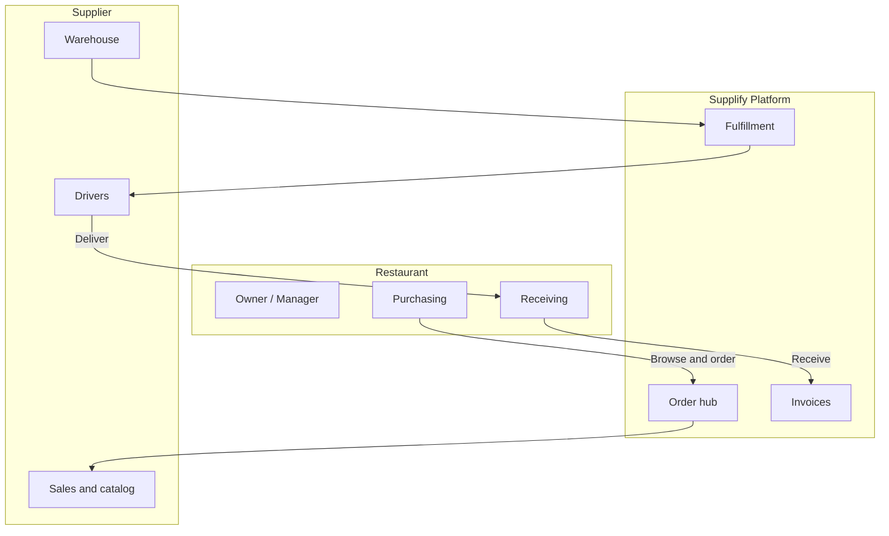

# Supplify — Customer Overview

**For:** Restaurant owners, supplier leadership, and operations teams  
**Purpose:** Understand what Supplify delivers — and why teams choose it over fragmented tools.

---

## The idea

Food service runs on relationships — but relationships break down when **orders, deliveries, and invoices live in different places**.

Supplify is the **connected platform** where restaurants and suppliers work from the **same facts**: what was ordered, what was shipped, what arrived, and what is owed.

> **Supplify in one line:** _From catalog to cash — one reliable flow for restaurants and their suppliers._

<h4>For restaurants</h4>
Order from every connected supplier, track delivery, receive fairly, and reconcile invoices without spreadsheet chaos.

<h4>For suppliers</h4>
Centralize orders, run fulfillment and drivers, grow your customer base, and get paid with full context.

<h4>For operations</h4>
Warehouses, dispatch boards, proof of delivery, and inventory — built for how F&amp;B actually works.

<h4>For growth</h4>
Deals, public catalogs, quote requests, and referrals — turn relationships into repeatable revenue.

---

## Why the status quo fails

| Today’s pain                      | The cost to your business                               |
| --------------------------------- | ------------------------------------------------------- |
| **Orders by phone and text**      | No shared record — disputes become “he said / she said” |
| **Delivery is a black box**       | Kitchens can’t plan; suppliers get blamed unfairly      |
| **Receiving is rushed**           | Shortages found days later, when resolution is harder   |
| **Invoices don’t match delivery** | Finance loses hours reconciling every week              |
| **Many suppliers, many systems**  | Staff re-learn a different process for each partner     |

Supplify replaces fragmentation with one auditable thread — from the first click to the final payment.

---

## Everyone in the ecosystem — connected

| Who                              | What they gain                                         |
| -------------------------------- | ------------------------------------------------------ |
| **Restaurant owners & managers** | Visibility across suppliers, spend, and operations     |
| **Purchasing staff**             | One place to order — quick lists, deals, chat          |
| **Receiving teams**              | Structured receiving with quality notes and disputes   |
| **Supplier sales**               | Digital catalog, promotions, and customer growth tools |
| **Warehouse & dispatch**         | Board, routes, drivers, proof of delivery              |
| **Drivers**                      | Focused mobile-friendly delivery workspace             |
| **Finance (both sides)**         | Invoices tied to real orders and receiving reports     |
| **Guests** _(optional)_          | Public reservations and consumer ordering              |

Each person sees **only what their role requires** — secure, simple, accountable.

---

## Restaurants — order with confidence

### Discover & purchase

- Browse **connected supplier catalogs** in one workspace
- Build a cart across **multiple suppliers** in a single session
- Save **quick lists** for weekly staples; schedule automatic reorders
- Apply **deals and promotions** at checkout

### Track & receive

- **Live order status** — placed, confirmed, shipped, delivered
- Optional **GPS tracking** when your supplier dispatches drivers
- **Receiving workflow** at the door — quantities, quality, photos
- Fair **disputes and credit notes** when something isn’t right

### Run the operation

- **Inventory** with expiry awareness for critical SKUs
- **Reorder assistance** as your plan scales (patterns → forecasts)
- **Invoices and payments** linked to what you actually received
- **Reservations** and **staff tools** for front-of-house teams

---

## Suppliers — fulfill without friction

### Win & retain customers

- Rich **product catalog** with images and bulk import
- **Public mini-store** so new restaurants can discover you
- **Promotions and deals** your buyers will actually see
- **Growth program** — import prospects, referrals, sponsorships

### Operate at scale

- Central **order inbox** — accept, decline, or amend with reasons
- **Calendar** of upcoming deliveries
- **Warehouse stock** and multi-location fulfillment
- **Dispatch board** — assign drivers, plan routes, capture proof of delivery

### Get paid with clarity

- **Invoices from fulfilled orders** — less manual billing
- Payment recording and **receivables** visibility
- **Chat** next to orders — resolve questions in context

---

## How an order flows — both sides, same truth

| Step            | Restaurant sees                | Supplier sees             |
| --------------- | ------------------------------ | ------------------------- |
| **1 · Order**   | Catalog, cart, confirmation    | Instant notification      |
| **2 · Confirm** | Acceptance or proposed changes | Accept, decline, or amend |
| **3 · Fulfill** | Status updates                 | Pick, pack, assign driver |
| **4 · Deliver** | Optional live tracking         | Driver status & proof     |
| **5 · Receive** | Receiving report               | Full delivery record      |
| **6 · Invoice** | Invoice to review & pay        | Receivable recorded       |

**When things change** — shortages, substitutions, quality issues — amendments and disputes stay **on the same order thread**. No lost emails. No mystery.

---

## Everything you need — one platform

| Capability                 | Restaurant | Supplier |
| -------------------------- | :--------: | :------: |
| Catalog & search           |     ✓      | ✓ Manage |
| Multi-supplier ordering    |     ✓      |    —     |
| Quick lists & scheduling   |     ✓      |    —     |
| In-context chat            |     ✓      |    ✓     |
| Fulfillment & dispatch     |     —      |    ✓     |
| Driver delivery & tracking |    View    |    ✓     |
| Receiving & quality        |     ✓      |   View   |
| Disputes & credit notes    |     ✓      |    ✓     |
| Invoices & payments        |     ✓      |    ✓     |
| Inventory & expiry         |     ✓      |    ✓     |
| Promotions & deals         |   Redeem   |  Create  |
| Reservations               |     ✓      |    —     |
| Staff & scheduling         |     ✓      |    —     |
| Reports & insights         |     ✓      |    ✓     |
| Team roles & permissions   |     ✓      |    ✓     |

_Available capabilities depend on your subscription plan._

---

## Plans that grow with your business

Start with a **Free Trial** to validate fit with your real suppliers and workflows. Scale into paid tiers as volume, users, and locations grow.

| Plan                  | Ideal for                  | What you unlock                                             |
| --------------------- | -------------------------- | ----------------------------------------------------------- |
| **Free Trial**        | Evaluation                 | Core workflows for 30 days against a Growth trial target    |
| **Restaurant Growth** | Single-location restaurant | Purchasing, receiving, inventory, Growth AI allowance       |
| **Restaurant Scale**  | Multi-branch restaurant    | Up to 3 branches, advanced roles/reports, richer AI reorder |
| **Supplier Growth**   | Growing distributor        | Catalog, fulfillment, 50 active customer locations / month  |
| **Supplier Scale**    | High-volume distributor    | Multi-warehouse / drivers, 200 active customer locations    |

**Restaurants and suppliers** each choose the plan that matches their side of the relationship. Your Supplify contact will recommend a starting point based on branches or active customer locations — not a shared Silver/Gold/Platinum ladder. Details: [../product/four-plan-pricing-model.md](../product/four-plan-pricing-model.md).

---

## Built for trust

| Commitment                  | What it means for you                                                          |
| --------------------------- | ------------------------------------------------------------------------------ |
| **Secure access**           | Modern sign-in; each organization has its own isolated workspace               |
| **Role-based permissions**  | Owners, managers, purchasers, drivers, and accountants see only what they need |
| **Complete audit trail**    | Orders, status changes, receiving, and invoices are recorded                   |
| **Reliable infrastructure** | Cloud-hosted, designed for uptime and secure file handling                     |
| **Fair dispute resolution** | Evidence stays attached to the order — not buried in chat                      |

Your operational and financial data deserves the same rigor you bring to the kitchen and the warehouse.

---

## Go live in weeks — not months

| Phase                | What happens                                                  |
| -------------------- | ------------------------------------------------------------- |
| **Week 1 · Setup**   | Account, profile, team invites, plan selection                |
| **Week 2 · Connect** | Link trading partners; publish or browse catalogs; test order |
| **Week 3 · Operate** | Real orders through delivery, receiving, and invoicing        |

Most teams run production workflows within **two to three weeks**. Your Supplify onboarding lead provides checklists, training, and go-live support.

---

## Why teams choose Supplify

|                       |                                                                |
| --------------------- | -------------------------------------------------------------- |
| **One platform**      | Replace phone orders, spreadsheets, and disconnected tools     |
| **Shared truth**      | Restaurant and supplier always see the same order state        |
| **Faster resolution** | Amendments and disputes with full context                      |
| **Built for F&amp;B** | Not generic ERP — reservations, expiry, supplier relationships |
| **Scales with you**   | From single location to multi-branch networks                  |

---

## Your next step

1. **Book a demo** — We walk through _your_ scenario: restaurant, supplier, or both.
2. **Start a Free Trial** — Place real orders with your trading partners.
3. **Go live** — We support onboarding, training, and success reviews.

**Speak with your Supplify representative** for pricing, trial access, and a rollout plan tailored to your operation.

---

_Supplify · Restaurant & F&B supplier marketplace · Ordering · Receiving · Fulfillment · Finance_
