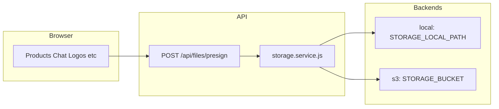

# File uploads — where bytes live and how the pipeline works

Supplify does **not** store uploaded file bytes in PostgreSQL. The database keeps URLs, keys, and sizes (for quotas). Actual files go through one API storage layer controlled by `STORAGE_DRIVER`.

## Summary

| Layer                      | What is stored                                               |
| -------------------------- | ------------------------------------------------------------ |
| Filesystem or object store | Image/PDF bytes                                              |
| PostgreSQL                 | `publicUrl`, `file_key`, `file_url`, `file_size_bytes`, etc. |

**Single pipeline:** `POST /api/files/presign` → browser `PUT` to presigned URL → feature API saves the reference.

Implementation: [`apps/api/src/services/storage/storage.service.js`](../../apps/api/src/services/storage/storage.service.js), routes in [`apps/api/src/routes/files.routes.js`](../../apps/api/src/routes/files.routes.js).

## Architecture



## Storage backends

Configured in [`apps/api/src/config/env.js`](../../apps/api/src/config/env.js). See also [ENVIRONMENT_VARIABLES.md](../../ENVIRONMENT_VARIABLES.md) and [DEPLOYMENT_RAILWAY_ENVIRONMENTS.md](../../DEPLOYMENT_RAILWAY_ENVIRONMENTS.md) (section Storage).

### Local (`STORAGE_DRIVER=local`)

Typical for **Railway dev** ([`deploy/railway/development/api.env`](../../deploy/railway/development/api.env)):

| Variable             | Example                           | Role                                             |
| -------------------- | --------------------------------- | ------------------------------------------------ |
| `STORAGE_LOCAL_PATH` | `uploads`                         | Directory on the API host (created on startup)   |
| `STORAGE_PUBLIC_URL` | `https://api.example.com/uploads` | Base URL for browser reads                       |
| `API_PUBLIC_URL`     | same host                         | Used to build presigned PUT URL for local driver |

**Object key pattern:** `uploads/{userId}/{timestamp}-{safeFileName}`

**On disk:** `{STORAGE_LOCAL_PATH}/uploads/{userId}/...` (the `uploads/` prefix is part of the key).

**Public URL:** `{STORAGE_PUBLIC_URL}/uploads/{userId}/...` — the path segment `/uploads/` appears twice (static mount + key prefix). That is expected.

**Reads:** [`apps/api/src/server.js`](../../apps/api/src/server.js) serves `express.static(STORAGE_LOCAL_PATH)` at `/uploads`.

**Writes:** API returns a tokenized URL `PUT /api/files/upload/:token`; [`localStorageProvider.js`](../../apps/api/src/services/storage/localStorageProvider.js) writes the file after verifying the token.

**Railway warning:** Container disk is **ephemeral** unless you attach a [Railway Volume](https://docs.railway.com/guides/volumes) mounted at `STORAGE_LOCAL_PATH` (e.g. `/app/uploads`). Redeploy without a volume can delete uploaded files.

### S3-compatible (`STORAGE_DRIVER=s3`)

**Required for preprod and prod** (startup validation rejects `local` in production).

| Variable                                              | Role                                        |
| ----------------------------------------------------- | ------------------------------------------- |
| `STORAGE_ENDPOINT`                                    | S3 API endpoint (MinIO, Cloudflare R2, AWS) |
| `STORAGE_BUCKET`                                      | Bucket name (one per environment)           |
| `STORAGE_ACCESS_KEY_ID` / `STORAGE_SECRET_ACCESS_KEY` | Credentials                                 |
| `STORAGE_PUBLIC_URL`                                  | CDN or public gateway URL for browser reads |
| `STORAGE_REGION`                                      | Often `auto` for R2                         |

**Object key:** same `uploads/{userId}/{timestamp}-{safeFileName}` as local.

**Public URL (public bucket):** `{STORAGE_PUBLIC_URL}/{bucket}/{fileKey}` when `STORAGE_PUBLIC_READ=true` (MinIO dev).

**Public URL (private bucket — Railway default):** `{API_PUBLIC_URL}/api/files/object?key=...` when `STORAGE_PUBLIC_READ=false`. The API streams objects via [`GET /api/files/object`](../../apps/api/src/routes/files.routes.js).

**Railway Buckets:** Use variable references `ENDPOINT`, `BUCKET`, `ACCESS_KEY_ID`, `SECRET_ACCESS_KEY`, `REGION` (also mapped to `STORAGE_*` in [`env.js`](../../apps/api/src/config/env.js)). Set `STORAGE_PUBLIC_READ=false`. Virtual-hosted URLs are used automatically (`STORAGE_S3_FORCE_PATH_STYLE=false` for `storage.railway.app` / `storageapi.dev` endpoints).

**Writes:** Browser PUTs directly to AWS presigned URL (bytes do not pass through the API body).

**Local Docker:** Root `docker-compose.yml` sets `S3_ENDPOINT=http://minio:9000`; API auto-selects `s3` when an endpoint is set. Run `pnpm storage:ensure-buckets` from the API package to create buckets.

Legacy env aliases: `S3_*`, Railway `BUCKET` / `ENDPOINT`, and AWS SDK names map to `STORAGE_*` in `env.js`.

## Upload flow (step by step)

1. Client calls `POST /api/files/presign` with `fileName`, `fileType`, optional `fileSize`.
2. API validates:
   - Types: `image/jpeg`, `image/png`, `image/webp`, `application/pdf`
   - Max size: **10 MB**
   - Filename sanitization
   - Plan **storage_mb** quota ([`storage-upload.js`](../../apps/api/src/lib/storage-upload.js)) when `fileSize` is provided (skipped for `ADMIN`)
3. API returns `presignedUrl`, `publicUrl`, `fileKey`.
4. Client: `fetch(presignedUrl, { method: 'PUT', body: file, headers: { 'Content-Type': fileType } })`.
5. Feature persists the reference:
   - **Chat** → `message_attachment.file_url` ([`ChatPage`](../../apps/web/src/pages/ChatPage.tsx))
   - **Products** → `POST /api/files/product/:productId/attach`
   - **Logos / onboarding / settings** → tenant/org logo URL ([`LogoUpload.tsx`](../../apps/web/src/components/LogoUpload.tsx))
   - **Disputes** → `dispute_attachments.file_key`

**Ownership:** attach endpoints require `fileKey` under `uploads/{userId}/` ([`sanitize-upload.js`](../../apps/api/src/lib/sanitize-upload.js)).

## Features that use this pipeline

| Feature                   | Web entry                          | DB reference                  |
| ------------------------- | ---------------------------------- | ----------------------------- |
| Product images            | `ProductsPage`                     | Product / `attachment` tables |
| Chat attachments          | `ChatPage`                         | `message_attachment`          |
| Supplier/restaurant logos | `LogoUpload`, settings, onboarding | Org/tenant logo fields        |
| Disputes                  | Dispute forms (API)                | `dispute_attachments`         |

**Not** via presign: server-generated PDFs (e.g. invoices), outbound email images, static assets in the web build.

## Per environment

| Environment   | Typical driver | Where bytes live                                             |
| ------------- | -------------- | ------------------------------------------------------------ |
| dev (Railway) | `s3`           | Railway **Bucket** (private; served via `/api/files/object`) |
| dev (Docker)  | `s3`           | MinIO bucket `supplify`                                      |
| preprod       | `s3`           | Dedicated bucket (e.g. R2 `supplify-preprod`)                |
| prod          | `s3`           | Dedicated bucket; `local` blocked at startup                 |

**Health check:** `GET /health` includes storage driver health (`checkStorageHealth`).

## Operations checklist

### Railway dev — Storage Bucket (recommended)

1. In the **development** environment: **+ New** → **Bucket** → pick region and name (e.g. `supplify-storage-dev`).
2. Open the **API** service → **Variables** → use **Add variable references** and choose the **AWS SDK** preset for your bucket (injects `ENDPOINT`, `BUCKET`, keys, `REGION`).
3. Confirm [`deploy/railway/development/api.env`](../../deploy/railway/development/api.env) has `STORAGE_DRIVER=s3` and `STORAGE_PUBLIC_READ=false` (committed defaults).
4. Redeploy API. Upload a product image or chat file; URL should look like `https://<api-host>/api/files/object?key=uploads%2F...`.
5. `GET /health` should show storage `ok: true`.

See [Railway Storage Buckets](https://docs.railway.com/storage-buckets).

### Railway preprod/prod — Bucket or R2

1. Create a bucket per environment (never share dev and prod buckets).
2. Set in API secrets (see [`deploy/railway/preprod/secrets.env.example`](../../deploy/railway/preprod/secrets.env.example)):
   - `STORAGE_DRIVER=s3`
   - `STORAGE_ENDPOINT`, `STORAGE_BUCKET`, keys, `STORAGE_PUBLIC_URL`
3. For private buckets, set `STORAGE_PUBLIC_READ=false` and serve via signed URLs in a future hardening pass (prod validation warns on public read).

### Local native dev

```bash
pnpm local:infra
```

In `apps/api/.env`:

```env
STORAGE_DRIVER=local
STORAGE_LOCAL_PATH=uploads
REDIS_URL=redis://localhost:6379
```

Or use full Docker (`pnpm dev:docker`) for MinIO + `STORAGE_DRIVER=s3` automatically.

## Related docs

- [DEPLOYMENT_RAILWAY_ENVIRONMENTS.md](../../DEPLOYMENT_RAILWAY_ENVIRONMENTS.md) — env-specific storage table
- [ENVIRONMENT_VARIABLES.md](../../ENVIRONMENT_VARIABLES.md) — variable reference
- [docs/guides/USAGE.md](../guides/USAGE.md) — storage_mb metering on presign
