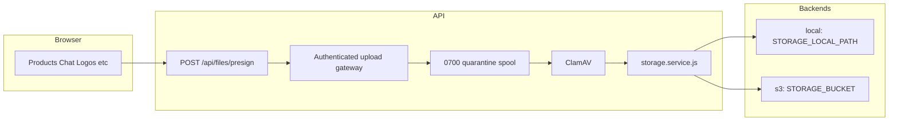

# File uploads — where bytes live and how the pipeline works

Supplify does **not** store uploaded file bytes in PostgreSQL. The database keeps URLs, keys, and sizes (for quotas). Actual files go through one API storage layer controlled by `STORAGE_DRIVER`.

## Summary

| Layer                      | What is stored                                               |
| -------------------------- | ------------------------------------------------------------ |
| Filesystem or object store | Image/PDF bytes                                              |
| PostgreSQL                 | `publicUrl`, `file_key`, `file_url`, `file_size_bytes`, etc. |

**Single pipeline:** `POST /api/files/presign` → authenticated gateway `PUT` → private quarantine spool → ClamAV → magic-byte validation → private storage → feature API saves the reference. The API retains the legacy `presignedUrl` and `url` response field names; they now point to the API gateway, never directly to S3.

Implementation: [`apps/api/src/services/storage/storage.service.js`](../../apps/api/src/services/storage/storage.service.js), routes in [`apps/api/src/routes/files.routes.js`](../../apps/api/src/routes/files.routes.js).

## Architecture



## Storage backends

Configured in [`apps/api/src/config/env.js`](../../apps/api/src/config/env.js). See also [environment-variables.md](../operations/environment-variables.md) and [railway-environments.md](../operations/railway-environments.md) (section Storage).

### Local (`STORAGE_DRIVER=local`)

Typical for **Railway dev** ([`deploy/railway/development/api.env`](../../deploy/railway/development/api.env)):

| Variable             | Example                           | Role                                             |
| -------------------- | --------------------------------- | ------------------------------------------------ |
| `STORAGE_LOCAL_PATH` | `uploads`                         | Directory on the API host (created on startup)   |
| `STORAGE_PUBLIC_URL` | `https://api.example.com/uploads` | Base URL for browser reads                       |
| `API_PUBLIC_URL`     | same host                         | Used to build presigned PUT URL for local driver |

**Object key pattern:** `uploads/{userId}/{timestamp}-{safeFileName}`

**On disk:** `{STORAGE_LOCAL_PATH}/uploads/{userId}/...` (the `uploads/` prefix is part of the key).

**URL:** `{API_PUBLIC_URL}/api/files/object?key=...&exp=...&sig=...`; the API authorizes and streams the object. Production does not expose the local upload directory as a public static mount.

**Reads:** [`GET /api/files/object`](../../apps/api/src/routes/files.routes.js) authorizes the signed/object request and performs scan-on-read for legacy objects.

**Writes:** API returns a tokenized URL `PUT /api/files/upload/:token`; [`localStorageProvider.js`](../../apps/api/src/services/storage/localStorageProvider.js) writes the file after verifying the token.

**Railway warning:** Container disk is **ephemeral** unless you attach a [Railway Volume](https://docs.railway.com/guides/volumes) mounted at `STORAGE_LOCAL_PATH` (e.g. `/app/uploads`). Redeploy without a volume can delete uploaded files.

### S3-compatible (`STORAGE_DRIVER=s3`)

**Required for preprod and prod** (startup validation rejects `local` in production).

| Variable                                              | Role                                        |
| ----------------------------------------------------- | ------------------------------------------- |
| `STORAGE_ENDPOINT`                                    | S3 API endpoint (MinIO, Cloudflare R2, AWS) |
| `STORAGE_BUCKET`                                      | Bucket name (one per environment)           |
| `STORAGE_ACCESS_KEY_ID` / `STORAGE_SECRET_ACCESS_KEY` | Credentials                                 |
| `STORAGE_PUBLIC_URL`                                  | CDN or public gateway URL for browser reads |
| `STORAGE_REGION`                                      | Often `auto` for R2                         |

**Object key:** same `uploads/{userId}/{timestamp}-{safeFileName}` as local.

**URL:** `{API_PUBLIC_URL}/api/files/object?key=...&exp=...&sig=...`. `STORAGE_PUBLIC_READ=false` is the default and is required in hosted environments. The API streams objects through the authorization and exact-version scan gate.

**Railway Buckets:** Use variable references `ENDPOINT`, `BUCKET`, `ACCESS_KEY_ID`, `SECRET_ACCESS_KEY`, `REGION` (also mapped to `STORAGE_*` in [`env.js`](../../apps/api/src/config/env.js)). Set `STORAGE_PUBLIC_READ=false`. Virtual-hosted URLs are used automatically (`STORAGE_S3_FORCE_PATH_STYLE=false` for `storage.railway.app` / `storageapi.dev` endpoints).

**Writes:** All clients use `PUT {API_PUBLIC_URL}/api/files/upload/:token` (or `/upload-import/:token` for a ZIP). The API verifies the authenticated user, tenant, content type, byte limit, one-time database session, malware verdict, and SHA-256 before promoting the object. S3 credentials and bucket names never reach clients.

**Local Docker:** Root `docker-compose.yml` sets `S3_ENDPOINT=http://minio:9000`; API auto-selects `s3` when an endpoint is set. Run `pnpm storage:ensure-buckets` from the API package to create buckets.

Legacy env aliases: `S3_*`, Railway `BUCKET` / `ENDPOINT`, and AWS SDK names map to `STORAGE_*` in `env.js`.

## Upload flow (step by step)

1. Client calls `POST /api/files/presign` with `fileName`, `fileType`, optional `fileSize`.
2. API validates:
   - Types: `image/jpeg`, `image/png`, `image/webp`, `application/pdf`
   - Max size: **10 MB**
   - Filename sanitization
   - Plan **storage_mb** quota ([`storage-upload.js`](../../apps/api/src/lib/storage-upload.js)) when `fileSize` is provided (skipped for `ADMIN`)
3. API creates a short-lived, single-use database session and returns `presignedUrl`, `url`, `publicUrl`, `fileKey`; both upload URL fields are gateway URLs.
4. Client sends an authenticated `PUT` with the exact `Content-Type`. Web includes credentials; mobile includes the bearer and active-tenant tokens.
5. Gateway spools bytes in a private `0700` directory, scans them with ClamAV before parsing or optimization, validates magic signatures/CSV text, then writes private storage.
6. Feature persists the reference:
   - **Chat** → `message_attachment.file_url` ([`ChatPage`](../../apps/web/src/pages/ChatPage.tsx))
   - **Products** → `POST /api/files/product/:productId/attach`
   - **Logos / onboarding / settings** → tenant/org logo URL ([`LogoUpload.tsx`](../../apps/web/src/components/LogoUpload.tsx))
   - **Disputes** → `dispute_attachments.file_key`

**Ownership:** attach/import/POD/dispute-attachment endpoints require a completed, clean database session owned by the authenticated user and tenant; prefix checks remain defense in depth.

### Security controls

- Normal uploads are capped at 10 MiB. ZIP uploads have a hard 100 MiB cap, plus entry-count, aggregate expansion, path-depth, per-entry, and extraction-time limits.
- A session can be claimed once. Replays with a different SHA-256 are rejected, while an identical completed retry is idempotent. Destination keys are unique to prevent an upload session from overwriting another session's object.
- Hosted startup fails closed if ClamAV is unavailable, bypass is enabled, scanner configuration is missing, S3 public-access verification is unsupported, or a bucket ACL/policy/public-access-block check is unsafe.
- Legacy objects are scanned on their first authorized API read under a PostgreSQL advisory lock. A clean verdict is accepted only for the exact SHA-256/ETag/version returned by storage.
- Logs redact upload tokens, signed object parameters, file keys, URLs, storage endpoints, bucket names, and authorization values.

## Features that use this pipeline

| Feature                   | Web entry                          | DB reference                  |
| ------------------------- | ---------------------------------- | ----------------------------- |
| Product images            | `ProductsPage`                     | Product / `attachment` tables |
| Bulk image import (ZIP)   | `ProductImageImportDialog`         | `catalog_image_import_job`    |
| Chat attachments          | `ChatPage`                         | `message_attachment`          |
| Supplier/restaurant logos | `LogoUpload`, settings, onboarding | Org/tenant logo fields        |
| Disputes                  | Dispute forms (API)                | `dispute_attachments`         |

**Not** via presign: server-generated PDFs (e.g. invoices), outbound email images, static assets in the web build.

### Bulk image import — dual write path

ZIP-based catalog image import uses **two** storage interactions:

1. **Client upload (presign)** — `POST /api/supplier/products/images/import/presign` returns an authenticated gateway PUT URL for the ZIP and optional mapping CSV. Object keys live under `imports/{supplierId}/{jobId}/{fileName}` (not the usual `uploads/{userId}/` prefix). ZIP uploads are hard-capped at 100 MiB; CSV uses the standard 10 MiB cap. ZIP bytes are scanned before `yauzl` inspection.

2. **Server-side `putObject`** — During job processing, the API reads each matched image from the ZIP, optimizes it, and writes main + thumbnail via [`putObject`](../../apps/api/src/services/storage/storage.service.js) to `uploads/{supplierId}/products/{productId}/main.webp` and `thumb.webp`. Storage quota is checked per image at this stage. The source ZIP is deleted with `deleteObject` when the job completes.

Remote URL imports (product CSV `image_url` column) skip the import presign path; the server fetches the URL and uses the same server-side `putObject` optimization pipeline.

See [bulk-product-image-import.md](../features/bulk-product-image-import.md).

## Per environment

| Environment   | Typical driver | Where bytes live                                             |
| ------------- | -------------- | ------------------------------------------------------------ |
| dev (Railway) | `s3`           | Railway **Bucket** (private; served via `/api/files/object`) |
| dev (Docker)  | `s3`           | MinIO bucket `supplify`                                      |
| preprod       | `s3`           | Dedicated bucket (e.g. R2 `supplify-preprod`)                |
| prod          | `s3`           | Dedicated bucket; `local` blocked at startup                 |

**Health check:** `GET /health` includes storage driver health (`checkStorageHealth`).

## Operations checklist

### Railway dev — Storage Bucket (recommended)

1. In the **development** environment: **+ New** → **Bucket** → pick region and name (e.g. `supplify-storage-dev`).
2. Open the **API** service → **Variables** → use **Add variable references** and choose the **AWS SDK** preset for your bucket (injects `ENDPOINT`, `BUCKET`, keys, `REGION`).
3. Confirm [`deploy/railway/development/api.env`](../../deploy/railway/development/api.env) has `STORAGE_DRIVER=s3` and `STORAGE_PUBLIC_READ=false` (committed defaults).
4. Redeploy API. Upload a product image or chat file; URL should look like `https://<api-host>/api/files/object?key=uploads%2F...`.
5. `GET /health` should show storage `ok: true`.

See [Railway Storage Buckets](https://docs.railway.com/storage-buckets).

### Railway preprod/prod — Bucket or R2

1. Create a bucket per environment (never share dev and prod buckets).
2. Set in API secrets (see [`deploy/railway/preprod/secrets.env.example`](../../deploy/railway/preprod/secrets.env.example)):
   - `STORAGE_DRIVER=s3`
   - `STORAGE_ENDPOINT`, `STORAGE_BUCKET`, keys, `STORAGE_PUBLIC_URL`
3. Set `STORAGE_PUBLIC_READ=false`, verify the bucket ACL/policy/public-access-block state, and serve through the signed API object route. Hosted startup rejects public reads or unverifiable privacy.

### Local native dev

```bash
pnpm local:infra
```

In `apps/api/.env`:

```env
STORAGE_DRIVER=local
STORAGE_LOCAL_PATH=uploads
REDIS_URL=redis://localhost:6379
```

Or use full Docker (`pnpm dev:docker`) for MinIO + `STORAGE_DRIVER=s3` automatically.

## Related docs

- [railway-environments.md](../operations/railway-environments.md) — env-specific storage table
- [environment-variables.md](../operations/environment-variables.md) — variable reference
- [docs/guides/usage-metering.md](../guides/USAGE.md) — storage_mb metering on presign

## POD binary upload contract (2026-09-18)

POD presigning accepts JPEG, PNG, or WebP files up to 10 MB and validates the MIME type, extension, and declared size. Web, Android, and iOS upload through the authenticated API gateway; ClamAV rejection asks for a replacement photo, while scanner outages keep the selected photo for retry. Proof submission is idempotent per order and must remain proof-first before a delivered status is confirmed.
