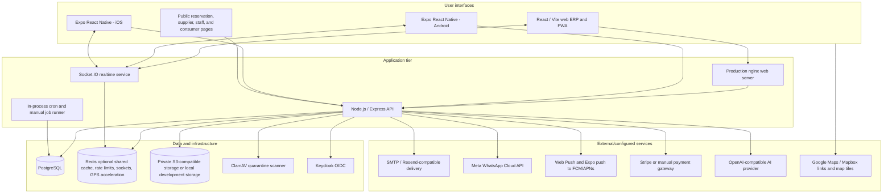
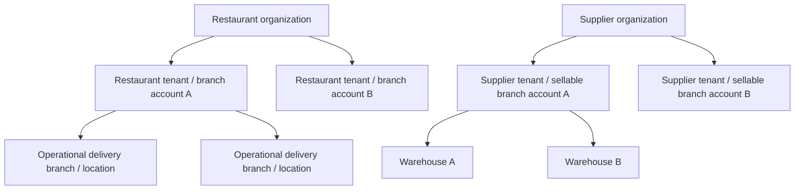
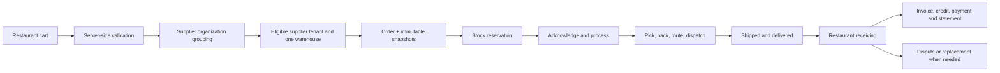
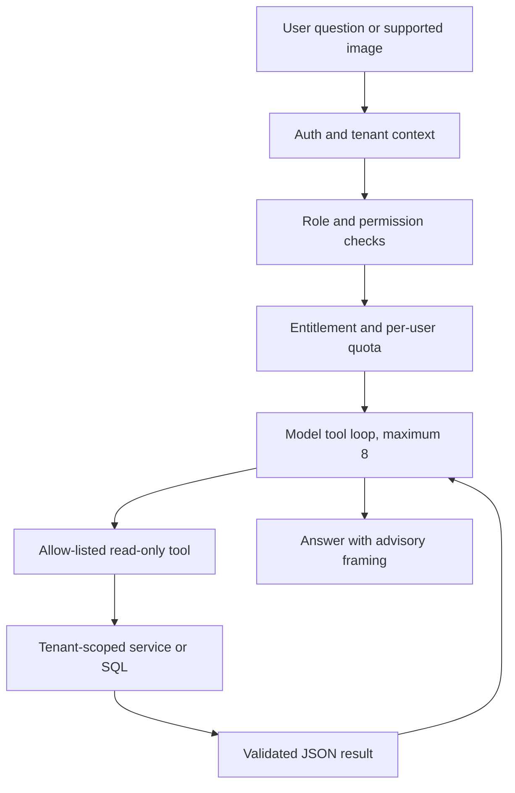
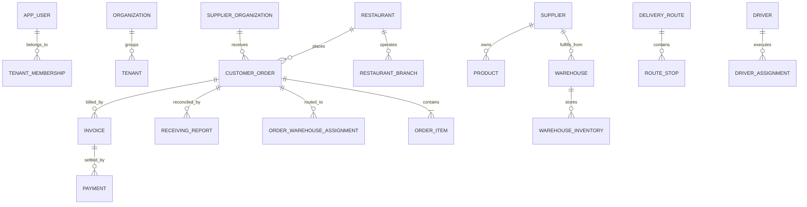

<div class="cover-page">

# Supplify

## Complete Product & Technical Guide

**Definitive repository-based product reference**  
**Edition:** 2026-09-26  
**Audience:** founders, product, engineering, QA, operations, support, employees, and technical partners

This guide explains what Supplify does, how people use it, how the system works, and which capabilities are complete, partial, configuration-dependent, dormant, or legacy.

</div>

<div class="page-break"></div>

## Document control

| Item                     | Value                                                                                                             |
| ------------------------ | ----------------------------------------------------------------------------------------------------------------- |
| Canonical source         | This Markdown file                                                                                                |
| Evidence cutoff          | Repository state inspected on 2026-09-26                                                                          |
| Primary repository       | `supplify_erp`                                                                                                    |
| Native clients inspected | `supplify-mobile` and `supplify-mobile-ios`                                                                       |
| Product behavior changed | No                                                                                                                |
| Status vocabulary        | Active; Partial; Present but not fully exposed; Dormant; Deprecated/legacy; Configuration-dependent; Planned only |

> **Repository truth rule.** Statements in this guide describe the checked-out code and migrations, not a sales roadmap. A database table, configuration key, or old document is not by itself proof of a usable feature. A capability is described as active only when its current API/service path and a usable client or operational path support the claim.

> **Deployment rule.** “Implemented” does not prove that a particular production environment has enabled the required provider credentials, feature override, plan entitlement, or background-job setting. Those dependencies are called out as configuration-dependent.

## Table of contents

1. [Purpose and audit method](#1-purpose-and-audit-method)
2. [Product overview](#2-product-overview)
3. [System architecture](#3-system-architecture)
4. [People, roles, and product surfaces](#4-people-roles-and-product-surfaces)
5. [Identity, registration, onboarding, and workspace context](#5-identity-registration-onboarding-and-workspace-context)
6. [Tenant, organization, branch, and warehouse model](#6-tenant-organization-branch-and-warehouse-model)
7. [Restaurant product](#7-restaurant-product)
8. [Supplier product](#8-supplier-product)
9. [Driver product](#9-driver-product)
10. [Complete B2B order lifecycle](#10-complete-b2b-order-lifecycle)
11. [Catalog, discovery, relationships, and search](#11-catalog-discovery-relationships-and-search)
12. [Pricing, contracts, quotes, deals, and loyalty](#12-pricing-contracts-quotes-deals-and-loyalty)
13. [Fulfillment, routing, warehouses, and delivery](#13-fulfillment-routing-warehouses-and-delivery)
14. [Receiving, disputes, returns, and resolution effects](#14-receiving-disputes-returns-and-resolution-effects)
15. [Finance, invoices, payments, statements, and billing](#15-finance-invoices-payments-statements-and-billing)
16. [Inventory, waste, quick lists, reorder, and recipes](#16-inventory-waste-quick-lists-reorder-and-recipes)
17. [Reservations, consumer ordering, loyalty, and staff](#17-reservations-consumer-ordering-loyalty-and-staff)
18. [Messaging, notifications, and realtime behavior](#18-messaging-notifications-and-realtime-behavior)
19. [Reports, dashboards, and operational intelligence](#19-reports-dashboards-and-operational-intelligence)
20. [AI and assisted intelligence](#20-ai-and-assisted-intelligence)
21. [Plans, subscriptions, entitlements, and limits](#21-plans-subscriptions-entitlements-and-limits)
22. [RBAC and permission enforcement](#22-rbac-and-permission-enforcement)
23. [Security architecture](#23-security-architecture)
24. [Data model](#24-data-model)
25. [Integrations and background processing](#25-integrations-and-background-processing)
26. [Web and mobile capability comparison](#26-web-and-mobile-capability-comparison)
27. [Important business rules](#27-important-business-rules)
28. [Known partial, dormant, legacy, and configuration-dependent areas](#28-known-partial-dormant-legacy-and-configuration-dependent-areas)
29. [Operations and support playbook](#29-operations-and-support-playbook)
30. [Glossary](#30-glossary)
31. [Final feature matrix](#31-final-feature-matrix)
32. [Evidence index](#32-evidence-index)

<div class="page-break"></div>

# 1. Purpose and audit method

This document answers five practical questions:

1. What exactly is Supplify today?
2. What can each user type do, and why?
3. How does a transaction move from discovery through payment and replenishment?
4. How are tenancy, permissions, plans, data, security, and integrations implemented?
5. Which product claims need qualification?

The audit began with the complete web route tree, API mounts, API route modules, service modules, database migrations, permission keys, system-role matrix, subscription migrations, navigation definitions, notification services, cron registry, and deployment configuration. It then cross-checked both native repositories by screen, navigator, API query module, type contract, and entitlement guard. Existing documentation was used as an index, then corrected when current code or later migrations disagreed.

### Status definitions

| Status                            | Meaning in this guide                                                                                                             |
| --------------------------------- | --------------------------------------------------------------------------------------------------------------------------------- |
| **Active / functional**           | Current server behavior and an accessible user or operations surface form a usable workflow.                                      |
| **Partially implemented**         | Real pieces work, but an important end-to-end step, differentiation, or integration is incomplete.                                |
| **Present but not fully exposed** | Working server capability exists but the relevant client surface is absent, narrow, or web-only.                                  |
| **Dormant**                       | Schema or code remains but the supported product deliberately does not expose it.                                                 |
| **Deprecated / legacy**           | Retained for compatibility or historical reads; new behavior should use another model.                                            |
| **Configuration-dependent**       | Code is implemented, but availability depends on provider credentials, environment flags, deployment topology, or plan overrides. |
| **Planned only**                  | Described as future work in repository documents without a supported implementation.                                              |

### Scope boundaries

The guide distinguishes the B2B supply order from the separate restaurant-to-consumer order. It also distinguishes operational finance records from externally confirmed movement of money. “Paid” in an operational invoice can mean that a user recorded a payment; only a configured payment gateway can make that an externally settled event.

Primary evidence anchors appear at the end of major feature sections. They are deliberately selective: they identify the implementation areas that establish the behavior, not every file that contributes to it.

# 2. Product overview

Supplify is a multi-tenant restaurant-supply marketplace and operating system. Restaurants discover suppliers, compare and negotiate prices, place orders, receive deliveries, manage stock, and reconcile invoices. Suppliers publish catalogs and prices, manage customers, reserve and fulfill stock, dispatch drivers, track receivables, and run growth programs. Drivers execute assigned stops, transmit location, record problems, and capture proof of delivery. Platform administrators operate tenants, plans, overrides, health, audits, and commercial review queues.

The core B2B loop is:

```mermaid
flowchart LR
  Need[Restaurant need] --> Discover[Supplier and product discovery]
  Discover --> Price[Catalog, contract, quote, deal, or loyalty price]
  Price --> Cart[Cart and checkout]
  Cart --> Order[Immutable order snapshots]
  Order --> Reserve[Warehouse selection and stock reservation]
  Reserve --> Fulfill[Confirm, pick, pack, dispatch]
  Fulfill --> Deliver[Driver route, GPS, ETA, and POD]
  Deliver --> Receive[Restaurant receiving and quality check]
  Receive --> Reconcile[Invoice, payment record, dispute, credit, replacement]
  Reconcile --> Learn[Inventory, recipe cost, reorder, and performance signals]
  Learn --> Need
```



### Product maturity at a glance

| Area                           | Current product reality                                                                                                                                                       | Status                                                                    |
| ------------------------------ | ----------------------------------------------------------------------------------------------------------------------------------------------------------------------------- | ------------------------------------------------------------------------- |
| B2B marketplace                | Supplier directory, public mini-store, catalogs, search, follows, blocks, favorites, reviews, RFQs, deals, contract prices, cart, and multi-supplier checkout.                | Active                                                                    |
| Transaction core               | Server-side price resolution, quantity rules, immutable line snapshots, atomic placement, idempotency, stock reservation, order history, and notifications.                   | Active                                                                    |
| Supplier operations            | Catalog, customer pricing, warehouses, inventory, pick lists, fulfillment board, routes, drivers, POD, exceptions, receivables, and growth tools.                             | Active                                                                    |
| Restaurant operations          | Purchasing, receiving, inventory, lots/expiry, waste, quick lists, reorder assistance, recipes/costing, finance records, reservations, staff, and optional consumer commerce. | Active, with module-specific plan gates                                   |
| Delivery                       | Assignments, routes/stops, foreground native GPS sessions, optional realtime events, polling fallback, ETA, proof, failure and retry states.                                  | Active; routing ETA is approximate                                        |
| Finance                        | Invoices, payments recorded against invoices, credit notes, statements, aging, reminders, PDFs/CSV, payables, and receivables.                                                | Active operational ledger; external settlement is configuration-dependent |
| Subscription billing           | Tenant-specific plans, entitlements, quotas, overrides, trials, add-ons, checkout, renewal jobs, manual/stub/Stripe gateways.                                                 | Implemented, but production PSP use is configuration-dependent            |
| Deterministic intelligence     | Price, waste, reliability, margin, over-ordering, invoice anomaly, forecast, stockout, slow-moving, cross-sell, and weekly summaries.                                         | Active, tiered, mostly web surfaced                                       |
| Conversational assistant       | Tenant-scoped, read-only, tool-based assistant using live authorized data and per-user quotas.                                                                                | Active for Scale and admins when AI is configured; drivers excluded       |
| Consumer channel               | Public menu, modifiers, account/guest ordering, COD-oriented flow, receipt tracking, reviews, and restaurant-scoped loyalty.                                                  | Active but separate from B2B procurement and recipe depletion             |
| Central purchasing and budgets | Historical tables and earlier foundation existed; supported central-purchasing API now returns `410 Gone`, and plan key was removed.                                          | Dormant/deprecated, not a product claim                                   |

The product’s strongest asset is the cross-party operational record: the price chosen, stock reserved, warehouse and driver assigned, delivery proof captured, quantities actually received, discrepancies disputed, invoice issued, payment recorded, and replenishment signals generated. Its main complexity is that those stages use several related state machines rather than one status.

# 3. System architecture

## 3.1 Runtime components



The API is the contract boundary. Clients do not calculate authoritative order prices, tenant scope, permissions, stock reservations, or financial totals. PostgreSQL is the durable source of truth. Redis improves shared caches, Socket.IO fan-out, distributed rate limits, and selected GPS paths when configured, with fallbacks for several non-critical caches. Files are not stored in PostgreSQL; the database stores metadata and object references.

## 3.2 Repository layout

| Area                                     | Responsibility                                                                                                                                                                    |
| ---------------------------------------- | --------------------------------------------------------------------------------------------------------------------------------------------------------------------------------- |
| `apps/web`                               | React/Vite ERP, public pages, PWA/service worker, English and Arabic UI.                                                                                                          |
| `apps/api`                               | Express routes, service layer, jobs, database migrations, security and integrations.                                                                                              |
| `packages/*`                             | Shared or emerging auth, configuration, entitlements, flags, types, database, and utility packages; the active application still contains substantial implementation in `apps/*`. |
| `deploy`, `docker`, `docker-compose.yml` | Railway and local infrastructure for web, API, PostgreSQL, Redis, MinIO, ClamAV, Mailpit, and Keycloak.                                                                           |
| sibling native repositories              | Expo applications for Android and iOS; sources are intentionally outside this monorepo.                                                                                           |

## 3.3 Request and data flow

1. Keycloak authenticates the user. Web uses HTTP-only access/refresh cookies; native clients use bearer access tokens and secure refresh-token handling.
2. The API verifies the JWT, links it to `app_user`, determines the active workspace, and resolves effective tenant context.
3. Route middleware applies role, permission, feature entitlement, subscription lock, usage limit, CSRF, and rate-limit checks as appropriate.
4. Services execute parameterized SQL. Transactional operations use a checked-out database client, row locks, unique constraints, and idempotency records where needed.
5. Domain side effects create audit/system events and notifications after or alongside the durable change. Channel delivery failures generally do not roll back the business transaction.
6. Realtime events accelerate UI updates; clients retain API refetch/polling fallbacks.

## 3.4 Deployment

The documented deployment target is Railway with separate development, preproduction, and production environments. Web is a static Vite build served by nginx. The API runs Node/Express and performs readiness checks; PostgreSQL is required. Redis, S3-compatible storage, ClamAV, Keycloak, SMTP, push credentials, WhatsApp, Stripe, and AI credentials are separately configurable. Local Docker Compose includes PostgreSQL 16, Redis 7, MinIO, ClamAV, Mailpit, Keycloak, migration, API, web, and nginx services.

**Evidence anchors:** `apps/api/src/server.js`; `apps/web/src/App.tsx`; `apps/api/src/lib/socket.js`; `apps/api/src/lib/cache.js`; `apps/api/src/lib/session-store.js`; `docker-compose.yml`; `docs/operations/deployment.md`; `docs/operations/storage-uploads.md`.

# 4. People, roles, and product surfaces

## 4.1 User groups

| User                   | Primary jobs in Supplify                                                                                                            | Principal scope                                                 |
| ---------------------- | ----------------------------------------------------------------------------------------------------------------------------------- | --------------------------------------------------------------- |
| Platform administrator | Manage tenants, users, plans, subscriptions, usage, flags, overrides, deals, health, operations, audits, and support impersonation. | Platform, narrowed by admin permission and impersonation rules. |
| Restaurant owner       | Control restaurant account, branches, staff, purchasing, inventory, finance, reservations, and settings.                            | Tenant or restaurant organization.                              |
| Restaurant manager     | Run orders, receiving, inventory, reservations, recipes, and daily operations without full account administration.                  | Assigned restaurant workspace.                                  |
| Purchaser              | Discover suppliers, view catalog, create/edit orders, use chat, and work with recipes without finance administration.               | Assigned restaurant workspace.                                  |
| Receiving staff        | View orders and record receiving/discrepancy information.                                                                           | Assigned restaurant workspace.                                  |
| Restaurant accountant  | View/manage invoices and payments and view related orders/subscription.                                                             | Assigned restaurant workspace.                                  |
| FOH staff              | Manage reservations and view limited recipe context.                                                                                | Assigned restaurant workspace.                                  |
| Supplier owner         | Control supplier business, linked branch accounts, staff, catalog, operations, finance, and growth.                                 | Supplier tenant or organization.                                |
| Supplier manager       | Manage orders, catalog, stock, fulfillment, promotions, customers, and growth.                                                      | Assigned supplier workspace.                                    |
| Warehouse manager      | Manage warehouses, inventory, picking, transfer, fulfillment, and order visibility.                                                 | Assigned supplier/warehouse scope.                              |
| Fulfillment staff      | Pick, pack, dispatch, and update operational order work.                                                                            | Assigned supplier workspace.                                    |
| Catalog manager        | Maintain product, price, category, import, and inventory data.                                                                      | Assigned supplier workspace.                                    |
| Promotions manager     | Operate deals and promotion-oriented customer activity.                                                                             | Assigned supplier workspace.                                    |
| Supplier accountant    | Operate invoices, payments, statements, and receivables.                                                                            | Assigned supplier workspace.                                    |
| Driver                 | Work only assigned delivery legs, route stops, GPS session, status, problems, and proof.                                            | Linked driver profile and active assignments.                   |
| Staff portal user      | View personal shifts/documents/announcements, clock in/out, and request PTO/swaps.                                                  | Own staff record; blocked from the ERP.                         |
| Restaurant guest       | Book/manage reservations, accept waitlist offers, and submit a post-visit review using public tokens.                               | One public reservation relationship.                            |
| Consumer diner         | Browse a restaurant menu, place and track a consumer order, and use restaurant loyalty.                                             | One restaurant storefront/account.                              |

Owners receive full tenant permissions. Named system roles receive explicit permissions. Custom roles are available when the `advanced_roles` entitlement is on. Read-only viewer roles are built from view permissions and contain no mutation permissions.

## 4.2 Product surfaces

| Surface                     | Intended use                                                                                                                                               | Important limits                                                                          |
| --------------------------- | ---------------------------------------------------------------------------------------------------------------------------------------------------------- | ----------------------------------------------------------------------------------------- |
| Web ERP                     | Full restaurant and supplier administration and operations; platform admin; public storefronts; responsive driver page.                                    | Broadest surface; some actions remain permission/plan gated.                              |
| Android and iOS native apps | Daily restaurant, supplier, and driver workflows, notifications, chat, order operations, receiving, inventory, dispatch, and selected commercial features. | Advanced admin, organization management, imports, and most intelligence remain web-first. |
| Staff portal                | Personal workforce self-service with separate session/access rules.                                                                                        | Cannot enter main ERP or manager APIs.                                                    |
| Public reservation portal   | Availability, booking, waitlist, manage link, cancellation/reschedule, and review.                                                                         | Token/public rate limits; no tenant access.                                               |
| Public supplier mini-store  | Branded supplier profile/catalog; authenticated priced browsing where required.                                                                            | Does not bypass supplier relationship or pricing rules.                                   |
| Consumer storefront         | Restaurant menu, cart, checkout, receipt/track, account, reviews, and rewards.                                                                             | Separate order and loyalty domain from B2B supply.                                        |

# 5. Identity, registration, onboarding, and workspace context

## Identity and session management

### What it is

Keycloak-backed identity with web OIDC login, native token login/refresh, automatic application-user linking, role bootstrap, logout, session recovery, email OTP support, locale preference, and legal-acceptance gates.

### Who uses it and why

All authenticated platform users. It centralizes identity while allowing Supplify to enforce tenant membership and business permissions independently of Keycloak realm roles.

### User workflow

1. A web user is redirected to Keycloak or uses the configured email OTP path.
2. Keycloak returns an authorization code; the API validates OAuth state, exchanges it, and stores HTTP-only cookies.
3. A native user authenticates through the mobile Keycloak client and sends a bearer token. Mobile refresh uses `/auth/mobile/refresh`.
4. The API verifies JWT signature/issuer/audience through Keycloak JWKS and upserts or resolves the corresponding `app_user`.
5. `/auth/me` returns the user, active workspace, roles, permissions, plan context, and legal requirements used to build navigation.
6. Expired web access tokens use rotation-aware single-flight refresh. Native clients explicitly refresh.

### Business rules and protections

- Unknown users default to `PENDING`, not a privileged tenant role.
- Deactivated users are rejected.
- Platform roles take precedence over a staff-portal role on a dual-role identity.
- Staff-portal accounts are blocked from normal ERP routes.
- Access, refresh, and ID cookies are HTTP-only, secure in production, SameSite-configured, and cleared consistently on logout.
- Web API mutations require the Supplify custom CSRF header and a trusted origin; verified bearer requests bypass cookie CSRF because they do not rely on ambient cookies.
- Legal documents are versioned and reacceptance can gate application use.

### Technical implementation

Web login/callback/refresh/logout live below `/auth`; native refresh returns tokens in JSON. OAuth state uses a PostgreSQL-backed Express session shared across API instances. The user record and tenant context are cached briefly, with Redis used when configured. English/Arabic locale preference persists on the user; the web shell sets the root document direction to LTR or RTL and directional components respond to it. Authentication recovery is Keycloak-managed. Authorized platform support also has a separately permissioned, audited password-reset workflow with strong temporary-password generation and peer-platform-admin protection.

### Status

**Active.** Email delivery, email OTP, and hosted Keycloak availability remain configuration-dependent.

**Evidence anchors:** `apps/api/src/routes/auth.routes.js`; `apps/api/src/lib/auth.js`; `apps/api/src/lib/rbac.js`; `apps/api/src/lib/mobile-auth.js`; `apps/api/src/lib/session-store.js`; `docs/features/auth-session-management.md`; native `src/features/auth` modules.

## Registration, activation, and onboarding

### What it is

Self-service registration and completion for restaurant or supplier owners, tenant creation, Free Trial creation, contact/profile capture, legal acceptance, onboarding status, and invitations for team and linked branch accounts.

### How users use it

1. The user chooses restaurant or supplier registration and authenticates/validates identity.
2. Registration completion creates the correct tenant, primary ownership/membership, contact details, default roles, and trial subscription.
3. Restaurant onboarding collects profile, delivery location, team, branches, notifications, reviews, and subscription settings.
4. Supplier settings collect profile, business rules, warehouses, branch accounts, team, notification, plan, fulfillment, and POD preferences.
5. Team invitations assign an allowed role. Organization invitations can create or link full branch accounts.

### Business rules

- A user has one active workspace context at a time even if memberships allow several.
- Tenant switch and branch switch validate membership; a client-supplied tenant ID is not trusted by itself.
- Owners cannot accidentally remove the last owner.
- Invitations expire, can be regenerated/rescinded, and are rate-limited on public acceptance.
- Trial duration is platform-configurable within the supported range; expiry places the account into a read-only recovery state rather than deleting data.

### Status

**Active.** Some organization and branch management is web-first; native apps provide a branch picker and consume active context.

## Workspace and tenant switching

The active tenant middleware reads the signed/validated workspace selection, not an arbitrary query parameter. Organization roles can be organization-wide or branch-assigned. Admin impersonation creates a short-lived, audited context and blocks billing mutations. Changing tenant or feature overrides emits/refetches entitlement context so navigation fails closed.

**Evidence anchors:** `apps/api/src/routes/register.routes.js`; `apps/api/src/lib/register-account.js`; `apps/api/src/routes/restaurant-onboarding.routes.js`; `apps/api/src/routes/org.routes.js`; `apps/api/src/routes/restaurant-org.routes.js`; `apps/api/src/lib/tenant-switch.js`; `apps/api/src/lib/impersonation.js`.

# 6. Tenant, organization, branch, and warehouse model

The words “branch” and “location” refer to different database concepts in different workflows. This model is essential to understanding discovery, ordering, billing, inventory, and permissions.



## Restaurant organization and locations

A restaurant organization groups full restaurant tenant accounts for organization-level membership and Scale analytics. Each restaurant tenant can also contain operational `branch` records used as delivery destinations and activity dimensions. A branch record is not a separate login/account. A branch account is a separate restaurant tenant linked to the organization.

At checkout, an explicit active operational branch is honored. If there is exactly one active branch it may be selected automatically. Multiple active branches require an explicit choice unless another unambiguous rule supplies it. With no operational branches, the restaurant tenant address is the fallback. The chosen location and instructions are snapshotted on the order so later profile edits do not rewrite history.

Restaurant Scale provides cross-branch visibility and deterministic organization insights. It does **not** provide central buying, cross-branch carts, automatic branch allocation, or an approval/budget system. The former central-purchasing endpoints intentionally return `410 Gone`.

## Supplier organization, tenant, and warehouse

A supplier organization is the customer-facing consolidation of linked supplier tenant accounts. Products, prices, contract prices, catalog visibility, staff scope, and stock remain owned by a supplier tenant. A warehouse is a fulfillment site beneath one supplier tenant, not a separate customer account.

Organization discovery can aggregate linked tenants without fuzzy-merging products. A basket must be fulfillable by a single eligible supplier tenant and, for new orders, one eligible warehouse for the full basket. A sibling tenant cannot fulfill another tenant’s product merely because both share an organization. Historical line-level warehouse assignments remain readable, but the hardened new-order path is no-split.

## Billing and permissions

The organization’s billing tenant resolves the effective plan and add-ons for linked branch accounts. Organization roles have explicit branch scope; tenant roles remain available inside each workspace. Creation limits count the organization where applicable. Existing locations are not deleted after a downgrade, but further creation can be blocked.

## Technical routing rules

Warehouse selection considers service-zone eligibility, product ownership/capability, warehouse stock, operating schedule/cutoff, delivery method/time, MOQ and business rules, contract compatibility, configured routing priority, then distance when reliable coordinates exist. It locks relevant stock rows in stable order. Transfer is allowed only within the same supplier tenant, while the assignment and order are still transferable, with sufficient compatible stock. Transfer preserves commercial snapshots.

## Status

**Active**, with important qualifications: organization-level consolidation does not create shared product ownership; new ordering is no-split; restaurant central purchasing is dormant; branch-level inventory attribution is not uniformly native across every older inventory record.

**Evidence anchors:** `docs/architecture/order-fulfillment-routing.md`; `apps/api/src/lib/supplier-org.js`; `apps/api/src/lib/restaurant-org.js`; `apps/api/src/services/warehouseRouting.js`; `apps/api/src/services/supplier-order-stock.service.js`; migrations `0023`, `0081`, `0082`, `0086`, `0191`, and `0207`.

<div class="page-break"></div>

# 7. Restaurant product

This chapter maps the restaurant workspace. Later chapters expand the cross-cutting technical rules.

## Dashboard and daily command view

### What it is / who uses it / why it exists

The landing surface summarizes purchasing and operations for restaurant owners and staff with relevant view permissions. It brings together orders, spend/invoice context, inventory and reorder signals, deliveries, reservations, quick actions, and subscription usage so a manager can identify today’s work without opening every module.

### How the user uses it

1. Select the active restaurant or branch context.
2. Review permitted summary cards and alerts.
3. Open the relevant order, inventory, finance, reservation, or supplier workflow.
4. Use the Assistant only when Scale, source permissions, quota, and AI configuration allow it.

### Business rules, implementation, and status

Dashboard data never widens source access: invoice, order, recipe-cost, and inventory data retain their own permissions and feature gates. React components consume tenant-scoped summary endpoints. **Status: Active.** Organization comparison and most advanced intelligence are web-only.

## Supplier discovery, relationships, profiles, and reviews

### What it is / why it exists

A searchable supplier directory with organization-aware cards, profiles, product coverage, follows, blocks, B2B reviews, common-product comparison, connection requests, and public mini-store links. It replaces scattered contact lists with persistent supply relationships.

### Workflow

1. Search/filter suppliers and browse product coverage.
2. Open a profile/catalog and review reputation and offers.
3. Follow a supplier, block an unsuitable one, or start a connection/chat.
4. Compare strictly matching products across followed organizations where evidence supports a match.
5. Add catalog items or issue an RFQ.

### Rules, RBAC, related features, and status

Catalog/order visibility is required. Product comparison requires compatible normalized name, unit, brand, and currency; no universal GTIN/barcode exists. Organization aggregation never fuzzy-merges tenant products. Reviews require eligible history. Relationships feed deals, growth, and Assistant sourcing tools. **Status: Active**, with deliberately conservative cross-supplier matching.

## Catalog, search, favorites, and price visibility

Restaurants browse supplier products by text, SKU, tag/category, supplier, and price context; inspect unit/package, MOQ, order multiple, stock indication, delivery context, deals, and negotiated prices; favorite products; and add legal quantities to cart.

Quantity must be positive, meet MOQ, and respect pack/order-multiple rules. Favorites neither reserve stock nor freeze price. The browser display is advisory: checkout reloads product and commercial records and resolves price server-side. Search history is user-scoped. **Status: Active.** Search quality depends on supplier master data.

## Cart, checkout, and delivery location

The client cart groups products by supplier organization. At checkout the restaurant chooses branch/delivery location, method, date/time, notes, eligible quote/deal, and loyalty redemption, then submits one idempotent request. The API creates one durable order per supplier group.

### Business rules and protections

- Mixed currencies in one supplier order are rejected.
- Multiple active delivery branches require an explicit choice.
- A supplier group must resolve to one child tenant and one eligible warehouse for the complete new basket.
- Price, quantity, contract/quote/deal provenance, tax/fees, and delivery location are snapshotted.
- Daily order usage is incremented atomically by the number of created supplier orders.
- Stock reservation and order creation share the transaction; any failure rolls back the set.
- Reusing an idempotency key with the same normalized request replays the response; different content conflicts.

**Permissions/RBAC:** `ORDERS_CREATE`, tenant membership, subscription write access, and applicable entitlements/limits. **Status: Active.** Cart persistence is client-side; authority begins at placement.

## Orders, calendar, amendments, cancellation, and reorder

Restaurant users list, search, filter, calendar-view, inspect, track, amend, cancel, receive, dispute, invoice-review, and reorder purchases. Order detail contains timeline, items, picking/packing context where exposed, delivery, invoice, and amendment views.

Restaurants may cancel from `PLACED`, `ACKNOWLEDGED`, or `PROCESSING`; the server rejects reverse/skipped transitions. Post-placement commercial changes use amendments rather than silent line edits. Quote locks retain provenance. Legacy `COMPLETED` is compatible only as a delivered mapping from shipped. **Status: Active.** Delivered, received, invoiced, and paid remain separate milestones.

## Quick lists and scheduled orders

Reusable product lists support manual cart loading, branch context, schedules, an execution ledger, and higher-tier smart quantities/item suggestions. Users create a list, add items, load it for review, or schedule the supported cadence.

List/item/schedule counts are plan-limited. Capability depends on the resolved `quick_lists` value. Scheduled execution is idempotently claimed and can create work or notify. Because price and availability may change after scheduling, this is not a complete budget/approval regime. **Status: Active; scheduled-spend governance partial.**

## Receiving and quality reconciliation

After physical delivery, receiving staff open the pending queue, compare expected and actual lines, record quantities and quality (`ACCEPTED`, `DAMAGED`, `EXPIRED`, `WRONG_ITEM`, `SHORT`), attach evidence, capture lot/expiry data, and finish as full, partial, or with dispute.

Receiving requires `RECEIVING_VIEW`/`RECEIVING_MANAGE` and `receiving_quality`; it is not a driver action. Driver delivery does not imply line acceptance. Completion drives inventory movements, invoice reconciliation/creation, review prompts, notifications, and dispute eligibility. **Status: Active.** A single combined three-way-match exception timeline is still partial.

## Inventory, lots, expiry, waste, and reorder

Restaurant inventory holds on-hand/par/reorder values, movements, imports, adjustments, totals, lots/expiry, waste/spoilage, suppressions, and deterministic reorder signals. Receiving can add stock; authorized staff adjust/import, record consumption or waste, and review low stock/expiry.

Adjustments are atomic and logged. SKU/storage limits apply. Waste is a recorded movement, not an inferred loss. Branch IDs exist on movements and forecasts, but older aggregate inventory is not uniformly branch-native. There is no automatic POS-driven recipe depletion. **Status: Active at tenant level; branch-perfect depletion/POS integration not implemented.**

## Finance, invoices, and statements

Restaurants view invoice lists/details/PDFs, payables, recorded payments, supplier statements, aging, credit effects, overdue context, and invoice anomaly reviews. Users follow the order/receiving link, inspect balances, and record/view payments when permitted.

An operational payment record is not automatically bank settlement. Invoice state preserves draft, issued, partial, paid, overdue, and void behavior. Currency is stored, but live FX/revaluation is absent. **Status: Active operational ledger; external collection and accounting reconciliation are configuration-dependent/partial.**

## Recipes, costing, and profitability

Recipes include ingredients, unit conversions, branch applicability, cost snapshots, portions, selling-price inputs, food-cost percentage, margin, recalculation queues, price-impact history, and advanced warnings.

Cost/margin requires `RECIPES_VIEW_COSTS`; `RECIPES_VIEW` alone is insufficient. Missing conversions/prices yield incomplete results instead of invented numbers. No default 30% target is fabricated. B2C menu items and B2B recipes are separate models. **Status: Active; menu/POS-to-procurement demand linkage not implemented.**

## Reservations and front of house

The FOH module provides tables, availability, public booking configuration, staff bookings, waitlist and auto-offers, blackouts, analytics, manage links, guest communications, cancellation/reschedule, and eligible post-visit reviews.

Availability respects party size, tables, time, local operating rules, and blackouts. Public actions are token-scoped and rate-limited. Auto-promotion is feature/job dependent. **Status: Active.** Reservation demand does not automatically create procurement.

## Staff and labour

Managers operate staff records, schedules, time entries, PTO, swaps, availability, announcements, documents, incidents, performance notes, payroll export, and labour summaries. Employees use a separate portal for their own shifts, clocking, requests, acknowledgements, and documents.

The staff portal is blocked from ERP manager APIs. A one-open-time-entry constraint prevents duplicate clocks. Payroll is an export/record workflow, not payroll processing. **Status: Active; management and portal are web-based.**

## Reports, notifications, settings, and audit

Reports cover supported order, spend, supplier, product, inventory/waste, fulfillment, and finance facts according to source permissions and `reports`. Settings cover profile, delivery location, team/roles, notifications, plan/usage, branding, legal/account, and branches. Tenant audit requires its entitlement. **Status: Active**, but “advanced custom reports” does not yet mean a general report builder.

**Restaurant evidence anchors:** restaurant routes in `apps/web/src/App.tsx`; `apps/web/src/components/sidebar/sidebarNavConfig.ts`; `apps/api/src/routes/restaurant-*.routes.js`; `apps/api/src/routes/quick-lists.routes.js`; `apps/api/src/routes/receiving.routes.js`; `apps/api/src/routes/recipes.routes.js`; `apps/api/src/routes/reservations.routes.js`; `apps/api/src/routes/staff.routes.js`.

<div class="page-break"></div>

# 8. Supplier product

## Home, dashboard, command center, and run sheet

Supplier landing and operational views summarize orders to prepare, delivery work, receivables, reorder-due customers, exceptions, growth activity, and Scale intelligence. Owners, managers, warehouse staff, sales/growth users, and accountants see only permitted cards. The command center prioritizes cross-domain work; the dated run sheet gives a pick/delivery/receivables agenda. **Status: Active; full command center and intelligence are web-first.**

## Organization and branch accounts

A supplier organization links several sellable supplier tenants, assigns organization roles/branch access, consolidates discovery/reporting, and uses the parent billing context. Each branch account retains its products, prices, staff, catalog relationships, and warehouse ownership. Link invitations require owner authorization and acceptance. Organization scope never permits cross-tenant stock substitution. **Status: Active**, managed mainly on web.

## Catalog and product management

Suppliers create/import products and categories, maintain SKU, package/unit, price, MOQ/order multiple, stock settings, substitutes, and images, review row-level import errors/jobs, and publish through tenant/organization catalogs.

Supplier SKU uniqueness is tenant-scoped. Product, initial price, and inventory creation is atomic. CSV imports may accept valid rows while rejecting others. Remote images use SSRF and upload controls. SKU/storage limits and catalog permissions apply. **Status: Active; bulk import and full category administration are web-first.**

## Pricing and contract pricing

Suppliers set catalog and customer-specific prices with validity/activation. Restaurants see negotiated values in My Prices; order lines store the resolved source and snapshot. Later price changes do not rewrite history. **Status: Active.** A quote response does not automatically become a reusable contract.

## Customers, growth, referrals, sponsorship, and placement

Suppliers import prospects, match existing restaurants, request connections, invite new tenants, sponsor eligible onboarding, request featured placement, and track funnel/reward/conversion metrics. Imported rows never grant tenant access. Sponsorship has eligibility, idempotency, billing, and expiry. Paid featured placement stays pending until admin approval. **Status: Active; full growth operations are web-first and payment is provider-dependent.**

## Incoming orders and order control

Supplier users receive a notification, review immutable lines and reserved stock, acknowledge or decline with a reason, move work into processing, pick/pack, record shortage/substitution issues, dispatch, and follow finance/dispute outcomes. The server enforces forward transitions and ownership. Amendments preserve counterparty acceptance. **Status: Active; a closed substitution-acceptance/quantity-adjustment loop is partial.**

## Inventory and warehouses

Legacy aggregate stock coexists with warehouse availability/reservations, adjustments, thresholds, alerts, zones, routing rules, and assignment transfer. Warehouse inventory is authoritative in warehouse mode and legacy totals are mirrored. Reassignment is allowed only in early states, within the same supplier tenant, to a compatible stocked warehouse. Driver assignment and transfer use separate permissions. **Status: Active; historical line splits remain readable while new orders are no-split.**

## Picking, packing, dispatch, routes, and exceptions

The fulfillment board exposes dispatch, pick lists, routes, tracking, and exceptions. Reserved work progresses through warehouse assignment states; a pick list affects only its leg. Staff assign a linked driver, build/reorder routes, and review unassigned, overdue, failed, stale-GPS, missing-proof, or stock issues. Active-assignment uniqueness is database-enforced. **Status: Active.** Route optimization is deterministic, not a traffic-aware fleet optimizer.

## Drivers and delivery management

Suppliers link driver identities, manage availability/vehicle metadata, assign delivery legs, view run sheets/maps, monitor freshness, and reschedule/retry failures. POD requirements are configurable business settings. **Status: Active**, with realtime GPS events configuration-dependent and polling retained.

## Promotions, deals, boosts, featured placement, and loyalty

Suppliers define percentage/fixed/free-shipping/buy-X-get-Y deals, target products/categories/restaurants, submit for review, buy boosts, inspect views/interactions/use, and operate B2B loyalty earning/redemption. Active deal count is metered. Eligibility and discount are recalculated server-side. Payment alone never bypasses admin placement/deal review. **Status: Active; external charges/refunds depend on provider configuration.**

## Quote inbox and responses

Suppliers receive targeted RFQs, decline or answer with line price, availability, notes, and expiry. A selected response creates one-order price-lock provenance. Response concurrency uses row locks. **Status: Active; quote-to-contract conversion is not implemented.**

## Finance and receivables

Supplier finance includes invoice issue/edit/PDF, recorded payments, credit notes, statements, aging, collections reminders, receivables, and accounting CSV exports. “Xero/QuickBooks” is an export format, not live bidirectional synchronization. **Status: Active ledger/export; partial for settlement and accounting integration.**

## Reports and deterministic intelligence

Standard reports cover orders, products, customers, fulfillment, finance, and activity. Supplier Scale adds read-only slow-moving stock, demand forecast, projected stockout, exact-product cross-sell, suggested-deal review, warehouse performance/demand, and weekly summary. These never mutate stock, publish deals, or contact customers automatically. **Status: Active, mostly web-only.**

## Settings, team, roles, notifications, and audit

Settings cover profile, business/delivery rules, POD, warehouses, branches, team, roles, branding/domain, plan, notifications, and audit. Advanced roles, audit, custom domain, WhatsApp/webhook, and multi-warehouse behavior depend on entitlements/provider configuration. **Status: Active.**

**Supplier evidence anchors:** `apps/api/src/routes/supplier-ops.routes.js`; `apps/api/src/routes/supplier-growth.routes.js`; `apps/api/src/routes/products.routes.js`; `apps/api/src/routes/warehouses.routes.js`; `apps/api/src/routes/fulfillment.routes.js`; `apps/api/src/routes/drivers.routes.js`; `apps/api/src/routes/promotions.routes.js`; supplier pages/navigation in web and both native repositories.

<div class="page-break"></div>

# 9. Driver product

The driver product is an intentionally narrow operational workspace. A driver sees only assignments linked to the driver's active profile, not the supplier's commercial, financial, customer, or AI workspaces. **Status: Active on native mobile and responsive web.**

## Today view, run sheet, and stop workflow

The Today screen groups assigned work into a practical sequence. A driver opens a route or assignment, reviews the next stop, contacts the destination when data is available, opens navigation, records pickup and delivery milestones, captures proof, or reports a problem. Suppliers create and dispatch routes; drivers execute them. The run sheet gives the supplier and driver a common view of route, stop, assignment, and exception state.

Rules that matter:

- a linked, active driver profile is required;
- tenant and assignment ownership are checked on every read and mutation;
- assignment state cannot jump arbitrarily;
- order delivery cannot be completed before the order is shipped;
- proof of delivery is evaluated for the specific assignment/leg, not merely for the order;
- a supplier setting can make proof mandatory;
- completion is atomic and idempotent, so a retry does not duplicate delivery events;
- failure, retry, reschedule, reassignment, and supersession preserve provenance.

Related modules include fulfillment, order status, notifications, GPS, proof storage, audit, and the supplier command center. **RBAC:** `DRIVER_DELIVERIES_VIEW` and `DRIVER_DELIVERIES_UPDATE`; broader supplier permissions are not implied.

## GPS, live tracking, ETA, and privacy

The native apps can start a tracking session and send foreground single or batched location samples plus heartbeats. PostgreSQL is the durable record. Redis can accelerate the most recent location, and Socket.IO can deliver live events; polling remains the compatibility fallback. Tracking is tied to assigned operational work and session state rather than acting as unrestricted employee surveillance.

ETA is an operational estimate based on coordinates, distance, recent motion, and bounded assumptions; it is not a traffic-aware routing guarantee. Freshness is classified, stale data is visibly degraded, and a hard-stale location is not presented as a reliable live position. Restaurant-facing tracking is sanitized; the supplier receives the richer operational view. Missing or invalid coordinates do not block order placement.

**Status:** Active. Foreground native tracking and realtime/polling fallback are implemented. Physical-device background behavior, battery optimization, OS permission combinations, and release credentials remain release-validation responsibilities.

## Proof, problems, and notifications

Proof can include the supported signature/photo/recipient evidence associated with the assignment. Uploads use the secure private upload pipeline described in section 23. Problems create durable exception context rather than silently forcing a success state. Driver milestone notifications are intentionally in-app only, suppressing email and WhatsApp noise. **Status: Active.**

# 10. End-to-end order lifecycle

## 10.1 Lifecycle summary



Physical delivery, operational receiving, and financial settlement are separate facts. `DELIVERED` does not mean the restaurant accepted every unit, and it does not mean an invoice was paid.

## 10.2 Browse to checkout

The restaurant searches only products it is allowed to see, with effective price and commercial eligibility calculated from supplier relationships, catalog state, contract price, promotions, delivery rules, and plan limits. The cart may contain products from multiple supplier organizations. Checkout revalidates authoritative product, quantity, price, currency, availability, delivery location, and promotion data; browser totals are never trusted.

At placement, lines are grouped by supplier organization. For each group the router selects an eligible child supplier tenant and one eligible warehouse capable of fulfilling the entire basket. A sibling tenant is not eligible unless it owns every requested product, and the system does not silently split a basket across warehouses. Selection considers service zone, product ownership and stock, fulfillment capabilities, operating schedule and cutoff, delivery method/window, minimum order and business rules, contract compatibility, configured priority, and distance when coordinates are trustworthy.

## 10.3 Delivery location and immutable snapshots

The buyer may select a restaurant branch. Exactly one active location may be auto-selected; when several are valid, an explicit choice is required. A legacy restaurant address is the compatibility fallback. The order stores delivery, product, price, tax, discount, currency, organization, and assignment context needed to preserve what the parties agreed at that time. Later catalog or address changes do not rewrite history.

## 10.4 Placement transaction and idempotency

Order creation is transactional: order groups, lines, snapshots, stock reservations, totals, promotion use, and loyalty effects succeed together or roll back. Mixed-currency groups are rejected. An idempotency key is unique per restaurant for 180 days. The service hashes the normalized request: an exact retry returns the original result, while reuse with different content is a conflict. Database constraints and row-level locking protect the same invariants under concurrency.

## 10.5 Order states

| Actor/current state                                   | Allowed next state                                                                    |
| ----------------------------------------------------- | ------------------------------------------------------------------------------------- |
| Restaurant: `PLACED`, `ACKNOWLEDGED`, or `PROCESSING` | `CANCELLED`, subject to rules                                                         |
| Supplier: `PLACED`                                    | `ACKNOWLEDGED` or `CANCELLED`                                                         |
| Supplier: `ACKNOWLEDGED`                              | `PROCESSING` or `CANCELLED`                                                           |
| Supplier: `PROCESSING`                                | `SHIPPED` or `CANCELLED`                                                              |
| Supplier: `SHIPPED`                                   | `DELIVERED` or `CANCELLED`                                                            |
| Terminal/operational outcomes                         | `CANCELLED`, `INVOICED`, `RECEIVED_PARTIAL`, `RECEIVED_FULL`, `RECEIVED_WITH_DISPUTE` |

Legacy `COMPLETED` compatibility maps to delivered only from the shipped state. The API enforces transitions and actor ownership. Notifications are consequences of accepted transitions; they do not define state.

## 10.6 Fulfillment state machines

Several coordinated state machines intentionally coexist:

| Object               | Representative states                                                                         | Purpose                              |
| -------------------- | --------------------------------------------------------------------------------------------- | ------------------------------------ |
| Warehouse assignment | pending, picking, packed, dispatched, delivered, failed                                       | where and how the order is fulfilled |
| Pick list            | pending, in progress, completed, exception                                                    | warehouse execution                  |
| Driver assignment    | assigned, picked up, out for delivery, delivered, failed, reassigned, rescheduled, superseded | driver accountability                |
| Route                | planned, in progress, completed, cancelled                                                    | multi-stop operating plan            |
| Route stop           | planned, in transit, completed, failed                                                        | stop-level execution                 |
| Receiving            | draft/recorded outcomes by line                                                               | buyer acceptance and variance        |
| Dispute              | open, under review, resolved, rejected, escalated, cancelled                                  | commercial remediation               |
| Invoice/payment      | independent financial states                                                                  | receivable and settlement evidence   |

These states should not be collapsed into one progress field. Their separation permits partial receipt, a delivery exception, a credit note, and a payment to be represented accurately.

## 10.7 Transfer and reassignment

A warehouse transfer is allowed only inside the same supplier tenant, for supported order and assignment states, and when the destination owns sufficient eligible stock. It preserves order-line price snapshots and requires `FULFILLMENT_TRANSFER`. New-order routing may choose a child supplier tenant inside an organization, but a post-order warehouse transfer is not cross-tenant substitution.

## 10.8 Receiving, dispute, and financial close

The restaurant records actual quantity and quality (`accepted`, `damaged`, `expired`, `wrong item`, or `short`). The receiving service applies inventory movements and updates receipt outcomes. Variances can feed a dispute; resolutions can create credit notes or replacement provenance. Invoicing, recorded payment, statement, aging, and dunning form the operational ledger. A recorded payment is evidence maintained by Supplify; unless a live provider confirms settlement, it is not proof that Supplify moved funds.

## 10.9 Amendments and substitutions

Supported amendments and supplier-proposed substitutions preserve request, response, actor, line, and price provenance. Acceptance is explicit where required. The substitution loop is **partial** compared with a fully automated marketplace negotiation engine; it must not be described as autonomous procurement.

**Primary evidence:** `restaurant-order-create.service.js`, order and checkout routes, fulfillment and warehouse routing services, receiving/dispute/invoice services, migrations for organization ownership, idempotency, assignment, delivery, and finance.

# 11. Catalog, discovery, and commercial relationships

Catalog data is supplier-owned and tenant-scoped. Products carry category, unit/pack, image, availability, pricing, and operational metadata. Restaurant discovery layers search, category filtering, favorites, followed suppliers, relationships, public storefront data, ratings/reviews, and commercial visibility. Supplier profiles and products exposed publicly are deliberately narrower than authenticated commercial views.

Search and filtering are conventional indexed queries, not semantic AI search. Image import and uploads use controlled outbound fetching or the secure upload gateway. A supplier can archive or deactivate a product without rewriting historical lines. Contract and promotion eligibility are recalculated at the point of use. **Status: Active.**

# 12. Pricing, contracts, promotions, loyalty, and quotes

## Effective price and contract provenance

The platform distinguishes base catalog price, restaurant-specific price, contract price, promotion adjustment, quote lock, tax, fee, and immutable order-line snapshot. Server-side precedence determines the effective commercial result. Contract pricing is targeted and time-bounded; a quote winner can create a one-order locked price with source provenance. There is no live foreign-exchange conversion: mixed-currency checkout is rejected rather than approximated.

## Promotions and placement

Suppliers can create percentage, fixed, free-shipping, and buy-X-get-Y structures, select eligible scope, submit items for review, fund boosts/featured placement through the configured billing provider, and inspect interactions and use. The platform recalculates eligibility and benefit and meters active deals. Payment does not bypass moderation. Promotion-ad Stripe webhook handling is implemented; refund/charge behavior still depends on provider configuration and operational policy. **Status: Active with provider-dependent external settlement.**

## Loyalty

B2B loyalty records points earning and redemption inside restaurant-supplier commerce. Consumer loyalty is a separate restaurant-to-consumer program. They should not be merged in reporting or language. **Status: Active.**

## Requests for quotation

A restaurant creates an RFQ with requested lines and targets suppliers. Suppliers decline or respond with price, availability, note, and expiry. Selection is concurrency-safe and preserves the response as the source of a one-order price lock. **Status: Active; automatic quote-to-long-term-contract conversion is not implemented.**

# 13. Fulfillment, warehouse, routing, and delivery

Warehouse inventory, rules, assignment, pick lists, packing, routes, stops, driver assignments, tracking sessions, proof, and exceptions make up the fulfillment domain. Supplier command views assemble these records for operational decisions but do not replace the underlying state machines.

The router favors valid fulfillment over merely nearby fulfillment. Distance is used only when coordinates are reliable. Route planning is an operational sequence builder, not a claim of advanced traffic-aware optimization. Delivery rollover and fulfillment exception jobs help surface unfinished work. **Status: Active; advanced fleet optimization is not implemented.**

# 14. Receiving, inventory, waste, and traceability

Restaurant inventory is distinct from supplier warehouse inventory. Receiving can create or update restaurant stock, lots, movements, expiry context, and quality variances. Manual adjustments and waste are attributable events. Reorder suggestions use consumption/history/settings and forecast rules; they do not place orders automatically.

Supplier warehouse inventory supports product/warehouse availability, reservation, release, pick/pack/dispatch, transfer rules, and operational exceptions. Concurrency-sensitive mutations use locks and constraints. Historical snapshots protect order truth if current inventory changes.

**Status:** Core inventory, movement, receiving, lots, expiry, and waste workflows are active. Barcode-heavy WMS depth, autonomous ordering, and guaranteed IoT/ERP synchronization are not established by this repository.

<div class="page-break"></div>

# 15. Finance, invoices, payments, statements, and disputes

Supplify maintains an operational accounts-receivable ledger: invoice headers and lines, taxes and totals, PDFs, payments recorded against invoices, credit notes, statements, aging, reminders/dunning, and accounting-oriented CSV exports. Restaurants see payables and statements; suppliers manage receivables. Access is tenant-scoped and permission-gated.

Payment capability has three distinct meanings that must remain separate:

1. **Internal ledger recording — Active.** An authorized user records a payment method/reference/amount and the invoice balance changes according to validated rules.
2. **Platform charges — Provider-dependent.** Stripe PaymentIntents and relevant promotion-ad webhooks exist, alongside manual and stub gateways. Production refuses the stub gateway.
3. **Supplier invoice settlement — Partial.** Repository evidence does not establish that Supplify universally moves restaurant funds to suppliers. Manual/external settlement remains valid.

`PAYMENTS_MODE` separates mock/development, test/preproduction, and live/production behavior. Provider secrets, verified webhook configuration, reconciliation, refunds, chargebacks, and accounting policy remain operational obligations.

Disputes preserve order/receiving/invoice context, evidence, review, resolution, rejection, escalation, cancellation, credit effects, and replacement provenance. The system supports operational remedies; it is not a legal arbitration service. **Status: Active, with external settlement dependent on configuration.**

# 16. Restaurant operations

## Recipes and costing

Restaurants define recipes and ingredient mappings, compute cost from current commercial/product data, review food-cost and profitability signals, and run recalculation jobs. This is decision support: it does not replace a full accounting bill of materials or automatically edit menu prices. **Status: Active; strongest on web.**

## Reservations, waitlist, tables, and guests

The reservation surface includes public availability/booking, restaurant calendar and table controls, waitlist/offers, guest communication, review prompts, and scheduled reminders. Public endpoints are rate-limited and expose only the data required for booking. **Status: Active; provider-dependent for outbound communications.**

## Staff and labour

Restaurants can maintain staff and related operational records through permission-gated staff routes and screens. Workspace membership/RBAC and restaurant labour records are separate concepts: access membership does not by itself constitute an employment record. **Status: Active, not a full payroll platform.**

## Consumer ordering

Restaurant consumer menus, modifiers, members, orders, and consumer loyalty form a separate direct-to-consumer context alongside B2B procurement. The public/consumer experience does not inherit ERP privileges. **Status: Active but narrower than the B2B core.**

# 17. Messaging, notifications, and integrations

## Human chat

Tenant-authorized users communicate in conversations with messages, replies, typing/read state, realtime events, and secure image/PDF attachments. Attachment limits are five files and 10 MB per file. Files pass through the private upload/security path and access checks. Human chat is not the AI assistant. **Status: Active on web and native mobile.**

## Notification channels

| Channel        | Implementation                                         | Important behavior                                           |
| -------------- | ------------------------------------------------------ | ------------------------------------------------------------ |
| In-app         | PostgreSQL records plus Socket.IO                      | durable history with realtime acceleration                   |
| Email          | SMTP/Resend-compatible delivery, retry and digest jobs | templates, preferences, and delivery logging                 |
| WhatsApp       | Meta integration                                       | requires provider credentials and approved operational setup |
| Native push    | Expo with FCM/APNs credentials                         | receipt reconciliation; stale endpoints removed              |
| Web push       | VAPID                                                  | browser subscription lifecycle and preference checks         |
| Tenant webhook | signed outbound delivery                               | entitled, configured destinations only                       |

Notification preferences and categories are applied server-side. Trigger families include order/fulfillment, delivery/receiving/dispute, invoice/collections, quote, deal/promotion, connection/referral/sponsorship, reservation/guest, subscription/trial, staff/operational, and platform-administration events. Tenant recipients include eligible tenant-role users and the primary contact where appropriate. Quote reminders have a 60-minute deduplication window. Driver milestones intentionally use in-app delivery only. A notification provider failure normally records/retries the side effect without rolling back the accepted business transaction. **Status: Active, channel availability configuration-dependent.**

## External service boundary

Keycloak, Redis, object storage, ClamAV, mail, Meta, push networks, OpenAI, Stripe, and mapping/navigation are explicit dependencies. The application degrades deliberately where possible (for example polling instead of Socket.IO or durable PostgreSQL instead of Redis latest-location cache) and fails readiness/security checks where silent degradation would be unsafe.

# 18. Reports and deterministic intelligence

## Standard reporting

Reports are role/tenant-scoped queries and exports over orders, products, customers, inventory, fulfillment, finance, activity, recipes, reservations, and growth. “Advanced reports” means expanded packaged analytics, not a no-code report-builder or a guarantee of arbitrary custom SQL. Accounting integration is CSV export, not confirmed bidirectional Xero/QuickBooks synchronization.

## Restaurant intelligence

The current tier model starts deterministic intelligence in Restaurant Growth and expands it in Intelligence and Scale:

- price history and purchasing visibility;
- price-change and cheaper-buy analysis;
- food-cost/margin and recipe signals;
- waste and over-ordering analysis;
- supplier reliability and invoice-anomaly checks;
- weekly summaries;
- Scale organization views such as branch comparison, demand/purchasing and transfer suggestions.

## Supplier intelligence

Supplier Growth receives basic intelligence; Supplier Scale receives expanded read-only modules for slow-moving stock, demand, projected stockout, exact-product cross-sell, suggested deal review, warehouse performance/demand, multi-warehouse analysis, and weekly summaries.

The implementation is primarily deterministic SQL/service logic. Results are advisory and read-only. A recommendation is not an order, transfer, price update, customer message, or published deal. **Status: Active; some advanced views are web-first.**

# 19. Smart reorder and forecasting

Smart reorder evaluates history, consumption, lead-time/settings, pack size, minimum order, stock, and deterministic forecasts to propose a reviewable quantity. Growth exposes suggestions; forecast/seasonality begins at Intelligence, with Scale receiving the broader intelligence/assistant context. When `ai_platform` is entitled and configured, an LLM may explain or adjust within validated limits; the server clamps model-proposed quantities to 70–130% of the deterministic baseline and reapplies commercial constraints.

The system does **not** autonomously submit purchase orders. Deterministic math must not be marketed as generative AI, and an LLM explanation must not be treated as the source of inventory facts. **Status: Active advisory workflow.**

# 20. Conversational AI assistant

## Purpose and eligibility

The assistant is a read-only analytical interface over authorized Supplify data. It is distinct from deterministic intelligence and smart reorder. Current product truth enables it for Restaurant Scale and Supplier Scale, for users with administrative access; drivers are explicitly excluded. `intelligence`, `ai_assistant`, and `ai_platform` are separate entitlement keys.

## Request flow and protections



The model does not receive a general database connection. Tools accept validated JSON, enforce their own permissions/source-feature gates, and return tenant-scoped data. The loop is capped at eight calls. Per-user quota and usage records protect cost and abuse. The assistant refuses mutations; it cannot place/cancel orders, change inventory, transfer stock, publish promotions, edit prices, or contact customers.

Supported images can be used in multimodal context. PDF attachments are stored and identified, but the current implementation should not be described as arbitrary PDF extraction or document intelligence. AI availability requires OpenAI configuration plus the correct plan/features.

## Tool families

Restaurant tools cover account/inventory context, followed suppliers, price comparison/history/change, reorder, orders/deliveries/invoices, recipes/profitability, waste, supplier reliability, over-ordering, invoice anomalies, branch comparison, transfer suggestions, and weekly/report summaries. Supplier tools cover account/fulfillment, demand, projected stockout, cross-sell, suggested deals, warehouse performance/stock, weekly/report summaries, and slow-moving inventory. Admin overview is separately protected.

## Product boundary

Outputs are advisory and may be incomplete or wrong. Deterministic records remain authoritative. The repository contains no support for autonomous business mutations, broad internet research, driver assistant access, or supplier margin computation from COGS history. **Status: Active for eligible Scale administrators when configured.**

# 21. Plans, entitlements, meters, and billing

## Current plan matrix

The authoritative current matrix is migration `0212_final_intelligence_subscription_matrix.sql` as refined by later migrations (including smart-reorder alignment), runtime resolvers, and tests. Older prose referring to Central Purchasing, assistant access below Scale, or a different tier composition is historical.

| Workspace  | Public tier  | Internal key | Monthly | Annual | Intelligence | Assistant / AI platform | Operating shape                                     |
| ---------- | ------------ | -----------: | ------: | -----: | ------------ | ----------------------- | --------------------------------------------------- |
| Restaurant | Growth       |     `silver` |     $49 |   $490 | basic        | no / no                 | core single-location ERP and suggestions            |
| Restaurant | Intelligence |       `gold` |    $149 | $1,490 | advanced     | no / no                 | advanced deterministic intelligence; one branch     |
| Restaurant | Scale        |   `platinum` |    $349 | $3,490 | scale        | yes / yes               | multi-branch, highest limits, assistant             |
| Supplier   | Growth       |       `gold` |    $149 | $1,490 | basic        | no / no                 | core supplier operations                            |
| Supplier   | Scale        |   `platinum` |    $349 | $3,490 | scale        | yes / yes               | multi-warehouse/advanced intelligence and assistant |

Free trial/sandbox rows mirror the applicable Growth feature shape with tighter usage meters and without assistant/platform access. A restaurant `custom` row remains inactive for legacy compatibility. Scale operating limits are broadly unlimited, with explicit exceptions such as 30 GB storage and 300 assistant requests per user/day in the audited matrix.

## Enforcement model

Plans provide feature entitlements and limits; subscriptions select the plan; tenant overrides/add-ons and feature flags are resolved by centralized services. Enforcement belongs on the server. Web/native gates improve navigation and messaging but are not security controls. Usage meters protect resources such as active promotions, storage, branches/warehouses, and AI requests. Billing-lock middleware prevents unsafe commercial mutations when subscription state requires it.

## Billing status

Subscription billing jobs and provider abstractions exist. Stripe, manual, and test/stub modes support different environments. Live production refuses a stub provider. Actual commercial launch still requires provider credentials, webhook registration, catalog/price alignment, reconciliation, and finance operations. **Status: Active entitlement enforcement; billing execution is configuration-dependent.**

# 22. RBAC and access control

Authorization is layered:

```text
Keycloak identity
  -> active Supplify user
  -> tenant/workspace membership
  -> system or custom role
  -> permission key
  -> feature entitlement and usage limit
  -> resource ownership and state rule
```

The tenant identifier comes from authenticated workspace context, never from an untrusted query parameter. A feature being present in a plan does not grant a user permission, and a permission does not bypass the plan.

## System roles

| Workspace  | Roles                                                                                                                                |
| ---------- | ------------------------------------------------------------------------------------------------------------------------------------ |
| Restaurant | Owner, Restaurant Manager, Purchaser, Receiving Staff, Accountant, Viewer, FOH Staff                                                 |
| Supplier   | Owner, Supplier Manager, Warehouse Manager, Order Fulfillment Staff, Driver, Catalog Manager, Promotions Manager, Accountant, Viewer |
| Platform   | Super Admin and scoped administrative capabilities                                                                                   |

Owners receive the broad tenant role. Other roles are purpose-built, and advanced/custom roles use the same permission-key model. Representative permission families include orders, invoices, inventory, receiving, fulfillment/transfer, driver deliveries, catalog, warehouses, payments, promotions, customers/growth, chat, reservations, staff, recipes, settings, subscriptions, and admin areas.

Critical examples:

- transferring an assignment requires `FULFILLMENT_TRANSFER`;
- assistant access requires eligible Scale entitlement and administrative permission; a Driver is denied;
- finance screens do not imply permission to edit catalog or fulfillment;
- tenant admins cannot acquire platform Super Admin permissions;
- impersonation and administrative actions are audited and separately protected.

**Status: Active.** Exact permission truth is defined in `apps/api/src/lib/permission-keys.js`, the role matrix, middleware, and route-level guards.

# 23. Security and privacy architecture

## Web and session security

Keycloak handles identity. The API verifies JWTs and supports rotation-safe, single-flight token refresh. Browser sessions use secure HTTP-only cookies in production and PostgreSQL-backed OAuth/session state. Native clients use explicit bearer refresh. CORS is an exact allowlist. Helmet configures CSP/HSTS/frame/referrer protections.

State-changing cookie-authenticated `/api/*` requests require `X-Requested-With: Supplify` plus a trusted, exactly parsed origin; a verified bearer request bypasses the cookie CSRF mechanism. Public and provider-webhook routes have narrowly defined exceptions. This is the current implementation even where older baseline prose describes an earlier model.

## Rate limits and abuse controls

Production uses a global limiter plus tighter policies for authentication (30), refresh (20), invitation (12), public availability (60), staff link (10), public APIs (60), and sensitive chat/order/promotion paths within their configured windows. Redis supports shared limits where configured. Validation, idempotency, locks, unique constraints, and audit events complement rate limiting.

## Upload and object security

The secure path is: authenticated presign request, tokenized upload gateway, private quarantine, ClamAV scan, magic-byte/MIME/extension validation, private object storage, then an authorized signed read. Upload sessions and idempotency prevent replay/duplication. Legacy objects can be scanned on read. Production readiness rejects unsafe local/public configurations.

## SSRF and outbound requests

Outbound tenant-controlled URLs are revalidated at each redirect. The guard rejects credentials, local/private/reserved IPv4 and IPv6 space, alternate IPv4 encodings, and unsafe protocols/hosts. It protects webhook and remote-image style integrations.

## Data and observability

Parameterized SQL and explicit tenant predicates are the default. Pino logging recursively redacts passwords, credentials, tokens, cookies, API keys, storage URLs, and related secrets. Audit logs and system events capture security/business actions. Data retention jobs cover driver locations and logs; backups, restore tests, key rotation, privacy requests, and jurisdictional policy are operating responsibilities, not properties guaranteed solely by source code.

# 24. Data model and persistence

PostgreSQL is the system of record. The schema is migration-driven; committed migrations are immutable and new behavior uses a new migration.



## Domain groupings

| Domain              | Representative durable records                                                                                         |
| ------------------- | ---------------------------------------------------------------------------------------------------------------------- |
| Identity/tenancy    | users, restaurants, suppliers, organizations, branches, memberships, roles, permissions, invitations                   |
| Catalog/commercial  | categories, products, catalogs, prices, restaurant pricing, favorites/follows, reviews, quotes, promotions, loyalty    |
| Transactions        | customer orders, order items, idempotency, amendments, substitutions                                                   |
| Fulfillment         | warehouses, inventory, routing rules, assignments, pick lists, routes/stops, drivers, GPS, tracking, proof, exceptions |
| Receiving/inventory | receiving reports/lines, restaurant inventory/lots/movements/settings, waste                                           |
| Finance             | invoices/lines, payments, credit notes, statements, tax, dunning                                                       |
| Engagement          | conversations/messages/attachments, notifications, devices/push, email, WhatsApp, webhooks                             |
| Restaurant ops      | recipes/costs, reservations/tables/waitlist/reviews, staff/labour records                                              |
| Consumer            | menus/modifiers, consumers, orders, consumer loyalty                                                                   |
| Platform            | plans, subscriptions, usage, overrides/add-ons, feature flags, audits, system events, AI usage                         |

Legacy budget, approval, and central-purchasing tables remain historical schema, but their product routes are retired. `/api/restaurant-org/central-purchasing/*` responds `410 Gone`; there is no current purchasing-budget/approval product. Their presence must not be counted as an active feature.

<div class="page-break"></div>

# 25. API, realtime, jobs, and integration behavior

## API conventions

The Express API groups routes by domain. Middleware establishes identity, tenant context, role/permission, entitlement, limits, validation, and audit before service logic. Services own transactions and cross-table invariants. Errors are normalized; sensitive details stay in structured logs. OpenAPI-style completeness is not established across every route, so code, tests, and client types remain necessary contract evidence.

Realtime events accelerate orders, chat, notifications, and driver operations through Socket.IO. They do not replace durable reads. Clients reconnect and refetch/poll, preventing a dropped socket from becoming lost business state.

## Scheduled jobs

| Job family       | Purpose                                                                      |
| ---------------- | ---------------------------------------------------------------------------- |
| Scheduled orders | materialize due reviewed schedules                                           |
| Finance          | overdue invoices, collection reminders, subscription billing                 |
| Reservations     | expired waitlist offers and guest communications                             |
| Commercial       | promotion and invitation expiry, free-sandbox expiry, trial-ending reminders |
| Fulfillment      | exceptions, delivery rollover, operational reminders                         |
| Driver           | stale-GPS alerts and location retention                                      |
| Communications   | email retry and digest                                                       |
| Intelligence     | reorder forecast and recipe recalculation                                    |
| Growth/platform  | growth maintenance and log retention                                         |

Jobs register in the API process after migrations when `CRONS_ENABLED` is true. Advisory locks/idempotent design guard duplicate work. Multi-replica scheduling, timezone behavior, backlog monitoring, and alerting still require operational discipline.

## Integration status

| Integration            | Purpose                                   | Status / prerequisite                                       |
| ---------------------- | ----------------------------------------- | ----------------------------------------------------------- |
| Keycloak               | identity/OIDC                             | required and active                                         |
| PostgreSQL             | source of truth and session state         | required and active                                         |
| Redis                  | cache, shared limits, sockets, latest GPS | optional acceleration; production topology recommended      |
| S3-compatible storage  | private objects                           | supported; secure production configuration required         |
| ClamAV                 | malware scanning                          | supported/expected for secure uploads                       |
| SMTP/Resend-compatible | transactional email                       | configured-provider dependent                               |
| Meta WhatsApp          | selected notifications                    | credentials/template/approval dependent                     |
| Expo/FCM/APNs          | native push                               | release credentials and receipt processing required         |
| VAPID                  | browser push                              | key/subscription dependent                                  |
| OpenAI                 | assistant/optional explanation            | Scale entitlement, key, quota, and policy dependent         |
| Stripe/manual gateway  | platform billing/records                  | mode and provider dependent                                 |
| Maps/navigation        | coordinates and navigation handoff        | provider/device dependent; no claim of traffic optimization |

# 26. Web and native mobile parity

The React/Vite web app is the broadest management surface. The two React Native/Expo repositories implement the operational workflows users need away from a desk and share the same API/tenant/permission/entitlement model.

## Native coverage

Both Android and iOS include restaurant flows for dashboard, supplier/catalog discovery, cart, orders/detail/tracking, receiving, inventory/waste, invoices/statements, quick lists, quotes, disputes, recipes/costing, reservations, staff, reports, consumer menu/orders/loyalty, prices/deals, chat, notifications/preferences, subscription, delivery location, and assistant eligibility.

Supplier native flows cover dashboard, orders, fulfillment/dispatch, active map, run sheet, pick lists, receivables, disputes, quote response, promotions/creation/analytics, featured placement, products, contract pricing, warehouses, drivers, loyalty/growth, inventory, reports, chat, notifications, and assistant eligibility. Driver flows cover Today, stop detail, proof, problem reporting, run sheet, and notification preferences.

## Deliberate web-first areas

Full platform administration, comprehensive organization management/import tools, the richest command-center views, and some advanced intelligence/reporting remain web-first. The native admin hub links to the web rather than pretending to be a complete platform-admin client. Platform-specific navigation and UI differences between Android and iOS are expected; the business contract should remain equivalent.

**Status:** substantial operational parity. Physical-device validation, background location behavior, push credentials, store builds, and deep-link combinations remain release gates.

# 27. Critical business rules and invariants

1. Every business row is accessed in an authenticated tenant context unless the route is explicitly public.
2. Client-supplied tenant IDs do not establish authorization.
3. Permissions and plan entitlements are independent and both are enforced server-side.
4. Browser/mobile totals, discounts, eligibility, and inventory are revalidated by the API.
5. Order placement is transactional and idempotent; retries do not create duplicate orders.
6. A new order group is fulfilled by one eligible supplier tenant and one warehouse; no silent split occurs.
7. Historical product, price, tax, address, and fulfillment snapshots are not rewritten by current master data.
8. Stock-sensitive and selection-sensitive paths use database locks/constraints.
9. Mixed-currency checkout is rejected; there is no live FX promise.
10. Delivery, receiving, invoicing, and payment are separate milestones.
11. Warehouse transfer stays inside the supplier tenant and preserves commercial snapshots.
12. Driver access is assignment-scoped and excludes administrative/assistant capabilities.
13. Notification failures generally do not undo accepted business state; retries/logs handle side effects.
14. AI tools are allow-listed, tenant-scoped, permission-gated, metered, and read-only.
15. Forecasts, ETAs, and AI responses are advisory, not authoritative facts or autonomous actions.
16. Payment-provider callbacks are verified and replay-safe; production cannot use the stub gateway.
17. Uploads stay private and pass authorization, malware, and content validation controls.
18. Central Purchasing and its budget/approval concept are retired, regardless of historical tables.

# 28. Known constraints, partial features, and unsupported claims

## Implemented but configuration-dependent

- Stripe/platform charges and webhooks;
- email, WhatsApp, native push, web push, tenant webhooks;
- OpenAI assistant and model-assisted explanations;
- S3/private uploads and ClamAV;
- Redis-distributed acceleration;
- branded/custom domains and release integrations.

## Partial or deliberately bounded

- supplier invoice payments can be recorded, but universal PSP settlement is not established;
- accounting support is CSV-oriented, not confirmed live bidirectional synchronization;
- reports are packaged views/exports, not an arbitrary report builder;
- substitutions/amendments are controlled workflows, not autonomous negotiation;
- route planning and ETA are operational estimates, not advanced traffic optimization;
- consumer ordering and staff/labour are narrower than the B2B procurement core;
- advanced intelligence and management surfaces are partly web-first;
- assistant PDFs are attachments/metadata, not arbitrary document extraction;
- mobile background GPS/push/store behavior requires real-device release validation.

## Retired or unsupported

- Central Purchasing, purchasing budgets, and approvals;
- autonomous purchasing, autonomous stock transfer, autonomous deal publication, or autonomous customer contact;
- driver access to the AI assistant;
- assistant access on Growth or Intelligence;
- live foreign exchange;
- guaranteed COGS-based supplier margin analysis;
- one-click production readiness without external credentials, policy, monitoring, backup/restore, and release checks.

# 29. Deployment and operating guide

## Environments and topology

The intended managed target uses Railway-style development, preproduction, and production environments. The local composition provides PostgreSQL 16, Redis 7, ClamAV, Mailpit, MinIO, Keycloak, migrations, API, web, and nginx. Keycloak uses port **8180**; PostgreSQL uses **5432**.

## Release sequence

1. validate environment schema and secrets;
2. back up and confirm restore posture for the target database;
3. run immutable forward migrations once;
4. deploy API and background/scheduled behavior with replica-safe locking;
5. deploy web and compatible native clients;
6. verify identity, tenant selection, representative permissions, checkout/idempotency, provider webhooks, uploads, notifications, and observability;
7. execute production smoke checks and monitor errors, queues/retries, locks, provider callbacks, and database health.

## Required operating practices

Use scoped secrets, rotate credentials, register exact origins/redirects, configure provider verification keys, keep private buckets private, run malware scanning, verify backups through restore tests, control admin/impersonation use, reconcile finance/provider events, monitor scheduled jobs, and define privacy/retention response procedures. Logs and health endpoints assist operations but do not replace alert ownership.

# 30. Testing and release gates

The repository contains API and web unit/integration tests, entitlement/tier checks, security and route tests, migration verification scripts, performance helpers, diagram validation, and TypeScript checks. High-risk paths deserve scenario tests across roles and states, not only endpoint success cases.

Minimum gate for changes affecting the product contract:

- both native repositories updated when API/auth/RBAC/types/notifications/features change, or a documented exception;
- parity log updated;
- affected architecture/feature/operations docs updated;
- `pnpm typecheck` passes;
- relevant API/web tests pass;
- migration and tier-matrix verification run when those domains change;
- real-provider/device checks performed for the release surface being claimed.

# 31. Glossary

| Term                       | Meaning in Supplify                                                                        |
| -------------------------- | ------------------------------------------------------------------------------------------ |
| Tenant/workspace           | security and data-isolation boundary selected by the user                                  |
| Organization               | commercial grouping above restaurant/supplier operating tenants where supported            |
| Branch/location            | restaurant operating/delivery location                                                     |
| Warehouse                  | supplier fulfillment/storage location                                                      |
| Entitlement                | plan/override-derived right to use a feature                                               |
| Permission                 | role-derived right for a user to perform an action                                         |
| Snapshot                   | immutable transaction-time copy of commercial/operational facts                            |
| Assignment                 | link between order, warehouse, route, stop, or driver execution                            |
| Receiving                  | restaurant reconciliation of delivered physical goods                                      |
| Deterministic intelligence | server-calculated analysis from known data and explicit rules                              |
| Smart reorder              | reviewable reorder suggestion/forecast; never autonomous checkout                          |
| Assistant                  | Scale-only read-only LLM interface using allow-listed tools                                |
| Provider-dependent         | code exists but credentials, external approval, or operational setup controls availability |
| Web-first                  | supported primarily or most completely in the browser application                          |

# 32. Final feature audit and evidence index

## Audited source families

This guide was checked against:

- all web routes/pages and navigation families in `apps/web/src`;
- all API route modules, mounted routes, middleware, services, scheduled jobs, permission keys, feature keys, role matrix, and plan resolvers in `apps/api/src`;
- database migrations through the latest repository migration set, with later migrations taking precedence over historical prose;
- shared package types/config/auth/entitlement/flag code;
- both Expo applications' navigation, API clients, providers, screens, driver tracking, and native configuration;
- current onboarding, architecture, feature, admin, operations, mobile parity, handover, and plan documentation.

## Feature completeness matrix

| Capability                              |      Restaurant |                Supplier |           Driver |            Admin |     Web |      Native | Audited status                         |
| --------------------------------------- | --------------: | ----------------------: | ---------------: | ---------------: | ------: | ----------: | -------------------------------------- |
| Identity, tenant switching, invitations |             yes |                     yes |           linked |           manage |     yes |         yes | Active                                 |
| Catalog/discovery/relationships         |             buy |                    sell |               no |          oversee |     yes |         yes | Active                                 |
| Cart/checkout/order lifecycle           |             yes |          receive/manage | execute delivery |          inspect |     yes |         yes | Active                                 |
| Warehouse/pick/pack/dispatch            |           track |                  manage |           pickup |          inspect |     yes |         yes | Active                                 |
| Routes/GPS/POD/exceptions               |           track |          dispatch/track |          execute |          inspect |     yes |         yes | Active; release validation for devices |
| Receiving/inventory/waste               |          manage |         warehouse stock |               no |          inspect |     yes |         yes | Active                                 |
| Invoices/statements/credits/payments    |         payable |              receivable |               no |          oversee |     yes |         yes | Active ledger; settlement partial      |
| Promotions/loyalty/quotes               | consume/request |          create/respond |               no |         moderate |     yes |         yes | Active                                 |
| Recipes/reservations/staff/consumer     |          manage |                      no |               no |          inspect |     yes | substantial | Active, narrower than B2B core         |
| Chat and notifications                  |             yes |                     yes |      limited ops |              yes |     yes |         yes | Active; providers configurable         |
| Reports/intelligence                    |             yes |                     yes |               no |         overview | richest |    selected | Active; advanced web-first             |
| Smart reorder                           |          review | supporting demand views |               no |          inspect |     yes |    selected | Active advisory                        |
| Conversational assistant                |    Scale admins |            Scale admins |           denied | separately gated |     yes |         yes | Active when configured                 |
| RBAC/plans/limits/audit                 |   consume/admin |           consume/admin |       restricted |           manage |     yes |    selected | Active                                 |
| Platform administration                 |              no |                      no |               no |             full |     yes |    link/hub | Web-first                              |
| Central Purchasing/budgets/approvals    |              no |                      no |               no |               no | retired |          no | Retired / 410                          |

## Evidence precedence

When sources disagree, use this order: later immutable migrations and current runtime enforcement; current tests; current clients/types; current operational/handover docs; older prose. A route or table alone is not proof of a complete product. A web/native screen alone is not proof of server authorization. A plan label alone is not proof of entitlement. This evidence rule is the basis for every status label in this document.

---

**Document conclusion.** Supplify is a broad, functioning multi-tenant restaurant-supplier ERP and marketplace with a mature transactional core, substantial fulfillment/driver and finance operations, cross-platform clients, deterministic intelligence, and a tightly bounded Scale assistant. Its most important readiness work is operational: provider configuration, production observability and reconciliation, real-device validation, and keeping historical documentation from overstating retired or partial capabilities.
