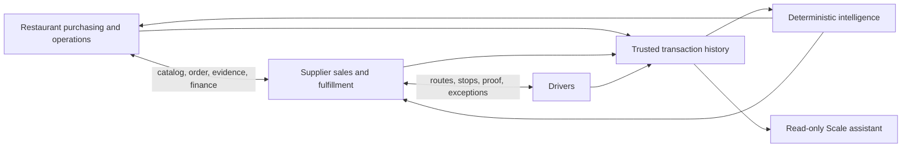
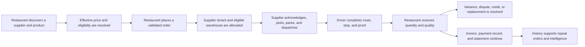

# Supplify

## Investor Product & Business Guide

**A connected operating system for restaurant procurement and supplier fulfillment**

Audited against the current Supplify ERP, Android, and iOS repositories  
Version 1.0 · 26 September 2026

> This document distinguishes implemented product capability, configuration-dependent services, partial workflows, and future opportunity. It is a product and business overview, not audited financial advice, a market-size study, or a promise of future performance.

## Document control

| Item                      | Value                                                                                                 |
| ------------------------- | ----------------------------------------------------------------------------------------------------- |
| Audience                  | Investors, strategic partners, executives, and diligence teams                                        |
| Evidence                  | Current application code, migrations, tests, plans, navigation, services, and operating documentation |
| Product status vocabulary | Active; Active/configuration-dependent; Partial; Web-first; Retired; Future opportunity               |
| Pricing basis             | Current seeded subscription matrix; excludes tax, negotiated enterprise terms, and provider fees      |
| Not included              | Independently validated TAM, traction, revenue, customer count, or unit-economics claims              |

## Contents

1. Executive summary
2. The industry problem
3. Product thesis and value
4. Users and jobs to be done
5. Product experience
6. What is implemented today
7. Business model and plan architecture
8. Platform economics and growth loops
9. Technology, data, and defensibility
10. Trust, control, and operating maturity
11. Readiness, constraints, and diligence questions
12. Product-led roadmap opportunities
13. Investment perspective
14. Audited capability appendix

# 1. Executive summary

Supplify is a multi-tenant B2B marketplace and operational ERP connecting restaurants, supplier organizations, warehouses, and delivery drivers in one transaction network. It begins where restaurants feel daily friction—finding products, comparing effective prices, ordering, receiving, controlling inventory, and reconciling invoices—and extends into the supplier's execution layer: catalog, customer pricing, warehouse inventory, picking, routes, drivers, proof, receivables, promotion, and demand intelligence.

The codebase demonstrates a broad implemented product rather than a presentation-only concept. Its strongest asset is not an isolated marketplace screen; it is the linked commercial and operational record from product discovery through order, warehouse assignment, delivery, receiving variance, dispute, invoice, credit, and payment evidence. Web, Android, and iOS clients expose substantial role-specific workflows. Identity, tenant isolation, permissions, entitlements, audit, secure files, notification channels, and deployment infrastructure surround that core.

Supplify's product strategy has three layers:

1. **System of workflow:** daily purchasing and supplier fulfillment create recurring use.
2. **System of record:** immutable order snapshots, inventory movements, receiving, invoice and delivery evidence create trusted history.
3. **System of intelligence:** deterministic analysis and a tightly permissioned, read-only Scale assistant turn network data into reviewable decisions.

The current commercial model is subscription-led: Restaurant Growth/Intelligence/Scale at $49/$149/$349 per month and Supplier Growth/Scale at $149/$349 per month, with two months effectively discounted on annual pricing. Usage limits, add-ons/overrides, premium placement and provider-backed charges create expansion surfaces. Transaction take-rate revenue is a strategic opportunity, not an established repository fact.

The principal investment case is a vertical operating network with two-sided retention: a restaurant benefits when more of its suppliers transact through the same workflow; a supplier benefits as more customers, catalog activity, orders, routes, and receivables consolidate. The main execution risks are commercialization and operations rather than absence of product breadth: external-provider configuration, finance reconciliation, mobile release validation, marketplace liquidity, support burden, documentation discipline, and careful control of scope.

# 2. The industry problem

## Restaurants operate through fragmented truth

Restaurant procurement commonly spans calls, messaging threads, spreadsheets, supplier portals, paper delivery notes, and accounting follow-up. The operational consequences compound:

- buyers cannot easily compare the price they are actually entitled to pay;
- orders and amendments lose provenance;
- delivery location, cutoff, pack size, and minimum-order constraints create mistakes;
- receiving variance is discovered separately from the original order;
- inventory and recipe cost lag behind purchasing reality;
- invoice disputes depend on scattered photos and messages;
- multi-location operators lack a comparable view across branches.

## Suppliers absorb the cost of fragmented demand

Suppliers face a mirror image: manually interpreted orders, customer-specific price complexity, stock uncertainty, pick/pack handoffs, dispatch coordination, driver status calls, incomplete proof, late receivables, and limited insight into demand. General-purpose commerce software often stops at checkout; warehouse or accounting systems may not carry the restaurant-side receiving and commercial context.

## The information gap is the opportunity

Both sides need a shared, permissioned transaction history without surrendering their tenant boundaries. Supplify is designed to connect that history while preserving who owns the catalog, who placed the order, which operating entity and warehouse accepted it, what was delivered, what was received, and how the invoice was resolved.

# 3. Product thesis and value

## The product thesis

The winning restaurant-supply network is not simply a product directory. It must reduce the labor and uncertainty of every repeat transaction. Once the same data supports purchasing, warehouse execution, proof, receiving, finance, and decision support, the platform becomes progressively more valuable and harder to replace.

## Value to restaurants

Supplify can reduce ordering friction, surface effective price and availability, preserve accountability, accelerate receiving and disputes, improve stock/waste visibility, connect purchase cost to recipes, and bring invoices/statements into the same context. Multi-branch Scale views add organizational comparison without creating a retired central-approval product.

## Value to suppliers

Supplify can consolidate demand, customer-specific pricing, warehouse work, dispatch, proof, exception handling, promotions, quotes, receivables, and demand signals. It gives commercial and operations teams a common order truth while keeping drivers in a restricted execution workspace.

## Value to the network

Each completed transaction enriches a reusable operational graph: products, effective prices, demand, fulfillment outcomes, receiving variance, delivery reliability, and invoice behavior. The platform can improve decision support without selling an autonomous black box. This trust posture matters in businesses where an incorrect order or price has immediate physical and financial consequences.

# 4. Users and jobs to be done

| User                          | Primary job                                           | Supplify outcome                                                   |
| ----------------------------- | ----------------------------------------------------- | ------------------------------------------------------------------ |
| Restaurant owner              | control purchasing, cost, cash exposure, and branches | common operational and financial view                              |
| Restaurant manager            | keep daily supply and service operations moving       | dashboard, orders, inventory, reservations, staff                  |
| Purchaser                     | source, compare, order, schedule, and resolve issues  | catalog, effective price, cart, quick lists, quotes, disputes      |
| Receiving staff               | verify what physically arrived                        | line-level quantity/quality receipt and evidence                   |
| Restaurant accountant         | understand payables, credits, and statements          | invoice, payment record, aging and exports                         |
| Supplier owner/manager        | grow accounts while controlling operations            | customers, pricing, orders, fulfillment, receivables, intelligence |
| Warehouse manager             | allocate stock and execute accurately                 | assignment, pick lists, packing, transfer and exceptions           |
| Sales/catalog/promotions team | maintain offer and generate demand                    | products, contract pricing, quotes, deals, placement, loyalty      |
| Supplier accountant           | collect and reconcile                                 | invoice, statement, aging, credit and recorded payment             |
| Dispatcher                    | plan work and handle exceptions                       | command center, routes, run sheet, active map                      |
| Driver                        | execute today's assigned stops safely                 | restricted mobile stops, GPS, proof, problem reporting             |
| Platform administrator        | operate a safe multi-tenant service                   | tenant/subscription/admin/audit and incident controls              |

Role design is a commercial advantage as well as a security feature: the product can enter through a narrow job and expand across a company without giving every user owner-level access.

# 5. Product experience

## Restaurant journey

1. Register, activate, select the correct restaurant workspace, and invite a role-based team.
2. Discover/follow suppliers and browse an eligible catalog with effective pricing.
3. Build a cart, select the delivery location, and place an idempotent order.
4. Track acknowledgment, processing, shipment, route, and delivery evidence.
5. Receive by quantity and quality; create a dispute when reality differs.
6. Update inventory/lots/waste and review invoice, credit, payment, and statement context.
7. Reuse quick lists, scheduled-order review, price history, recipe cost, reports, and advisory reorder/intelligence.

## Supplier journey

1. Configure the supplier organization, operating tenant(s), warehouses, zones, team, and catalog.
2. Manage base and customer-specific pricing, relationships, quotes, deals, and loyalty.
3. Accept an incoming organization order into an eligible supplier tenant and warehouse.
4. Reserve stock, pick, pack, dispatch, build routes, assign drivers, and manage exceptions.
5. Capture delivery milestones/proof and respond to receiving variances/disputes.
6. Issue invoices, record payments/credits, monitor aging, and export financial data.
7. Use demand, stockout, warehouse, customer, and weekly intelligence to improve operations.

## Driver journey

The driver sees assigned work, not the ERP. Today/run-sheet views lead into stop detail, navigation handoff, location sessions, pickup/out-for-delivery state, proof, and problem/reschedule handling. This focused design reduces training and limits access risk.

## Platform journey

Administrators manage tenants, users, subscriptions/entitlements, feature controls, audits, and operating exceptions through a web-first control plane. Impersonation and sensitive actions are protected and recorded.

# 6. What is implemented today

## Active transactional core

- multi-tenant Keycloak identity, workspace membership, role/permission enforcement, invitations, and audit;
- restaurant and supplier organizations, branches/locations, warehouses, customer relationships;
- supplier catalog, search, favorites/follows, effective pricing, contract pricing, RFQs, promotions, and loyalty;
- cart, server-side checkout, supplier-organization routing, one-warehouse allocation, immutable snapshots, stock reservation, idempotency, amendments, cancellations, and reorder;
- pick/pack/dispatch, transfers, routes/stops, drivers, GPS, proof, exceptions, and live/polling visibility;
- restaurant receiving, variance, lots/movements, waste, disputes, credits, and replacements;
- invoices, recorded payments, statements, aging, reminders, PDF and accounting CSV;
- chat, secure attachments, notification preferences, in-app/email/WhatsApp/push/webhook infrastructure;
- recipes/costing, reservations/waitlist/tables, staff/labour, reports, consumer ordering and loyalty;
- web plus substantial Android/iOS operational coverage.

## Active intelligence

Deterministic price, purchasing, food-cost, waste, reliability, anomaly, reorder, demand, stockout, cross-sell, warehouse, and weekly views are implemented at tier-appropriate levels. Results are read-only and auditable back to source data.

The conversational assistant is active for eligible Restaurant Scale and Supplier Scale administrators when OpenAI is configured. It uses allow-listed read-only tools, per-user quota, an eight-tool loop cap, tenant/permission/feature checks, and cannot mutate orders, inventory, prices, deals, transfers, or communication. Drivers are excluded.

## Active but externally configured

Email, WhatsApp, push, web push, S3-compatible storage, malware scanning, Redis distribution, Stripe/platform charges, OpenAI, custom domains, and mapping/navigation require environment secrets, provider approval, or release setup. Code presence is not conflated with a live provider in every deployment.

## Partial, web-first, or bounded

- full administration, imports/organization controls, and richest command/intelligence screens are web-first;
- the finance ledger is implemented, but universal supplier settlement is not established;
- accounting is export-oriented, not confirmed live bidirectional synchronization;
- routing/ETA is operational, not advanced traffic-aware fleet optimization;
- reports are packaged analytics, not an arbitrary report builder;
- consumer ordering and staff/labour are narrower than the B2B core;
- background GPS, native push, deep links, and store builds require physical-device release testing.

## Explicitly retired or not claimed

Central Purchasing and purchasing budgets/approvals are retired; legacy endpoints return `410 Gone`. Supplify does not claim autonomous purchasing, live FX, driver AI access, arbitrary PDF intelligence, guaranteed supplier COGS-margin analysis, or automatic business changes from AI recommendations.

# 7. Business model and plan architecture

## Subscription plans

| Customer   | Plan         | Monthly | Annual | Product rationale                                                         |
| ---------- | ------------ | ------: | -----: | ------------------------------------------------------------------------- |
| Restaurant | Growth       |     $49 |   $490 | accessible core ERP plus basic intelligence/suggestions                   |
| Restaurant | Intelligence |    $149 | $1,490 | advanced deterministic decision support for one location                  |
| Restaurant | Scale        |    $349 | $3,490 | multi-branch operating limits, Scale intelligence and read-only assistant |
| Supplier   | Growth       |    $149 | $1,490 | core catalog, order, fulfillment, growth and finance operations           |
| Supplier   | Scale        |    $349 | $3,490 | multi-warehouse/advanced intelligence and read-only assistant             |

Annual prices represent approximately ten months at the monthly rate. Free trial/sandbox plans mirror Growth feature shape with lower meters and no assistant/AI platform. A legacy restaurant custom row remains inactive rather than being marketed as a current tier.

## Why the packaging is coherent

Growth monetizes the daily system of workflow. Restaurant Intelligence creates a mid-tier for operators who need better decisions but not multi-branch/assistant capability. Scale monetizes organizational complexity, high usage, and the assistant. Supplier tiers reflect the higher operational value and breadth of fulfillment tooling. Entitlements and meters are enforced server-side, allowing pricing experiments without relying on hidden UI alone.

## Revenue surfaces evidenced by the product

- recurring monthly/annual subscriptions;
- plan expansion as locations, warehouses, activity, storage, reports, and intelligence needs grow;
- add-ons/tenant overrides supported by the entitlement architecture;
- paid boosts/featured placement and promotion-related platform charges where provider configuration is live;
- negotiated enterprise services/custom configuration as a commercial possibility, although not a public active plan in the audited matrix.

Transaction commissions, financing, logistics brokerage, payments spread, data products, and supplier-funded marketplace programs may be future business opportunities. They should not be included in current revenue claims without contracts, compliance, and measured economics.

# 8. Platform economics and growth loops

## Retention loop

Frequent orders create fulfillment and receiving history; history improves reordering and analysis; better workflow encourages more suppliers and staff to use the platform; more in-platform activity improves the shared record and switching cost. The retention mechanism is operational habit plus trusted data, not merely social engagement.

## Supply and demand loop

Restaurant discovery and RFQs can expose demand to suppliers. Suppliers add richer catalog/pricing and improve fulfillment to win/retain accounts. Better availability, response, and reliability give restaurants more reason to consolidate transactions. Promotions, loyalty, referrals, sponsorship/placement, and supplier growth tools can accelerate the loop once liquidity is sufficient.

## Expansion loop

A single-location restaurant can grow from transaction workflow to intelligence and then multi-branch Scale. A supplier can expand from core order fulfillment into warehouses, drivers, customer-specific pricing, finance, promotions, and Scale intelligence. Role-specific seats do not currently imply per-seat pricing in the audited matrix, but they increase organizational embedding.

## Cost drivers

Primary variable/operating costs include cloud compute/database/storage, notification delivery, maps, malware scanning, push infrastructure, AI requests, support/onboarding, payment-provider fees, and reconciliation. AI has a hard per-user daily meter in the audited Scale plan. Read-only tooling and deterministic computation help keep expensive model usage focused.

Unit economics, CAC, retention, gross margin, marketplace GMV, and provider costs require live business data; none should be inferred from repository breadth.

# 9. Technology, data, and defensibility

## Architecture built for a vertical operating network

The platform combines React/Vite web, React Native/Expo mobile, Node/Express services, PostgreSQL, Keycloak, Redis acceleration, Socket.IO realtime, private object storage, malware scanning, and provider adapters. Its domain schema spans commercial, fulfillment, receiving, finance, engagement, restaurant operations, and subscription control.

## Defensibility thesis

Defensibility can emerge from four compounding assets:

1. **Workflow depth.** Replacing an order screen is easy; replacing connected pricing, warehouse execution, proof, receiving, dispute, and finance is harder.
2. **Relationship graph.** Organization/tenant/customer/product/price/warehouse/driver relationships encode how local food supply actually operates.
3. **Transaction provenance.** Immutable snapshots and event histories make analysis explainable and disputes resolvable.
4. **Role and entitlement infrastructure.** A centralized permissions/plan model lets the product expand safely inside customers and package differentiated value.

The code alone is not a moat. The durable moat depends on adoption density, clean data, operational reliability, customer trust, integration quality, and accumulated transaction history.

## Responsible AI posture

Supplify uses deterministic logic when the answer should come from facts and rules, and an LLM only as a controlled explanatory/query layer. Assistant tools are allow-listed, read-only, tenant-scoped, permission-checked, and metered. This reduces automation risk and makes the feature commercially useful before autonomous procurement is appropriate.

# 10. Trust, control, and operating maturity

Trust architecture includes Keycloak identity, tenant isolation, system/custom roles, server-side entitlement enforcement, row locks and idempotency, exact-origin CSRF/CORS protections, structured redaction, audit/system events, private malware-scanned uploads, SSRF protection, verified webhooks, and production safeguards against stub payments or unsafe storage patterns.

The platform preserves distinctions that matter in diligence:

- a delivered order is not automatically accepted by receiving;
- a recorded payment is not automatically provider-confirmed settlement;
- a forecast is not an order;
- an AI answer is not a business mutation;
- a realtime event is not the durable source of truth;
- a legacy table is not an active product.

This conservative state model reduces hidden financial and operational ambiguity. Production maturity still requires disciplined secrets, backups/restores, monitoring, incident ownership, provider reconciliation, privacy operations, and real-device validation.

# 11. Readiness, constraints, and diligence questions

## Product readiness

The B2B order-to-receive core, supplier fulfillment, role model, finance ledger, notifications, and cross-platform clients are implemented. The breadth supports controlled pilots and production deployments when the chosen integrations are configured and release gates are met.

## Key execution risks

| Risk                     | Why it matters                                                           | Mitigation visible in product / required next                                             |
| ------------------------ | ------------------------------------------------------------------------ | ----------------------------------------------------------------------------------------- |
| Marketplace liquidity    | two-sided value depends on local supply and demand density               | lead with ERP value; focus geography/category; onboard existing relationships             |
| Breadth and support      | many modules can dilute quality and increase onboarding burden           | role-based activation, analytics on use, disciplined tier/roadmap scope                   |
| Provider operations      | email/push/WhatsApp/payments/AI may work differently by environment      | readiness checks, provider reconciliation, tested fallbacks, explicit status              |
| Financial expectations   | ledger can be mistaken for money movement                                | clear UI/contracts, gateway state, reconciliation, regulated partner strategy if expanded |
| Mobile field reliability | GPS/push/background behavior varies by OS/device                         | physical-device test matrix, staged rollout, telemetry, polling fallback                  |
| Data quality             | intelligence is only as strong as products, stock, receiving and pricing | validation, provenance, exception workflows, explainable deterministic logic              |
| Multi-replica jobs       | in-process schedulers require coordination                               | locks/idempotency, ownership/runbooks, monitoring; consider dedicated worker at scale     |
| Security/privacy         | multi-tenant commercial and location data is sensitive                   | layered controls plus independent testing, retention and incident operations              |
| Historical documentation | old tier/feature claims can create sales/support errors                  | authoritative matrices, generated collateral, docs governance                             |

## Diligence questions management should answer with operating data

- How many active restaurant and supplier workspaces transact weekly, and in which markets/categories?
- What proportion of orders complete fully in-platform through receiving and invoice?
- What are logo and revenue retention by side/tier/cohort?
- Which workflows create activation and which modules are rarely used?
- What are gross margin and support/onboarding cost by tier?
- How much provider and AI cost is generated per active account?
- What is the rate of fulfillment exceptions, receiving disputes, late invoices, and resolved credits?
- Which launch integrations are configured in each environment, and when were restore/provider/device drills last passed?

# 12. Product-led roadmap opportunities

These are reasoned opportunities from the implemented foundation, not commitments:

## Near-term commercialization

- focus onboarding around one complete order-to-receive path;
- instrument activation, first order, repeat order, supplier response, delivery proof, receiving completion, and invoice closure;
- build explicit provider/readiness dashboards and reconciliation runbooks;
- validate plan willingness-to-pay and limits with cohorts;
- complete physical-device, push, background-location, deep-link, and store-release matrices;
- consolidate current product truth so sales, support, web, native, and entitlements remain aligned.

## Product depth

- deepen exception-first supplier command views and restaurant receiving resolution;
- add carefully selected accounting/ERP integrations through explicit supported contracts;
- improve routing only when reliable address/traffic/provider inputs justify stronger claims;
- expand packaged intelligence where data quality and customer decisions can be measured;
- add document extraction only with privacy, validation, provenance, and human review;
- move scheduled workload to a dedicated worker topology when scale/availability evidence warrants it.

## Network and financial products

Supplier-funded demand generation, payments/settlement, credit, logistics coordination, benchmarking, and procurement network services may be high-value adjacencies. Each expands regulatory, liquidity, risk, support, and data-governance obligations. The recommended sequence is to prove transaction density and trusted operational records before adding capital-intensive or regulated layers.

# 13. Investment perspective

## Why the opportunity is credible

- Restaurants and suppliers both have frequent, costly operational workflows.
- The product covers both sides plus the physical delivery role.
- The system captures structured truth after checkout, where many marketplaces stop.
- Subscription packaging aligns with operational complexity and decision value.
- Cross-platform workflow supports field use, not only office administration.
- Deterministic intelligence and controlled AI reuse the data asset without requiring risky autonomy.

## What must be proven commercially

- a repeatable beachhead market and acquisition channel;
- supplier/restaurant activation with limited services burden;
- retention driven by complete workflows rather than feature breadth;
- pricing power and expansion from Growth to Intelligence/Scale;
- reliable field/provider operations at acceptable gross margin;
- measurable customer outcomes such as fewer errors, faster receiving, lower waste, improved fill rate, or faster collection.

## Balanced conclusion

Supplify has the technical and product foundation of a vertical operating network: broad workflows, durable state, strong tenant/role controls, fulfillment depth, mobile execution, finance context, and a credible intelligence layer. Its next value inflection will come less from adding isolated features and more from proving density, activation, repeat use, provider reliability, and economic outcomes in a focused market. That is an execution challenge, but it is supported by substantially more implemented infrastructure than an early marketplace prototype.

# 14. Audited capability appendix

| Capability                           | Customer value                            | Current status         | Commercial caveat                                            |
| ------------------------------------ | ----------------------------------------- | ---------------------- | ------------------------------------------------------------ |
| Multi-tenant identity/RBAC           | safe team adoption                        | Active                 | ongoing security/ops required                                |
| Catalog and discovery                | consolidates sourcing                     | Active                 | value rises with local supply density                        |
| Contract/effective pricing           | reduces pricing ambiguity                 | Active                 | no live FX                                                   |
| Checkout/idempotency/routing         | reliable order capture                    | Active                 | one eligible warehouse per group; no silent split            |
| Warehouse fulfillment                | reduces execution gaps                    | Active                 | advanced optimization not claimed                            |
| Driver/GPS/POD                       | field visibility and evidence             | Active                 | physical-device/release validation required                  |
| Receiving/inventory/waste            | closes physical-truth gap                 | Active                 | depends on disciplined user capture                          |
| Invoice/credit/payment ledger        | shared financial context                  | Active                 | universal PSP settlement not established                     |
| Quotes/promotions/loyalty            | acquisition and retention                 | Active                 | paid placement/provider charges configuration-dependent      |
| Chat/notifications                   | coordinated response                      | Active                 | external channels require credentials/approval               |
| Recipes/reservations/staff/consumer  | broader restaurant operating value        | Active/bounded         | not equivalent to best-of-breed depth in every category      |
| Reports/deterministic intelligence   | better operational decisions              | Active                 | packaged, partly web-first                                   |
| Smart reorder                        | faster reviewable purchasing              | Active/advisory        | never autonomous checkout                                    |
| Scale assistant                      | conversational access to authorized facts | Active when configured | Scale admins only; read-only; metered                        |
| Android/iOS                          | in-field operational access               | Substantial parity     | admin/advanced views web-first; release credentials required |
| Central Purchasing/budgets/approvals | —                                         | Retired                | endpoints return 410; do not sell                            |

# 15. Complete business capability map

## Restaurant capabilities

| Capability                               | What it does                                                                                      | Business value                                                                            | Place in the workflow                     |
| ---------------------------------------- | ------------------------------------------------------------------------------------------------- | ----------------------------------------------------------------------------------------- | ----------------------------------------- |
| Dashboard                                | Brings permitted orders, spend, stock, deliveries, reservations, usage, and actions into one view | Helps managers identify today's work quickly                                              | daily operating entry point               |
| Supplier discovery and profiles          | Searches suppliers, product coverage, reputation, and public storefront information               | Replaces fragmented contact lists and supports informed sourcing                          | before purchase and relationship building |
| Follow, block, connect, review, and chat | Maintains usable supplier relationships and communication history                                 | Creates continuity while letting restaurants control unwanted relationships               | sourcing, issue resolution, retention     |
| Catalog and product search               | Filters products by supplier/category/text and commercial context                                 | Makes repeat sourcing faster and more transparent                                         | product selection                         |
| Favorites and My Prices                  | Preserves frequently used products and negotiated/effective price context                         | Reduces repetitive search and price ambiguity                                             | selection and repeat purchase             |
| Price comparison                         | Compares conservatively matched products across followed suppliers                                | Supports an evidence-based buying decision without pretending unlike packs are equivalent | selection and intelligence                |
| Cart and checkout                        | Validates quantities, pack rules, delivery location, effective price, and eligibility             | Converts a mixed shopping task into durable supplier-group orders                         | transaction creation                      |
| Orders, calendar, tracking, and reorder  | Preserves order history, status, amendments, delivery context, and repeat actions                 | Creates accountability and repeatability after checkout                                   | order management                          |
| Quick lists and schedules                | Saves repeat baskets and supports reviewed recurring ordering                                     | Reduces effort for regular replenishment                                                  | repeat purchase                           |
| Quote requests                           | Requests line-level offers and locks a selected response to an order                              | Structures competitive sourcing and preserves commercial provenance                       | sourcing and order pricing                |
| Receiving and quality                    | Records actual quantity, quality, lot/expiry, evidence, and variance                              | Connects physical reality to stock, dispute, and invoice outcomes                         | post-delivery reconciliation              |
| Inventory, lots, expiry, and waste       | Maintains movements, on-hand/par/reorder data, expiry and waste records                           | Supports availability, traceability, and loss awareness                                   | operations and replenishment              |
| Disputes and credits                     | Turns shortages/damage/wrong items into a tracked resolution                                      | Reduces dependence on informal messages and preserves remedy history                      | exception and financial resolution        |
| Invoices, payments, and statements       | Presents payable, balance, credit, aging, and recorded-payment context                            | Gives the restaurant one commercial history linked to the order                           | financial follow-through                  |
| Recipes and costing                      | Maps ingredients to recipes and current cost/profitability signals                                | Connects procurement changes to menu economics                                            | cost control and analysis                 |
| Reservations and guests                  | Manages tables, availability, bookings, waitlist, offers, and guest communication                 | Broadens restaurant operating value beyond purchasing                                     | front-of-house operations                 |
| Staff and labour                         | Manages staff records, schedules, time, leave, swaps, documents, incidents, and export            | Consolidates daily workforce coordination                                                 | restaurant operations                     |
| Consumer menu, ordering, and loyalty     | Supports the restaurant's direct guest menu/order/member context                                  | Connects selected consumer operations without exposing the ERP                            | guest commerce                            |
| Reports and deterministic intelligence   | Packages spend, price, waste, reliability, anomaly, recipe, and branch signals                    | Helps managers act on history without an opaque autonomous system                         | analysis and planning                     |
| Smart reorder                            | Produces a reviewable suggestion/forecast with commercial constraints                             | Speeds replenishment decisions while keeping a human in control                           | planning to cart                          |
| Scale assistant                          | Answers authorized questions through read-only tools                                              | Makes complex operational data easier for eligible administrators to explore              | analysis only                             |

## Supplier capabilities

| Capability                                     | What it does                                                                                                 | Business value                                                           | Place in the workflow           |
| ---------------------------------------------- | ------------------------------------------------------------------------------------------------------------ | ------------------------------------------------------------------------ | ------------------------------- |
| Dashboard, command center, and run sheet       | Consolidates demand, fulfillment, routes, exceptions, inventory, and receivables                             | Focuses teams on work that can delay an order or collection              | daily operating entry point     |
| Organization and tenant structure              | Groups sellable supplier accounts while retaining tenant ownership                                           | Supports expansion without blurring legal/operational boundaries         | account architecture            |
| Catalog and products                           | Maintains product, pack, category, image, availability, and operating data                                   | Creates a reusable digital offer for multiple customers                  | demand generation and ordering  |
| Base and contract pricing                      | Applies general and restaurant-specific commercial terms                                                     | Preserves customer relationships and reduces manual price interpretation | before and during order         |
| Customer relationships and growth              | Manages connections, account activity, referrals, sponsorship, and placement surfaces                        | Helps acquire and retain restaurant demand                               | commercial growth               |
| Incoming order control                         | Reviews, acknowledges, processes, cancels, amends, and traces orders                                         | Replaces scattered order intake with an accountable queue                | order intake                    |
| Warehouse inventory and routing rules          | Tracks stock and determines eligible fulfillment location                                                    | Prevents allocation to an invalid branch or warehouse                    | validation and allocation       |
| Pick, pack, dispatch, and transfer             | Converts an accepted order into controlled warehouse work                                                    | Reduces handoff ambiguity and records exceptions                         | physical fulfillment            |
| Routes, stops, and drivers                     | Builds delivery work and assigns accountable drivers                                                         | Coordinates last-mile execution from the same order record               | dispatch and delivery           |
| GPS, proof, and exceptions                     | Adds location freshness, milestones, evidence, failure, retry, and reschedule context                        | Reduces status calls and strengthens delivery accountability             | delivery execution              |
| Quotes                                         | Receives requests and returns price, availability, note, and expiry                                          | Creates a structured sales channel linked to an eventual order           | pre-order sales                 |
| Promotions, placement, and loyalty             | Creates targeted offers and retention incentives with review and usage tracking                              | Supports measurable demand generation                                    | acquisition and repeat purchase |
| Invoices, receivables, statements, and credits | Manages amounts due, recorded payments, aging, reminders, and remedies                                       | Connects operations to collection                                        | financial follow-through        |
| Reports and Scale intelligence                 | Analyzes product/customer/fulfillment/finance plus demand, stockout, cross-sell, deal, and warehouse signals | Supports decisions about stock, service, and growth                      | planning and management         |
| Scale assistant                                | Provides a read-only conversational view for eligible administrators                                         | Lowers the effort of querying operational information                    | analysis only                   |
| Team, roles, settings, and audit               | Separates owner, warehouse, fulfillment, driver, catalog, promotion, and finance responsibilities            | Enables adoption across departments without universal access             | governance                      |

## Driver capabilities

| Capability                              | What it does                                                     | Business value                                                     | Place in the workflow            |
| --------------------------------------- | ---------------------------------------------------------------- | ------------------------------------------------------------------ | -------------------------------- |
| Restricted access                       | Shows only work tied to an active linked driver profile          | Protects supplier and customer information                         | sign-in and every request        |
| Today view and run sheet                | Organizes assigned routes/stops                                  | Gives the driver a clear work queue                                | start of shift and between stops |
| Stop detail and navigation handoff      | Shows destination, instructions, contact context, and navigation | Reduces dispatch calls and address mistakes                        | travel to stop                   |
| Pickup and delivery milestones          | Records progress through controlled states                       | Gives the supplier and restaurant a shared operational timeline    | physical execution               |
| GPS and heartbeat                       | Sends session-bound foreground location/freshness                | Supports practical visibility without replacing durable state      | active delivery                  |
| Proof of delivery                       | Associates required evidence with the exact assignment/leg       | Strengthens accountability and later dispute evidence              | at delivery                      |
| Problem, failure, retry, and reschedule | Records why work could not complete and what happens next        | Prevents operational exceptions from disappearing into phone calls | exception handling               |
| Notifications                           | Surfaces assigned operational milestones in-app                  | Keeps attention on relevant work without noisy commercial messages | throughout execution             |

## One transaction, end to end

The commercial promise is captured at placement; the physical promise is executed in fulfillment and delivery; the acceptance truth is captured by receiving; and the financial truth continues through invoice, credit, payment, and statement. Keeping these truths linked but separate is central to the product's accountability.

## Multi-branch and multi-warehouse scale

Restaurant organizations can group operating accounts and locations so larger customers gain comparable reporting and controlled access while orders retain an explicit delivery location. Supplier organizations can group sellable supplier tenants, each of which owns products, customers, staff, and warehouses. New-order routing can choose an eligible child supplier tenant and one warehouse for the complete supplier basket; it does not silently split one basket. A later transfer remains inside the same supplier tenant.

Commercially, this supports growth from one operating site to a network without turning the product into a centralized approval/budget system that no longer exists. Scale value comes from visibility, consistent controls, and multi-location intelligence—not from a claim that every local decision is centralized.

## Product footprint

| Surface           | Designed for                                                                                                     | Relative breadth                                                               |
| ----------------- | ---------------------------------------------------------------------------------------------------------------- | ------------------------------------------------------------------------------ |
| ERP/web           | owners, managers, purchasing, finance, warehouse, dispatch, support, and platform administration                 | broadest management, configuration, reporting, intelligence, and admin surface |
| Restaurant mobile | purchasing, tracking, receiving, inventory/waste, finance review, restaurant operations, chat, and notifications | substantial day-to-day operational coverage                                    |
| Supplier mobile   | orders, fulfillment, run sheet/map, products/prices, customers, promotions, receivables, intelligence, and chat  | substantial operational and commercial coverage                                |
| Driver mobile     | today's assignments, stop execution, GPS, proof, and exception reporting                                         | intentionally narrow and role-restricted                                       |

## Product truth note

Current enforced product behavior takes precedence over outdated material. The audit did not count a capability merely because an internal component exists or a screen is visible; it required evidence that the workflow and its access controls are genuinely connected. The companion _Supplify Complete Product & Technical Guide_ contains the deeper workflow, architecture, RBAC, security, data, lifecycle, and evidence audit.

---

**End of confidential discussion document.**
