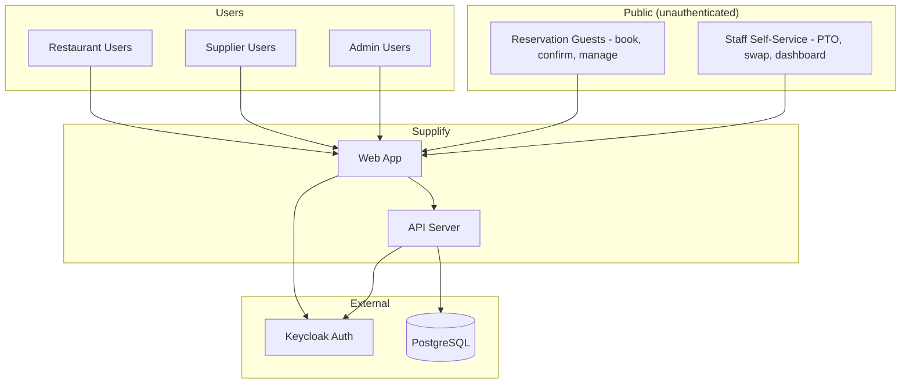

# 03 — Platform Overview

## Who Uses Supplify and How They Connect

Supplify serves three user types: **restaurant users**, **supplier users**, and **admins**. Guests can book reservations and staff can use self-service (e.g. PTO, swaps) via dedicated links. Everyone interacts with the same secure platform.

## What the platform covers

- **Orders** — Cart, checkout, place order, track status. Daily order limits and features depend on plan.
- **Catalog & products** — Suppliers manage products and prices; restaurants see catalogs and their own pricing.
- **Inventory** — Suppliers manage stock and warehouses; restaurants manage par levels and multi-branch inventory (on higher plans).
- **Fulfillment & receiving** — Suppliers fulfill orders; restaurants record what arrived and quality.
- **Invoices & payments** — Invoices tied to orders; restaurants pay and see analytics; suppliers track revenue and overdue.
- **Reservations** — Restaurant reservation board and public booking portal.
- **Chat** — Conversations between restaurants and suppliers, with daily message limits by plan.
- **Subscriptions** — Each tenant has a plan (Free, Silver, Gold, Platinum) with limits and features; admins can change plans and override limits.

This overview shows why one platform reduces friction: ordering, receiving, finance, and communication are connected, so both restaurants and suppliers get a single source of truth.
