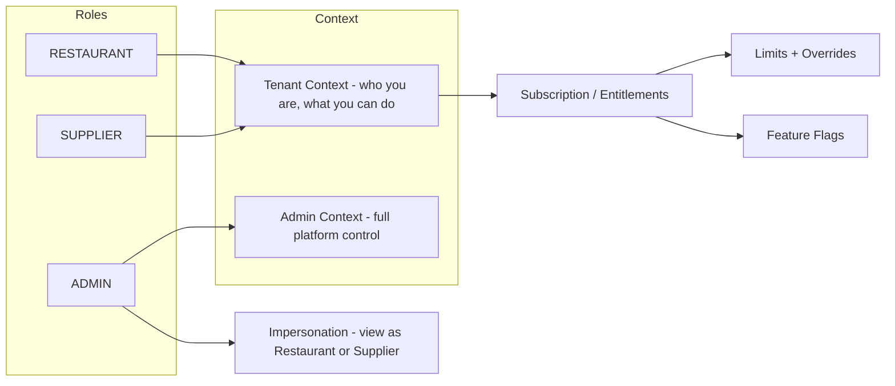

# 04 — Roles and Security

## Who Can Do What

Supplify separates **restaurant**, **supplier**, and **admin** roles. Each role gets the right level of access so data stays safe and actions are auditable.

### Roles at a glance

- **Restaurant** — Order from suppliers, manage inventory (and branches on higher plans), receive goods, view and pay invoices, use chat, manage reservations. All within their tenant and plan limits.
- **Supplier** — Manage catalog and warehouses, fulfill orders, send invoices, track payments, use chat. Scoped to their tenant and plan.
- **Admin** — Manage tenants, plans, subscriptions, limit overrides, finance and health dashboards, and audit logs. Can impersonate a restaurant or supplier for support.

### How access is enforced

Access is determined by **role** and **subscription** (plan limits and features). For example:

- A restaurant can only see and order from suppliers they’re connected to.
- A supplier only sees orders and chat for their own tenant.
- Features like reports, smart reorder, and multi-branch are turned on or off by plan; limits (e.g. orders per day, branches, products) are enforced so upgrades are clear when needed.

### Why this matters to buyers

- **Restaurants** — Your team only sees your data; your plan defines how many orders, branches, and features you get.
- **Suppliers** — Your catalog, orders, and payments are isolated; you control warehouses and fulfillment within your plan.
- **Enterprise / multi-tenant** — Admins can manage many tenants, override limits when needed, and use impersonation for support—all with an audit trail.

Security and roles are built in so that growth (more users, locations, or suppliers) doesn’t mean losing control or visibility.
