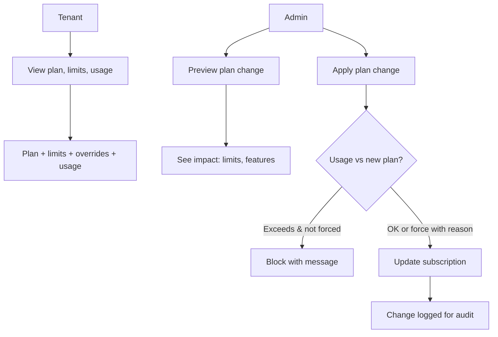

# 05 — Subscriptions and Controls

## Plans That Match How You Use the Platform

Every restaurant and supplier has a **subscription** with a **plan**. Plans define limits (e.g. branches, active customer locations, users, AI assists) and which features are on (e.g. order calendar, smart reorder, multi-warehouse). This keeps the product clear and upgrade paths obvious.

**Canonical commercial source:** [four-plan-pricing-model.md](../product/four-plan-pricing-model.md) and [plans-and-limits.md](../product/plans-and-limits.md). Historical catalogs in `subscriptions.md` / `tier-matrix.md` are not current pricing guidance.

### Public plans (conceptual)

| Tenant type | Public plan       | Internal code | Monthly | Primary scale metric                           |
| ----------- | ----------------- | ------------- | ------: | ---------------------------------------------- |
| Restaurant  | Restaurant Growth | `silver`      |     $49 | 1 active branch                                |
| Restaurant  | Restaurant Scale  | `gold`        |    $149 | 3 active branches                              |
| Supplier    | Supplier Growth   | `gold`        |    $149 | 50 active ordering customer locations / month  |
| Supplier    | Supplier Scale    | `platinum`    |    $349 | 200 active ordering customer locations / month |

- **30-day Free Trial** (DB code `free`) — Time-limited evaluation (default **30 days**, admin **7–90**). Features/limits follow the selected **trial target** plan (default: Restaurant Growth or Supplier Growth). After expiry, **read-only** until upgrade or admin extension.
- **Growth** — Entry paid plan for serious daily ops at one primary location (restaurants) or a growing customer book (suppliers).
- **Scale** — Multi-location / high-volume ops: more branches or active customer locations, advanced roles/reporting/audit where implemented, higher AI and storage allowances.

Restaurant and supplier catalogs are **separate** (same public names, different codes and limit sets). Self-serve APIs never mix them.

### How subscription changes work

Tenants see their current plan, usage, and limits in the app. When they hit a limit or try to use a gated feature, they get a clear message and a recommendation to upgrade. Admins can:

- Change a tenant’s plan (effective immediately or at period end).
- Preview the impact (e.g. “usage will exceed new limits”) before applying.
- Temporarily override specific limits with an optional expiry.
- Provision Scale add-ons (extra branch, warehouse, or +50 active customer locations).
- **Extend Free Trial** for locked `free` tenants (`extend-free-trial` / unlock with trial extension).

### Why this matters to buyers

- **Predictable** — You know what you get at each plan; no surprise lockouts.
- **Upgrade when it hurts** — Limits and gated features are visible; recommendations point to the right plan.
- **Controlled by admin** — Enterprises can assign plans, add-ons, and overrides so teams get what they need without opening the wrong doors.

Subscriptions and controls are the lever that keeps the product fair, understandable, and ready for revenue and scale.
