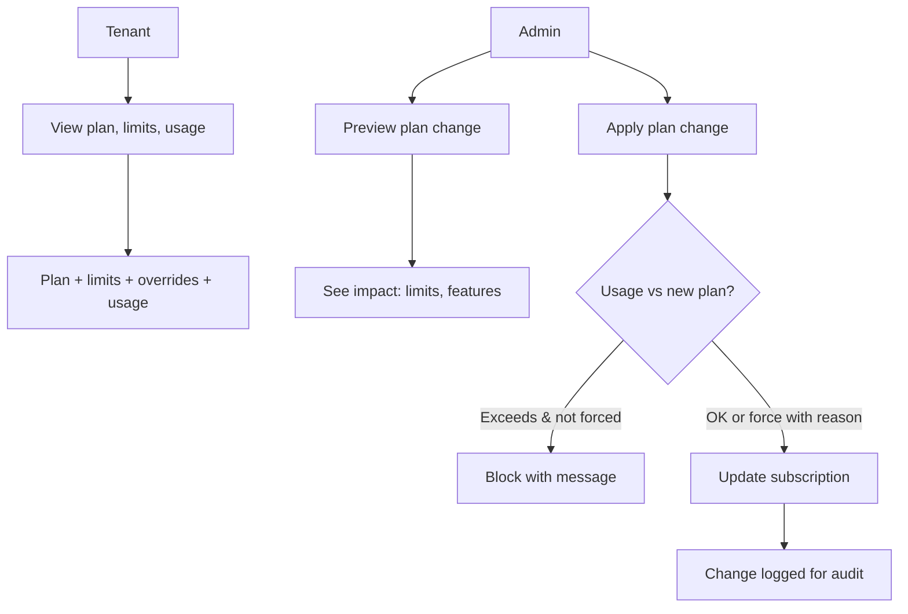

# 05 — Subscriptions and Controls

## Plans That Match How You Use the Platform

Every restaurant and supplier has a **subscription** with a **plan** (Free Trial, Silver, Gold, Platinum). Plans define limits (e.g. orders per day, branches, products, chat messages) and which features are on (e.g. order calendar, basic reports, supplier deals). This keeps the product clear and upgrade paths obvious.

### Plan tiers (conceptual)

- **Free Trial** (DB code `free`) — **Time-limited** evaluation sandbox (default **7 days**, admin **3–7**). Broad features during trial; after expiry, **read-only** access to existing data until upgrade or admin extension.
- **Silver** — First paid tier ($49/mo). Single location, up to 3 users; core ordering, chat, quick lists, receiving photos, marketplace deals (restaurant redemptions capped per day; supplier up to 3 active promotions). **Not** included: smart reorder, advanced roles, driver management, waitlist auto-promotion. Details: [SUBSCRIPTIONS.md](../product/subscriptions.md).
- **Gold** — The default plan for serious daily use. Multi-branch, more orders and products, analytics, and key features.
- **Platinum** — For scale. Very high or unlimited limits and the full feature set so you don’t think about caps.

Restaurant and supplier plans are aligned (same tier names, different limit sets: branches vs warehouses, etc.). See **docs/product/subscriptions.md** and **docs/product/plans.md** for exact matrices.

### How subscription changes work

Tenants see their current plan, usage, and limits in the app. When they hit a limit or try to use a gated feature, they get a clear message and a recommendation to upgrade. Admins can:

- Change a tenant’s plan (effective immediately or at period end).
- Preview the impact (e.g. “usage will exceed new limits”) before applying.
- Temporarily override specific limits (e.g. raise orders per day) with an optional expiry.
- **Extend Free Trial** for locked `free` tenants (`extend-free-trial` / unlock with trial extension).

### Why this matters to buyers

- **Predictable** — You know what you get at each tier; no surprise lockouts.
- **Upgrade when it hurts** — Limits and gated features are visible; recommendations point to the right plan.
- **Controlled by admin** — Enterprises can assign plans and overrides so teams get what they need without opening the wrong doors.

Subscriptions and controls are the lever that keeps the product fair, understandable, and ready for revenue and scale.
