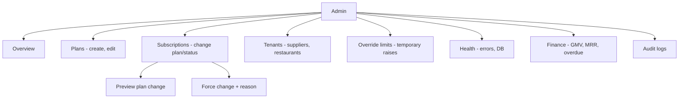

# 06 — Admin and Operations

## How the Platform Is Run and Supported

Admins have a dedicated dashboard to manage tenants, plans, subscriptions, overrides, finance, health, and audit. This is how you operate Supplify at scale and support customers without touching production data as a tenant.

### What admins can do

- **Overview** — Counts of tenants (restaurants/suppliers), subscription status, revenue (MRR/ARR), recent activity (orders, chats), and alerts (e.g. past-due invoices).
- **Plans** — Create and edit plans per tenant type (restaurant vs supplier), set limits and features, and control display order and active state.
- **Subscriptions** — List all subscriptions, change plan or status (e.g. suspend, resume), preview impact before changing plan, and force a change with reason when needed.
- **Tenants** — List and manage restaurants and suppliers; impersonate a tenant for support (view the app as them).
- **Overrides** — Add or remove temporary limit overrides (e.g. higher orders per day) with optional expiry.
- **Health** — Monitor recent errors, DB pool, and system health.
- **Finance** — View GMV, MRR, overdue balances, and top tenants.
- **Audit** — Search and review audit logs for admin actions (plan changes, overrides, impersonation, etc.).
- **Conversion funnel** — Simple stats on blocks (feature/limit hits) and upgrades so you can see how often limits drive plan changes.

### Why this matters to buyers

- **Operators** — One place to see platform health, revenue, and risk (e.g. overdue invoices).
- **Support** — Impersonation lets you see exactly what a tenant sees; overrides can unblock them while they upgrade or renew.
- **Revenue** — Plan and subscription management plus conversion stats help tune pricing and positioning (e.g. Gold as default serious plan).

Admin and operations are built so that running and growing the business is manageable and auditable.
