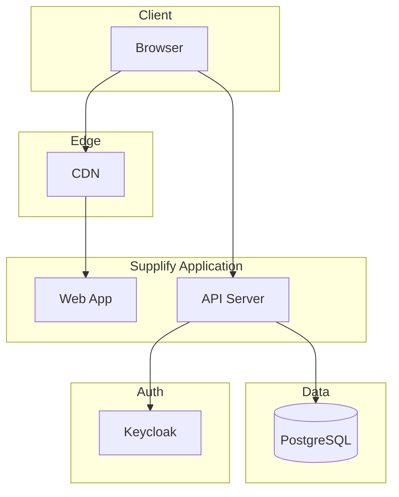

# 07 — Scalability and Enterprise

## Built to Grow With You

Supplify is designed so that single-location restaurants and small suppliers can get value quickly, while larger organizations can scale tenants, locations, and usage without hitting a wall.

### How the platform scales

- **Tenant isolation** — Every restaurant and supplier is a separate tenant. Data, permissions, and usage are scoped so one tenant never sees or affects another.
- **Plans and limits** — Limits (branches, active customer locations, warehouses, users, AI, storage) and features (reports, smart reorder, multi-branch / multi-warehouse) scale by plan. **Scale** tiers support serious multi-location / high-volume workflows. Canonical model: [four-plan-pricing-model.md](../product/four-plan-pricing-model.md).
- **Admin controls** — Admins can raise limits via overrides, change plans, and manage many tenants from one dashboard. Conversion and audit data support operations and revenue decisions.
- **Deployment** — The app runs behind a CDN, with an API server, database, and auth. Architecture supports horizontal scaling and clear separation of concerns.

### Enterprise readiness

- **High or unlimited limits** — Supplier Scale / Restaurant Scale (and optional custom Enterprise handling) raise or remove commercial caps so large chains and suppliers don’t hit artificial walls.
- **Central management** — Admins manage all tenants, plans, and overrides; [impersonation](../features/admin-impersonation.md) and audit logs support compliance and support.
- **Custom needs** — Enterprise plans can be defined with custom limits and features and assigned only by admin (e.g. manual onboarding, SLAs, custom contracts). See **docs/product/enterprise.md** for what enterprise gets and how it’s positioned.

### Why this matters to buyers

- **Growing restaurants** — Start on the 30-day Free Trial; move to Restaurant Growth for daily purchasing; upgrade to Restaurant Scale (or custom Enterprise) when multi-branch and guarantees matter.
- **Suppliers** — Scale from one warehouse to many, and from dozens to thousands of products, with plans and overrides that match your growth.
- **Investors and partners** — The same codebase serves SMB and enterprise; revenue and conversion tooling (limits, recommendations, funnel stats) support monetization and positioning.

Scalability and enterprise options are built in so the platform can start simple and grow with your most demanding customers.
