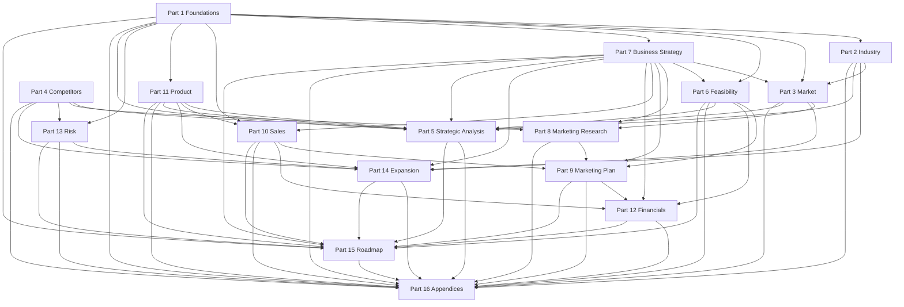

# Part 16 — Appendices (Glossary, Methodology, References, Master Index)

**Document status:** Final assembly part, part 16 of 16. This part compiles cross-cutting
material from [Parts 1–15](./README.md): terminology, research standards, a consolidated
reference bibliography, and a master index with dependency mapping. It introduces no new
market-size figures, traction claims, or strategic recommendations — it organizes what the
prior fifteen parts established.

**Status disclosure (do not remove from any part of this document):** Supplify is
**pre-launch** (product built and tested internally; no live paying tenants yet) and
**bootstrapped** (no institutional funding raised, not currently running a raise). Every
number in this master document is either (a) a verified fact from the product codebase or
public sources, cited inline in the part where it appears, or (b) an explicitly labeled
**assumption/target**, never presented as an achieved result. Where no reliable public data
exists, that is stated directly rather than filled with an invented figure. Part 15
(Implementation Roadmap) was not yet written at the time this appendix was assembled; the
index below describes its intended scope based on cross-references from Parts 6, 7, 12, and 13.

---

## 16.1 Glossary of Key Terms

Terms below appear across multiple strategy parts. Definitions reflect how Supplify uses each
term in this document set, not generic dictionary meanings. Where a term has both a product
meaning and a financial meaning, both are noted.

### A–C

**Add-on billing (branch/warehouse).** Optional monthly charges for extra restaurant
branches or supplier branches/warehouses beyond plan defaults (`docs/product/tier-matrix.md`
§5b). Admin-provisioned today, not yet automated through the billing engine (Part 1 §1.2;
Part 7 §7.2; Part 11 §11.1).

**Anchor supplier.** A distributor onboarded early in go-to-market whose imported customer
list and referral loop drive restaurant-side acquisition (Part 3 §3.6; Part 9 §9.2; Part 10
§10.4). A structural hypothesis, not a validated conversion mechanism.

**ARPU (Average Revenue Per User).** Monthly subscription revenue per paying tenant, blended
across restaurant and supplier sides. Base-case planning figure: **~$110/month** (Part 7
§7.10; Part 6 §6.4; Part 12 §12.2). Modeled, not measured — zero paying cohort exists.

**ARR / MRR.** Annual and monthly recurring revenue from subscriptions and add-ons, excluding
GMV take-rates (which Supplify does not charge today — Part 7 §7.5). Break-even MRR target:
**~$6,050** at **~55 paying tenants** (Part 6 §6.13; Part 12 §12.1).

**Assumption / target.** Any forward figure not verified by codebase audit or cited public
source. Must be labeled explicitly in prose or table headers throughout the document set.
Examples: churn rate (4%), gross new tenants per month (6), Year 3 ARR (~$418k).

**Bootstrapped.** No institutional capital raised; not currently running a raise. Governs
founder-led GTM, modest cash marketing budget ($4,800 Year 1 — Part 9 §9.4), and pre-break-even
capital need (~$31k–$65k — Part 6 §6.9).

**CAC (Customer Acquisition Cost).** Cash spent to acquire one paying tenant. Near-term model:
**near-$0 cash CAC** under founder-led direct sales — an artifact of pre-launch economics,
not evidence of paid-channel viability (Part 7 §7.11; Part 12 §12.3).

**Catalog-only feature.** A capability listed on the pricing tier matrix and in marketing
copy but not fully backend-enforced. Six Platinum items and several cross-tier string gaps
are disclosed in `docs/product/tier-matrix.md` §7 (Part 1 §1.2; Part 11 §11.1). Selling
these without disclosure is a trust and potential misrepresentation risk (Part 13 §13.1).

**Churn (gross monthly).** Percentage of paying tenants canceling per month. Base-case model:
**4%** (Part 7 §7.10). No actual cohort data exists.

**Cold start (two-sided).** The marketplace bootstrap problem: restaurants need suppliers on
platform; suppliers need restaurants. Supplify's prescribed sequence: **anchor suppliers first,
restaurants second** via CSV import and referral loop (Part 7 §7.9; Part 9 §9.2; Part 10
§10.4).

**Contract / negotiated pricing.** Supplier-set prices for specific restaurant customers,
distinct from catalog list prices — a shipped capability (Part 1 §1.2; Part 4 §4.9).

### D–G

**Dual-sided subscription SaaS.** Revenue model charging both restaurant and supplier tenants
flat monthly fees by plan tier, independent of order volume (Part 7 §7.1). Implemented with
API-layer enforcement (`requireFeature`/`checkLimit`).

**Enterprise.** Custom admin-assigned plan tier for large chains; exists in schema but not
self-serve today (Part 7 §7.4). Should not be actively sold until Gold/Platinum reference
customers exist (Part 10 §10.3).

**Evidence factory (Lebanon).** Framing from Part 14 §14.3: Lebanon's role is to produce
paying-cohort proof (retention, conversion, referral metrics), not to be the long-term
revenue engine, given macro concentration risk (Part 13 §13.3).

**Feature flag / entitlement.** Database-backed toggle controlling module access per plan or
per tenant. Distinct from RBAC permission checks (Part 11 §11.4).

**Founder-led sales.** Primary Year 1 commercial motion: direct outreach, demos, and
onboarding by founders — no dedicated sales team (Part 1 §1.11; Part 10 §10.1).

**Free Trial / Gold parity.** Trial tenants receive Gold-equivalent feature flags with
Free-tier usage limits only (Part 7 §7.3). Upgrade story is limit-driven, not feature-unlock
driven — a GTM design choice with documented risk (Part 11 §11.1).

**GMV (Gross Merchandise Value) / take-rate.** Total order value flowing through the platform.
Supplify **does not** charge a transaction fee or GMV percentage today (Part 7 §7.5). Revisit
only after subscription revenue is established.

**Gold (modal plan).** $149/month tier designed as the intended default for serious daily
operations — "Most Popular" in the pricing ladder (Part 7 §7.2; Part 1 §1.10).

**Greenfield (Lebanon).** No reliable public data quantifies restaurant procurement or POS
penetration in Lebanon (Part 2 §2.12; Part 3 §3.1.3). Category norms are undefined; first
credible local platform may define them — but Supy has confirmed Lebanon presence (Part 4
§4.3.1), so "greenfield" refers to measurement and digitization, not absence of competition.

### H–L

**LTV (Lifetime Value).** Gross revenue expected from a tenant over its lifetime. Modeled:
**~$2,640** ($110 ARPU × ~24-month lifetime at 4% churn — Part 7 §7.10). Replace with cohort
data after launch.

**Logical multi-tenancy.** Single PostgreSQL database with tenant isolation via `tenant_id`
columns and application-layer query filtering — not physical per-tenant databases or Postgres
row-level security (Part 11 §11.4).

**Manual billing gateway.** Production path for first paying cohort when card checkout is not
live: bank transfer recorded via the `manual` gateway (Part 10 §10.1; Part 11 §11.3). Stub
gateway (`stub.js`) simulates charges in development only.

**MENA.** Middle East and North Africa. Supplify's regional expansion frame: Lebanon → Jordan
→ GCC → Europe (Part 14 §14.1). Wider MENA (Egypt, etc.) explicitly deferred post-GCC.

**Net revenue retention (NRR).** Revenue retained and expanded from existing tenants over
time. Target metric for 18-month horizon; no target set until real cohort exists (Part 1
§1.15).

### M–P

**Marketplace (two-sided).** Platform connecting restaurant buyers and supplier sellers with
shared order, fulfillment, finance, and chat flows (Part 1 §1.2). Distinct from single-sided
restaurant POS or inventory tools (Foodics, Rewaa — Part 4 §4.3).

**Par level.** Restaurant inventory reorder threshold — a shipped inventory concept (Part 1
§1.2).

**PESTLE / Porter's Five Forces / SWOT / VRIO / Blue Ocean / Ansoff / BCG.** Classical
strategy frameworks applied in Part 5 to pre-launch inputs. Interpretive, not predictive —
no traction data exists to validate conclusions.

**Platinum catalog-only gap.** Six features sold at Platinum ($349/mo) without full backend
differentiation from Gold: AI quick lists, advanced/custom reports, full API/webhooks,
white-label domain, real-time media read receipts, central purchasing (Part 11 §11.1). Part 1
§1.6 targets closure in months 6–12.

**PLG (product-led growth).** Self-serve trial signup, in-app upgrade nudges, and usage-limit
pressure as conversion levers — partially shipped; billing collection is the current blocker
(Part 10 §10.1).

**Pre-launch.** Product built and internally tested; **zero live paying tenants** (README;
every part header). Distinct from "beta with paying customers."

**Proof-of-delivery (POD).** Driver capture of delivery completion evidence — shipped
fulfillment capability (Part 1 §1.2).

**Quick lists.** Saved reorder templates with optional weekly automation. Gold includes
scheduling; Platinum marketing claims "AI" automation that is catalog-only today (Part 11
§11.2).

### R–S

**RBAC (Role-Based Access Control).** 52 permission keys, system roles, and tenant-custom
roles (Gold+). Separate from plan entitlements (Part 11 §11.4).

**Referral loop / supplier growth program.** Supplier imports restaurant customers via CSV;
sponsored signup; restaurant receives discount on first paid subscription; supplier receives
credit on conversion (Part 7 §7.9).

**SAM / SOM / TAM.** Serviceable and obtainable addressable market sizing. Top-down industry
figures in Part 2; bottom-up Lebanon establishment counts in Parts 1, 3, and 6. No single
consolidated SOM figure is asserted as authoritative — scope disagreements across vendors are
disclosed (Part 2 §2.1–2.2).

**Self-serve.** Web registration, free trial activation, and Silver/Gold checkout without
sales engagement — partially live; payment gateway is the current gap (Part 10 §10.1).

**Silver.** $49/month entry paid tier for single-location, price-sensitive operators (Part 7
§7.2). Competitive wedge vs. Supy (~$250+/mo sales-led — Part 4 §4.3.1).

**Smart Reorder.** Shipped AI/statistical forecasting system: deterministic 30/90-day models
(Gold+) plus LLM explain/ask endpoints (Platinum), gated by plan, feature flag, and
`AI_ENABLED` environment toggle (Part 11 §11.2).

**Stub billing gateway.** Development placeholder simulating payment processing — must be
replaced for commercial launch (Part 11 §11.1).

**Supplier side / supplier tenant.** Second primary tenant type: food and beverage distributors
(initial focus); packaging, cleaning, and equipment suppliers are expansion targets (Part 1
§1.2; Part 3 §3.2).

### T–Z

**Tenant.** An organization account on Supplify — either `restaurant` or `supplier` type —
with isolated data, subscription plan, and RBAC (Part 1 §1.2; `docs/architecture/tenancy.md`).

**Tier matrix.** Authoritative pricing, limits, and feature-gating document:
`docs/product/tier-matrix.md`. Referenced throughout as the commercial source of truth.

**Two-sided marketplace sales complexity.** Requirement to sell and retain both sides;
supplier-driven acquisition is the prescribed cold-start mitigation (Part 10 §10.4).

**Usage limits.** Plan-enforced ceilings on orders/day, SKUs, branches, users, warehouses —
the primary upgrade trigger when features are already visible in trial (Part 7 §7.2–7.3).

**Verified fact.** Claim traceable to codebase audit (dated 2026-07-01), shipped
documentation, or a cited primary/secondary public source with methodology disclosed.

**WhatsApp fragmentation.** The informal coordination channel (calls, messages) Supplify
replaces — also a planned integration (Meta Cloud API stub exists; Part 11 §11.3).

**ZATCA / UAE e-invoicing.** Saudi and UAE electronic invoicing compliance regimes relevant
to GCC expansion (Part 6 §6.7; Part 14 §14.5). Not yet implemented in product.

---

## 16.2 Methodology Summary

This section consolidates the research and writing standards applied across all sixteen parts.
Individual parts may add domain-specific methodology (e.g., Part 4 §4.1 competitor profiling);
this is the master standard.

### 16.2.1 Document purpose and audience

The master strategy document is a single version usable for external investors, enterprise
customers, partners, and internal leadership (README). Parts lean commercial (1, 2, 4, 7, 9, 12) or operational (6, 10, 11, 13, 15) as content requires, but none are investor-only or
internal-only. Part 16 does not change substance in prior parts — it indexes and defines
shared conventions.

### 16.2.2 Research standards

**Source hierarchy** (adapted from Part 4 §4.1, applied document-wide):

| Priority | Source type                                                                 | Usage rule                                                       |
| -------: | --------------------------------------------------------------------------- | ---------------------------------------------------------------- |
|        1 | Company-owned pages, SEC/regulatory filings, official government statistics | Preferred for competitor facts, funding, pricing                 |
|        2 | Tier-1 press, industry associations (e.g., NRA), World Bank, IMF summaries  | Preferred for macro and adoption trends                          |
|        3 | Established market-research firms (Grand View, Mordor, IBISWorld, Statista) | Cite with scope caveat; never average conflicting totals         |
|        4 | Review platforms (G2, Capterra)                                             | Sentiment and feature confirmation; note HTTP/access limitations |
|        5 | Vendor-sponsored surveys (Toast, etc.)                                      | Directional only; flag self-interest                             |
|        6 | Low-tier aggregators (DataIntelo, dataintelo, Business Research Insights)   | Directional framing only; disclose weak methodology              |
|        7 | Internal codebase audit, `docs/product/*`, `docs/sales/*`                   | Product and pricing verified facts                               |

**Internal verification.** Product claims require traceability to codebase or internal docs.
The canonical audit date is **2026-07-01** (180 SQL migrations, 554 API routes, 225+ backend
tests, 100+ frontend tests — Part 1 §1.2; Part 11). Test **counts** are verified; coverage
**percentages** are not claimed.

**Competitor research.** Twenty competitors profiled in Part 4 by archetype (MENA-direct,
global back-office, marketplace, POS-anchored, horizontal). Revenue and customer counts stated
as "not disclosed" when absent. Vendor self-reports and third-party ARR estimates are never
headline facts. MENA/Lebanon presence requires primary-source evidence; "no evidence found"
is an absence statement, not proof of non-entry.

**Market sizing.** When research vendors disagree (e.g., global foodservice $3.1T vs. $4.3T —
Part 2 §2.1), the disagreement is stated; figures are not averaged. Scope ambiguity (hotel
F&B 6.5× spread) is disclosed rather than resolved. Genuine data gaps (Jordan establishment
count, Lebanon procurement penetration) are flagged, not filled.

**Regional research.** Lebanon (§2.12), GCC (§2.13), and wider MENA (§2.14) in Part 2 supply
regional inputs. Personas and journeys in Part 3 are illustrative hypotheses unless tied to
cited external research.

**Financial modeling.** Parts 6, 7, and 12 use bottom-up break-even and three-year extension
models. Every model shows inputs and formulas (Part 6 §6.4). Forward outputs are **modeled,
not forecasted** — distinct from promises.

### 16.2.3 Citation rules

1. **Inline attribution.** Statistics and competitor facts carry `(Source: …)` or markdown
   links in the part where they first matter strategically.
2. **Cross-reference over duplication.** Later parts reference earlier sections (e.g., "Part
   2 §2.12") rather than re-citing full market tables — unless restatement aids feasibility
   or financial modeling readability.
3. **Primary vs. derivative.** When Part 13 cites Lebanon macro via The Middle East Insider
   and Wikipedia, the part discloses synthesis limits. Part 16 lists representative URLs in
   §16.3; the part of record remains the first substantive use.
4. **Internal docs.** Repository paths (`docs/product/tier-matrix.md`, `docs/sales/01_problem.md`)
   are valid citations for product behavior — equivalent to source code for commercial claims.
5. **Date stamps.** External sources accessed **2026-07-01** unless otherwise noted. Macro
   conditions (Lebanon conflict from March 2026) are time-stamped as live at writing.

### 16.2.4 Assumption labeling

Three categories appear throughout the document set:

| Label                                | Meaning                               | Example                                                              |
| ------------------------------------ | ------------------------------------- | -------------------------------------------------------------------- |
| **Verified fact**                    | Codebase audit or cited source        | 180 migrations; Supy $9.5M raised                                    |
| **Assumption / target / hypothesis** | Explicit forward or unvalidated claim | 4% churn; "tens" of tenants at 12 months                             |
| **Data gap**                         | Known unknown, not invented           | Jordan establishment count; global chain/independent split (current) |

Rules:

- Table columns and section titles use _(assumption)_, _(target)_, _(modeled)_, _(hypothesis)_,
  or _(proposed — for founder confirmation)_ where applicable (Part 1 §1.3–1.5 vision/mission).
- **Never** present modeled LTV, CAC, break-even timing, or Year 3 ARR as achieved results.
- **Never** cite vendor "hours saved" or adoption percentages without methodology — Part 1
  §1.7 explicitly rejects fabricated efficiency statistics.
- Pre-launch **trust signals**: lead with product depth and pricing transparency; do not claim
  customer logos, G2 reviews, or catalog-only AI features (Part 8 §8.2.3).

### 16.2.5 Framework application (Part 5)

SWOT, PESTLE, Porter's Five Forces, VRIO, Blue Ocean (ERRC), Value Chain, Ansoff, and BCG
matrices interpret inputs from Parts 1–4, 6–7, and 11. At pre-launch, frameworks test **thesis
coherence**, not market share. Strengths are verified product choices; weaknesses include
disclosed gaps and zero traction.

### 16.2.6 Consistency and assembly

Parts were built in parallel where dependencies allowed (README). All sixteen parts exist
as draft-complete in the repository as of 2026-07-01. Known reconciliation items for future
light consistency passes:

- Part 12 Year 2–3 marketing lines may be further integrated with Part 9 detail.
- Timeline alignment between Part 9 (Year 1 marketing), Part 12 (financial phasing), and
  Part 15 (M1–36 roadmap) should be spot-checked before external distribution.

Part 16 is the master index that makes such passes tractable.

---

## 16.3 Reference List by Category

This bibliography compiles **representative and critical sources** cited across Parts 1–14.
It is not exhaustive of every inline link — duplicate citations to the same Statista or Mordor
page across sections are listed once. For a statistic's part of record, see the cross-reference
map (§16.5).

### 16.3.1 Internal product and company documentation

| Document                                                                                   | Role in strategy set                           |
| ------------------------------------------------------------------------------------------ | ---------------------------------------------- |
| `docs/onboarding/01-executive-overview.md`                                                 | Product inventory, migration counts            |
| `docs/product/tier-matrix.md`                                                              | Pricing, limits, catalog-only gap register     |
| `docs/product/feature-catalog-full.md`                                                     | Full capability inventory                      |
| `docs/sales/01_problem.md`, `docs/sales/02_solution.md`                                    | Problem/solution framing                       |
| `docs/sales/08_pricing_strategy.md`                                                        | Trial and upgrade mechanics                    |
| `docs/sales/enterprise_checklist.md`                                                       | Enterprise sales template                      |
| `docs/features/ai-smart-reorder.md`                                                        | Smart Reorder AI scope                         |
| `docs/features/tenant-registration.md`, `docs/features/free-trial-expiry.md`               | Self-serve funnel                              |
| `docs/architecture/tenancy.md`, `docs/architecture/access-control.md`                      | Multi-tenancy, RBAC                            |
| `docs/onboarding/15-security-review.md`                                                    | Security posture (2026-06-17)                  |
| `docs/operations/railway-environments.md`, `docs/operations/railway-performance-report.md` | Infrastructure                                 |
| `PRODUCT.md`                                                                               | Brand personality and design principles        |
| Internal codebase audit (2026-07-01)                                                       | Test counts, billing stub, feature enforcement |

### 16.3.2 Global industry and market research

| Source                                                                                                                                                       | Topics used                                    |
| ------------------------------------------------------------------------------------------------------------------------------------------------------------ | ---------------------------------------------- |
| [Grand View Research — Foodservice Market](https://www.grandviewresearch.com/industry-analysis/foodservice-market-report)                                    | Global foodservice size, structure             |
| [Mordor Intelligence — Food Service Market](https://www.mordorintelligence.com/industry-reports/food-service-market)                                         | Alternate scope, QSR/off-premise               |
| [IBISWorld — Global Fast Food](https://www.ibisworld.com/global/industry/global-fast-food-restaurants/1480/)                                                 | Narrow QSR slice                               |
| [Grand View Research — Cloud Kitchen](https://www.grandviewresearch.com/industry-analysis/cloud-kitchen-market)                                              | Ghost/cloud kitchen segment                    |
| [Grand View Research — Restaurant Management Software](https://www.grandviewresearch.com/industry-analysis/restaurant-management-software-market)            | Restaurant SaaS category                       |
| [Grand View Research — Procurement Software](https://www.grandviewresearch.com/industry-analysis/procurement-software-market-report)                         | Adjacent procurement market                    |
| [DataIntelo / MarketIntelo — Restaurant Procurement Software](https://dataintelo.com/report/restaurant-procurement-software-market)                          | Part 1 §1.14 category validation (directional) |
| [Statista — Food service establishments by country](https://www.statista.com/statistics/1240159/number-of-food-service-establishments-worldwide-by-country/) | Global establishment counts (soft)             |
| [UNEP — Food Waste Index Report 2024](https://www.unep.org/resources/publication/food-waste-index-report-2024)                                               | Waste trends                                   |

### 16.3.3 Restaurant technology and AI adoption

| Source                                                                                                                                                                   | Topics used                 |
| ------------------------------------------------------------------------------------------------------------------------------------------------------------------------ | --------------------------- |
| [Restaurant Dive — NRA AI adoption (2026)](https://www.restaurantdive.com/news/national-restaurant-assocation-operator-artificial-intelligence-adoption/812418/)         | Operator AI usage (~26%)    |
| [Toast — State of the Restaurant Industry](https://pos.toasttab.com/blog/on-the-line/state-of-the-restaurant-industry-2025)                                              | Vendor survey (directional) |
| [Modern Restaurant Management — cost inflation 2026](https://modernrestaurantmanagement.com/restaurants-challenged-to-manage-the-cost-inflation-margin-squeeze-in-2026/) | Labor cost pressure         |
| [Hospitality Technology — 2025 POS Study](https://hospitalitytech.com/pos-software-2025-key-trends-and-features-horizon)                                                 | POS evolution               |
| [Deloitte — AI in restaurants](https://www.deloitte.com/us/en/about/press-room/deloitte-how-ai-is-revolutionizing-restaurants.html)                                      | AI use cases (directional)  |
| [OpenAI — Choco Voice Agent](https://openai.com/index/choco/)                                                                                                            | Competitor AI benchmark     |

### 16.3.4 Regional — Lebanon and macro

| Source                                                                                                                                                                                    | Topics used                           |
| ----------------------------------------------------------------------------------------------------------------------------------------------------------------------------------------- | ------------------------------------- |
| [Hospitality News ME — Lebanon F&B 2025](https://www.hospitalitynewsmag.com/lebanon-fb-industry/)                                                                                         | ~4,000–4,500 establishments (derived) |
| Statista Market Insights — Food, Lebanon outlook (2026-07-01)                                                                                                                             | ~$6.35B market, ~8.66% CAGR           |
| [World Bank — Lebanon economic rebound, Jan 2026](https://www.worldbank.org/en/news/press-release/2026/01/22/lebanon-economic-rebound-marks-cautious-recovery-amidst-progress-on-reforms) | Cautious recovery signal              |
| [BDL — exchange rates](https://bdl.gov.lb/currentrate.php); [TradingEconomics — Lebanon currency](https://tradingeconomics.com/lebanon/currency)                                          | Currency context                      |
| [The Middle East Insider — Lebanon currency collapse 2026](https://themiddleeastinsider.com/2026/04/05/lebanon-currency-collapse-2026-lira-crisis-war/?lang=en)                           | Macro risk, conflict cost             |
| [Wikipedia — Lebanese liquidity crisis](https://en.wikipedia.org/wiki/Lebanese_liquidity_crisis)                                                                                          | Banking sector dysfunction            |
| [VATupdate — Lebanon 2026 budget proposal](https://www.vatupdate.com/2025/09/23/lebanons-2026-budget-proposal-vat-deduction-limits-and-expanded-digital-enforcement-measures/)            | VAT/digital enforcement               |
| [Bloomberg — Lebanon deposit law, Dec 2025](https://www.bloomberg.com/news/articles/2025-12-26/lebanon-advances-law-aimed-at-freeing-up-trapped-bank-deposits)                            | Banking reform signal                 |

### 16.3.5 Regional — GCC and wider MENA

| Source                                                                                                                    | Topics used                                |
| ------------------------------------------------------------------------------------------------------------------------- | ------------------------------------------ |
| Mordor Intelligence — GCC foodservice reports (via Part 2 §2.13)                                                          | UAE, KSA, Qatar, Kuwait sizing             |
| Part 2 §2.14 primary references                                                                                           | Jordan VAT, Buna rail, Egypt/MaxAB caution |
| [Oracle Middle East — Simphony POS](https://www.oracle.com/middleeast/food-beverage/restaurant-pos-systems/simphony-pos/) | Enterprise POS regional presence           |

### 16.3.6 Competitor and company sources (selected)

| Company              | Representative sources                                                                                                                                                                                                                                                                                  |
| -------------------- | ------------------------------------------------------------------------------------------------------------------------------------------------------------------------------------------------------------------------------------------------------------------------------------------------------- |
| **Supy**             | [The National](https://www.thenationalnews.com/business/start-ups/2023/08/14/generation-start-up-how-uaes-supy-is-addressing-the-hospitality-industrys-cost-woes/); [Wamda seed round](https://www.wamda.com/2022/07/supy-raises-8-million-seed-round); [supy.io pricing](https://supy.io/supy-pricing) |
| **Foodics**          | [Series C press](https://www.foodics.com/press/saas-series-c-funding/); [KASO integration](https://www.foodics.com/press/foodics-integrates-with-kaso/); [Lebanon reseller](https://www.itsordable.com/en/lebanon/portfolio/partner/foodics)                                                            |
| **Rewaa**            | [Wamda Series B](https://www.wamda.com/2025/12/saudi-arabias-rewaa-closes-45-million-series-b)                                                                                                                                                                                                          |
| **MarketMan**        | [PSG merger PR](https://psgequity.com/news/meal-ticket-and-marketman-announce-merger-and-over-100-million-growth-investment-from-psg); pricing page                                                                                                                                                     |
| **MarginEdge**       | [Series C PR](https://www.prnewswire.com/news-releases/marginedge-secures-45-million-in-series-c-funding-to-empower-restaurateurs-with-actionable-data-and-insights-301697201.html)                                                                                                                     |
| **Restaurant365**    | [TechCrunch $175M round](https://techcrunch.com/2024/05/15/restaurant365-orders-in-175m-at-a-1b-valuation-to-supersize-its-food-service-software-stack/)                                                                                                                                                |
| **Choco**            | [Unicorn PR](https://www.prnewswire.com/news-releases/choco-achieves-unicorn-status-in-quest-to-drive-zero-food-waste-in-supply-chains-301523410.html); pivot/layoff reporting                                                                                                                          |
| **Toast / xtraCHEF** | [SEC filings](https://www.sec.gov/Archives/edgar/data/0001823306/); [xtraCHEF acquisition](https://pos.toasttab.com/news/toast-acquires-xtrachef-to-empower-restaurants-with-insights-into-menu-profitability-and-accounts-payable-automation)                                                          |
| **Orderlion**        | [EU-Startups funding](https://www.eu-startups.com/2022/11/vienna-based-orderlion-picks-up-e4-million-to-make-b2b-food-supply-chain-streamlined-and-scalable/)                                                                                                                                           |
| **Cin7**             | [Pricing](https://www.cin7.com/pricing/); AI capabilities newsroom                                                                                                                                                                                                                                      |

Full competitor profiles and comparison tables: Part 4 §4.3–§4.9.

### 16.3.7 Regulatory, compliance, and data protection

| Source                                                                           | Topics used                         |
| -------------------------------------------------------------------------------- | ----------------------------------- |
| [GDPR.eu — extraterritorial scope](https://gdpr.eu/companies-outside-of-europe/) | EU expansion (Part 6 §6.7)          |
| Part 6 §6.7 synthesis                                                            | ZATCA (KSA), UAE e-invoicing phases |
| `docs/onboarding/15-security-review.md`                                          | SOC 2/ISO status (not claimed)      |

---

## 16.4 Pre-Launch and Bootstrapped Status Disclosure

This disclosure appears in README and every part header; it is repeated here as the **final,
binding statement** for the assembled document:

**Company stage.** Supplify is **pre-launch**. The product is built and tested internally:
multi-tenant architecture, RBAC, subscription tier enforcement, ordering, fulfillment, GPS
delivery, receiving, invoicing, inventory, reservations, staff modules, and real-time chat are
shipped in codebase. What does **not** exist: live paying tenants, production payment
collection via a real processor, measured churn or conversion, public customer references, or
market presence outside internal testing.

**Capital stage.** Supplify is **bootstrapped**. No institutional funding has been raised; the
company is not currently running a raise. Financial parts (6, 7, 12) model break-even and
optional future capital scenarios as **planning tools**, not fundraising offers.

**Implications for readers.**

| Topic               | What the document provides                               | What it does not provide         |
| ------------------- | -------------------------------------------------------- | -------------------------------- |
| Product capability  | Codebase-verified inventory (Part 1 §1.2; Part 11)       | Production usage metrics         |
| Market opportunity  | Cited industry/regional research (Parts 2–3)             | Supplify-specific win rates      |
| Competitors         | 20-profile research set (Part 4)                         | Live win/loss data vs. Supy      |
| Financials          | Bottom-up model, ~55-tenant break-even (Parts 6, 12)     | Audited financials, actual MRR   |
| Strategy frameworks | Thesis coherence tests (Part 5)                          | Validated strategic outcomes     |
| Marketing/sales     | Year 1 plan and funnel (Parts 8–10)                      | Campaign performance history     |
| Expansion           | Lebanon → Jordan → GCC → Europe sequence (Part 14)       | Closed international deals       |
| Risk                | Honest register including severe Lebanon macro (Part 13) | Mitigation of exogenous conflict |

**Catalog integrity.** Several Platinum-tier capabilities are priced but not fully enforced
(Part 11 §11.1). Marketing, sales, and investor materials must not claim these as shipped
until the Part 1 §1.6 closure objective is met.

**Honest use.** This document set describes what a capable pre-launch product **plans to do
next**, grounded in verified build state and cited market context — not a retrospective of
traction that does not exist. Replace targets with actuals as soon as commercial launch
produces billing and retention data.

---

## 16.5 Master Index — All Sixteen Parts

### 16.5.1 Part summary table

|   # | Part                                      | File                                                                                 | One-line description                                                                                                                            | Status           |
| --: | ----------------------------------------- | ------------------------------------------------------------------------------------ | ----------------------------------------------------------------------------------------------------------------------------------------------- | ---------------- |
|   1 | Executive Summary & Strategic Foundations | [01_executive_summary_and_foundations.md](./01_executive_summary_and_foundations.md) | Company overview, problem/solution, business model, objectives, and success-metric targets for a pre-launch two-sided SaaS platform             | Draft — complete |
|   2 | Global & Regional Industry Research       | [02_industry_research.md](./02_industry_research.md)                                 | Cited global foodservice sizing, restaurant-tech categories, AI/adoption trends, and Lebanon/GCC/MENA regional data with explicit scope caveats | Draft — complete |
|   3 | Market Research                           | [03_market_research.md](./03_market_research.md)                                     | Segmentation, personas, buyer journeys, willingness-to-pay, and two-sided cold-start implications mapped to shipped product touchpoints         | Draft — complete |
|   4 | Competitor Research                       | [04_competitor_research.md](./04_competitor_research.md)                             | Twenty competitors across five archetypes with master comparison table and cross-cutting strategic findings (Supy as primary Lebanon threat)    | Draft — complete |
|   5 | Strategic Analysis                        | [05_strategic_analysis.md](./05_strategic_analysis.md)                               | SWOT, PESTLE, Porter's, VRIO, Blue Ocean, Value Chain, Ansoff, BCG, and gap analysis synthesizing Parts 1–4, 6–7, and 11                        | Draft — complete |
|   6 | Feasibility Study                         | [06_feasibility_study.md](./06_feasibility_study.md)                                 | Nine-dimension feasibility assessment with break-even model (~55 tenants, ~$6,050 MRR), sensitivity analysis, and 18-month ROI scenarios        | Draft — complete |
|   7 | Business Strategy                         | [07_business_strategy.md](./07_business_strategy.md)                                 | Dual-sided subscription revenue model, pricing ladder, retention mechanics, and modeled LTV/CAC unit economics                                  | Draft — complete |
|   8 | Marketing Research                        | [08_marketing_research.md](./08_marketing_research.md)                               | Brand architecture, positioning, personas, SEO/content, and channel strategy for founder-led Lebanon GTM                                        | Draft — complete |
|   9 | Marketing Plan (Year 1)                   | [09_marketing_plan.md](./09_marketing_plan.md)                                       | Month-by-month Year 1 marketing calendar, $4,800 cash budget, KPIs, and supplier-first acquisition sequencing                                   | Draft — complete |
|  10 | Sales Strategy                            | [10_sales_strategy.md](./10_sales_strategy.md)                                       | Founder-led sales motion, funnel stages, two-sided complexity, objection handling, and billing-stub/manual-payment reality                      | Draft — complete |
|  11 | Product Strategy                          | [11_product_strategy.md](./11_product_strategy.md)                                   | Roadmap (Now/Next/Later), AI/integrations/security/API strategy, scalability limits, and innovation bets                                        | Draft — complete |
|  12 | Financials (3-Year Model)                 | [12_financials.md](./12_financials.md)                                               | Three-year MRR/ARR, burn/runway, scenario analysis, and capital framing carried from Parts 6–7                                                  | Draft — complete |
|  13 | Risk Management                           | [13_risk_management.md](./13_risk_management.md)                                     | Due-diligence-style risk register: technical, competitive, Lebanon macro, currency, cyber, regulatory, operational, hiring                      | Draft — complete |
|  14 | Expansion Strategy                        | [14_expansion_strategy.md](./14_expansion_strategy.md)                               | Gated geographic sequence Lebanon → Jordan → GCC → Europe with decision framework and contingency paths                                         | Draft — complete |
|  15 | Implementation Roadmap (Month 1–36)       | [15_implementation_roadmap.md](./15_implementation_roadmap.md)                       | Month 1–36 operational calendar integrating product, GTM, hiring triggers, and financial milestones                                             | Draft — complete |
|  16 | Appendices                                | [16_appendices.md](./16_appendices.md)                                               | Glossary, methodology, reference bibliography, master index, and status disclosure (this document)                                              | Draft — complete |

### 16.5.2 Cross-reference dependency map

The diagram shows **primary upstream dependencies** (solid arrows). Dashed lines indicate
strong cross-references without blocking authorship. Part 1 is the root; Part 15 is the
integration leaf. All sixteen parts are now authored.

### 16.5.3 Dependency matrix (which parts depend on which)

**Reading guide:** Row part **depends on** column parts for inputs, citations, or models.
"●" = primary dependency; "○" = significant cross-reference.

| Part                     |  1  |  2  |  3  |  4  |  5  |  6  |  7  |  8  |  9  | 10  | 11  | 12  | 13  | 14  | 15  |
| ------------------------ | :-: | :-: | :-: | :-: | :-: | :-: | :-: | :-: | :-: | :-: | :-: | :-: | :-: | :-: | :-: |
| **1 Foundations**        |  —  |     |     |     |     |     |     |     |     |     |     |     |     |     |     |
| **2 Industry**           |  ●  |  —  |     |     |     |     |     |     |     |     |     |     |     |     |     |
| **3 Market**             |  ●  |  ●  |  —  |     |     |     |  ○  |     |     |     |  ○  |     |     |  ○  |     |
| **4 Competitors**        |  ●  |  ○  |     |  —  |     |     |  ○  |     |     |     |     |     |     |     |     |
| **5 Strategic Analysis** |  ●  |  ●  |  ●  |  ●  |  —  |  ●  |  ●  |     |     |     |  ●  |     |  ○  |     |     |
| **6 Feasibility**        |  ●  |  ○  |     |     |     |  —  |  ●  |     |     |     |     |     |     |     |     |
| **7 Business Strategy**  |  ●  |     |     |  ○  |     |     |  —  |     |     |     |     |     |     |  ○  |     |
| **8 Marketing Research** |  ○  |     |  ●  |  ●  |     |     |  ●  |  —  |     |     |     |     |     |     |     |
| **9 Marketing Plan**     |  ○  |  ○  |     |     |     |  ●  |  ●  |  ●  |  —  |  ●  |     |  ○  |     |     |     |
| **10 Sales**             |  ●  |  ○  |  ○  |  ○  |     |     |  ●  |     |  ○  |  —  |  ●  |     |     |     |     |
| **11 Product**           |  ●  |     |     |     |     |     |     |     |     |  ○  |  —  |     |     |  ●  |     |
| **12 Financials**        |  ○  |     |     |     |     |  ●  |  ●  |     |  ●  |  ●  |  ○  |  —  |  ○  |     |  ○  |
| **13 Risk**              |  ●  |  ○  |     |  ●  |     |     |  ○  |     |     |     |  ○  |     |  —  |  ○  |  ○  |
| **14 Expansion**         |  ●  |  ●  |  ●  |  ●  |     |  ○  |  ●  |     |     |  ○  |  ●  |     |  ●  |  —  |     |
| **15 Roadmap**           |  ●  |  ○  |  ○  |  ○  |  ●  |  ●  |  ●  |  ○  |  ●  |  ●  |  ●  |  ●  |  ●  |  ●  |  —  |
| **16 Appendices**        |  ●  |  ●  |  ●  |  ●  |  ●  |  ●  |  ●  |  ●  |  ●  |  ●  |  ●  |  ●  |  ●  |  ●  |  ○  |

### 16.5.4 Recommended reading order

For a **first full pass**, the assembly sequence that respects dependencies:

1. **Part 1** — context and vocabulary
2. **Parts 2 + 3** — market (parallel)
3. **Part 4** — competitors
4. **Parts 7 + 11** — commercial and product baseline (parallel)
5. **Part 6** — feasibility and break-even
6. **Part 5** — strategic synthesis
7. **Parts 8 → 9 → 10** — GTM stack
8. **Part 12** — financial model
9. **Parts 13 + 14** — risk and expansion (parallel)
10. **Part 15** — implementation timeline
11. **Part 16** — glossary and index (this document)

For **investor due diligence**: 1 → 4 → 7 → 6 → 12 → 13 → 11 → 5. For **operational
launch**: 1 → 11 → 10 → 9 → 6 → 15.

### 16.5.5 Key numerical anchors (quick lookup)

Consolidated planning figures — all **modeled or cited**, not actuals:

| Metric                       |                          Value | Primary part            |
| ---------------------------- | -----------------------------: | ----------------------- |
| Lebanon F&B establishments   |         ~4,000–4,500 (derived) | 1 §1.7; 2 §2.12; 6 §6.2 |
| Lebanon food market (2025)   |           ~$6.35B; ~8.66% CAGR | 1 §1.7; 2 §2.12         |
| Break-even paying tenants    |                    ~55 blended | 6 §6.13; 12 §12.1       |
| Break-even MRR               |                        ~$6,050 | 6 §6.13; 12 §12.1       |
| Blended ARPU                 |                       ~$110/mo | 7 §7.10; 6 §6.4         |
| Monthly gross churn (base)   |                             4% | 7 §7.10                 |
| Modeled gross LTV            |                        ~$2,640 | 7 §7.10; 12 §12.3       |
| Monthly fixed opex (Year 1)  |                        ~$5,800 | 6 §6.4.1; 12 §12.8      |
| Pre-break-even capital       |                     ~$31k–$65k | 6 §6.9; 12 §12.7        |
| Year 1 marketing cash        |                         $4,800 | 9 §9.4                  |
| Year 3 ARR (base case)       |                      ~$418,000 | 12 §12.6                |
| Silver / Gold / Platinum     |    $49 / $149 / $349 per month | 7 §7.2; 1 §1.10         |
| Primary competitor (Lebanon) | Supy (~$250+/mo; $9.5M raised) | 4 §4.3.1; 13 §13.2      |

---

## 16.6 Document Closure

This appendix completes the sixteen-part Supplify Master Strategy & Investment Document as
defined in [README.md](./README.md). The set is designed to be read as a whole or by role-specific
paths (§16.5.4), with Part 16 as the permanent reference for terminology, sourcing standards,
and navigation.

**Maintenance rule:** When live launch data exists, update Parts 1 §1.15, 7 §7.10–7.11, 12,
and 13 first; then refresh §16.5.5 numerical anchors and any glossary entries that transition
from "assumption" to "verified fact." The pre-launch disclosure (§16.4) should be revised
only when the company has paying tenants and/or raised institutional capital — not before.

---

### Sources & assumptions used in this part

- All glossary definitions: synthesized from Parts 1–14 and internal docs cited therein; no
  new product claims introduced.
- Methodology: consolidated from README, Part 4 §4.1, and citation patterns observed across
  Parts 1–14.
- Reference list: representative compilation from inline citations across Parts 1–14; not a
  bibliographic audit of every URL.
- Part 15: [15_implementation_roadmap.md](./15_implementation_roadmap.md) (complete as of 2026-07-01).
- Dependency map: authored from explicit "Builds on / depends on" statements in part headers
  and cross-reference density in body text.

**Open items for founder review:**

1. Spot-check timeline alignment across Parts 9, 12, and 15 before external investor distribution.
2. After commercial launch, schedule first glossary and §16.5.5 anchor refresh with real
   billing and churn data.
