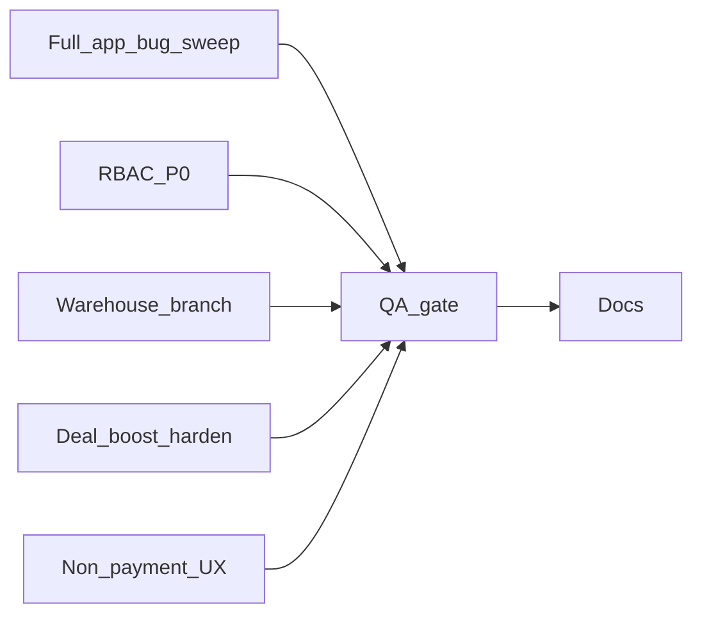

# Prod ship hardening (web/API) — 2026-08-21

## Overview

Full web/API ship hardening: close RBAC/warehouse/branch bugs, harden deal boost to work with existing stub/manual billing (no PSP changes), leave all other payment surfaces untouched, sweep the whole app for bugs via tests + targeted audits, then QA and promote.

Mobile is out of scope for this pass (document skip in `docs/mobile/MOBILE_FEATURE_PARITY.md` when work lands).

## Status

| Phase | Item                                        | Status                               |
| ----- | ------------------------------------------- | ------------------------------------ |
| 0     | Full-app bug sweep                          | Completed                            |
| 1     | RBAC P0                                     | Completed                            |
| 2     | Warehouse / branches SoT                    | Completed                            |
| 3     | Deal boost harden                           | Completed                            |
| 4     | Non-payment UX only                         | Completed                            |
| 5     | QA gate (`typecheck` / `test:ci` / `build`) | Completed                            |
| 6     | Docs (parity skip + readiness notes)        | Completed                            |
| 7     | Promote preprod → prod (after approval)     | Pending - explicit approval required |

## Reality check

Absolute “zero bugs forever” is not a deliverable. This plan makes the app **safe and broadly functional**: fix P0 security/inventory bugs, harden deal boost with the **existing** stub/manual billing path, leave all other payment/billing surfaces alone, sweep the **whole** app via tests + targeted audits, then promote.

**Out of scope (do not change):**

- Mobile repos
- Billing gateway / PSP integration (stays stub/manual)
- Sponsorship Pay/Retry UI and API (keep as-is for later)
- Featured placement payment flows
- B2B invoice “Pay” / record-payment UX and ledger methods
- Any other payment-method / checkout / subscription charge code beyond the deal-boost harden path below

**Env code:** `dev` / `preprod` / `prod` already share tip `38d6a5bb`. Promote again only after fixes land on `dev`.



---

## Phase 0 — Full-app bug sweep (not one vertical)

Goal: find and fix defects **across the product**, not only RBAC/warehouse.

1. Run `pnpm test:ci` and triage **every** failing suite (API + web): orders, fulfillment, receiving, inventory, chat, staff, reservations, org/branches, notifications, entitlements, etc.
2. Static pass for crash/honesty bugs outside payment:
   - Dead buttons / missing handlers (non-payment)
   - Routes that 500 or return wrong tenant data
   - Known audit leftovers that are still open (non-payment)
3. Fix real defects discovered; log any residual P2+ as documented known issues rather than pretending they do not exist.
4. **Skip** failures that are purely payment/PSP integration tests unless they block unrelated suites.

---

## Phase 1 — RBAC P0 (security)

| Fix                     | File(s)                                                                                                                                     | Change                                                                                                                             |
| ----------------------- | ------------------------------------------------------------------------------------------------------------------------------------------- | ---------------------------------------------------------------------------------------------------------------------------------- |
| Demo email role map     | [`apps/api/src/lib/rbac.js`](../../../apps/api/src/lib/rbac.js)                                                                             | Disable demo email → role shortcuts in production; reject via [`validate-config.js`](../../../apps/api/src/lib/validate-config.js) |
| Restaurant PATCH IDOR   | [`apps/api/src/routes/restaurants.routes.js`](../../../apps/api/src/routes/restaurants.routes.js)                                           | Tenant resolve + `SETTINGS_EDIT`; scope via `getRestaurantIdForRequest`                                                            |
| Invoice ADMIN bypass    | [`invoices.routes.js`](../../../apps/api/src/routes/invoices.routes.js), [`invoice-access.js`](../../../apps/api/src/lib/invoice-access.js) | Scope ADMIN to impersonated tenant (access control only — not payment)                                                             |
| Chat mark-read IDOR     | [`chat/conversations.js`](../../../apps/api/src/routes/chat/conversations.js)                                                               | `userCanAccessConversation` before mark-read                                                                                       |
| Admin UI fallback       | [`usePermissions.ts`](../../../apps/web/src/hooks/usePermissions.ts)                                                                        | No prod admin permission fallback; deny until permissions load                                                                     |
| Auto SUPER_ADMIN        | [`validate-config.js`](../../../apps/api/src/lib/validate-config.js)                                                                        | Hard-fail if `ALLOW_AUTO_SUPER_ADMIN=true` in prod                                                                                 |
| Branch ADMIN query IDOR | [`branches.routes.js`](../../../apps/api/src/routes/branches.routes.js)                                                                     | Require admin permission / impersonation scope for query overrides                                                                 |

Vitest for each P0.

---

## Phase 2 — Warehouse / branches

**Fix (stock correctness):**

1. Wire catalog/cart qty to warehouse SoT (`getSupplierProductAvailableQty` / `listSupplierStockDisplay`) in [`public-supplier-catalog.service.js`](../../../apps/api/src/services/public-supplier-catalog.service.js) and related paths.
2. Warehouse mode only when feature **and** ≥1 active warehouse ([`supplier-stock.service.js`](../../../apps/api/src/services/supplier-stock.service.js)).
3. Fail closed when warehouse mode active — no silent legacy deduct ([`supplier-order-stock.service.js`](../../../apps/api/src/services/supplier-order-stock.service.js)).
4. WH inventory PATCH mirrors legacy **or** all reads use unified display helper ([`warehouses.routes.js`](../../../apps/api/src/routes/warehouses.routes.js)).

**Hide / gate (incomplete, non-payment):**

- Central purchasing nav/route (foundation-only).
- Manual multi-WH order reassign until atomic release+reserve.
- No fake WH↔WH day-to-day transfer product.

**Branch accounts:** leave create/switch/deactivate/link; no payment changes.

---

## Phase 3 — Deal boost harden (keep pricing; use existing stub/manual)

**Keep** deal boost pricing UI, packages, and flows. Do **not** remove them.

**Approach:** make boost activation a **first-class path through the existing stub/manual billing gateway** (same stack subscription already uses) so suppliers can complete `pay-activation` without a live PSP. No new Stripe/Wish Money work.

Concrete work:

1. Wire web client to `POST .../pay-activation` (missing today) from supplier deals UI ([`SupplierDealRow.tsx`](../../../apps/web/src/components/deals/SupplierDealRow.tsx) + API client).
2. Backend: on pay-activation, charge via `getBillingGateway()` (stub/manual) instead of hard 402 “provider not connected”; mark promotion paid/active on success — mirror patterns in sponsorship/billing services **without changing those surfaces**.
3. Honest statuses: `approved_pending_payment` → pay CTA → `active` (or clear failure message from gateway).
4. Keep package pricing visible; do not waive-by-default in a way that hides the product intent in preprod/prod (dev may still waive for local DX if already env-gated).
5. Tests for pay-activation success under stub/manual gateway.

**Do not touch:** sponsorship Pay/Retry, featured placement purchase, subscription checkout, invoice pay dialogs, gateway registry providers.

---

## Phase 4 — Non-payment UX only

| Surface                                            | Action                                                                                                  |
| -------------------------------------------------- | ------------------------------------------------------------------------------------------------------- |
| Sponsorship Pay/Retry                              | **LEAVE AS-IS**                                                                                         |
| Featured placement                                 | **LEAVE AS-IS**                                                                                         |
| Invoice Pay / STRIPE ledger labels                 | **LEAVE AS-IS**                                                                                         |
| Billing gateway / PaymentModal / billing providers | **LEAVE AS-IS**                                                                                         |
| Settings dead Contact buttons                      | **FIX** — reuse [`SupportContactCard`](../../../apps/web/src/components/support/SupportContactCard.tsx) |
| Admin “Coming soon” prefs/alerts                   | **HIDE** unfinished prefs panels only                                                                   |
| WhatsApp / Push / AI FAB                           | **SAFE-DEGRADE** when env/capabilities off (not payment)                                                |

---

## Phase 5 — QA gate

```bash
pnpm install --frozen-lockfile
pnpm typecheck
pnpm test:ci
pnpm build
```

Fix regressions from Phases 0–4. Full suite must be green (or only documented, payment-related known failures if any).

---

## Phase 6 — Docs

- [`docs/mobile/MOBILE_FEATURE_PARITY.md`](../../mobile/MOBILE_FEATURE_PARITY.md): dated skip — mobile deferred by request.
- [`docs/operations/production-readiness.md`](../../operations/production-readiness.md): RBAC/warehouse/deal-boost harden; billing still stub/manual; sponsorship untouched for upcoming integration.
- No mobile repo changes.

---

## Phase 7 — Env parity (after green QA)

`pnpm promote:preprod` → UAT smoke (auth, order→fulfill→receive→invoice record, branch switch, warehouse, **deal boost pay via stub/manual**) → `pnpm promote:prod` only with your approval.

---

## Explicit non-goals

- Live Stripe / Wish Money / new PSP providers
- Changing sponsorship, featured placement, or subscription payment UX
- ClamAV, full WH↔WH transfers product
- Mobile updates
- Claiming absolute zero residual defects after this pass

## Related

- Cursor working plan: `.cursor/plans/prod_ship_hardening_28fa7615.plan.md` (if present locally)
- Prior audits: [`docs/audits/2026-07-24-pilot-production-readiness.md`](../../audits/2026-07-24-pilot-production-readiness.md), [`docs/operations/production-readiness.md`](../../operations/production-readiness.md)
