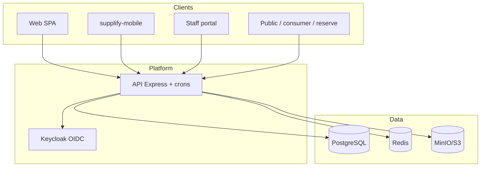
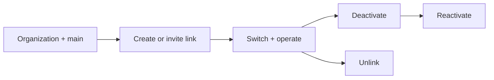

# Supplify Complete Feature and Business Logic

> **Generated:** 2026-07-20  
> **Branch:** `dev` (up to date with `origin/dev`)  
> **HEAD:** `2e270553`  
> **Scope:** Read-only audit of runtime code, schema, routes, services, jobs, frontend, and tests.  
> **Working tree honesty:** Describes committed runtime behavior **and** uncommitted local work. Uncommitted paths are labeled explicitly.

## Document conventions

| Label               | Meaning                                                 |
| ------------------- | ------------------------------------------------------- |
| **Committed**       | Present in `origin/dev` / HEAD                          |
| **Uncommitted**     | Modified or untracked in the working tree; not deployed |
| **Staged**          | None at generation (`git diff --cached` empty)          |
| **Documented only** | Claimed in docs without matching runtime path           |

**Source of truth priority:** runtime code > migrations > tests > product docs > strategy/archive docs.

### Working-tree snapshot (not deployed)

**Modified (uncommitted):** `.gitignore`, `restaurant-org.js`, `supplier-org.js`, `tenant-switch.js`, `branch-invitations-public.routes.js`, `branches.routes.js`, `inventory.routes.js`, `org.routes.js`, `org.routes.test.js`, `restaurant-org.routes.js`, `invitationTokens.js`, `warehouseInventory.js`, `App.tsx`, `BranchAccountsPanel.tsx`, `OrgOverviewPage.tsx`, `RestaurantOrgOverviewPage.tsx`, `branches.ts`, `api/index.ts`, `docs/features/restaurant-branches.md`, `docs/features/supplier-branches.md`

**Untracked:** `0191_branch_account_link_invitations.sql`, probe/verify scripts, `branch-account-billing.js`, `branch-account-link-invitations.js`, `tenant-switch.test.js`, `restaurant-org.routes.test.js`, `central-purchasing.service.js`, `org-reports.service.js`, `supplier-stock.service.js`, `CentralPurchasingPage.tsx`, `docs/branches-and-warehouses-implementation-report.md`

**Committed recently:** four-plan pricing (`0190`, commit `fc19a471`), AI reorder recommend/feedback (`0189`)

---

# 1. Executive summary

Supplify is a B2B food-supply ERP connecting **restaurants** (purchasing, receiving, inventory, recipes, finance, staff, reservations, optional B2C storefront) with **suppliers** (catalog, fulfillment, warehouses, drivers, AR, growth tools, promotions), plus a **platform admin** control plane. Auth is Keycloak OIDC; data lives in PostgreSQL; Redis caches entitlements/rate limits/sockets; MinIO/S3 stores files; crons run in-process on the API.

**Restaurant strengths:** multi-supplier cart → order → receive → inventory → invoice → dispute is end-to-end; quick lists + scheduling; recipe costing; smart reorder with real OpenAI only on restaurant explain/ask/recommend paths.

**Supplier strengths:** catalog/import, contract pricing, fulfillment board, pick waves, routes, drivers/GPS/POD, receivables/collections, customer growth (import/referral/sponsor), promotions/deals.

**Platform strengths:** four-plan Growth/Scale model with entitlements, feature/limit gates, admin overrides, impersonation, trial lock/expiry, stub+manual billing.

**Maturity:** Strong for demo and supervised pilot on core B2B order-to-cash. Not broad production-ready for live automated PSP billing, unified warehouse SoT at order deduct, or full org Branch Account lifecycle until uncommitted work is committed and migration `0191` applied.

**Biggest strengths**

1. Complete restaurant order → receive → invoice → dispute path with permissions and plan gates.
2. Supplier fulfillment + driver/GPS/POD stack with mobile sibling coverage.
3. Entitlements system (`requireFeature` / `checkLimit`) with Redis cache and admin overrides.
4. Four-plan commercial model with trial target plan mirroring (committed `0190`).

**Biggest architecture risks**

1. **Three “branch” concepts:** org Branch Accounts (tenants), legacy `tenant_account_link`, legacy restaurant `branch` locations — easy to confuse and dual-path in APIs.
2. **Dual supplier inventory:** legacy `inventory` vs `warehouse_inventory`; order deduct still hits legacy table while WH path reserves separately.
3. **In-process crons** on API replicas (mitigated by advisory locks, still operationally fragile).
4. **Billing:** stub/manual only; Stripe/Wish listed but not registered.

**Biggest incomplete workflows**

1. Branch Account link invitations, deactivate/reactivate/unlink, org billing on link — **implemented but uncommitted** (+ migration `0191`).
2. Central purchasing — **foundation only** (uncommitted).
3. Warehouse transfers — **missing**.
4. MOQ/pack enforcement at checkout — **stored, not enforced**.
5. Live payment provider recurring billing — **not ready**.

Evidence:

- `apps/api/src/server.js` — route mounts
- `apps/api/db/migrations/0190_four_plan_pricing_model.sql`
- `apps/api/src/lib/subscription/entitlements.js` — `requireFeature`, `checkLimit`
- Working tree `git status` (2026-07-20)

---

# 2. System architecture

## Applications

| App    | Path                                             | Role                                                                         |
| ------ | ------------------------------------------------ | ---------------------------------------------------------------------------- |
| API    | `apps/api`                                       | Express REST, Socket.IO, in-process crons                                    |
| Web    | `apps/web`                                       | React/Vite SPA (restaurant, supplier, admin, staff portal, consumer, public) |
| Mobile | Sibling `supplify-mobile` (not in this monorepo) | B2B ops + driver                                                             |

## Services and data

- **PostgreSQL 16** — primary SoT; migrations in `apps/api/db/migrations/` (through `0190` committed; `0191` untracked)
- **Redis** — entitlement/tenant cache, rate limits, Socket.IO adapter (in-memory fallback)
- **MinIO / S3** — object storage via `STORAGE_DRIVER`
- **Keycloak 24** — OIDC for app users; consumer B2C uses separate JWT (`CONSUMER_AUTH_SECRET`)

## Tenancy and organizations

- Workspace tenants: `restaurant` / `supplier` rows.
- **Organization Branch Accounts:** child tenants with `organization_id`, `is_main_branch`, `is_branch_active` (migrations `0082`, `0086`).
- **Legacy links:** `tenant_account_link` (`0059`) via `/api/branches`.
- **Legacy restaurant locations:** `branch` table (`0023`) for FOH/consumer/inventory scoping — **not** Branch Accounts.
- **Warehouses:** `warehouse` under a single supplier tenant — **not** Branch Accounts.
- Org children share main-branch subscription for plan/features (`org-billing-tenant.js`).

## Auth, roles, storage, jobs, providers

- Cookies: `access_token`, `refresh_token`, optional `active_tenant_token`, `impersonation_token`.
- RBAC: `permission-keys.js` + `role-matrix.js` + optional custom roles (`advanced_roles`).
- Files: `POST /api/files/presign` → PUT upload; 10 MB standard; plan `storage_mb`.
- ~20 crons via `register-cron-jobs.js` + `runCronJob` advisory locks.
- External: Keycloak, OpenAI (reorder LLM), email SMTP, WhatsApp Meta Cloud, Web Push/Expo, maps for ETA; payments stub/manual only.



Evidence: `docs/onboarding/07-technical-architecture.md`, `docker-compose.yml`, `apps/api/src/lib/register-cron-jobs.js`, `apps/api/src/lib/org-billing-tenant.js`

---

# 3. Actor and role map

| Actor                         | Access                                                    | Modify                                       | Scope                | Restrictions                        |
| ----------------------------- | --------------------------------------------------------- | -------------------------------------------- | -------------------- | ----------------------------------- |
| Restaurant Owner              | Full restaurant workspace                                 | All (billing, roles, invites)                | Tenant; org if Owner | Billing lock → read-only/402        |
| Restaurant Manager            | Orders, receiving, inventory, recipes, reservations (ops) | Ops writes; not billing/roles                | Tenant               | Per `role-matrix.js`                |
| Purchaser                     | Catalog, orders, chat, recipes view/edit                  | Create/edit orders                           | Tenant               | No receiving manage / billing       |
| Receiving Staff               | Orders view + receiving                                   | Receive, open disputes                       | Tenant               | No order create                     |
| Accountant                    | Invoices, payments, order view, recipe costs              | Finance writes                               | Tenant               | No catalog/fulfillment admin        |
| Viewer                        | All `*_VIEW` for restaurant                               | None                                         | Tenant               | Read-only                           |
| FOH Staff                     | Reservations (+ recipes view)                             | Reservation CRUD                             | Tenant               | No billing                          |
| Supplier Owner                | Full supplier workspace                                   | All                                          | Tenant / org         | Same lock rules                     |
| Supplier Manager              | Orders, catalog, fulfillment                              | Ops; not billing                             | Tenant               | —                                   |
| Fulfillment / warehouse staff | Fulfillment, warehouses (by perm)                         | Pick/pack/dispatch                           | Tenant + warehouse   | Plan `fulfillment` / `warehouses`   |
| Driver                        | Assigned deliveries, POD, GPS                             | Delivery status, location                    | Assignment-scoped    | `DRIVER_DELIVERIES_*`               |
| Org Owner                     | All org branches                                          | Create/deactivate/unlink (uncommitted paths) | Organization         | `multi_branch`                      |
| Org Manager                   | All branches (view/ops per type)                          | Limited; no create                           | Organization         | —                                   |
| Org Viewer                    | Read org                                                  | None                                         | Organization         | —                                   |
| Regional Manager              | Assigned branches only                                    | Within assignment                            | Org + assigned       | —                                   |
| Platform admin                | Admin dashboard                                           | Plans, tenants, impersonation, unlock        | Cross-tenant         | Impersonation respects billing lock |
| Public guest                  | Reserve, public catalog, consumer storefront              | Book / place consumer order                  | Slug-scoped          | No Keycloak                         |
| Staff portal user             | Self schedule/PTO/clock                                   | Self only                                    | `STAFF_PORTAL`       | Blocked from main app APIs          |
| Consumer member               | B2C order/loyalty                                         | Own orders                                   | Restaurant slug      | Separate JWT                        |

Evidence: `apps/api/src/lib/role-matrix.js`, `apps/api/src/lib/permission-keys.js`, `apps/api/src/lib/restaurant-org.js`, `apps/api/src/lib/supplier-org.js`, `apps/api/src/middlewares/billingAccess.js`

---

# 4. Complete feature inventory

| ID              | Domain        | Feature                              | Tenant type | Status                   | Primary actors        | Plan gate                 | Main files                                                   |
| --------------- | ------------- | ------------------------------------ | ----------- | ------------------------ | --------------------- | ------------------------- | ------------------------------------------------------------ |
| AUTH-001        | Auth          | Keycloak OIDC login                  | Both        | Complete                 | All                   | —                         | `auth.routes.js`                                             |
| AUTH-002        | Auth          | Registration + tenant complete       | Both        | Complete                 | New users             | pending_activation        | `register.routes.js`, `register-account.js`                  |
| AUTH-003        | Auth          | Logout                               | Both        | Complete                 | Users                 | —                         | `auth.routes.js`                                             |
| AUTH-004        | Auth          | Token refresh (web/mobile)           | Both        | Complete                 | Clients               | —                         | `auth.routes.js`                                             |
| AUTH-005        | Auth          | Session / `/auth/me`                 | Both        | Complete                 | Users                 | —                         | `auth.routes.js`                                             |
| AUTH-006        | Auth          | Password reset                       | Public      | Complete                 | Users                 | —                         | Keycloak only                                                |
| AUTH-007        | Auth          | Email verification                   | Public      | Complete                 | Users                 | —                         | Keycloak only                                                |
| AUTH-008        | Auth          | Legal acceptance                     | Both        | Complete                 | Users                 | —                         | `auth.routes.js`                                             |
| AUTH-009        | Auth          | RBAC + system roles                  | Both        | Complete                 | Team                  | —                         | `rbac.js`, `role-matrix.js`                                  |
| AUTH-010        | Auth          | Custom roles                         | Both        | Complete                 | Owner                 | `advanced_roles`          | `tenant-roles.routes.js`                                     |
| AUTH-011        | Auth          | Viewer / Accountant                  | Both        | Complete                 | Team                  | —                         | `role-matrix.js`                                             |
| AUTH-012        | Auth          | Admin impersonation                  | Admin       | Complete                 | Admin                 | —                         | `impersonation.js`                                           |
| AUTH-013        | Auth          | Tenant switch cookie                 | Both        | Complete                 | Multi-tenant users    | —                         | `tenant-switch.js`                                           |
| AUTH-014        | Auth          | Billing lock / trial expiry          | Both        | Complete                 | Locked tenants        | free/trial                | `billingAccess.js`                                           |
| ORG-001         | Org           | Restaurant organizations             | Restaurant  | Complete                 | Org roles             | `multi_branch`            | `restaurant-org.js`, `0086`                                  |
| ORG-002         | Org           | Supplier organizations               | Supplier    | Complete                 | Org roles             | `multi_branch`            | `supplier-org.js`, `0082`                                    |
| ORG-003         | Org           | Create Branch Account                | Both        | Complete                 | Org Owner             | `multi_branch` + branches | org / restaurant-org routes                                  |
| ORG-004         | Org           | Link invitations                     | Both        | Complete but uncommitted | Org Owner             | `multi_branch`            | `0191`, `branch-account-link-invitations.js`                 |
| ORG-005         | Org           | Accept link invitation               | Both        | Complete but uncommitted | Target Owner          | —                         | public invitation routes                                     |
| ORG-006         | Org           | Reject link invitation               | Both        | Partial                  | Target                | —                         | lib exists; HTTP reject route unclear                        |
| ORG-007         | Org           | Deactivate / reactivate              | Both        | Complete but uncommitted | Org Owner             | branches on reactivate    | org routes                                                   |
| ORG-008         | Org           | Unlink Branch Account                | Both        | Complete but uncommitted | Org Owner             | independent sub required  | `branch-account-billing.js`                                  |
| ORG-009         | Org           | Org billing ownership                | Both        | Complete but uncommitted | System                | —                         | `branch-account-billing.js`, `org-billing-tenant.js`         |
| ORG-010         | Org           | Org roles / regional managers        | Both        | Complete                 | Org Owner             | —                         | org libs                                                     |
| ORG-011         | Org           | Consolidated org reports             | Both        | Complete but uncommitted | Org members           | —                         | `org-reports.service.js`                                     |
| ORG-012         | Org           | Central purchasing                   | Restaurant  | Foundation only          | Org Owner             | `central_purchasing`      | `central-purchasing.service.js`, `CentralPurchasingPage.tsx` |
| ORG-013         | Org           | Legacy `tenant_account_link`         | Both        | Legacy                   | Owner                 | branches                  | `linked-accounts.js`, `/api/branches`                        |
| ORG-014         | Org           | Legacy restaurant `branch` locations | Restaurant  | Complete                 | Ops / consumer        | —                         | `0023`, consumer routes                                      |
| ORG-015         | Org           | Branch comparison UI                 | Both        | Mostly complete          | Org Owner             | —                         | Org overview pages                                           |
| REST-ORDER-001  | Ordering      | Supplier discovery / search          | Restaurant  | Complete                 | Purchaser             | —                         | `search.routes.js`, suppliers                                |
| REST-ORDER-002  | Ordering      | Follow / unfollow / block            | Restaurant  | Complete                 | Purchaser             | follow limits             | `relationships.js`                                           |
| REST-ORDER-003  | Ordering      | Connection requests                  | Both        | Complete                 | Sales / Purchaser     | —                         | growth + restaurant connection routes                        |
| REST-ORDER-004  | Ordering      | Catalog browse + variants            | Both        | Complete                 | Purchaser             | —                         | `products.routes.js`                                         |
| REST-ORDER-005  | Ordering      | Customer-specific pricing            | Both        | Complete                 | Sales / Purchaser     | —                         | `restaurant-pricing.routes.js`                               |
| REST-ORDER-006  | Ordering      | Cart (client)                        | Restaurant  | Complete                 | Purchaser             | —                         | `CartPage.tsx`, cart Redux                                   |
| REST-ORDER-007  | Ordering      | Multi-supplier checkout              | Restaurant  | Complete                 | Purchaser             | `orders_per_day`          | `orders/create.js`                                           |
| REST-ORDER-008  | Ordering      | Order cancel / decline               | Both        | Complete                 | Purchaser / Supplier  | —                         | `orders/update.js`                                           |
| REST-ORDER-009  | Ordering      | Standing = scheduled quick lists     | Restaurant  | Complete                 | Purchaser             | `quick_lists`             | `scheduled-orders.service.js`                                |
| REST-ORDER-010  | Ordering      | Quick lists CRUD                     | Restaurant  | Complete                 | Purchaser             | `quick_lists`             | `quick-lists.routes.js`                                      |
| REST-ORDER-011  | Ordering      | Order calendar                       | Both        | Complete                 | Ops                   | `order_calendar`          | `orders.calendar.routes.js`                                  |
| REST-ORDER-012  | Ordering      | Amendments                           | Both        | Complete                 | Manager               | `order_amendments`        | `order-amendments.routes.js`                                 |
| REST-ORDER-013  | Ordering      | One-click reorder from history       | Restaurant  | Partial                  | Purchaser             | —                         | via quick lists / assistance only                            |
| REST-ORDER-014  | Ordering      | Substitutions                        | Both        | Complete                 | Supplier / Restaurant | `order_amendments`        | substitutes + amendments                                     |
| REST-ORDER-015  | Ordering      | Quote requests                       | Restaurant  | Complete                 | Purchaser             | —                         | `quote-requests.routes.js`                                   |
| REST-ORDER-016  | Ordering      | MOQ display                          | Both        | Complete                 | Purchaser             | —                         | `product_inventory_settings`                                 |
| REST-ORDER-017  | Ordering      | MOQ enforce at checkout              | Restaurant  | Partial                  | Purchaser             | —                         | not in order create                                          |
| REST-RECV-001   | Receiving     | Receive goods                        | Restaurant  | Complete                 | Receiving             | `receiving_quality`       | `receiving.routes.js`                                        |
| REST-RECV-002   | Receiving     | Partial / full / quality             | Restaurant  | Complete                 | Receiving             | `receiving_quality`       | `0016`                                                       |
| REST-RECV-003   | Receiving     | Receiving photos                     | Restaurant  | Partial                  | Receiving             | —                         | dispute attachments only                                     |
| REST-RECV-004   | Receiving     | Auto invoice + inventory             | Restaurant  | Complete                 | System                | `finance_invoices`        | receiving + invoice.service                                  |
| REST-INV-001    | Inventory     | Restaurant inventory CRUD            | Restaurant  | Complete                 | Clerk                 | `inventory_management`    | `restaurant-inventory.routes.js`                             |
| REST-INV-002    | Inventory     | Import CSV                           | Restaurant  | Complete                 | Clerk                 | SKU limit                 | import service                                               |
| REST-INV-003    | Inventory     | Adjustments / movements              | Restaurant  | Complete                 | Clerk                 | —                         | adjust + history                                             |
| REST-INV-004    | Inventory     | Min stock / low stock                | Restaurant  | Complete                 | Clerk                 | —                         | `low_stock_threshold`                                        |
| REST-INV-005    | Inventory     | Max stock                            | Restaurant  | Partial                  | —                     | —                         | column exists; no API/UI                                     |
| REST-INV-006    | Inventory     | Expiry lots                          | Restaurant  | Complete                 | Clerk                 | —                         | `0133`, expiry service                                       |
| REST-INV-007    | Inventory     | Waste analytics                      | Restaurant  | Complete                 | Manager               | `waste_tracking`          | waste endpoints                                              |
| REST-INV-008    | Inventory     | Stock counts sessions                | Restaurant  | Partial                  | Clerk                 | —                         | COUNT_CORRECTION only                                        |
| REST-INV-009    | Inventory     | Cross-branch transfer                | Restaurant  | Partial                  | —                     | —                         | branch_id only; no transfer                                  |
| REST-INV-010    | Inventory     | Valuation report                     | Restaurant  | Partial                  | —                     | —                         | waste cost only                                              |
| REST-RECIPE-001 | Recipes       | Recipe CRUD + costing                | Restaurant  | Complete                 | Chef / Manager        | `recipe_costing`          | recipes + cost engine                                        |
| REST-RECIPE-002 | Recipes       | Recalc queue / price impact          | Restaurant  | Complete                 | Manager               | `recipe_costing`          | `0186`, jobs                                                 |
| REST-RECIPE-003 | Recipes       | Menu/POS margin link                 | Restaurant  | Partial                  | —                     | —                         | consumer menu separate                                       |
| SUP-CAT-001     | Catalog       | Product CRUD                         | Supplier    | Complete                 | Catalog               | SKU limit                 | `products.routes.js`                                         |
| SUP-CAT-002     | Catalog       | Import + image ZIP                   | Supplier    | Complete                 | Catalog               | `storage_mb`              | supplier-ops                                                 |
| SUP-CAT-003     | Catalog       | Prices + contract pricing            | Both        | Complete                 | Sales                 | —                         | prices + restaurant-pricing                                  |
| SUP-CAT-004     | Catalog       | Public mini-store                    | Public      | Complete                 | Guest                 | —                         | `public.routes.js`                                           |
| SUP-CAT-005     | Catalog       | Favorites                            | Restaurant  | Complete                 | Purchaser             | —                         | product favorites                                            |
| SUP-GROWTH-001  | Growth        | Customer import                      | Supplier    | Complete                 | Sales                 | `supplier_growth`         | supplier-growth routes                                       |
| SUP-GROWTH-002  | Growth        | Referral                             | Supplier    | Complete                 | Sales                 | `supplier_growth`         | growth services                                              |
| SUP-GROWTH-003  | Growth        | Sponsorship                          | Supplier    | Complete                 | Sales                 | `supplier_growth`         | sponsorship limits                                           |
| SUP-GROWTH-004  | Growth        | At-risk / reorder intel              | Supplier    | Complete                 | Sales                 | `smart_reorder`           | cadence + intelligence                                       |
| SUP-FULFILL-001 | Fulfillment   | Acknowledge / process / ship         | Supplier    | Complete                 | Ops                   | —                         | `orders/update.js`                                           |
| SUP-FULFILL-002 | Fulfillment   | Pick waves                           | Supplier    | Complete                 | Warehouse             | `fulfillment`             | `fulfillment/waves.js`                                       |
| SUP-FULFILL-003 | Fulfillment   | Exceptions / issues                  | Supplier    | Complete                 | Dispatcher            | `fulfillment`             | exceptions + issues                                          |
| SUP-FULFILL-004 | Fulfillment   | Warehouse assignment                 | Supplier    | Complete                 | System                | `warehouses`              | warehouse routing                                            |
| SUP-FULFILL-005 | Fulfillment   | Command center / run sheet           | Supplier    | Complete                 | Ops                   | mixed                     | supplier-ops                                                 |
| SUP-DELIV-001   | Delivery      | Driver assign / status               | Supplier    | Complete                 | Dispatcher            | `driver_management`       | orders-driver                                                |
| SUP-DELIV-002   | Delivery      | Routes / optimize                    | Supplier    | Complete                 | Dispatcher            | `fulfillment`             | fulfillment/routes                                           |
| SUP-DELIV-003   | Delivery      | POD                                  | Driver      | Complete                 | Driver                | —                         | orders-driver                                                |
| SUP-DELIV-004   | Delivery      | GPS + stale alerts                   | Driver      | Complete                 | Driver / System       | env flags                 | driver-location + job                                        |
| SUP-DELIV-005   | Delivery      | Rollover manual / cron               | Supplier    | Partial                  | Dispatcher            | —                         | cron off by default                                          |
| SUP-DELIV-006   | Delivery      | Restaurant live track                | Restaurant  | Partial                  | Purchaser             | env flag                  | tracking payload                                             |
| WH-001          | Warehouses    | Warehouse CRUD                       | Supplier    | Complete                 | Owner                 | `warehouses`              | warehouses.routes                                            |
| WH-002          | Warehouses    | Zones + routing rules                | Supplier    | Complete                 | Owner                 | `multi_warehouse`         | warehouses.routes                                            |
| WH-003          | Warehouses    | warehouse_inventory                  | Supplier    | Complete                 | Staff                 | —                         | warehouseInventory.js                                        |
| WH-004          | Warehouses    | Legacy inventory + deduct            | Supplier    | Partial                  | System                | —                         | supplier-inventory.service                                   |
| WH-005          | Warehouses    | Display overlay dual stock           | Supplier    | Complete but uncommitted | Staff                 | —                         | supplier-stock.service.js                                    |
| WH-006          | Warehouses    | Transfers                            | Supplier    | Planned                  | —                     | —                         | no routes                                                    |
| WH-007          | Warehouses    | Fail-closed reserve                  | Supplier    | Complete but uncommitted | System                | —                         | warehouseInventory.js diff                                   |
| FIN-001         | Finance       | Invoices lifecycle                   | Both        | Complete                 | Accountant            | `finance_invoices`        | invoices.routes                                              |
| FIN-002         | Finance       | Restaurant payables / pay            | Restaurant  | Complete                 | Accountant            | `finance_invoices`        | restaurant-finance                                           |
| FIN-003         | Finance       | Payments / partial                   | Both        | Complete                 | Accountant            | —                         | payments.routes                                              |
| FIN-004         | Finance       | Credit notes                         | Both        | Complete                 | Accountant            | `disputes_returns`        | credit-notes                                                 |
| FIN-005         | Finance       | Receivables / aging / export         | Supplier    | Complete                 | Accountant            | `finance_invoices`        | supplier-ops                                                 |
| FIN-006         | Finance       | Collections / overdue jobs           | Supplier    | Complete                 | System                | —                         | jobs + services                                              |
| FIN-007         | Finance       | Refunds (PSP)                        | Both        | Partial                  | —                     | —                         | resolution type; offline                                     |
| FIN-008         | Finance       | Taxes / discounts / fees             | Both        | Mostly complete          | System                | —                         | order/invoice calc                                           |
| DISP-001        | Disputes      | Create / lifecycle                   | Both        | Complete                 | Receiving / Ops       | `disputes_returns`        | disputes.routes                                              |
| DISP-002        | Disputes      | Credit / replacement / refund        | Both        | Complete                 | Ops                   | —                         | disputes.service                                             |
| DISP-003        | Disputes      | Evidence attachments                 | Both        | Complete                 | Users                 | —                         | dispute_attachments                                          |
| PROMO-001       | Promotions    | Supplier promotions CRUD             | Supplier    | Complete                 | Marketing             | `promotions`              | promotions/supplier                                          |
| PROMO-002       | Promotions    | Deals browse / redeem                | Restaurant  | Complete                 | Purchaser             | `supplier_deals*`         | promotions/restaurant                                        |
| PROMO-003       | Promotions    | Deal boosts                          | Supplier    | Partial                  | Marketing             | —                         | boost packages                                               |
| PROMO-004       | Promotions    | Admin deal moderation                | Admin       | Complete                 | Admin                 | —                         | admin deals                                                  |
| PROMO-005       | Promotions    | Loyalty B2B / B2C                    | Both        | Mostly complete          | Sales / Guest         | —                         | loyalty.routes                                               |
| STAFF-001       | Staff         | Team / schedule / PTO / swaps        | Restaurant  | Mostly complete          | Manager               | RBAC only                 | `/api/staff`                                                 |
| STAFF-002       | Staff         | Clock in/out                         | Restaurant  | Complete                 | Staff                 | —                         | time-entries                                                 |
| STAFF-003       | Staff         | Announcements / docs                 | Restaurant  | Complete                 | Manager               | —                         | staff routes                                                 |
| STAFF-004       | Staff         | Staff portal                         | Staff       | Complete                 | Staff                 | —                         | staff self + Keycloak                                        |
| STAFF-005       | Staff         | Legacy magic link                    | Staff       | Legacy                   | Staff                 | —                         | public staff                                                 |
| STAFF-006       | Staff         | Labour / payroll preview             | Restaurant  | Complete                 | Manager               | —                         | staff reports                                                |
| RES-001         | Reservations  | Board + tables                       | Restaurant  | Complete                 | FOH                   | RBAC                      | reservations.routes                                          |
| RES-002         | Reservations  | Public book / manage                 | Public      | Complete                 | Guest                 | —                         | public reservations                                          |
| RES-003         | Reservations  | Waitlist + auto-promo                | Restaurant  | Complete                 | FOH                   | `waitlist_auto_promo`     | waitlistPromotion.js                                         |
| RES-004         | Reservations  | Analytics                            | Restaurant  | Complete                 | Manager               | —                         | reservations analytics                                       |
| MSG-001         | Chat          | Conversations + Socket.IO            | Both        | Complete                 | Users                 | `chat`                    | chat routes                                                  |
| MSG-002         | Chat          | Attachments + read                   | Both        | Complete                 | Users                 | `chat`                    | chat helpers                                                 |
| MSG-003         | Chat          | Support chat                         | Both        | Complete                 | Users / Admin         | —                         | `0149`                                                       |
| NOTIF-001       | Notifications | In-app                               | Both        | Complete                 | Users                 | `notifications`           | notifications.routes                                         |
| NOTIF-002       | Notifications | Email + digest + retry               | Both        | Complete                 | System                | —                         | email jobs                                                   |
| NOTIF-003       | Notifications | Push (web/Expo)                      | Both        | Complete                 | Users                 | `push_notifications`      | push.routes                                                  |
| NOTIF-004       | Notifications | WhatsApp                             | Both        | Complete                 | System                | env                       | whatsapp.service                                             |
| NOTIF-005       | Notifications | Webhooks                             | Both        | Complete                 | Owner                 | integrations              | notification webhook                                         |
| NOTIF-006       | Notifications | Preferences                          | Both        | Complete                 | Users                 | —                         | preferences API                                              |
| REPORT-001      | Reports       | Global reports hub                   | Both        | Complete                 | Manager               | `reports`                 | reports.routes                                               |
| REPORT-002      | Reports       | Dashboard widgets                    | Both        | Mostly complete          | Users                 | —                         | DashboardPage                                                |
| REPORT-003      | Reports       | Org consolidated                     | Both        | Complete but uncommitted | Org                   | —                         | org-reports                                                  |
| BILL-001        | Billing       | Plans Growth/Scale                   | Both        | Complete                 | Owner                 | —                         | `0190`, plan-codes                                           |
| BILL-002        | Billing       | Entitlements / usage                 | Both        | Complete                 | Owner                 | —                         | entitlements.js                                              |
| BILL-003        | Billing       | Trial + target plan                  | Both        | Complete                 | Owner                 | free                      | free-trial-plan-features                                     |
| BILL-004        | Billing       | Checkout stub/manual                 | Both        | Complete                 | Owner                 | —                         | billing.routes                                               |
| BILL-005        | Billing       | Live PSP Stripe/Wish                 | Both        | Planned                  | —                     | —                         | not registered                                               |
| BILL-006        | Billing       | Add-ons                              | Both        | Complete                 | Admin                 | gold/platinum             | subscription-addons                                          |
| BILL-007        | Billing       | Lock / grace / unlock                | Both        | Complete                 | System / Admin        | —                         | billing-service                                              |
| BILL-008        | Billing       | Feature/limit gates                  | Both        | Complete                 | System                | —                         | requireFeature                                               |
| AI-001          | AI            | Smart reorder heuristics             | Restaurant  | Complete                 | Purchaser             | `smart_reorder`           | reorder-assistance                                           |
| AI-002          | AI            | Deterministic forecast               | Restaurant  | Complete                 | Purchaser             | forecast tier             | reorder-forecast                                             |
| AI-003          | AI            | Explain (LLM/heuristic)              | Restaurant  | Complete                 | Purchaser             | `ai_platform`             | reorder-ai.service                                           |
| AI-004          | AI            | Ask AI (LLM/keyword)                 | Restaurant  | Complete                 | Purchaser             | Scale seasonality         | reorder-ai.service                                           |
| AI-005          | AI            | AI recommend batch                   | Restaurant  | Complete                 | Purchaser             | forecast + AI             | fc19a471                                                     |
| AI-006          | AI            | Feedback                             | Restaurant  | Complete                 | Purchaser             | —                         | `0189`                                                       |
| AI-007          | AI            | Quick list “AI”                      | Restaurant  | Complete                 | Purchaser             | Scale automation          | quick-list-ai (no LLM)                                       |
| AI-008          | AI            | Supplier smart reorder               | Supplier    | Complete                 | Sales                 | `smart_reorder`           | heuristics only; no LLM                                      |
| AI-009          | AI            | AI metering / fallback               | Restaurant  | Complete                 | System                | `ai_requests_per_day`     | ai-platform.js                                               |
| ADMIN-001       | Admin         | Tenants / plans / limits             | Admin       | Complete                 | Admin                 | —                         | admin-dashboard/\*                                           |
| ADMIN-002       | Admin         | Feature flags                        | Admin       | Complete                 | Admin                 | —                         | features.js                                                  |
| ADMIN-003       | Admin         | Impersonation + audit                | Admin       | Complete                 | Admin                 | —                         | audit.js                                                     |
| ADMIN-004       | Admin         | Health / finance overview            | Admin       | Complete                 | Admin                 | —                         | health.js, finance.js                                        |
| ADMIN-005       | Admin         | Legacy `/api/admin`                  | Admin       | Legacy                   | Admin                 | —                         | admin.routes.js                                              |
| FILE-001        | Files         | Presign upload / download            | Both        | Complete                 | Users                 | `storage_mb`              | files.routes                                                 |
| FILE-002        | Files         | ClamAV scan                          | Both        | Planned                  | —                     | —                         | TODO in storage providers                                    |
| INFRA-001       | Infra         | Postgres / Redis / MinIO / KC        | System      | Complete                 | DevOps                | —                         | docker-compose                                               |
| INFRA-002       | Infra         | Cron registry + locks                | System      | Complete                 | DevOps                | —                         | cron-runner                                                  |
| INFRA-003       | Infra         | Health / ready                       | System      | Complete                 | Ops                   | —                         | `/health`, `/ready`                                          |
| INFRA-004       | Infra         | Tenant audit log                     | Both        | Complete                 | Owner                 | `tenant_audit_log`        | tenant-audit                                                 |
| CONS-001        | Consumer      | B2C storefront / menu / order        | Consumer    | Complete                 | Guest                 | setup                     | consumer routes                                              |
| CONS-002        | Consumer      | Track / loyalty / reviews            | Consumer    | Complete                 | Guest                 | —                         | consumer + loyalty                                           |
| CONS-003        | Consumer      | Restaurant consumer admin            | Restaurant  | Complete                 | Manager               | —                         | `/app/consumer-*`                                            |
| MOBILE-001      | Mobile        | B2B + driver mobile                  | Both        | Partial                  | Ops                   | —                         | supplify-mobile                                              |
| MOBILE-002      | Mobile        | Staff / reservations / reports       | —           | Frontend only            | —                     | —                         | web-only documented                                          |

**Inventory count:** 148 features in master table.

---

# 5. Detailed feature specifications

> Template applied per feature. Closely related items share abbreviated repeated fields where identical. Status distinguishes committed vs uncommitted.

## `[AUTH-001]` Keycloak OIDC login

### Purpose

Authenticate users into Supplify via Keycloak authorization code flow.

### Users

All platform app users (not consumer B2C).

### Availability

Restaurant, supplier, admin, staff (realm roles). No plan gate. Available on trial.

### User entry points

`/auth/login` → Keycloak → `/auth/callback`. Web login page.

### API surface

| Method | Route            | Purpose                    | Auth   | Permission |
| ------ | ---------------- | -------------------------- | ------ | ---------- |
| GET    | `/auth/login`    | Start OIDC                 | No     | —          |
| GET    | `/auth/callback` | Exchange code, set cookies | No     | —          |
| GET    | `/auth/session`  | Probe session              | Cookie | —          |
| GET    | `/auth/me`       | Current user + workspace   | Cookie | —          |

### Database model

`app_user` (upsert on login); session store for OAuth state (`0007_session_store.sql`).

### Business rules

1. New Keycloak users get `app_user.role = PENDING` until tenant registration completes.
2. Access/refresh tokens stored as HttpOnly cookies (~1h / ~7d).
3. Registration clears impersonation and active-tenant cookies.

### Workflow

Login → Keycloak → callback → `upsertUser` → cookies → app shell loads `/auth/me`.

### Status lifecycle

N/A (session present/absent).

### Calculations

N/A.

### Permissions and data isolation

`requireAuth` validates JWT; tenant context from membership + active tenant cookie.

### Side effects

User upsert; optional Keycloak realm role assignment async after signup.

### Failure and edge cases

Invalid state; expired code; Keycloak down → login failure. No app-level password API.

### Frontend behavior

Redirect to Keycloak; loading until `/auth/me`; locked tenants redirected to activation/billing per `billingActivationRedirect`.

### Tests

`auth.routes.test.js`, `auth.test.js`, `mobile-auth.test.js`.

### Implementation status

Complete.

### Known issues

Password reset/email verify are Keycloak-only (AUTH-006/007).

### Enhancement opportunities

App-branded password reset UX wrapping Keycloak; clearer PENDING → registered funnel analytics.

### Source evidence

- `apps/api/src/routes/auth.routes.js` — login/callback/session/me
- `apps/api/src/lib/auth.js`, `apps/api/src/lib/rbac.js` — `upsertUser`
- `docs/onboarding/09-authentication-rbac.md`

---

## `[AUTH-002]` Registration and tenant activation

### Purpose

Create restaurant or supplier tenant after Keycloak identity exists.

### Users

New registrants.

### Availability

Public → PENDING → tenant type. New tenants get pending activation subscription (locked until checkout/admin unlock).

### User entry points

`/auth/register`, register complete pages, `/api/register/complete`.

### API surface

| Method | Route                    | Purpose                      | Auth | Permission   |
| ------ | ------------------------ | ---------------------------- | ---- | ------------ |
| POST   | `/api/register/complete` | Create tenant + subscription | Auth | PENDING user |

### Database model

`restaurant` or `supplier`; `subscription` with `account_locked_at` + `pending_activation`; org/main branch seed; owner role.

### Business rules

1. Legal acceptance required.
2. `createPendingActivationSubscription` locks account until paid activation or admin unlock.
3. Keycloak realm roles assigned async.

### Workflow

Keycloak register → PENDING → complete tenant type → locked free subscription → checkout or admin unlock.

### Implementation status

Complete.

### Source evidence

- `apps/api/src/lib/register-account.js` — `completeTenantRegistration`
- `apps/api/src/lib/billing/subscription-activation.js`

---

## `[AUTH-003]`–`[AUTH-008]` Session, logout, refresh, password, email, legal

| ID       | Purpose                           | Status                   | Evidence                                     |
| -------- | --------------------------------- | ------------------------ | -------------------------------------------- |
| AUTH-003 | Logout app + Keycloak end-session | Complete                 | `GET/POST /auth/logout`                      |
| AUTH-004 | Refresh tokens web + mobile JSON  | Complete                 | `POST /auth/refresh`, `/auth/mobile/refresh` |
| AUTH-005 | Session probe                     | Complete                 | `GET /auth/session`                          |
| AUTH-006 | Password reset                    | Complete (Keycloak-only) | No Supplify API; admin can `reset-password`  |
| AUTH-007 | Email verification                | Complete (Keycloak-only) | Admin-created users may set verified         |
| AUTH-008 | Legal re-accept                   | Complete                 | auth + register routes                       |

**Business rules (shared):** refresh rotates cookies; mobile uses JSON body; legal gates app until accepted.

**Implementation status:** Complete (AUTH-006/007 externalized to Keycloak).

---

## `[AUTH-009]`–`[AUTH-011]` RBAC, custom roles, Viewer/Accountant

### Purpose

Authorize actions inside a tenant workspace.

### Users

Owners assign roles; all members subject to permissions.

### Availability

System roles always. Custom roles require `advanced_roles` (Scale+).

### API surface

`/api/roles` CRUD + assign — `tenant-roles.routes.js`.

### Business rules

1. 52 permission keys in `permission-keys.js`.
2. Viewer = all `*_VIEW` only.
3. Accountant = invoices/payments/orders view (+ recipe costs for restaurant).
4. Seat limits via `assertTenantUserSeatAvailable`.

### Implementation status

Complete.

### Source evidence

`role-matrix.js`, `rbac.js` `requirePermission`, `tenant-roles.routes.js`, `viewer-permissions.js`

---

## `[AUTH-012]` Admin impersonation

### Purpose

Platform admin views tenant as that tenant’s user for support.

### Business rules

1. Signed `impersonation_token` cookie.
2. Admin bypasses billing lock; **impersonating** session does not.
3. Billing mutations blocked under impersonation guards.

### Implementation status

Complete.

### Source evidence

`impersonation.js`, `admin-dashboard/audit.js`, `impersonation-guards.js`

---

## `[AUTH-013]` Tenant / organization switching

### Purpose

Switch active operating tenant among accessible Branch Accounts / linked accounts.

### API

`POST /api/org/context/switch`, `POST /api/restaurant-org/context/switch`, `POST /api/branches/switch`.

### Business rules

1. Cookie `active_tenant_token` (JWT ~30d).
2. Access via direct roles, workspace membership, `tenant_account_link`, or org role + assignment.
3. **Uncommitted:** deactivated Branch Accounts denied (`isTenantBranchActive`).

### Implementation status

Complete (deactivation guards Complete but uncommitted).

### Source evidence

`tenant-switch.js` (modified uncommitted), org routes

---

## `[AUTH-014]` Trial expiry and account locking

### Purpose

Prevent unpaid/expired tenants from mutating data.

### Business rules

1. Lock reasons: `pending_activation`, `free_sandbox_expired`.
2. Locked: writes → 402; GET often allowed; sensitive GETs (reports, invoice PDF, exports) blocked.
3. Jobs use `isTenantUnlockedForBackgroundWrites`.
4. Grace period 7 days for billing past-due paths.

### Implementation status

Complete.

### Source evidence

`billingAccess.js`, `free-sandbox-expiry.job.js`, `billing/constants.js`

---

## `[ORG-001]`–`[ORG-015]` Organizations and Branch Accounts

### Purpose

Multi-location companies as **separate tenants** under one organization, with shared billing to main branch.

### Critical distinction

| Concept         | What                                   | Not                        |
| --------------- | -------------------------------------- | -------------------------- |
| Branch Account  | Full restaurant/supplier tenant in org | Warehouse; legacy location |
| Legacy link     | `tenant_account_link`                  | Org model                  |
| Legacy `branch` | Location inside one restaurant         | Branch Account             |
| Warehouse       | Supplier inventory location            | Branch Account             |

### Availability

`multi_branch` feature; branch limit Growth=1 / Scale=3 (+ add-ons). Restaurant Scale sets `multi_branch: central_purchasing`.

### API surface (org)

| Method                            | Route                       | Purpose                                |
| --------------------------------- | --------------------------- | -------------------------------------- |
| GET/POST                          | `/api/org/branches`         | List/create supplier Branch Accounts   |
| DELETE / POST reactivate / unlink | `/api/org/branches/:id`     | Lifecycle (**uncommitted**)            |
| GET/POST                          | `/api/org/link-invitations` | Link invites (**uncommitted**)         |
| GET                               | `/api/org/reports/overview` | Consolidated KPIs (**uncommitted**)    |
| \*                                | `/api/restaurant-org/*`     | Restaurant mirror + central purchasing |

### Business rules

1. Main Branch Account cannot deactivate/unlink.
2. Deactivate blocked if pending orders.
3. Create serializes on main branch `FOR UPDATE`.
4. Link target must be standalone (`organization_id IS NULL`).
5. On link: suspend child subscription; bill via main (`applyOrgBillingOnLink`) — **uncommitted**.
6. Unlink requires independent subscription — **uncommitted**.
7. Plan count = active org tenants OR `1 + tenant_account_link`.

### Workflow (Branch Account lifecycle)



### Implementation status

- Org create/list/switch: Complete (committed baseline `0082`/`0086`).
- Link invitations, deactivate/reactivate/unlink, billing on link, org reports, central purchasing UI/API: **Complete but uncommitted** / Foundation (CP).
- Reject invitation HTTP: Partial/Unclear.
- Legacy `/api/branches`: Legacy (still live).

### Known issues

Dual APIs; dual linkage possible on supplier create path; `0191` not applied to DBs until migrated.

### Source evidence

`0082`, `0086`, `0059`, `0023`, untracked `0191`, `branch-account-link-invitations.js`, `branch-account-billing.js`, `central-purchasing.service.js`, `org-reports.service.js`, `docs/features/restaurant-branches.md` (modified)

---

## `[REST-ORDER-001]`–`[REST-ORDER-017]` Restaurant purchasing

### Purpose

Discover suppliers, price, cart, place and track orders, schedule reorders, amend.

### Order status lifecycle

| Current      | Allowed next            | Actor                 | Conditions           | Side effects        |
| ------------ | ----------------------- | --------------------- | -------------------- | ------------------- |
| DRAFT        | PLACED, CANCELLED       | Restaurant            | —                    | —                   |
| PLACED       | ACKNOWLEDGED, CANCELLED | Supplier / Restaurant | Decline needs reason | Notify; stock paths |
| ACKNOWLEDGED | PROCESSING, CANCELLED   | Supplier              | —                    | —                   |
| PROCESSING   | SHIPPED, CANCELLED      | Supplier              | —                    | Waves/routes        |
| SHIPPED      | DELIVERED               | Driver/Supplier       | —                    | POD                 |
| DELIVERED    | RECEIVED\_\*            | Restaurant            | Receiving            | Invoice, inventory  |
| RECEIVED\_\* | INVOICED / COMPLETED    | System                | —                    | Finance             |
| \*           | CANCELLED               | Early stages          | Restores stock       | Releases routes     |

Legacy `PENDING_APPROVAL` unstuck by migration `0118` (approvals removed).

### Business rules (ordering)

1. One `customer_order` per supplier per checkout.
2. Price resolution: contract → catalog → promotions on subtotal.
3. Daily `orders_per_day` limit.
4. Product detail requires follow or prior order; list not fully follow-gated.
5. Amendments only in PLACED / ACKNOWLEDGED / PROCESSING (and legacy pending).
6. Standing orders = scheduled quick lists (no `standing_order` table).
7. MOQ stored in `product_inventory_settings` but **not enforced at checkout**.

### Calculations

Order line = resolved unit price × qty; order total sums lines + applicable deal/discount fields as coded in create service (do not invent tax formulas beyond invoice/order code).

### Implementation status

Mostly Complete; MOQ enforce Partial; one-click history reorder Partial; calendar UI embedded in dashboard.

### Source evidence

`orders/create.js`, `restaurant-order-create.service.js`, `orders.helpers.js`, `quick-lists.routes.js`, `scheduled-orders.service.js`, `order-amendments.service.js`, `resolve-product-price.service.js`

---

## `[REST-RECV-001]`–`[REST-RECV-004]` Receiving

### Purpose

Confirm delivery quantities/quality; update inventory; spawn invoice; open disputes.

### Business rules

1. Pending queue: DELIVERED/COMPLETED without report.
2. Line quality: ACCEPTED / DAMAGED / EXPIRED / WRONG_ITEM / SHORT.
3. Accepted qty → `restaurant_inventory` + movement log; optional lot.
4. Auto invoice via `createInvoiceFromReceiving`.
5. Hooks: recipe costing, loyalty earn.
6. Feature gate `receiving_quality`.

### Implementation status

Complete; receiving photos Partial (dispute attachments, not receiving_report photos).

### Source evidence

`receiving.routes.js`, `0016_receiving_system.sql`, `invoice.service.js`

---

## `[REST-INV-001]`–`[REST-INV-010]` Restaurant inventory

### Purpose

Track on-hand stock, adjustments, expiry, waste, reorder inputs.

### Business rules

1. Feature `inventory_management`; waste analytics need `waste_tracking`.
2. SKU add checks `restaurant_inventory_skus` limit.
3. Adjust types include waste/spoilage/count correction.
4. Low stock notifications on patch/adjust.
5. `max_stock_level` column unused in API/UI.
6. Cross-branch: `branch_id` present; UNIQUE `(restaurant_id, product_id)` limits true multi-location rows; no transfer API.

### Implementation status

Complete core; max stock / count sessions / valuation / cross-branch Partial.

### Source evidence

`restaurant-inventory.routes.js`, `0004`, `0014`, `0133`, `inventory-expiry.service.js`

---

## `[REST-RECIPE-001]`–`[REST-RECIPE-003]` Recipe costing

### Purpose

Build recipes, resolve ingredient costs, alert on margin/price impact.

### Business rules

1. Gate `recipe_costing`.
2. Cost sources: AUTO, INVOICE, LAST_RECEIVED, CONTRACT, CATALOG, MANUAL.
3. Dirty queue + cron `recipe_recalc`.
4. Purchasing hooks after receiving/invoice/credit.

### Implementation status

Complete; POS menu margin linkage Partial.

### Source evidence

`recipes.routes.js`, `recipe-cost-engine.service.js`, `0186_recipe_costing.sql`

---

## `[SUP-CAT-001]`–`[SUP-CAT-005]` Supplier catalog

### Purpose

Manage sellable products, prices, imports, public storefront.

### Business rules

1. Create checks `supplier_products_skus`.
2. Restaurant price read requires follow.
3. Contract pricing unique `(supplier, restaurant, product)`.
4. Import jobs async; image ZIP methods `zip_sku` / `zip_mapping`.
5. Public catalog hides prices for anonymous users.

### Implementation status

Complete; contract CSV import Gap; contract plan feature key Foundation in docs.

### Source evidence

`products.routes.js`, `prices.routes.js`, `restaurant-pricing.routes.js`, `product-import.service.js`, `0168`/`0173` migrations

---

## `[SUP-GROWTH-001]`–`[SUP-GROWTH-004]` Growth tools

### Purpose

Import prospects, invite/refer, sponsor, detect at-risk customers.

### Business rules

1. Gate `supplier_growth`.
2. Match: email → phone → name+area.
3. Active customer location meter blocks new connection/invite/sponsor when at cap (does not reject restaurant orders).
4. At-risk from order cadence (min orders, grace days).
5. Reminder drafts via email/WhatsApp notify.

### Implementation status

Complete (heuristics; not LLM).

### Source evidence

`0169_supplier_growth_program.sql`, `supplier-growth.routes.js`, `reorder-cadence.service.js`, `docs/product/four-plan-pricing-model.md`

---

## `[SUP-FULFILL-001]`–`[SUP-FULFILL-005]` Fulfillment

### Purpose

Move orders from placed to shipped with pick/pack and exception handling.

### Business rules

1. Status transitions in `orders/update.js` with `ORDERS_EDIT` / `ORDERS_MANAGE`.
2. Cancel restores legacy inventory; releases routes; WH release paths (extended uncommitted).
3. Waves generate `pick_list` / `delivery_wave`.
4. Substitutions via amendments + product_substitute catalog.
5. Stock deduct on place uses **legacy `inventory`** (Partial vs WH SoT).

### Implementation status

Complete ops UI/API; stock dual-model Partial.

### Source evidence

`fulfillment/*`, `pick-lists.service.js`, `supplier-inventory.service.js`, `0134_order_fulfillment_issues.sql`

---

## `[SUP-DELIV-001]`–`[SUP-DELIV-006]` Delivery

### Purpose

Assign drivers, plan routes, collect POD, track GPS.

### Business rules

1. Delivery status: assigned → picked_up → out_for_delivery → delivered|failed|rescheduled.
2. GPS stale after `GPS_STALE_AFTER_SECONDS` (default 300).
3. Restaurant live tracking gated by env + delivery stage.
4. Route optimize = nearest-neighbor heuristic (not ML).
5. Auto rollover cron disabled unless `DELIVERY_ROLLOVER_ENABLED`.

### Implementation status

Complete core; rollover cron Partial; restaurant live Partial.

### Source evidence

`orders-driver.routes.js`, `delivery-routes.service.js`, `driver-location.service.js`, `0137`, `0127`, `delivery-rollover.job.js`

---

## `[WH-001]`–`[WH-007]` Warehouses

### Purpose

Multi-location supplier stock and fulfillment routing.

### Business rules

1. Gates `warehouses` / `multi_warehouse`; limit `warehouses` (org-aggregated for multi-branch suppliers).
2. Reserve/commit/release on `warehouse_inventory`.
3. Display overlay prefers warehouse qty when multi_warehouse or any active WH — **uncommitted** `supplier-stock.service.js`.
4. Fail-closed if missing WH row on reserve — **uncommitted**.
5. Transfers: not implemented.
6. Warehouses ≠ Branch Accounts.

### Implementation status

CRUD/zones/routing Complete; dual SoT Partial; overlay/fail-closed Complete but uncommitted; transfers Planned.

### Source evidence

`0023`, `0081`, `warehouses.routes.js`, `warehouseInventory.js`, untracked `supplier-stock.service.js`

---

## `[FIN-001]`–`[FIN-008]` Finance

### Purpose

Invoice, collect, credit, export receivables/payables.

### Invoice lifecycle

| Current        | Next                                   | Actor           | Side effects |
| -------------- | -------------------------------------- | --------------- | ------------ |
| DRAFT          | ISSUED                                 | Supplier        | Notify       |
| ISSUED         | PARTIALLY_PAID / PAID / VOID / OVERDUE | Payments / jobs | Balance      |
| PARTIALLY_PAID | PAID                                   | Payment         | —            |

### Business rules

1. Gate `finance_invoices`.
2. Auto-invoice on receiving (not merely DELIVERED).
3. Partial payments + credit note apply supported.
4. Collections cron + reminder dedupe.
5. PSP refunds not productized; dispute “refund” may be manual.

### Implementation status

Complete offline AR/AP; FIN-007 Partial; live PSP Planned (BILL-005).

### Source evidence

`0009_finance_billing.sql`, `invoices.routes.js`, `restaurant-finance.routes.js`, `collections-reminders.service.js`, `docs/product/finance-implementation.md`

---

## `[DISP-001]`–`[DISP-003]` Disputes

### Purpose

Resolve short/damaged/wrong/quality/billing issues with credit, replacement, or refund.

### Status lifecycle

`open → under_review → escalated → resolved | rejected | cancelled`

### Business rules

1. Gate `disputes_returns`.
2. Can flag order `RECEIVED_WITH_DISPUTE`.
3. Replacement spawns order via `createReplacementOrderFromDispute`.
4. Attachments via `file_key`.

### Implementation status

Complete.

### Source evidence

`0072_disputes.sql`, `0111_dispute_replacement_orders.sql`, `disputes.service.js`

---

## `[PROMO-001]`–`[PROMO-005]` Promotions, deals, loyalty

### Purpose

Supplier marketing offers; restaurant redemption; loyalty points.

### Business rules

1. Supplier `promotions` feature + count limit.
2. Restaurant `supplier_deals` / `supplier_deals_redeem` + `deal_redemptions_per_day`.
3. Lifecycle includes draft → pay-activation → active; boost packages Partial.
4. Loyalty B2B and B2C separate; earn on receive for B2B path.
5. Waitlist auto-promo is reservations feature, not deals.

### Implementation status

Mostly Complete; boost Partial; loyalty tests thin.

### Source evidence

`0074`, `0095`, `0123`/`0124`, `0160`, promotions routes, `loyalty.routes.js`

---

## `[STAFF-001]`–`[STAFF-006]` Staff labour

### Purpose

Schedule, time, PTO, swaps, announcements, self-service portal — not full HRMS.

### Business rules

1. **No plan feature key** — RBAC only (`STAFF_*`).
2. Portal uses `STAFF_PORTAL` Keycloak role; blocked from main app.
3. Magic-link legacy still works.
4. OT heuristic >8h/day; not jurisdictional.

### Implementation status

Mostly complete; schedule tab Partial per audit; mobile missing.

### Source evidence

`0034`/`0035`/`0108`, `/api/staff`, `docs/features/staff-portal.md`

---

## `[RES-001]`–`[RES-004]` Reservations

### Purpose

FOH table reservations + public booking + waitlist.

### Business rules

1. RBAC `RESERVATIONS_*`; auto-promo needs `waitlist_auto_promo`.
2. Public slug booking; manage via token.
3. Jobs expire waitlist offers; skip locked tenants.
4. Some waitlist notify paths may log-only (stub noted in routes).

### Implementation status

Complete; mobile missing.

### Source evidence

`0033`, `0077`, `reservations.routes.js`, `waitlistPromotion.js`

---

## `[MSG-001]`–`[MSG-003]` Chat

### Purpose

Realtime B2B messaging and support threads.

### Business rules

1. Gate `chat`; limits `open_conversations`, `chats_per_day`.
2. Socket.IO events; read cursors on participants.
3. Attachments must be validated storage URLs.

### Implementation status

Complete.

### Source evidence

`0003_chat_system.sql`, chat routes, `chatSocket.service.js`

---

## `[NOTIF-001]`–`[NOTIF-006]` Notifications

### Purpose

Multi-channel alerts with preferences.

### Business rules

1. Fan-out `notifyTenantUsers` with channel prefs.
2. Digest/retry jobs skip locked tenants (billing emails may still send).
3. WhatsApp needs Meta env; push needs VAPID/Expo.
4. Webhook HMAC for integrations tier.

### Implementation status

Complete; SMS preference not fully productized.

### Source evidence

`services/notification/*`, `register-cron-jobs.js`, `background-write-locks.js`

---

## `[REPORT-001]`–`[REPORT-003]` Reports

### Purpose

Spend/revenue KPIs and org rollups.

### Business rules

1. Gate `reports`; waste needs `waste_tracking`.
2. Org report branch IDs server-derived from membership (uncommitted service).
3. Web-only for global hub (mobile parity docs).

### Implementation status

Complete hub; org rollup Complete but uncommitted.

### Source evidence

`reports.routes.js`, `org-reports.service.js`

---

## `[BILL-001]`–`[BILL-008]` Subscription and billing

### Purpose

Monetize via Growth/Scale plans, trials, add-ons, gates.

### Plan mapping

| Public            | Code                                 | Tenant     |
| ----------------- | ------------------------------------ | ---------- |
| 30-day Free Trial | `free`                               | Both       |
| Restaurant Growth | `silver`                             | Restaurant |
| Restaurant Scale  | `gold`                               | Restaurant |
| Supplier Growth   | `gold`                               | Supplier   |
| Supplier Scale    | `platinum`                           | Supplier   |
| Custom / hidden   | `platinum` restaurant / `enterprise` | Admin      |

### Business rules

1. DB `subscription_plan` is price/feature/limit SoT.
2. Trial mirrors `trial_target_plan_id` features.
3. Checkout uses stub or manual gateway only.
4. Add-ons: extra branch / warehouse / customer locations (admin-provisioned).
5. Downgrade non-destructive; blocks new creates when over limit.
6. Entitlements Redis TTL 300s.

### Implementation status

Complete for stub/manual; live PSP Planned.

### Source evidence

`0190`, `plan-codes.js`, `entitlements.js`, `billing-service.js`, `gateway-registry.js`, `docs/product/four-plan-pricing-model.md`

---

## `[AI-001]`–`[AI-009]` Smart / AI reorder

### Classification (critical)

| Feature                               | Class                    | Real LLM?            |
| ------------------------------------- | ------------------------ | -------------------- |
| Smart reorder GET                     | heuristics + forecast    | No                   |
| Forecast                              | deterministic statistics | No                   |
| Explain                               | hybrid                   | Yes if gates         |
| Ask                                   | hybrid                   | Yes if Scale + gates |
| Recommend                             | hybrid                   | Yes if gates         |
| Quick list AI                         | forecast/heuristics      | No                   |
| Supplier smart reorder                | heuristics/stats         | No                   |
| Plan string `ai_forecast_seasonality` | marketing                | Forecast math only   |

### Business rules

1. Only `reorder-ai.service.js` → OpenAI `chat.completions` (default `gpt-4o-mini`).
2. Requires `AI_ENABLED` + key + `ai_platform` + `smart_reorder` tier + quota.
3. Meter `ai_requests_per_day` or trial pool; refund on LLM failure; cache skips meter.
4. Validation clamps qty 70–130% baseline; MOQ/pack rounding.
5. Supplier `ai_requests_per_day` unused (no LLM endpoints).

### Implementation status

Complete (committed `fc19a471`). Misleading supplier AI labeling Known issue.

### Source evidence

`reorder-ai.service.js`, `ai-platform.js`, `0166`/`0167`/`0189`, `docs/features/ai-smart-reorder.md`

---

## `[ADMIN-001]`–`[ADMIN-005]` Platform admin

### Purpose

Operate tenants, plans, flags, impersonation, health.

### Implementation status

Complete; legacy `/api/admin` Legacy; approvals/budgets Inactive (removed `0114`).

### Source evidence

`admin-dashboard/*`, `admin.routes.js`

---

## `[FILE-001]`–`[FILE-002]` Files

### Purpose

Tenant-isolated uploads with quotas.

### Business rules

1. Presign 300s; object sig 24h; MIME allowlist; 10 MB default.
2. Meter `storage_mb`.
3. ClamAV TODO — Planned.

### Source evidence

`files.routes.js`, `sanitize-upload.js`, storage providers

---

## `[INFRA-001]`–`[INFRA-004]` Infrastructure

### Purpose

Run, migrate, schedule, observe.

### Cron inventory (selected)

scheduled_orders, invoice_overdue, collections_reminders, subscription_billing, waitlist_offers, promotions_expiry, invitation_expiry, free_sandbox_expiry, trial_ending_soon, fulfillment_exceptions, delivery_rollover, operational_reminders, driver_location_retention, email_retry, email_digest, stale_gps_alerts, log_retention, reorder_forecast, recipe_recalc, growth_program_maintenance.

### Implementation status

Complete; delivery_rollover no-op unless enabled.

### Source evidence

`register-cron-jobs.js`, `cron-runner.js`, `docs/operations/cron-jobs.md`

---

## `[CONS-001]`–`[CONS-003]` Consumer B2C

### Purpose

Restaurant guest ordering storefront with menu, track, loyalty.

### Business rules

1. Separate JWT auth; slug-scoped public APIs.
2. No dedicated plan feature key — setup + RBAC for admin.
3. Uses legacy `branch` for fulfillment options.

### Implementation status

Complete web; no consumer mobile app.

### Source evidence

`0161`/`0163`, `consumer/*`, consumer web pages

---

## `[MOBILE-001]`–`[MOBILE-002]` Mobile

### Purpose

Operational parity for orders/fulfillment/driver/chat/deals.

### Implementation status

Partial vs web; staff/reservations/reports/consumer web-only per `docs/mobile/MOBILE_FEATURE_PARITY.md`.

### Source evidence

Sibling `supplify-mobile`; `.cursor/rules/mobile-parity.mdc`

---

# 6. End-to-end workflows

## Restaurant ordering

```text
Follow/connect supplier → browse catalog (contract prices) → cart (multi-supplier)
→ POST /api/orders (split per supplier; daily limit; legacy stock deduct)
→ supplier ACKNOWLEDGE → PROCESS (waves optional) → SHIP (routes/driver)
→ DELIVER + POD → receive (quality/lots) → inventory + invoice
→ pay / dispute / credit / replacement
```

**Missing links:** MOQ at checkout; receiving photos on report; one-click reorder-from-history; WH stock deduct on place.

## Supplier fulfillment

```text
Incoming PLACED → acknowledge → optional substitution/amendment
→ warehouse assign/reserve → pick wave → dispatch/commit
→ driver assign → route → GPS → POD → delivered
→ restaurant receive → invoice → receivables → reminders
```

**Missing links:** dual inventory unification; auto rollover off by default.

## Branch Account lifecycle

```text
Org + main → create Branch Account OR send link invitation (uncommitted 0191)
→ accept → org billing suspend child (uncommitted)
→ assign org users → switch context → operate
→ deactivate (pending-order guard) → reactivate (limit check)
→ unlink (restore independent billing) OR remain deactivated
```

**Missing links:** reject HTTP route unclear; dual legacy link model; migration not applied.

## Warehouse lifecycle

```text
Create warehouse (limit) → stock warehouse_inventory → routing rules
→ order assign → reserve → pick → dispatch commit → deduct path
→ (transfer MISSING) → deactivate warehouse
```

## Subscription lifecycle

```text
Register → pending_activation lock → 30-day trial (target plan mirror)
→ checkout stub/manual → ACTIVE → renew job → PAST_DUE grace 7d
→ lock / unlock admin → downgrade non-destructive / cancel
```

**Missing links:** live PSP webhooks.

## AI Reorder lifecycle

```text
Heuristics + forecast cache → optional POST explain/ask/ai-recommend
→ gates (AI_ENABLED, ai_platform, tier, quota) → LLM or fallback
→ normalize/validate → UI badges (AI vs Forecast) → user apply → feedback
```

**Missing links:** supplier LLM; `reorder_ai_request_log` CHECK may omit `'recommend'`.

---

# 7. Data ownership and isolation matrix

| Data type            |         Tenant-owned |              Branch-owned |        Organization-shared | Warehouse-scoped |           Public | Notes                   |
| -------------------- | -------------------: | ------------------------: | -------------------------: | ---------------: | ---------------: | ----------------------- |
| Users / roles        |                  Yes |            Via org access |                  Org roles |               No |               No | Seats on billing tenant |
| Products / catalogs  |             Supplier |        Per Branch Account |                         No |               No |  Slug storefront |                         |
| Prices / contracts   | Supplier↔Restaurant |               Per tenants |                         No |               No |               No |                         |
| Orders               |         Both parties |           Ordering tenant | No (CP creates per-branch) |  Optional assign |               No |                         |
| Restaurant inventory |           Restaurant |      Optional `branch_id` |                         No |               No |               No |                         |
| Warehouse stock      |             Supplier | Per Branch Account tenant |          Aggregated counts |              Yes |               No | Dual tables             |
| Invoices / payments  |                 Both |                Per tenant |            Billing on main |               No |               No |                         |
| Deliveries / routes  |             Supplier |                Per tenant |                         No |         Optional | Tracking limited |                         |
| Reservations         |           Restaurant |             Legacy branch |                         No |               No |      Token pages |                         |
| Staff                |           Restaurant |                  Optional |                         No |               No |           Portal |                         |
| Recipes              |           Restaurant |         `recipe_branches` |                         No |               No |               No |                         |
| Waste                |           Restaurant |                  Optional |                         No |               No |               No |                         |
| Promotions / deals   |             Supplier |                Per tenant |                         No |               No |        Deal feed |                         |
| Reports              |               Tenant |                   Filters |   Org overview uncommitted |               No |               No |                         |
| AI recommendations   |           Restaurant |                Per tenant |                         No |               No |               No |                         |
| Files                |          Tenant keys |                         — |                         No |               No |      Signed URLs |                         |
| Notifications        |          User+tenant |                         — |                         No |               No |               No | Locked job skips        |

---

# 8. Feature, plan, and limit matrix

Public plans: Restaurant Growth (`silver`), Restaurant Scale (`gold`), Supplier Growth (`gold`), Supplier Scale (`platinum`), Trial (`free` + `trial_target_plan_id`).

| Feature key / limit                       | Growth R | Scale R              | Growth S      | Scale S             | Trial           | Backend gate              | FE gate      | Failure         |
| ----------------------------------------- | -------- | -------------------- | ------------- | ------------------- | --------------- | ------------------------- | ------------ | --------------- |
| Core ordering/receiving/inventory/finance | Yes      | Yes                  | Yes\*         | Yes                 | Mirrors target  | `requireFeature` / route  | entitlements | 403 upgrade     |
| `multi_branch`                            | false    | `central_purchasing` | false         | true                | false           | org routes                | UI           | 403             |
| `branches` limit                          | 1        | 3 + addon            | 1             | 3 + addon           | 1               | `checkLinkedAccountLimit` | usage        | LIMIT_EXCEEDED  |
| `warehouses`                              | n/a      | n/a                  | 1             | 3 + addon           | 1               | warehouse create          | usage        | 403             |
| `active_customer_locations_monthly`       | n/a      | n/a                  | 50            | 200 + addon         | target          | growth flows              | usage        | block activate  |
| `smart_reorder`                           | trends   | seasonality          | trends        | seasonality label   | target          | assistance                | panel        | 403 / heuristic |
| `ai_platform` + LLM                       | 30/day   | 150/day              | 50/day unused | 300/day unused      | pool 50/100     | reserveAiUsage            | meter UI     | fallback        |
| `advanced_roles`                          | No       | Yes                  | No            | Yes                 | target          | roles routes              | settings     | 403             |
| `driver_management`                       | n/a      | n/a                  | basic         | deep                | target          | drivers                   | nav          | 403             |
| Add-ons                                   | —        | extra branch         | —             | branch/WH/locations | No during trial | admin                     | billing      | —               |

\*Supplier Growth includes fulfillment/finance/growth per `four-plan-pricing-model.md`; exact JSON in `subscription_plan` after `0190`.

Evidence: `limit-resolution.js`, `feature-keys.js`, `0190`, `plan-enforcement.js`, `entitlements.js`

---

# 9. Business-rule conflict register

| ID   | Severity | Domain    | Conflict                                   | Evidence                                                   | Business impact             |
| ---- | -------- | --------- | ------------------------------------------ | ---------------------------------------------------------- | --------------------------- |
| C-01 | P1       | Org       | Three “branch” meanings                    | `0023`, `0059`, `0082`/`0086`                              | Wrong API/limit/UX          |
| C-02 | P1       | Inventory | Dual stock SoT; deduct ≠ WH                | `supplier-inventory.service.js` vs `warehouseInventory.js` | Oversell / wrong qty        |
| C-03 | P2       | AI        | Supplier `ai_*` without LLM                | plan JSON + no supplier reorder-ai routes                  | Misleading packaging        |
| C-04 | P2       | Ordering  | MOQ stored not enforced                    | settings vs order create                                   | Bad orders                  |
| C-05 | P2       | Catalog   | List not follow-gated; detail is           | `products.routes.js`                                       | Discovery inconsistency     |
| C-06 | P2       | Billing   | Stripe/Wish listed, stub/manual only       | `gateway-registry.js`                                      | Prod billing gap            |
| C-07 | P2       | Docs      | Legacy Bronze/Gold names in older docs     | onboarding/strategy                                        | Confusion                   |
| C-08 | P2       | Org       | Uncommitted 0191 vs docs claiming behavior | git status                                                 | Deploy mismatch             |
| C-09 | P3       | AI        | Loading “AI” before `usedLlm` known        | ReorderAssistancePanel                                     | UX mislabel                 |
| C-10 | P3       | Delivery  | Rollover docs vs cron default off          | `DELIVERY_ROLLOVER_ENABLED`                                | Expected automation missing |
| C-11 | P3       | Limits    | `requireWithinLimit` rarely used           | only drivers/promotions                                    | Uneven enforcement          |
| C-12 | P2       | Org       | Reject link invite lib without clear HTTP  | invitations lib                                            | Incomplete UX               |
| C-13 | P3       | Schema    | AI log CHECK may omit recommend            | `0167` vs code                                             | Logging/fallback noise      |

---

# 10. Feature completeness matrix

| Feature area                  | Backend    | Frontend   | Database    | Permissions | Tests           | Documentation | Overall    |
| ----------------------------- | ---------- | ---------- | ----------- | ----------- | --------------- | ------------- | ---------- |
| Auth / RBAC                   | Complete   | Complete   | Complete    | Complete    | Complete        | Complete      | Complete   |
| Four-plan billing             | Complete   | Complete   | Complete    | Complete    | Complete        | Complete      | Complete   |
| Live PSP                      | Partial    | Partial    | Partial     | —           | Partial         | Complete      | Partial    |
| Restaurant order-to-cash      | Complete   | Complete   | Complete    | Complete    | Complete        | Complete      | Complete   |
| Quick lists / schedule        | Complete   | Complete   | Complete    | Complete    | Complete        | Complete      | Complete   |
| Receiving                     | Complete   | Complete   | Complete    | Complete    | Complete        | Complete      | Complete   |
| Restaurant inventory          | Complete   | Complete   | Complete    | Complete    | Complete        | Partial       | Mostly     |
| Recipes                       | Complete   | Complete   | Complete    | Complete    | Complete        | Complete      | Complete   |
| Supplier catalog              | Complete   | Complete   | Complete    | Complete    | Complete        | Complete      | Complete   |
| Growth                        | Complete   | Complete   | Complete    | Complete    | Complete        | Complete      | Complete   |
| Fulfillment / delivery        | Complete   | Complete   | Complete    | Complete    | Complete        | Complete      | Complete   |
| Warehouses                    | Partial    | Complete   | Complete    | Complete    | Partial         | Partial       | Partial    |
| Org Branch Accounts lifecycle | Complete\* | Complete\* | Uncommitted | Complete    | Partial         | Modified      | Partial\*  |
| Central purchasing            | Foundation | Foundation | Uncommitted | —           | Missing         | Uncommitted   | Foundation |
| Disputes                      | Complete   | Complete   | Complete    | Complete    | Complete        | Complete      | Complete   |
| Promotions/deals              | Complete   | Complete   | Complete    | Complete    | Complete        | Complete      | Complete   |
| Staff                         | Complete   | Complete   | Complete    | Complete    | Partial         | Complete      | Mostly     |
| Reservations                  | Complete   | Complete   | Complete    | Complete    | Complete        | Complete      | Complete   |
| Chat / notifications          | Complete   | Complete   | Complete    | Complete    | Complete        | Complete      | Complete   |
| Reports                       | Complete   | Complete   | Complete    | Complete    | Partial         | Partial       | Mostly     |
| AI restaurant                 | Complete   | Complete   | Complete    | Complete    | Complete        | Complete      | Complete   |
| AI supplier                   | Misleading | Misleading | —           | —           | Heuristic tests | Partial       | Partial    |
| Admin                         | Complete   | Complete   | Complete    | Complete    | Complete        | Complete      | Complete   |
| Consumer B2C                  | Complete   | Complete   | Complete    | Partial     | Partial         | Partial       | Mostly     |
| Mobile parity                 | Partial    | Partial    | —           | Partial     | Partial         | Complete      | Partial    |

\*Uncommitted implemented in working tree; not on `origin/dev`.

---

# 11. Known P0/P1/P2/P3 issues

| Sev | Domain    | Feature ID     | Description                                                   | Evidence                        | Impact                     | Investigation         | Blocks                    |
| --- | --------- | -------------- | ------------------------------------------------------------- | ------------------------------- | -------------------------- | --------------------- | ------------------------- |
| P1  | Inventory | WH-004         | Order deduct uses legacy `inventory` while WH is emerging SoT | `supplier-inventory.service.js` | Wrong available stock      | Unify deduct with WH  | Pilot multi-WH            |
| P1  | Org       | ORG-004+       | Branch lifecycle lives only in uncommitted tree               | git status                      | Prod lacks link/deactivate | Commit + migrate 0191 | Org demos on clean deploy |
| P1  | Billing   | BILL-005       | No live PSP                                                   | gateway-registry                | Cannot auto-charge         | Integrate provider    | Broad production          |
| P2  | Ordering  | REST-ORDER-017 | MOQ not enforced                                              | order create                    | Invalid orders             | Validate at create    | Quality                   |
| P2  | AI        | AI-008         | Supplier AI packaging without LLM                             | plans + routes                  | Trust                      | Relabel or build      | Marketing                 |
| P2  | Org       | C-01           | Triple branch concept                                         | migrations                      | Engineering errors         | Terminology freeze    | All multi-loc             |
| P2  | Delivery  | SUP-DELIV-005  | Rollover cron off                                             | env flag                        | Manual only                | Enable consciously    | Ops                       |
| P2  | Security  | FILE-002       | No malware scan                                               | storage TODO                    | Upload risk                | ClamAV                | Hardened prod             |
| P2  | Schema    | AI-005         | recommend log CHECK drift                                     | 0167 vs code                    | Failed logs                | Migration fix         | AI ops                    |
| P3  | Catalog   | C-05           | Follow gate inconsistency                                     | products.routes                 | Surprise 403 on detail     | Align list/detail     | UX                        |
| P3  | Staff     | STAFF-001      | No plan gate                                                  | feature-keys                    | Free full staff module     | Commercial decision   | Packaging                 |
| P3  | Mobile    | MOBILE-002     | Staff/reservations web-only                                   | parity docs                     | Field gap                  | Build or document     | Mobile-first pilots       |

No verified **P0** cross-tenant exposure found in this read-only pass; impersonation and org report ID filtering look intentional. Additional security review recommended before claiming P0-clear.

---

# 12. Enhancement opportunity map

| Theme          | Opportunities (tied to current code)                                            |
| -------------- | ------------------------------------------------------------------------------- |
| Revenue        | Live PSP; promote Scale multi-branch after 0191 ships; deal boosts payment path |
| Adoption       | Fix MOQ checkout; one-click reorder; clearer AI vs forecast labels              |
| Ops efficiency | Unify WH stock deduct; enable rollover with safety; warehouse transfers         |
| Retention      | At-risk supplier reminders + restaurant assistance loop                         |
| AI             | Supplier genuine LLM only if productized; fix recommend audit CHECK             |
| Automation     | Central purchasing beyond draft foundation                                      |
| Data quality   | Dual inventory migration tooling (seed script untracked)                        |
| Security       | ClamAV; magic-link token storage review                                         |
| Reliability    | Cron worker service split; Redis required in prod                               |
| UX             | Single Branch Account mental model in UI; calendar dedicated route              |
| Performance    | Entitlements already cached; continue hot-path indexes (`0141`+)                |
| Mobile         | Staff clock-in; reservation host; reports lite                                  |

---

# 13. Unused, legacy, and dead functionality

| Item                                    | Status                        | Evidence                        |
| --------------------------------------- | ----------------------------- | ------------------------------- |
| `tenant_account_link` + `/api/branches` | Legacy live                   | `0059`, linked-accounts         |
| Restaurant `branch` locations           | Legacy live (consumer/FOH)    | `0023`                          |
| `PENDING_APPROVAL`                      | Legacy                        | `0118`                          |
| Approvals/budgets feature               | Inactive removed              | `0114`                          |
| `/api/admin`                            | Legacy beside admin-dashboard | `admin.routes.js`               |
| Staff magic-link                        | Legacy parallel to portal     | public staff                    |
| Bronze plan code                        | Alias → silver                | `plan-codes.js`                 |
| Enterprise plan row                     | Hidden                        | plans API filter                |
| Stripe/Wish/bank in constants           | Stub names                    | not in registry                 |
| `api_integrations` / `support_sla`      | Feature-gated; depth Unclear  | feature-keys                    |
| Reservation waitlist notify stub        | Partial                       | reservations.routes TODO        |
| Archive docs                            | Stale                         | `docs/archive/`                 |
| Deprecated web exports                  | Cleanup                       | BranchContext, chatSocket shims |

---

# 14. External dependencies and readiness

| Dependency      | Why                  | Config                         | Failure behavior   | Prod-ready?                  |
| --------------- | -------------------- | ------------------------------ | ------------------ | ---------------------------- |
| Keycloak        | Auth                 | `KEYCLOAK_*`                   | Login fails        | Yes if realm deployed        |
| PostgreSQL      | SoT                  | `DATABASE_URL`                 | `/ready` fail      | Yes                          |
| Redis           | Cache/sockets/limits | `REDIS_URL`                    | In-memory fallback | Recommended required         |
| MinIO/S3        | Files                | `STORAGE_*`                    | Upload fail        | Yes with private bucket mode |
| SMTP/email      | Notifications        | `EMAIL_*`/`SMTP_*`             | Retry job          | Ops-dependent                |
| WhatsApp        | Guest/ops messages   | `WHATSAPP_*`                   | Skip channel       | Ops-dependent                |
| Web Push / Expo | Push                 | VAPID / Expo                   | Silent fail        | Ops-dependent                |
| OpenAI          | Reorder LLM          | `AI_ENABLED`, `OPENAI_API_KEY` | Heuristic fallback | Optional                     |
| Maps/ETA        | Delivery ETA         | map config                     | ETA degraded       | Partial                      |
| Payments        | Checkout             | stub/manual                    | Dev charge only    | **No** for live auto         |
| Railway         | Deploy               | railway.json                   | —                  | Yes for app hosting          |

---

# 15. Final product assessment

| Area                       | Score 0–5 | Evidence-based rationale                                    |
| -------------------------- | --------- | ----------------------------------------------------------- |
| Restaurant purchasing      | 4         | Full cart→order path; MOQ gap                               |
| Supplier ordering          | 4         | Manual + inbound solid                                      |
| Fulfillment                | 4         | Waves/board/exceptions                                      |
| Delivery                   | 4         | Routes/GPS/POD; rollover off                                |
| Inventory (restaurant)     | 4         | Strong; valuation/cross-branch weak                         |
| Warehouses                 | 3         | CRUD+reserve; dual SoT; no transfers; uncommitted hardening |
| Finance                    | 4         | Offline AR/AP strong; no PSP refunds                        |
| Branch Accounts            | 3         | Baseline committed; lifecycle uncommitted                   |
| Staff                      | 3         | Solid web; no plan gate; no mobile                          |
| Reservations               | 4         | Public+FOH complete; web-only                               |
| Promotions                 | 4         | Deals+boosts mostly                                         |
| Reports                    | 3         | Hub yes; org uncommitted; mobile no                         |
| AI                         | 3         | Real LLM restaurant-only; supplier mislabeled               |
| Admin                      | 4         | Full control plane                                          |
| Billing                    | 3         | Four-plan+stub; not live PSP                                |
| Security                   | 3         | RBAC+isolation good; upload scan missing; review needed     |
| Reliability                | 3         | Advisory locks; in-process crons                            |
| Demo readiness             | 4         | Core B2B demoable on committed code                         |
| Pilot readiness            | 3         | Needs WH/billing clarity + commit 0191 for org pilots       |
| Broad production readiness | 2         | PSP, inventory SoT, org migration, ops hardening            |

---

## Verification notes

Commands used (non-destructive): `git status`, `git diff --name-only`, `git log`, `git show fc19a471`, glob/grep/read of routes, migrations, libs, services, docs; parallel codebase exploration. **Tests were not executed** in this session — test files cited as existing coverage only. **Migrations not applied.** **No paid external APIs called.**

---

## Status tally (master inventory)

| Status                   | Count (approx) |
| ------------------------ | -------------: |
| Complete                 |             98 |
| Complete but uncommitted |             12 |
| Mostly complete          |             10 |
| Partial                  |             18 |
| Foundation only          |              2 |
| Planned                  |              3 |
| Legacy                   |              4 |
| Inactive                 |              1 |
| Broken                   |              0 |
| Unclear                  |              0 |
| **Total features in §4** |        **148** |

---

_End of document._
