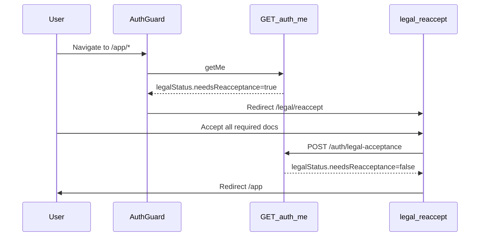

# Legal pack re-acceptance on login

**Pack version:** `2026-06-09`  
**Introduced with:** Deals/Boosts legal terminology update + login gate

---

## 1. Why

When `LEGAL_PACK_VERSION` bumps (web + API must match), existing users must review and accept the current legal documents before continuing to use the app. This avoids silent acceptance of outdated terms after copy changes.

---

## 2. How it works



### Status check (`GET /auth/me`)

Response includes `legalStatus`:

| Field                 | Description                                      |
| --------------------- | ------------------------------------------------ |
| `needsReacceptance`   | `true` if any required document missing or stale |
| `currentPackVersion`  | Active pack (`2026-06-09`)                       |
| `acceptedPackVersion` | User’s latest version if uniform, else `null`    |
| `requiredDocuments`   | Slugs user must accept                           |
| `missingDocuments`    | Slugs not at current version                     |
| `variant`             | `registration` or `invite` (controls UI panel)   |
| `accountType`         | `RESTAURANT`, `SUPPLIER`, or `null`              |

### Recording acceptance (`POST /auth/legal-acceptance`)

Body (same shape as registration):

```json
{
  "legalAcceptance": {
    "packVersion": "2026-06-09",
    "acceptedDocuments": ["terms_and_conditions", "..."],
    "electronicSignatureAttestation": true
  }
}
```

Inserts rows in `legal_acceptance` with `context = 'login_refresh'`.

---

## 3. Which documents are required?

Resolved per user from acceptance history + role:

| User profile                                                | Required pack                                                                      |
| ----------------------------------------------------------- | ---------------------------------------------------------------------------------- |
| Registered supplier/restaurant (has `registration` context) | Full registration pack for that tenant type (7 docs incl. role agreement + mobile) |
| Restaurant/supplier without registration rows               | Registration pack from workspace `tenantType`                                      |
| Admin, staff portal, invite-only users                      | Core invite pack (terms, privacy, AUP, DPA, cookies)                               |

Implementation: `resolveRequiredLegalDocuments()` in `apps/api/src/lib/legal-acceptance.js`.

---

## 4. Frontend

| Item         | Path                                                            |
| ------------ | --------------------------------------------------------------- |
| Gate         | `apps/web/src/components/AuthGuard.tsx`, `StaffPortalGuard.tsx` |
| Page         | `apps/web/src/pages/LegalReacceptPage.tsx` → `/legal/reaccept`  |
| Helper       | `apps/web/src/lib/legalReacceptanceGate.ts`                     |
| API mutation | `useSubmitLegalReacceptanceMutation`                            |

**Excluded from gate:** `PENDING` users (still go to `/register/complete`), public routes, `/legal/*` document reading.

---

## 5. Backend

| Item            | Path                                                                        |
| --------------- | --------------------------------------------------------------------------- |
| Pack version    | `apps/web/src/lib/legalDocuments.ts`, `apps/api/src/lib/legal-documents.js` |
| Status + record | `apps/api/src/lib/legal-acceptance.js`                                      |
| Routes          | `apps/api/src/routes/auth.routes.js` (`/me`, `/legal-acceptance`)           |

Validation rejects stale `packVersion` in payload (same as registration).

---

## 6. Database

Uses existing `legal_acceptance` table (migration `0129`). No new migration.

| Column             | Re-accept usage                           |
| ------------------ | ----------------------------------------- |
| `document_version` | Stores pack version string (`2026-06-09`) |
| `context`          | `login_refresh` for re-acceptance rows    |
| `document_slug`    | Which document was accepted               |

Latest row per slug determines current acceptance.

---

## 7. QA checklist

- [ ] User on pack `2026-05-28` → login → redirected to `/legal/reaccept`
- [ ] After accept → reaches `/app` normally
- [ ] `GET /auth/me` → `legalStatus.needsReacceptance: false`
- [ ] Staff portal user on stale pack → `/legal/reaccept` before dashboard
- [ ] `PENDING` user → `/register/complete`, not re-accept
- [ ] New registration still uses `context = registration`
- [ ] Stale `packVersion` in POST body → 400 validation error
- [ ] Web + API `LEGAL_PACK_VERSION` strings identical

---

## 8. Bumping the pack again

1. Update static legal markdown under `apps/web/static/legal/`.
2. Set **same** new version in `legalDocuments.ts` and `legal-documents.js`.
3. Deploy **API and Web together**.
4. All users not on the new version will hit `/legal/reaccept` on next app visit.

Do not change version in only one service.
